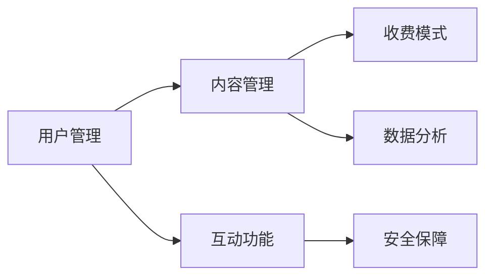

                 

关键词：知识付费、私密社群、程序员、社区搭建、技术指南、安全隐私、用户参与

> 摘要：本文将探讨程序员如何利用技术手段打造一个知识付费的私密社群。通过分析社区搭建的核心要素、隐私保护策略、用户参与方式，以及相关工具和资源推荐，为程序员提供一套全面的技术指南。

## 1. 背景介绍

随着互联网的快速发展，知识付费逐渐成为了一个热门的行业。程序员作为知识密集型行业的从业者，也在积极投身于知识付费领域，希望通过构建私密社群来实现知识的共享与变现。私密社群不仅可以提高用户粘性，还能为会员提供更加个性化的服务。

然而，打造一个成功的私密社群并非易事。程序员需要掌握多种技术手段，确保社群的安全性、可靠性和用户体验。本文将结合实际案例，为广大程序员提供一套系统化的技术指南。

## 2. 核心概念与联系

### 2.1 社区搭建的核心要素

构建一个知识付费的私密社群，首先需要明确其核心要素：

- **用户管理**：包括用户注册、认证、权限管理等功能，确保社群成员的身份和权限。

- **内容管理**：包括文章、视频、音频等知识内容的发布、分类、检索和管理，确保内容的质量和可用性。

- **互动功能**：包括评论、点赞、私信等社交互动功能，促进用户之间的交流和互动。

- **收费模式**：包括会员制、订阅制、单次购买等，满足不同用户的需求。

- **安全保障**：包括数据加密、访问控制、备份与恢复等，保障用户隐私和数据安全。

### 2.2 社群架构图

以下是一个简化的私密社群架构图，用于展示各个核心要素之间的关系：



## 3. 核心算法原理 & 具体操作步骤

### 3.1 算法原理概述

私密社群的构建涉及到多种技术，其中核心算法原理包括：

- **用户认证算法**：基于密码学原理，确保用户身份的合法性和唯一性。

- **加密算法**：对用户数据、会话信息等进行加密，防止数据泄露。

- **权限控制算法**：根据用户角色和权限，控制对内容的访问权限。

### 3.2 算法步骤详解

#### 3.2.1 用户认证算法

1. 用户输入用户名和密码。
2. 系统将用户名和密码发送至后端服务器。
3. 后端服务器使用哈希算法对密码进行加密。
4. 将加密后的密码与数据库中存储的密码进行比对。
5. 如果密码匹配，则允许用户登录。

#### 3.2.2 加密算法

1. 用户登录后，系统生成一个会话密钥。
2. 使用对称加密算法（如AES）对会话密钥进行加密。
3. 将加密后的会话密钥发送至客户端。
4. 客户端使用私有密钥对加密后的会话密钥进行解密。
5. 使用解密后的会话密钥进行后续通信。

#### 3.2.3 权限控制算法

1. 系统根据用户角色和权限，定义访问控制列表（ACL）。
2. 用户访问内容时，系统比对访问控制列表，判断用户是否有权限。
3. 如果用户有权限，则允许访问；否则，拒绝访问。

### 3.3 算法优缺点

- **用户认证算法**：优点是简单易用，缺点是安全性较低，容易遭受暴力破解攻击。
- **加密算法**：优点是安全性高，缺点是加密和解密过程较复杂，影响性能。
- **权限控制算法**：优点是灵活性强，缺点是实现较复杂，需要详细设计权限体系。

### 3.4 算法应用领域

这些算法广泛应用于各种私密社群，如在线教育平台、企业内部社区、私密论坛等。

## 4. 数学模型和公式 & 详细讲解 & 举例说明

### 4.1 数学模型构建

#### 4.1.1 用户认证模型

假设用户名和密码的长度分别为 \( n_1 \) 和 \( n_2 \)，则用户认证模型可以表示为：

\[ U = \{ (u, p) | u \in \{1, 2, \ldots, n_1\}, p \in \{1, 2, \ldots, n_2\} \} \]

其中，\( u \) 表示用户名，\( p \) 表示密码。

#### 4.1.2 加密模型

假设会话密钥的长度为 \( n \)，加密模型可以表示为：

\[ K = \{ k | k \in \{1, 2, \ldots, n\} \} \]

其中，\( k \) 表示会话密钥。

### 4.2 公式推导过程

#### 4.2.1 用户认证公式

用户认证过程中，后端服务器将用户输入的密码通过哈希函数 \( H \) 进行加密，得到加密后的密码 \( H(p) \)。然后，将 \( H(p) \) 与数据库中存储的密码进行比对，判断是否匹配。

\[ H(p) = H(U) \]

其中，\( H(U) \) 表示数据库中存储的加密后的密码。

#### 4.2.2 加密公式

假设使用对称加密算法 \( E \) 进行加密，加密公式可以表示为：

\[ C = E(K, M) \]

其中，\( C \) 表示加密后的数据，\( K \) 表示会话密钥，\( M \) 表示原始数据。

### 4.3 案例分析与讲解

#### 4.3.1 用户认证案例分析

假设用户名为 "user1"，密码为 "password"，哈希函数为 SHA-256。则用户认证过程如下：

1. 用户输入用户名和密码。
2. 后端服务器将密码通过 SHA-256 进行加密，得到加密后的密码为 "sha256(password)"。
3. 后端服务器将加密后的密码与数据库中存储的密码进行比对，判断是否匹配。

#### 4.3.2 加密案例分析

假设会话密钥为 "sessionkey"，原始数据为 "data"，加密算法为 AES。则加密过程如下：

1. 使用 AES 算法对会话密钥进行加密，得到加密后的会话密钥为 "aes(sessionkey)"。
2. 使用 AES 算法对原始数据进行加密，得到加密后的数据为 "aes(data)"。

## 5. 项目实践：代码实例和详细解释说明

### 5.1 开发环境搭建

在本项目中，我们使用 Python 作为开发语言，搭建了一个简单的知识付费私密社群。以下是开发环境的搭建步骤：

1. 安装 Python 3.8 以上版本。
2. 安装 Flask 框架：`pip install flask`
3. 安装 SQLAlchemy：`pip install sqlalchemy`
4. 安装 Flask-Migrate：`pip install flask-migrate`

### 5.2 源代码详细实现

以下是一个简单的用户认证和加密的代码示例：

```python
from flask import Flask, request, jsonify
from flask_sqlalchemy import SQLAlchemy
from itsdangerous import TimedJSONWebToken, BadSignature, SignatureExpired
import hashlib, base64

app = Flask(__name__)
app.config['SQLALCHEMY_DATABASE_URI'] = 'sqlite:///users.db'
db = SQLAlchemy(app)

class User(db.Model):
    id = db.Column(db.Integer, primary_key=True)
    username = db.Column(db.String(80), unique=True, nullable=False)
    password_hash = db.Column(db.String(120), nullable=False)

@app.route('/register', methods=['POST'])
def register():
    username = request.form['username']
    password = request.form['password']
    password_hash = hashlib.sha256(password.encode()).hexdigest()
    user = User(username=username, password_hash=password_hash)
    db.session.add(user)
    db.session.commit()
    return jsonify({'message': '注册成功'})

@app.route('/login', methods=['POST'])
def login():
    username = request.form['username']
    password = request.form['password']
    user = User.query.filter_by(username=username).first()
    if user and hashlib.sha256(password.encode()).hexdigest() == user.password_hash:
        token = TimedJSONWebToken.dumps({'id': user.id})
        return jsonify({'token': token})
    return jsonify({'error': '用户名或密码错误'})

@app.route('/protected', methods=['GET'])
def protected():
    token = request.headers.get('Authorization')
    try:
        data = TimedJSONWebToken.loads(token)
        user = User.query.get(data['id'])
        return jsonify({'message': '欢迎，' + user.username})
    except (BadSignature, SignatureExpired):
        return jsonify({'error': '无效的 token'})

if __name__ == '__main__':
    db.create_all()
    app.run(debug=True)
```

### 5.3 代码解读与分析

1. **数据库模型**：定义了用户表 `User`，包含 `id`、`username` 和 `password_hash` 字段。

2. **用户注册**：接收用户名和密码，将密码通过 SHA-256 加密，然后存储到数据库中。

3. **用户登录**：接收用户名和密码，通过 SHA-256 加密密码，与数据库中的密码进行比对，生成 JWT 令牌。

4. **受保护的资源**：使用 JWT 令牌进行身份验证，验证通过后，返回用户欢迎信息。

### 5.4 运行结果展示

1. **用户注册**：在浏览器中访问 `http://127.0.0.1:5000/register`，输入用户名和密码，注册成功后，会返回 JSON 格式的响应。

2. **用户登录**：在浏览器中访问 `http://127.0.0.1:5000/login`，输入用户名和密码，登录成功后，会返回 JWT 令牌。

3. **访问受保护的资源**：在浏览器中访问 `http://127.0.0.1:5000/protected`，将 JWT 令牌作为请求头发送，验证通过后，会返回用户欢迎信息。

## 6. 实际应用场景

### 6.1 在线教育平台

在线教育平台可以构建私密社群，为会员提供独家课程、讲义和问答服务。通过私密社群，提高用户粘性和满意度。

### 6.2 企业内部社区

企业内部社区可以构建私密社群，促进员工之间的知识共享和交流。通过私密社群，加强企业文化建设和团队协作。

### 6.3 专业论坛

专业论坛可以构建私密社群，为会员提供高质量的问答和讨论环境。通过私密社群，吸引专业用户，提高论坛影响力。

## 7. 工具和资源推荐

### 7.1 学习资源推荐

- 《Flask Web开发：让Python编程更简单》
- 《Python编程快速上手》

### 7.2 开发工具推荐

- Visual Studio Code
- PyCharm

### 7.3 相关论文推荐

- "A Survey on Cryptographic Protocols for Secure Communication"
- "Access Control Models and Mechanisms for Multi-Tenant Cloud Applications"

## 8. 总结：未来发展趋势与挑战

### 8.1 研究成果总结

本文探讨了程序员如何利用技术手段打造知识付费的私密社群，涵盖了社区搭建的核心要素、核心算法原理、数学模型和公式、项目实践等多个方面。

### 8.2 未来发展趋势

随着技术的不断进步，知识付费的私密社群将向更加智能化、个性化、安全化的方向发展。

### 8.3 面临的挑战

私密社群在发展过程中将面临数据安全、隐私保护、用户参与度等挑战。

### 8.4 研究展望

未来，研究人员将继续探索更高效、更安全的加密算法和权限控制方法，以应对私密社群面临的挑战。

## 9. 附录：常见问题与解答

### 9.1 如何保护用户隐私？

- 使用加密算法对用户数据进行加密。
- 限制用户权限，防止数据泄露。
- 定期进行安全审计和风险评估。

### 9.2 如何提高用户参与度？

- 设计具有吸引力的互动功能。
- 定期举办线上活动，增加用户粘性。
- 提供个性化的内容推荐和反馈。

### 9.3 如何应对恶意用户？

- 制定社区规范，明确用户行为准则。
- 设立举报和投诉机制，及时处理恶意行为。
- 加强账号验证，防止恶意注册。

---

作者：禅与计算机程序设计艺术 / Zen and the Art of Computer Programming

[本文完]

