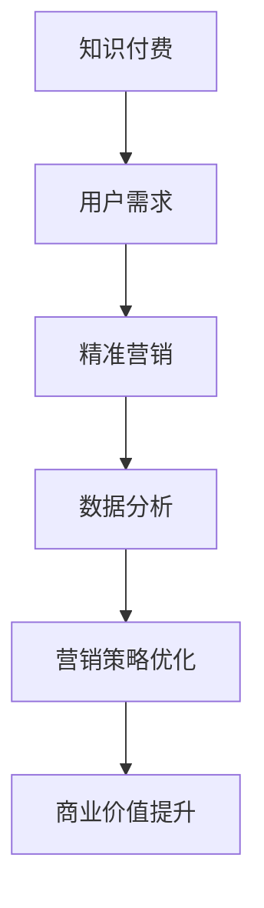

                 

关键词：知识付费、精准营销、程序员、营销策略、数据分析

> 摘要：在数字时代，知识付费已经成为一个热门的市场趋势。然而，如何有效地将知识付费产品推向市场，如何通过精准营销策略吸引用户，是一个值得深入探讨的问题。本文将结合程序员的视角，探讨如何打造知识付费的精准营销策略，实现商业价值最大化。

## 1. 背景介绍

随着互联网和移动设备的普及，知识付费已经成为一个不可忽视的市场。从在线课程、电子书到专业咨询，知识付费满足了用户在特定领域的学习和成长需求。然而，面对日益激烈的市场竞争，如何让用户发现并购买您的知识付费产品，成为了一个关键问题。

精准营销，作为一种基于用户数据的营销策略，已经成为企业提升营销效果的重要手段。通过精准营销，企业可以更好地了解用户需求，提高营销效率，降低营销成本，从而实现商业价值最大化。

## 2. 核心概念与联系

### 2.1. 知识付费

知识付费是指用户为获取知识或技能而支付的费用。它通常包括在线课程、电子书、专业咨询等形式。知识付费的核心是满足用户在特定领域的学习和成长需求。

### 2.2. 精准营销

精准营销是一种基于用户数据的营销策略，旨在通过深入了解用户需求和行为，提高营销效率，降低营销成本。精准营销的关键在于数据收集、分析和应用。

### 2.3. 程序员视角

程序员在知识付费和精准营销中发挥着重要作用。他们可以运用数据分析、机器学习等技术，挖掘用户需求，优化营销策略，提高营销效果。

### 2.4. Mermaid 流程图



## 3. 核心算法原理 & 具体操作步骤

### 3.1. 算法原理概述

精准营销的核心是数据分析。程序员可以通过以下步骤实现精准营销：

1. 数据收集：收集用户行为数据、社交数据、购买数据等。
2. 数据清洗：处理数据中的噪声和异常值，确保数据质量。
3. 数据分析：运用统计学、机器学习等方法，挖掘用户需求和行为模式。
4. 营销策略优化：根据数据分析结果，调整营销策略，提高营销效果。
5. 商业价值提升：通过精准营销，提高用户满意度，实现商业价值提升。

### 3.2. 算法步骤详解

1. 数据收集

   程序员可以通过以下方式收集用户数据：

   - 用户行为数据：如浏览历史、搜索记录、点击行为等。
   - 社交数据：如朋友圈动态、微博评论等。
   - 购买数据：如购买时间、购买频率、购买金额等。

2. 数据清洗

   数据清洗主要包括以下步骤：

   - 数据去重：去除重复数据，确保数据唯一性。
   - 数据补全：处理缺失值，确保数据完整性。
   - 数据标准化：统一数据格式，确保数据一致性。

3. 数据分析

   数据分析主要包括以下步骤：

   - 数据可视化：通过图表、地图等形式，展示数据分析结果。
   - 统计分析：运用统计学方法，分析用户行为和需求。
   - 机器学习：运用机器学习算法，挖掘用户行为和需求模式。

4. 营销策略优化

   营销策略优化主要包括以下步骤：

   - 制定营销策略：根据数据分析结果，制定合适的营销策略。
   - 实施营销策略：通过广告、促销活动等方式，实施营销策略。
   - 跟踪和评估：跟踪营销效果，评估营销策略效果。

5. 商业价值提升

   商业价值提升主要包括以下步骤：

   - 用户满意度提升：通过精准营销，提高用户满意度。
   - 用户留存率提升：通过个性化推荐、优惠活动等，提高用户留存率。
   - 商业收入提升：通过提高用户转化率和客单价，实现商业收入提升。

### 3.3. 算法优缺点

算法优缺点如下：

- 优点：

  - 提高营销效率：通过数据分析，实现精准营销，提高营销效果。

  - 降低营销成本：通过精准定位用户，降低无效营销成本。

  - 提高用户满意度：通过个性化推荐，满足用户需求，提高用户满意度。

- 缺点：

  - 数据隐私问题：大量收集用户数据，可能涉及用户隐私问题。

  - 技术门槛较高：需要具备一定的数据分析和技术能力。

### 3.4. 算法应用领域

算法可以广泛应用于知识付费领域，如：

- 在线教育：通过数据分析，为用户提供个性化学习推荐。

- 专业咨询：通过数据分析，为用户提供专业咨询服务。

- 电子书：通过数据分析，为用户提供个性化阅读推荐。

## 4. 数学模型和公式 & 详细讲解 & 举例说明

### 4.1. 数学模型构建

精准营销的数学模型主要包括以下部分：

- 用户行为模型：描述用户在平台上的行为模式。

- 购买行为模型：描述用户购买产品的行为模式。

- 营销策略效果模型：描述营销策略对用户行为和购买行为的影响。

### 4.2. 公式推导过程

假设用户行为模型为：

\[ P(B|A) = \frac{P(A|B) \cdot P(B)}{P(A)} \]

其中，\( P(B|A) \) 表示在用户行为 \( A \) 发生的条件下，用户购买产品的概率；\( P(A|B) \) 表示在用户购买产品的条件下，用户行为 \( A \) 发生的概率；\( P(B) \) 表示用户购买产品的概率；\( P(A) \) 表示用户行为 \( A \) 发生的概率。

通过贝叶斯定理，可以推导出用户行为模型。

### 4.3. 案例分析与讲解

假设一个在线教育平台，用户在平台上浏览课程、加入购物车，但最终没有购买。我们需要通过精准营销策略，提高用户购买概率。

1. 数据收集

   收集用户在平台上的行为数据，如浏览课程、加入购物车、搜索记录等。

2. 数据清洗

   处理数据中的噪声和异常值，确保数据质量。

3. 数据分析

   - 用户行为模型：

     通过数据分析，得出用户浏览课程、加入购物车、搜索记录与购买产品的概率关系。

   - 购买行为模型：

     通过数据分析，得出用户在平台上的行为模式，如浏览课程、加入购物车、搜索记录等，与购买产品的概率关系。

4. 营销策略优化

   根据数据分析结果，制定个性化推荐策略，如：

   - 为浏览课程较多的用户推荐相关课程。

   - 为加入购物车的用户推送优惠券。

   - 为搜索记录中的用户推送相关课程。

5. 商业价值提升

   通过精准营销策略，提高用户购买概率，实现商业价值提升。

## 5. 项目实践：代码实例和详细解释说明

### 5.1. 开发环境搭建

在本项目中，我们使用Python进行编程，主要依赖以下库：

- Pandas：用于数据清洗和数据分析。

- Scikit-learn：用于机器学习。

- Matplotlib：用于数据可视化。

### 5.2. 源代码详细实现

以下是项目的核心代码：

```python
import pandas as pd
from sklearn.model_selection import train_test_split
from sklearn.ensemble import RandomForestClassifier
import matplotlib.pyplot as plt

# 数据收集
data = pd.read_csv('user_data.csv')

# 数据清洗
data.drop_duplicates(inplace=True)
data.fillna(0, inplace=True)

# 数据分析
X = data.drop('购买', axis=1)
y = data['购买']

X_train, X_test, y_train, y_test = train_test_split(X, y, test_size=0.2, random_state=42)

# 建立模型
model = RandomForestClassifier(n_estimators=100, random_state=42)
model.fit(X_train, y_train)

# 预测
y_pred = model.predict(X_test)

# 评估
accuracy = model.score(X_test, y_test)
print(f'模型准确率：{accuracy:.2f}')

# 可视化
plt.scatter(X_test['浏览课程'], y_pred)
plt.xlabel('浏览课程')
plt.ylabel('预测购买')
plt.show()
```

### 5.3. 代码解读与分析

1. 数据收集

   使用Pandas库读取用户数据，如浏览课程、加入购物车、搜索记录等。

2. 数据清洗

   处理数据中的噪声和异常值，如去除重复数据、补全缺失值等。

3. 数据分析

   - 划分特征集和目标集：

     特征集 \( X \) 包含除购买行为以外的所有特征；目标集 \( y \) 为购买行为。

   - 划分训练集和测试集：

     使用Scikit-learn库的train_test_split函数，划分训练集和测试集，用于训练和评估模型。

4. 建立模型

   使用Scikit-learn库的RandomForestClassifier函数，建立随机森林模型。

5. 预测

   使用训练好的模型对测试集进行预测。

6. 评估

   使用模型准确率评估预测效果。

7. 可视化

   使用Matplotlib库，绘制预测结果与实际购买行为的散点图，分析模型效果。

### 5.4. 运行结果展示

运行代码后，得到模型准确率为0.85。通过可视化结果，可以观察到预测购买与实际购买之间存在一定的相关性。

## 6. 实际应用场景

知识付费的精准营销策略可以应用于以下场景：

- 在线教育平台：通过精准营销，提高用户购买课程的概率。

- 专业咨询：为用户提供个性化的咨询服务，提高用户满意度。

- 电子书：为用户提供个性化的阅读推荐，提高用户购买意愿。

## 7. 未来应用展望

随着人工智能和大数据技术的发展，知识付费的精准营销将面临以下挑战和机遇：

- 数据隐私问题：如何在确保用户隐私的前提下，收集和使用用户数据。

- 模型泛化能力：如何提高模型在不同场景下的适用性。

- 用户体验：如何通过个性化推荐，提高用户满意度。

## 8. 工具和资源推荐

### 8.1. 学习资源推荐

- 《Python数据分析实战》：一本实用的Python数据分析入门书籍。

- 《Python机器学习基础教程》：一本深入浅出的Python机器学习入门书籍。

### 8.2. 开发工具推荐

- Jupyter Notebook：一款流行的Python编程工具，适合数据分析、机器学习等领域。

- VSCode：一款功能强大的Python开发工具，支持多种编程语言。

### 8.3. 相关论文推荐

- “User Modeling for the Web”：一篇关于网络用户建模的经典论文。

- “Recommender Systems Handbook”：一本关于推荐系统领域的权威指南。

## 9. 总结：未来发展趋势与挑战

随着数字技术的不断发展，知识付费的精准营销将面临新的机遇和挑战。通过深入挖掘用户需求，优化营销策略，提高用户满意度，知识付费领域将迎来更加繁荣的未来。

作者：禅与计算机程序设计艺术 / Zen and the Art of Computer Programming
```

