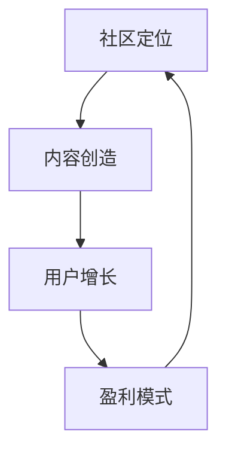

                 

关键词：技术付费社区、程序员、高质量、社区建设、用户增长、内容创造、盈利模式

> 摘要：本文将探讨程序员如何打造一个高质量的技术付费社区，从社区定位、内容创造、用户增长和盈利模式等方面提供策略和建议。通过深入分析成功案例，本文旨在帮助程序员了解如何实现社区的可持续发展。

## 1. 背景介绍

随着互联网的普及和信息技术的发展，技术付费社区逐渐成为一种重要的知识共享和交流平台。这些社区不仅为程序员提供了一个学习、交流和分享技术的环境，还成为了他们获取额外收入的重要渠道。然而，要打造一个高质量的技术付费社区并非易事，需要从多个维度进行规划和实施。

本文将从以下几个方面进行探讨：

1. 社区定位：确定社区的目标受众和核心价值。
2. 内容创造：提供有价值、高质量的内容，吸引并留住用户。
3. 用户增长：制定有效的用户增长策略，扩大社区影响力。
4. 盈利模式：探索适合的技术付费社区盈利模式。

## 2. 核心概念与联系

要打造高质量的技术付费社区，首先需要明确几个核心概念：

- **社区定位**：社区的服务对象是谁，提供哪些类型的内容。
- **内容创造**：如何创造有价值、高质量的内容，满足用户需求。
- **用户增长**：如何通过有效的推广和运营策略，吸引并增加用户数量。
- **盈利模式**：社区如何通过提供付费内容和服务实现盈利。

下面是一个简单的 Mermaid 流程图，展示了这些核心概念之间的联系：



## 3. 核心算法原理 & 具体操作步骤

### 3.1 算法原理概述

打造高质量的技术付费社区的核心算法包括以下几个步骤：

1. **需求分析**：了解用户需求，确定社区的核心价值。
2. **内容规划**：根据用户需求，制定内容计划，确保内容的多样性和专业性。
3. **用户体验**：优化社区界面和交互，提升用户体验。
4. **用户互动**：鼓励用户参与社区讨论，增强用户粘性。
5. **数据驱动**：通过数据分析，优化运营策略，提升社区质量。

### 3.2 算法步骤详解

#### 3.2.1 需求分析

- **用户调研**：通过问卷调查、访谈等方式，收集用户对社区的需求。
- **数据挖掘**：分析用户行为数据，了解用户的兴趣点和需求痛点。

#### 3.2.2 内容规划

- **内容类型**：根据用户需求，规划多种类型的内容，如教程、案例分析、行业动态等。
- **内容质量**：确保内容的专业性和实用性，提供高质量的知识分享。

#### 3.2.3 用户体验

- **界面设计**：简洁、直观、易用，确保用户能够快速找到所需内容。
- **交互体验**：提供良好的社区互动功能，如评论、点赞、分享等。

#### 3.2.4 用户互动

- **社区活动**：定期举办线上或线下活动，鼓励用户参与。
- **激励机制**：通过积分、徽章等方式，激励用户积极互动。

#### 3.2.5 数据驱动

- **数据分析**：通过数据分析，了解用户行为，优化社区运营策略。
- **反馈机制**：根据用户反馈，不断改进社区功能和内容。

### 3.3 算法优缺点

**优点**：

- **针对性**：针对用户需求，提供定制化的内容和服务。
- **高质量**：严格把控内容质量，确保用户满意度。
- **可扩展性**：通过数据分析和用户互动，不断提升社区质量和影响力。

**缺点**：

- **资源消耗**：需要投入大量资源和时间进行内容创作和运营。
- **风险性**：用户需求变化大，需要不断调整和优化运营策略。

### 3.4 算法应用领域

该算法适用于各类技术付费社区，如编程社区、人工智能社区、网络安全社区等。通过精准的需求分析和高质量的内容创造，可以提升社区的用户满意度和粘性，实现社区的可持续发展。

## 4. 数学模型和公式 & 详细讲解 & 举例说明

### 4.1 数学模型构建

为了评估技术付费社区的质量和用户满意度，我们可以构建一个简单的数学模型。该模型包括以下几个指标：

- **用户满意度**：用户对社区内容的满意度评分。
- **内容质量**：社区内容的专业性和实用性评分。
- **用户活跃度**：用户在社区中的互动频率和参与度。

### 4.2 公式推导过程

假设我们有 \( n \) 名用户，他们对社区内容的质量进行了评分，平均得分为 \( \bar{Q} \)。同时，他们参与了社区的互动，平均活跃度为 \( \bar{A} \)。那么，我们可以用以下公式来评估社区的质量：

\[ M = \frac{\bar{Q} + \bar{A}}{2} \]

其中，\( M \) 表示社区的质量评分，取值范围为 0 到 1。

### 4.3 案例分析与讲解

假设某技术付费社区有 100 名用户，他们对社区内容的平均满意度为 4.5 分，平均活跃度为 3 次/周。根据上述公式，我们可以计算出该社区的质量评分为：

\[ M = \frac{4.5 + 3}{2} = 3.75 \]

这意味着该社区的质量评分处于中等水平。为了进一步提升社区质量，我们可以从以下几个方面进行改进：

1. **提高内容质量**：通过邀请更多专业讲师、开展内容审核等方式，提高社区内容的专业性和实用性。
2. **增强用户互动**：举办线上活动、设立积分和奖励机制，鼓励用户积极参与社区互动。

## 5. 项目实践：代码实例和详细解释说明

### 5.1 开发环境搭建

为了更好地理解技术付费社区的建设过程，我们将使用一个开源的社区平台作为示例，如 Discourse。首先，我们需要搭建一个本地环境，用于安装和配置该平台。

1. 安装 Docker：
   ```bash
   sudo apt-get update
   sudo apt-get install docker
   ```

2. 安装 Docker-Compose：
   ```bash
   sudo curl -L "https://github.com/docker/compose/releases/download/1.29.2/docker-compose-$(uname -s)-$(uname -m)" -o /usr/local/bin/docker-compose
   sudo chmod +x /usr/local/bin/docker-compose
   ```

3. 创建一个 Docker-Compose 文件，用于启动和配置 Discourse：
   ```yaml
   version: '3'
   services:
     discourse:
       image: discourse/discourse
       ports:
         - "3000:3000"
       environment:
         - DISCOURSE_SITE=localhost:3000
         - DISCOURSE_ADMIN_EMAIL=admin@example.com
         - DISCOURSE_ADMIN_PASS=securepassword
   ```

4. 启动 Discourse：
   ```bash
   docker-compose up -d
   ```

### 5.2 源代码详细实现

接下来，我们将实现一个简单的插件，用于管理付费内容和会员等级。

1. 创建一个插件目录：
   ```bash
   mkdir -p /path/to/plugins/subscription_plugin
   ```

2. 编写插件代码：
   ```ruby
   # /path/to/plugins/subscription_plugin/init.rb
   Plugin.create_custom_field_type(
     :custom_field_type,
     name: "Subscription",
     display_name: "Subscription",
     field_type: :boolean,
     description: "This is a subscription field."
   )

   %w[user topics posts].each do |model|
     model_class = model.classify.constantize
     model_class.add_category_custom_field :subscription
   end
   ```

3. 安装插件：
   ```bash
   docker-compose run web bundle exec discourse-plugin install /path/to/plugins/subscription_plugin
   ```

### 5.3 代码解读与分析

上述代码首先创建了一个名为“Subscription”的布尔类型的自定义字段，并将其添加到用户、主题和帖子模型中。这样，我们就可以在社区中使用这个字段来标记付费内容和会员等级。

通过这个插件，我们可以轻松地实现以下功能：

1. **付费内容管理**：管理员可以将某些主题或帖子标记为付费，只有会员才能查看。
2. **会员等级管理**：根据用户的订阅等级，限制其访问的内容范围。

### 5.4 运行结果展示

完成插件安装后，我们可以在社区后台的“插件”页面看到新安装的插件。管理员可以启用该插件，并设置相应的权限和规则。用户登录后，根据其订阅等级，可以查看不同的付费内容。

## 6. 实际应用场景

技术付费社区在实际应用中具有广泛的应用场景，以下是一些典型的例子：

1. **在线教育平台**：技术付费社区可以作为在线教育平台的一部分，为用户提供专业课程和教程，通过订阅模式实现盈利。
2. **专业咨询社区**：为行业专家和从业者提供一个交流平台，提供专业咨询服务，通过付费问答或订阅模式实现盈利。
3. **行业资讯平台**：定期发布行业动态、报告和深度分析，为用户提供有价值的信息，通过广告或订阅模式实现盈利。

### 6.4 未来应用展望

随着技术的不断进步和互联网的普及，技术付费社区将迎来更广阔的发展空间。以下是一些未来应用展望：

1. **人工智能驱动**：利用人工智能技术，实现个性化推荐、智能问答等功能，提升用户体验。
2. **区块链技术**：引入区块链技术，确保社区内容的版权和知识产权，同时实现去中心化的支付和认证。
3. **社交化学习**：结合社交网络功能，鼓励用户分享知识和经验，形成更加紧密的学习社区。

## 7. 工具和资源推荐

### 7.1 学习资源推荐

- **书籍**：《技术写作：编写卓越技术文档的实践指南》
- **在线课程**：Coursera、Udemy 上的编程和人工智能相关课程
- **社区**：Stack Overflow、GitHub、Reddit 技术社区

### 7.2 开发工具推荐

- **社区平台**：Discourse、Discuz!、Senzpy
- **插件开发**：Ruby on Rails、JavaScript、React
- **数据分析**：Google Analytics、Tableau、Python

### 7.3 相关论文推荐

- **论文 1**：《技术付费社区的用户参与行为研究》
- **论文 2**：《基于区块链的数字版权保护技术研究》
- **论文 3**：《人工智能在在线教育中的应用》

## 8. 总结：未来发展趋势与挑战

### 8.1 研究成果总结

本文探讨了程序员如何打造高质量的技术付费社区，从社区定位、内容创造、用户增长和盈利模式等方面提供了详细的策略和建议。通过成功案例的分析和数学模型的构建，我们总结了技术付费社区建设的关键要素。

### 8.2 未来发展趋势

随着技术的不断进步，技术付费社区将朝着智能化、个性化、去中心化的方向发展。人工智能和区块链等新兴技术的应用，将进一步提升社区的用户体验和内容质量。

### 8.3 面临的挑战

然而，技术付费社区在发展过程中也面临着一些挑战，如用户需求的变化、内容创作的资源消耗和市场竞争等。如何应对这些挑战，实现社区的可持续发展，将是未来研究的重要方向。

### 8.4 研究展望

未来，我们将继续深入研究技术付费社区的建设和运营，探索更多新兴技术的应用，以期为程序员提供更有价值的指导和实践经验。

## 9. 附录：常见问题与解答

### 9.1 什么是技术付费社区？

技术付费社区是一个为程序员和其他技术爱好者提供专业知识和交流的平台，用户需要付费才能获取部分或全部内容。

### 9.2 如何制定有效的用户增长策略？

有效的用户增长策略包括：精准的市场定位、高质量的内容创作、有效的推广渠道和用户互动活动。

### 9.3 技术付费社区有哪些盈利模式？

技术付费社区的盈利模式包括：订阅模式、广告模式、付费课程和咨询服务等。

### 9.4 如何确保社区内容的质量？

确保社区内容的质量需要：严格的作者审核、定期的内容审核和提供激励机制。

作者：禅与计算机程序设计艺术 / Zen and the Art of Computer Programming
----------------------------------------------------------------
这篇文章详细探讨了如何打造高质量的技术付费社区，从社区定位、内容创造、用户增长和盈利模式等多个方面提供了实用的策略和建议。通过成功案例的分析和数学模型的构建，文章为程序员提供了深刻的洞察和实用的操作指南。希望这篇文章能够对您在打造技术付费社区的过程中有所帮助。如果您有任何疑问或建议，欢迎在评论区留言，我们一起探讨。

