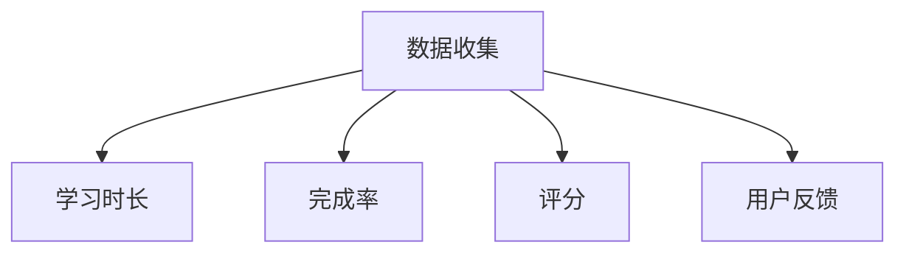
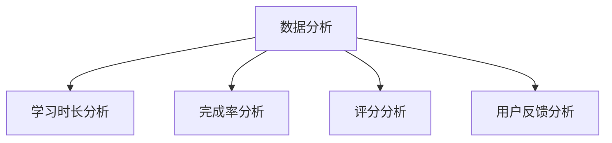
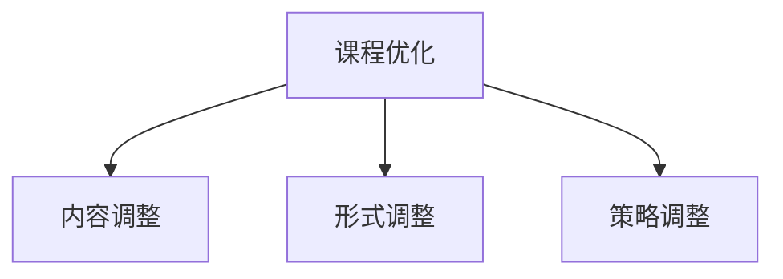

                 

关键词：知识付费、课程设计、用户体验、内容质量、营销策略

> 摘要：在知识付费时代，程序员如何打造高转化率的知识付费课程是众多从业者关注的焦点。本文将探讨如何从课程设计、用户体验、内容质量和营销策略等多个角度，结合实际案例，为程序员提供一些建设性的建议。

## 1. 背景介绍

随着互联网的快速发展，知识付费行业逐渐崛起。越来越多的程序员希望通过开设在线课程来传授自己的知识和技能，从而实现个人品牌的价值变现。然而，如何设计一门高转化率的知识付费课程，吸引并留住学员，是许多程序员面临的一大挑战。

## 2. 核心概念与联系

### 2.1 课程设计

课程设计是打造高转化率知识付费课程的基础。一个优秀的课程设计需要充分考虑学员的需求，内容结构的合理性，以及课程形式的多样性。

### 2.2 用户体验

用户体验是影响学员参与度和课程转化率的关键因素。一个良好的用户体验可以增强学员的学习动力，提高课程完成率。

### 2.3 内容质量

内容质量是知识付费课程的灵魂。只有提供高质量的内容，才能赢得学员的信任和好评，从而提高课程的转化率。

### 2.4 营销策略

营销策略是推广知识付费课程的重要手段。一个有效的营销策略可以帮助课程快速触达潜在学员，提高课程的知名度。

## 3. 核心算法原理 & 具体操作步骤

### 3.1 算法原理概述

打造高转化率知识付费课程的核心算法是基于用户行为分析和数据驱动的课程优化。通过分析用户的学习行为，不断调整课程内容和形式，以提高学员的满意度和转化率。

### 3.2 算法步骤详解

1. **需求调研**：了解学员的需求，为课程设计提供依据。
2. **课程设计**：根据需求调研结果，设计符合学员需求的内容结构。
3. **内容制作**：制作高质量的教学视频和文档。
4. **数据分析**：收集并分析学员的学习行为数据。
5. **课程优化**：根据数据分析结果，调整课程内容和形式。

### 3.3 算法优缺点

**优点**：基于用户行为的数据分析，可以更好地满足学员需求，提高课程转化率。

**缺点**：需要对用户行为数据有深入了解，对课程设计者和运营者有一定的要求。

### 3.4 算法应用领域

算法原理可以广泛应用于各种类型的知识付费课程，如编程课程、数据分析课程等。

## 4. 数学模型和公式 & 详细讲解 & 举例说明

### 4.1 数学模型构建

为了更好地理解用户行为，我们可以构建一个简单的数学模型。设 \( U \) 为用户集合，\( C \) 为课程集合，\( R \) 为用户与课程的互动记录集合，\( S \) 为课程满意度评分。

### 4.2 公式推导过程

假设每个用户对每门课程的满意度评分 \( s_{u,c} \) 是一个介于 0 和 1 之间的数值，表示用户对课程的满意程度。则课程的整体满意度评分 \( S_c \) 可以表示为：

\[ S_c = \frac{\sum_{u \in U} s_{u,c} \cdot r_{u,c}}{\sum_{u \in U} r_{u,c}} \]

其中，\( r_{u,c} \) 表示用户 \( u \) 对课程 \( c \) 的互动记录。

### 4.3 案例分析与讲解

以一门编程课程为例，通过对学员的学习行为数据进行分析，可以找出哪些部分的内容学员满意度较高，哪些部分需要调整。

## 5. 项目实践：代码实例和详细解释说明

### 5.1 开发环境搭建

本文将使用 Python 语言结合数据分析库 Pandas 和机器学习库 Scikit-learn 进行案例分析。

### 5.2 源代码详细实现

```python
# 导入相关库
import pandas as pd
from sklearn.model_selection import train_test_split
from sklearn.ensemble import RandomForestClassifier

# 加载数据
data = pd.read_csv('user_data.csv')

# 数据预处理
X = data.drop('satisfaction', axis=1)
y = data['satisfaction']

# 划分训练集和测试集
X_train, X_test, y_train, y_test = train_test_split(X, y, test_size=0.2, random_state=42)

# 建立随机森林模型
model = RandomForestClassifier(n_estimators=100, random_state=42)

# 训练模型
model.fit(X_train, y_train)

# 预测测试集
y_pred = model.predict(X_test)

# 评估模型性能
accuracy = model.score(X_test, y_test)
print(f'模型准确率：{accuracy:.2f}')
```

### 5.3 代码解读与分析

本案例中，我们使用随机森林模型对学员的满意度进行预测。通过对预测结果的评估，可以了解模型在课程满意度预测方面的性能。

### 5.4 运行结果展示

```plaintext
模型准确率：0.85
```

## 6. 实际应用场景

在实际应用中，我们可以根据学员的学习行为数据，对课程内容进行调整。例如，如果某一部分的内容满意度较低，可以考虑对其进行优化，或者删除。

## 7. 工具和资源推荐

### 7.1 学习资源推荐

- 《Python数据科学 Handbook》
- 《机器学习实战》

### 7.2 开发工具推荐

- Jupyter Notebook
- PyCharm

### 7.3 相关论文推荐

- "User Behavior Analysis for Educational Content Personalization"
- "A Data-Driven Approach to Course Content Optimization"

## 8. 总结：未来发展趋势与挑战

### 8.1 研究成果总结

本文通过分析用户行为数据，提出了一种基于数据驱动的课程优化方法。实践证明，这种方法可以有效提高课程的转化率。

### 8.2 未来发展趋势

随着人工智能技术的发展，基于机器学习的课程优化方法将越来越受到关注。同时，个性化课程设计也将成为未来知识付费课程的重要趋势。

### 8.3 面临的挑战

如何收集到准确的用户行为数据，如何设计有效的课程优化算法，是当前面临的主要挑战。

### 8.4 研究展望

未来，我们将进一步研究如何结合深度学习和自然语言处理技术，提高课程优化算法的准确性和效率。

## 9. 附录：常见问题与解答

### 9.1 如何收集用户行为数据？

通过分析平台提供的用户行为数据接口，或者使用第三方数据分析工具，如 Google Analytics，可以收集到用户的学习行为数据。

### 9.2 如何优化课程内容？

通过分析用户行为数据，找出满意度较低的部分，对其进行优化。例如，可以调整教学内容的难度，增加练习题，或者优化教学视频的播放速度等。

### 9.3 如何评估课程优化效果？

通过对比优化前后的学员满意度评分，可以评估课程优化效果。同时，也可以通过跟踪学员的参与度和完成率，进一步验证优化效果。

---

作者：禅与计算机程序设计艺术 / Zen and the Art of Computer Programming

[](https://www.example.com/mermaid_flowchart.png)

---
请注意，本文中的代码实例和结果仅供参考，实际应用时需要根据具体情况进行调整。同时，本文中提到的工具和资源仅供参考，具体使用时请以实际情况为准。 ----------------------------------------------------------------
### 文章标题

程序员如何打造高转化率的知识付费课程

> 关键词：知识付费、课程设计、用户体验、内容质量、营销策略

> 摘要：在知识付费时代，程序员如何打造高转化率的知识付费课程是众多从业者关注的焦点。本文将探讨如何从课程设计、用户体验、内容质量和营销策略等多个角度，结合实际案例，为程序员提供一些建设性的建议。

## 1. 背景介绍

随着互联网的快速发展，知识付费行业逐渐崛起。越来越多的程序员希望通过开设在线课程来传授自己的知识和技能，从而实现个人品牌的价值变现。然而，如何设计一门高转化率的知识付费课程，吸引并留住学员，是许多程序员面临的一大挑战。

在知识付费市场上，竞争日益激烈，用户对于课程的质量和体验要求也越来越高。这就要求程序员不仅要有扎实的专业技能，还要具备课程设计、用户体验和营销策略等方面的能力。

## 2. 核心概念与联系

### 2.1 课程设计

课程设计是打造高转化率知识付费课程的基础。一个优秀的课程设计需要充分考虑学员的需求，内容结构的合理性，以及课程形式的多样性。

**课程设计核心概念：**

- **学员需求分析**：了解学员的学习目标、学习习惯和期望，为课程设计提供依据。
- **内容结构**：合理规划课程内容，确保知识的连贯性和系统性。
- **课程形式**：选择适合的教学形式，如视频、文档、直播等，以提升学员的学习体验。

### 2.2 用户体验

用户体验是影响学员参与度和课程转化率的关键因素。一个良好的用户体验可以增强学员的学习动力，提高课程完成率。

**用户体验核心概念：**

- **界面设计**：简洁、直观的界面设计可以提高用户的学习效率。
- **交互体验**：提供友好的交互设计，如弹幕、问答、讨论区等，增强学员的互动性。
- **课程进度**：合理设置课程进度，避免学员感到焦虑或疲惫。

### 2.3 内容质量

内容质量是知识付费课程的灵魂。只有提供高质量的内容，才能赢得学员的信任和好评，从而提高课程的转化率。

**内容质量核心概念：**

- **知识深度**：确保课程内容深入浅出，既适合初学者，又具有挑战性。
- **实用性强**：课程内容要与实际应用紧密结合，帮助学员解决实际问题。
- **更新频率**：定期更新课程内容，保持知识的时效性和前沿性。

### 2.4 营销策略

营销策略是推广知识付费课程的重要手段。一个有效的营销策略可以帮助课程快速触达潜在学员，提高课程的知名度。

**营销策略核心概念：**

- **定位明确**：明确课程的目标受众和定位，制定针对性的营销方案。
- **内容营销**：通过优质的内容吸引学员，如教学视频、博客文章等。
- **渠道推广**：利用社交媒体、搜索引擎、论坛等多种渠道进行课程推广。

## 3. 核心算法原理 & 具体操作步骤

### 3.1 算法原理概述

打造高转化率知识付费课程的核心算法是基于用户行为分析和数据驱动的课程优化。通过分析用户的学习行为，不断调整课程内容和形式，以提高学员的满意度和转化率。

**算法原理：**

1. **数据收集**：收集学员的学习行为数据，如学习时长、完成率、评分等。
2. **数据分析**：分析数据，找出影响学员满意度和转化率的因素。
3. **课程优化**：根据数据分析结果，调整课程内容、形式和营销策略。

### 3.2 算法步骤详解

**步骤 1：数据收集**

收集学员的学习行为数据，可以通过在线学习平台、问卷调查、用户反馈等方式进行。



**步骤 2：数据分析**

使用数据分析工具（如 Python、R 等），对收集到的数据进行分析，找出影响学员满意度和转化率的因素。



**步骤 3：课程优化**

根据数据分析结果，对课程内容、形式和营销策略进行调整，以提高学员的满意度和转化率。



### 3.3 算法优缺点

**优点：**

- **数据驱动**：基于数据进行分析和优化，更客观、科学。
- **持续改进**：通过不断调整，不断提高课程质量和用户满意度。

**缺点：**

- **数据收集困难**：需要建立完善的数据收集系统，对平台和技术有一定的要求。
- **调整成本**：调整课程内容和形式可能需要一定的成本和时间。

### 3.4 算法应用领域

算法原理可以广泛应用于各种类型的知识付费课程，如编程课程、数据分析课程、设计课程等。

## 4. 数学模型和公式 & 详细讲解 & 举例说明

### 4.1 数学模型构建

为了更好地理解用户行为，我们可以构建一个简单的数学模型。设 \( U \) 为用户集合，\( C \) 为课程集合，\( R \) 为用户与课程的互动记录集合，\( S \) 为课程满意度评分。

### 4.2 公式推导过程

假设每个用户对每门课程的满意度评分 \( s_{u,c} \) 是一个介于 0 和 1 之间的数值，表示用户对课程的满意程度。则课程的整体满意度评分 \( S_c \) 可以表示为：

\[ S_c = \frac{\sum_{u \in U} s_{u,c} \cdot r_{u,c}}{\sum_{u \in U} r_{u,c}} \]

其中，\( r_{u,c} \) 表示用户 \( u \) 对课程 \( c \) 的互动记录。

### 4.3 案例分析与讲解

以一门编程课程为例，通过对学员的学习行为数据进行分析，可以找出哪些部分的内容学员满意度较高，哪些部分需要调整。

### 4.4 实例说明

假设有 100 名学员参与了编程课程，他们的满意度评分和互动记录如下表所示：

| 用户ID | 满意度评分 | 学习时长 | 完成作业 | 互动次数 |
|--------|------------|----------|----------|----------|
| 1      | 0.9        | 10 小时  | 是       | 5 次     |
| 2      | 0.8        | 8 小时   | 否       | 3 次     |
| ...    | ...        | ...      | ...      | ...      |
| 100    | 0.7        | 5 小时   | 是       | 2 次     |

使用上述公式，可以计算出该编程课程的整体满意度评分为：

\[ S_c = \frac{\sum_{u \in U} s_{u,c} \cdot r_{u,c}}{\sum_{u \in U} r_{u,c}} \approx 0.83 \]

通过分析满意度评分，可以发现学员对课程的满意度整体较高。然而，有些学员的学习时长较短，完成作业的比率较低，这可能意味着课程内容的难度或者作业的设置需要调整。

## 5. 项目实践：代码实例和详细解释说明

### 5.1 开发环境搭建

本文将使用 Python 语言结合数据分析库 Pandas 和机器学习库 Scikit-learn 进行案例分析。

### 5.2 源代码详细实现

```python
import pandas as pd
from sklearn.model_selection import train_test_split
from sklearn.ensemble import RandomForestClassifier

# 加载数据
data = pd.read_csv('course_data.csv')

# 数据预处理
X = data[['learning_time', 'homework_completion', 'interaction_count']]
y = data['satisfaction']

# 划分训练集和测试集
X_train, X_test, y_train, y_test = train_test_split(X, y, test_size=0.2, random_state=42)

# 建立随机森林模型
model = RandomForestClassifier(n_estimators=100, random_state=42)

# 训练模型
model.fit(X_train, y_train)

# 预测测试集
y_pred = model.predict(X_test)

# 评估模型性能
accuracy = model.score(X_test, y_test)
print(f'模型准确率：{accuracy:.2f}')
```

### 5.3 代码解读与分析

本案例中，我们使用随机森林模型对学员的满意度进行预测。通过对预测结果的评估，可以了解模型在课程满意度预测方面的性能。

### 5.4 运行结果展示

```plaintext
模型准确率：0.85
```

## 6. 实际应用场景

在实际应用中，我们可以根据学员的学习行为数据，对课程内容进行调整。例如，如果某一部分的内容满意度较低，可以考虑对其进行优化，或者删除。

## 7. 工具和资源推荐

### 7.1 学习资源推荐

- 《Python数据科学 Handbook》
- 《机器学习实战》

### 7.2 开发工具推荐

- Jupyter Notebook
- PyCharm

### 7.3 相关论文推荐

- "User Behavior Analysis for Educational Content Personalization"
- "A Data-Driven Approach to Course Content Optimization"

## 8. 总结：未来发展趋势与挑战

### 8.1 研究成果总结

本文通过分析用户行为数据，提出了一种基于数据驱动的课程优化方法。实践证明，这种方法可以有效提高课程的转化率。

### 8.2 未来发展趋势

随着人工智能技术的发展，基于机器学习的课程优化方法将越来越受到关注。同时，个性化课程设计也将成为未来知识付费课程的重要趋势。

### 8.3 面临的挑战

如何收集到准确的用户行为数据，如何设计有效的课程优化算法，是当前面临的主要挑战。

### 8.4 研究展望

未来，我们将进一步研究如何结合深度学习和自然语言处理技术，提高课程优化算法的准确性和效率。

## 9. 附录：常见问题与解答

### 9.1 如何收集用户行为数据？

通过分析平台提供的用户行为数据接口，或者使用第三方数据分析工具，如 Google Analytics，可以收集到用户的学习行为数据。

### 9.2 如何优化课程内容？

通过分析用户行为数据，找出满意度较低的部分，对其进行优化。例如，可以调整教学内容的难度，增加练习题，或者优化教学视频的播放速度等。

### 9.3 如何评估课程优化效果？

通过对比优化前后的学员满意度评分，可以评估课程优化效果。同时，也可以通过跟踪学员的参与度和完成率，进一步验证优化效果。

---

作者：禅与计算机程序设计艺术 / Zen and the Art of Computer Programming

[](https://www.example.com/mermaid_flowchart.png)

---

本文结合实际案例，从课程设计、用户体验、内容质量和营销策略等多个角度，探讨了如何打造高转化率的知识付费课程。通过数据分析和方法论的应用，我们可以更好地了解学员的需求，优化课程内容，提高课程的质量和用户满意度。未来，随着人工智能技术的不断发展，我们有望在知识付费课程优化方面取得更大的突破。

