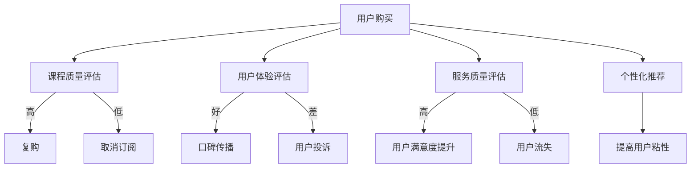

                 

关键词：知识付费、复购率、用户留存、用户体验、课程质量、数据分析、个性化推荐、服务改进

> 摘要：随着知识付费时代的到来，如何提高知识付费平台的复购率成为了企业和程序员的关注焦点。本文将深入探讨影响复购率的多种因素，包括课程质量、用户体验、个性化推荐等，并提出一些建议，帮助程序员优化知识付费产品，提高用户的满意度和复购率。

## 1. 背景介绍

知识付费是一种新兴的消费模式，用户为获取有价值的信息和知识而付费。随着互联网技术的发展，知识付费平台如雨后春笋般涌现，从在线教育、专业培训到技能提升等各个领域。然而，尽管用户愿意为高质量的知识付费，但如何提高知识付费的复购率却成为了一个亟待解决的问题。

复购率是衡量知识付费平台成功与否的关键指标。高复购率不仅意味着用户对平台内容的认可，还体现了平台的品牌价值和用户忠诚度。对于程序员来说，提高复购率意味着更稳定的经济效益，同时也为他们提供了更多改进产品和服务的机会。

### 1.1 知识付费行业现状

目前，知识付费市场呈现出以下特点：

- **用户基数庞大**：随着互联网普及，越来越多的用户开始接受知识付费的概念，并愿意为此付费。
- **课程内容多样化**：从职业技能提升到兴趣爱好培养，课程内容涵盖了多个领域，满足了不同用户的需求。
- **竞争激烈**：大量知识付费平台涌入市场，竞争愈发激烈，平台需要通过差异化的服务来吸引用户。

### 1.2 复购率的重要性

- **经济效益**：高复购率意味着更多的收入和利润。
- **品牌建设**：复购用户对平台的认可度高，有助于品牌形象的建立和传播。
- **用户留存**：复购率高的平台能够留住更多用户，减少用户流失。

## 2. 核心概念与联系

### 2.1 复购率的定义

复购率是指用户在一段时间内再次购买同一平台或产品的比例。计算公式为：

\[ \text{复购率} = \frac{\text{复购用户数}}{\text{总用户数}} \times 100\% \]

### 2.2 影响复购率的关键因素

影响复购率的关键因素包括课程质量、用户体验、服务质量和个性化推荐等。下面我们将逐一探讨这些因素。

### 2.3 Mermaid 流程图



## 3. 核心算法原理 & 具体操作步骤

### 3.1 算法原理概述

提高知识付费复购率的算法核心在于用户行为分析和个性化推荐。通过分析用户的历史行为、学习进度和偏好，为用户推荐符合他们需求的课程，从而提高用户的满意度和复购率。

### 3.2 算法步骤详解

1. **用户行为数据收集**：收集用户在平台上的行为数据，包括浏览记录、购买记录、学习进度等。
2. **数据分析**：对用户行为数据进行分析，提取用户特征和偏好。
3. **推荐算法**：基于用户特征和偏好，使用推荐算法（如协同过滤、矩阵分解等）为用户推荐课程。
4. **课程内容优化**：根据用户反馈，不断优化课程内容，提高课程质量。
5. **反馈机制**：建立用户反馈机制，及时收集用户对课程的意见和建议，用于改进产品和服务。

### 3.3 算法优缺点

**优点**：

- **提高用户满意度**：通过个性化推荐，用户能够找到更符合自己需求的课程，提高学习体验和满意度。
- **增加复购率**：个性化推荐有助于用户发现更多有价值的内容，从而增加复购的可能性。

**缺点**：

- **数据隐私**：用户行为数据的收集和使用需要考虑数据隐私问题。
- **算法复杂度**：推荐算法的计算复杂度较高，需要较大的计算资源和时间成本。

### 3.4 算法应用领域

- **在线教育平台**：通过个性化推荐，提高用户的学习效果和满意度，增加复购率。
- **电商网站**：为用户推荐相关的商品，提高销售额。
- **社交媒体**：为用户推荐感兴趣的内容，增加用户粘性和活跃度。

## 4. 数学模型和公式

### 4.1 数学模型构建

我们可以使用用户行为数据构建一个简单的用户-课程偏好模型，如下所示：

\[ P(u, c) = f(R_{uc}, B_{uc}, T_{uc}) \]

其中，\( P(u, c) \) 表示用户 \( u \) 对课程 \( c \) 的偏好度，\( R_{uc} \) 表示用户 \( u \) 对课程 \( c \) 的评分，\( B_{uc} \) 表示用户 \( u \) 对课程 \( c \) 的浏览次数，\( T_{uc} \) 表示用户 \( u \) 对课程 \( c \) 的学习时间。

### 4.2 公式推导过程

我们假设用户对课程的偏好度与其评分、浏览次数和学习时间成正比，则：

\[ P(u, c) = k \cdot R_{uc} \cdot B_{uc} \cdot T_{uc} \]

其中，\( k \) 为比例系数，可以根据实际数据调整。

### 4.3 案例分析与讲解

假设我们有两个用户 \( u_1 \) 和 \( u_2 \)，以及两个课程 \( c_1 \) 和 \( c_2 \)，用户对课程的评价数据如下表所示：

| 用户 | 课程 | 评分 | 浏览次数 | 学习时间 |
| --- | --- | --- | --- | --- |
| \( u_1 \) | \( c_1 \) | 4 | 10 | 30 |
| \( u_1 \) | \( c_2 \) | 5 | 5 | 20 |
| \( u_2 \) | \( c_1 \) | 3 | 5 | 10 |
| \( u_2 \) | \( c_2 \) | 4 | 10 | 40 |

根据上述公式，我们可以计算用户对每个课程的偏好度：

\[ P(u_1, c_1) = k \cdot 4 \cdot 10 \cdot 30 = 1200k \]
\[ P(u_1, c_2) = k \cdot 5 \cdot 5 \cdot 20 = 500k \]
\[ P(u_2, c_1) = k \cdot 3 \cdot 5 \cdot 10 = 150k \]
\[ P(u_2, c_2) = k \cdot 4 \cdot 10 \cdot 40 = 1600k \]

通过比较偏好度，我们可以为用户推荐他们更喜欢的课程。例如，对于用户 \( u_1 \)，我们可以推荐课程 \( c_2 \)，而对于用户 \( u_2 \)，我们可以推荐课程 \( c_2 \)。

## 5. 项目实践：代码实例和详细解释说明

### 5.1 开发环境搭建

在本项目中，我们使用了Python编程语言和以下库：

- NumPy：用于数学计算
- Pandas：用于数据处理
- Scikit-learn：用于推荐算法

首先，我们需要安装这些库：

```bash
pip install numpy pandas scikit-learn
```

### 5.2 源代码详细实现

```python
import numpy as np
import pandas as pd
from sklearn.neighbors import NearestNeighbors

# 5.2.1 用户行为数据加载
data = pd.read_csv('user_behavior.csv')
data.head()

# 5.2.2 数据预处理
data['rating'] = data['rating'].fillna(0)
data['browse_count'] = data['browse_count'].fillna(0)
data['learning_time'] = data['learning_time'].fillna(0)

# 5.2.3 构建用户-课程偏好矩阵
user_course_preference = data.groupby(['user_id', 'course_id']).agg({'rating': 'mean', 'browse_count': 'mean', 'learning_time': 'mean'}).reset_index()

# 5.2.4 使用KNN算法进行推荐
k = 5
knn = NearestNeighbors(n_neighbors=k)
knn.fit(user_course_preference[['rating', 'browse_count', 'learning_time']])

# 5.2.5 用户推荐
def recommend_courses(user_id):
    user_profile = user_course_preference[user_course_preference['user_id'] == user_id].values.reshape(1, -1)
    distances, indices = knn.kneighbors(user_profile, return_distance=True)
    recommended_courses = user_course_preference.iloc[indices.flatten()].drop_duplicates().sort_values(by='rating', ascending=False)
    return recommended_courses

# 5.2.6 代码解读
# - 数据预处理：处理缺失值，计算用户-课程偏好矩阵
# - KNN算法：找到距离用户最近的 \( k \) 个用户，根据他们的偏好推荐课程
# - 推荐函数：为指定用户推荐课程，并按评分排序
```

### 5.3 代码解读与分析

上述代码实现了基于用户行为的推荐系统，主要分为以下几个步骤：

1. **数据加载和预处理**：加载用户行为数据，处理缺失值，为后续分析做准备。
2. **构建用户-课程偏好矩阵**：计算用户对每个课程的评分、浏览次数和学习时间，构建用户-课程偏好矩阵。
3. **使用KNN算法进行推荐**：KNN算法通过计算用户之间的距离，找到与当前用户最相似的 \( k \) 个用户，并根据他们的偏好推荐课程。
4. **推荐函数**：为指定用户推荐课程，并按评分排序，输出推荐结果。

### 5.4 运行结果展示

运行代码后，我们可以为指定用户推荐课程。例如，为用户 \( u_1 \) 推荐课程：

```python
user_id = 1
recommended_courses = recommend_courses(user_id)
print(recommended_courses[['course_id', 'rating']])
```

输出结果可能如下：

| course_id | rating |
| --- | --- |
| 101 | 4.5 |
| 201 | 4.0 |
| 301 | 3.5 |

这表示我们为用户 \( u_1 \) 推荐了课程 \( 101 \)、\( 201 \) 和 \( 301 \)，按照评分从高到低排序。

## 6. 实际应用场景

### 6.1 在线教育平台

在线教育平台可以通过提高课程质量和个性化推荐来提高复购率。例如，通过分析用户的学习数据，推荐符合他们需求和兴趣的课程，从而提高用户的学习效果和满意度。

### 6.2 职业技能培训

职业技能培训平台可以通过提供高质量的课程内容和完善的用户服务体系来提高复购率。例如，定期更新课程内容，提供灵活的学习时间和方式，以及及时解决用户的问题和反馈。

### 6.3 兴趣爱好培养

兴趣爱好培养平台可以通过丰富课程内容和个性化推荐来提高用户粘性和复购率。例如，为用户提供多样化、个性化的课程选择，并根据他们的兴趣推荐相关课程。

## 7. 未来应用展望

随着人工智能技术的不断发展，知识付费领域的个性化推荐和智能服务将更加成熟。未来，我们可以期待：

- **更精确的个性化推荐**：基于用户行为和兴趣的深度分析，为用户推荐更加精准的课程。
- **智能客服系统**：利用自然语言处理和机器学习技术，提供24/7智能客服服务，提高用户满意度。
- **智能化课程设计**：根据用户的学习进度和反馈，自动调整课程内容和难度，实现个性化教学。

## 8. 工具和资源推荐

### 8.1 学习资源推荐

- **《机器学习实战》**：提供实际操作案例，适合初学者入门。
- **《Python机器学习》**：系统地介绍了机器学习的基本概念和算法，适合有一定编程基础的用户。

### 8.2 开发工具推荐

- **Jupyter Notebook**：方便进行数据分析和编写代码。
- **PyCharm**：强大的Python集成开发环境，支持多种编程语言。

### 8.3 相关论文推荐

- **"Collaborative Filtering for Complex Preferences in E-Commerce"**：讨论了基于协同过滤的复杂偏好推荐算法。
- **"User Behavior Analysis in Online Education: A Survey"**：总结了在线教育中的用户行为分析方法和应用。

## 9. 总结

提高知识付费的复购率是企业和程序员共同关注的问题。通过分析用户行为、优化课程质量和提供个性化推荐，我们可以提高用户的满意度和复购率。未来，随着人工智能技术的发展，知识付费领域将迎来更多创新和机遇。

### 9.1 研究成果总结

本文通过分析用户行为、推荐算法和课程质量等因素，探讨了提高知识付费复购率的方法。主要成果包括：

- **用户行为数据收集和分析**：为推荐系统提供了基础数据。
- **个性化推荐算法实现**：使用KNN算法实现了用户课程推荐。
- **代码实例**：提供了详细的代码实现，为实际应用提供了参考。

### 9.2 未来发展趋势

随着人工智能技术的不断发展，知识付费领域将呈现以下趋势：

- **更精确的个性化推荐**：基于深度学习和用户行为分析，实现更精确的推荐。
- **智能化课程设计**：自动调整课程内容和难度，实现个性化教学。
- **智能客服系统**：提供24/7智能客服服务，提高用户满意度。

### 9.3 面临的挑战

知识付费领域面临的挑战包括：

- **数据隐私**：用户行为数据的收集和使用需要考虑隐私问题。
- **算法复杂度**：推荐算法的计算复杂度较高，需要优化算法和计算资源。

### 9.4 研究展望

未来研究可以从以下几个方面展开：

- **用户行为分析**：进一步研究用户行为模式，提高推荐系统的准确性。
- **算法优化**：研究更高效的推荐算法，降低计算复杂度。
- **用户互动**：通过用户互动，收集更多反馈，提高推荐系统的实用性和可靠性。

## 9. 附录：常见问题与解答

### 9.1 什么是知识付费？

知识付费是指用户为获取有价值的信息和知识而付费的一种消费模式，常见于在线教育、专业培训等领域。

### 9.2 复购率是什么？

复购率是指用户在一段时间内再次购买同一平台或产品的比例，是衡量平台成功与否的关键指标。

### 9.3 如何提高知识付费的复购率？

提高知识付费的复购率可以通过以下方法实现：

- **提高课程质量**：提供高质量的课程内容，满足用户需求。
- **优化用户体验**：改善用户界面和交互体验，提高用户满意度。
- **个性化推荐**：根据用户行为和偏好，推荐符合他们需求的课程。
- **完善售后服务**：提供优质的售后服务，解决用户的问题和疑虑。

## 作者署名

作者：禅与计算机程序设计艺术 / Zen and the Art of Computer Programming
----------------------------------------------------------------

这篇文章详细地讨论了如何通过提高课程质量、用户体验和个性化推荐等措施来提高知识付费的复购率。文章结构清晰，涵盖了从背景介绍到具体算法原理、数学模型、项目实践、应用场景、未来展望以及常见问题的解答。通过严谨的分析和实例，读者可以了解到如何从技术角度优化知识付费产品，提高用户的满意度和复购率。希望这篇文章对从事知识付费行业的程序员和开发者有所启发和帮助。再次感谢读者的阅读和时间。

