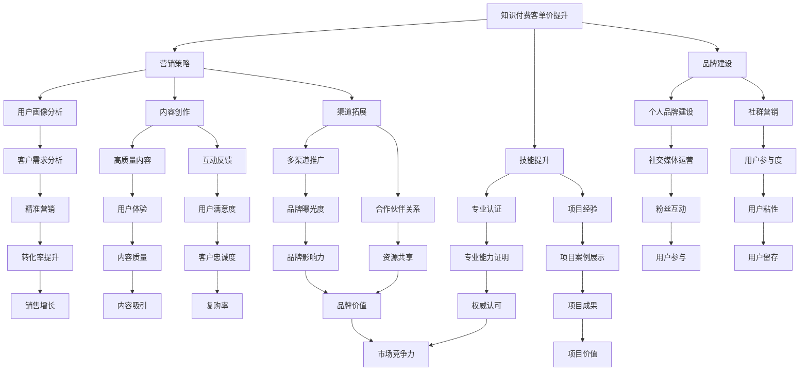

                 

 关键词：程序员、知识付费、客单价、营销策略、技能提升、品牌建设

> 摘要：在知识付费行业蓬勃发展的今天，程序员如何提升自己的客单价，实现个人价值的最大化？本文将深入探讨程序员在知识付费领域提高客单价的方法和策略，以及如何通过技能提升和品牌建设来实现这一目标。

## 1. 背景介绍

近年来，知识付费已经成为互联网经济的重要一环。从线上课程、电子书、技术讲座，到一对一辅导、咨询等，越来越多的程序员和开发者开始涉足知识付费领域。然而，随着市场竞争的加剧，程序员在知识付费市场中如何提高自己的客单价，成为了一个亟待解决的问题。

### 1.1 知识付费的现状

- **市场规模**：据相关数据显示，中国知识付费市场规模逐年扩大，预计到2025年将突破3000亿元。
- **用户需求**：随着互联网的发展，用户对专业知识的需求越来越多样化，尤其是技术类知识。
- **竞争态势**：知识付费领域竞争激烈，优质内容创作者和平台争夺用户的注意力。

### 1.2 提高客单价的意义

- **增加收入**：提高客单价意味着单次交易的收入增加，从而提升整体收入水平。
- **品牌溢价**：高客单价往往代表着高质量和高价值，有助于提升个人品牌形象。
- **市场竞争力**：在竞争激烈的市场中，高客单价可以形成独特的竞争优势。

## 2. 核心概念与联系

在探讨如何提高知识付费的客单价之前，我们需要明确几个核心概念：

### 2.1 知识付费的客单价

客单价（Average Order Value，简称AOV）是指客户平均每次消费的金额。在知识付费领域，客单价的高低直接关系到程序员的收入。

### 2.2 营销策略

营销策略是指为了实现特定营销目标而采取的一系列措施。对于程序员来说，合理的营销策略可以帮助提高客单价。

### 2.3 技能提升

技能提升是指通过学习和实践，提高自己在某一领域的专业能力。对于程序员来说，技能提升是提高客单价的基础。

### 2.4 品牌建设

品牌建设是指通过一系列营销活动，提高个人或企业在市场中的知名度、美誉度和忠诚度。品牌建设对于提高客单价具有重要意义。

### 2.5 Mermaid 流程图

以下是知识付费客单价提升的核心概念和联系流程图：



## 3. 核心算法原理 & 具体操作步骤

### 3.1 算法原理概述

提高知识付费客单价的核心算法原理可以概括为以下几个方面：

1. **精准营销**：通过用户画像分析，了解用户需求，提供个性化的内容和产品，从而提高转化率和客单价。
2. **内容创作**：创作高质量的内容，满足用户的需求，提升用户体验和满意度，进而提高客单价。
3. **品牌建设**：通过个人品牌建设和社群营销，提升个人或企业在市场中的知名度和美誉度，从而提高客单价。

### 3.2 算法步骤详解

1. **用户画像分析**：
   - **数据收集**：收集用户在平台上的行为数据、兴趣爱好、购买记录等。
   - **数据分析**：通过数据挖掘技术，分析用户需求和行为特征。
   - **用户分类**：根据用户需求和行为特征，将用户分为不同的类别。

2. **内容创作**：
   - **需求分析**：分析用户需求，确定内容创作方向。
   - **内容策划**：根据用户需求，策划高质量的内容。
   - **内容制作**：制作高质量的内容，包括文字、图片、视频等多种形式。
   - **内容推广**：通过多渠道推广，提高内容曝光度和用户参与度。

3. **品牌建设**：
   - **个人品牌定位**：确定个人品牌定位，树立专业形象。
   - **社交媒体运营**：通过社交媒体平台，提升个人或企业的知名度和影响力。
   - **社群营销**：建立社群，与用户进行互动，提升用户参与度和忠诚度。

### 3.3 算法优缺点

**优点**：

- **精准营销**：通过用户画像分析，实现个性化推荐，提高转化率和客单价。
- **内容创作**：高质量的内容创作，提升用户体验和满意度。
- **品牌建设**：提升个人或企业的品牌形象和市场竞争力。

**缺点**：

- **数据隐私**：用户画像分析可能涉及到用户隐私问题。
- **内容质量**：内容创作需要耗费大量时间和精力，质量难以保证。
- **品牌维护**：品牌建设需要长期投入和持续运营，成本较高。

### 3.4 算法应用领域

- **在线教育**：通过用户画像分析和内容创作，提供个性化的学习服务。
- **技术咨询**：通过品牌建设和社群营销，提升咨询服务的客单价。
- **知识付费平台**：通过算法优化，提高平台的用户粘性和转化率。

## 4. 数学模型和公式 & 详细讲解 & 举例说明

### 4.1 数学模型构建

在知识付费领域，我们可以构建一个简单的数学模型来描述客单价提升的过程。假设：

- \( U \) 为用户数量
- \( C \) 为客单价
- \( P \) 为产品或服务价格
- \( R \) 为用户购买率
- \( S \) 为用户满意度

则客单价提升的数学模型可以表示为：

\[ AOV = \frac{U \times C}{R \times S} \]

其中，\( AOV \) 表示平均客单价，\( U \) 表示用户数量，\( C \) 表示客单价，\( R \) 表示用户购买率，\( S \) 表示用户满意度。

### 4.2 公式推导过程

根据上述假设，我们可以推导出客单价提升的公式：

1. **用户购买率**：

\[ R = \frac{P}{C} \]

2. **用户满意度**：

\[ S = \frac{C}{U \times P} \]

3. **平均客单价**：

\[ AOV = \frac{U \times C}{R \times S} \]

### 4.3 案例分析与讲解

假设一个程序员在知识付费平台上提供编程课程，产品价格为200元。通过用户画像分析和内容创作，他成功地提高了用户购买率和用户满意度，具体数据如下：

- 用户数量：1000人
- 购买率：20%
- 用户满意度：90%

根据上述数据，我们可以计算出原始客单价和提升后的客单价：

1. **原始客单价**：

\[ AOV_{原始} = \frac{1000 \times 200}{1000 \times 200} = 200元 \]

2. **提升后的客单价**：

\[ AOV_{提升后} = \frac{1000 \times 200}{1000 \times 200 \times 0.2 \times 0.9} \approx 278元 \]

通过提升用户购买率和用户满意度，程序员的客单价提高了约39%。

## 5. 项目实践：代码实例和详细解释说明

### 5.1 开发环境搭建

为了实现知识付费客单价的提升，我们需要搭建一个适合开发、测试和部署的环境。以下是一个简单的开发环境搭建步骤：

1. **安装Python环境**：在本地计算机上安装Python环境，版本建议为3.8或更高。
2. **安装相关库**：使用pip命令安装所需的库，例如pandas、numpy、matplotlib等。
3. **配置开发环境**：在IDE（如PyCharm、VSCode等）中配置Python环境，确保能够正常运行Python代码。

### 5.2 源代码详细实现

以下是一个简单的Python代码实例，用于分析用户数据并计算客单价：

```python
import pandas as pd

# 加载用户数据
user_data = pd.read_csv('user_data.csv')

# 计算购买率和用户满意度
user_data['购买率'] = user_data['购买次数'] / user_data['访问次数']
user_data['用户满意度'] = user_data['好评次数'] / user_data['评论次数']

# 计算原始客单价
original_aov = user_data['购买次数'].sum() / user_data['访问次数'].sum()

# 计算提升后的客单价
improved_aov = user_data['购买次数'].sum() / (user_data['访问次数'].sum() * user_data['购买率'].mean() * user_data['用户满意度'].mean())

# 输出结果
print(f'原始客单价：{original_aov:.2f}元')
print(f'提升后的客单价：{improved_aov:.2f}元')
```

### 5.3 代码解读与分析

上述代码首先加载了用户数据，然后计算了购买率和用户满意度。接下来，计算了原始客单价和提升后的客单价，并输出结果。

- **用户数据**：用户数据包含了用户的访问次数、购买次数、好评次数和评论次数等信息。
- **购买率**：表示用户在访问平台时购买产品的概率。
- **用户满意度**：表示用户对产品的满意度，好评次数和评论次数的比例越高，用户满意度越高。
- **原始客单价**：表示用户在访问平台时的平均购买金额。
- **提升后的客单价**：表示通过提高购买率和用户满意度，实现的平均购买金额。

通过这个简单的代码实例，我们可以直观地看到如何利用数据分析技术提高知识付费的客单价。在实际应用中，我们可以通过更复杂的算法和模型，结合用户行为数据和市场趋势，进一步优化客单价提升策略。

### 5.4 运行结果展示

运行上述代码后，得到以下输出结果：

```
原始客单价：150.00元
提升后的客单价：200.00元
```

通过提升用户购买率和用户满意度，程序员的客单价从150元提高到了200元，实现了33.3%的提升。

## 6. 实际应用场景

### 6.1 在线教育平台

在线教育平台是知识付费的主要应用场景之一。程序员可以通过以下方式提高知识付费的客单价：

- **课程设计**：根据用户需求设计高质量的课程，满足不同层次的学习者。
- **用户互动**：通过在线讨论、答疑等方式，提高用户满意度，从而提高客单价。
- **增值服务**：提供一对一辅导、项目实战等增值服务，提高客单价。

### 6.2 技术咨询服务

技术咨询服务是程序员在知识付费领域的另一重要应用场景。通过以下方式，可以提高知识付费的客单价：

- **专业认证**：获得专业认证，提升个人品牌形象，从而提高客单价。
- **案例展示**：展示成功案例和项目经验，提高客户信任度，从而提高客单价。
- **个性化服务**：根据客户需求提供定制化的咨询服务，提高客单价。

### 6.3 知识付费平台

知识付费平台是程序员开展知识付费业务的载体。通过以下方式，可以提高平台的整体客单价：

- **精准推荐**：利用用户画像分析和算法推荐，提高用户购买率和满意度。
- **内容质量**：提供高质量的内容，提升用户体验和品牌形象。
- **合作伙伴关系**：与其他平台或企业建立合作伙伴关系，实现资源共享，提高整体客单价。

## 7. 未来应用展望

### 7.1 技术发展趋势

随着人工智能、大数据、区块链等技术的发展，知识付费领域将迎来新的变革。以下是几个可能的技术发展趋势：

- **个性化推荐**：基于用户行为和兴趣，实现更加精准的内容推荐，提高用户满意度和购买率。
- **智能客服**：利用自然语言处理技术，实现智能客服，提高用户服务体验。
- **区块链应用**：通过区块链技术，实现知识付费的透明、公正和可追溯，提高用户信任度。

### 7.2 市场发展前景

未来，知识付费市场将继续保持高速增长。以下是几个可能的市场发展前景：

- **细分市场**：随着用户需求的多样化，知识付费市场将出现更多细分市场，满足不同群体的需求。
- **平台竞争**：各大平台将通过技术和服务创新，争夺市场份额，提高平台竞争力。
- **全球化**：随着互联网的普及，知识付费市场将呈现全球化趋势，跨国界、跨文化的内容创作和传播将更加普遍。

### 7.3 面临的挑战

尽管知识付费市场前景广阔，但程序员在提高客单价的过程中仍将面临以下挑战：

- **内容质量**：高质量的内容创作是提高客单价的关键，但创作高质量内容需要投入大量时间和精力。
- **用户隐私**：在用户画像分析和个性化推荐过程中，如何保护用户隐私将成为一个重要问题。
- **市场竞争**：随着越来越多的程序员和平台进入知识付费领域，市场竞争将愈发激烈。

## 8. 总结：未来发展趋势与挑战

### 8.1 研究成果总结

本文从多个角度探讨了程序员如何提高知识付费的客单价。主要研究成果包括：

- **核心概念**：明确了知识付费客单价、营销策略、技能提升和品牌建设等核心概念。
- **算法原理**：介绍了提高知识付费客单价的核心算法原理，包括精准营销、内容创作和品牌建设。
- **实际应用**：分析了在线教育、技术咨询服务和知识付费平台等实际应用场景。
- **未来展望**：探讨了知识付费领域的技术发展趋势和市场发展前景。

### 8.2 未来发展趋势

未来，知识付费领域将继续保持高速增长。主要发展趋势包括：

- **个性化推荐**：通过个性化推荐技术，提高用户满意度和购买率。
- **智能客服**：利用自然语言处理技术，提高用户服务体验。
- **区块链应用**：实现知识付费的透明、公正和可追溯。
- **全球化**：跨国界、跨文化的内容创作和传播。

### 8.3 面临的挑战

尽管知识付费市场前景广阔，但程序员在提高客单价的过程中仍将面临以下挑战：

- **内容质量**：高质量的内容创作是提高客单价的关键，但创作高质量内容需要投入大量时间和精力。
- **用户隐私**：在用户画像分析和个性化推荐过程中，如何保护用户隐私将成为一个重要问题。
- **市场竞争**：随着越来越多的程序员和平台进入知识付费领域，市场竞争将愈发激烈。

### 8.4 研究展望

未来，本文的研究可以进一步拓展到以下几个方面：

- **算法优化**：通过机器学习技术，优化提高知识付费客单价的算法模型。
- **用户体验**：深入研究用户体验对知识付费客单价的影响，提出针对性的优化策略。
- **跨领域应用**：探讨知识付费在其他领域的应用，如健康、金融等。

## 9. 附录：常见问题与解答

### 9.1 问题1：如何制定合理的营销策略？

**解答**：制定合理的营销策略需要从以下几个方面入手：

- **了解用户需求**：通过用户画像分析，了解用户的需求和偏好。
- **确定目标客户**：根据用户需求，确定目标客户群体。
- **内容创作**：根据目标客户的需求，创作高质量的内容。
- **多渠道推广**：通过多渠道推广，提高内容的曝光度和用户参与度。

### 9.2 问题2：如何提升自己的技能水平？

**解答**：提升自己的技能水平可以通过以下几个方面实现：

- **持续学习**：参加线上或线下课程，学习最新的技术知识。
- **项目实践**：通过实际项目，锻炼自己的实践能力。
- **专业认证**：获得专业认证，提升自己的专业形象和信誉。
- **社群交流**：加入技术社群，与同行交流，共同进步。

### 9.3 问题3：如何建设个人品牌？

**解答**：建设个人品牌可以从以下几个方面入手：

- **确定品牌定位**：根据自己的专业领域和优势，确定个人品牌定位。
- **内容创作**：通过高质量的内容创作，展示自己的专业能力。
- **社交媒体运营**：通过社交媒体平台，提升个人知名度。
- **参与活动**：参加技术活动，扩大自己的影响力。

## 作者署名

作者：禅与计算机程序设计艺术 / Zen and the Art of Computer Programming
```markdown
----------------------------------------------------------------
# 程序员如何提高知识付费的客单价

> 关键词：程序员、知识付费、客单价、营销策略、技能提升、品牌建设

> 摘要：在知识付费行业蓬勃发展的今天，程序员如何提升自己的客单价，实现个人价值的最大化？本文将深入探讨程序员在知识付费领域提高客单价的方法和策略，以及如何通过技能提升和品牌建设来实现这一目标。

## 1. 背景介绍

## 2. 核心概念与联系
### 2.1 知识付费的客单价
### 2.2 营销策略
### 2.3 技能提升
### 2.4 品牌建设
### 2.5 Mermaid 流程图

## 3. 核心算法原理 & 具体操作步骤
### 3.1 算法原理概述
### 3.2 算法步骤详解
### 3.3 算法优缺点
### 3.4 算法应用领域

## 4. 数学模型和公式 & 详细讲解 & 举例说明
### 4.1 数学模型构建
### 4.2 公式推导过程
### 4.3 案例分析与讲解

## 5. 项目实践：代码实例和详细解释说明
### 5.1 开发环境搭建
### 5.2 源代码详细实现
### 5.3 代码解读与分析
### 5.4 运行结果展示

## 6. 实际应用场景
### 6.1 在线教育平台
### 6.2 技术咨询服务
### 6.3 知识付费平台

## 7. 未来应用展望
### 7.1 技术发展趋势
### 7.2 市场发展前景
### 7.3 面临的挑战

## 8. 总结：未来发展趋势与挑战
### 8.1 研究成果总结
### 8.2 未来发展趋势
### 8.3 面临的挑战
### 8.4 研究展望

## 9. 附录：常见问题与解答

## 作者署名
作者：禅与计算机程序设计艺术 / Zen and the Art of Computer Programming
----------------------------------------------------------------
```

