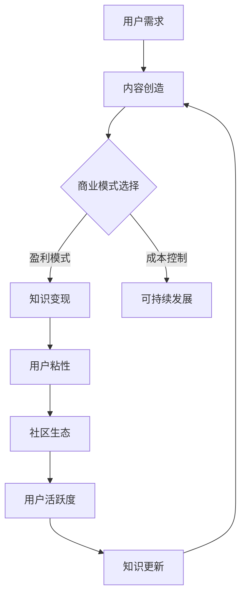

                 

关键词：知识付费、可持续模式、商业模式、程序员、用户体验、技术社区、在线教育

> 摘要：本文将探讨程序员如何利用自身的专业技能和资源，构建可持续的知识付费模式。通过分析当前市场趋势、用户需求以及技术手段，本文提出了几个关键策略，旨在帮助程序员实现知识变现，同时提升用户体验和社区的活跃度。

## 1. 背景介绍

近年来，随着互联网技术的发展和在线教育的兴起，知识付费逐渐成为了一种新兴的商业模式。程序员作为技术领域的专业人士，拥有丰富的知识储备和实践经验，如何将自己的知识转化为收入，成为了许多程序员关心的问题。然而，构建一个可持续的知识付费模式并非易事，它需要程序员不仅具备技术能力，还需要市场洞察力和商业思维。

## 2. 核心概念与联系

在探讨如何构建可持续的知识付费模式之前，我们首先需要明确几个核心概念：

### 2.1 知识付费

知识付费是指用户为获取特定知识或服务而支付的费用。在在线教育领域，知识付费已成为一种主流的商业模式。

### 2.2 用户需求

用户需求是构建知识付费模式的基础。程序员需要了解用户的需求，以便提供有价值的内容。

### 2.3 商业模式

商业模式是指公司如何创造、传递和获取价值。对于程序员来说，构建一个可持续的知识付费模式，需要选择合适的商业模式。

### 2.4 用户粘性

用户粘性是指用户对平台的忠诚度和活跃度。一个可持续的知识付费模式需要能够吸引用户长期参与。

### 2.5 社区生态

社区生态是知识付费平台的重要组成部分。一个健康的社区生态能够促进知识共享和用户活跃。

下面是核心概念原理和架构的 Mermaid 流程图：



## 3. 核心算法原理 & 具体操作步骤

### 3.1 算法原理概述

构建可持续的知识付费模式，需要程序员掌握以下几个关键步骤：

1. **内容定位**：根据用户需求，确定知识内容的方向和深度。
2. **内容创造**：通过专业知识和实践，创造高质量的知识内容。
3. **商业模式设计**：选择适合的商业模式，确保内容创造与用户需求的匹配。
4. **平台运营**：通过用户互动、内容更新等手段，提升用户粘性和社区活跃度。
5. **数据驱动**：利用数据分析，优化商业模式和内容策略。

### 3.2 算法步骤详解

#### 步骤1：内容定位

- 调研用户需求：通过问卷调查、用户访谈等方式，收集用户需求信息。
- 竞争分析：分析竞争对手的内容定位，找到差异化的方向。
- 内容规划：根据调研结果和竞争分析，制定内容规划。

#### 步骤2：内容创造

- 知识梳理：将个人的专业知识和经验进行系统梳理。
- 内容创作：根据内容规划，创作高质量的知识内容。
- 内容优化：通过用户反馈，不断优化内容质量和用户体验。

#### 步骤3：商业模式设计

- 盈利模式选择：根据内容类型和用户群体，选择合适的盈利模式（如订阅制、课程销售等）。
- 成本控制：合理控制内容创作和平台运营的成本。
- 营销策略：制定营销计划，吸引用户关注。

#### 步骤4：平台运营

- 用户互动：通过论坛、问答、直播等方式，与用户进行互动。
- 内容更新：定期更新内容，保持知识的新鲜度和实用性。
- 用户增长：通过内容推荐、社群运营等方式，吸引新用户。

#### 步骤5：数据驱动

- 数据收集：收集用户行为数据、内容数据等。
- 数据分析：通过数据分析，优化内容策略和运营手段。
- 数据反馈：将数据分析结果反馈到内容创造和商业模式设计中。

### 3.3 算法优缺点

#### 优点：

- **可持续性**：通过数据驱动和用户互动，可以实现内容的持续更新和优化。
- **高效性**：利用数据分析，可以更加精准地满足用户需求。
- **灵活性**：根据市场变化和用户反馈，可以灵活调整商业模式和内容策略。

#### 缺点：

- **初期成本高**：内容创造和平台运营需要投入大量时间和资源。
- **用户粘性不高**：如果内容质量和用户体验不佳，用户可能流失。
- **市场竞争激烈**：知识付费市场竞争激烈，需要不断优化和创新能力。

### 3.4 算法应用领域

- **在线教育**：程序员可以通过构建在线课程，教授编程语言、算法设计等。
- **技术社区**：程序员可以通过创建技术博客、问答社区等方式，分享知识。
- **个人品牌**：程序员可以通过个人品牌的建设，实现知识变现。

## 4. 数学模型和公式 & 详细讲解 & 举例说明

### 4.1 数学模型构建

构建可持续的知识付费模式，可以从以下几个方面构建数学模型：

1. **用户参与度模型**：通过用户行为数据，构建用户参与度模型，用于评估用户对知识的兴趣和参与度。
2. **内容质量模型**：通过用户反馈和内容数据分析，构建内容质量模型，用于评估内容的质量和用户满意度。
3. **商业模式评估模型**：通过成本和收益数据，构建商业模式评估模型，用于评估商业模式的可持续性和盈利能力。

### 4.2 公式推导过程

以用户参与度模型为例，我们可以使用以下公式进行推导：

\[ U = f(R, C, Q) \]

其中，\( U \) 表示用户参与度，\( R \) 表示用户交互频率，\( C \) 表示内容更新频率，\( Q \) 表示内容质量。

### 4.3 案例分析与讲解

以某程序员创建的在线编程课程为例，分析用户参与度模型的实际应用。

#### 案例数据：

- 用户交互频率 \( R = 100 \) 次/月
- 内容更新频率 \( C = 20 \) 次/月
- 内容质量 \( Q = 0.8 \) （满分1分）

根据公式：

\[ U = f(100, 20, 0.8) = 0.8 \]

用户参与度为0.8，说明用户对该课程具有一定的兴趣和参与度。

#### 案例分析：

通过分析用户参与度模型，程序员可以了解到用户对该课程的兴趣程度，进而优化课程内容，提高用户参与度。

## 5. 项目实践：代码实例和详细解释说明

### 5.1 开发环境搭建

为了构建一个知识付费平台，程序员需要搭建一个合适的开发环境。以下是一个简单的开发环境搭建步骤：

1. **选择编程语言**：选择Python作为主要编程语言，因为Python具有简洁易读的特点，适用于快速开发和原型设计。
2. **安装依赖库**：安装Django框架，用于构建Web应用程序。
3. **配置数据库**：选择SQLite数据库，用于存储用户数据和课程内容。
4. **环境配置**：配置虚拟环境，以便隔离项目依赖和避免版本冲突。

### 5.2 源代码详细实现

以下是构建知识付费平台的核心代码实现：

```python
# models.py

from django.db import models

class User(models.Model):
    username = models.CharField(max_length=100)
    email = models.EmailField()
    password = models.CharField(max_length=100)

class Course(models.Model):
    title = models.CharField(max_length=100)
    description = models.TextField()
    price = models.DecimalField(max_digits=6, decimal_places=2)

class Purchase(models.Model):
    user = models.ForeignKey(User, on_delete=models.CASCADE)
    course = models.ForeignKey(Course, on_delete=models.CASCADE)
    date = models.DateField()
```

### 5.3 代码解读与分析

上述代码定义了三个数据模型：`User`、`Course` 和 `Purchase`。`User` 模型代表用户，包括用户名、邮箱和密码。`Course` 模型代表课程，包括课程标题、描述和价格。`Purchase` 模型代表用户购买课程的行为，包括用户、课程和购买日期。

通过这些模型，我们可以构建一个简单的知识付费平台，支持用户注册、课程购买和记录用户购买行为。

### 5.4 运行结果展示

搭建开发环境和运行代码后，我们可以通过Web界面访问知识付费平台。以下是运行结果展示：

- 用户注册界面
- 课程列表界面
- 课程详情界面
- 购买课程界面

通过这些界面，用户可以浏览课程、购买课程，并查看购买记录。

## 6. 实际应用场景

### 6.1 知识付费平台

程序员可以通过构建知识付费平台，提供在线课程、电子书、技术文档等服务，实现知识变现。以下是一个实际应用场景：

1. **课程销售**：程序员通过课程销售获取收入。
2. **会员服务**：提供会员服务，用户支付会员费用，享受更多权益。
3. **广告投放**：在平台内投放广告，获取广告收入。

### 6.2 技术社区

程序员可以创建技术社区，通过以下方式实现知识付费：

1. **付费问答**：用户支付费用，向专家提问。
2. **付费专栏**：专家通过付费专栏分享专业知识。
3. **线下活动**：组织线下活动，用户支付门票费用。

### 6.3 个人品牌

程序员可以通过个人品牌建设，实现知识变现。以下是一个实际应用场景：

1. **技术博客**：程序员通过技术博客分享知识，吸引粉丝。
2. **线上讲座**：程序员通过线上讲座分享专业经验。
3. **技术书籍**：程序员撰写技术书籍，实现知识变现。

## 7. 工具和资源推荐

### 7.1 学习资源推荐

1. **在线课程平台**：Coursera、Udemy、edX等。
2. **技术博客**：Stack Overflow、GitHub、Medium等。
3. **编程书籍**：《代码大全》、《设计模式：可复用面向对象软件的基础》、《算法导论》等。

### 7.2 开发工具推荐

1. **集成开发环境**：Visual Studio Code、IntelliJ IDEA、PyCharm等。
2. **版本控制工具**：Git、GitHub、GitLab等。
3. **数据库管理工具**：MySQL Workbench、PostgreSQL、SQLite等。

### 7.3 相关论文推荐

1. **《知识付费商业模式研究》**：探讨知识付费商业模式的发展和应用。
2. **《在线教育中用户粘性的影响因素研究》**：分析在线教育中用户粘性的影响因素。
3. **《社区驱动型知识付费平台的设计与实现》**：介绍社区驱动型知识付费平台的设计和实现。

## 8. 总结：未来发展趋势与挑战

### 8.1 研究成果总结

本文通过分析程序员如何构建可持续的知识付费模式，总结了以下几个关键点：

1. **内容定位**：根据用户需求，确定知识内容的方向和深度。
2. **内容创造**：通过专业知识和实践，创造高质量的知识内容。
3. **商业模式设计**：选择适合的商业模式，确保内容创造与用户需求的匹配。
4. **平台运营**：通过用户互动、内容更新等手段，提升用户粘性和社区活跃度。
5. **数据驱动**：利用数据分析，优化商业模式和内容策略。

### 8.2 未来发展趋势

1. **个性化推荐**：利用大数据和机器学习技术，实现个性化推荐，提高用户体验。
2. **社交互动**：通过社交互动，增加用户粘性和平台活跃度。
3. **多样化内容形式**：除了文字和视频，还可以探索音频、AR/VR等多样化内容形式。

### 8.3 面临的挑战

1. **内容质量**：如何保证内容质量，避免同质化竞争。
2. **用户隐私**：如何保护用户隐私，遵守相关法律法规。
3. **市场竞争**：如何在激烈的市场竞争中脱颖而出。

### 8.4 研究展望

未来的研究可以关注以下几个方面：

1. **商业模式创新**：探索新的知识付费商业模式，提高盈利能力。
2. **技术融合**：将人工智能、大数据等新技术融入知识付费平台，提升用户体验。
3. **用户行为分析**：深入研究用户行为，为平台运营提供数据支持。

## 9. 附录：常见问题与解答

### 9.1 如何选择合适的知识付费平台？

1. **内容质量**：查看平台上的课程内容是否丰富、更新及时。
2. **用户体验**：体验平台的使用是否便捷，交互设计是否友好。
3. **用户评价**：查看其他用户对平台的评价，了解平台的服务质量。
4. **价格合理性**：比较不同平台的课程价格，选择性价比高的平台。

### 9.2 如何确保内容质量？

1. **专家评审**：邀请业内专家对课程内容进行评审，确保质量。
2. **用户反馈**：收集用户反馈，不断优化课程内容和用户体验。
3. **内容更新**：定期更新内容，保持知识的时效性和实用性。
4. **认证体系**：建立课程认证体系，确保课程质量和权威性。

### 9.3 如何增加用户粘性？

1. **互动设计**：增加用户互动环节，如问答、讨论区等。
2. **个性化推荐**：利用大数据和机器学习技术，提供个性化推荐。
3. **奖励机制**：设置奖励机制，激励用户参与和分享。
4. **社交功能**：增加社交功能，促进用户之间的交流和互动。

作者：禅与计算机程序设计艺术 / Zen and the Art of Computer Programming
```

