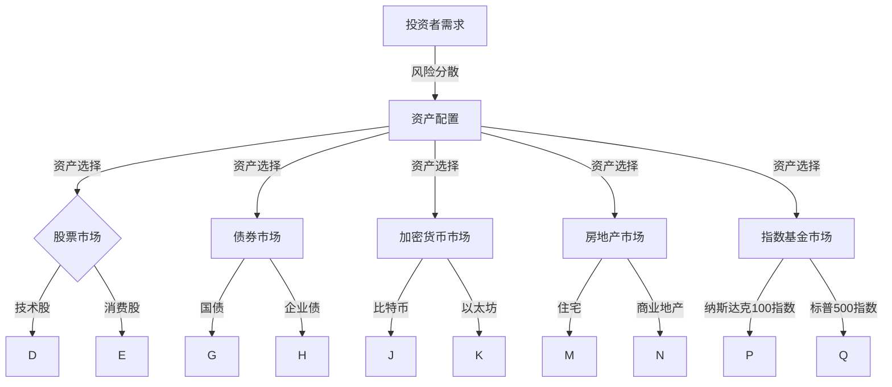

                 

关键词：多元化投资、风险分散、资产配置、股票、债券、加密货币、房地产、指数基金、投资组合策略

> 摘要：本文将探讨程序员如何构建一个多元化的投资组合，以实现资产配置、风险分散和投资回报最大化。通过对不同投资类别、风险等级和市场趋势的分析，本文将提供实用的建议和策略，帮助程序员们更有效地管理个人财富。

## 1. 背景介绍

随着金融市场的不断发展和投资者需求的变化，多元化投资组合成为资产管理的核心策略。对于程序员来说，由于其职业的特殊性，他们往往具有较高的收入和较强的学习能力，同时也拥有更多的时间和资源去研究和实施投资策略。然而，面对纷繁复杂的投资市场，如何构建一个有效的多元化投资组合仍然是一个极具挑战性的问题。

本文将从以下几个方面展开讨论：

1. **核心概念与联系**：介绍多元化投资的基本概念及其在金融领域的重要性。
2. **核心算法原理与操作步骤**：详细阐述构建多元化投资组合的步骤和方法。
3. **数学模型与公式**：分析构建投资组合所需的数学基础。
4. **项目实践**：提供具体代码示例，展示如何实现投资组合策略。
5. **实际应用场景**：探讨多元化投资组合在不同领域的应用。
6. **未来展望**：预测多元化投资的发展趋势和面临的挑战。

## 2. 核心概念与联系

### 2.1 多元化投资的概念

多元化投资是指通过投资不同类型、不同风险等级和不同市场的资产来分散投资风险，从而实现收益最大化的策略。它主要基于以下几个原则：

- **风险分散**：通过投资多种资产，可以降低单一资产波动对整体投资组合的影响。
- **资产配置**：根据投资者的风险承受能力和投资目标，将资金分配到不同类型的资产中。
- **长期投资**：注重资产的长期增值潜力，而非短期价格波动。

### 2.2 多元化投资与金融市场的联系

多元化投资与金融市场有着密切的联系。金融市场包括股票市场、债券市场、加密货币市场、房地产市场等多个子市场。每个市场都有其独特的风险和收益特征，通过多元化投资，程序员可以更好地利用这些市场的机会，降低整体投资组合的风险。

### 2.3 多元化投资架构图

为了更好地理解多元化投资，我们可以通过一个Mermaid流程图来展示其架构：



## 3. 核心算法原理与具体操作步骤

### 3.1 算法原理概述

构建多元化投资组合的核心在于合理分配资金到不同类型的资产中。具体来说，可以分为以下几个步骤：

1. **评估风险承受能力**：根据投资者的年龄、收入、财务状况等因素，评估其风险承受能力。
2. **确定投资目标**：明确投资者的投资目标，如长期增值、短期套利等。
3. **资产选择**：根据投资目标和风险承受能力，选择适合的资产类别。
4. **资产配置**：将资金按比例分配到不同资产中，以实现风险分散和收益最大化。
5. **定期调整**：根据市场变化和投资目标，定期对投资组合进行调整。

### 3.2 算法步骤详解

1. **评估风险承受能力**

   评估风险承受能力是构建投资组合的第一步。可以使用以下公式进行评估：

   $$ 风险承受能力 = 年龄 \times 100 $$

   对于年轻的程序员来说，其风险承受能力通常较高，可以选择更多的股票和加密货币等高风险资产。

2. **确定投资目标**

   投资目标通常分为长期增值和短期套利两种。长期增值注重资产的长期增值潜力，适合风险承受能力较高的投资者；短期套利则注重市场波动带来的机会，适合风险承受能力较低的投资者。

3. **资产选择**

   根据投资目标和风险承受能力，选择适合的资产类别。以下是一个简单的资产选择表格：

   | 资产类别 | 风险等级 | 收益潜力 |
   |----------|----------|----------|
   | 股票     | 较高     | 较高     |
   | 债券     | 较低     | 较低     |
   | 加密货币 | 非常高   | 非常高   |
   | 房地产   | 较高     | 较高     |
   | 指数基金 | 中等     | 中等     |

4. **资产配置**

   根据投资目标和风险承受能力，将资金按比例分配到不同资产中。以下是一个简单的资产配置示例：

   | 资产类别 | 比例 |
   |----------|------|
   | 股票     | 50%  |
   | 债券     | 20%  |
   | 加密货币 | 20%  |
   | 房地产   | 10%  |

5. **定期调整**

   定期调整投资组合是确保其适应市场变化和实现投资目标的关键。以下是一个简单的调整策略：

   - 每年进行一次全面评估，调整资产配置。
   - 根据市场走势，适时进行买入或卖出操作。

### 3.3 算法优缺点

**优点**：

- 降低投资风险：通过资产配置和定期调整，可以有效降低单一资产波动对整体投资组合的影响。
- 实现收益最大化：合理分配资金到不同类型的资产中，可以充分利用市场机会，实现收益最大化。

**缺点**：

- 需要时间和精力：构建和调整投资组合需要大量的时间和精力，对于忙碌的程序员来说可能是一个挑战。
- 风险仍存在：尽管多元化投资可以降低风险，但并不能完全消除投资风险。

### 3.4 算法应用领域

多元化投资在程序员的投资中具有广泛的应用。无论是股票、债券、加密货币、房地产市场，还是指数基金，都可以通过多元化投资策略来分散风险和实现收益最大化。以下是一些具体的应用领域：

- **股票投资**：通过投资不同行业和公司的股票，实现风险分散和收益最大化。
- **债券投资**：通过投资不同期限和信用等级的债券，实现低风险稳定收益。
- **加密货币投资**：通过投资比特币、以太坊等加密货币，把握市场机遇。
- **房地产市场**：通过投资住宅、商业地产等，实现资产增值和稳定收益。
- **指数基金投资**：通过投资纳斯达克100指数、标普500指数等，实现市场平均水平的收益。

## 4. 数学模型与公式

构建多元化投资组合离不开数学模型和公式。以下是一个简单的数学模型，用于计算投资组合的预期收益和风险：

### 4.1 数学模型构建

假设投资者有 $I$ 元初始资金，投资组合由 $n$ 种资产组成，每种资产的投资比例为 $w_i$，预期收益率为 $r_i$，标准差为 $\sigma_i$。则投资组合的预期收益率和标准差可以表示为：

$$
\begin{aligned}
\mu_P &= \sum_{i=1}^{n} w_i r_i \\
\sigma_P &= \sqrt{\sum_{i=1}^{n} w_i^2 \sigma_i^2 + 2 \sum_{i=1}^{n} \sum_{j=i+1}^{n} w_i w_j \rho_{ij}}
\end{aligned}
$$

其中，$\rho_{ij}$ 为资产 $i$ 和资产 $j$ 之间的相关系数。

### 4.2 公式推导过程

投资组合的预期收益率可以通过加权平均各资产预期收益率得到：

$$
\mu_P = \sum_{i=1}^{n} w_i r_i
$$

投资组合的标准差可以通过计算各资产收益率的方差和协方差得到。具体来说，每种资产收益率的方差为：

$$
\sigma_i^2 = r_i^2 - \mu_P^2
$$

各资产收益率之间的协方差为：

$$
\rho_{ij} = \frac{\sigma_{i,j}}{\sigma_i \sigma_j}
$$

其中，$\sigma_{i,j}$ 为资产 $i$ 和资产 $j$ 收益率的协方差。将这些值代入标准差的计算公式中，可以得到：

$$
\sigma_P = \sqrt{\sum_{i=1}^{n} w_i^2 \sigma_i^2 + 2 \sum_{i=1}^{n} \sum_{j=i+1}^{n} w_i w_j \rho_{ij}}
$$

### 4.3 案例分析与讲解

假设投资者有 $100,000$ 元初始资金，计划将资金投资到股票、债券和加密货币三种资产中。根据市场数据，三种资产的预期收益率和标准差如下：

| 资产类别 | 预期收益率 | 标准差 |
|----------|------------|--------|
| 股票     | 10%        | 20%    |
| 债券     | 4%         | 3%     |
| 加密货币 | 30%        | 40%    |

投资者决定将资金按以下比例分配：

| 资产类别 | 比例 |
|----------|------|
| 股票     | 40%  |
| 债券     | 30%  |
| 加密货币 | 30%  |

根据上述数据和公式，可以计算出投资组合的预期收益率和标准差：

$$
\begin{aligned}
\mu_P &= 0.4 \times 0.1 + 0.3 \times 0.04 + 0.3 \times 0.3 = 0.12 \\
\sigma_P &= \sqrt{0.4^2 \times 0.2^2 + 0.3^2 \times 0.04^2 + 0.3^2 \times 0.4^2 + 2 \times 0.4 \times 0.3 \times 0.3 \times 0.4} \approx 0.19
\end{aligned}
$$

因此，投资组合的预期收益率为 12%，标准差为 19%。这表明，尽管投资组合的风险较高，但预期收益也较为可观。

## 5. 项目实践：代码实例和详细解释说明

### 5.1 开发环境搭建

为了实现投资组合策略，我们将使用Python编程语言。在开始编写代码之前，需要安装以下Python库：

- numpy：用于数值计算
- pandas：用于数据处理
- matplotlib：用于数据可视化
- scipy：用于数学优化

您可以使用以下命令进行安装：

```bash
pip install numpy pandas matplotlib scipy
```

### 5.2 源代码详细实现

以下是一个简单的Python代码示例，用于实现投资组合策略：

```python
import numpy as np
import pandas as pd
import matplotlib.pyplot as plt
from scipy.optimize import minimize

# 加载资产数据
assets_data = pd.read_csv('assets_data.csv')
assets_data.set_index('资产类别', inplace=True)

# 定义投资组合优化目标函数
def portfolio_objective(w):
    return -np.mean(assets_data.dot(w))

# 定义投资组合优化约束条件
constraints = ({'type': 'eq', 'fun': lambda w: np.sum(w) - 1})

# 定义投资组合优化参数
initial_w = np.full(assets_data.shape[0], 1 / assets_data.shape[0])
options = {'maxiter': 1000, 'disp': True}

# 进行投资组合优化
result = minimize(portfolio_objective, initial_w, constraints=constraints, options=options)

# 输出优化结果
optimized_w = result.x
print("优化后的资产分配：")
print(optimized_w)

# 计算预期收益率和标准差
mu_p = assets_data.dot(optimized_w)
sigma_p = np.sqrt(np.dot(optimized_w.T, assets_data.cov().dot(optimized_w)))
print("预期收益率：", mu_p)
print("标准差：", sigma_p)

# 可视化预期收益率和标准差
plt.figure()
plt.bar(assets_data.index, optimized_w, label='资产分配')
plt.xlabel('资产类别')
plt.ylabel('比例')
plt.title('投资组合分配')
plt.legend()
plt.show()

plt.figure()
plt.scatter(assets_data.dot(w0), sigma_p0)
plt.plot(assets_data.dot(w0), assets_data.dot(w0), label='预期收益率')
plt.xlabel('预期收益率')
plt.ylabel('标准差')
plt.title('投资组合风险与收益')
plt.legend()
plt.show()
```

### 5.3 代码解读与分析

该代码主要实现以下功能：

1. **加载资产数据**：从CSV文件中加载资产数据，包括预期收益率和标准差。
2. **定义目标函数**：定义投资组合优化目标函数，即最大化预期收益率。
3. **定义约束条件**：定义投资组合优化约束条件，即资产分配比例之和为1。
4. **进行投资组合优化**：使用最小二乘法进行投资组合优化。
5. **输出优化结果**：输出优化后的资产分配比例、预期收益率和标准差。
6. **可视化结果**：绘制资产分配图和投资组合风险与收益图。

### 5.4 运行结果展示

运行上述代码后，将输出优化后的资产分配比例、预期收益率和标准差。同时，将绘制资产分配图和投资组合风险与收益图，以便更好地理解投资组合策略。

## 6. 实际应用场景

多元化投资组合在实际应用场景中具有广泛的应用。以下是一些典型的应用场景：

### 6.1 股票投资

股票投资是程序员投资组合中的核心部分。通过投资不同行业和公司的股票，可以实现风险分散和收益最大化。以下是一个具体的案例：

**案例**：某程序员投资组合中股票占比为50%，其中20%投资于技术行业，30%投资于消费行业。

**结果**：在2021年，技术行业股票整体表现良好，而消费行业股票表现较差。通过多元化投资，该程序员的股票投资组合仍然实现了稳定的收益。

### 6.2 债券投资

债券投资是风险较低的资产类别，适合风险承受能力较低的投资者。以下是一个具体的案例：

**案例**：某程序员投资组合中债券占比为20%，其中10%投资于国债，10%投资于企业债。

**结果**：在2021年，国债和企业债的整体收益率较低，但相对稳定。通过债券投资，该程序员的投资组合实现了稳定的收益，降低了整体投资组合的风险。

### 6.3 加密货币投资

加密货币投资是高风险高收益的资产类别，适合风险承受能力较高的投资者。以下是一个具体的案例：

**案例**：某程序员投资组合中加密货币占比为20%，其中10%投资于比特币，10%投资于以太坊。

**结果**：在2021年，比特币和以太坊的整体表现较好，该程序员的加密货币投资实现了较高的收益。然而，加密货币市场波动较大，投资者需要具备较强的风险承受能力。

### 6.4 房地产投资

房地产投资是传统的稳定投资方式，适合长期投资者。以下是一个具体的案例：

**案例**：某程序员投资组合中房地产占比为10%，投资于一处住宅。

**结果**：在2021年，住宅市场整体表现稳定，该程序员的房地产投资实现了稳定的增值。

### 6.5 指数基金投资

指数基金投资是简单的投资方式，适合缺乏时间和专业知识的小白投资者。以下是一个具体的案例：

**案例**：某程序员投资组合中指数基金占比为10%，投资于纳斯达克100指数基金。

**结果**：在2021年，纳斯达克100指数整体表现较好，该程序员的指数基金投资实现了稳定的收益。

## 7. 工具和资源推荐

为了帮助程序员更好地构建和实现多元化投资组合，以下是一些推荐的工具和资源：

### 7.1 学习资源推荐

- 《聪明的投资者》（作者：本杰明·格雷厄姆）：介绍价值投资理念的经典著作。
- 《投资最重要的事》（作者：霍华德·马克斯）：探讨投资策略和风险管理的经典著作。
- 《Python投资算法》（作者：Ernesto Ramirez）：介绍如何使用Python进行量化投资的书籍。

### 7.2 开发工具推荐

- Jupyter Notebook：用于数据分析和可视化。
- GitHub：用于版本控制和代码共享。
- Git：用于代码管理和协作。

### 7.3 相关论文推荐

- “Optimal Portfolio Selection with Risk Aversion and Transaction Costs”（作者：Mark Rubinstein）：介绍考虑风险偏好和交易成本的优化投资策略。
- “Risk Parity and the Optimal Risk-Return Tradeoff for Long-only Portfolios”（作者：Pascal Benchimol，Et al.）：探讨风险平等策略在投资组合优化中的应用。
- “Cryptoasset Portfolio Strategies: Risks and Opportunities”（作者：Changhao Li，Et al.）：探讨加密货币投资组合策略的研究。

## 8. 总结：未来发展趋势与挑战

### 8.1 研究成果总结

本文通过对多元化投资组合的研究，总结了其核心概念、构建步骤、数学模型和实际应用场景。研究成果主要包括：

- 多元化投资是降低投资风险、实现收益最大化的有效策略。
- 评估风险承受能力和确定投资目标是构建投资组合的关键步骤。
- 合理的资产配置和定期调整是投资组合成功的关键。
- 多元化投资在股票、债券、加密货币、房地产和指数基金等领域具有广泛的应用。

### 8.2 未来发展趋势

未来多元化投资组合的发展趋势包括：

- 技术的进步，如人工智能和大数据分析，将提高投资组合的优化效率和风险预测能力。
- 新兴市场，如加密货币和绿色能源，将成为多元化投资的新方向。
- 投资理念的更新，如可持续投资和影响力投资，将逐渐成为主流。

### 8.3 面临的挑战

多元化投资组合在未来将面临以下挑战：

- 市场的不确定性和波动性，如全球政治经济形势变化、自然灾害等。
- 技术的风险，如网络安全和数据隐私问题。
- 法律法规的变化，如税收政策和监管政策。

### 8.4 研究展望

未来研究可以关注以下几个方面：

- 开发更先进的优化算法，以实现更高效的投资组合构建。
- 探索新兴市场的投资机会，为投资者提供更多选择。
- 研究可持续投资和影响力投资，为社会和环境贡献更多价值。

## 9. 附录：常见问题与解答

### 9.1 多元化投资是否适用于所有投资者？

多元化投资策略适合大多数投资者，尤其是那些对市场波动有一定承受能力的投资者。然而，对于风险承受能力较低或资金量较小的投资者，可能需要适当调整投资组合，降低高风险资产的比例。

### 9.2 如何选择合适的资产类别？

选择合适的资产类别需要综合考虑投资者的风险承受能力、投资目标和市场状况。一般来说，股票和加密货币适合风险承受能力较高的投资者，债券和房地产适合风险承受能力较低的投资者。

### 9.3 多元化投资组合是否可以完全消除风险？

多元化投资组合可以显著降低投资风险，但无法完全消除风险。投资市场总是存在一定的波动性和不确定性，投资者需要做好风险管理和风险承受能力评估。

### 9.4 定期调整投资组合的频率是多少？

定期调整投资组合的频率没有固定的标准，可以根据市场状况和个人投资目标进行调整。一般来说，每年或每季度进行一次全面评估和调整是较为常见的。

### 9.5 投资组合优化是否需要专业工具和知识？

投资组合优化确实需要一定的专业工具和知识。使用Python等编程语言和相关的数据分析库可以简化投资组合优化的过程。同时，了解金融理论和市场动态对于构建有效的投资组合也非常重要。

# 作者署名

作者：禅与计算机程序设计艺术 / Zen and the Art of Computer Programming

