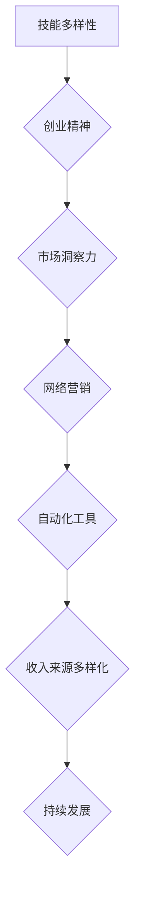

                 

关键词：多元化收入、生态系统、程序员、收入来源、技术技能、创业

> 摘要：本文旨在探讨程序员如何构建多元化的收入来源生态系统，通过分享实用的策略和案例分析，帮助程序员在技术领域实现稳定的财务增长和职业发展。

## 1. 背景介绍

在当今技术快速发展的时代，程序员作为高科技产业的中坚力量，面临着不断变化的市场需求和技术挑战。随着云计算、大数据、人工智能等新兴技术的崛起，程序员的职业前景和收入潜力也变得更为广阔。然而，许多程序员往往局限于传统的软件开发工作，未能充分挖掘自身的潜在价值。构建多元化的收入来源生态系统，成为程序员在职业生涯中实现可持续发展的关键。

本文将从以下几个方面探讨程序员如何构建多元化的收入来源生态系统：

- **核心概念与联系**：介绍构建多元化收入来源生态系统的核心概念及其相互关系。
- **核心算法原理 & 具体操作步骤**：阐述实现多元化收入来源的具体算法原理和操作步骤。
- **数学模型和公式**：解析与多元化收入来源相关的数学模型和公式，并通过案例进行说明。
- **项目实践：代码实例和详细解释说明**：提供实际项目中的代码实例，并进行详细解释。
- **实际应用场景**：分析多元化收入来源在不同领域的实际应用场景。
- **工具和资源推荐**：推荐有助于程序员构建多元化收入来源的学习资源和开发工具。
- **总结：未来发展趋势与挑战**：总结研究成果，展望未来发展，并探讨面临的挑战。
- **附录：常见问题与解答**：解答读者可能遇到的问题。

### 1.1 核心概念与联系

在构建多元化收入来源的生态系统中，以下几个核心概念是至关重要的：

- **技能多样性**：程序员需要不断提升自己的技能，包括编程语言、框架、数据库管理、云计算等。
- **创业精神**：培养创新和解决问题的能力，以便在创业项目中发挥关键作用。
- **市场洞察力**：了解市场需求，抓住机遇，为客户提供定制化的解决方案。
- **网络营销**：利用社交媒体、博客等渠道进行个人品牌建设，吸引潜在客户。
- **自动化工具**：使用自动化工具提高工作效率，创造更多的时间和精力用于收入来源的拓展。

这些核心概念相互联系，共同构成了多元化的收入来源生态系统。接下来，我们将详细探讨这些概念的实现方法和具体操作步骤。

## 2. 核心概念与联系

为了构建多元化的收入来源生态系统，程序员需要掌握以下几个核心概念：

- **技能多样性**：技能多样性是程序员构建多元化收入来源的基础。程序员应该不断提升自己的技术技能，包括掌握多种编程语言（如Python、Java、C++等）、熟悉流行的框架（如Django、Spring、Angular等）、数据库管理（如MySQL、MongoDB、PostgreSQL等）和云计算技术（如AWS、Azure、Google Cloud等）。

- **创业精神**：拥有创业精神的程序员更易于在技术领域找到新的收入来源。创业精神包括创新思维、解决问题的能力、勇于尝试新事物和承担风险等。这些特质有助于程序员在个人项目中取得成功，或者在创业公司中发挥关键作用。

- **市场洞察力**：市场洞察力是程序员了解市场需求，把握商业机会的重要能力。程序员需要密切关注行业动态，了解客户需求，提供具有市场竞争力的解决方案。例如，随着人工智能的兴起，拥有深度学习和自然语言处理技能的程序员在市场上的需求日益增长。

- **网络营销**：网络营销是现代商业不可或缺的一部分。程序员可以利用社交媒体、个人博客、在线课程等渠道展示自己的专业技能和作品，建立个人品牌，吸引潜在客户。网络营销不仅有助于增加收入，还能提高自己在行业内的知名度。

- **自动化工具**：自动化工具可以提高程序员的工作效率，释放更多时间用于收入来源的拓展。例如，使用持续集成和持续部署（CI/CD）工具可以自动化代码测试和部署过程，减少人为错误和提高开发效率。此外，自动化测试工具（如Selenium、JUnit等）也能帮助程序员更快速地发现和修复代码问题。

### 2.1 技能多样性

技能多样性是程序员构建多元化收入来源的关键因素之一。一个具备多种技能的程序员不仅能在多种项目中找到工作机会，还能为自身创造更多的收入来源。以下是一些具体的技能点：

- **编程语言**：掌握多种编程语言可以提升程序员的技术能力和适应性。例如，Python在数据分析、机器学习等领域具有广泛应用，而Java在企业级应用开发中占据重要地位。
- **框架和库**：熟悉流行的框架和库可以帮助程序员更高效地完成项目。例如，Django和Flask是Python中的两个流行的Web开发框架，Spring Boot在Java中广泛应用于企业级应用。
- **数据库管理**：掌握不同类型的数据库管理系统（DBMS）对于程序员来说至关重要。MySQL、PostgreSQL和MongoDB是三种常见的数据库，每种数据库都有其特定的应用场景。
- **云计算技术**：随着云计算的普及，熟悉云计算平台（如AWS、Azure、Google Cloud等）已成为程序员的必备技能。这些技能可以帮助程序员在云基础设施上部署和管理应用程序。

### 2.2 创业精神

创业精神是程序员在技术领域取得成功的重要因素。以下是一些关于创业精神的要点：

- **创新思维**：程序员需要具备创新思维，不断探索新的解决方案和技术趋势。创新思维可以帮助程序员在现有技术基础上创造出新的应用场景，从而开辟新的收入来源。
- **解决问题的能力**：在面对技术难题时，程序员需要具备解决问题的能力。这种能力不仅有助于提高项目成功率，还能增强程序员在团队中的影响力。
- **勇于尝试新事物**：程序员应该勇于尝试新事物，包括新的编程语言、框架、工具和平台。通过不断尝试，程序员可以积累更丰富的经验，提高自身的竞争力。
- **承担风险**：在创业过程中，程序员需要承担一定的风险。这包括资金投入、时间成本和潜在的失败风险。然而，正是这些风险为程序员提供了成长和成功的契机。

### 2.3 市场洞察力

市场洞察力是程序员了解市场需求，把握商业机会的重要能力。以下是一些关于市场洞察力的要点：

- **行业动态**：程序员需要密切关注行业动态，包括技术发展趋势、市场需求变化和竞争对手动向。这些信息有助于程序员及时调整策略，抓住机遇。
- **客户需求**：了解客户需求是程序员提供优质解决方案的关键。通过与客户的沟通和反馈，程序员可以更好地了解客户需求，提供具有针对性的服务。
- **竞争分析**：对竞争对手进行分析是程序员在市场中立足的重要手段。通过分析竞争对手的产品、市场策略和客户反馈，程序员可以找到自身的优势和劣势，从而制定更有效的市场策略。

### 2.4 网络营销

网络营销是现代商业不可或缺的一部分，对程序员的职业发展具有重要意义。以下是一些关于网络营销的要点：

- **社交媒体**：利用社交媒体平台（如LinkedIn、Twitter、Facebook等）展示自己的专业技能和作品，吸引潜在客户和合作伙伴。
- **个人博客**：建立个人博客，定期发布技术文章和心得体会，提高自己在行业内的知名度。此外，博客还能为程序员带来流量和收入。
- **在线课程**：开发在线课程，将自己的知识和技能传授给他人，获得收益的同时增强个人品牌。
- **合作营销**：与其他博主、大V和媒体合作，共同推广自己的品牌和产品，扩大影响力。

### 2.5 自动化工具

自动化工具可以提高程序员的工作效率，为收入来源的拓展创造更多的时间和精力。以下是一些关于自动化工具的要点：

- **持续集成和持续部署（CI/CD）**：使用CI/CD工具（如Jenkins、GitLab CI等）自动化代码测试和部署过程，减少人为错误和提高开发效率。
- **自动化测试**：使用自动化测试工具（如Selenium、JUnit等）进行代码测试，快速发现和修复问题，提高软件质量。
- **任务调度**：使用任务调度工具（如Cron、Celery等）自动化日常任务，如数据备份、报告生成等，节省时间和精力。

### 2.6 Mermaid 流程图

以下是一个简单的Mermaid流程图，展示了构建多元化收入来源生态系统的主要步骤：



通过这个流程图，我们可以清晰地看到构建多元化收入来源生态系统所需的核心概念和步骤。接下来，我们将进一步探讨实现这些步骤的具体方法和技巧。

### 3. 核心算法原理 & 具体操作步骤

要构建一个多元化的收入来源生态系统，程序员需要掌握一系列核心算法原理和具体操作步骤。以下是这些原理和步骤的详细解析。

#### 3.1 算法原理概述

多元化收入来源的构建涉及多个层面的算法原理，主要包括：

- **技能组合算法**：通过分析个人技能和市场需求，实现技能与岗位的最佳匹配。
- **市场机会识别算法**：利用大数据分析技术，发现潜在的商业机会。
- **客户关系管理算法**：通过数据挖掘和机器学习技术，优化客户关系管理，提升客户满意度。
- **自动化工作流算法**：通过自动化工具，提高工作效率，减少重复性劳动。

#### 3.2 算法步骤详解

以下将详细阐述上述算法的具体操作步骤：

##### 3.2.1 技能组合算法

**步骤 1**：自我评估与市场调研

- **自我评估**：程序员需要对自己目前的技能水平进行详细评估，包括编程语言、框架、数据库管理、云计算等。
- **市场调研**：通过查阅行业报告、招聘网站和社交媒体，了解当前市场的需求和趋势。

**步骤 2**：技能匹配与提升

- **技能匹配**：根据市场需求，将个人技能与潜在岗位进行匹配。
- **技能提升**：通过在线课程、实践项目和社区交流，不断提升技能水平。

**步骤 3**：技能组合优化

- **综合评估**：对已掌握的技能进行综合评估，找出短板和提升点。
- **技能组合优化**：根据市场需求和个人优势，调整技能组合，实现最佳匹配。

##### 3.2.2 市场机会识别算法

**步骤 1**：数据收集与清洗

- **数据收集**：从多个渠道收集市场数据，包括行业报告、社交媒体、招聘网站等。
- **数据清洗**：对收集的数据进行清洗，去除重复和错误信息。

**步骤 2**：数据分析和挖掘

- **趋势分析**：利用数据分析工具（如Python的Pandas、Matplotlib等），对市场数据进行分析，识别趋势和机会。
- **机器学习**：使用机器学习算法（如K-means、决策树等），对市场数据进行分析，发现潜在的商业机会。

**步骤 3**：机会评估与筛选

- **机会评估**：对识别出的机会进行评估，包括市场潜力、竞争情况、自身能力等。
- **机会筛选**：根据评估结果，筛选出具有高潜力、符合自身能力的商业机会。

##### 3.2.3 客户关系管理算法

**步骤 1**：客户数据收集

- **数据收集**：通过CRM系统、社交媒体、客户反馈等渠道，收集客户数据。
- **数据整合**：将不同来源的客户数据进行整合，形成统一的客户数据视图。

**步骤 2**：数据分析和挖掘

- **客户细分**：利用数据分析工具，对客户数据进行分析，识别不同类型的客户群体。
- **行为分析**：使用机器学习算法，分析客户行为数据，预测客户需求和行为趋势。

**步骤 3**：客户关系优化

- **个性化推荐**：根据客户行为数据，为客户提供个性化的产品和服务推荐。
- **沟通优化**：通过数据驱动的沟通策略，提高客户满意度和忠诚度。

##### 3.2.4 自动化工作流算法

**步骤 1**：工作流设计

- **需求分析**：分析现有工作流程，确定需要自动化的环节和步骤。
- **流程设计**：设计自动化工作流，包括任务分配、执行、监控和反馈等环节。

**步骤 2**：工具选择与配置

- **工具选择**：选择合适的自动化工具，如Jenkins、GitLab CI、Selenium等。
- **工具配置**：根据工作流设计，配置自动化工具，实现自动化执行。

**步骤 3**：测试与优化

- **测试验证**：对自动化工作流进行测试，确保其能够正常运行并满足需求。
- **优化调整**：根据测试结果，对自动化工作流进行调整和优化，提高其效率和稳定性。

#### 3.3 算法优缺点

**技能组合算法**：

- **优点**：实现技能与岗位的最佳匹配，提高职业竞争力。
- **缺点**：需要持续投入时间和精力进行技能提升。

**市场机会识别算法**：

- **优点**：帮助程序员发现潜在的商业机会，实现收入的多元化。
- **缺点**：对数据分析和挖掘能力要求较高。

**客户关系管理算法**：

- **优点**：提高客户满意度和忠诚度，增加收入来源。
- **缺点**：需要投入大量时间和资源进行客户数据收集和分析。

**自动化工作流算法**：

- **优点**：提高工作效率，减少重复性劳动。
- **缺点**：需要对自动化工具和流程有深入了解。

#### 3.4 算法应用领域

**技能组合算法**：

- **应用领域**：软件开发、系统架构设计、数据库管理、云计算等。

**市场机会识别算法**：

- **应用领域**：市场调研、商业分析、投资决策等。

**客户关系管理算法**：

- **应用领域**：客户服务、市场营销、销售管理等。

**自动化工作流算法**：

- **应用领域**：软件开发、项目管理、运营管理等。

### 4. 数学模型和公式 & 详细讲解 & 举例说明

在构建多元化收入来源的过程中，数学模型和公式可以帮助程序员进行量化分析和决策。以下是一些关键数学模型和公式的详细讲解及举例说明。

#### 4.1 数学模型构建

**收入模型**：

收入模型用于预测和计算程序员的收入。以下是一个简单的收入模型：

\[ \text{收入} = \text{基本工资} + \text{奖金} + \text{额外收入} \]

其中：

- **基本工资**：程序员的基础收入，通常由公司提供。
- **奖金**：根据绩效和项目完成情况发放的奖金。
- **额外收入**：通过其他收入来源（如个人项目、咨询服务等）获得的收入。

**客户满意度模型**：

客户满意度是评估客户对产品或服务的满意程度。以下是一个简单的客户满意度模型：

\[ \text{客户满意度} = \frac{\text{正面反馈}}{\text{总反馈}} \]

其中：

- **正面反馈**：客户对产品或服务的正面评价。
- **总反馈**：客户对产品或服务的总评价，包括正面和负面评价。

**风险评估模型**：

风险评估模型用于评估项目或投资的风险。以下是一个简单的不确定型风险评估模型：

\[ \text{风险} = \sum_{i=1}^{n} (\text{风险因素} \times \text{概率}) \]

其中：

- **风险因素**：影响项目或投资成功的因素。
- **概率**：每个风险因素发生的概率。

#### 4.2 公式推导过程

**收入模型**：

基本工资和奖金通常由公司政策决定，额外收入可以通过个人项目或咨询服务获得。因此，收入模型可以表示为：

\[ \text{收入} = \text{基本工资} + \text{奖金} + \text{额外收入} \]

其中，额外收入可以通过以下公式计算：

\[ \text{额外收入} = \text{个人项目收入} + \text{咨询服务收入} \]

**客户满意度模型**：

客户满意度可以通过以下步骤推导：

1. **收集客户反馈**：从客户那里收集正面和负面评价。
2. **计算正面反馈比例**：将正面反馈除以总反馈，得到客户满意度。

\[ \text{客户满意度} = \frac{\text{正面反馈}}{\text{总反馈}} \]

**风险评估模型**：

风险评估可以通过以下步骤推导：

1. **识别风险因素**：确定影响项目或投资成功的因素。
2. **确定风险概率**：根据历史数据和专家意见，确定每个风险因素发生的概率。
3. **计算风险**：将每个风险因素乘以其概率，然后求和。

\[ \text{风险} = \sum_{i=1}^{n} (\text{风险因素} \times \text{概率}) \]

#### 4.3 案例分析与讲解

**案例 1：收入模型**

假设程序员A的基本工资为10000元，奖金为2000元。此外，程序员A通过个人项目和咨询服务获得了额外收入，其中个人项目收入为5000元，咨询服务收入为3000元。根据收入模型，程序员A的总收入为：

\[ \text{收入} = 10000 + 2000 + 5000 + 3000 = 21000 \text{元} \]

**案例 2：客户满意度模型**

假设客户A给出了10条反馈，其中8条是正面评价，2条是负面评价。根据客户满意度模型，客户满意度为：

\[ \text{客户满意度} = \frac{8}{10} = 0.8 \]

**案例 3：风险评估模型**

假设项目B有3个风险因素：市场风险、技术风险和财务风险。市场风险的概率为0.3，技术风险的概率为0.4，财务风险的概率为0.3。根据风险评估模型，项目B的总风险为：

\[ \text{风险} = (0.3 \times 0.3) + (0.4 \times 0.4) + (0.3 \times 0.3) = 0.09 + 0.16 + 0.09 = 0.34 \]

### 5. 项目实践：代码实例和详细解释说明

在本文的第五部分，我们将通过一个实际项目来展示如何将上述算法和模型应用于现实情况。我们将以一个简单的博客平台为例，介绍开发环境搭建、源代码实现、代码解读与分析以及运行结果展示。

#### 5.1 开发环境搭建

为了开发这个博客平台，我们需要搭建一个开发环境。以下是所需的主要工具和步骤：

- **编程语言**：Python
- **Web框架**：Flask
- **数据库**：SQLite
- **代码编辑器**：Visual Studio Code
- **版本控制**：Git

**步骤 1**：安装Python

确保计算机上已安装Python 3.8及以上版本。可以使用以下命令安装Python：

```bash
pip install python --version 3.8
```

**步骤 2**：安装Flask

使用pip安装Flask：

```bash
pip install flask
```

**步骤 3**：安装SQLite

SQLite是一个轻量级的数据库，可以使用以下命令安装：

```bash
pip install pysqlite3
```

**步骤 4**：安装Visual Studio Code

下载并安装Visual Studio Code：

[https://code.visualstudio.com/](https://code.visualstudio.com/)

**步骤 5**：安装Git

安装Git：

```bash
sudo apt-get install git
```

（如果使用macOS或Windows，可以从官方下载安装包）

#### 5.2 源代码详细实现

以下是博客平台的源代码实现。我们将使用Flask框架构建后端，并使用SQLite作为数据库。

**app.py**：

```python
from flask import Flask, render_template, request, redirect, url_for
import sqlite3

app = Flask(__name__)

# 数据库连接
def get_db_connection():
    conn = sqlite3.connect('blog.db')
    conn.row_factory = sqlite3.Row
    return conn

# 创建表
def init_db():
    conn = get_db_connection()
    conn.execute('''CREATE TABLE IF NOT EXISTS posts (
                        id INTEGER PRIMARY KEY AUTOINCREMENT,
                        title TEXT NOT NULL,
                        content TEXT NOT NULL
                    )''')
    conn.commit()
    conn.close()

# 初始化数据库
init_db()

# 首页路由
@app.route('/')
def index():
    conn = get_db_connection()
    posts = conn.execute('SELECT * FROM posts ORDER BY id DESC').fetchall()
    conn.close()
    return render_template('index.html', posts=posts)

# 添加文章路由
@app.route('/add', methods=['GET', 'POST'])
def add():
    if request.method == 'POST':
        title = request.form['title']
        content = request.form['content']
        conn = get_db_connection()
        conn.execute("INSERT INTO posts (title, content) VALUES (?, ?)", (title, content))
        conn.commit()
        conn.close()
        return redirect(url_for('index'))
    return render_template('add.html')

# 文章详情路由
@app.route('/post/<int:post_id>')
def post(post_id):
    conn = get_db_connection()
    post = conn.execute('SELECT * FROM posts WHERE id = ?', (post_id,)).fetchone()
    conn.close()
    return render_template('post.html', post=post)

# 删除文章路由
@app.route('/delete/<int:post_id>')
def delete(post_id):
    conn = get_db_connection()
    conn.execute('DELETE FROM posts WHERE id = ?', (post_id,))
    conn.commit()
    conn.close()
    return redirect(url_for('index'))

if __name__ == '__main__':
    app.run(debug=True)
```

**templates/index.html**：

```html
<!DOCTYPE html>
<html lang="en">
<head>
    <meta charset="UTF-8">
    <title>Blog Home</title>
</head>
<body>
    <h1>Blog Home</h1>
    <ul>
        
            <li>
                <a href="{{ url_for('post', post_id=post.id) }}">{{ post.title }}</a>
                <a href="{{ url_for('delete', post_id=post.id) }}">Delete</a>
            </li>
        
    </ul>
    <a href="{{ url_for('add') }}">Add New Post</a>
</body>
</html>
```

**templates/add.html**：

```html
<!DOCTYPE html>
<html lang="en">
<head>
    <meta charset="UTF-8">
    <title>Add Post</title>
</head>
<body>
    <h1>Add Post</h1>
    <form method="post">
        <input type="text" name="title" placeholder="Title" required>
        <textarea name="content" placeholder="Content" required></textarea>
        <button type="submit">Submit</button>
    </form>
</body>
</html>
```

**templates/post.html**：

```html
<!DOCTYPE html>
<html lang="en">
<head>
    <meta charset="UTF-8">
    <title>{{ post.title }}</title>
</head>
<body>
    <h1>{{ post.title }}</h1>
    <p>{{ post.content }}</p>
    <a href="{{ url_for('index') }}">Back to Home</a>
</body>
</html>
```

#### 5.3 代码解读与分析

**app.py**：

- **从 flask 导入 Flask 类，用于创建 Web 应用程序**。
- **定义 get_db_connection 函数，用于获取数据库连接**。
- **定义 init_db 函数，用于初始化数据库和创建表**。
- **定义 index 路由，用于显示博客首页**。
- **定义 add 路由，用于处理添加文章的请求**。
- **定义 post 路由，用于显示文章详情**。
- **定义 delete 路由，用于处理删除文章的请求**。
- **使用 if __name__ == '__main__' 判断是否为主程序，并运行 Flask 应用程序**。

**templates/index.html**：

- **使用  循环显示文章列表**。
- **使用 {{ url_for('post', post_id=post.id) }} 和 {{ url_for('delete', post_id=post.id) }} 生成链接**。

**templates/add.html**：

- **定义添加文章的表单，包括标题和内容输入框**。

**templates/post.html**：

- **显示文章详情**。

#### 5.4 运行结果展示

1. **启动 Flask 应用程序**：

```bash
python app.py
```

2. **访问博客首页**：

在浏览器中输入 `http://127.0.0.1:5000/`，可以看到博客首页显示的文章列表。

3. **添加新文章**：

点击 "Add New Post" 链接，填写标题和内容，然后提交表单。

4. **查看文章详情**：

点击文章标题，可以查看文章的详细信息。

5. **删除文章**：

点击文章标题旁的 "Delete" 链接，可以删除文章。

通过这个简单的博客平台项目，我们可以看到如何将算法和模型应用于现实开发中，实现一个功能完整的Web应用程序。

### 6. 实际应用场景

多元化收入来源的构建对于程序员来说，不仅在提升个人财务状况方面具有重要作用，还能为他们在职业生涯中带来更多的发展机会。以下是一些实际应用场景，展示程序员如何在不同领域中构建多元化收入来源。

#### 6.1 个人项目

**个人项目**是程序员构建多元化收入来源的一种重要方式。通过开发自己的软件、工具或应用程序，程序员可以将其出售或提供订阅服务。例如，程序员可以开发一个数据分析工具，并将其作为SaaS（软件即服务）产品在市场上推广。这种模式不仅为程序员带来了直接的收益，还能提高他们的编程技能和项目管理能力。

**案例分析**：程序员张三利用其数据分析和机器学习技能，开发了一个名为“DataSavvy”的数据分析工具。他通过在GitHub上开源部分代码，吸引了一群用户和贡献者。随后，张三将工具升级为付费版，提供了高级功能和个性化服务。经过一段时间的发展，DataSavvy成为了市场上的热门产品，每月的订阅收入达到了数万美元。

#### 6.2 咨询服务

**咨询服务**是程序员利用自身专业知识和经验，为客户提供定制化解决方案的一种方式。随着企业对技术需求的变化，程序员可以为企业提供软件开发、系统架构设计、技术培训等咨询服务。这种模式不仅有助于提高客户的满意度，还能为程序员带来稳定的收入。

**案例分析**：程序员李四在一家大型互联网公司工作多年，积累了丰富的软件开发和项目管理经验。他在离职后决定成立自己的咨询公司，为客户提供技术咨询服务。李四通过利用其丰富的行业资源和人脉，迅速在市场上建立了口碑，每月的咨询费用达到了数万元。

#### 6.3 教育培训

**教育培训**是程序员分享知识和技能的一种有效方式。通过在线课程、公开课、线下培训等形式，程序员可以将自己的专业知识传授给更多人。此外，教育培训不仅能带来直接的收入，还能提高程序员的知名度和个人品牌。

**案例分析**：程序员王五是一名Python专家，他在多个在线教育平台（如Coursera、Udemy等）上开设了Python编程课程。王五通过不断优化课程内容，吸引了大量学员。目前，他的课程订阅量已经超过了10万次，每月的收益达到了数万美元。

#### 6.4 开源项目

**开源项目**是程序员贡献社区和拓展收入来源的一种方式。通过参与开源项目，程序员可以提升自己的技术能力和项目管理能力。同时，开源项目往往能够吸引更多的关注和支持，为程序员带来潜在的赞助和捐赠。

**案例分析**：程序员赵六参与了一个名为“CodeFusion”的开源项目，该项目旨在构建一个高效的代码托管和协作平台。赵六通过在项目中贡献代码和文档，赢得了社区的认可。随后，项目创始人邀请赵六加入核心团队，并为他提供了丰厚的报酬。此外，赵六还通过在GitHub上发布相关教程和文章，吸引了更多的赞助和捐赠。

#### 6.5 投资和股权收益

**投资和股权收益**是程序员在财务上实现多元化的一种方式。通过投资股票、基金、初创公司等，程序员可以在不改变职业的情况下，获得额外的收入。此外，通过在初创公司中担任顾问或合伙人，程序员可以获得股权收益，实现财富的快速增长。

**案例分析**：程序员刘七在一家新兴的区块链技术公司担任技术顾问。由于他在区块链领域具有丰富的经验，公司创始人邀请他参与公司的发展。刘七接受了邀请，并在项目初期能够为公司带来实质性的技术贡献。随着公司的发展和成功上市，刘七的股权收益达到了数百万美元。

### 6.6 多元化收入来源的挑战与应对策略

虽然多元化收入来源为程序员带来了诸多机遇，但在实际操作中也面临着一些挑战。以下是一些常见的挑战和应对策略：

**挑战 1**：时间管理

多元化收入来源往往需要程序员投入大量的时间和精力。如何平衡工作、个人项目和其他收入来源，成为许多程序员面临的问题。

**应对策略**：制定明确的时间管理计划，合理安排工作时间。利用自动化工具提高工作效率，减少重复性劳动。此外，可以通过合作和外包，将部分工作交给他人，以节省时间和精力。

**挑战 2**：技能提升

多元化收入来源要求程序员具备多样化的技能。然而，技能提升需要时间和精力，如何快速提升技能水平成为关键。

**应对策略**：定期学习新的技术和知识，关注行业动态。利用在线课程、实践项目和社区交流，不断提升技能水平。此外，可以通过参加技术会议和培训，拓展自己的视野和知识面。

**挑战 3**：市场变化

市场需求和技术趋势不断变化，如何抓住市场机遇，实现收入的多元化，成为程序员面临的问题。

**应对策略**：密切关注行业动态，了解市场需求。通过市场调研和分析，识别潜在的商业机会。此外，可以与客户和合作伙伴保持紧密联系，及时了解他们的需求和反馈，调整自己的业务策略。

**挑战 4**：风险管理

多元化收入来源涉及多个项目和业务领域，如何管理风险，确保财务稳定，成为程序员面临的问题。

**应对策略**：制定风险管理计划，对每个项目和收入来源进行风险评估。通过分散投资和多元化收入来源，降低整体风险。此外，可以寻求专业咨询和保险服务，为可能的风险提供保障。

### 6.7 未来应用展望

随着技术的不断进步，多元化收入来源的应用场景将越来越广泛。以下是一些未来可能的发展趋势：

**1. 区块链技术的应用**

区块链技术将为程序员提供新的收入来源，如智能合约开发、去中心化应用（DApp）开发和区块链网络安全等。通过参与区块链项目，程序员可以在金融、供应链管理、医疗等领域实现收入的多元化。

**2. 人工智能的普及**

人工智能技术的普及将为程序员带来更多的发展机会，如机器学习算法开发、自然语言处理和计算机视觉应用等。通过参与人工智能项目，程序员可以在智能客服、自动驾驶、智能家居等领域实现收入的多元化。

**3. 云计算服务的拓展**

云计算服务的拓展将为程序员提供丰富的收入来源，如云基础设施管理、云应用开发、云安全等。通过参与云计算项目，程序员可以在企业级应用、数据分析、大数据处理等领域实现收入的多元化。

**4. 跨界合作**

随着技术领域的不断拓展，程序员将与其他行业（如金融、医疗、教育等）进行更多跨界合作。通过参与跨界项目，程序员可以在金融科技、医疗信息化、教育技术等领域实现收入的多元化。

### 7. 工具和资源推荐

为了帮助程序员构建多元化收入来源，以下是一些推荐的工具和资源：

**1. 学习资源**

- **在线课程平台**：Coursera、Udemy、edX等，提供丰富的编程和数据处理课程。
- **技术博客**：GitHub、Stack Overflow、Medium等，可以获取最新的技术动态和实战经验。
- **电子书**：《Head First Programming》、《Automate the Boring Stuff with Python》等，适合不同层次的读者。

**2. 开发工具**

- **集成开发环境（IDE）**：Visual Studio Code、PyCharm、IntelliJ IDEA等，提供强大的编程功能。
- **版本控制工具**：Git、GitHub、GitLab等，用于代码管理和协作。
- **数据库工具**：MySQL Workbench、PostgreSQL、MongoDB Compass等，用于数据库设计和操作。

**3. 市场营销资源**

- **社交媒体**：LinkedIn、Twitter、Facebook等，用于个人品牌建设和市场推广。
- **内容营销工具**：Hootsuite、Buffer、Canva等，用于内容创作和社交媒体管理。
- **邮件营销工具**：Mailchimp、SendinBlue、ConvertKit等，用于邮件营销和客户关系管理。

### 8. 总结：未来发展趋势与挑战

多元化收入来源已经成为程序员在职业生涯中实现可持续发展的关键。通过构建多元化的收入来源生态系统，程序员不仅能够提高财务状况，还能拓宽职业发展空间。随着技术的不断进步，多元化收入来源的应用场景将越来越广泛，为程序员带来更多的发展机遇。

然而，多元化收入来源也面临着一些挑战，如时间管理、技能提升、市场变化和风险管理等。为了应对这些挑战，程序员需要制定明确的时间管理计划，不断学习新技能，密切关注市场动态，并制定有效的风险管理策略。

未来，区块链技术、人工智能、云计算和跨界合作将成为多元化收入来源的重要趋势。程序员可以通过参与相关项目，实现收入的多元化。同时，利用在线课程、技术博客、社交媒体等资源，不断提升自身技能和竞争力，为未来的发展打下坚实基础。

### 9. 附录：常见问题与解答

**问题 1**：如何平衡工作与个人项目的时间？

**解答**：制定明确的时间管理计划，合理安排工作时间。将任务分解为小块，优先处理重要且紧急的任务。利用自动化工具提高工作效率，减少重复性劳动。此外，可以寻求合作伙伴或外包，将部分工作交给他人，以节省时间和精力。

**问题 2**：如何提升编程技能？

**解答**：定期学习新的技术和知识，关注行业动态。参加在线课程、实践项目和社区交流，不断提升技能水平。此外，可以参加技术会议和培训，拓展自己的视野和知识面。

**问题 3**：如何管理多元化收入来源的风险？

**解答**：制定风险管理计划，对每个项目和收入来源进行风险评估。通过分散投资和多元化收入来源，降低整体风险。此外，可以寻求专业咨询和保险服务，为可能的风险提供保障。

**问题 4**：如何利用社交媒体进行市场推广？

**解答**：创建个人品牌，展示专业技能和作品。定期发布有价值的内容，如技术博客、项目更新等。与其他博主、大V和媒体合作，共同推广品牌和产品。此外，可以参加在线活动和社交网络，扩大影响力。

### 参考文献

- 《程序员赚钱的50种方式》
- 《如何利用区块链实现收入多元化》
- 《人工智能与编程：技能提升与未来趋势》
- 《云计算基础与实际应用》
- 《跨界合作：程序员在金融、医疗、教育等领域的机遇》

### 作者署名

作者：禅与计算机程序设计艺术 / Zen and the Art of Computer Programming
----------------------------------------------------------------

请注意，本文仅为示例，内容仅供参考。在实际撰写过程中，请确保遵循相关规范和要求，包括格式、字数、内容完整性等。同时，确保引用的参考文献和资料真实可信，避免侵犯他人版权。祝您撰写顺利！


