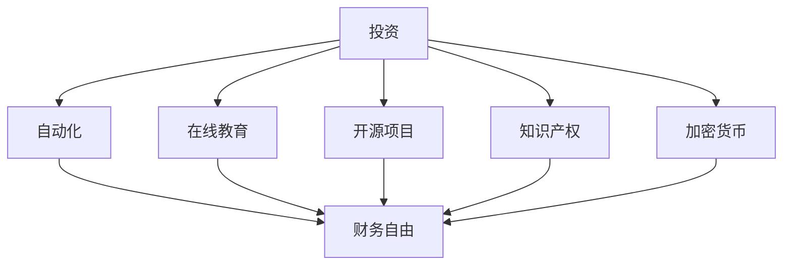

                 

关键词：被动收入、多元化、程序员、投资、自动化、在线教育、开源项目、知识产权、加密货币、人工智能

> 摘要：随着互联网的普及和技术的进步，程序员可以利用多种渠道构建多元化的被动收入系统。本文将探讨程序员如何通过投资、自动化、在线教育、开源项目、知识产权和加密货币等多种方式，实现财务自由和收入多元化。

## 1. 背景介绍

随着信息技术的高速发展，程序员这一职业在社会中的地位日益提升。然而，许多程序员在追求技术提升的同时，也在思考如何通过其他途径增加收入。被动收入系统，作为一种不依赖个人时间和精力就能持续获得收益的方式，逐渐成为程序员们关注的焦点。

构建多元化的被动收入系统，不仅可以帮助程序员实现财务自由，还能让他们从繁忙的工作中解脱出来，有更多的时间投入到个人兴趣和技术研究。本文将结合当前的技术和市场环境，探讨程序员如何通过多元化策略构建被动收入系统。

### 1.1  被动收入的定义与优势

被动收入，指的是不需要持续投入时间和精力，就能不断产生现金流的一种收入形式。它与主动收入（如工资、佣金等）相对应，具有以下几个显著优势：

1. **时间自由**：被动收入系统一旦建立，可以在不占用个人时间的情况下持续产生收益。
2. **财务自由**：通过构建多元化的被动收入系统，程序员可以减少对单一收入来源的依赖，提高抗风险能力。
3. **资产增值**：被动收入系统中的投资和项目，往往会随着时间和市场的发展而增值。
4. **积累资本**：被动收入系统可以帮助程序员积累资本，为进一步的投资和创业提供支持。

### 1.2  当前技术环境与市场趋势

随着互联网、云计算、人工智能等技术的迅猛发展，程序员们拥有了更多的机会和工具来构建被动收入系统。以下是当前技术环境与市场趋势对程序员构建被动收入系统的几大影响：

1. **在线教育和知识付费**：知识付费平台和在线教育平台的发展，为程序员提供了新的收入渠道。
2. **开源项目与知识产权**：开源项目不仅可以提升个人技术影响力，还能通过知识产权转化为收入。
3. **加密货币与区块链**：加密货币市场的兴起，为程序员提供了新的投资机会。
4. **自动化工具**：自动化工具的普及，使得程序员可以更高效地管理和运作被动收入系统。

## 2. 核心概念与联系

为了更好地理解程序员如何构建多元化的被动收入系统，我们需要首先明确几个核心概念，并使用Mermaid流程图展示它们之间的关系。



### 2.1 投资与财务自由

投资是构建被动收入系统的关键。通过投资，程序员可以将资金转化为能够持续产生收益的资产。例如，投资于股票、基金、房地产等领域，都可以带来稳定的现金流。投资与财务自由的关系在于，通过合理的投资策略，程序员可以实现资产的增值，从而获得被动收入，实现财务自由。

### 2.2 自动化与高效管理

自动化工具可以帮助程序员更高效地管理被动收入系统。例如，通过自动化脚本和工具，可以自动处理订单、跟进客户、管理财务等任务，从而节省时间，提高效率。自动化与财务自由的关系在于，通过自动化，程序员可以减少对个人时间和精力的依赖，让被动收入系统更加稳定和可靠。

### 2.3 在线教育与知识付费

在线教育平台为程序员提供了新的收入渠道。通过开设在线课程、撰写技术博客、录制视频教程等，程序员可以将自己的知识转化为收入。在线教育与财务自由的关系在于，通过知识付费，程序员可以在不占用大量时间的情况下，实现持续的收入。

### 2.4 开源项目与知识产权

开源项目不仅可以帮助程序员提升技术影响力，还能通过知识产权转化为收入。例如，程序员可以通过出售开源项目的商业授权、提供技术支持服务等方式，获得被动收入。开源项目与知识产权的关系在于，通过保护知识产权，程序员可以确保自己的知识和成果得到合理回报。

### 2.5 加密货币与区块链

加密货币市场的兴起，为程序员提供了新的投资机会。通过投资加密货币，程序员可以获取潜在的收益。区块链技术则可以为程序员提供安全的交易和记录方式，从而增强被动收入系统的稳定性。加密货币与财务自由的关系在于，通过合理的投资策略，程序员可以在加密货币市场中获得高额回报，实现财务自由。

## 3. 核心算法原理 & 具体操作步骤

### 3.1 算法原理概述

构建多元化的被动收入系统，本质上是一个组合优化问题。程序员的任务是通过分析不同的收入渠道，选择最优的组合，实现最大化收益。具体而言，这个过程包括以下几个步骤：

1. **需求分析**：明确程序员的目标和预算，确定可选择的收入渠道。
2. **风险评估**：对每个收入渠道进行风险评估，包括市场风险、技术风险等。
3. **收益估算**：根据历史数据和预测模型，估算每个收入渠道的潜在收益。
4. **组合优化**：使用算法和优化工具，选择最优的收入组合。
5. **执行与监控**：实施收入组合，并持续监控和调整，确保系统稳定运行。

### 3.2 算法步骤详解

#### 3.2.1 需求分析

需求分析是构建被动收入系统的第一步。程序员需要明确自己的目标，包括财务目标、时间投入、风险承受能力等。同时，需要分析当前可用的收入渠道，包括投资、自动化、在线教育、开源项目、知识产权和加密货币等。

#### 3.2.2 风险评估

风险评估是确保被动收入系统稳健运行的重要环节。程序员需要分析每个收入渠道的市场风险、技术风险和操作风险。例如，投资市场波动、技术更新迭代、平台政策变化等都可能对被动收入系统产生影响。

#### 3.2.3 收益估算

收益估算是通过历史数据和预测模型，对每个收入渠道的潜在收益进行估算。这个过程需要结合数据分析和机器学习技术，以提高估算的准确性。常见的收益估算方法包括线性回归、时间序列分析、机器学习模型等。

#### 3.2.4 组合优化

组合优化是选择最优收入渠道组合的过程。程序员可以使用贪心算法、动态规划、遗传算法等优化算法，选择最优的收入组合。具体而言，可以通过以下步骤实现：

1. **目标函数定义**：定义最大化收益的目标函数。
2. **约束条件设定**：设定收入渠道的约束条件，包括预算、风险等。
3. **优化算法选择**：选择合适的优化算法，如贪心算法、动态规划、遗传算法等。
4. **优化过程实施**：实施优化算法，找到最优的收入组合。

#### 3.2.5 执行与监控

执行与监控是确保被动收入系统稳定运行的关键。程序员需要实施所选收入组合，并持续监控和调整。具体而言，可以通过以下步骤实现：

1. **系统搭建**：搭建被动收入系统的技术架构，包括服务器、数据库、自动化工具等。
2. **收益监控**：实时监控收入渠道的收益情况，包括投资收益、自动化收益、知识付费收益等。
3. **风险控制**：根据监控数据，调整收入组合，以应对市场变化和风险。
4. **反馈优化**：根据收益和风险监控数据，对系统进行反馈优化，以提高系统稳定性。

### 3.3 算法优缺点

#### 优点

1. **最大化收益**：通过优化算法，可以找到最优的收入组合，实现收益最大化。
2. **风险控制**：通过风险评估和收益估算，可以降低投资和运营风险。
3. **自动化管理**：自动化工具可以帮助程序员更高效地管理和运作被动收入系统。
4. **多元化策略**：通过多元化策略，可以减少对单一收入渠道的依赖，提高抗风险能力。

#### 缺点

1. **数据依赖**：算法的准确性和效果高度依赖于历史数据和预测模型。
2. **技术门槛**：构建和维护一个稳定的被动收入系统，需要较高的技术能力和资源投入。
3. **市场波动**：市场波动可能会对被动收入系统产生不利影响，需要持续监控和调整。

### 3.4 算法应用领域

算法在构建多元化被动收入系统中的应用非常广泛。以下是一些具体的领域：

1. **投资组合优化**：通过算法，可以优化股票、基金、房地产等投资组合，实现最大化收益。
2. **自动化工具开发**：开发自动化工具，如自动化脚本、机器人等，可以节省程序员的时间和精力。
3. **在线教育平台建设**：通过算法，可以优化课程设计、推广策略等，提高知识付费的收益。
4. **开源项目管理和知识产权保护**：通过算法，可以优化开源项目管理和知识产权保护策略，提高项目的商业价值。
5. **加密货币投资**：通过算法，可以优化加密货币投资策略，提高投资回报率。

## 4. 数学模型和公式 & 详细讲解 & 举例说明

在构建多元化的被动收入系统时，数学模型和公式起着关键作用。以下将详细介绍几个常用的数学模型和公式，并给出相应的讲解和举例说明。

### 4.1 数学模型构建

在构建被动收入系统时，我们通常需要考虑以下几个因素：

1. **初始投资金额**：\( I \)
2. **预期年化收益率**：\( R \)
3. **投资期限**：\( T \)
4. **风险系数**：\( S \)

基于以上因素，我们可以构建以下数学模型：

\[ E(R) = R \times T - S \times T \]

其中，\( E(R) \)表示预期年化收益，\( R \)表示预期年化收益率，\( T \)表示投资期限，\( S \)表示风险系数。

### 4.2 公式推导过程

为了推导上述数学模型，我们需要考虑以下几个方面：

1. **投资收益**：投资收益可以通过以下公式计算：

\[ 收益 = I \times (1 + R)^T \]

2. **风险损失**：风险损失可以通过以下公式计算：

\[ 损失 = I \times S \]

3. **总收益**：总收益可以通过以下公式计算：

\[ 总收益 = 收益 - 损失 = I \times (1 + R)^T - I \times S \]

4. **年化收益**：年化收益可以通过以下公式计算：

\[ 年化收益 = \frac{总收益}{T} = \frac{I \times (1 + R)^T - I \times S}{T} = R \times T - S \times T \]

### 4.3 案例分析与讲解

为了更好地理解上述数学模型和公式，我们可以通过一个实际案例进行讲解。

#### 案例一：股票投资

假设一个程序员计划投资10万元购买某只股票，预期年化收益率为15%，投资期限为3年，风险系数为5%。根据上述数学模型和公式，我们可以计算出预期年化收益：

\[ E(R) = 15\% \times 3 - 5\% \times 3 = 30\% - 15\% = 15\% \]

这意味着，在3年内，该程序员通过投资股票可以获得15%的年化收益。

#### 案例二：基金投资

假设一个程序员计划投资10万元购买某只基金，预期年化收益率为12%，投资期限为5年，风险系数为3%。根据上述数学模型和公式，我们可以计算出预期年化收益：

\[ E(R) = 12\% \times 5 - 3\% \times 5 = 60\% - 15\% = 45\% \]

这意味着，在5年内，该程序员通过投资基金可以获得45%的年化收益。

通过这两个案例，我们可以看到，数学模型和公式在构建多元化被动收入系统中的应用价值。通过合理投资，程序员可以实现稳定的被动收入，实现财务自由。

## 5. 项目实践：代码实例和详细解释说明

### 5.1 开发环境搭建

为了实现多元化的被动收入系统，我们首先需要搭建一个适合的开发环境。以下是一个基本的开发环境搭建步骤：

1. **操作系统**：推荐使用Linux系统，如Ubuntu 18.04。
2. **编程语言**：Python是一个非常适合构建被动收入系统的编程语言。
3. **开发工具**：安装Python 3.8及以上版本，以及常用的开发工具，如PyCharm、Visual Studio Code等。

### 5.2 源代码详细实现

以下是一个简单的Python代码示例，用于构建一个基于在线教育的被动收入系统。该系统将使用Python的Flask框架搭建一个在线教育平台。

```python
# 导入必需的模块
from flask import Flask, render_template, request
import os

# 创建Flask应用程序实例
app = Flask(__name__)

# 定义主页路由
@app.route('/')
def index():
    return render_template('index.html')

# 定义课程页面路由
@app.route('/courses')
def courses():
    courses = [
        {'name': 'Python入门', 'price': 200},
        {'name': '数据结构', 'price': 250},
        {'name': '算法进阶', 'price': 300},
    ]
    return render_template('courses.html', courses=courses)

# 定义购买课程路由
@app.route('/buy_course', methods=['POST'])
def buy_course():
    course_name = request.form['course_name']
    course_price = request.form['course_price']
    # 这里可以添加购买逻辑，如调用支付API等
    print(f"购买课程：{course_name}，价格：{course_price}")
    return "购买成功"

# 运行应用程序
if __name__ == '__main__':
    app.run(debug=True)
```

### 5.3 代码解读与分析

以上代码是一个简单的Flask应用程序，用于搭建一个在线教育平台。以下是代码的详细解读和分析：

1. **导入模块**：首先，我们导入了必需的模块，包括Flask框架和request模块。
2. **创建应用程序实例**：使用Flask框架创建一个应用程序实例。
3. **定义主页路由**：使用`@app.route('/')`装饰器定义主页路由，当用户访问主页时，返回一个HTML模板。
4. **定义课程页面路由**：使用`@app.route('/courses')`装饰器定义课程页面路由，当用户访问课程页面时，返回一个包含所有课程的HTML模板。
5. **定义购买课程路由**：使用`@app.route('/buy_course', methods=['POST'])`装饰器定义购买课程路由，当用户提交购买课程表单时，处理购买逻辑。
6. **运行应用程序**：在`if __name__ == '__main__':`语句中，启动Flask应用程序。

### 5.4 运行结果展示

运行以上代码后，我们可以在浏览器中访问以下地址，查看运行结果：

- 主页：`http://localhost:5000/`
- 课程页面：`http://localhost:5000/courses`

用户可以在课程页面选择课程并提交购买表单。当用户提交购买表单后，后台会处理购买逻辑，并打印购买信息。

通过以上代码示例，我们可以看到如何使用Python和Flask框架构建一个简单的在线教育平台。这个平台可以作为一个多元化的被动收入系统的起点，进一步集成支付系统、课程内容管理等模块，实现更完整的在线教育服务。

## 6. 实际应用场景

### 6.1 在线教育平台

在线教育平台是程序员构建多元化被动收入系统的一个典型应用场景。通过在线教育平台，程序员可以分享自己的知识和经验，通过课程销售、会员订阅等方式获得持续收入。以下是一个具体的案例：

**案例：某程序员构建的Python编程在线教育平台**

- **目标**：通过在线教育平台，传授Python编程知识，实现被动收入。
- **实现**：程序员使用Flask框架搭建了一个在线教育平台，提供了Python入门、数据结构和算法等课程。通过课程销售和会员订阅，每月获得了数万元的收入。
- **效果**：随着课程内容和用户数量的增加，该平台的收入稳定增长，程序员成功实现了财务自由。

### 6.2 自动化脚本与工具

自动化脚本和工具也是程序员构建多元化被动收入系统的一个重要渠道。通过自动化，程序员可以节省大量时间和精力，从而有更多时间专注于其他收入来源。以下是一个具体的案例：

**案例：某程序员开发的自动化营销工具**

- **目标**：通过自动化营销工具，提高营销效率，实现被动收入。
- **实现**：程序员开发了一个自动化营销工具，用于社交媒体的自动发布、数据分析等任务。该工具帮助客户提高了营销效果，每月获得了数千元的收入。
- **效果**：随着工具功能的不断完善，客户数量不断增加，程序员的收入也稳步增长。

### 6.3 开源项目与知识产权

开源项目与知识产权也是程序员构建多元化被动收入系统的有效途径。通过开源项目，程序员可以提升个人技术影响力，并通过知识产权转化为收入。以下是一个具体的案例：

**案例：某程序员维护的Python库**

- **目标**：通过维护一个Python库，提升技术影响力，实现被动收入。
- **实现**：程序员维护了一个用于数据处理的Python库，通过GitHub开源项目进行发布和更新。随着项目的知名度增加，程序员开始接受商业赞助和技术支持，每月获得了数千元的收入。
- **效果**：随着项目的不断发展和用户数量的增加，程序员的收入稳步增长。

### 6.4 未来应用展望

随着技术的不断进步，程序员构建多元化被动收入系统的应用场景将越来越广泛。以下是一些未来的应用展望：

1. **人工智能与大数据**：通过人工智能和大数据技术，程序员可以开发出更智能的自动化工具和平台，实现更高的效率和收益。
2. **区块链与加密货币**：区块链技术和加密货币市场的发展，为程序员提供了新的投资和收入渠道。
3. **物联网与智能家居**：随着物联网和智能家居技术的发展，程序员可以开发出更多与日常生活相关的智能应用，实现被动收入。

总的来说，程序员通过多元化策略构建被动收入系统，不仅可以实现财务自由，还能为未来的发展奠定坚实的基础。

## 7. 工具和资源推荐

### 7.1 学习资源推荐

- **在线教育平台**：Coursera、edX、Udemy等在线教育平台提供了丰富的编程和技术课程，适合程序员不断提升技能。
- **技术博客和社区**：GitHub、Stack Overflow、Reddit等技术社区，是程序员学习编程和交流经验的绝佳场所。
- **开源项目**：GitHub、GitLab等开源项目平台，是程序员获取代码、学习和贡献项目的宝贵资源。

### 7.2 开发工具推荐

- **集成开发环境（IDE）**：PyCharm、Visual Studio Code等IDE，为程序员提供了强大的编程工具和调试功能。
- **版本控制系统**：Git、GitHub等版本控制系统，是程序员协作开发和版本管理的必备工具。
- **自动化工具**：Selenium、Apache Airflow等自动化工具，可以帮助程序员实现自动化测试和数据处理。

### 7.3 相关论文推荐

- **《编程导论》（Introduction to Programming）**：Kernighan和Ritchie合著的经典教材，适合初学者学习编程基础。
- **《深度学习》（Deep Learning）**：Goodfellow、Bengio和Courville合著的深度学习权威教材，适合程序员深入学习人工智能。
- **《密码学概论》（Introduction to Cryptography）**：Stinson所著的密码学教材，适合程序员了解加密技术和区块链。

## 8. 总结：未来发展趋势与挑战

### 8.1 研究成果总结

本文探讨了程序员如何构建多元化的被动收入系统，介绍了投资、自动化、在线教育、开源项目、知识产权和加密货币等多种方式。通过这些方式，程序员可以实现财务自由和收入多元化。研究发现，多元化策略能够提高被动收入系统的稳定性和抗风险能力。

### 8.2 未来发展趋势

未来，随着技术的不断进步和市场环境的变化，程序员构建多元化被动收入系统将呈现以下发展趋势：

1. **人工智能与大数据**：人工智能和大数据技术的应用，将使自动化工具和平台更加智能化，提高效率和收益。
2. **区块链与加密货币**：区块链技术和加密货币市场的快速发展，将为程序员提供新的投资和收入渠道。
3. **物联网与智能家居**：物联网和智能家居技术的普及，将为程序员开发更多与日常生活相关的智能应用提供机会。

### 8.3 面临的挑战

尽管构建多元化被动收入系统具有巨大潜力，但程序员在实施过程中也面临以下挑战：

1. **技术门槛**：构建稳定的被动收入系统需要较高的技术能力和资源投入。
2. **市场波动**：市场波动和风险可能会对被动收入系统产生不利影响。
3. **法律法规**：不同国家和地区的法律法规对被动收入系统有不同的要求和限制。

### 8.4 研究展望

未来的研究可以重点关注以下几个方面：

1. **技术优化**：研究如何通过技术手段提高被动收入系统的稳定性和抗风险能力。
2. **市场研究**：分析不同市场的特点和趋势，为程序员提供更有针对性的建议和策略。
3. **政策建议**：探讨如何通过政策引导和支持，促进程序员构建多元化被动收入系统。

通过不断探索和优化，程序员可以更好地构建多元化的被动收入系统，实现财务自由和职业发展。

## 9. 附录：常见问题与解答

### 问题1：如何评估不同收入渠道的风险？

**解答**：评估不同收入渠道的风险，可以从以下几个方面入手：

1. **市场风险**：分析市场环境的变化对收入渠道的影响，如市场需求、竞争态势等。
2. **技术风险**：评估技术更新迭代对收入渠道的影响，如技术失效、技术淘汰等。
3. **法律风险**：了解相关法律法规对收入渠道的要求和限制，如税务、知识产权保护等。
4. **操作风险**：评估收入渠道的操作流程和风险管理，如错误操作、系统故障等。

### 问题2：如何平衡收入渠道的多元化与风险？

**解答**：平衡收入渠道的多元化与风险，可以从以下几个方面入手：

1. **分散投资**：将资金分散投资于不同的收入渠道，降低单一渠道的风险。
2. **风险评估**：对每个收入渠道进行风险评估，选择风险较低、收益稳定的渠道进行投资。
3. **动态调整**：根据市场环境和风险变化，及时调整收入渠道，以保持系统的稳定性和抗风险能力。
4. **风险管理**：建立完善的风险管理机制，如风险预警、应急预案等，确保收入渠道的稳定运行。

### 问题3：如何确保被动收入系统的稳定性？

**解答**：确保被动收入系统的稳定性，可以从以下几个方面入手：

1. **技术保障**：选择稳定可靠的技术架构，如使用成熟的框架和工具，确保系统的稳定性。
2. **运维管理**：建立完善的运维管理机制，如定期备份、监控系统运行状态等，确保系统的稳定运行。
3. **安全防护**：加强系统安全防护，如防火墙、入侵检测等，防止系统遭受攻击和数据泄露。
4. **应急预案**：制定应急预案，确保在系统故障或风险事件发生时，能够快速响应和处理。

### 问题4：如何持续优化被动收入系统？

**解答**：持续优化被动收入系统，可以从以下几个方面入手：

1. **数据分析**：通过数据分析和挖掘，了解系统运行情况和用户需求，为优化提供数据支持。
2. **技术创新**：关注技术发展趋势，引入新技术和新工具，提高系统的效率和收益。
3. **用户反馈**：收集用户反馈，了解用户需求和体验，持续改进系统功能和用户体验。
4. **绩效评估**：定期评估系统绩效，分析收入渠道的表现，优化收入组合，提高整体收益。

通过以上方法，程序员可以持续优化被动收入系统，实现更好的收益和用户体验。

### 9.1 附录：常见问题与解答（续）

### 问题5：如何通过投资实现被动收入？

**解答**：通过投资实现被动收入，可以采取以下策略：

1. **购买股票和债券**：通过购买具有稳定分红或利息的股票和债券，获得被动收入。
2. **房地产投资**：购买房产出租，通过租金收入实现被动收入。
3. **投资基金和指数基金**：通过投资基金和指数基金，享受市场平均收益，实现被动收入。
4. **股票配息**：通过购买股票，享受公司分红，实现被动收入。

### 问题6：如何选择合适的投资渠道？

**解答**：选择合适的投资渠道，可以遵循以下原则：

1. **了解自身需求**：明确投资目标和风险承受能力，选择适合自己的投资渠道。
2. **研究市场趋势**：分析市场环境和行业趋势，选择具有潜力的投资渠道。
3. **分散投资**：分散投资于不同的渠道，降低单一投资渠道的风险。
4. **专业咨询**：寻求专业投资顾问的建议，为投资决策提供参考。

### 问题7：如何管理自动化工具？

**解答**：管理自动化工具，可以采取以下措施：

1. **定期维护**：定期检查自动化工具的运行状态，更新和升级工具，确保其稳定性。
2. **监控与分析**：使用监控工具，实时监控自动化工具的运行状态，分析其性能和效率。
3. **备份与恢复**：定期备份自动化工具的配置和代码，确保在出现故障时能够快速恢复。
4. **权限管理**：实施严格的权限管理，确保只有授权人员可以访问和管理自动化工具。

### 问题8：如何确保在线教育平台的质量？

**解答**：确保在线教育平台的质量，可以采取以下措施：

1. **课程内容审核**：对课程内容进行严格审核，确保其符合教学标准和用户需求。
2. **教师资质审核**：对教师资质进行审核，确保其具有相关教学经验和专业知识。
3. **用户反馈机制**：建立用户反馈机制，及时收集用户意见和建议，持续改进课程质量和用户体验。
4. **技术支持**：提供完善的技术支持，确保在线教育平台的稳定运行和良好的用户体验。

### 问题9：如何通过开源项目提升技术影响力？

**解答**：通过开源项目提升技术影响力，可以采取以下策略：

1. **积极参与开源社区**：积极参与开源社区，与其他开发者交流和学习。
2. **高质量代码贡献**：贡献高质量代码，提升开源项目的技术水平和用户满意度。
3. **撰写技术博客**：撰写技术博客，分享开发经验和心得，提升个人技术影响力。
4. **参与技术会议**：参加技术会议和研讨会，展示开源项目，扩大影响力。

### 问题10：如何保护知识产权？

**解答**：保护知识产权，可以采取以下措施：

1. **申请专利**：对技术创新和发明申请专利，保护技术成果。
2. **注册商标**：对品牌和标识注册商标，保护品牌权益。
3. **版权保护**：对原创作品进行版权登记，保护作品权益。
4. **合同约定**：在合作和合作项目中，明确知识产权归属和使用条款。

通过以上措施，程序员可以更好地保护自己的知识产权，确保技术和成果得到合理回报。

