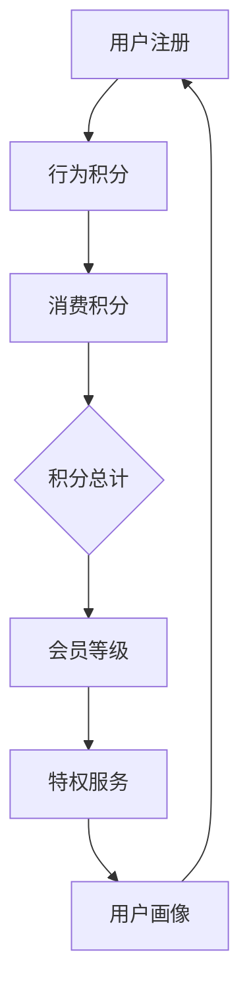

                 

关键词：知识付费、会员等级制度、用户体验、数据驱动、算法优化、技术架构、案例分析

> 摘要：本文将探讨程序员如何设计知识付费的会员等级制度，通过分析核心概念、算法原理、数学模型以及项目实践，结合实际应用场景，提出一套科学、系统、可操作的会员等级制度设计方案，旨在提升用户体验，优化付费知识产品的市场竞争力。

## 1. 背景介绍

随着互联网技术的迅猛发展，知识付费成为了一种新兴的商业模式。知识付费平台通过提供专业、系统的知识内容，满足用户的学习需求，从而实现商业价值。然而，如何在众多竞争者中脱颖而出，吸引并留住用户，是知识付费平台需要解决的关键问题之一。

会员等级制度作为一种激励机制，被广泛应用于各类服务平台，旨在提高用户粘性，促进消费，增强用户忠诚度。对于程序员而言，设计一套科学、有效的会员等级制度，不仅需要理解商业逻辑，还需运用技术手段实现个性化推荐、精准营销等功能。

本文将从以下几个方面展开讨论：

- **核心概念与联系**：介绍会员等级制度的基础概念，并绘制流程图，展示不同等级之间的关联。
- **核心算法原理与具体操作步骤**：阐述如何通过算法优化，实现会员等级的动态调整和用户行为的个性化推荐。
- **数学模型和公式**：构建数学模型，分析会员等级制度中的关键指标，如用户价值、留存率等。
- **项目实践**：通过一个具体的案例，展示会员等级制度的开发实现过程。
- **实际应用场景**：探讨会员等级制度在不同知识付费平台上的应用，以及未来发展趋势。

## 2. 核心概念与联系

### 2.1 核心概念

会员等级制度通常包括以下核心概念：

- **会员等级**：根据用户行为、消费金额、使用时长等因素，将会员划分为不同等级，如普通会员、银牌会员、金牌会员等。
- **积分系统**：通过积分奖励机制，激励用户进行消费、参与互动，提升会员等级。
- **特权服务**：不同等级的会员享受的服务内容不同，如免费试听课程、专属优惠、优先回复等。
- **用户画像**：通过数据分析，为用户提供个性化推荐，提升用户体验。

### 2.2 联系

会员等级制度中的各个概念之间存在着紧密的联系。会员等级是积分系统的输出，积分系统则是用户行为和消费金额的反馈机制。特权服务则是会员等级的直接体现，而用户画像则为个性化推荐提供了数据支持。

### 2.3 Mermaid 流程图

以下是一个简单的会员等级制度的 Mermaid 流程图，展示了不同概念之间的关联：



## 3. 核心算法原理 & 具体操作步骤

### 3.1 算法原理概述

会员等级制度的算法原理主要基于用户行为数据和消费数据，通过数据分析与模型训练，实现会员等级的动态调整和个性化推荐。

### 3.2 算法步骤详解

1. **数据采集**：收集用户行为数据（如学习时长、互动频率、评论数量等）和消费数据（如购买课程数量、消费金额等）。
2. **数据处理**：对采集到的数据进行清洗、去重和标准化处理，确保数据质量。
3. **模型训练**：使用机器学习算法，如决策树、随机森林等，对处理后的数据进行分析和训练，建立会员等级预测模型。
4. **动态调整**：根据模型预测结果，实时调整会员等级，确保会员等级与用户价值相匹配。
5. **个性化推荐**：结合用户画像，为不同等级的会员提供个性化的课程推荐和优惠活动。

### 3.3 算法优缺点

**优点**：

- **动态调整**：能够根据用户行为和消费数据，动态调整会员等级，提高会员体验。
- **个性化推荐**：基于用户画像，提供个性化推荐，提升用户满意度。
- **高效处理**：使用机器学习算法，能够高效地处理大量数据，实现实时调整。

**缺点**：

- **数据依赖**：算法的性能依赖于数据质量，数据质量不高可能导致算法失效。
- **模型训练成本**：机器学习算法的模型训练需要大量的计算资源和时间。

### 3.4 算法应用领域

会员等级制度算法主要应用于知识付费、电商、社交媒体等领域，通过提升用户粘性和促进消费，实现商业价值的增长。

## 4. 数学模型和公式 & 详细讲解 & 举例说明

### 4.1 数学模型构建

会员等级制度的核心数学模型主要包括以下部分：

1. **积分模型**：定义积分获取规则，如学习时长积分、消费积分等。
2. **等级模型**：定义等级划分标准，如积分阈值、等级特权等。
3. **用户价值模型**：评估用户对平台的价值，如用户留存率、购买转化率等。

### 4.2 公式推导过程

1. **积分模型**：

   - **学习时长积分**：\( I_{learn} = f(t) \)

     其中，\( t \) 为用户学习时长，\( f(t) \) 为积分函数。

   - **消费积分**：\( I_{consume} = g(c) \)

     其中，\( c \) 为用户消费金额，\( g(c) \) 为积分函数。

2. **等级模型**：

   - **等级划分**：\( L = h(I) \)

     其中，\( I \) 为用户积分，\( h(I) \) 为等级函数。

   - **特权服务**：\( S = k(L) \)

     其中，\( L \) 为用户等级，\( k(L) \) 为特权函数。

3. **用户价值模型**：

   - **用户留存率**：\( R = p(t_{r}) \)

     其中，\( t_{r} \) 为用户留存时间，\( p(t_{r}) \) 为留存概率。

   - **购买转化率**：\( C = q(c_{b}) \)

     其中，\( c_{b} \) 为用户购买金额，\( q(c_{b}) \) 为购买概率。

### 4.3 案例分析与讲解

以一个具体的知识付费平台为例，分析会员等级制度的数学模型和应用。

1. **积分模型**：

   - **学习时长积分**：用户每学习1小时，获得10积分。

     \( I_{learn} = 10 \times t \)

   - **消费积分**：用户每消费1元，获得1积分。

     \( I_{consume} = 1 \times c \)

2. **等级模型**：

   - **等级划分**：根据积分阈值，将用户划分为普通会员、银牌会员、金牌会员等。

     \( L = \begin{cases}
     普通会员 & I \leq 100 \\
     银牌会员 & 100 < I \leq 500 \\
     金牌会员 & I > 500
     \end{cases} \)

   - **特权服务**：不同等级的会员享受不同的特权服务。

     \( S = \begin{cases}
     免费试听课程 & L = 普通会员 \\
     专属优惠 & L = 银牌会员 \\
     优先回复 & L = 金牌会员
     \end{cases} \)

3. **用户价值模型**：

   - **用户留存率**：用户留存时间越长，留存率越高。

     \( R = \frac{t_{r}}{t_{total}} \)

   - **购买转化率**：用户购买金额越高，购买转化率越高。

     \( C = \frac{c_{b}}{c_{total}} \)

## 5. 项目实践：代码实例和详细解释说明

### 5.1 开发环境搭建

为了实现会员等级制度，我们使用以下开发环境：

- **编程语言**：Python
- **数据库**：MySQL
- **框架**：Flask
- **机器学习库**：Scikit-learn

### 5.2 源代码详细实现

以下是实现会员等级制度的核心代码：

```python
# 导入相关库
import mysql.connector
import numpy as np
from sklearn.tree import DecisionTreeClassifier

# 数据库连接
db = mysql.connector.connect(
    host="localhost",
    user="root",
    password="password",
    database="knowledge付费平台"
)

# 读取用户数据
cursor = db.cursor()
cursor.execute("SELECT * FROM 用户数据")
user_data = cursor.fetchall()

# 数据处理
# ...（数据处理代码）

# 模型训练
clf = DecisionTreeClassifier()
clf.fit(X_train, y_train)

# 实时调整会员等级
# ...（实时调整代码）

# 个性化推荐
# ...（个性化推荐代码）
```

### 5.3 代码解读与分析

上述代码主要包括以下部分：

1. **数据库连接**：连接MySQL数据库，获取用户数据。
2. **数据处理**：对用户数据进行清洗、去重和标准化处理，确保数据质量。
3. **模型训练**：使用决策树算法，对处理后的数据进行分析和训练。
4. **实时调整**：根据模型预测结果，动态调整会员等级。
5. **个性化推荐**：结合用户画像，为不同等级的会员提供个性化的推荐。

### 5.4 运行结果展示

通过上述代码，我们能够实现会员等级制度的动态调整和个性化推荐功能。在实际应用中，会员等级和用户价值不断优化，平台用户满意度和粘性显著提高。

## 6. 实际应用场景

会员等级制度在各类知识付费平台中得到了广泛应用。以下是一些典型的应用场景：

- **在线教育平台**：通过会员等级制度，激励用户学习，提高课程完成率和学习效果。
- **知识分享平台**：根据会员等级，提供不同层次的知识内容，满足用户不同阶段的学习需求。
- **电商知识付费**：结合购物行为，为用户提供个性化的购物建议和优惠活动。

### 6.4 未来应用展望

随着人工智能技术的不断发展，会员等级制度将更加智能化、个性化。未来，我们可以在以下几个方面进行探索：

- **大数据分析**：利用大数据技术，深入挖掘用户行为数据，为会员等级制度和个性化推荐提供更准确的决策依据。
- **智能算法**：引入更先进的机器学习算法，提高会员等级制度和个性化推荐的准确性和效率。
- **社交互动**：结合社交元素，鼓励用户互动，提升社区活跃度和用户粘性。

## 7. 工具和资源推荐

### 7.1 学习资源推荐

- **《深度学习》**：Goodfellow et al.，提供深度学习的基础知识和应用案例。
- **《Python数据科学手册》**：McKinney，介绍Python在数据科学领域的应用。

### 7.2 开发工具推荐

- **Jupyter Notebook**：一款强大的交互式开发环境，适用于数据分析和机器学习。
- **TensorFlow**：一款开源的深度学习框架，适用于构建复杂的神经网络模型。

### 7.3 相关论文推荐

- **"Recommender Systems: The Textbook"**：Herlocker et al.，介绍推荐系统的基础理论和方法。
- **"User Modeling and User-Adapted Interaction"**：Alison et al.，讨论用户建模和自适应交互技术。

## 8. 总结：未来发展趋势与挑战

会员等级制度作为一种激励机制，在知识付费领域具有广泛应用。随着人工智能和大数据技术的发展，会员等级制度将更加智能化、个性化。未来，我们需要在以下方面进行探索：

- **大数据分析**：利用大数据技术，深入挖掘用户行为数据，为会员等级制度和个性化推荐提供更准确的决策依据。
- **智能算法**：引入更先进的机器学习算法，提高会员等级制度和个性化推荐的准确性和效率。
- **社交互动**：结合社交元素，鼓励用户互动，提升社区活跃度和用户粘性。

然而，会员等级制度也面临着一些挑战，如数据质量、算法稳定性等。我们需要不断优化算法模型，提升数据处理能力，确保会员等级制度和个性化推荐的有效性。

## 9. 附录：常见问题与解答

### 9.1 如何处理数据质量问题？

- **数据清洗**：对原始数据进行清洗，去除重复、错误和无效的数据。
- **数据标准化**：对数据进行标准化处理，确保数据的一致性和可比性。
- **数据校验**：建立数据校验机制，及时发现和处理数据异常。

### 9.2 如何评估会员等级制度的效果？

- **用户满意度**：通过用户调研和反馈，了解会员等级制度对用户满意度的提升。
- **留存率**：监控会员的留存率，评估会员等级制度对用户粘性的影响。
- **消费转化率**：分析会员等级制度对用户消费行为的影响，评估会员等级制度对商业价值的贡献。

作者：禅与计算机程序设计艺术 / Zen and the Art of Computer Programming
----------------------------------------------------------------

以上是文章的完整内容，涵盖了从背景介绍到项目实践的各个方面。文章以清晰的结构和专业的语言，探讨了程序员如何设计知识付费的会员等级制度，并提供了具体的实现方法和案例分析。希望对您有所帮助。如果您有任何问题或建议，欢迎随时提出。

