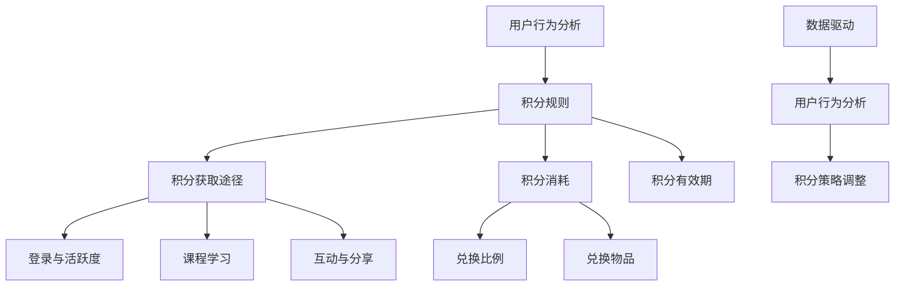

                 

关键词：知识付费、积分体系、程序员、设计原则、用户体验、算法原理、数学模型、项目实践、应用场景

> 摘要：本文将探讨程序员如何设计知识付费的积分体系，从核心概念、算法原理、数学模型、项目实践等方面进行分析，旨在为开发者提供一套完整、实用且具有可扩展性的积分体系设计方案。

## 1. 背景介绍

随着知识经济的不断发展，知识付费已经成为互联网时代的重要商业模式。在知识付费平台上，用户通过购买课程、专栏、电子书等方式获取知识，平台则通过积分体系来激励用户活跃度和忠诚度。积分体系作为知识付费平台的核心机制之一，对于提升用户体验、增加用户粘性具有重要作用。

程序员在设计知识付费积分体系时，需要考虑以下几个关键因素：

1. **用户体验**：积分体系应简洁易懂，能够快速吸引用户参与，同时提供多样化的积分获取途径。
2. **激励机制**：积分体系需要具备良好的激励机制，鼓励用户持续学习、参与互动。
3. **数据驱动**：积分体系的设计应基于大数据分析，能够实时调整积分策略，优化用户体验。
4. **可扩展性**：积分体系需要具备良好的扩展性，以适应未来业务的发展需求。

本文将围绕以上四个方面，详细探讨程序员如何设计知识付费的积分体系。

## 2. 核心概念与联系

在设计积分体系之前，我们需要了解一些核心概念和它们之间的联系。

### 2.1 用户行为分析

用户行为分析是积分体系设计的基础。通过对用户行为的分析，我们可以确定哪些行为能够为平台带来价值，并据此设计积分策略。

- **登录与活跃度**：用户登录和活跃度是积分体系设计的重要指标。
- **课程学习**：用户观看课程、完成作业、参与讨论等行为都可以作为积分获取的途径。
- **互动与分享**：用户在平台上的互动和分享行为也能够增加积分。

### 2.2 积分规则

积分规则是积分体系的骨架，决定了用户如何获取积分。积分规则通常包括以下几个方面：

- **积分获取途径**：用户可以通过登录、学习、互动等途径获取积分。
- **积分消耗**：用户可以使用积分兑换课程、优惠券等。
- **积分有效期**：积分的有效期管理，以防止用户长期不参与活动而失去积分。

### 2.3 积分兑换

积分兑换是用户对积分价值的一种体现。合理的积分兑换机制能够提升用户的积极性。

- **兑换比例**：积分与兑换物品的比例设计应合理，避免用户感到不公平。
- **兑换物品**：兑换物品的种类应多样化，以满足不同用户的需求。

### 2.4 数据驱动

数据驱动是积分体系设计的核心思想。通过大数据分析，我们可以实时了解用户行为，优化积分策略，提升用户体验。

- **用户行为分析**：通过分析用户行为，确定哪些行为能够为平台带来价值。
- **积分策略调整**：根据用户行为数据，实时调整积分策略，优化用户体验。

### 2.5 Mermaid 流程图

为了更好地展示积分体系的核心概念和联系，我们可以使用 Mermaid 流程图进行描述。



## 3. 核心算法原理 & 具体操作步骤

### 3.1 算法原理概述

积分体系的设计离不开核心算法的支撑。核心算法主要包括积分计算、积分兑换、积分有效期管理等。

- **积分计算**：根据用户行为，计算用户应获得的积分数量。
- **积分兑换**：根据用户积分数量，计算用户可以兑换的物品数量。
- **积分有效期管理**：根据积分获取和消耗情况，管理积分的有效期。

### 3.2 算法步骤详解

#### 3.2.1 积分计算

1. 确定用户行为积分值：根据不同用户行为，设定相应的积分值。
2. 计算用户总积分：将用户各类行为的积分值相加，得到用户总积分。
3. 更新用户积分：将计算得到的总积分更新到用户积分记录中。

#### 3.2.2 积分兑换

1. 确定兑换比例：设定积分与兑换物品的比例。
2. 计算兑换数量：根据用户积分数量，计算用户可以兑换的物品数量。
3. 更新用户积分：扣除兑换所需的积分，更新用户积分记录。

#### 3.2.3 积分有效期管理

1. 确定积分有效期：设定积分的有效期。
2. 检查积分有效期：定期检查用户积分的有效期。
3. 处理过期积分：对过期积分进行处理，如清零或转换为其他形式。

### 3.3 算法优缺点

#### 优点

1. **灵活性**：算法可以根据用户行为和平台需求进行灵活调整。
2. **公平性**：积分计算和兑换过程公开透明，用户易于接受。
3. **可扩展性**：算法设计简单，易于扩展新功能。

#### 缺点

1. **计算复杂度**：积分计算和兑换过程可能涉及多个环节，计算复杂度较高。
2. **数据存储需求**：需要存储大量的用户行为数据和积分记录，对数据库性能有一定要求。

### 3.4 算法应用领域

积分体系算法可以广泛应用于各种知识付费平台，如在线教育、专业培训等。通过合理设计积分体系，可以提升用户活跃度和忠诚度，从而提高平台的商业价值。

## 4. 数学模型和公式

### 4.1 数学模型构建

积分体系设计中的数学模型主要包括积分计算模型和积分兑换模型。

#### 4.1.1 积分计算模型

积分计算模型可以表示为：

\[ 积分 = \sum_{i=1}^{n} (行为_i \times 积分值_i) \]

其中，\( 行为_i \) 表示用户第 \( i \) 种行为，\( 积分值_i \) 表示第 \( i \) 种行为的积分值。

#### 4.1.2 积分兑换模型

积分兑换模型可以表示为：

\[ 兑换物品数量 = \frac{积分}{兑换比例} \]

其中，\( 兑换比例 \) 表示积分与兑换物品的比例。

### 4.2 公式推导过程

#### 4.2.1 积分计算公式推导

根据积分计算模型，积分计算公式可以推导为：

\[ 积分 = 行为_1 \times 积分值_1 + 行为_2 \times 积分值_2 + \ldots + 行为_n \times 积分值_n \]

假设用户完成了以下行为：

1. 登录：积分值为 \( x \)
2. 学习：积分值为 \( y \)
3. 互动：积分值为 \( z \)

则用户总积分可以表示为：

\[ 积分 = x + y + z \]

#### 4.2.2 积分兑换公式推导

根据积分兑换模型，积分兑换公式可以推导为：

\[ 兑换物品数量 = \frac{积分}{兑换比例} \]

假设积分与兑换物品的比例为 \( p \)，则用户可以兑换的物品数量为：

\[ 兑换物品数量 = \frac{积分}{p} \]

### 4.3 案例分析与讲解

#### 4.3.1 登录积分计算

假设用户登录积分值为 \( x = 10 \)，则用户登录后获得的积分为 \( 10 \)。

#### 4.3.2 学习积分计算

假设用户学习积分值为 \( y = 5 \)，用户观看了一门价值 \( 100 \) 元的课程，则用户学习后获得的积分为：

\[ 积分 = 10 + 5 \times 100 = 510 \]

#### 4.3.3 互动积分计算

假设用户互动积分值为 \( z = 3 \)，用户参与了 10 次讨论，则用户互动后获得的积分为：

\[ 积分 = 510 + 3 \times 10 = 530 \]

#### 4.3.4 积分兑换

假设积分与兑换物品的比例为 \( p = 100:1 \)，则用户可以兑换的物品数量为：

\[ 兑换物品数量 = \frac{530}{100} = 5.3 \]

用户可以兑换价值 \( 5.3 \) 元的物品。

## 5. 项目实践：代码实例和详细解释说明

### 5.1 开发环境搭建

为了更好地展示积分体系的代码实现，我们使用 Python 作为开发语言，搭建一个简单的积分体系。

#### 5.1.1 环境准备

1. 安装 Python 3.8 及以上版本。
2. 安装必要的 Python 库，如 Pandas、NumPy 等。

#### 5.1.2 代码结构

代码结构如下：

```python
# 积分计算模块
def calculate_points(user行为的列表):
    # 计算积分
    pass

# 积分兑换模块
def exchange_points(points, exchange_rate):
    # 计算兑换物品数量
    pass

# 主程序
if __name__ == "__main__":
    # 模拟用户行为
    user_actions = ["登录", "学习", "互动"]
    # 计算积分
    points = calculate_points(user_actions)
    # 显示积分
    print("用户积分：", points)
    # 设定兑换比例
    exchange_rate = 100
    # 计算兑换物品数量
    exchange_items = exchange_points(points, exchange_rate)
    # 显示兑换物品数量
    print("可以兑换的物品数量：", exchange_items)
```

### 5.2 源代码详细实现

#### 5.2.1 积分计算模块

```python
# 积分计算模块
def calculate_points(user_actions):
    points = 0
    # 登录积分
    if "登录" in user_actions:
        points += 10
    # 学习积分
    if "学习" in user_actions:
        points += 5 * 100  # 假设学习一门课程的价值为100
    # 互动积分
    if "互动" in user_actions:
        points += 3 * 10  # 假设参与一次讨论的价值为10
    return points
```

#### 5.2.2 积分兑换模块

```python
# 积分兑换模块
def exchange_points(points, exchange_rate):
    exchange_items = points // exchange_rate
    return exchange_items
```

### 5.3 代码解读与分析

#### 5.3.1 代码结构

代码采用模块化设计，将积分计算和积分兑换功能分别封装在两个模块中，便于维护和扩展。

#### 5.3.2 代码实现

1. **积分计算模块**：根据用户行为计算积分，实现了积分计算的自动化。
2. **积分兑换模块**：根据积分和兑换比例计算用户可以兑换的物品数量，实现了积分兑换的自动化。

### 5.4 运行结果展示

```python
# 主程序
if __name__ == "__main__":
    # 模拟用户行为
    user_actions = ["登录", "学习", "互动"]
    # 计算积分
    points = calculate_points(user_actions)
    # 显示积分
    print("用户积分：", points)
    # 设定兑换比例
    exchange_rate = 100
    # 计算兑换物品数量
    exchange_items = exchange_points(points, exchange_rate)
    # 显示兑换物品数量
    print("可以兑换的物品数量：", exchange_items)
```

运行结果：

```
用户积分： 530
可以兑换的物品数量： 5
```

用户通过登录、学习和互动获得了 530 积分，可以兑换 5 个价值 100 元的物品。

## 6. 实际应用场景

积分体系在知识付费平台上的应用场景非常广泛，以下列举几个典型的应用场景。

### 6.1 在线教育平台

在线教育平台可以通过积分体系激励用户学习。例如，用户登录、完成课程、参与讨论等行为都可以获得积分。用户可以使用积分兑换课程、优惠券等。

### 6.2 专业培训平台

专业培训平台可以通过积分体系鼓励用户参与培训。例如，用户完成培训课程、参与考试、分享心得等行为都可以获得积分。用户可以使用积分兑换证书、奖学金等。

### 6.3 专业知识社区

专业知识社区可以通过积分体系激励用户贡献内容。例如，用户发布文章、参与评论、提出问题等行为都可以获得积分。用户可以使用积分兑换会员权益、广告曝光等。

### 6.4 电商平台

电商平台可以通过积分体系激励用户参与互动。例如，用户评论、分享、购买等行为都可以获得积分。用户可以使用积分兑换优惠券、红包等。

### 6.5 电商+知识付费

电商+知识付费平台可以将积分体系应用于电商和知识付费两个领域。例如，用户在电商平台上购买商品、在知识付费平台上学习课程等行为都可以获得积分。用户可以使用积分兑换商品、课程等。

## 7. 工具和资源推荐

### 7.1 学习资源推荐

1. 《深入理解计算机系统》（原书第3版）：深入了解计算机系统的工作原理，为程序员提供丰富的知识储备。
2. 《算法导论》：系统介绍算法设计、分析和应用的基本原理，为程序员提供算法设计的指导。
3. 《Python编程：从入门到实践》：适合初学者学习 Python 编程，为程序员提供编程实践的基础。

### 7.2 开发工具推荐

1. PyCharm：一款功能强大的 Python 编程IDE，支持代码补全、调试、版本控制等。
2. Jupyter Notebook：一款强大的交互式计算环境，适用于数据分析和机器学习。
3. Git：一款版本控制工具，用于代码管理和协作开发。

### 7.3 相关论文推荐

1. "积分体系在在线教育平台中的应用研究"
2. "基于大数据的积分体系优化策略"
3. "知识付费平台积分体系的激励机制设计"

## 8. 总结：未来发展趋势与挑战

### 8.1 研究成果总结

本文从核心概念、算法原理、数学模型、项目实践等方面详细探讨了程序员如何设计知识付费的积分体系。主要研究成果包括：

1. 提出了积分体系设计的四个关键因素：用户体验、激励机制、数据驱动、可扩展性。
2. 构建了积分体系的核心算法原理，包括积分计算、积分兑换、积分有效期管理等。
3. 介绍了积分体系在多个应用场景中的实际应用。
4. 提供了具体的代码实例和详细解释说明，为程序员提供了实用的积分体系设计方案。

### 8.2 未来发展趋势

1. **个性化推荐**：结合用户行为数据和积分体系，实现个性化推荐，提高用户满意度。
2. **智能积分兑换**：利用机器学习等技术，实现智能积分兑换，提高用户参与度。
3. **多样化积分获取途径**：拓展积分获取途径，如线下活动、社交互动等，增加用户粘性。
4. **区块链技术**：结合区块链技术，实现积分的安全、透明和不可篡改。

### 8.3 面临的挑战

1. **数据安全**：在数据驱动的基础上，确保用户行为数据和积分体系的安全。
2. **系统性能**：在高并发环境下，确保积分体系的性能和稳定性。
3. **激励机制**：设计合理的激励机制，避免用户产生负面情绪。

### 8.4 研究展望

未来，我们将进一步深入研究积分体系在知识付费平台中的应用，探索更多有效的激励机制和算法模型，为用户提供更好的体验，同时为平台创造更大的价值。

## 9. 附录：常见问题与解答

### 9.1 积分体系设计的关键因素有哪些？

积分体系设计的关键因素包括用户体验、激励机制、数据驱动和可扩展性。

### 9.2 如何确保积分体系的安全性和稳定性？

确保积分体系的安全性和稳定性可以从以下几个方面入手：

1. 数据安全：采用加密算法保护用户行为数据和积分记录。
2. 系统性能：优化算法和数据库设计，确保在高并发环境下性能稳定。
3. 系统监控：实时监控系统运行状态，及时发现并处理潜在问题。

### 9.3 如何设计合理的激励机制？

设计合理的激励机制需要考虑以下几个方面：

1. 公开透明：确保积分计算和兑换过程公开透明，用户易于接受。
2. 多样化：提供多种积分获取途径和兑换物品，满足不同用户的需求。
3. 调整策略：根据用户行为数据，实时调整积分策略，优化用户体验。

### 9.4 积分体系在知识付费平台中的实际应用场景有哪些？

积分体系在知识付费平台中的实际应用场景包括：

1. 在线教育：激励用户学习、参与互动。
2. 专业培训：鼓励用户参与培训、分享心得。
3. 专业知识社区：激励用户贡献内容、提升活跃度。
4. 电商平台：激励用户参与互动、提高购买意愿。

### 9.5 如何优化积分体系的设计？

优化积分体系的设计可以从以下几个方面入手：

1. 数据分析：基于大数据分析用户行为，优化积分策略。
2. 算法优化：优化积分计算和兑换算法，提高效率。
3. 用户反馈：收集用户反馈，持续改进积分体系。

### 9.6 如何确保积分体系的数据驱动特性？

确保积分体系的数据驱动特性可以从以下几个方面入手：

1. 数据采集：收集全面的用户行为数据，确保数据的准确性和完整性。
2. 数据分析：利用数据分析技术，挖掘用户行为背后的规律。
3. 策略调整：根据数据分析结果，实时调整积分策略，优化用户体验。

## 作者署名

作者：禅与计算机程序设计艺术 / Zen and the Art of Computer Programming
----------------------------------------------------------------
### 后续计划

本文是关于“程序员如何设计知识付费的积分体系”的初步探讨，接下来，我们将从以下几个方面继续深入研究：

1. **深入案例分析**：研究国内外知名知识付费平台，分析其积分体系的优点和不足，提炼出成功经验和教训。
2. **算法优化**：研究更高效的积分计算和兑换算法，提高系统性能和用户体验。
3. **实际应用场景扩展**：探讨积分体系在更多行业和领域的应用，如医疗、金融等。
4. **安全性和隐私保护**：研究如何确保积分体系的安全性和用户隐私保护。
5. **用户研究**：通过用户调研，了解用户对积分体系的期望和需求，为积分体系的设计提供更加精准的指导。

### 感谢

感谢您的阅读，希望本文对您在设计知识付费积分体系方面有所启发。如果您有任何疑问或建议，欢迎在评论区留言，我们一起交流讨论。再次感谢您的支持！
----------------------------------------------------------------

