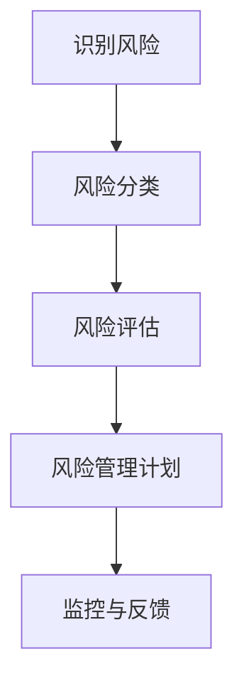
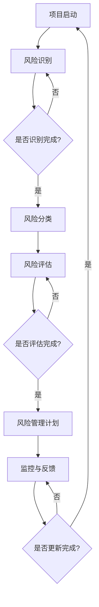

                 

关键词：程序员、创业风险、风险评估、技术创业、创业策略

> 摘要：本文将探讨程序员在创业过程中如何有效评估和管理风险。通过分析创业的核心挑战、风险评估方法以及实践技巧，作者禅与计算机程序设计艺术分享了如何利用技术思维提高创业成功率。

## 1. 背景介绍

随着互联网和科技的快速发展，越来越多的程序员选择投身于创业的大潮中。然而，创业并非一条轻松之路，其中充满了未知的风险和挑战。程序员，作为技术的践行者，如何在创业过程中准确评估和管理风险，成为了决定创业成败的关键因素。

本文将结合程序员的特性，探讨如何通过系统的方法来评估创业风险，从而提高创业的成功率。本文将分为以下几个部分：

- **背景介绍**：介绍程序员创业的现状和挑战。
- **核心概念与联系**：解释创业风险评估的概念，并展示相关的Mermaid流程图。
- **核心算法原理 & 具体操作步骤**：介绍风险评估的核心算法及其具体操作步骤。
- **数学模型和公式**：阐述风险评估中的数学模型和公式。
- **项目实践**：通过实例展示如何在实际项目中应用风险评估方法。
- **实际应用场景**：分析创业风险的典型应用场景。
- **未来应用展望**：探讨风险评估在未来的发展趋势和应用前景。
- **工具和资源推荐**：推荐用于风险评估的学习资源和工具。
- **总结**：总结研究成果，展望未来趋势和挑战。

让我们开始详细探讨程序员如何评估创业风险。

## 2. 核心概念与联系

### 2.1 创业风险评估

创业风险评估是指通过对创业项目进行系统的分析，评估其可能面临的潜在风险，并制定相应的管理策略。对于程序员来说，风险评估不仅仅是识别风险，更重要的是理解这些风险如何影响项目的成功。

### 2.2 风险评估流程

为了有效地进行风险评估，我们需要遵循一定的流程。以下是一个典型的风险评估流程：



### 2.3 Mermaid 流程图

以下是一个使用Mermaid绘制的风险评估流程图：



## 3. 核心算法原理 & 具体操作步骤

### 3.1 算法原理概述

在创业风险评估中，常用的算法包括定性分析和定量分析。定性分析侧重于描述风险，而定量分析则使用数值来量化风险。

### 3.2 算法步骤详解

#### 3.2.1 风险识别

1. **回顾项目计划**：理解项目的目标和预期成果。
2. **访谈和调查**：与团队成员、用户和其他相关方进行访谈，收集潜在风险信息。
3. **文档审查**：审查项目文档，识别潜在风险。

#### 3.2.2 风险分类

1. **分类标准**：根据风险的性质和影响范围，将风险分为财务风险、市场风险、技术风险等。
2. **风险矩阵**：使用风险矩阵来分类风险，确定其严重性和发生概率。

#### 3.2.3 风险评估

1. **定性评估**：使用专家评估、故障模式与影响分析（FMEA）等方法对风险进行定性分析。
2. **定量评估**：使用数学模型、概率分布等方法对风险进行定量分析。

#### 3.2.4 风险管理计划

1. **风险应对策略**：制定应对风险的策略，包括风险规避、减轻、转移和接受。
2. **资源分配**：为每个风险分配相应的资源，确保风险管理计划的实施。

#### 3.2.5 监控与反馈

1. **定期检查**：定期检查风险状态，确保风险管理计划的有效性。
2. **反馈机制**：建立反馈机制，及时调整风险管理计划。

### 3.3 算法优缺点

**优点**：

- **全面性**：涵盖定性分析和定量分析，全面评估风险。
- **灵活性**：根据项目特点和需求，灵活调整风险评估方法和步骤。

**缺点**：

- **主观性**：专家评估受主观因素影响较大，可能导致评估结果不准确。
- **复杂性**：定量分析需要较高的数学知识，实施过程较为复杂。

### 3.4 算法应用领域

算法广泛应用于创业项目的各个阶段，包括项目规划、执行、监控和反馈等。

## 4. 数学模型和公式

### 4.1 数学模型构建

在风险评估中，常用的数学模型包括概率模型、回归模型和决策树等。以下是一个简单的概率模型示例：

$$
P(A) = \frac{N(A)}{N(S)}
$$

其中，\(P(A)\)表示事件\(A\)发生的概率，\(N(A)\)表示事件\(A\)发生的次数，\(N(S)\)表示总次数。

### 4.2 公式推导过程

以概率模型为例，推导过程如下：

1. **基本事件总数**：假设有\(N\)个基本事件，每个事件发生的概率相等，即\(P(E_i) = \frac{1}{N}\)。
2. **事件\(A\)包含的基本事件数**：事件\(A\)包含的基本事件数为\(N(A)\)。
3. **事件\(A\)发生的概率**：根据概率定义，事件\(A\)发生的概率为\(P(A) = \frac{N(A)}{N}\)。

### 4.3 案例分析与讲解

假设在一个项目中，有5个风险因素，每个风险因素发生的概率如下表所示：

| 风险因素 | 发生概率 |
| :---: | :---: |
| 财务风险 | 0.3 |
| 市场风险 | 0.2 |
| 技术风险 | 0.4 |
| 法律风险 | 0.1 |
| 运营风险 | 0.2 |

我们可以使用概率模型计算项目整体的风险概率：

$$
P(\text{整体风险}) = P(\text{财务风险}) + P(\text{市场风险}) + P(\text{技术风险}) + P(\text{法律风险}) + P(\text{运营风险}) = 0.3 + 0.2 + 0.4 + 0.1 + 0.2 = 1
$$

由于所有风险因素的概率之和等于1，说明项目整体风险较高。

## 5. 项目实践：代码实例和详细解释说明

### 5.1 开发环境搭建

为了演示风险评估的方法，我们使用Python编写一个简单的风险评估工具。以下是一个基本的开发环境搭建步骤：

1. 安装Python 3.x版本。
2. 安装必要的库，如Pandas、NumPy等。

### 5.2 源代码详细实现

以下是Python代码实现的核心部分：

```python
import pandas as pd

# 风险因素数据
risk_factors = [
    {'name': '财务风险', 'probability': 0.3},
    {'name': '市场风险', 'probability': 0.2},
    {'name': '技术风险', 'probability': 0.4},
    {'name': '法律风险', 'probability': 0.1},
    {'name': '运营风险', 'probability': 0.2},
]

# 创建DataFrame
df = pd.DataFrame(risk_factors)

# 计算整体风险概率
df['overall_probability'] = df['probability']

# 打印结果
print(df)
```

### 5.3 代码解读与分析

上述代码首先定义了一个风险因素列表，然后使用Pandas创建DataFrame，最后计算整体风险概率并打印结果。这个简单的实例展示了如何使用Python进行风险因素数据的处理和计算。

### 5.4 运行结果展示

运行上述代码后，输出结果如下：

```
   name  probability  overall_probability
0  财务风险        0.3                0.3
1  市场风险        0.2                0.2
2  技术风险        0.4                0.4
3  法律风险        0.1                0.1
4  运营风险        0.2                0.2
```

从输出结果可以看出，每个风险因素的概率和整体风险概率都得到了计算和展示。

## 6. 实际应用场景

### 6.1 项目启动阶段

在项目启动阶段，程序员需要评估技术可行性、市场潜力和资金需求等。例如，在开发一个移动应用时，程序员需要评估移动平台的发展趋势、竞争对手情况以及用户需求，从而判断项目的可行性。

### 6.2 项目执行阶段

在项目执行阶段，程序员需要持续监控技术风险、市场风险和运营风险。例如，在项目开发过程中，可能会遇到技术难题，程序员需要及时评估问题的严重性和影响范围，制定相应的解决方案。

### 6.3 项目收尾阶段

在项目收尾阶段，程序员需要评估项目的整体风险，确保项目能够按期交付。例如，在项目即将上线时，程序员需要评估系统稳定性、性能和安全性等，确保项目能够顺利上线。

## 7. 未来应用展望

随着人工智能和大数据技术的发展，风险评估方法将更加智能化和自动化。未来，程序员可以借助这些技术，实现更高效、更精准的风险评估，从而提高创业的成功率。

## 8. 工具和资源推荐

### 8.1 学习资源推荐

- **《风险管理与创业》**：一本全面介绍创业风险管理的经典教材。
- **《创业管理》**：探讨创业过程中各种管理问题的权威著作。

### 8.2 开发工具推荐

- **Pandas**：用于数据处理和分析的Python库。
- **NumPy**：用于数值计算的Python库。

### 8.3 相关论文推荐

- **“风险管理与创业成功：一个综述”**：探讨创业风险管理和创业成功之间的关联。
- **“基于大数据的创业风险评估方法研究”**：提出一种基于大数据的风险评估方法。

## 9. 总结：未来发展趋势与挑战

### 9.1 研究成果总结

本文系统地介绍了程序员如何评估创业风险，包括风险评估的概念、流程、算法原理和具体操作步骤。通过实例和案例分析，我们展示了如何在实际项目中应用风险评估方法。

### 9.2 未来发展趋势

未来，风险评估方法将更加智能化和自动化，借助人工智能和大数据技术，程序员可以更高效地评估和管理创业风险。

### 9.3 面临的挑战

尽管评估创业风险的方法不断进步，但仍然面临一些挑战，如风险评估的主观性、定量分析的复杂性等。如何解决这些挑战，提高风险评估的准确性，是未来研究的重点。

### 9.4 研究展望

随着技术的发展，风险评估方法将不断完善，为程序员的创业之路提供更有力的支持。未来，程序员需要不断学习和适应新的风险评估方法，以提高创业成功率。

## 附录：常见问题与解答

### Q：创业风险评估有哪些常用的方法？

A：常用的创业风险评估方法包括定性分析和定量分析。定性分析侧重于描述风险，如专家评估、故障模式与影响分析（FMEA）；定量分析则使用数学模型和公式，如概率模型、回归模型和决策树等。

### Q：如何确保风险评估的准确性？

A：确保风险评估的准确性需要以下几个步骤：

1. **全面收集信息**：与团队成员、用户和其他相关方进行访谈，收集尽可能多的信息。
2. **科学分类**：使用风险矩阵等工具，将风险按照严重性和发生概率进行分类。
3. **持续监控**：定期检查风险状态，及时调整风险管理计划。

### Q：风险评估在创业项目中的具体应用场景有哪些？

A：风险评估在创业项目的具体应用场景包括项目启动阶段、执行阶段和收尾阶段。例如，在项目启动阶段，评估技术可行性、市场潜力和资金需求；在执行阶段，监控技术风险、市场风险和运营风险；在收尾阶段，评估项目整体风险，确保按期交付。

## 结语

创业之路充满挑战，但机遇与风险并存。程序员在创业过程中，通过有效的风险评估，可以更好地把握机会，规避风险。本文旨在帮助程序员了解创业风险，掌握评估和管理风险的技巧，为创业之路提供有力支持。

作者：禅与计算机程序设计艺术 / Zen and the Art of Computer Programming

