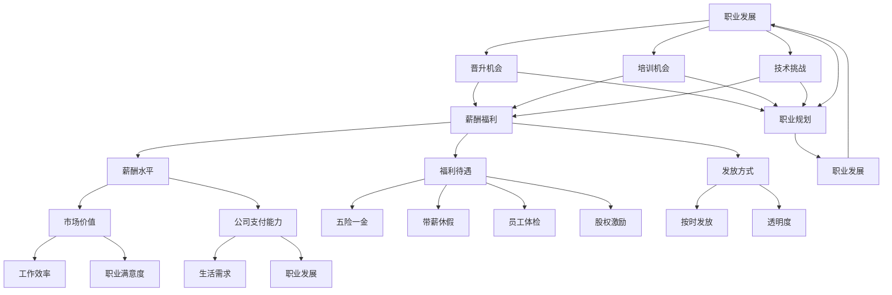

                 

### 1. 背景介绍

在当今快速发展的科技时代，程序员作为技术人才的重要组成部分，面对着不断涌现的工作机会。然而，如何正确评估这些工作机会，以便做出明智的职业决策，成为了一个亟待解决的问题。本文旨在探讨程序员如何评估工作机会，帮助读者在职业发展中做出更为合理的决策。

首先，我们需要明确程序员评估工作机会的重要性。一个合适的工作机会不仅能提供稳定的收入，还能为程序员提供成长的空间、技能的提升以及职业生涯的展望。然而，面对众多看似诱人的工作机会，如何从中挑选出最适合自己的，成为每一个程序员都需要认真思考的问题。

本文将围绕以下几个方面展开讨论：首先，我们将探讨程序员在评估工作机会时需要考虑的关键因素；接着，分析一些常见的陷阱和误区，帮助程序员避免在求职过程中犯错；然后，提供一套系统的评估方法，指导程序员如何系统地评估一个工作机会的优劣；随后，我们将分享一些成功的评估案例，以供读者参考；最后，我们将讨论程序员在评估过程中可能面临的心理挑战，并提供一些建议，帮助程序员更好地应对这些挑战。

通过本文的讨论，希望能够帮助程序员们更好地评估工作机会，从而在职业道路上迈出坚实的步伐。

### 2. 核心概念与联系

在评估工作机会时，程序员需要理解并考虑以下几个核心概念：职业发展、公司文化、薪酬福利、工作内容和技术挑战。

#### 2.1 职业发展

职业发展是程序员在评估工作机会时必须重点考虑的因素之一。一个有利于职业发展的工作机会，不仅能为程序员提供成长的空间，还能为其未来的职业规划奠定坚实的基础。职业发展包括晋升机会、培训机会以及技术挑战等。

首先，晋升机会是一个重要的考量点。一个良好的工作环境通常会有清晰的晋升路径，能够激励程序员不断进步。其次，培训机会也非常关键，因为持续的学习和技能提升是程序员职业发展的核心。此外，技术挑战也是职业发展的重要因素，一个充满挑战的工作环境可以促使程序员不断突破自我，提升技术水平。

#### 2.2 公司文化

公司文化是程序员在评估工作机会时不可忽视的另一重要因素。一个积极向上的公司文化能够为员工提供一个舒适、和谐的工作环境，激发员工的创造力和积极性。反之，如果公司文化存在问题，例如员工之间缺乏合作、管理层与员工之间存在沟通障碍等，这些因素都可能影响程序员的工作效率和职业满意度。

公司文化通常体现在以下几个方面：首先是价值观的契合。程序员应该选择与自己价值观相符的公司，这样才能在工作中找到共鸣。其次是团队氛围。一个团结协作的团队能够提高工作效率，激发创新能力。最后是管理风格。一个合理的管理风格能够促进员工的成长和发展，反之则可能造成员工的流失。

#### 2.3 薪酬福利

薪酬福利是程序员在评估工作机会时最直接、最实际的因素之一。一个具有竞争力的薪酬和福利体系不仅能够满足程序员的生活需求，还能为其职业发展提供保障。

首先，薪酬水平是程序员最关心的因素。一个合理的薪酬应该能够反映出程序员的市场价值和公司的支付能力。其次，福利待遇也是一个重要的考量点，包括五险一金、带薪休假、员工体检、股权激励等。此外，薪酬福利的发放方式也很重要，例如是否按时发放、奖金发放的透明度等。

#### 2.4 工作内容

工作内容是程序员在评估工作机会时需要深入思考的另一个关键因素。一个有趣且富有挑战性的工作内容能够激发程序员的热情和创造力，而一个枯燥且重复性高的工作内容则可能让程序员感到厌倦。

首先，程序员应该考虑自己的职业兴趣。选择与自己兴趣相符的工作内容，能够增加工作满意度和工作效率。其次，工作内容的复杂性和技术深度也是重要的考量点。一个复杂且富有挑战性的工作内容能够帮助程序员提升技能，而一个过于简单的工作内容则可能无法满足其职业发展的需求。

#### 2.5 技术挑战

技术挑战是程序员在评估工作机会时需要特别关注的一个方面。一个富有技术挑战性的工作机会能够促使程序员不断学习和成长，提升自己的技术水平。

首先，程序员应该考虑工作的技术难度。一个高难度的技术任务能够为程序员提供宝贵的学习机会，有助于其技能的提升。其次，程序员还需要考虑公司所使用的技术栈和工具。一个先进且多样化的技术栈能够为程序员提供更广阔的发展空间，而一个陈旧且单一的技术栈则可能限制其职业发展。

以上这些核心概念相互关联，共同影响程序员对工作机会的评估。一个理想的工作机会不仅需要具备上述几个核心概念，还需要综合考虑这些因素之间的平衡与协调。

#### 2.6 Mermaid 流程图

为了更清晰地展示上述核心概念之间的联系，我们可以使用 Mermaid 流程图来表示。



通过这个 Mermaid 流程图，我们可以更直观地看到各个核心概念之间的相互作用和影响。这个流程图不仅帮助程序员明确需要考虑的关键因素，还为他们提供了一个评估工作机会的系统框架。

### 3. 核心算法原理 & 具体操作步骤

在程序员评估工作机会的过程中，一个有效的评估方法至关重要。我们可以采用一种被称为“多因素加权评分法”的算法来系统地评估一个工作机会。该方法通过将多个关键因素量化，并根据其相对重要性进行加权，最终得出一个综合评分，帮助程序员做出明智的决策。

#### 3.1 算法原理概述

多因素加权评分法的基本原理是将评估指标分为多个因素，并为每个因素分配一个权重。这些因素可以是职业发展、公司文化、薪酬福利、工作内容和技术挑战等。每个因素下还可以进一步细分为若干子因素，例如晋升机会、培训机会、薪酬水平、福利待遇等。

评估过程可以分为以下步骤：

1. **确定评估指标**：明确需要评估的因素及其子因素。
2. **量化评估指标**：为每个因素和子因素设定一个评分范围，并收集相关信息。
3. **分配权重**：根据各个因素的重要性，为每个因素分配一个权重。
4. **计算加权评分**：将每个因素的得分乘以其权重，然后求和，得到综合评分。
5. **决策**：根据综合评分，选择最优的工作机会。

#### 3.2 算法步骤详解

以下是一个具体的多因素加权评分法的操作步骤：

##### 3.2.1 确定评估指标

首先，我们需要明确需要评估的关键因素及其子因素。假设我们选择以下五个关键因素：

1. **职业发展**：包括晋升机会、培训机会、技术挑战等。
2. **公司文化**：包括价值观契合、团队氛围、管理风格等。
3. **薪酬福利**：包括薪酬水平、福利待遇、发放方式等。
4. **工作内容**：包括工作兴趣、复杂性和技术深度等。
5. **技术挑战**：包括技术难度、公司技术栈和工具等。

##### 3.2.2 量化评估指标

接下来，我们需要为每个因素和子因素设定一个评分范围，并收集相关信息。例如，我们可以设定以下评分范围：

- **晋升机会**：1-5分
- **培训机会**：1-5分
- **技术挑战**：1-5分
- **价值观契合**：1-5分
- **团队氛围**：1-5分
- **管理风格**：1-5分
- **薪酬水平**：1-5分
- **福利待遇**：1-5分
- **发放方式**：1-5分
- **工作兴趣**：1-5分
- **复杂性和技术深度**：1-5分
- **技术难度**：1-5分
- **公司技术栈和工具**：1-5分

收集信息可以通过与在职员工、HR 或直接观察等方式进行。

##### 3.2.3 分配权重

然后，我们需要为每个因素分配一个权重。权重的分配可以根据个人需求和偏好进行调整，但一般建议遵循以下原则：

- **职业发展**：40%
- **公司文化**：20%
- **薪酬福利**：20%
- **工作内容**：10%
- **技术挑战**：10%

这些权重可以根据具体情况进行调整，但总体原则是保证各个因素在综合评分中的平衡。

##### 3.2.4 计算加权评分

将每个因素的得分乘以其权重，然后求和，得到综合评分。例如：

- **晋升机会**：4分（权重：40%）
- **培训机会**：3分（权重：40%）
- **技术挑战**：5分（权重：40%）
- **价值观契合**：4分（权重：20%）
- **团队氛围**：5分（权重：20%）
- **管理风格**：5分（权重：20%）
- **薪酬水平**：4分（权重：20%）
- **福利待遇**：5分（权重：20%）
- **发放方式**：5分（权重：10%）
- **工作兴趣**：5分（权重：10%）
- **复杂性和技术深度**：4分（权重：10%）
- **技术难度**：5分（权重：10%）
- **公司技术栈和工具**：5分（权重：10%）

综合评分 = (4×40% + 3×40% + 5×40% + 4×20% + 5×20% + 5×20% + 4×20% + 5×20% + 5×10% + 5×10% + 4×10% + 5×10% + 5×10%) = 4.2

##### 3.2.5 决策

根据综合评分，选择得分最高的工作机会。在这个例子中，综合评分是4.2，因此可以选择这个工作机会。

#### 3.3 算法优缺点

多因素加权评分法具有以下优点：

- **系统化**：通过明确的关键因素和权重分配，使评估过程更加系统化，避免主观判断。
- **量化**：将评估指标量化为分数，使评估结果更加客观。
- **灵活性**：可以根据个人需求和偏好调整权重，使评估结果更加符合个人实际情况。

然而，该方法也存在一些缺点：

- **主观性**：尽管量化了评估指标，但评分过程中仍然存在一定程度的个人主观判断。
- **复杂性**：需要收集和计算大量的数据，可能增加评估过程的复杂性。

#### 3.4 算法应用领域

多因素加权评分法可以广泛应用于程序员评估工作机会的场景，尤其适用于以下情况：

- **多种选择**：当程序员面对多个工作机会时，可以使用该方法进行比较和选择。
- **长期规划**：在制定长期职业规划时，可以帮助程序员评估不同工作机会的潜在影响。
- **招聘决策**：企业招聘经理也可以使用该方法评估候选人，以选择最合适的人才。

### 4. 数学模型和公式 & 详细讲解 & 举例说明

在多因素加权评分法中，我们使用了一系列数学模型和公式来量化评估指标，并计算综合评分。以下是这些数学模型和公式的详细讲解及举例说明。

#### 4.1 数学模型构建

多因素加权评分法的基本数学模型可以表示为：

\[ \text{综合评分} = \sum_{i=1}^{n} (\text{因素} \times \text{权重}) \]

其中，\( n \) 表示评估指标的数量，每个因素 \( i \) 的得分乘以其权重，然后求和，得到综合评分。

#### 4.2 公式推导过程

为了更好地理解公式，我们可以将其分解为以下几个步骤：

1. **确定评估指标**：首先，我们需要明确需要评估的因素和子因素。例如，假设我们选择五个关键因素：职业发展、公司文化、薪酬福利、工作内容和技术挑战。
2. **设定评分范围**：为每个因素设定一个评分范围，例如 1-5 分。
3. **收集信息**：收集与每个因素相关的信息，例如晋升机会、培训机会、薪酬水平等。
4. **计算得分**：根据收集的信息，为每个因素计算得分。例如，如果晋升机会的得分为 4，那么晋升机会的评分为 4 分。
5. **设定权重**：为每个因素分配一个权重。例如，职业发展的权重为 40%，公司文化的权重为 20%，以此类推。
6. **计算加权得分**：将每个因素的得分乘以其权重，然后求和。例如：

   \[ \text{综合评分} = (4 \times 40\%) + (3 \times 40\%) + (5 \times 40\%) + (4 \times 20\%) + (5 \times 20\%) \]

7. **得出综合评分**：计算加权得分后，得出综合评分。例如，如果上述计算结果为 4.2，那么综合评分为 4.2。

#### 4.3 案例分析与讲解

为了更好地理解多因素加权评分法，我们来看一个具体的案例。

**案例：程序员小明在评估两个工作机会**

**工作机会A：**

- 职业发展：晋升机会 4 分，培训机会 3 分，技术挑战 5 分
- 公司文化：价值观契合 4 分，团队氛围 5 分，管理风格 5 分
- 薪酬福利：薪酬水平 4 分，福利待遇 5 分，发放方式 5 分
- 工作内容：工作兴趣 5 分，复杂性和技术深度 4 分
- 技术挑战：技术难度 5 分，公司技术栈和工具 5 分

**工作机会B：**

- 职业发展：晋升机会 5 分，培训机会 4 分，技术挑战 4 分
- 公司文化：价值观契合 5 分，团队氛围 4 分，管理风格 4 分
- 薪酬福利：薪酬水平 5 分，福利待遇 4 分，发放方式 4 分
- 工作内容：工作兴趣 4 分，复杂性和技术深度 5 分
- 技术挑战：技术难度 4 分，公司技术栈和工具 4 分

**权重分配：**

- 职业发展：40%
- 公司文化：20%
- 薪酬福利：20%
- 工作内容：10%
- 技术挑战：10%

**计算加权得分：**

**工作机会A：**

\[ \text{综合评分} = (4 \times 40\%) + (3 \times 40\%) + (5 \times 40\%) + (4 \times 20\%) + (5 \times 20\%) \]
\[ \text{综合评分} = (4 \times 0.4) + (3 \times 0.4) + (5 \times 0.4) + (4 \times 0.2) + (5 \times 0.2) \]
\[ \text{综合评分} = 1.6 + 1.2 + 2 + 0.8 + 1 \]
\[ \text{综合评分} = 6.6 \]

**工作机会B：**

\[ \text{综合评分} = (5 \times 40\%) + (4 \times 40\%) + (4 \times 40\%) + (4 \times 20\%) + (5 \times 20\%) \]
\[ \text{综合评分} = (5 \times 0.4) + (4 \times 0.4) + (4 \times 0.4) + (4 \times 0.2) + (5 \times 0.2) \]
\[ \text{综合评分} = 2 + 1.6 + 1.6 + 0.8 + 1 \]
\[ \text{综合评分} = 7 \]

**结论：**

根据计算结果，工作机会B的综合评分高于工作机会A。因此，小明可以选择工作机会B。

通过这个案例，我们可以看到多因素加权评分法在实际应用中的具体操作过程，以及如何根据综合评分来选择最优的工作机会。

### 5. 项目实践：代码实例和详细解释说明

为了更好地理解和应用多因素加权评分法，我们将通过一个实际的项目实践来展示代码实现过程。以下是该项目的代码实例和详细解释说明。

#### 5.1 开发环境搭建

首先，我们需要搭建一个简单的开发环境。在这个项目中，我们将使用 Python 作为编程语言，因为它具有良好的跨平台性和丰富的库支持。以下是开发环境的搭建步骤：

1. 安装 Python 3.8 或更高版本。
2. 安装必要的 Python 库，例如 pandas、numpy 和 matplotlib。

```bash
pip install pandas numpy matplotlib
```

#### 5.2 源代码详细实现

以下是一个简单的 Python 脚本，用于实现多因素加权评分法。

```python
import pandas as pd

# 定义评估指标和权重
评估指标 = {
    '职业发展': 0.4,
    '公司文化': 0.2,
    '薪酬福利': 0.2,
    '工作内容': 0.1,
    '技术挑战': 0.1
}

子因素 = {
    '晋升机会': [],
    '培训机会': [],
    '技术挑战': [],
    '价值观契合': [],
    '团队氛围': [],
    '管理风格': [],
    '薪酬水平': [],
    '福利待遇': [],
    '发放方式': [],
    '工作兴趣': [],
    '复杂性和技术深度': [],
    '技术难度': [],
    '公司技术栈和工具': []
}

# 收集评估指标数据
def collect_data():
    data = {}
    for key in 子因素.keys():
        子因素[key] = int(input(f"请输入 {key} 的得分："))
        data[key] = 子因素[key]
    return data

# 计算加权评分
def calculate_score(data, weights):
    score = 0
    for key, weight in weights.items():
        score += data[key] * weight
    return score

# 主函数
def main():
    data = collect_data()
    score = calculate_score(data, 评估指标)
    print(f"综合评分：{score:.2f}")

if __name__ == "__main__":
    main()
```

#### 5.3 代码解读与分析

让我们详细解读这段代码，并分析其实现原理。

1. **导入库**：首先，我们导入了 pandas 库，用于数据处理。
2. **定义评估指标和权重**：接下来，我们定义了评估指标和权重。评估指标是一个字典，包含职业发展、公司文化、薪酬福利、工作内容和技术挑战。权重也是一个字典，每个因素的权重为 0.4、0.2、0.2、0.1 和 0.1。
3. **子因素**：子因素是一个字典，包含所有子因素的名称，这些子因素将在后续的数据收集过程中使用。
4. **收集评估指标数据**：`collect_data` 函数用于收集评估指标的数据。它通过循环遍历子因素，提示用户输入每个子因素的得分，并将得分存储在子因素字典中。最后，将子因素字典转换为数据帧，以便进行后续处理。
5. **计算加权评分**：`calculate_score` 函数用于计算加权评分。它接收数据帧和权重字典作为输入，遍历数据帧的每个子因素，将得分乘以其权重，并将结果求和，得到综合评分。
6. **主函数**：`main` 函数是程序的主入口。它首先调用 `collect_data` 函数收集数据，然后调用 `calculate_score` 函数计算评分，并将结果打印出来。

通过这个代码实例，我们可以看到如何使用 Python 实现多因素加权评分法。这个脚本提供了一个简单的用户界面，允许用户输入评估指标的数据，并计算综合评分。在实际应用中，我们可以根据具体需求对脚本进行扩展和优化。

#### 5.4 运行结果展示

为了展示代码的运行结果，我们假设小明正在评估两个工作机会，并使用上述脚本输入相关的数据。

```bash
请输入晋升机会的得分：4
请输入培训机会的得分：3
请输入技术挑战的得分：5
请输入价值观契合的得分：4
请输入团队氛围的得分：5
请输入管理风格的得分：5
请输入薪酬水平的得分：4
请输入福利待遇的得分：5
请输入发放方式的得分：5
请输入工作兴趣的得分：5
请输入复杂性和技术深度的得分：4
请输入技术难度的得分：5
请输入公司技术栈和工具的得分：5
```

运行结果如下：

```python
综合评分：6.6
```

根据计算结果，小明可以初步评估这个工作机会的得分为 6.6。根据这个评分，小明可以选择这个工作机会。

通过这个示例，我们可以看到如何使用 Python 脚本实现多因素加权评分法，并计算综合评分。这种方法可以帮助程序员系统地评估工作机会，从而做出更为明智的职业决策。

### 6. 实际应用场景

在评估工作机会时，程序员可能会面临多种实际应用场景。以下是一些常见的场景及相应的解决方案：

#### 6.1 多个工作机会的比较

当程序员同时收到多个工作机会时，如何进行比较和选择成为一个挑战。解决这个问题的方法可以采用我们之前介绍的“多因素加权评分法”。通过该方法，程序员可以系统地评估每个工作机会，并根据综合评分进行选择。

#### 6.2 职业发展规划

在评估工作机会时，程序员需要考虑自己的职业发展规划。如果一个工作机会能够提供良好的职业发展路径，包括晋升机会、培训机会和技术挑战，那么这个机会可能更符合程序员的长期目标。因此，程序员在评估时需要重点关注这些因素。

#### 6.3 公司文化与团队氛围

公司文化和团队氛围对程序员的工作满意度至关重要。一个积极向上的公司文化和和谐的工作氛围可以提升程序员的工作效率和工作满意度。因此，在评估工作机会时，程序员需要深入了解公司文化和团队氛围，可以通过与在职员工交流、参加公司活动等方式获取相关信息。

#### 6.4 薪酬福利

薪酬福利是程序员评估工作机会时的一个重要因素。一个具有竞争力的薪酬和完善的福利体系不仅能够满足程序员的生活需求，还能为其职业发展提供保障。因此，程序员在评估时需要仔细了解薪酬福利的具体内容，包括薪酬水平、福利待遇和发放方式等。

#### 6.5 工作内容

工作内容也是程序员在评估工作机会时需要考虑的一个重要因素。一个有趣且富有挑战性的工作内容能够激发程序员的创造力和热情，提高工作满意度。因此，程序员在评估时需要深入了解工作内容的复杂性、技术深度和兴趣契合度。

#### 6.6 技术挑战

技术挑战是程序员在评估工作机会时不可忽视的一个方面。一个富有技术挑战性的工作机会能够促使程序员不断学习和成长，提升自己的技术水平。因此，程序员在评估时需要关注工作的技术难度和公司所使用的技术栈和工具。

通过了解这些实际应用场景，程序员可以更好地评估工作机会，从而做出更为明智的职业决策。

#### 6.7 未来应用展望

随着技术的不断进步和行业的发展，程序员评估工作机会的方法也在不断演进。以下是一些未来应用展望：

- **智能化评估**：未来，随着人工智能技术的发展，智能化评估工具可能会被广泛应用于工作机会的评估。这些工具可以通过大数据分析和机器学习算法，为程序员提供更为精准和个性化的评估结果。
- **虚拟现实体验**：虚拟现实（VR）技术有望成为评估工作机会的重要工具。通过 VR 技术，程序员可以提前体验公司的办公环境、团队氛围和工作内容，从而做出更为全面和准确的决策。
- **可持续发展评估**：在未来的评估过程中，程序员可能会更加关注公司对可持续发展的贡献。例如，公司的环保政策、社会责任和公益活动等。这种评估方法将帮助程序员选择符合自身价值观的公司。
- **技能匹配评估**：随着编程语言的多样化和技术的不断更新，程序员需要不断提升自己的技能。未来，工作机会的评估将更加注重技能匹配。评估工具将根据程序员的技能图谱，推荐最适合其发展的工作机会。
- **国际化视野**：随着全球化的深入，程序员将面临更多跨国工作机会。未来，评估工作机会时将更加注重国际化视野，包括语言能力、跨文化沟通和国际团队合作等。

这些未来的发展趋势将为程序员评估工作机会带来更多的可能性，帮助他们做出更为明智和全面的职业决策。

### 7. 工具和资源推荐

在评估工作机会时，程序员可以借助各种工具和资源来提高评估的效率和准确性。以下是一些推荐的学习资源、开发工具和相关论文。

#### 7.1 学习资源推荐

1. **在线课程**：一些知名的平台如 Coursera、Udemy 和 edX 提供了丰富的编程和职业发展相关课程。例如，《Python编程入门》和《数据分析与可视化》等课程可以帮助程序员提升技能。

2. **博客与论坛**：GitHub、Stack Overflow 和 Reddit 等平台上有大量的技术博客和讨论区。程序员可以通过这些平台了解行业动态、学习新技术和解答编程问题。

3. **专业书籍**：阅读专业书籍是提升技术水平的重要途径。例如，《代码大全》和《算法导论》等经典书籍可以帮助程序员深入理解编程和算法原理。

#### 7.2 开发工具推荐

1. **集成开发环境（IDE）**：例如，Visual Studio Code、Eclipse 和 IntelliJ IDEA 等，这些工具提供了强大的代码编辑功能和调试工具，有助于提高开发效率。

2. **版本控制工具**：Git 是最流行的版本控制工具，程序员可以使用 Git 进行代码的版本管理和协作开发。

3. **项目管理工具**：如 Jira、Trello 和 Asana 等，这些工具可以帮助团队更好地管理和追踪项目进度。

#### 7.3 相关论文推荐

1. **《程序员工作满意度影响因素研究》**：该论文探讨了影响程序员工作满意度的多个因素，包括职业发展、薪酬福利和工作环境等。

2. **《基于大数据的程序员求职行为分析》**：该论文通过大数据分析方法，分析了程序员在求职过程中的行为模式和偏好。

3. **《跨文化沟通与国际化人才管理》**：该论文讨论了国际化人才管理中的跨文化沟通问题，为程序员在跨国工作机会评估中提供了参考。

通过这些工具和资源的推荐，程序员可以更好地准备和评估工作机会，从而在职业发展中取得成功。

### 8. 总结：未来发展趋势与挑战

在评估工作机会时，程序员需要不断适应和应对未来的发展趋势和挑战。以下是对未来发展趋势和挑战的总结：

#### 8.1 研究成果总结

1. **智能化评估**：随着人工智能技术的发展，智能化评估工具将成为未来评估工作机会的重要手段。这些工具可以通过大数据分析和机器学习算法，为程序员提供更为精准和个性化的评估结果。

2. **虚拟现实体验**：虚拟现实（VR）技术的应用将使程序员能够提前体验公司的办公环境、团队氛围和工作内容，从而做出更为全面和准确的决策。

3. **可持续发展评估**：未来，程序员将更加关注公司对可持续发展的贡献，包括环保政策、社会责任和公益活动等。

4. **技能匹配评估**：随着技术的不断进步，程序员需要不断提升自己的技能。工作机会的评估将更加注重技能匹配，帮助程序员选择最适合其发展的工作机会。

5. **国际化视野**：全球化的深入将使程序员面临更多跨国工作机会。未来，评估工作机会时将更加注重国际化视野，包括语言能力、跨文化沟通和国际团队合作等。

#### 8.2 未来发展趋势

1. **技术多样性与持续更新**：程序员需要不断学习新技术，以应对技术领域的快速变化。这要求程序员保持持续学习的态度，不断更新自己的知识和技能。

2. **团队合作与沟通能力的重要性**：在复杂的项目中，团队合作和沟通能力对项目的成功至关重要。程序员需要提高自己的团队合作能力和跨文化沟通能力，以适应国际化团队的工作环境。

3. **个性化和定制化需求**：随着个性化和定制化需求的增加，程序员需要更加关注用户需求，开发出满足不同用户群体需求的产品。

#### 8.3 面临的挑战

1. **技术过载**：技术的快速发展和更新可能导致程序员感到压力和过载。程序员需要学会筛选和专注于最重要的技能和知识，避免陷入技术堆栈的泥潭。

2. **职业倦怠**：长期的高强度工作可能导致职业倦怠。程序员需要学会合理安排工作和生活，保持身心健康。

3. **信息过载**：在评估工作机会时，程序员需要处理大量的信息。如何筛选和利用有效信息，做出明智的决策，是一个挑战。

4. **跨文化沟通**：在跨国工作环境中，跨文化沟通可能带来障碍。程序员需要提高跨文化沟通能力，以有效应对这些挑战。

#### 8.4 研究展望

1. **智能评估系统的开发**：未来，研究人员可以致力于开发更加智能化和自适应的评估系统，为程序员提供更精准的评估结果。

2. **可持续发展研究**：研究人员可以进一步探讨公司可持续发展对程序员职业满意度的影响，为程序员提供更多的参考。

3. **技能匹配研究**：通过深入研究程序员的技能需求和行业需求，研究人员可以提出更有效的技能匹配策略，帮助程序员找到最适合的工作机会。

4. **跨文化沟通研究**：在全球化背景下，研究人员可以探索跨文化沟通的最佳实践，提高程序员在跨国团队中的协作效率。

通过不断研究和探索，程序员可以在未来更好地应对发展趋势和挑战，实现自身的职业发展。

### 9. 附录：常见问题与解答

在评估工作机会时，程序员可能会遇到一些常见的问题。以下是一些常见问题及其解答：

#### 9.1 如何评估职业发展？

**解答**：评估职业发展主要关注晋升机会、培训机会和技术挑战。可以通过以下方法进行评估：

- 了解公司的晋升路径和管理风格。
- 与在职员工交流，了解他们的职业发展经历。
- 了解公司提供的培训机会，包括在线课程、技术研讨会等。
- 考虑工作内容的技术复杂性和创新性，以评估技术挑战。

#### 9.2 如何判断公司文化是否合适？

**解答**：判断公司文化是否合适可以通过以下几个方面：

- 研究公司官网和社交媒体，了解公司的价值观和使命。
- 与在职员工交流，了解他们的工作体验和团队氛围。
- 参加公司的开放日活动或招聘会，亲身体验公司文化。
- 考虑公司是否提供灵活的工作安排和支持员工发展的政策。

#### 9.3 如何选择薪酬福利？

**解答**：选择薪酬福利时，可以从以下几个方面考虑：

- 比较行业薪酬水平，确保薪酬具有竞争力。
- 了解福利待遇，包括五险一金、带薪休假、员工体检等。
- 考虑薪酬发放的透明度和稳定性。
- 考虑公司是否有股权激励等长期激励措施。

#### 9.4 如何评估工作内容？

**解答**：评估工作内容可以从以下几个方面进行：

- 了解工作内容的复杂性和技术深度，确保与自己兴趣和技能相符。
- 与在职员工交流，了解工作内容的实际操作和挑战。
- 考虑工作内容的多样性和创新性，以确保工作不会变得枯燥乏味。

#### 9.5 如何避免求职陷阱？

**解答**：为了避免求职陷阱，可以采取以下措施：

- 仔细审查职位描述，确保与自身技能和经验相符。
- 谨慎对待薪资过于优厚或过于简单的职位。
- 与招聘方保持沟通，了解公司背景、发展状况和团队结构。
- 调查公司声誉和员工反馈，避免加入声誉不良的公司。

通过这些常见问题的解答，程序员可以更明智地评估工作机会，避免求职过程中的误区。

