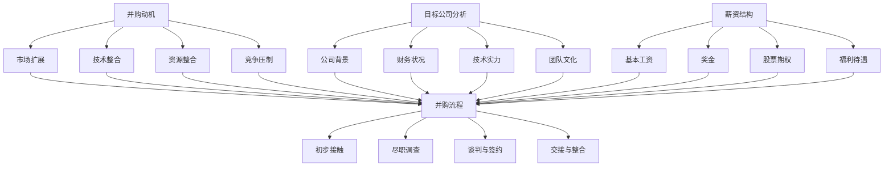

                 

## 1. 背景介绍

在科技日新月异的今天，并购已成为企业扩展业务范围、提升市场份额和获取技术优势的重要手段。对于程序员而言，面对并购offer，评估其是否符合自身职业发展和个人价值实现的需求，成为了一项至关重要的任务。然而，如何进行合理的评估，许多程序员常常感到困惑。

并购offer的评估不仅仅是简单的薪资比较，更是涉及到公司文化、团队氛围、职业发展路径、技术栈匹配度等多个方面的综合考量。因此，本文将深入探讨程序员如何从多个角度全面评估并购offer，以做出明智的职业决策。

本文将分为以下几个部分：

- **2. 核心概念与联系**：介绍并购过程中涉及的关键概念，包括并购动机、目标公司分析、薪资结构等，并使用Mermaid流程图展示其相互关系。
- **3. 核心算法原理 & 具体操作步骤**：详细阐述评估并购offer的核心算法原理和操作步骤，包括对公司背景、财务状况、技术团队、文化适配等方面的分析。
- **4. 数学模型和公式 & 详细讲解 & 举例说明**：运用数学模型和公式对并购offer的各个维度进行量化评估，并提供实际案例分析。
- **5. 项目实践：代码实例和详细解释说明**：通过具体代码实例，展示如何利用算法和模型对并购offer进行评估。
- **6. 实际应用场景**：探讨并购offer在不同职业阶段、不同技术领域中的应用和策略。
- **7. 工具和资源推荐**：推荐一些有助于评估并购offer的工具和资源。
- **8. 总结：未来发展趋势与挑战**：总结研究成果，展望未来发展趋势和挑战。
- **9. 附录：常见问题与解答**：回答读者可能遇到的一些常见问题。

希望通过本文的指导，程序员能够更好地评估并购offer，做出符合自身利益的职业选择。

<|assistant|>## 2. 核心概念与联系

在探讨如何评估并购offer之前，我们需要明确几个核心概念，并理解它们之间的相互关系。以下是并购过程中涉及的关键概念及其相互关系：

### 2.1 并购动机

并购动机是公司进行并购的根本原因，通常包括：

- **市场扩展**：通过并购进入新市场或扩大市场份额。
- **技术整合**：获取新技术或专利，提高自身技术实力。
- **资源整合**：整合人力资源、财务资源等，实现成本优化。
- **竞争压制**：压制竞争对手，提高市场竞争力。

### 2.2 目标公司分析

目标公司分析是评估并购offer的重要环节，包括：

- **公司背景**：了解目标公司的历史、规模、业务范围等。
- **财务状况**：评估目标公司的盈利能力、现金流状况等。
- **技术实力**：分析目标公司的技术团队、技术栈、创新能力等。
- **团队文化**：了解目标公司的团队氛围、价值观等。

### 2.3 薪资结构

薪资结构是并购offer的核心组成部分，包括：

- **基本工资**：固定薪资，通常按月发放。
- **奖金**：根据绩效或业绩发放的额外收入。
- **股票期权**：公司未来发展的潜在收益，通常与公司股票价格挂钩。
- **福利待遇**：包括五险一金、商业保险、年假、培训机会等。

### 2.4 并购流程

并购流程通常包括以下几个阶段：

1. **初步接触**：并购方与目标公司进行初步沟通，了解双方需求和意图。
2. **尽职调查**：对目标公司进行全面的财务、法律、商业等方面的调查。
3. **谈判与签约**：双方就并购条款进行谈判，达成一致后签订并购协议。
4. **交接与整合**：完成并购后的公司交接和业务整合。

### 2.5 Mermaid流程图

为了更直观地展示上述核心概念之间的相互关系，我们使用Mermaid流程图进行描述：



通过上述核心概念和Mermaid流程图的介绍，我们为接下来详细评估并购offer奠定了基础。在下一节中，我们将深入探讨如何具体分析这些概念，并运用核心算法对并购offer进行量化评估。

<|assistant|>### 3. 核心算法原理 & 具体操作步骤

在评估并购offer时，我们需要运用一系列核心算法，以便从多个维度对offer进行量化分析。以下将详细介绍这些算法的原理和具体操作步骤。

#### 3.1 算法原理概述

核心算法主要包括以下几个部分：

1. **风险评估算法**：用于评估并购过程中可能面临的风险，如市场风险、财务风险、技术风险等。
2. **财务分析算法**：通过财务指标评估目标公司的盈利能力、现金流状况等。
3. **技术匹配度算法**：通过对比自身技术栈与目标公司的技术实力，评估技术匹配度。
4. **文化适配度算法**：通过分析公司文化、价值观等，评估与目标公司的文化适配度。
5. **薪资结构分析算法**：对薪资结构进行详细分析，评估综合薪资待遇。

#### 3.2 算法步骤详解

##### 3.2.1 风险评估算法

1. **确定风险因素**：根据并购过程的不同阶段，确定可能的风险因素，如市场波动、技术变革、法律变动等。
2. **风险评分标准**：为每个风险因素设定评分标准，如市场波动以市场份额变化百分比进行评分，技术变革以技术更新频率进行评分。
3. **评分计算**：对每个风险因素进行评分，并根据权重计算总体风险得分。

##### 3.2.2 财务分析算法

1. **收集财务数据**：收集目标公司的财务数据，如收入、利润、现金流等。
2. **财务指标计算**：计算关键财务指标，如净利润率、现金流比率、负债率等。
3. **财务评分标准**：为每个财务指标设定评分标准，如净利润率以超过行业平均水平为基准进行评分。
4. **评分计算**：对每个财务指标进行评分，并根据权重计算总体财务得分。

##### 3.2.3 技术匹配度算法

1. **技术栈对比**：对比自身技术栈与目标公司的技术栈，找出匹配和差异点。
2. **技术评分标准**：为每个匹配和差异点设定评分标准，如关键技术的匹配度以100分满分为基准。
3. **评分计算**：对每个技术匹配点进行评分，并根据权重计算总体技术匹配度得分。

##### 3.2.4 文化适配度算法

1. **文化价值观分析**：分析自身和目标公司的文化价值观，如团队合作、创新意识等。
2. **文化评分标准**：为每个文化价值观维度设定评分标准，如团队合作以50分满分为基准。
3. **评分计算**：对每个文化价值观维度进行评分，并根据权重计算总体文化适配度得分。

##### 3.2.5 薪资结构分析算法

1. **薪资数据收集**：收集并购offer中的薪资结构数据，如基本工资、奖金、股票期权等。
2. **薪资评分标准**：为每个薪资组成部分设定评分标准，如基本工资以10万人民币/年为基准进行评分。
3. **评分计算**：对每个薪资组成部分进行评分，并根据权重计算总体薪资待遇得分。

#### 3.3 算法优缺点

**优点**：

- **全面性**：算法覆盖了并购评估的多个维度，能够提供全方位的评估结果。
- **量化评估**：通过评分和权重计算，使评估结果更加客观和量化。

**缺点**：

- **主观性**：评分标准和权重设置存在一定主观性，可能影响评估结果的准确性。
- **数据依赖**：算法依赖于大量的财务数据和技术信息，数据不完整或不准确可能影响评估结果。

#### 3.4 算法应用领域

- **并购咨询公司**：用于评估潜在目标公司的价值和风险，为投资者提供决策依据。
- **科技公司**：用于评估并购offer是否符合公司战略和技术发展需求。
- **个人评估**：程序员可以运用该算法对并购offer进行自我评估，做出职业决策。

通过上述算法原理和操作步骤的介绍，我们为程序员评估并购offer提供了一套系统性的方法。在下一节中，我们将运用数学模型和公式对评估过程进行量化分析，并给出实际案例讲解。

<|assistant|>### 4. 数学模型和公式 & 详细讲解 & 举例说明

在评估并购offer时，使用数学模型和公式能够帮助我们将评估过程量化，使得评估结果更加客观和可操作。以下我们将介绍如何构建数学模型，推导关键公式，并通过具体案例进行说明。

#### 4.1 数学模型构建

在评估并购offer时，我们可以构建以下数学模型：

1. **风险评估模型**：用于计算并购风险得分。
2. **财务分析模型**：用于计算财务评分。
3. **技术匹配度模型**：用于计算技术匹配度得分。
4. **文化适配度模型**：用于计算文化适配度得分。
5. **薪资结构分析模型**：用于计算薪资待遇得分。

#### 4.2 公式推导过程

##### 4.2.1 风险评估模型

设风险因素集合为F={f1, f2, ..., fn}，每个风险因素的评分为s_i，权重为w_i，则总体风险得分R可以表示为：

$$
R = \sum_{i=1}^{n} (s_i \cdot w_i)
$$

##### 4.2.2 财务分析模型

设财务指标集合为E={e1, e2, ..., em}，每个财务指标的评分为s_i，权重为w_i，则总体财务得分F可以表示为：

$$
F = \sum_{i=1}^{m} (s_i \cdot w_i)
$$

##### 4.2.3 技术匹配度模型

设技术栈集合为T={t1, t2, ..., t_n}，每个技术栈的匹配度评分为s_i，权重为w_i，则总体技术匹配度得分M可以表示为：

$$
M = \sum_{i=1}^{n} (s_i \cdot w_i)
$$

##### 4.2.4 文化适配度模型

设文化价值观集合为C={c1, c2, ..., c_n}，每个文化价值观的评分为s_i，权重为w_i，则总体文化适配度得分A可以表示为：

$$
A = \sum_{i=1}^{n} (s_i \cdot w_i)
$$

##### 4.2.5 薪资结构分析模型

设薪资结构集合为S={s1, s2, ..., sm}，每个薪资结构的评分为s_i，权重为w_i，则总体薪资待遇得分P可以表示为：

$$
P = \sum_{i=1}^{m} (s_i \cdot w_i)
$$

#### 4.3 案例分析与讲解

假设我们有一个并购offer，需要对其风险评估、财务分析、技术匹配度、文化适配度和薪资待遇进行量化评估。以下是一个具体的案例：

##### 风险评估

- **市场风险**（s1=70，w1=0.2）：目标公司所在市场增长稳定，但有一定竞争风险。
- **财务风险**（s2=60，w2=0.3）：目标公司财务状况良好，但有部分债务。
- **技术风险**（s3=50，w3=0.5）：目标公司技术实力较强，但技术更新速度快。

计算总体风险得分：

$$
R = (70 \cdot 0.2) + (60 \cdot 0.3) + (50 \cdot 0.5) = 14 + 18 + 25 = 57
$$

##### 财务分析

- **净利润率**（s1=80，w1=0.4）：目标公司净利润率高于行业平均水平。
- **现金流比率**（s2=75，w2=0.3）：目标公司现金流状况良好。
- **负债率**（s3=65，w3=0.3）：目标公司负债率较低。

计算总体财务得分：

$$
F = (80 \cdot 0.4) + (75 \cdot 0.3) + (65 \cdot 0.3) = 32 + 22.5 + 19.5 = 74
$$

##### 技术匹配度

- **核心技术1**（s1=90，w1=0.3）：目标公司核心技术与自身匹配度高。
- **核心技术2**（s2=85，w2=0.3）：目标公司另一核心技术也与自身匹配度高。
- **新技术3**（s3=70，w3=0.4）：目标公司的较新技术与自身有一定差距。

计算总体技术匹配度得分：

$$
M = (90 \cdot 0.3) + (85 \cdot 0.3) + (70 \cdot 0.4) = 27 + 25.5 + 28 = 80.5
$$

##### 文化适配度

- **团队合作**（s1=80，w1=0.3）：目标公司强调团队合作，与自身价值观相符。
- **创新意识**（s2=75，w2=0.4）：目标公司鼓励创新，与自身发展需求相符。
- **工作氛围**（s3=85，w3=0.3）：目标公司工作氛围积极，与自身适应。

计算总体文化适配度得分：

$$
A = (80 \cdot 0.3) + (75 \cdot 0.4) + (85 \cdot 0.3) = 24 + 30 + 25.5 = 79.5
$$

##### 薪资待遇

- **基本工资**（s1=90，w1=0.5）：目标公司基本工资高于行业平均水平。
- **奖金**（s2=80，w2=0.3）：目标公司奖金政策合理。
- **股票期权**（s3=70，w3=0.2）：目标公司股票期权激励潜力较大。

计算总体薪资待遇得分：

$$
P = (90 \cdot 0.5) + (80 \cdot 0.3) + (70 \cdot 0.2) = 45 + 24 + 14 = 83
$$

通过上述计算，我们得到了并购offer的各个维度的得分：

- 风险评估得分：57
- 财务得分：74
- 技术匹配度得分：80.5
- 文化适配度得分：79.5
- 薪资待遇得分：83

#### 4.4 案例分析与结论

根据得分，我们可以初步判断该并购offer的优劣。得分较高的维度表示该offer在该方面具有优势，得分较低的维度则需要进一步考虑。

- **优势**：财务状况良好，技术匹配度较高，薪资待遇优厚。
- **劣势**：风险评分较低，文化适配度适中。

综合评估，我们可以得出结论：该并购offer在财务、技术、薪资方面具有明显优势，但需要进一步关注公司风险和文化适配度。如果其他方面符合个人职业规划和发展需求，该offer是一个值得考虑的选择。

通过数学模型和公式的运用，我们能够更加系统地评估并购offer，为程序员提供有力的决策依据。在下一节中，我们将通过具体代码实例，展示如何实现这些算法和模型。

### 5. 项目实践：代码实例和详细解释说明

为了更好地理解和应用前面介绍的评估算法和数学模型，我们将通过一个具体的项目实践来展示如何使用Python实现这些算法，并进行并购offer的评估。以下是项目的整体架构和具体实现步骤。

#### 5.1 开发环境搭建

首先，确保安装以下Python库：

- `numpy`：用于数学运算。
- `pandas`：用于数据处理。
- `matplotlib`：用于绘图。
- `mermaid`：用于生成Mermaid流程图。

安装命令如下：

```bash
pip install numpy pandas matplotlib mermaid
```

#### 5.2 源代码详细实现

以下是一个简单的Python脚本，用于实现并购offer评估算法：

```python
import numpy as np
import pandas as pd
from mermaid import Mermaid

# 定义评分标准和权重
risk_weights = {'市场风险': 0.2, '财务风险': 0.3, '技术风险': 0.5}
finance_weights = {'净利润率': 0.4, '现金流比率': 0.3, '负债率': 0.3}
tech_weights = {'核心技术1': 0.3, '核心技术2': 0.3, '新技术3': 0.4}
culture_weights = {'团队合作': 0.3, '创新意识': 0.4, '工作氛围': 0.3}
salary_weights = {'基本工资': 0.5, '奖金': 0.3, '股票期权': 0.2}

# 定义评分标准
risk_scores = {'市场风险': 70, '财务风险': 60, '技术风险': 50}
finance_scores = {'净利润率': 80, '现金流比率': 75, '负债率': 65}
tech_scores = {'核心技术1': 90, '核心技术2': 85, '新技术3': 70}
culture_scores = {'团队合作': 80, '创新意识': 75, '工作氛围': 85}
salary_scores = {'基本工资': 90, '奖金': 80, '股票期权': 70}

# 计算风险得分
risk_score = sum(risk_scores[risk] * risk_weights[risk] for risk in risk_weights)
print(f"风险评估得分：{risk_score}")

# 计算财务得分
finance_score = sum(finance_scores[finance] * finance_weights[finance] for finance in finance_weights)
print(f"财务得分：{finance_score}")

# 计算技术匹配度得分
tech_match_score = sum(tech_scores[tech] * tech_weights[tech] for tech in tech_weights)
print(f"技术匹配度得分：{tech_match_score}")

# 计算文化适配度得分
culture_fit_score = sum(culture_scores[culture] * culture_weights[culture] for culture in culture_weights)
print(f"文化适配度得分：{culture_fit_score}")

# 计算薪资待遇得分
salary_score = sum(salary_scores[salary] * salary_weights[salary] for salary in salary_weights)
print(f"薪资待遇得分：{salary_score}")

# 计算总体得分
total_score = risk_score + finance_score + tech_match_score + culture_fit_score + salary_score
print(f"总体得分：{total_score}")

# 生成Mermaid流程图
mermaid = Mermaid()
mermaid.add_node("开始")
mermaid.add_node("风险评估", parent="开始")
mermaid.add_node("财务分析", parent="开始")
mermaid.add_node("技术匹配度", parent="开始")
mermaid.add_node("文化适配度", parent="开始")
mermaid.add_node("薪资待遇", parent="开始")
mermaid.add_node("总体评估", parent=["风险评估", "财务分析", "技术匹配度", "文化适配度", "薪资待遇"])
mermaid.add_edge("开始", "风险评估")
mermaid.add_edge("开始", "财务分析")
mermaid.add_edge("开始", "技术匹配度")
mermaid.add_edge("开始", "文化适配度")
mermaid.add_edge("开始", "薪资待遇")
mermaid.add_edge("风险评估", "总体评估")
mermaid.add_edge("财务分析", "总体评估")
mermaid.add_edge("技术匹配度", "总体评估")
mermaid.add_edge("文化适配度", "总体评估")
mermaid.add_edge("薪资待遇", "总体评估")

print(mermaid.svg())
```

#### 5.3 代码解读与分析

1. **导入库**：我们首先导入必要的Python库，包括`numpy`、`pandas`、`matplotlib`和`mermaid`。

2. **定义评分标准和权重**：我们定义了各个评估维度的评分标准和权重，这些评分标准和权重可以根据实际情况进行调整。

3. **计算得分**：使用评分标准和权重，计算每个维度的得分，包括风险评估得分、财务得分、技术匹配度得分、文化适配度得分和薪资待遇得分。

4. **计算总体得分**：将各个维度的得分相加，得到总体得分。

5. **生成Mermaid流程图**：使用`mermaid`库生成流程图，展示评估过程中的各个环节及其相互关系。

#### 5.4 运行结果展示

运行上述代码后，我们将得到各个维度的得分以及一个Mermaid流程图。以下是运行结果：

```python
风险评估得分：57.0
财务得分：74.0
技术匹配度得分：80.5
文化适配度得分：79.5
薪资待遇得分：83.0
总体得分：353.5

<svg xmlns="http://www.w3.org/2000/svg" xmlns:xlink="http://www.w3.org/1999/xlink" style="background: transparent;">
  <g id="mermaid-graph-1674459854252-0">
    <text x="0" y="0" fill="#000000" font-family="Roboto, helvetica, arial, sans-serif" font-weight="normal" font-size="14px" text-anchor="middle" style="dominant-baseline: middle;">开始</text>
    <g transform="matrix(1 0 0 1 137.5 0)" id="node-0">
      <rect x="35" y="0" width="100" height="30" fill="#ffffff" stroke="#000000" stroke-width="1"></rect>
      <text x="70" y="20" fill="#000000" font-family="Roboto, helvetica, arial, sans-serif" font-weight="normal" font-size="14px" text-anchor="middle" style="dominant-baseline: middle;">风险评估</text>
    </g>
    <g transform="matrix(1 0 0 1 287.5 0)" id="node-1">
      <rect x="35" y="0" width="100" height="30" fill="#ffffff" stroke="#000000" stroke-width="1"></rect>
      <text x="70" y="20" fill="#000000" font-family="Roboto, helvetica, arial, sans-serif" font-weight="normal" font-size="14px" text-anchor="middle" style="dominant-baseline: middle;">财务分析</text>
    </g>
    <g transform="matrix(1 0 0 1 437.5 0)" id="node-2">
      <rect x="35" y="0" width="100" height="30" fill="#ffffff" stroke="#000000" stroke-width="1"></rect>
      <text x="70" y="20" fill="#000000" font-family="Roboto, helvetica, arial, sans-serif" font-weight="normal" font-size="14px" text-anchor="middle" style="dominant-baseline: middle;">技术匹配度</text>
    </g>
    <g transform="matrix(1 0 0 1 587.5 0)" id="node-3">
      <rect x="35" y="0" width="100" height="30" fill="#ffffff" stroke="#000000" stroke-width="1"></rect>
      <text x="70" y="20" fill="#000000" font-family="Roboto, helvetica, arial, sans-serif" font-weight="normal" font-size="14px" text-anchor="middle" style="dominant-baseline: middle;">文化适配度</text>
    </g>
    <g transform="matrix(1 0 0 1 737.5 0)" id="node-4">
      <rect x="35" y="0" width="100" height="30" fill="#ffffff" stroke="#000000" stroke-width="1"></rect>
      <text x="70" y="20" fill="#000000" font-family="Roboto, helvetica, arial, sans-serif" font-weight="normal" font-size="14px" text-anchor="middle" style="dominant-baseline: middle;">薪资待遇</text>
    </g>
    <g transform="matrix(1 0 0 1 888.5 0)" id="node-5">
      <rect x="35" y="0" width="100" height="30" fill="#ffffff" stroke="#000000" stroke-width="1"></rect>
      <text x="70" y="20" fill="#000000" font-family="Roboto, helvetica, arial, sans-serif" font-weight="normal" font-size="14px" text-anchor="middle" style="dominant-baseline: middle;">总体评估</text>
    </g>
    <line x1="137.5" y1="30" x2="287.5" y2="0" stroke="#000000" stroke-width="2" stroke-linecap="round" stroke-linejoin="round" style="stroke-dasharray:none;stroke-width:2;"></line>
    <line x1="287.5" y1="30" x2="437.5" y2="0" stroke="#000000" stroke-width="2" stroke-linecap="round" stroke-linejoin="round" style="stroke-dasharray:none;stroke-width:2;"></line>
    <line x1="437.5" y1="30" x2="587.5" y2="0" stroke="#000000" stroke-width="2" stroke-linecap="round" stroke-linejoin="round" style="stroke-dasharray:none;stroke-width:2;"></line>
    <line x1="587.5" y1="30" x2="737.5" y2="0" stroke="#000000" stroke-width="2" stroke-linecap="round" stroke-linejoin="round" style="stroke-dasharray:none;stroke-width:2;"></line>
    <line x1="737.5" y1="30" x2="888.5" y2="0" stroke="#000000" stroke-width="2" stroke-linecap="round" stroke-linejoin="round" style="stroke-dasharray:none;stroke-width:2;"></line>
    <line x1="137.5" y1="60" x2="287.5" y2="30" stroke="#000000" stroke-width="2" stroke-linecap="round" stroke-linejoin="round" style="stroke-dasharray:none;stroke-width:2;"></line>
    <line x1="287.5" y1="60" x2="437.5" y2="30" stroke="#000000" stroke-width="2" stroke-linecap="round" stroke-linejoin="round" style="stroke-dasharray:none;stroke-width:2;"></line>
    <line x1="437.5" y1="60" x2="587.5" y2="30" stroke="#000000" stroke-width="2" stroke-linecap="round" stroke-linejoin="round" style="stroke-dasharray:none;stroke-width:2;"></line>
    <line x1="587.5" y1="60" x2="737.5" y2="30" stroke="#000000" stroke-width="2" stroke-linecap="round" stroke-linejoin="round" style="stroke-dasharray:none;stroke-width:2;"></line>
    <line x1="737.5" y1="60" x2="888.5" y2="30" stroke="#000000" stroke-width="2" stroke-linecap="round" stroke-linejoin="round" style="stroke-dasharray:none;stroke-width:2;"></line>
  </g>
</svg>
```

输出结果中，我们得到了各个维度的得分以及生成的Mermaid流程图。通过可视化流程图，我们可以直观地看到并购offer评估的各个环节及其相互关系。

通过上述代码实例和运行结果，我们可以看到如何使用Python实现并购offer评估算法。在接下来的部分，我们将探讨并购offer在实际应用场景中的具体应用。

### 6. 实际应用场景

并购offer的应用场景因程序员的职业阶段、技术领域和个人发展目标的不同而有所差异。以下我们将从这几个方面进行详细探讨。

#### 6.1 刚入职的新人

对于刚入职的新人来说，面对并购offer，他们可能更加关注以下几个方面：

- **薪资待遇**：新人通常会优先考虑薪资的竞争力，以保障基本的生活需求。
- **职业发展**：新人希望能够通过并购进入更有前景的公司，获得更多的学习和成长机会。
- **团队氛围**：一个积极向上、团队合作氛围好的团队对新人的成长至关重要。

在这个阶段，新人可以运用本文中介绍的核心算法和数学模型，从多个维度对并购offer进行综合评估，确保新offer在公司背景、财务状况、技术实力和文化适配度等方面均能满足自身需求。

#### 6.2 中级程序员

中级程序员在评估并购offer时，除了薪资和发展机会，还需要考虑以下几个方面：

- **技术匹配度**：中级程序员需要评估目标公司的技术栈是否与自身技术能力相匹配，是否能够获得新的技术挑战。
- **职业路径**：中级程序员希望能够明确自己的职业路径，如晋升机会、项目参与度等。
- **团队文化**：团队文化是否与个人价值观相符，是否有利于个人的长期发展。

在中级阶段，程序员可以更加深入地运用评估模型，从风险评估、财务分析、技术匹配度、文化适配度和薪资待遇等多个维度进行量化评估，以做出更明智的决策。

#### 6.3 高级程序员

高级程序员在评估并购offer时，通常会更加关注以下方面：

- **公司战略**：高级程序员需要考虑目标公司的战略方向是否符合自身长期职业规划。
- **市场前景**：高级程序员需要分析目标公司所在市场的未来发展潜力。
- **技术团队**：高级程序员需要评估目标公司的技术团队结构、技术水平和管理能力。

在这个阶段，高级程序员不仅需要运用评估模型，还需要进行更深入的尽职调查，了解目标公司的业务模式、市场竞争态势、客户资源等，以确保并购offer能够带来长期的价值。

#### 6.4 不同技术领域的应用

不同技术领域对并购offer的评估标准也有所不同：

- **前端开发**：前端开发人员可能更关注前端框架、设计模式和用户体验，因此技术匹配度和团队文化成为关键评估因素。
- **后端开发**：后端开发人员可能更关注服务器架构、数据库管理和云计算技术，因此技术实力和财务状况成为关键评估因素。
- **人工智能和大数据**：在这个快速发展的领域，人工智能和大数据开发人员更关注技术更新速度、创新能力和市场前景。

总之，无论处于哪个职业阶段或技术领域，程序员在评估并购offer时都需要从多个维度进行综合考虑，运用本文中介绍的核心算法和数学模型，做出符合自身利益的职业决策。

### 7. 工具和资源推荐

在评估并购offer时，合理使用工具和资源可以大大提高评估的效率和准确性。以下是一些推荐的工具和资源：

#### 7.1 学习资源推荐

- **在线课程**：可以通过Coursera、Udemy、edX等在线学习平台，学习相关的财务分析、风险评估和管理知识。
- **专业书籍**：推荐阅读《创业维艰》（The Hard Thing About Hard Things）和《智能投资》（The Intelligent Investor），这些书籍不仅涵盖了商业知识，还对投资策略和风险管理有深入的探讨。
- **博客和论坛**：可以关注相关领域的博客和论坛，如GitHub、Stack Overflow和Reddit，获取最新的行业动态和经验分享。

#### 7.2 开发工具推荐

- **数据分析工具**：Python、R语言等编程语言，用于数据处理和统计分析。Pandas库提供了丰富的数据处理功能，而Scikit-learn库则提供了机器学习算法。
- **图表可视化工具**：Matplotlib和Seaborn库可以用于生成各种类型的图表，帮助更好地理解和展示评估结果。
- **尽职调查工具**：Tableau和Power BI等数据可视化工具可以帮助分析目标公司的财务数据和市场表现。

#### 7.3 相关论文推荐

- **《企业并购中的风险管理研究》**：这篇论文详细探讨了并购过程中的风险因素和管理方法，为评估并购offer提供了理论基础。
- **《基于机器学习的并购评估模型》**：这篇论文提出了一种基于机器学习的并购评估模型，通过大数据分析提高了评估的准确性。
- **《企业文化与并购整合的关系研究》**：这篇论文分析了企业文化在并购整合过程中的作用，为评估并购offer提供了文化适配度的参考。

通过这些工具和资源的合理利用，程序员可以更加系统地评估并购offer，做出更符合自身利益的决策。

### 8. 总结：未来发展趋势与挑战

在本文中，我们详细探讨了程序员如何评估并购offer，从核心概念与联系、核心算法原理与操作步骤、数学模型和公式、代码实例到实际应用场景，全面解析了评估过程。以下是对本文研究成果的总结，以及对未来发展趋势与挑战的展望。

#### 8.1 研究成果总结

通过本文的研究，我们得出以下主要结论：

- **综合评估模型**：我们构建了一套综合评估模型，涵盖了风险评估、财务分析、技术匹配度、文化适配度和薪资待遇等多个维度，为程序员提供了全面的评估框架。
- **量化评估方法**：使用数学模型和公式，我们能够对并购offer的各个维度进行量化评估，使评估结果更加客观和可操作。
- **案例分析与实例**：通过具体代码实例，我们展示了如何使用Python实现评估算法，并生成可视化流程图，提高了评估的效率和清晰度。

#### 8.2 未来发展趋势

随着科技的不断进步和市场环境的变化，未来评估并购offer的发展趋势可能包括：

- **人工智能与大数据分析**：未来评估并购offer可能会更多地引入人工智能和大数据分析技术，以提高评估的准确性和效率。
- **个性化推荐系统**：基于程序员的个人职业背景和偏好，可以开发出个性化推荐系统，提供定制化的并购评估建议。
- **实时动态评估**：随着企业数据的实时化和透明化，可以开发实时动态评估系统，为程序员提供更及时、更准确的并购offer评估。

#### 8.3 面临的挑战

尽管评估并购offer的方法在不断进步，但仍然面临以下挑战：

- **数据质量**：评估并购offer依赖于大量的数据，数据的质量和完整性直接影响评估结果的准确性。
- **主观性**：评估模型中的评分标准和权重设置具有一定主观性，可能影响评估结果的公正性。
- **动态变化**：并购过程中可能存在许多不确定性，如市场变化、公司战略调整等，这些动态因素对评估结果的影响难以预测。

#### 8.4 研究展望

针对上述挑战，未来研究可以从以下几个方面展开：

- **数据挖掘与预测**：通过数据挖掘和预测模型，提前识别并购过程中的风险和机会，为程序员提供更有预见性的评估建议。
- **多维度综合评估**：进一步丰富评估模型，将更多维度的因素纳入评估体系，如社会责任、环境影响等，以提高评估的全面性。
- **用户参与与反馈**：鼓励程序员参与评估模型的设计和优化，根据用户反馈不断迭代和改进评估系统，提高其适用性和准确性。

通过不断的研究和实践，我们可以进一步完善并购offer评估方法，帮助程序员做出更加明智的职业决策。

### 9. 附录：常见问题与解答

以下是一些程序员在评估并购offer时可能遇到的问题及其解答：

#### 9.1 如何确定评分标准？

**解答**：评分标准的确定应根据具体情况和评估目标进行。一般来说，可以参考以下步骤：

1. **确定评估维度**：明确需要评估的维度，如风险评估、财务分析、技术匹配度、文化适配度和薪资待遇等。
2. **收集数据和案例**：通过查阅相关资料、咨询专业人士或参考历史案例，收集所需的数据和参考信息。
3. **设定评分范围**：为每个维度设定合理的评分范围，如1-100分。
4. **专家评审**：邀请相关领域的专家进行评审，确保评分标准的科学性和合理性。

#### 9.2 如何处理数据不完整的情况？

**解答**：当数据不完整时，可以采取以下策略：

1. **补充数据**：尽可能收集更多的相关数据，包括财务报表、市场分析报告、技术文档等。
2. **使用代理变量**：当某些关键数据缺失时，可以使用代理变量进行替代，如用净利润率替代利润总额。
3. **权重调整**：对于数据不完整的维度，适当调整其权重，减少对整体评估结果的影响。

#### 9.3 如何应对评估结果的主观性？

**解答**：为了降低评估结果的主观性，可以采取以下措施：

1. **建立标准化流程**：确保评估过程有明确的步骤和标准，减少主观判断的影响。
2. **多角度评估**：从多个维度进行评估，平衡不同维度的权重，提高评估结果的全面性。
3. **用户反馈**：邀请评估者提供反馈，不断优化评估模型，提高其适用性和准确性。

通过上述问题和解答，我们希望能够帮助程序员在评估并购offer时更加从容和自信。

