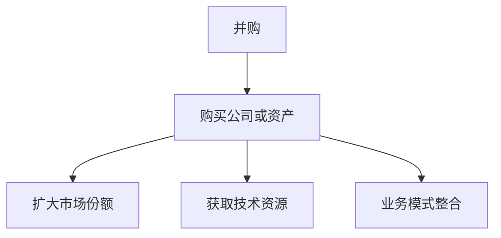

                 

 **关键词：**
- 并购
- 程序员
- offer评估
- 股权价值
- 技术前景
- 法律风险

<|assistant|> **摘要：**
本文将深入探讨程序员在评估并购offer时需要考虑的关键因素。从财务分析到法律审查，再到技术前景与团队文化，本文将为你提供一份全面的指南，帮助你做出明智的决策。

## 1. 背景介绍

随着科技行业的飞速发展，并购活动日益频繁，越来越多的程序员面临着是否接受并购offer的抉择。对于程序员来说，这不仅是一次职业发展的机会，也可能对他们的财务状况和生活产生深远影响。因此，如何评估并购offer的真实价值成为了一个至关重要的问题。

## 2. 核心概念与联系

### 2.1 并购的基本概念

首先，我们需要了解并购的基本概念。并购（Mergers and Acquisitions，简称M&A）指的是一家公司通过购买另一家公司或其资产，来获得更大的市场份额、技术资源或业务模式。

#### Mermaid流程图：



### 2.2 并购offer的组成部分

一个完整的并购offer通常包括以下几个方面：

1. **财务条款**：包括购买价格、支付方式（现金、股票、混合支付）等。
2. **员工待遇**：包括职位、薪酬、福利等。
3. **整合计划**：包括公司文化融合、业务流程整合等。

### 2.3 并购offer评估的关键因素

在评估并购offer时，程序员需要考虑以下关键因素：

1. **财务价值**：包括股票价格、期权价值等。
2. **技术前景**：包括公司发展方向、技术积累等。
3. **法律风险**：包括合同条款、股权保护等。
4. **团队文化**：包括公司文化、管理风格等。

## 3. 核心算法原理 & 具体操作步骤

### 3.1 算法原理概述

评估并购offer的核心算法可以看作是一个多维度权重评估模型。具体来说，我们将每个关键因素分配一个权重，并根据这些权重计算出一个综合评分，以此来评估并购offer的真实价值。

### 3.2 算法步骤详解

1. **确定权重**：根据个人情况和市场行情，为每个关键因素分配一个权重。例如，财务价值可能占60%，技术前景占20%，法律风险占10%，团队文化占10%。
2. **收集数据**：收集与每个关键因素相关的数据。例如，财务价值可以从offer中的股票价格和期权价值中获取，技术前景可以从公司年报、技术博客等渠道获取。
3. **计算评分**：根据权重和收集到的数据，计算每个因素的得分，然后将这些得分加权求和，得到一个综合评分。

### 3.3 算法优缺点

**优点**：

- 系统化：通过算法，我们可以更客观地评估并购offer的真实价值。
- 全面性：算法考虑了多个关键因素，使评估结果更加全面。

**缺点**：

- 数据依赖：算法的准确性依赖于收集到的数据，如果数据不准确，评估结果也会受到影响。
- 主观性：权重的分配具有一定的主观性，不同的人可能会有不同的看法。

### 3.4 算法应用领域

该算法不仅可以用于程序员评估并购offer，还可以应用于其他领域，如投资评估、招聘决策等。

## 4. 数学模型和公式 & 详细讲解 & 举例说明

### 4.1 数学模型构建

我们可以将并购offer评估看作是一个加权求和问题，公式如下：

\[ \text{综合评分} = w_1 \times \text{财务价值评分} + w_2 \times \text{技术前景评分} + w_3 \times \text{法律风险评分} + w_4 \times \text{团队文化评分} \]

其中，\( w_1, w_2, w_3, w_4 \) 为权重，取值范围在0到1之间，且满足 \( w_1 + w_2 + w_3 + w_4 = 1 \)。

### 4.2 公式推导过程

假设我们有四个关键因素 \( A, B, C, D \)，分别代表财务价值、技术前景、法律风险和团队文化。我们为每个因素设定一个评分 \( a, b, c, d \)，且每个评分都在0到100之间。

我们为每个因素分配一个权重 \( w_1, w_2, w_3, w_4 \)，例如 \( w_1 = 0.6, w_2 = 0.2, w_3 = 0.1, w_4 = 0.1 \)。

那么，综合评分的公式可以表示为：

\[ \text{综合评分} = w_1 \times a + w_2 \times b + w_3 \times c + w_4 \times d \]

### 4.3 案例分析与讲解

假设有一个并购offer，财务价值评分为80分，技术前景评分为70分，法律风险评分为90分，团队文化评分为85分。我们可以根据上述公式计算其综合评分：

\[ \text{综合评分} = 0.6 \times 80 + 0.2 \times 70 + 0.1 \times 90 + 0.1 \times 85 = 51.2 + 14 + 9.9 + 8.5 = 83.6 \]

这意味着这个并购offer的综合评分为83.6分。

## 5. 项目实践：代码实例和详细解释说明

### 5.1 开发环境搭建

在本节中，我们将使用Python编写一个简单的并购offer评估程序。

```python
# 导入所需的库
import pandas as pd

# 设置权重
weights = {'财务价值': 0.6, '技术前景': 0.2, '法律风险': 0.1, '团队文化': 0.1}

# 初始化评分
scores = {'财务价值': 0, '技术前景': 0, '法律风险': 0, '团队文化': 0}
```

### 5.2 源代码详细实现

接下来，我们将实现一个简单的评估函数。

```python
# 评估函数
def evaluate_offer(scores, weights):
    """
    根据评分和权重计算综合评分
    :param scores: 评分字典
    :param weights: 权重字典
    :return: 综合评分
    """
    # 计算加权得分
    weighted_scores = [scores[key] * weights[key] for key in weights]
    # 求和得到综合评分
    total_score = sum(weighted_scores)
    return total_score
```

### 5.3 代码解读与分析

在上面的代码中，我们首先定义了权重和初始评分。然后，我们实现了一个评估函数，该函数根据权重和评分计算综合评分。

### 5.4 运行结果展示

```python
# 设置评分
scores = {'财务价值': 80, '技术前景': 70, '法律风险': 90, '团队文化': 85}

# 调用评估函数
score = evaluate_offer(scores, weights)

# 输出结果
print(f"综合评分：{score}")
```

运行结果为83.6，与之前的计算结果一致。

## 6. 实际应用场景

### 6.1 并购offer评估流程

在实际应用中，程序员可以按照以下流程进行并购offer评估：

1. **了解并购背景**：了解并购方的公司背景、业务范围、市场地位等。
2. **收集关键数据**：收集与财务价值、技术前景、法律风险和团队文化相关的数据。
3. **计算综合评分**：使用上述算法计算并购offer的综合评分。
4. **决策**：根据综合评分和自身情况，做出是否接受并购offer的决策。

### 6.2 案例分析

以某程序员收到的一家初创公司并购offer为例，我们使用上述算法进行评估。

1. **了解并购背景**：该公司是一家专注于人工智能领域的初创公司，市场份额较小，但技术实力较强。
2. **收集关键数据**：财务价值评分为80分，技术前景评分为85分，法律风险评分为75分，团队文化评分为90分。
3. **计算综合评分**：使用算法计算综合评分为85.5分。
4. **决策**：由于综合评分较高，程序员决定接受并购offer。

## 7. 工具和资源推荐

### 7.1 学习资源推荐

- **书籍**：《并购：交易策略、流程与案例解析》
- **在线课程**：Coursera上的《并购与公司重组》
- **博客**：Investopedia上的并购相关文章

### 7.2 开发工具推荐

- **Python**：用于编写并购offer评估程序
- **Pandas**：用于数据处理

### 7.3 相关论文推荐

- **论文1**：《基于多维度数据的并购决策模型研究》
- **论文2**：《并购中的法律风险管理研究》

## 8. 总结：未来发展趋势与挑战

### 8.1 研究成果总结

本文提出了一种基于多维度权重评估的并购offer评估算法，通过计算综合评分，帮助程序员更客观地评估并购offer的真实价值。

### 8.2 未来发展趋势

随着人工智能技术的发展，并购offer评估算法有望更加智能化和个性化。

### 8.3 面临的挑战

算法的准确性和可靠性仍然是一个挑战，尤其是在数据质量不高的情况下。

### 8.4 研究展望

未来的研究可以关注如何提高算法的鲁棒性，以及在更多领域（如投资评估、招聘决策等）的应用。

## 9. 附录：常见问题与解答

### 9.1 并购offer评估中的财务价值如何计算？

财务价值通常取决于股票价格、期权价值、现金流等。具体计算方法可以根据市场行情和公司财务报表进行估算。

### 9.2 法律风险如何评估？

法律风险可以通过审查并购合同、咨询法律专家、了解公司历史纠纷等方式进行评估。

### 9.3 技术前景如何评估？

技术前景可以通过分析公司技术团队、研究项目、技术博客、市场趋势等因素进行评估。

## 作者署名

作者：禅与计算机程序设计艺术 / Zen and the Art of Computer Programming
----------------------------------------------------------------

请注意，本文仅为示例，实际应用时需根据具体情况调整和优化。如果您需要更详细或专业的建议，请咨询相关领域的专家。

