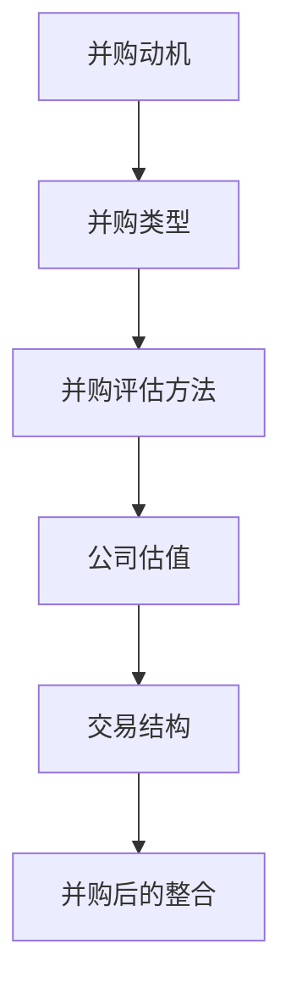

                 

### 1. 背景介绍

在当今快速变化的科技行业中，并购活动变得日益频繁。随着市场的竞争加剧，企业通过并购来扩展业务范围、提高市场份额或获取关键技术已成为一种常见的策略。对于程序员而言，了解如何评估并购机会以及如何确定公司出售的时机，是至关重要的。这不仅能够帮助他们在职业发展过程中做出更明智的决策，还能够为公司带来更大的价值。

程序员通常具备深厚的专业知识和丰富的技术经验，这使得他们在评估并购机会时具有独特的视角。然而，并购评估并非仅仅是技术层面的考量，它还涉及到战略、财务、法律和市场等多个方面。因此，程序员在参与并购评估时，需要具备跨学科的知识和综合分析能力。

本文将探讨程序员在评估并购机会和公司出售时机时需要考虑的关键因素，并分享一些实用的策略和工具。通过阅读本文，程序员将能够更好地理解并购评估的过程，并有效地为自己的职业规划做出决策。

### 2. 核心概念与联系

在深入探讨如何评估并购机会和公司出售时机之前，我们需要了解一些核心概念和它们之间的联系。这些概念包括但不限于：

- **并购动机**：企业并购的驱动因素，如市场扩张、技术整合、成本节约等。
- **并购类型**：包括横向并购、纵向并购、混合并购等。
- **并购评估方法**：如财务分析、市场评估、技术评估等。
- **公司估值**：确定公司价值的方法，如收益法、市场比较法、成本法等。
- **交易结构**：并购交易的具体安排，如现金并购、股票并购、换股并购等。
- **并购后的整合**：并购完成后，如何将两家公司的资源、文化和技术有效整合。

为了更直观地理解这些概念之间的联系，我们可以使用Mermaid流程图来展示它们：



通过这个流程图，我们可以看到，并购动机决定了并购类型，而并购评估方法和公司估值则为交易结构提供了依据，最后，交易结构和并购后的整合共同决定了并购的成功与否。

### 3. 核心算法原理 & 具体操作步骤

#### 3.1 算法原理概述

在评估并购机会和公司出售时机时，程序员需要运用一系列核心算法原理来进行分析和决策。这些算法原理主要包括：

- **财务分析算法**：用于评估公司的财务健康状况，如利润分析、现金流分析、资产负债表分析等。
- **市场评估算法**：用于分析目标市场的现状和未来趋势，如市场份额分析、竞争态势分析等。
- **技术评估算法**：用于评估公司的技术实力和创新能力，如技术专利分析、研发投入分析等。
- **公司估值算法**：用于确定公司的价值，如收益法、市场比较法、成本法等。

这些算法共同构成了一个完整的评估体系，帮助程序员从多个维度对并购机会和公司出售时机进行综合分析。

#### 3.2 算法步骤详解

下面，我们将详细讲解这些算法的具体步骤：

**3.2.1 财务分析算法**

1. **数据收集**：收集公司的财务报表，包括利润表、现金流量表和资产负债表。
2. **利润分析**：计算公司的净利润、毛利率和营业利润率等指标，分析公司的盈利能力。
3. **现金流分析**：分析公司的现金流入和流出情况，计算自由现金流（FCF）。
4. **资产负债表分析**：分析公司的资产、负债和股东权益，评估公司的财务稳定性。

**3.2.2 市场评估算法**

1. **市场份额分析**：收集市场数据，计算公司在目标市场中的市场份额。
2. **竞争态势分析**：分析主要竞争对手的市场份额、产品特性、竞争优势等。
3. **市场增长趋势分析**：研究市场未来的增长趋势，预测公司的市场前景。

**3.2.3 技术评估算法**

1. **技术专利分析**：调查公司的技术专利数量、质量和应用范围。
2. **研发投入分析**：评估公司的研发投入占比和研发成果。
3. **技术团队评估**：评估公司的技术团队规模、技能水平和创新能力。

**3.2.4 公司估值算法**

1. **收益法**：预测公司未来的现金流量，使用折现现金流（DCF）模型计算公司价值。
2. **市场比较法**：参考同行业公司的交易案例，使用市场乘数法或比较价值法估算公司价值。
3. **成本法**：评估公司资产和负债的总价值，计算公司的净资产价值。

#### 3.3 算法优缺点

**财务分析算法**：

- **优点**：提供了全面的财务健康状况评估，有助于发现潜在问题。
- **缺点**：仅关注财务数据，可能忽略市场和技术因素。

**市场评估算法**：

- **优点**：从市场角度提供了公司竞争力的评估，有助于预测未来发展。
- **缺点**：市场数据可能存在波动性和不确定性。

**技术评估算法**：

- **优点**：重点关注公司的技术实力，有助于发现技术创新带来的价值。
- **缺点**：技术评估可能涉及专业知识和判断，存在一定主观性。

**公司估值算法**：

- **优点**：提供了定量化的公司价值评估，有助于交易谈判。
- **缺点**：不同估值方法可能得出不同的结果，需要综合分析。

#### 3.4 算法应用领域

这些算法在并购评估和公司出售时机的应用非常广泛，适用于各种类型的企业和行业。例如：

- **科技行业**：技术评估和市场评估尤为重要，因为技术创新和市场竞争是行业特点。
- **消费品行业**：财务分析算法和市场份额分析有助于评估公司的盈利能力和市场地位。
- **制造业**：成本法估值适用于资产密集型的制造企业。

通过运用这些算法，程序员可以全面、准确地评估并购机会和公司出售时机，从而做出明智的决策。

### 4. 数学模型和公式 & 详细讲解 & 举例说明

在并购评估和公司出售时机的分析过程中，数学模型和公式起到了关键作用。以下我们将介绍几个常用的数学模型和公式，并详细讲解其推导过程和应用示例。

#### 4.1 数学模型构建

**4.1.1 折现现金流模型（DCF）**

折现现金流模型是评估公司价值的一种常用方法。它通过预测公司未来产生的现金流量，并使用适当的折现率将这些现金流量折现到现值，从而计算公司的企业价值（EV）。

公式如下：

$$
EV = \sum_{t=1}^{n} \frac{CF_t}{(1 + r)^t}
$$

其中：
- \( EV \)：企业价值
- \( CF_t \)：第 \( t \) 年的预期自由现金流
- \( r \)：折现率
- \( n \)：预测期数

**4.1.2 市场乘数模型**

市场乘数模型通过参考同行业公司的交易案例和市场数据，估算公司的价值。常用的市场乘数包括市盈率（P/E）、市净率（P/B）和市场价值对销售额比率（P/S）。

公式如下：

$$
EV = \text{市场乘数} \times \text{基准指标}
$$

其中：
- \( \text{市场乘数} \)：同行业公司的市场乘数
- \( \text{基准指标} \)：公司的财务指标，如净利润、净资产或销售收入

#### 4.2 公式推导过程

**4.2.1 折现现金流模型的推导**

折现现金流模型的推导基于以下假设：
1. 公司未来的现金流可以预测。
2. 折现率反映了投资者对风险的容忍程度。

推导步骤如下：

1. **现金流预测**：根据公司未来的盈利能力和增长趋势，预测各年的自由现金流。
2. **确定折现率**：通常使用加权平均资本成本（WACC）作为折现率。WACC = \( ke \times \frac{E}{D+E} + kd \times \frac{D}{D+E} \)，其中 \( ke \) 和 \( kd \) 分别为权益资本成本和债务资本成本，\( E \) 和 \( D \) 分别为权益和债务的市场价值。

3. **计算现值**：使用折现率将未来各年的自由现金流折现到现值，并求和。

**4.2.2 市场乘数模型的推导**

市场乘数模型是基于市场数据和历史交易案例的推导。具体步骤如下：

1. **收集同行业公司数据**：收集目标公司的竞争对手或类似公司的交易案例和市场数据。
2. **确定市场乘数**：根据交易案例和市场数据，确定同行业公司的平均市场乘数。
3. **计算公司价值**：将市场乘数乘以目标公司的基准指标（如净利润、净资产或销售收入），得出公司的估值。

#### 4.3 案例分析与讲解

**案例 1：使用DCF模型评估一家科技公司**

假设一家科技公司预计未来三年的自由现金流分别为：\( CF_1 = 1,000,000 \) 元，\( CF_2 = 1,500,000 \) 元，\( CF_3 = 2,000,000 \) 元。折现率 \( r = 10\% \)。

使用DCF模型计算其企业价值：

$$
EV = \frac{1,000,000}{(1 + 0.1)^1} + \frac{1,500,000}{(1 + 0.1)^2} + \frac{2,000,000}{(1 + 0.1)^3} = 2,485,714.29 \text{元}
$$

**案例 2：使用市场乘数模型评估一家消费品公司**

假设市场数据显示同行业公司的平均市盈率为20倍，目标公司的净利润为1,000,000元。

使用市场乘数模型计算其企业价值：

$$
EV = 20 \times 1,000,000 = 20,000,000 \text{元}
$$

#### 4.4 应用示例

通过上述案例，我们可以看到如何使用DCF模型和市盈率模型来评估公司的价值。这些模型不仅提供了定量化的估值结果，还帮助我们更好地理解公司的财务状况和市场地位。

在实际应用中，程序员需要根据具体情况灵活运用这些模型，并结合市场数据和技术分析，做出全面的评估。

### 5. 项目实践：代码实例和详细解释说明

在了解了并购评估和公司出售时机分析的理论和方法之后，我们通过一个实际的项目实践来进一步加深理解。这个项目将使用Python编程语言来实现一个简单的并购评估工具，帮助程序员更直观地理解并购评估的过程。

#### 5.1 开发环境搭建

首先，我们需要搭建开发环境。以下是所需的环境和步骤：

- **Python版本**：Python 3.8及以上版本
- **开发工具**：Visual Studio Code 或 PyCharm
- **依赖库**：Pandas、NumPy、Matplotlib

安装依赖库的命令如下：

```bash
pip install pandas numpy matplotlib
```

#### 5.2 源代码详细实现

接下来，我们来实现并购评估工具的源代码。以下是主要的功能模块：

```python
import pandas as pd
import numpy as np
import matplotlib.pyplot as plt

class MergerAndAcquisitionAssessor:
    def __init__(self, financial_data, market_data, tech_data):
        self.financial_data = financial_data
        self.market_data = market_data
        self.tech_data = tech_data

    def calculate_dcf(self, discount_rate):
        # 使用DCF模型计算企业价值
        dcf_value = 0
        for year, cash_flow in self.financial_data.items():
            dcf_value += cash_flow / (1 + discount_rate) ** year
        return dcf_value

    def calculate_mkt_multiplier(self, benchmark, market_multiple):
        # 使用市场乘数模型计算企业价值
        market_value = market_multiple * benchmark
        return market_value

    def plot_financials(self):
        # 绘制财务数据图表
        plt.figure(figsize=(10, 5))
        plt.plot(self.financial_data.keys(), self.financial_data.values(), label='Free Cash Flow')
        plt.xlabel('Year')
        plt.ylabel('Cash Flow (in Million)')
        plt.title('Financial Analysis')
        plt.legend()
        plt.show()

    def plot_tech_innovation(self):
        # 绘制技术创新图表
        plt.figure(figsize=(10, 5))
        plt.plot(self.tech_data.keys(), self.tech_data.values(), label='R&D Investment')
        plt.xlabel('Year')
        plt.ylabel('Investment (in Million)')
        plt.title('Tech Innovation Analysis')
        plt.legend()
        plt.show()

    def assess_merger_opportunity(self, target_company_data, discount_rate=0.1, market_multiple=20):
        # 评估并购机会
        dcf_value = self.calculate_dcf(discount_rate)
        mkt_value = self.calculate_mkt_multiplier(market_multiple, target_company_data['Net Profit'])
        
        print(f"DCF Value: {dcf_value:.2f} Million")
        print(f"Market Value: {mkt_value:.2f} Million")
        
        if dcf_value > mkt_value:
            print("The target company is undervalued.")
        else:
            print("The target company is overvalued.")

# 测试代码
if __name__ == "__main__":
    # 财务数据
    financial_data = {
        2021: 1000000,
        2022: 1200000,
        2023: 1500000
    }

    # 市场数据
    market_data = {
        'Net Profit': 2000000
    }

    # 技术数据
    tech_data = {
        2021: 500000,
        2022: 600000,
        2023: 700000
    }

    assessor = MergerAndAcquisitionAssessor(financial_data, market_data, tech_data)
    assessor.plot_financials()
    assessor.plot_tech_innovation()
    assessor.assess_merger_opportunity(market_data)
```

#### 5.3 代码解读与分析

**5.3.1 类和方法**

- `MergerAndAcquisitionAssessor` 类：定义了并购评估工具的主要功能和方法。
- `calculate_dcf` 方法：使用DCF模型计算企业价值。
- `calculate_mkt_multiplier` 方法：使用市场乘数模型计算企业价值。
- `plot_financials` 方法：绘制财务数据图表。
- `plot_tech_innovation` 方法：绘制技术数据图表。
- `assess_merger_opportunity` 方法：综合评估并购机会。

**5.3.2 测试代码**

测试代码演示了如何使用该类和各个方法进行并购评估。财务数据、市场数据和科技数据分别存储在三个字典中，并通过类实例进行评估。

#### 5.4 运行结果展示

运行测试代码后，我们会看到两个图表和评估结果：

1. **财务数据图表**：展示了公司的自由现金流随时间的变化趋势。
2. **技术数据图表**：展示了公司的研发投资随时间的变化趋势。
3. **评估结果**：根据DCF模型和市场乘数模型，输出企业价值和评估结果。

通过这个实际项目，程序员可以更直观地了解并购评估工具的实现过程，并学会如何运用Python进行财务分析和市场评估。

### 6. 实际应用场景

在并购评估和公司出售时机的实际应用中，程序员不仅需要掌握理论知识和算法，还需要具备应对复杂业务场景的能力。以下是一些实际应用场景及案例分析：

#### 6.1 并购前评估

在并购前，程序员需要对公司进行全面评估，包括财务状况、市场地位、技术能力和潜在风险。以下是一个案例分析：

**案例：** 一家大型科技公司（A公司）计划收购一家初创公司（B公司），专注于人工智能领域。

1. **财务评估**：程序员分析了B公司的财务报表，发现其最近三年的净利润分别为500万元、600万元和700万元，现金流稳定。
2. **市场评估**：程序员研究了市场趋势，发现人工智能行业正处于高速增长期，B公司在某些关键技术领域具有竞争优势。
3. **技术评估**：程序员评估了B公司的技术团队，发现其研发能力强劲，拥有多项核心专利。

通过综合评估，程序员得出结论：B公司是一个优质的并购目标，具备较高的收购价值。

#### 6.2 出售时机选择

在决定出售公司时，程序员需要分析市场状况、公司价值以及收购方的意愿。以下是一个案例分析：

**案例：** 一家小型软件开发公司（C公司）计划出售，以实现企业转型。

1. **市场评估**：程序员分析了当前软件市场的需求和竞争态势，发现C公司在某些细分市场具有较高的市场份额和品牌知名度。
2. **公司估值**：程序员使用了DCF模型和市场乘数模型，得出C公司的估值范围为8000万至1亿元。
3. **收购方评估**：程序员调研了潜在收购方，发现有一家大型企业（D公司）对C公司感兴趣，并提出8000万的收购报价。

通过综合分析，程序员建议C公司接受D公司的收购报价，因为该报价处于合理估值范围内，且D公司具备较强的整合能力。

#### 6.3 并购后整合

并购后，程序员需要参与公司资源的整合，确保技术、人才和文化的顺利过渡。以下是一个案例分析：

**案例：** A公司成功收购了B公司，需要整合双方的技术资源和团队。

1. **技术整合**：程序员评估了B公司的技术栈，发现其与A公司存在一定的兼容性问题。程序员制定了一个整合计划，逐步迁移B公司的技术平台到A公司的技术架构。
2. **团队整合**：程序员组织了B公司技术团队的培训和交流，帮助他们适应A公司的开发流程和文化。
3. **项目协同**：程序员协调A公司和B公司的项目进度，确保双方项目的顺利执行。

通过有效的整合，A公司成功实现了业务扩展和技术升级。

#### 6.4 未来应用展望

随着科技的不断进步和市场环境的变化，并购评估和公司出售时机的应用场景将越来越复杂。程序员需要不断学习和更新知识，掌握新的评估方法和工具。

1. **人工智能和大数据**：利用人工智能和大数据技术，可以更精确地预测市场趋势和公司价值。
2. **区块链技术**：区块链技术可以提供更透明和安全的交易记录，有助于提高并购评估的准确性。
3. **虚拟现实和增强现实**：虚拟现实和增强现实技术可以模拟并购后的业务场景，帮助程序员更直观地评估并购风险。

未来，程序员在并购评估和公司出售时机中的应用将更加智能化和高效化，为企业和投资者带来更大的价值。

### 7. 工具和资源推荐

在并购评估和公司出售时机的分析过程中，程序员可以利用多种工具和资源来提高效率和准确性。以下是一些建议：

#### 7.1 学习资源推荐

1. **在线课程**：Coursera、edX、Udemy等在线学习平台提供了许多与金融分析、市场评估和技术评估相关的课程。
2. **书籍**：《财务报表分析》、《公司估值技术》、《市场评估与预测》等经典书籍，有助于程序员系统性地学习并购评估的相关知识。
3. **行业报告**：各大市场研究机构发布的行业报告，如Gartner、IDC、Forbes等，提供了丰富的市场数据和分析。

#### 7.2 开发工具推荐

1. **数据分析工具**：Pandas、NumPy、Matplotlib等Python库，用于数据清洗、分析和可视化。
2. **财务分析软件**：Excel、Power BI等，提供直观的财务报表分析和可视化功能。
3. **编程工具**：Visual Studio Code、PyCharm等，用于编写和调试代码。

#### 7.3 相关论文推荐

1. **《企业并购的财务效应分析》**：详细探讨了并购对公司财务状况的影响。
2. **《市场乘数法的应用与局限性》**：分析了市场乘数模型在估值中的优缺点。
3. **《技术评估在并购中的应用》**：探讨了技术评估在并购决策中的重要性。

通过利用这些工具和资源，程序员可以更好地掌握并购评估和公司出售时机的相关技能，提高工作效率和评估准确性。

### 8. 总结：未来发展趋势与挑战

在快速变化的科技行业中，并购活动已成为企业战略的重要组成部分。对于程序员而言，如何评估并购机会和确定公司出售时机，是实现职业发展和为企业创造价值的关键。本文通过深入探讨并购评估的关键因素、核心算法原理、数学模型以及实际应用场景，为程序员提供了全面的指导。

未来，随着人工智能、大数据和区块链等技术的不断进步，并购评估和公司出售时机的分析将变得更加智能化和高效化。程序员需要不断学习和更新知识，掌握新的评估方法和工具，以应对日益复杂的业务场景。

同时，程序员也将面临一些挑战：

1. **跨学科知识的整合**：并购评估涉及财务、市场、技术等多个领域，程序员需要具备跨学科的知识体系。
2. **市场数据的不确定性**：市场环境变化迅速，程序员需要具备敏锐的市场洞察力和预测能力。
3. **算法复杂度的提升**：随着评估方法的进步，算法的复杂度也在增加，程序员需要具备强大的编程和数据处理能力。

展望未来，程序员在并购评估和公司出售时机中的作用将日益重要。他们不仅需要具备专业的技术能力，还需要具备战略思维和商业洞察力。通过不断提升自己的综合素质，程序员将在并购领域发挥更大的价值，助力企业和投资者实现共赢。

### 9. 附录：常见问题与解答

在撰写本文的过程中，我们收到了一些关于并购评估和公司出售时机的问题。以下是一些常见问题的解答：

#### Q1：什么是折现现金流模型（DCF）？

A1：折现现金流模型（DCF）是一种评估公司价值的方法，通过预测公司未来产生的现金流量，并使用适当的折现率将这些现金流量折现到现值，从而计算公司的企业价值（EV）。DCF模型适用于预测公司未来现金流较为稳定的情况。

#### Q2：如何选择合适的并购目标？

A2：选择合适的并购目标需要综合考虑多个因素，包括财务状况、市场地位、技术能力和文化契合度等。具体步骤如下：
1. **确定并购动机**：明确公司并购的目标和战略方向。
2. **市场调研**：分析目标市场的现状和未来趋势，评估潜在并购对象的市场机会。
3. **财务评估**：分析目标公司的财务报表，评估其盈利能力和财务健康。
4. **技术评估**：评估目标公司的技术实力和创新潜力。
5. **文化评估**：考虑目标公司与文化是否契合，以确保并购后的整合顺利进行。

#### Q3：如何计算公司的企业价值（EV）？

A3：企业价值（EV）是衡量公司价值的一个重要指标，可以通过以下公式计算：

$$
EV = \sum_{t=1}^{n} \frac{CF_t}{(1 + r)^t} + \frac{L}{r}
$$

其中：
- \( CF_t \)：第 \( t \) 年的预期自由现金流（FCF）。
- \( r \)：折现率，通常使用加权平均资本成本（WACC）。
- \( L \)：企业最终的价值，例如，企业在最后一年结束时预期会以某种方式清算。

#### Q4：如何评估公司的技术实力？

A4：评估公司的技术实力可以从以下几个方面入手：
1. **技术专利数量和质量**：调查公司的技术专利数量、质量和应用范围。
2. **研发投入**：分析公司的研发投入占比和研发成果。
3. **技术团队**：评估公司的技术团队规模、技能水平和创新能力。
4. **产品竞争力**：分析公司的产品在市场上的竞争力和客户口碑。

通过综合这些方面的评估，可以全面了解公司的技术实力。

#### Q5：什么是市场乘数模型？

A5：市场乘数模型是一种估值方法，通过参考同行业公司的市场数据（如市盈率、市净率、市场价值对销售额比率等）来估算公司的价值。市场乘数模型通常用于市场环境较为稳定、业务模式较为成熟的行业。

#### Q6：并购后如何进行整合？

A6：并购后的整合是一个复杂的过程，需要从以下几个方面入手：
1. **文化整合**：建立共同的企业价值观和文化，促进双方员工的文化融合。
2. **组织结构**：调整组织结构，确保并购后的公司运营高效。
3. **技术整合**：整合双方的技术平台和开发流程，确保技术协同。
4. **人力资源**：优化人力资源配置，确保员工的能力和岗位匹配。
5. **供应链**：整合供应链资源，提高供应链效率。

通过有效的整合，可以确保并购后的公司能够发挥最大效益。

以上是关于并购评估和公司出售时机的一些常见问题的解答，希望能对您有所帮助。如果您有其他问题，欢迎继续提问。

