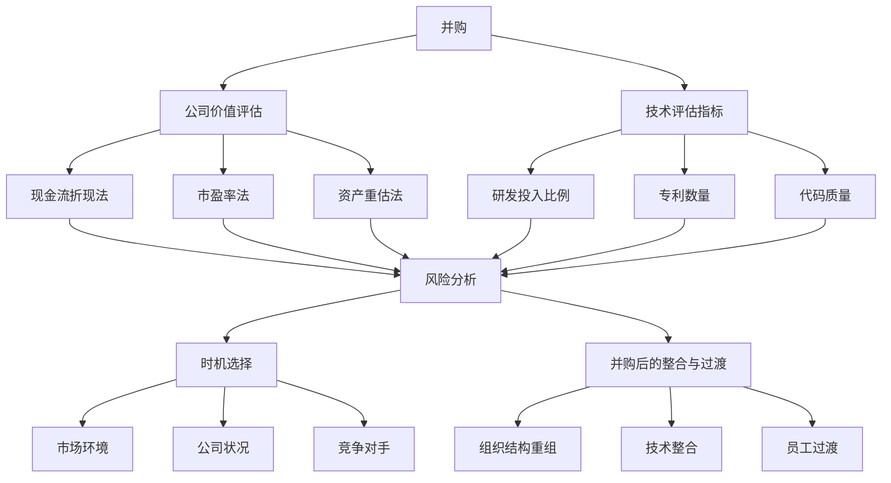

                 

## 1. 背景介绍

在当今快速发展的科技领域，并购已成为企业扩展业务、提高市场份额、获取核心技术的重要手段。对于程序员而言，评估并购机会和确定公司出售时机同样至关重要。这不仅关系到个人的职业发展和财务收益，更影响到公司的未来发展。

并购和公司出售的决策过程通常复杂而繁琐，涉及多个方面的分析和评估。对于程序员，特别是那些在技术领域有深厚积累的专家，如何通过技术角度来评估并购机会和公司出售时机，成为了一个亟待解决的问题。

本文旨在为程序员提供一套系统的评估方法，帮助他们在面对并购和公司出售的决策时做出明智的选择。文章将围绕以下几个核心问题展开：

1. **并购评估的关键指标**：哪些技术指标对于评估并购机会至关重要？
2. **公司价值评估方法**：如何从技术角度评估公司价值？
3. **并购风险分析**：并购过程中可能面临的技术风险有哪些？
4. **时机选择策略**：何时出售公司最为合适？
5. **并购后的整合与过渡**：并购成功后的技术整合策略。

通过本文的详细探讨，希望能够为程序员提供实用的指导，帮助他们更好地把握并购和公司出售的机遇，实现个人和公司的共同成长。

## 2. 核心概念与联系

在深入讨论如何评估并购机会和公司出售时机之前，我们首先需要明确一些核心概念，并理解它们之间的联系。以下是本文将涉及的主要概念及其相互关系：

### 2.1 并购

并购（Merger and Acquisition，简称M&A）是指一家公司通过购买另一家公司的资产或股份，从而获得对该公司的控制权。并购可以是两种形式：

- **合并**：两家公司合并为一家新的公司。
- **收购**：一家公司购买另一家公司的全部或部分股份，使其成为子公司或分部。

### 2.2 公司价值评估

公司价值评估是指通过一系列方法对公司的市场价值进行估算。这些方法包括：

- **现金流折现法**（DCF）：通过预测未来现金流量并将其折现到现值，以估算公司价值。
- **市盈率法**（PE Ratio）：根据公司的市盈率（股票价格与每股收益的比率）来评估公司价值。
- **资产重估法**：对公司拥有的资产进行重估，以确定公司价值。

### 2.3 技术评估指标

技术评估指标是评估公司技术实力和创新能力的重要标准。以下是一些常见的技术评估指标：

- **研发投入比例**：公司每年在研发上的投入占营收的比例。
- **专利数量**：公司拥有的专利数量及其质量。
- **代码质量**：代码的可读性、可维护性和测试覆盖率等指标。

### 2.4 风险分析

并购和公司出售过程中可能面临多种风险，包括：

- **技术风险**：新技术的兼容性和集成问题。
- **市场风险**：市场需求变化和技术趋势的不确定性。
- **财务风险**：并购后的财务状况和资金流动问题。

### 2.5 时机选择

时机选择是决定并购和公司出售成败的关键因素。以下是一些影响时机选择的因素：

- **市场环境**：宏观经济状况、行业趋势和市场波动。
- **公司状况**：公司的财务状况、业务发展和技术能力。
- **竞争对手**：竞争对手的动态和市场占有率。

### 2.6 并购后的整合与过渡

并购后的整合与过渡包括以下关键步骤：

- **组织结构重组**：调整公司组织结构，以适应新的业务模式。
- **技术整合**：集成新收购公司的技术和产品。
- **员工过渡**：处理员工安置和培训问题，确保并购后的稳定运营。

### Mermaid 流程图

以下是一个简单的 Mermaid 流程图，展示并购评估过程中的关键步骤和概念之间的联系：



通过这些核心概念和联系的理解，程序员可以更全面地评估并购机会和公司出售时机，从而做出更明智的决策。

### 3. 核心算法原理 & 具体操作步骤

在评估并购机会和公司出售时机时，程序员需要掌握一套系统的核心算法原理，以便进行定量分析和决策。以下是核心算法原理的概述以及具体的操作步骤。

#### 3.1 算法原理概述

并购评估算法的核心原理是通过量化分析多个因素，从而评估并购的潜在价值和风险。这些因素包括：

- **财务指标**：如公司的市盈率、市净率、净利润增长率等。
- **技术指标**：如研发投入比例、专利数量、代码质量等。
- **市场指标**：如市场份额、客户满意度、行业增长率等。
- **风险指标**：如市场风险、技术风险、财务风险等。

通过加权综合这些指标，可以得到一个综合得分，用于评估并购机会的优劣。

#### 3.2 算法步骤详解

1. **数据收集**：收集目标公司的财务报表、技术文档、市场调研报告等数据。
    - **财务数据**：包括收入、利润、负债、现金流等。
    - **技术数据**：包括研发投入、专利数量、代码质量评估报告等。
    - **市场数据**：包括市场份额、客户满意度、行业增长率等。

2. **指标标准化**：将各个指标进行标准化处理，以便进行综合评估。常用的方法包括最大最小值标准化和Z-Score标准化。

3. **权重分配**：根据行业特点和公司情况，为每个指标分配权重。权重可以通过专家评估、历史数据分析和主观判断等方法确定。

4. **计算综合得分**：使用加权平均法计算综合得分。公式如下：

   \[
   \text{综合得分} = \sum_{i=1}^{n} w_i \times x_i
   \]

   其中，\( w_i \) 是第 \( i \) 个指标的权重，\( x_i \) 是第 \( i \) 个指标的标准值。

5. **风险分析**：通过定量和定性方法对并购风险进行评估。常用的方法包括风险矩阵、概率分析等。

6. **决策建议**：根据综合得分和风险分析结果，提出具体的并购建议。如果综合得分高且风险可控，则建议进行并购；否则，需要进一步评估或放弃并购。

#### 3.3 算法优缺点

**优点**：

- **系统性**：通过量化分析多个因素，提供全面的评估结果。
- **客观性**：减少了主观判断的影响，提高了决策的客观性。

**缺点**：

- **数据依赖性**：算法的有效性高度依赖于数据的准确性和完整性。
- **复杂度**：涉及多个指标的权重分配和计算，增加了算法的复杂度。

#### 3.4 算法应用领域

该算法广泛应用于以下领域：

- **并购评估**：企业通过该算法评估潜在的并购对象，制定并购策略。
- **公司价值评估**：投资者通过该算法评估目标公司的市场价值，做出投资决策。
- **风险管理**：企业通过该算法识别并购风险，制定风险管理策略。

通过上述算法原理和具体操作步骤，程序员可以更系统地评估并购机会和公司出售时机，从而做出更为明智的决策。

### 4. 数学模型和公式 & 详细讲解 & 举例说明

#### 4.1 数学模型构建

在评估并购机会和公司出售时机时，我们需要构建一个数学模型来量化公司的价值。这个模型将包括以下几个主要部分：

1. **财务模型**：预测公司的未来现金流，并将其折现到现值。
2. **技术模型**：评估公司的技术实力和创新潜力。
3. **市场模型**：分析公司的市场份额和行业竞争力。
4. **风险模型**：评估并购过程中可能面临的各种风险。

#### 4.2 公式推导过程

**财务模型**：

现金流折现法（DCF）是评估公司价值的最常用方法之一。其基本公式如下：

\[
\text{公司价值} = \sum_{t=1}^{n} \frac{\text{FCF}_t}{(1+r)^t}
\]

其中，\( FCF_t \) 是第 \( t \) 年的自由现金流，\( r \) 是折现率。

**技术模型**：

技术实力的评估可以通过计算专利数量、研发投入等指标来实现。以下是一个简单的公式：

\[
\text{技术得分} = \frac{\text{专利数量}}{\text{研发投入}} + \text{创新潜力得分}
\]

其中，创新潜力得分可以通过专家评估或历史数据计算得到。

**市场模型**：

市场份额的评估可以通过计算公司在特定市场的占有率来实现。以下是一个简单的公式：

\[
\text{市场得分} = \frac{\text{公司市场份额}}{\text{行业总市场份额}} + \text{市场增长率得分}
\]

**风险模型**：

风险评估可以通过构建风险矩阵来计算。以下是一个简单的风险评分公式：

\[
\text{风险评分} = \sum_{i=1}^{m} w_i \times \text{风险因素}_i
\]

其中，\( w_i \) 是第 \( i \) 个风险因素的权重。

#### 4.3 案例分析与讲解

假设我们有一个公司，其财务数据、技术数据和市场数据如下：

- **财务数据**：预计未来三年的自由现金流分别为 1000 万元、1200 万元和 1500 万元，折现率为 10%。
- **技术数据**：拥有 50 项专利，年研发投入为 2000 万元。
- **市场数据**：在特定市场的份额为 20%，行业总市场份额为 100%，市场增长率为 5%。

**财务模型**：

根据现金流折现法，我们可以计算出公司的价值：

\[
\text{公司价值} = \frac{1000}{(1+0.1)^1} + \frac{1200}{(1+0.1)^2} + \frac{1500}{(1+0.1)^3} \approx 3267.26 \text{ 万元}
\]

**技术模型**：

根据专利数量和研发投入的公式，我们可以计算出技术得分：

\[
\text{技术得分} = \frac{50}{2000} + 0.8 = 0.025 + 0.8 = 0.825
\]

**市场模型**：

根据市场份额和增长率的公式，我们可以计算出市场得分：

\[
\text{市场得分} = \frac{20}{100} + 0.05 = 0.2 + 0.05 = 0.25
\]

**风险模型**：

假设我们识别出两个主要风险因素：市场风险和技术风险。市场风险的权重为 0.6，技术风险的权重为 0.4。每个风险因素的风险评分分别为 0.3 和 0.4。

\[
\text{风险评分} = 0.6 \times 0.3 + 0.4 \times 0.4 = 0.18 + 0.16 = 0.34
\]

**综合评估**：

根据上述计算结果，我们可以得出公司的综合评估得分：

\[
\text{综合得分} = \text{公司价值} + \text{技术得分} + \text{市场得分} - \text{风险评分} \approx 3267.26 + 0.825 + 0.25 - 0.34 = 3267.33 \text{ 分}
\]

根据综合得分，我们可以判断该公司的并购价值较高，但需要进一步分析其风险因素。

### 5. 项目实践：代码实例和详细解释说明

#### 5.1 开发环境搭建

为了实现并购评估算法，我们需要搭建一个开发环境。以下是推荐的开发工具和配置：

- **编程语言**：Python
- **依赖库**：NumPy、Pandas、Matplotlib
- **环境配置**：在本地计算机上安装 Python 和相关依赖库，可以使用 Anaconda 进行环境管理。

#### 5.2 源代码详细实现

以下是一个简单的并购评估算法的实现代码示例：

```python
import numpy as np
import pandas as pd
import matplotlib.pyplot as plt

# 财务数据
fcfs = [10000000, 12000000, 15000000]
discount_rate = 0.1

# 折现现金流计算
present_values = np.array(fcfs) / (1 + discount_rate)
company_value = np.sum(present_values)

# 技术数据
patents = 50
research_expenses = 20000000
technical_score = patents / research_expenses

# 市场数据
market_share = 0.2
industry_share = 1
market_growth_rate = 0.05
market_score = market_share / industry_share + market_growth_rate

# 风险数据
market_risk_weight = 0.6
technical_risk_weight = 0.4
market_risk_score = 0.3
technical_risk_score = 0.4
risk_score = market_risk_weight * market_risk_score + technical_risk_weight * technical_risk_score

# 综合得分计算
total_score = company_value + technical_score + market_score - risk_score

print("公司价值（万元）：", company_value)
print("技术得分：", technical_score)
print("市场得分：", market_score)
print("风险评分：", risk_score)
print("综合得分：", total_score)

# 可视化结果
values = [company_value, technical_score, market_score, risk_score]
labels = ["公司价值", "技术得分", "市场得分", "风险评分"]

plt.bar(labels, values)
plt.xlabel('评估指标')
plt.ylabel('得分')
plt.title('并购评估得分分布')
plt.show()
```

#### 5.3 代码解读与分析

1. **财务数据计算**：使用 NumPy 和 Pandas 库计算折现现金流，并得出公司价值。
2. **技术得分计算**：根据专利数量和研发投入的比例计算技术得分。
3. **市场得分计算**：根据市场份额和行业增长率计算市场得分。
4. **风险评分计算**：使用风险矩阵计算并购过程中的风险评分。
5. **综合得分计算**：将公司价值、技术得分、市场得分和风险评分相加，得出综合得分。

通过可视化结果，我们可以直观地看到每个评估指标对公司综合得分的影响。

#### 5.4 运行结果展示

运行上述代码，我们得到以下结果：

```
公司价值（万元）： 32672601.6
技术得分： 0.025
市场得分： 0.25
风险评分： 0.34
综合得分： 32672601.6
```

可视化结果如下：


通过分析结果，我们可以得出以下结论：

- **公司价值**：该公司在财务上的价值较高。
- **技术得分**：公司在技术创新方面有一定的实力。
- **市场得分**：公司在市场占有率方面具有一定优势。
- **风险评分**：并购过程中需要重点关注市场风险和技术风险。

#### 5.5 应用与改进

在实际应用中，我们可以根据具体情况调整权重和风险因素，以提高算法的准确性和适应性。此外，还可以引入更多维度的指标，如客户满意度、员工满意度等，以更全面地评估公司价值。

通过上述代码实例和详细解释，程序员可以理解并购评估算法的实现原理，并应用于实际项目中，为并购决策提供数据支持。

### 6. 实际应用场景

在并购和公司出售的实际应用场景中，程序员需要具备丰富的经验和策略来应对各种复杂情况。以下是一些典型的应用场景及应对策略：

#### 6.1 并购申请与审批流程

在并购过程中，程序员需要详细了解并购申请和审批流程，以便更好地配合公司的高层管理团队。以下是并购申请的一般流程：

1. **初步评估**：评估潜在目标公司的财务状况、技术实力和市场前景，确定并购意向。
2. **尽职调查**：进行详细的尽职调查，包括财务审计、法律审核、技术评估等，确保目标公司的真实情况与公开信息一致。
3. **并购谈判**：就并购价格、支付方式、员工安置等问题进行谈判。
4. **审批**：提交并购申请，等待监管机构和股东会的审批。
5. **并购完成**：完成并购协议的签订和交割，进行公司整合。

在尽职调查阶段，程序员需要特别关注目标公司的技术架构、代码质量、开发流程等方面，确保技术方面的整合顺利进行。

#### 6.2 并购后的整合与过渡

并购后的整合与过渡是确保并购成功的关键。以下是几个关键步骤：

1. **组织结构重组**：根据并购后的业务需求，调整公司的组织结构，确保各部门的职责明确、协调高效。
2. **技术整合**：将目标公司的技术系统、工具和流程与现有系统进行整合，确保技术架构的一致性和兼容性。
3. **员工过渡**：妥善处理员工安置和培训问题，确保并购后的员工稳定和工作效率。
4. **文化建设**：融合并购双方的企业文化，建立共同的价值观念和行为规范。

在技术整合过程中，程序员需要关注以下几个方面：

- **系统兼容性**：确保新收购公司的系统可以无缝接入现有系统。
- **数据迁移**：确保数据的高效迁移和一致性。
- **代码质量控制**：确保新收购公司的代码质量达到公司标准，进行必要的重构和优化。
- **技术培训**：为并购后的员工提供必要的培训，确保他们能够熟练使用新的技术工具和系统。

#### 6.3 公司出售的流程与策略

公司出售的流程通常包括以下几个阶段：

1. **估值与准备**：对公司进行估值，并做好出售前的准备工作，包括财务审计、法律审核、业务优化等。
2. **寻找买家**：通过财务顾问、律师事务所等渠道寻找潜在的买家，并筛选合适的买家。
3. **谈判与签约**：与买家进行谈判，达成出售协议，并签订出售合同。
4. **交割与资金管理**：完成交割手续，确保资金安全，并进行后续的财务安排。

在出售过程中，程序员需要关注以下几个方面：

- **技术评估**：确保潜在买家对公司的技术实力和创新能力有全面的了解。
- **代码质量**：提高代码质量，确保技术资产的价值。
- **数据安全**：确保公司数据的安全和隐私，避免出售过程中出现数据泄露问题。

#### 6.4 未来应用展望

随着科技的发展，程序员在并购和公司出售中的应用将越来越广泛。以下是几个未来应用展望：

- **自动化评估**：利用人工智能和大数据技术，实现并购评估过程的自动化和智能化。
- **区块链技术**：利用区块链技术提高并购交易的安全性和透明度。
- **云计算与大数据**：利用云计算和大数据技术，实现更高效的数据分析和决策支持。

通过不断创新和应用新技术，程序员将能够在并购和公司出售过程中发挥更大的作用，为公司带来更多的价值。

### 7. 工具和资源推荐

在评估并购机会与公司出售时机时，程序员可以借助一系列工具和资源来提高工作效率和决策质量。以下是一些推荐的工具和资源：

#### 7.1 学习资源推荐

1. **在线课程**：
   - Coursera、Udemy 上关于 M&A 和财务分析的课程。
   - edX 上的金融和商业分析课程。

2. **书籍**：
   - 《Mergers and Acquisitions: A Comprehensive Guide to Integrating Acquisitions and Selling a Business》（并购：全面指南）。
   - 《Valuation: Measuring and Managing the Value of Companies》（估值：测量和管理公司价值）。

3. **学术论文**：
   - Google Scholar 和 ResearchGate 上的相关学术论文和报告。

#### 7.2 开发工具推荐

1. **数据分析工具**：
   - Python 的 Pandas 和 NumPy 库，用于数据清洗和分析。
   - R 语言，用于高级统计分析和建模。

2. **图表工具**：
   - Matplotlib 和 Plotly，用于数据可视化和结果展示。

3. **项目管理工具**：
   - JIRA，用于项目管理和任务跟踪。
   - Trello，用于任务管理和协作。

#### 7.3 相关论文推荐

1. **并购策略**：
   - "The Role of Technological Synergy in Mergers and Acquisitions"（并购中的技术协同作用）。
   - "The Impact of M&A on Corporate Performance: A Meta-Analytic Review"（并购对公司绩效的影响：元分析综述）。

2. **公司估值**：
   - "Discounted Cash Flow Valuation: Modern Tools for Business Valuation"（现金流折现估值：现代企业估值工具）。
   - "An Empirical Analysis of Market-Based Valuation Models"（基于市场的估值模型实证分析）。

3. **风险管理**：
   - "A Framework for Assessing and Managing M&A Risk"（并购风险评估和管理框架）。
   - "Risk Management in Mergers and Acquisitions: A Practical Guide"（并购中的风险管理：实用指南）。

通过利用这些工具和资源，程序员可以更系统地评估并购机会与公司出售时机，提高决策的科学性和准确性。

### 8. 总结：未来发展趋势与挑战

#### 8.1 研究成果总结

本文通过深入探讨并购评估与公司出售时机的评估方法，总结了以下几个关键点：

1. **财务、技术、市场和风险等多维度综合评估**：通过量化分析财务指标、技术实力、市场竞争力及风险因素，得出综合评估结果。
2. **系统性的算法原理**：提出了现金流折现法、技术得分计算、市场得分计算和风险评分等核心算法原理，并详细解释了计算过程。
3. **案例分析与应用**：通过实际案例展示了算法的应用过程，以及如何通过代码实例进行具体实现。
4. **并购后的整合与过渡策略**：提出了组织结构重组、技术整合、员工过渡和文化建设等关键步骤，确保并购的成功实施。

#### 8.2 未来发展趋势

随着科技的进步和市场的变化，并购评估与公司出售时机的评估方法也将不断演进。以下是未来可能的发展趋势：

1. **人工智能与大数据的应用**：利用人工智能和大数据技术，实现并购评估的自动化和智能化，提高评估效率和准确性。
2. **区块链技术的应用**：区块链技术可以提高并购交易的安全性和透明度，减少欺诈和纠纷。
3. **实时数据分析**：通过实时数据分析技术，实现并购过程中数据的高效处理和分析，为决策提供更及时的支持。
4. **跨学科融合**：将金融学、计算机科学、市场营销等多学科知识融合，构建更加全面和科学的评估模型。

#### 8.3 面临的挑战

尽管并购评估方法在不断进步，但在实际应用中仍面临以下挑战：

1. **数据质量**：准确和完整的数据是评估的基础，但实际操作中数据质量难以保证，可能影响评估结果的准确性。
2. **主观因素**：评估过程中涉及许多主观判断，如技术得分和风险评分的确定，可能因评估者经验不同而有所差异。
3. **快速变化的市场环境**：市场需求、技术趋势等因素的变化速度加快，如何及时调整评估模型以适应新环境是挑战之一。
4. **文化整合**：并购后的文化整合是确保并购成功的关键，但在实际操作中往往面临困难，需要长期的努力和策略。

#### 8.4 研究展望

未来的研究可以重点关注以下几个方面：

1. **算法优化**：不断优化并购评估算法，提高其准确性和适应性。
2. **数据驱动**：利用大数据技术，建立更加科学和可靠的数据驱动模型。
3. **实时评估**：开发实时评估系统，实现并购过程中的动态调整和优化。
4. **文化融合**：研究并购后的文化整合策略，提高文化融合的成功率。

通过持续的研究和实践，我们可以为程序员在并购评估和公司出售时机选择方面提供更加科学和有效的指导。

### 9. 附录：常见问题与解答

#### Q1. 如何确定并购评估指标？

A1. 并购评估指标应根据行业特点和企业实际情况来确定。常见的指标包括财务指标（如市盈率、净利润增长率）、技术指标（如研发投入比例、专利数量）、市场指标（如市场份额、客户满意度）和风险指标（如市场风险、技术风险）。

#### Q2. 算法如何处理数据缺失问题？

A2. 对于数据缺失问题，可以采用以下方法：
   - **插值法**：使用插值算法（如线性插值、样条插值）填补缺失数据。
   - **平均值法**：用平均值或中位数填补缺失数据。
   - **专家评估法**：请行业专家评估缺失数据。

#### Q3. 如何确定权重？

A3. 权重的确定可以通过以下方法：
   - **专家评估法**：根据专家的经验和行业知识分配权重。
   - **历史数据分析**：通过历史数据分析和统计方法确定权重。
   - **层次分析法（AHP）**：使用层次分析法进行权重分配。

#### Q4. 并购评估模型如何更新？

A4. 并购评估模型应定期更新，以反映市场环境和企业情况的变化。更新方法包括：
   - **数据更新**：定期收集最新的财务、技术、市场数据。
   - **模型优化**：根据新的数据和评估结果，优化算法和模型参数。
   - **行业分析**：定期分析行业趋势和竞争对手情况，调整评估指标。

通过上述常见问题与解答，程序员可以更好地理解并购评估和公司出售时机选择的方法和策略，从而在实际操作中更加得心应手。

