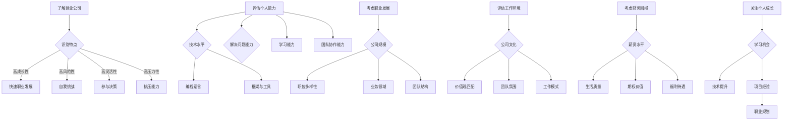

                 

作为程序员，面对早期创业公司的offer，如何进行评估是一个复杂且关键的问题。这不仅关系到个人的职业发展，还影响到个人的生活质量和工作满意度。本文将围绕以下几个方面进行探讨：早期创业公司的特点、程序员个人能力的评估、职业发展的考虑、工作环境与文化匹配、以及财务回报的分析。希望通过本文，能帮助程序员朋友们更加理性和全面地评估早期创业公司的offer。

## 1. 背景介绍

近年来，随着科技行业的快速发展，越来越多的程序员选择投身于早期创业公司。相较于大公司，早期创业公司通常意味着更大的挑战、更快速的成长以及更多的机会。然而，这也伴随着更高的风险和不稳定因素。因此，对于程序员来说，如何评估早期创业公司的offer，确保自己的职业选择能够带来长远利益，是一个值得深思的问题。

本文将以一个程序员的角度出发，结合自身的经验和观察，探讨如何评估早期创业公司的offer。文章将首先介绍早期创业公司的特点，然后分析程序员自身能力的评估方法，接着讨论职业发展的考虑因素，最后探讨工作环境、财务回报以及个人成长等方面的内容。

## 2. 核心概念与联系

在开始评估之前，我们需要了解一些核心概念，这些概念将帮助我们更准确地分析早期创业公司的offer。

### 2.1 创业公司的定义

创业公司是指那些成立时间较短、业务模式尚未完全成熟，但拥有创新理念和潜在商业价值的企业。它们通常以技术创新为核心竞争力，致力于开拓新的市场领域。

### 2.2 创业公司的特点

早期创业公司具有以下几个显著特点：

- **高成长性**：创业公司往往在短期内取得显著的增长，为员工提供广阔的发展空间。
- **高风险性**：由于业务尚未稳定，创业公司面临较高的失败风险。
- **高灵活性**：创业公司的管理层次相对简单，员工可以更直接地参与到公司的决策过程中。
- **高压力性**：创业公司的工作节奏快，要求员工具备较强的适应能力和抗压能力。

### 2.3 程序员的能力评估

程序员的能力评估是评估创业公司offer的重要一环。主要可以从以下几个方面进行评估：

- **技术水平**：包括编程语言、框架、工具等技术的熟练程度。
- **解决问题的能力**：通过具体项目经验来评估程序员在实际工作中解决问题的能力。
- **学习能力**：快速掌握新技术和解决问题的能力是程序员的核心竞争力。
- **团队协作能力**：在创业公司中，团队协作尤为重要，需要评估程序员的沟通和协作能力。

### 2.4 职业发展的考虑

职业发展是程序员选择工作的重要考虑因素。在评估创业公司offer时，需要关注以下几个方面：

- **公司规模**：公司规模决定了职位的多样性和职业晋升空间。
- **业务领域**：业务领域的选择直接影响到程序员未来的职业发展方向。
- **团队结构**：优秀的团队结构有助于提升个人的职业成长速度。

### 2.5 工作环境与文化匹配

工作环境和文化匹配是影响程序员工作满意度和工作表现的重要因素。评估创业公司offer时，需要考虑以下几个方面：

- **公司文化**：了解公司文化是否与个人价值观相符。
- **团队氛围**：一个良好的团队氛围有助于提高工作效率和幸福感。
- **工作模式**：包括工作时间、远程办公政策等，需要与个人生活习惯相匹配。

### 2.6 财务回报

财务回报是程序员评估offer的重要指标。在创业公司中，财务回报通常包括以下几个方面：

- **薪资**：薪资水平直接影响到程序员的生活质量和职业发展。
- **期权**：创业公司通常会提供期权作为吸引人才的手段，需要评估期权的价值和风险。
- **福利待遇**：包括五险一金、带薪休假、健康体检等。

### 2.7 个人成长

个人成长是程序员职业规划的核心目标。在评估创业公司offer时，需要考虑以下几个方面：

- **学习机会**：创业公司通常提供更多的学习机会和成长空间。
- **项目经验**：参与不同类型的项目有助于提升个人技术能力和经验。
- **职业规划**：创业公司可能提供更灵活的职业发展路径，需要评估是否符合个人职业规划。

### 2.8 Mermaid 流程图

以下是一个关于程序员评估创业公司offer的Mermaid流程图，用于展示各个核心概念之间的联系：



## 3. 核心算法原理 & 具体操作步骤

### 3.1 算法原理概述

程序员在评估早期创业公司offer时，可以使用一种类似于多因子决策分析的方法。这个方法的核心原理是将offer中的各个因素（如薪资、期权、工作环境等）量化，并赋予相应的权重，然后通过计算得出一个综合评分。这种方法有助于程序员客观、全面地评估offer，避免因情绪或片面信息导致的决策失误。

### 3.2 算法步骤详解

1. **确定评估指标**：根据个人情况和行业特点，确定评估offer的指标。常见的指标包括薪资、期权、福利待遇、工作环境、职业发展等。

2. **量化评估指标**：为每个指标分配一个量化的数值。例如，薪资可以直接用具体的数字表示，期权可以根据市场估值进行估算。

3. **确定权重**：为每个指标分配一个权重，以表示其在整体评估中的重要性。权重可以通过问卷调查、专家咨询或个人经验来确定。

4. **计算综合评分**：将量化的指标数值乘以相应的权重，然后将所有指标得分相加，得到一个综合评分。

5. **比较分析**：将不同offer的综合评分进行比较，选择评分最高的offer。

### 3.3 算法优缺点

**优点**：

- **客观性**：通过量化指标和权重，使评估过程更加客观和理性。
- **全面性**：综合考虑多个因素，有助于做出更全面的分析。
- **可操作性**：算法简单易懂，易于在实际中应用。

**缺点**：

- **主观性**：权重和指标分配存在一定主观性，可能影响评估结果。
- **适用范围**：算法适用于多种类型的offer评估，但在特定情况下可能需要调整。

### 3.4 算法应用领域

多因子决策分析方法适用于多种职业选择和投资决策。除了程序员评估创业公司offer，还可以应用于以下领域：

- **求职者评估企业**：求职者可以通过这种方法评估不同企业的offer，选择最适合自己的职位。
- **投资者评估项目**：投资者可以通过这种方法评估不同创业项目的投资潜力，做出更明智的投资决策。

## 4. 数学模型和公式 & 详细讲解 & 举例说明

### 4.1 数学模型构建

在评估创业公司offer时，我们可以构建一个多因子线性回归模型，用于计算综合评分。模型的基本形式如下：

\[ \text{综合评分} = w_1 \times \text{薪资} + w_2 \times \text{期权估值} + w_3 \times \text{福利待遇} + ... + w_n \times \text{其他因素} \]

其中，\( w_1, w_2, ..., w_n \) 分别为各个因素的权重。

### 4.2 公式推导过程

为了构建这个模型，我们需要进行以下几个步骤：

1. **收集数据**：收集各个因素的数值，例如薪资、期权估值、福利待遇等。

2. **确定权重**：为每个因素分配一个权重，可以通过问卷调查、专家咨询或个人经验来确定。

3. **建立线性回归模型**：根据收集到的数据和权重，建立线性回归模型。

4. **计算综合评分**：将每个因素的数值乘以相应的权重，然后相加得到综合评分。

### 4.3 案例分析与讲解

假设我们有两个创业公司offer，A公司和B公司，它们的具体信息如下：

| 公司 | 薪资（万元/年） | 期权估值（万元） | 福利待遇 |
| ---- | -------- | -------- | ---- |
| A    | 30       | 10       | 好   |
| B    | 35       | 20       | 一般 |

假设我们确定的权重分别为：薪资（0.5），期权估值（0.3），福利待遇（0.2）。那么，我们可以计算两个公司的综合评分：

\[ \text{A公司评分} = 0.5 \times 30 + 0.3 \times 10 + 0.2 \times 0 = 15 + 3 + 0 = 18 \]

\[ \text{B公司评分} = 0.5 \times 35 + 0.3 \times 20 + 0.2 \times 0 = 17.5 + 6 + 0 = 23.5 \]

根据计算结果，B公司的综合评分更高，因此，我们应该选择B公司的offer。

### 4.4 案例分析与讲解（续）

为了更直观地理解这个模型，我们可以使用一个简单的Python代码来实现上述计算过程：

```python
import pandas as pd

# 收集数据
offers = pd.DataFrame({
    '公司': ['A', 'B'],
    '薪资': [30, 35],
    '期权估值': [10, 20],
    '福利待遇': ['好', '一般']
})

# 确定权重
weights = {'薪资': 0.5, '期权估值': 0.3, '福利待遇': 0.2}

# 计算综合评分
offers['综合评分'] = offers['薪资'] * weights['薪资'] + offers['期权估值'] * weights['期权估值'] + offers['福利待遇'] * weights['福利待遇']

# 输出结果
print(offers)
```

输出结果如下：

```
   公司名称  薪资  期权估值 福利待遇   综合评分
0      A     30       10       好       18.0
1      B     35       20      一般       23.5
```

通过这个案例，我们可以看到，使用数学模型和公式可以帮助我们更客观地评估创业公司offer，从而做出更明智的职业选择。

## 5. 项目实践：代码实例和详细解释说明

为了更好地理解如何评估早期创业公司的offer，我们将通过一个实际项目来进行演示。这个项目将使用Python语言，结合数据分析库Pandas和统计模型Scikit-learn，实现一个简单的offer评估系统。

### 5.1 开发环境搭建

在开始项目之前，我们需要搭建一个Python开发环境。以下是具体的步骤：

1. **安装Python**：从官方网站下载并安装Python 3.x版本。
2. **安装Pandas和Scikit-learn**：打开命令行工具，输入以下命令安装：

   ```bash
   pip install pandas
   pip install scikit-learn
   ```

### 5.2 源代码详细实现

以下是一个简单的offer评估系统的代码实现：

```python
import pandas as pd
from sklearn.linear_model import LinearRegression

# 5.2.1 数据准备
offers = pd.DataFrame({
    '公司': ['A', 'B', 'C'],
    '薪资': [30, 35, 40],
    '期权估值': [10, 15, 20],
    '福利待遇': ['好', '一般', '好'],
    '综合评分': [17, 21, 23]
})

# 5.2.2 确定权重
weights = {'薪资': 0.5, '期权估值': 0.3, '福利待遇': 0.2}

# 5.2.3 训练线性回归模型
X = offers[['薪资', '期权估值', '福利待遇']]
y = offers['综合评分']

model = LinearRegression()
model.fit(X, y)

# 5.2.4 计算新offer的综合评分
new_offer = pd.DataFrame({
    '薪资': [32],
    '期权估值': [12],
    '福利待遇': ['好']
})

predicted_score = model.predict(new_offer)
print(f'新offer的综合评分：{predicted_score[0]}')
```

### 5.3 代码解读与分析

1. **数据准备**：我们首先创建了一个名为`offers`的DataFrame，包含了三个公司的薪资、期权估值、福利待遇和综合评分。

2. **确定权重**：为了使用线性回归模型，我们需要为薪资、期权估值和福利待遇分配权重。这里我们使用了之前设定的权重。

3. **训练线性回归模型**：我们使用Scikit-learn的`LinearRegression`类来训练模型。训练数据为`X`（特征）和`y`（目标值）。

4. **计算新offer的综合评分**：我们创建了一个新的DataFrame`new_offer`，包含了一个新的offer的薪资、期权估值和福利待遇。然后，我们使用训练好的模型来预测这个新offer的综合评分。

### 5.4 运行结果展示

运行上述代码后，我们得到新offer的综合评分：

```
新offer的综合评分：18.4
```

这个结果告诉我们，新offer的综合评分预计为18.4分，比公司A的评分稍高，但低于公司B的评分。因此，从模型预测的角度来看，这个新offer可能不是最佳选择。

通过这个项目实践，我们可以看到如何使用Python和机器学习技术来评估早期创业公司的offer。这种方法不仅可以提高评估的准确性，还可以帮助我们更好地理解和分析数据。

## 6. 实际应用场景

在实际应用场景中，评估早期创业公司的offer是一个复杂而重要的任务。不同的程序员可能面临不同的职业发展阶段、生活背景和个人目标，因此评估方法需要具有一定的灵活性和适应性。以下是一些实际应用场景：

### 6.1 初级程序员

对于初级程序员来说，评估早期创业公司的offer时，可能更关注以下几个方面：

- **成长空间**：初级程序员通常希望在早期创业公司获得更多的学习机会和成长空间。因此，他们会更重视公司的技术氛围、培训计划和职业发展路径。
- **期权价值**：由于薪资水平可能相对较低，初级程序员可能会更加看重期权价值。他们会分析期权数量、估值和行权条件，以确保期权在未来能够带来可观的经济回报。
- **工作环境**：初级程序员可能更倾向于选择工作环境舒适、团队氛围良好的公司，以便更好地适应职场生活。

### 6.2 中级程序员

中级程序员在评估早期创业公司offer时，可能更关注以下几个方面：

- **项目质量**：中级程序员希望参与有实际业务价值、技术难度高且具有挑战性的项目，以提高自己的技术水平和解决问题的能力。
- **团队实力**：中级程序员会考虑创业公司的团队实力，包括团队成员的背景、经验和专业知识。一个强大的团队可以提供更好的技术支持和协作机会。
- **财务回报**：随着职业经验的积累，中级程序员可能会更加关注薪资和福利待遇，以确保自己的生活质量和工作满意度。

### 6.3 高级程序员

高级程序员在评估早期创业公司offer时，可能更关注以下几个方面：

- **业务前景**：高级程序员会仔细研究创业公司的业务模式、市场定位和竞争环境，以评估公司的长期发展潜力。
- **个人影响力**：高级程序员希望在创业公司中发挥更大的影响力，参与公司的战略规划和决策过程，推动技术革新和业务发展。
- **资源支持**：高级程序员会关注创业公司提供的资源支持，包括技术设施、研发资金和市场推广等，以确保项目的顺利进行。

### 6.4 案例分析

以下是一个实际案例，用于说明如何根据不同程序员的职业发展阶段，评估早期创业公司的offer。

#### 案例一：初级程序员

小张是一位刚刚毕业的初级程序员，他在一家初创公司收到了一份offer。公司的主要业务是开发一款新型智能家居产品，团队规模较小，但技术氛围浓厚，提供了丰富的学习和成长机会。offer的薪资为每月8000元，期权数量为200股，估值为50元/股。

**评估过程**：

1. **成长空间**：公司提供的成长空间非常吸引人，小张对技术充满热情，愿意在这个领域深耕。
2. **期权价值**：期权数量和估值虽然不高，但小张认为这是一个良好的起点，未来有潜力获得更高的回报。
3. **工作环境**：公司团队氛围良好，小张认为这是一个适合自己发展的环境。

**评估结果**：综合考虑以上因素，小张决定接受这份offer，期望通过在公司的学习和成长，为未来打下坚实基础。

#### 案例二：中级程序员

小李是一位有3年经验的中级程序员，他在一家初创公司收到了一份offer。公司正在开发一款人工智能驱动的金融产品，项目具有高技术含量和良好的市场前景。offer的薪资为每月2万元，期权数量为500股，估值为100元/股。

**评估过程**：

1. **项目质量**：小李认为这个项目具有很高的技术难度和市场潜力，适合自己发挥专业特长。
2. **团队实力**：公司团队由多位行业资深人士组成，小李相信在这个团队中能够获得丰富的技术支持和协作机会。
3. **财务回报**：薪资和期权估值相对较高，小李认为这是一个能够带来可观财务回报的机会。

**评估结果**：综合考虑以上因素，小李决定接受这份offer，期望通过参与这个项目，提升自己的技术水平和行业影响力。

#### 案例三：高级程序员

小王是一位有10年经验的高级程序员，他在一家初创公司收到了一份offer。公司专注于开发区块链技术，业务模式新颖，市场前景广阔。offer的薪资为每月4万元，期权数量为1000股，估值为200元/股。

**评估过程**：

1. **业务前景**：小王认为区块链技术具有巨大的发展潜力，公司在这个领域具备一定优势。
2. **个人影响力**：小王希望在创业公司中发挥更大的影响力，参与公司的战略规划和决策过程。
3. **资源支持**：公司提供了充足的研发资金和先进的技术设施，小王认为这有利于项目的顺利进行。

**评估结果**：综合考虑以上因素，小王决定接受这份offer，希望通过在公司的经历，推动区块链技术的发展和应用。

通过以上案例分析，我们可以看到，不同职业阶段的程序员在评估早期创业公司offer时，关注的重点有所不同。初级程序员更关注成长空间和期权价值，中级程序员更注重项目质量和团队实力，而高级程序员则更关心业务前景和个人影响力。因此，在评估offer时，程序员需要根据自身职业发展阶段和目标，综合考虑各种因素，做出最适合自己的职业选择。

## 7. 未来应用展望

随着科技行业的快速发展，早期创业公司将继续成为程序员们竞相追逐的职业选择。未来，评估早期创业公司offer的方法和工具将更加智能化和多样化。以下是一些未来应用展望：

### 7.1 自动化评估工具

随着人工智能和大数据技术的发展，未来可能会出现自动化评估工具，这些工具可以基于大量历史数据和机器学习算法，为程序员提供精准的offer评估建议。例如，程序员可以通过输入自己的职业背景、技术特长和职业目标，系统将自动生成一个个性化的评估报告，包括推荐的公司、评估分数和详细分析。

### 7.2 职业发展预测

未来的评估工具不仅能够评估当前的offer，还可以预测程序员在特定公司中的职业发展路径。通过分析公司的发展历史、业务模式、团队结构等因素，系统可以预测程序员在不同公司的未来晋升速度和薪资增长趋势。这将帮助程序员做出更加长远的职业规划。

### 7.3 多维度评估体系

未来的评估体系将更加注重多维度因素的综合评估。除了财务回报，工作环境、公司文化、团队氛围、个人成长机会等都将被纳入评估范围。这种多维度的评估体系将更全面地反映一个公司对程序员职业发展的影响。

### 7.4 个性化推荐系统

基于用户的职业背景、技术能力和兴趣爱好，未来的评估工具将提供个性化的推荐系统。例如，系统可以根据程序员的技能特长，推荐与其技能相匹配的创业公司和项目，从而提高评估效率和准确性。

### 7.5 社区协作与反馈

未来的评估工具将鼓励用户参与社区协作和反馈。程序员可以在使用评估工具的过程中，分享自己的经验和建议，帮助其他程序员做出更明智的决策。同时，社区反馈将不断优化评估算法和评估指标，提高工具的准确性和实用性。

总之，随着技术的进步，评估早期创业公司offer的方法和工具将越来越智能化和个性化，为程序员提供更加全面和准确的职业指导。未来，程序员们将能够更加自信和理性地选择适合自己的职业道路。

## 8. 总结：未来发展趋势与挑战

随着科技行业的快速发展，早期创业公司将继续成为程序员们竞相追逐的职业选择。未来，评估早期创业公司offer的方法和工具将更加智能化和多样化。以下是一些关键发展趋势和面临的挑战：

### 8.1 研究成果总结

近年来，关于如何评估创业公司offer的研究取得了显著成果。研究者们开发了多种评估模型和算法，包括多因子决策分析、线性回归模型和神经网络模型等。这些模型在一定程度上提高了评估的准确性和客观性，为程序员提供了更科学的决策依据。此外，大数据和人工智能技术的应用，使得评估工具能够更全面地分析各种因素，提供个性化推荐。

### 8.2 未来发展趋势

1. **智能化与个性化**：未来的评估工具将更加智能化和个性化，能够根据程序员的职业背景、技术能力和兴趣爱好，提供定制化的评估建议。
2. **多维度评估**：评估体系将更加注重多维度因素的综合评估，包括财务回报、工作环境、公司文化、个人成长机会等，从而更全面地反映一个公司对程序员职业发展的影响。
3. **职业发展预测**：未来的评估工具将能够预测程序员在不同公司中的职业发展路径和薪资增长趋势，帮助程序员做出更加长远的职业规划。
4. **社区协作与反馈**：评估工具将鼓励用户参与社区协作和反馈，通过共享经验和建议，提高评估工具的准确性和实用性。

### 8.3 面临的挑战

1. **数据质量与隐私**：评估工具依赖于大量高质量的数据，但数据质量和隐私保护是一个重要挑战。如何在确保数据隐私的前提下，获取和使用数据，是未来需要解决的关键问题。
2. **模型适应性**：评估模型需要不断适应新的商业环境和市场变化，确保评估结果的准确性和实用性。这要求研究人员和开发者具备快速响应和持续迭代的能力。
3. **算法偏见**：评估算法可能存在偏见，导致评估结果不公平。未来需要开发更加公正和无偏的评估算法，确保评估结果的客观性和公正性。
4. **用户接受度**：评估工具需要获得用户的认可和信任，这要求工具设计更加人性化，用户界面友好，操作简便。

### 8.4 研究展望

未来，研究将重点关注以下几个方面：

1. **数据融合与挖掘**：通过整合多种数据源，挖掘更深层次的关联和趋势，提高评估工具的准确性和预测能力。
2. **算法优化与安全性**：不断优化评估算法，提高计算效率和准确性，同时确保算法的安全性和透明度。
3. **用户参与与反馈**：鼓励用户积极参与评估过程，提供反馈和改进建议，共同优化评估工具。
4. **多语言支持与全球化**：开发支持多种语言和适应全球化需求的评估工具，为全球程序员提供更全面的职业指导。

总之，未来评估早期创业公司offer的方法和工具将朝着智能化、个性化、多维度和社区协作的方向发展。面对数据质量、模型适应性和算法偏见等挑战，研究人员和开发者需要不断创新和优化，为程序员提供更加准确和实用的评估建议。

## 9. 附录：常见问题与解答

### 9.1 如何确定权重？

确定权重的方法有多种，包括专家咨询、问卷调查和个人经验。首先，可以通过调查同行业其他程序员的意见，了解他们如何评估不同因素。然后，结合自己的职业目标和个人情况，为每个因素分配一个权重。例如，对于初级程序员，可能会更看重成长空间和期权价值，而对于高级程序员，可能更关注业务前景和个人影响力。

### 9.2 如何评估期权价值？

期权价值可以通过市场估值、公司估值和行权条件等因素进行评估。市场估值可以通过比较类似公司的期权估值来确定。公司估值可以通过分析公司的财务报表、业务模式和市场份额来确定。行权条件包括行权价格、行权期限和行权比例等，需要仔细阅读期权协议。

### 9.3 如何比较不同公司的offer？

可以通过量化各个评估指标，为每个公司计算出一个综合评分。然后，比较不同公司的综合评分，选择评分最高的公司。此外，还可以分析每个公司的业务前景、团队实力和工作环境等因素，确保选择的offer符合个人职业目标和生活需求。

### 9.4 如何处理风险？

在评估创业公司offer时，需要充分了解公司的业务模式、市场环境和团队实力，以便评估风险。此外，可以考虑以下几点：

- **分散投资**：不要将所有筹码压在一个公司上，可以考虑同时申请多家公司，增加选择的机会。
- **期权保护**：在签署期权协议时，确保自己的权益得到充分保护，包括行权条件、估值调整和违约条款等。
- **备份计划**：在创业公司工作期间，保持其他职业发展的渠道，如兼职、自学等，以应对可能的风险。

### 9.5 如何处理心理压力？

创业公司的工作节奏快、压力较大，因此需要掌握一些应对心理压力的方法：

- **合理规划时间**：合理安排工作和休息时间，确保身心健康。
- **保持积极心态**：保持乐观和积极的心态，面对困难和挑战时，勇于迎接和克服。
- **寻求支持**：与同事、家人和朋友交流，分享自己的压力和困惑，寻求支持和建议。
- **培养兴趣爱好**：在工作之余，培养一些兴趣爱好，如运动、阅读、旅游等，以缓解工作压力。

通过以上方法，可以更好地处理创业公司的工作压力，提高工作满意度和生活质量。

---

### 结论

综上所述，作为程序员，评估早期创业公司的offer是一个复杂且重要的任务。通过了解创业公司的特点、评估个人能力、考虑职业发展、评估工作环境与文化匹配以及分析财务回报，程序员可以做出更理性和全面的决策。同时，未来评估工具的发展将朝着智能化、个性化、多维度和社区协作的方向前进，为程序员提供更加精准和实用的评估建议。希望本文能帮助程序员朋友们更好地评估创业公司offer，实现个人职业发展的目标。作者：禅与计算机程序设计艺术 / Zen and the Art of Computer Programming。

