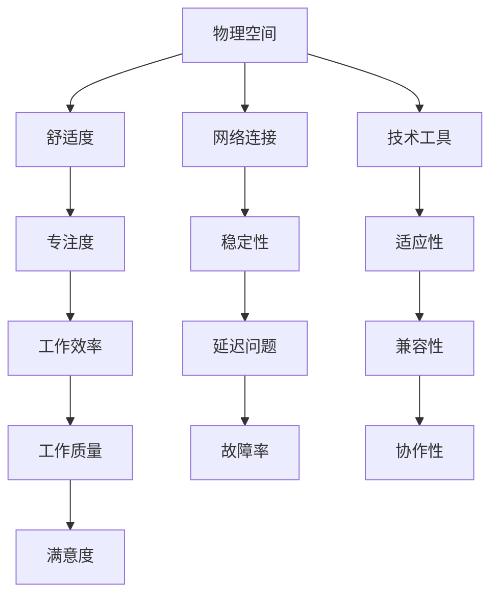
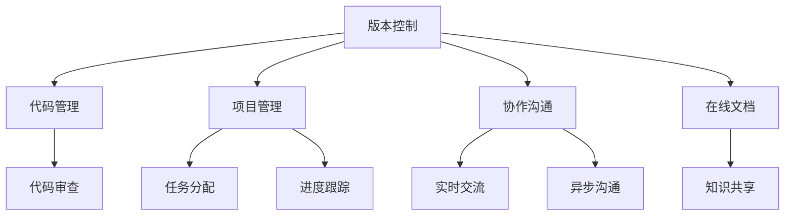
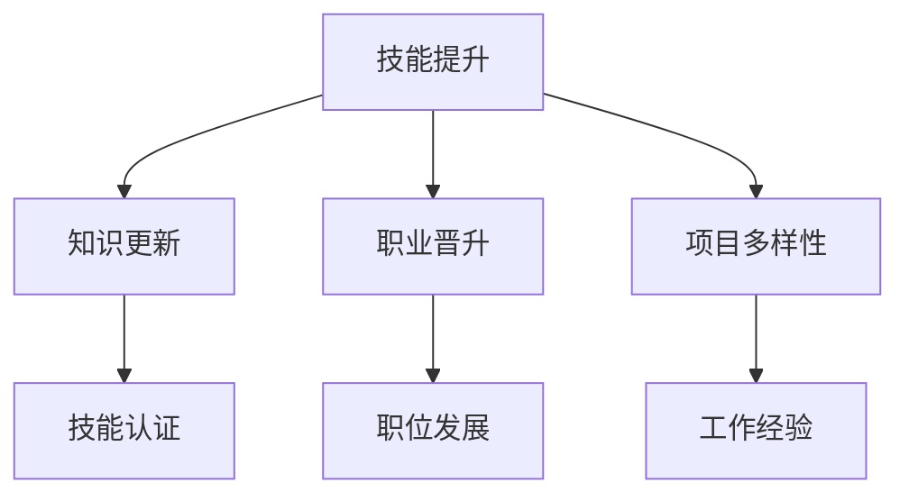
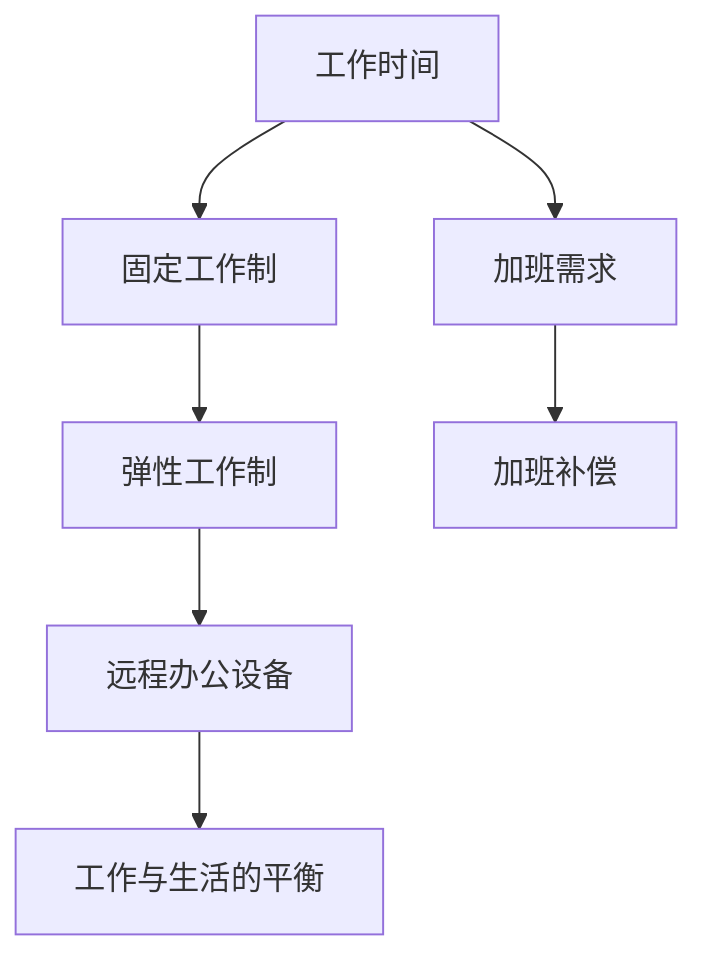

                 

在当今这个数字化时代，远程工作已经成为越来越多程序员的职业选择。这种工作模式不仅提供了灵活性，还允许程序员从全球范围内寻找工作机会。然而，如何评估远程工作机会，以确保它符合个人的职业目标和工作需求，是一个需要深思熟虑的问题。本文将探讨程序员在评估远程工作机会时应该考虑的几个关键因素。

## 关键词
- 远程工作
- 程序员
- 工作评估
- 职业发展
- 工作环境
- 工具与技术

## 摘要
本文旨在为程序员提供评估远程工作机会的指南。通过对工作环境、工具与技术、职业发展等多个方面的深入分析，帮助程序员做出明智的选择，以实现个人和职业的双重成功。

## 1. 背景介绍

随着互联网技术的飞速发展，远程工作已经从一种新兴的工作模式逐渐成为一种主流。对于程序员来说，远程工作提供了诸多优势，包括灵活的工作时间、更广阔的职业发展空间和减少通勤时间等。然而，远程工作也带来了一些挑战，如孤独感、沟通障碍和时间管理问题。因此，程序员在评估远程工作机会时需要全面考虑这些因素，以确保远程工作能够为他们带来真正的价值。

### 1.1 远程工作的兴起

远程工作的兴起可以追溯到互联网的普及。在过去的几十年里，信息技术的发展使得远程工作成为可能。通过互联网，程序员可以轻松地与团队成员进行沟通和协作，不受地理位置的限制。此外，云计算和虚拟化技术的应用也进一步促进了远程工作的普及。

### 1.2 程序员的职业特点

程序员是一类高度依赖于技术和知识的职业。他们通常需要具备较强的自学能力和解决问题的能力。此外，程序员的工作往往涉及复杂的代码和算法，这使得远程工作成为一种合理的选择。远程工作不仅可以提高程序员的工作效率，还可以为他们提供更多的学习和成长机会。

### 1.3 远程工作的挑战

尽管远程工作有许多优势，但程序员在评估远程工作机会时也需要注意到其中的挑战。首先，远程工作可能会带来孤独感。由于缺乏面对面的交流和互动，程序员可能会感到孤立和缺乏社交支持。其次，远程工作可能会影响沟通效率。虽然互联网提供了多种沟通工具，但它们无法完全取代面对面的交流。此外，时间管理也是远程工作的一大挑战。在没有明确的工作时间和地点的情况下，程序员需要自我管理，以避免工作效率低下。

## 2. 核心概念与联系

在评估远程工作机会时，程序员需要考虑多个核心概念，这些概念相互联系，共同决定了远程工作的成功与否。

### 2.1 工作环境

工作环境是评估远程工作机会的首要因素。一个良好的工作环境应该包括舒适的物理空间、良好的网络连接和必要的技术工具。以下是一个用Mermaid绘制的流程图，展示了评估工作环境的关键节点：



### 2.2 工具与技术

远程工作离不开合适的工具和技术。这些工具包括版本控制、项目管理、协作沟通和在线文档等。以下是一个Mermaid流程图，展示了这些工具和技术之间的关系：



### 2.3 职业发展

职业发展是程序员长期关注的焦点。远程工作应该为程序员提供持续学习和成长的机会。以下是一个Mermaid流程图，展示了评估职业发展的关键节点：



### 2.4 工作时间与灵活性

工作时间和灵活性是远程工作的一大特点。程序员需要评估远程工作是否能够满足他们的时间需求，并确保工作与生活之间的平衡。以下是一个Mermaid流程图，展示了评估工作时间和灵活性的关键节点：



## 3. 核心算法原理 & 具体操作步骤

在评估远程工作机会时，程序员可以采用一系列核心算法原理来帮助决策。以下将介绍一种简单的评估算法，以及具体的操作步骤。

### 3.1 算法原理概述

该算法基于加权评分法，通过给定的评价标准对远程工作机会进行量化评估。评分越高，表示该工作机会越适合程序员。

### 3.2 算法步骤详解

1. **定义评价标准**：根据个人需求和职业目标，确定评价标准，如工作环境、工具与技术、职业发展、工作时间与灵活性等。
2. **分配权重**：为每个评价标准分配权重，以反映其重要性。权重总和应为100%。
3. **评分标准量化**：为每个评价标准设定具体的评分范围，如1-10分。
4. **评分**：根据实际情况，为每个评价标准评分。
5. **计算总分**：将各评价标准的评分乘以其权重，然后求和得到总分。
6. **评估决策**：根据总分评估远程工作机会的优劣，做出是否接受或拒绝的决定。

### 3.3 算法优缺点

**优点**：
- 系统化：采用算法可以确保评估过程的客观性和系统性。
- 可量化：将抽象的评价标准转化为具体的分数，便于比较和决策。

**缺点**：
- 主观性：权重和评分的设定依赖于个人的主观判断，可能存在偏差。
- 不完善：算法无法完全考虑所有潜在的评估因素，可能导致遗漏。

### 3.4 算法应用领域

该算法适用于所有需要评估远程工作机会的程序员，尤其适用于那些拥有明确职业目标和需求的人。

## 4. 数学模型和公式 & 详细讲解 & 举例说明

为了更好地评估远程工作机会，程序员可以运用数学模型和公式来量化评估结果。以下是一个简单的数学模型，用于计算远程工作机会的得分。

### 4.1 数学模型构建

设 \( X_i \) 为第 \( i \) 个评价标准的评分，\( W_i \) 为第 \( i \) 个评价标准的权重，\( S \) 为远程工作机会的总得分，则数学模型可以表示为：

\[ S = \sum_{i=1}^{n} X_i \cdot W_i \]

其中，\( n \) 为评价标准的总数。

### 4.2 公式推导过程

1. **确定评价标准**：设远程工作机会的评价标准为工作环境、工具与技术、职业发展和工作时间与灵活性，分别用 \( X_1, X_2, X_3, X_4 \) 表示。
2. **分配权重**：根据个人需求和职业目标，设定权重 \( W_1, W_2, W_3, W_4 \) ，假设分别为 20%, 30%, 30%, 20%。
3. **评分标准量化**：设定每个评价标准的评分范围为1-10分。
4. **评分**：根据实际情况，为每个评价标准评分，例如 \( X_1 = 8 \), \( X_2 = 9 \), \( X_3 = 7 \), \( X_4 = 8 \)。
5. **计算总分**：根据公式计算总得分 \( S \) 。

### 4.3 案例分析与讲解

假设有一个程序员正在评估一个远程工作机会，根据他的需求和职业目标，设定了以下评价标准及评分：

| 评价标准 | 权重（%） | 评分 |
| --- | --- | --- |
| 工作环境 | 20 | 8 |
| 工具与技术 | 30 | 9 |
| 职业发展 | 30 | 7 |
| 工作时间与灵活性 | 20 | 8 |

根据权重和评分，计算总得分 \( S \) ：

\[ S = (8 \cdot 0.2) + (9 \cdot 0.3) + (7 \cdot 0.3) + (8 \cdot 0.2) \]
\[ S = 1.6 + 2.7 + 2.1 + 1.6 \]
\[ S = 8.0 \]

根据得分，程序员可以判断这个远程工作机会的总体评估为8分，表示这个工作机会较为适合。

## 5. 项目实践：代码实例和详细解释说明

为了更好地理解如何评估远程工作机会，下面提供了一个简单的Python代码实例，用于计算远程工作机会的总得分。

### 5.1 开发环境搭建

在本地计算机上安装Python 3环境，可以使用以下命令：

```bash
pip install python
```

### 5.2 源代码详细实现

以下是一个简单的Python代码，用于计算远程工作机会的总得分：

```python
def calculate_score(scores, weights):
    total_score = 0
    for i in range(len(scores)):
        total_score += scores[i] * weights[i]
    return total_score

# 设定评分和权重
evaluation_standards = ["工作环境", "工具与技术", "职业发展", "工作时间与灵活性"]
weights = [0.2, 0.3, 0.3, 0.2]
scores = [8, 9, 7, 8]

# 计算总得分
total_score = calculate_score(scores, weights)
print(f"总得分：{total_score}")
```

### 5.3 代码解读与分析

该代码定义了一个函数 `calculate_score`，用于计算远程工作机会的总得分。函数接收两个参数：`scores`（评分列表）和 `weights`（权重列表）。在函数内部，通过循环计算每个评分与权重的乘积，并将结果相加得到总得分。

在主程序部分，设定了评价标准、权重和评分，然后调用 `calculate_score` 函数计算总得分，并打印输出。

### 5.4 运行结果展示

运行该代码，得到输出结果：

```
总得分：8.0
```

这表示根据设定的评分和权重，这个远程工作机会的总得分为8分，表明它是一个较为适合的选择。

## 6. 实际应用场景

远程工作机会在多个实际应用场景中具有重要意义。以下是一些具体的实际应用场景：

### 6.1 企业级开发

在大型企业中，远程工作为程序员提供了更多的工作选择和职业发展机会。程序员可以通过远程工作参与各种复杂的项目，提升专业技能。此外，远程工作还帮助企业降低了运营成本，提高了效率。

### 6.2 创业与自由职业

对于自由职业者和创业者来说，远程工作意味着更多的灵活性和自主性。程序员可以通过远程工作自由地选择项目和客户，从而实现自我职业规划。同时，远程工作也为创业者提供了与其他专业人士合作的机会。

### 6.3 教育与培训

远程工作还适用于教育领域。程序员可以在线提供技术培训和辅导，为学生和专业人士提供高质量的教育资源。远程工作使得教育资源的普及和共享变得更加便捷。

### 6.4 国际合作

远程工作促进了国际合作。程序员可以跨越国界，与全球各地的同事合作，共同解决复杂的技术问题。这种国际合作不仅提升了个人技能，还促进了技术的全球化发展。

## 7. 工具和资源推荐

为了更好地评估和参与远程工作，程序员可以参考以下工具和资源：

### 7.1 学习资源推荐

- **在线编程课程**：例如Coursera、edX、Udemy等平台提供了丰富的编程课程。
- **技术博客和论坛**：例如GitHub、Stack Overflow、Reddit等，提供了大量编程技术和经验的分享。

### 7.2 开发工具推荐

- **版本控制工具**：Git、GitHub、GitLab等。
- **项目管理工具**：Jira、Trello、Asana等。
- **协作沟通工具**：Slack、Microsoft Teams、Zoom等。

### 7.3 相关论文推荐

- "Remote Work: Benefits and Challenges for Employees and Employers"（远程工作：员工和雇主的好处和挑战）
- "The Future of Work: A Vision for the Digital Era"（未来工作：数字时代的愿景）
- "A Framework for Evaluating Remote Work Opportunities"（评估远程工作机会的框架）

## 8. 总结：未来发展趋势与挑战

### 8.1 研究成果总结

远程工作在过去的几十年里已经取得了显著的成果。研究表明，远程工作可以提高工作效率、减少通勤时间和提高员工满意度。此外，远程工作还为程序员提供了更多的职业发展机会和灵活性。

### 8.2 未来发展趋势

随着技术的不断进步，远程工作将继续发展。人工智能、虚拟现实和增强现实等技术将进一步改善远程工作的体验。此外，远程工作也将变得更加普及，成为许多行业和企业的主要工作模式。

### 8.3 面临的挑战

尽管远程工作有诸多优势，但也面临一些挑战。首先，孤独感和沟通障碍仍然存在，需要有效的解决方案。其次，远程工作可能会影响工作效率和生产力，需要程序员自我管理和时间管理技能的提升。此外，远程工作也可能会加剧职业发展的不平等，需要企业和政府采取措施解决。

### 8.4 研究展望

未来，研究人员可以进一步探索如何提高远程工作的效率和满意度，研究远程工作对程序员职业发展的影响，以及如何平衡远程工作与生活之间的关系。此外，人工智能和自动化技术也可以被应用于远程工作，以解决一些现有问题。

## 9. 附录：常见问题与解答

### 9.1 为什么程序员应该考虑远程工作？

程序员应该考虑远程工作，因为它提供了灵活性、职业发展机会和减少通勤时间等优势。远程工作还可以帮助他们提高工作效率和满意度。

### 9.2 远程工作有哪些挑战？

远程工作的挑战包括孤独感、沟通障碍、时间管理问题和效率问题。此外，远程工作也可能影响职业发展的公平性。

### 9.3 如何评估远程工作机会？

评估远程工作机会可以通过定义评价标准、分配权重、评分和计算总分来实现。评价标准可以包括工作环境、工具与技术、职业发展、工作时间与灵活性等方面。

### 9.4 远程工作适合所有程序员吗？

远程工作适合大多数程序员，尤其是那些具有良好自我管理能力和沟通技巧的人。然而，对于某些需要高度协作和面对面交流的项目，远程工作可能不是最佳选择。

作者：禅与计算机程序设计艺术 / Zen and the Art of Computer Programming

----------------------------------------------------------------

本文以《程序员如何评估远程工作机会》为标题，通过深入分析工作环境、工具与技术、职业发展等多个方面，为程序员提供了评估远程工作机会的全面指南。文章结构清晰，内容丰富，旨在帮助程序员做出明智的选择，以实现个人和职业的双重成功。

