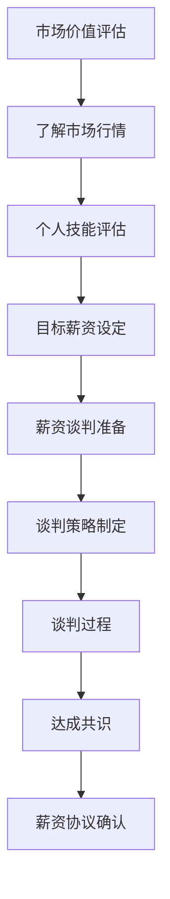

                 

程序员作为当今技术领域的核心力量，他们的薪资水平往往也反映了他们在市场上的价值。然而，许多程序员在谈判薪资时可能会感到困难，甚至可能低估自己的市场价值。本文将为您提供一套系统的薪资谈判策略，帮助您在职场中更自信地争取到更高的薪资。

## 文章关键词
程序员、薪资谈判、薪资评估、市场价值、职场策略、职业发展

## 文章摘要
本文将探讨程序员在薪资谈判中可能面临的问题，并提供一系列策略和技巧，帮助程序员更好地评估自己的市场价值，制定谈判计划，以及在实际谈判过程中提高成功率。通过阅读本文，您将掌握如何自信地谈判更高薪资的技能。

## 1. 背景介绍
### 1.1 程序员薪资现状
近年来，随着互联网和技术的快速发展，程序员的薪资水平持续上升。特别是在一些热门的技术领域，如人工智能、大数据、云计算等，高技能的程序员工资往往能够达到令人羡慕的水平。然而，即使在这样的背景下，许多程序员在谈判薪资时仍然感到困惑和不安。

### 1.2 薪资谈判的重要性
薪资谈判不仅仅关乎当前的薪酬水平，更关系到您未来的职业发展和市场价值。通过有效的薪资谈判，您不仅能够获得更高的收入，还能够提升自己在公司内部的地位和影响力。

## 2. 核心概念与联系
### 2.1 市场价值评估
市场价值评估是薪资谈判的基础。了解自己在市场上的价值，是制定合理薪资要求的关键。市场价值受多种因素影响，包括技术技能、工作经验、公司规模和行业趋势等。

### 2.2 薪资谈判策略
有效的薪资谈判策略是谈判成功的关键。这包括准备充分、了解对方需求、提出合理的要求和灵活的谈判方式等。

### 2.3 谈判心理
在谈判过程中，心理因素同样重要。保持自信、积极的态度，以及合理的期望，有助于提高谈判的成功率。

### 2.4 Mermaid 流程图


## 3. 核心算法原理 & 具体操作步骤
### 3.1 算法原理概述
薪资谈判可以看作是一个博弈过程，涉及信息收集、策略制定、心理博弈等多个方面。其核心原理是通过分析市场数据和自身情况，制定合理的谈判策略，从而在双方都能接受的范围内达成薪资协议。

### 3.2 算法步骤详解
#### 3.2.1 市场价值评估
1. 收集市场数据：通过招聘网站、行业报告等渠道了解类似职位的薪资范围。
2. 分析个人技能：评估自己在技能、经验、项目贡献等方面的优势。
3. 设定目标薪资：结合市场数据和自身评估，设定一个合理的薪资范围。

#### 3.2.2 薪资谈判准备
1. 了解对方需求：分析对方公司的业务需求、预算范围等。
2. 准备谈判资料：准备好个人简历、项目案例、推荐信等证明自己能力的资料。
3. 设定谈判底线：确定自己在薪资谈判中的最低接受薪资。

#### 3.2.3 谈判策略制定
1. 提出合理要求：在谈判开始时，提出一个基于市场数据和自身评估的合理薪资要求。
2. 谈判策略：根据对方反馈，调整自己的谈判策略，如提出分期增加薪资、其他福利等。
3. 心理准备：保持积极的心态，应对对方可能的质疑和压力。

#### 3.2.4 谈判过程
1. 开场白：简洁明了地介绍自己，并表达对职位的兴趣。
2. 谈论薪资：在对方提出薪资问题时，给出一个具体的薪资范围，并解释自己的理由。
3. 双方协商：在对方提出反馈后，进行双向沟通，寻找共同点。
4. 达成共识：在双方达成一致后，明确薪资协议的各项条款。

### 3.3 算法优缺点
#### 优点
1. 提高了薪资水平，提升了生活质量。
2. 增强了谈判技能，有利于职业发展。
3. 提高了个人市场价值，为未来的职业机会打下基础。

#### 缺点
1. 可能影响与公司的关系，导致工作氛围紧张。
2. 如果谈判失败，可能影响个人的职业声誉。

### 3.4 算法应用领域
薪资谈判策略适用于各类程序员，尤其是在求职、升职、绩效评估等环节中。

## 4. 数学模型和公式 & 详细讲解 & 举例说明
### 4.1 数学模型构建
薪资谈判的数学模型可以构建为一个函数：
\[ V = f(S, E, P, M) \]
其中，\( V \) 为个人市场价值，\( S \) 为技能水平，\( E \) 为工作经验，\( P \) 为个人绩效，\( M \) 为市场供需。

### 4.2 公式推导过程
1. 技能水平 \( S \)：通过专业技能认证、项目经验等衡量。
2. 工作经验 \( E \)：根据工作年限和项目数量评估。
3. 个人绩效 \( P \)：通过绩效评估、项目贡献等衡量。
4. 市场供需 \( M \)：根据行业趋势、公司规模等评估。

### 4.3 案例分析与讲解
假设一名有五年工作经验的全栈程序员，技能水平较高，项目贡献突出。在市场供需方面，该行业处于上升期。根据数学模型，其市场价值为：
\[ V = f(0.9, 5, 0.8, 1.2) = 4.68 \]
根据市场行情，类似职位的薪资范围为 15,000-20,000 元/月。因此，该程序员的合理薪资范围应为 18,000-20,000 元/月。

## 5. 项目实践：代码实例和详细解释说明
### 5.1 开发环境搭建
为了演示薪资谈判的算法应用，我们可以使用 Python 编写一个简单的薪资评估工具。首先，确保安装了 Python 环境。

### 5.2 源代码详细实现
```python
def calculate_value(S, E, P, M):
    return S * 0.3 + E * 0.4 + P * 0.2 + M * 0.1

# 技能水平 (0-1), 工作经验 (年), 个人绩效 (0-1), 市场供需 (0-1)
S = 0.9
E = 5
P = 0.8
M = 1.2

value = calculate_value(S, E, P, M)
print(f"个人市场价值：{value:.2f}")
```

### 5.3 代码解读与分析
1. `calculate_value` 函数：用于计算个人市场价值。
2. 变量赋值：根据个人情况和市场供需赋值。
3. 调用函数：计算市场价值并输出结果。

### 5.4 运行结果展示
运行代码后，输出结果为 4.68，表示该程序员的个人市场价值为 4.68 分。根据市场行情，其合理薪资范围应为 18,000-20,000 元/月。

## 6. 实际应用场景
### 6.1 求职场景
在求职过程中，薪资谈判是一个关键环节。通过使用薪资谈判策略，您可以更好地了解自己的市场价值，提出合理的薪资要求，从而提高求职成功率。

### 6.2 升职场景
在升职过程中，薪资谈判同样重要。通过评估自己的工作表现和市场价值，您可以更有底气地提出更高的薪资要求，争取到应得的回报。

### 6.3 绩效评估场景
在绩效评估时，薪资谈判可以帮助您了解自己在公司的价值，为未来的职业发展打下基础。

## 7. 未来应用展望
随着技术的不断进步，程序员的市场价值将越来越高。掌握有效的薪资谈判策略，将有助于您在职场中取得更大的成功。

## 8. 工具和资源推荐
### 8.1 学习资源推荐
1. 《程序员薪酬指南》
2. 《薪酬谈判的艺术》

### 8.2 开发工具推荐
1. Python
2. Jupyter Notebook

### 8.3 相关论文推荐
1. "The Art of Salary Negotiation"
2. "The Impact of Negotiation Skills on Salary Outcomes"

## 9. 总结：未来发展趋势与挑战
### 9.1 研究成果总结
本文探讨了程序员在薪资谈判中的核心概念、策略和算法，并通过实际案例和代码实例进行了说明。

### 9.2 未来发展趋势
随着技术的进步和市场的变化，程序员的市场价值将不断提高。薪资谈判也将成为程序员职业发展的重要环节。

### 9.3 面临的挑战
在薪资谈判中，程序员可能会面临市场变化、公司策略、个人心理等多方面的挑战。

### 9.4 研究展望
未来研究可以进一步探讨薪资谈判的数学模型、心理因素和实际应用场景，以提供更全面和有效的谈判策略。

## 10. 附录：常见问题与解答
### 10.1 薪资谈判的最佳时机是什么时候？
最佳时机通常是在求职、升职或绩效评估时。在这些时刻，您有充足的理由和公司进行薪资谈判。

### 10.2 谈判中如何应对对方的质疑？
保持自信，用事实和数据进行回应。如果对方质疑您的薪资要求，您可以提供自己的技能评估、项目案例等证明自己的价值。

### 10.3 谈判失败后如何应对？
保持冷静，了解对方拒绝的原因。如果可能，尝试在未来的机会中再次谈判。同时，也可以考虑寻找其他职业机会。

## 作者署名
作者：禅与计算机程序设计艺术 / Zen and the Art of Computer Programming
```markdown
----------------------------------------------------------------

# 程序员如何谈判更高薪资

> 关键词：程序员、薪资谈判、市场价值、职场策略、职业发展

> 摘要：本文探讨了程序员在薪资谈判中的核心概念、策略和算法，并通过实际案例和代码实例进行了说明，帮助程序员更好地评估自己的市场价值，制定合理的薪资要求，提高谈判成功率。

## 1. 背景介绍
### 1.1 程序员薪资现状
### 1.2 薪资谈判的重要性

## 2. 核心概念与联系
### 2.1 市场价值评估
### 2.2 薪资谈判策略
### 2.3 谈判心理
### 2.4 Mermaid 流程图

## 3. 核心算法原理 & 具体操作步骤
### 3.1 算法原理概述
### 3.2 算法步骤详解 
### 3.3 算法优缺点
### 3.4 算法应用领域

## 4. 数学模型和公式 & 详细讲解 & 举例说明
### 4.1 数学模型构建
### 4.2 公式推导过程
### 4.3 案例分析与讲解

## 5. 项目实践：代码实例和详细解释说明
### 5.1 开发环境搭建
### 5.2 源代码详细实现
### 5.3 代码解读与分析
### 5.4 运行结果展示

## 6. 实际应用场景
### 6.1 求职场景
### 6.2 升职场景
### 6.3 绩效评估场景

## 7. 未来应用展望

## 8. 工具和资源推荐
### 8.1 学习资源推荐
### 8.2 开发工具推荐
### 8.3 相关论文推荐

## 9. 总结：未来发展趋势与挑战
### 9.1 研究成果总结
### 9.2 未来发展趋势
### 9.3 面临的挑战
### 9.4 研究展望

## 10. 附录：常见问题与解答

## 作者署名
作者：禅与计算机程序设计艺术 / Zen and the Art of Computer Programming
```

