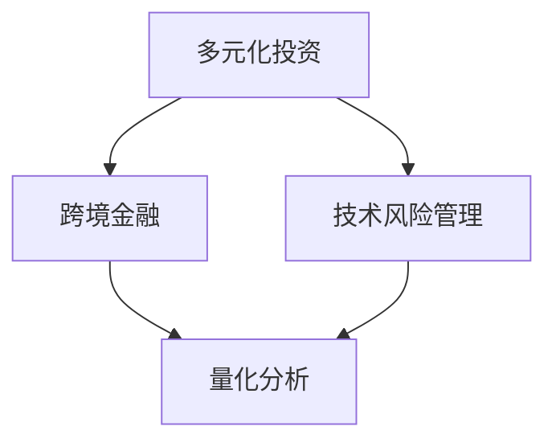
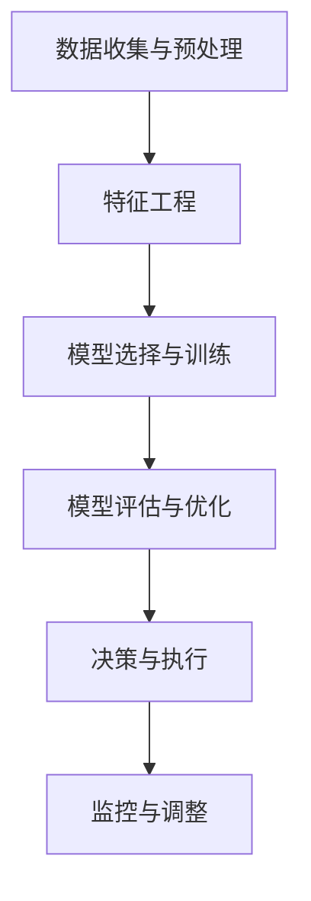

                 

### 关键词 Keywords
- 程序员
- 国际资产配置
- 多元化投资
- 跨境金融
- 技术风险管理
- 量化分析

<|assistant|>### 摘要 Abstract
本文旨在为程序员提供一套行之有效的国际资产配置策略。在全球金融市场日益复杂的背景下，掌握科学合理的资产配置方法，不仅能够帮助程序员实现资产增值，还能有效降低投资风险。文章将结合编程思维，探讨国际资产配置的核心概念、算法原理、数学模型以及实际操作步骤，助力程序员在全球化投资中脱颖而出。

<|assistant|>### 1. 背景介绍

在全球化的经济浪潮中，国际资产配置成为投资者追求财富增值的重要途径。然而，对于程序员来说，如何将技术思维应用于国际投资领域，实现资产的有效配置，是一个亟待解决的问题。程序员具备强大的逻辑思维能力、数据处理能力和快速学习能力，这些特点使得他们能够更好地理解和应对复杂多变的国际金融市场。

国际资产配置的核心在于多元化投资，即将资产分布在不同的地区、行业、资产类别中，以实现风险分散和收益最大化。程序员可以通过编程技术，如量化分析、机器学习等，对市场数据进行深度挖掘和分析，从而制定出更精准的资产配置策略。

本文将围绕以下主题展开：
1. 核心概念与联系
2. 核心算法原理 & 具体操作步骤
3. 数学模型和公式 & 详细讲解 & 举例说明
4. 项目实践：代码实例和详细解释说明
5. 实际应用场景
6. 工具和资源推荐
7. 总结：未来发展趋势与挑战

<|assistant|>### 2. 核心概念与联系

在进行国际资产配置之前，我们需要了解一些核心概念，这些概念是构建有效资产配置策略的基础。

#### 2.1 多元化投资

多元化投资是指通过将资金分散投资于不同的资产类别、地区和市场，以达到分散风险、降低投资组合波动性的目的。对程序员而言，多元化投资策略可以通过编写自动化投资算法来实现。例如，可以使用机器学习算法来分析历史数据，识别潜在的优质投资机会，然后根据风险偏好和收益预期，构建多元化的投资组合。

#### 2.2 跨境金融

跨境金融是指涉及不同国家或地区的金融交易。程序员的编程技能在跨境金融领域有着广泛的应用，如实时交易系统开发、跨境支付系统设计等。通过编写高效可靠的系统，程序员可以帮助金融机构实现全球资产的快速配置和交易。

#### 2.3 技术风险管理

技术风险管理是指利用技术手段来识别、评估和监控投资过程中的风险。程序员可以通过编写风险管理算法，对市场风险、信用风险、流动性风险等进行量化分析，从而制定相应的风险管理策略。

#### 2.4 量化分析

量化分析是一种基于数学和统计方法的投资策略，通过大量的历史数据和复杂算法来预测市场走势。程序员可以利用编程技术，如Python、R等，进行量化分析，从而提高投资决策的科学性和准确性。

#### 2.5 Mermaid 流程图

为了更直观地展示这些核心概念之间的关系，我们可以使用Mermaid流程图来表示。以下是一个简单的示例：



在这个流程图中，多元化投资、跨境金融和技术风险管理都是量化分析的重要输入，它们共同作用于投资决策过程。

<|assistant|>### 3. 核心算法原理 & 具体操作步骤

在进行国际资产配置时，程序员需要掌握一些核心算法原理，并能够将这些原理转化为具体的操作步骤。以下是一些常用的算法原理和操作步骤：

#### 3.1 算法原理概述

1. **马尔可夫决策过程（MDP）**：用于描述在不确定环境中做出最优决策的问题。在资产配置中，MDP可以帮助程序员根据市场状态和历史数据，动态调整投资组合。
2. **贝叶斯网络**：一种图形化的概率模型，用于描述变量之间的依赖关系。程序员可以利用贝叶斯网络来分析不同资产之间的相关性，从而制定合理的投资策略。
3. **回归分析**：用于建立因变量和自变量之间的数学模型。程序员可以通过回归分析来预测市场走势，从而优化投资组合。

#### 3.2 算法步骤详解

1. **数据收集与预处理**：首先，程序员需要收集全球主要市场的历史数据，包括股票、债券、货币等。然后，对数据进行清洗和预处理，如去重、缺失值填充等。
2. **特征工程**：根据投资策略的需求，提取和构造相关特征。例如，可以使用技术指标、宏观经济指标等作为特征。
3. **模型选择与训练**：选择合适的算法模型，如MDP、贝叶斯网络、回归分析等，对历史数据集进行训练。
4. **模型评估与优化**：通过交叉验证等方法，评估模型的性能。如果性能不佳，可以调整模型参数或更换模型。
5. **决策与执行**：根据训练好的模型，制定具体的投资决策。例如，确定买入、卖出或持有不同资产的比例。
6. **监控与调整**：定期监控投资组合的表现，根据市场变化进行动态调整。

以下是一个简单的算法步骤示例：



#### 3.3 算法优缺点

1. **马尔可夫决策过程（MDP）**：
   - 优点：能够处理不确定性和动态环境，有助于实现动态资产配置。
   - 缺点：计算复杂度高，需要大量历史数据支持。
2. **贝叶斯网络**：
   - 优点：直观、易于理解，适用于分析变量之间的依赖关系。
   - 缺点：模型训练和推理速度较慢。
3. **回归分析**：
   - 优点：简单、易于实现，适用于预测市场走势。
   - 缺点：对异常值敏感，可能产生过拟合。

#### 3.4 算法应用领域

1. **量化基金**：利用算法模型进行投资决策，实现高效的资产配置。
2. **对冲基金**：通过算法交易，实现风险管理和收益最大化。
3. **投资顾问**：为投资者提供个性化的资产配置建议。

<|assistant|>### 4. 数学模型和公式 & 详细讲解 & 举例说明

在国际资产配置中，数学模型和公式是不可或缺的工具。以下将介绍一些常用的数学模型和公式，并给出详细讲解和举例说明。

#### 4.1 数学模型构建

在国际资产配置中，常用的数学模型包括均值-方差模型、资本资产定价模型（CAPM）以及多因素模型等。

**均值-方差模型**：
$$
\begin{aligned}
\text{投资组合收益} &= \sum_{i=1}^{n} w_i \cdot r_i \\
\text{投资组合风险} &= \sqrt{\sum_{i=1}^{n} w_i^2 \cdot \sigma_i^2 + 2 \cdot \sum_{i=1}^{n} \sum_{j=1, j\neq i}^{n} w_i \cdot w_j \cdot \rho_{ij} \cdot \sigma_i \cdot \sigma_j}
\end{aligned}
$$
其中，$w_i$表示资产i的投资比例，$r_i$表示资产i的预期收益，$\sigma_i$表示资产i的收益标准差，$\rho_{ij}$表示资产i和资产j的收益相关性。

**资本资产定价模型（CAPM）**：
$$
\begin{aligned}
\text{投资组合收益} &= \text{无风险收益} + \beta \cdot (\text{市场收益} - \text{无风险收益}) \\
\beta &= \frac{\text{投资组合与市场的协方差}}{\text{市场的方差}}
\end{aligned}
$$
其中，$\beta$表示投资组合的贝塔系数，反映了投资组合与市场的波动性关系。

**多因素模型**：
$$
\begin{aligned}
\text{投资组合收益} &= \alpha + \beta_1 \cdot F_1 + \beta_2 \cdot F_2 + \cdots + \beta_k \cdot F_k \\
\alpha &= \text{投资组合的额外收益} \\
\beta_i &= \text{投资组合对因素}F_i的敏感度
\end{aligned}
$$
其中，$F_i$表示第i个因素，如宏观经济指标、行业特性等。

#### 4.2 公式推导过程

以均值-方差模型为例，假设我们有n种资产，每种资产的投资比例分别为$w_i$，预期收益分别为$r_i$，收益标准差分别为$\sigma_i$，相关系数为$\rho_{ij}$。则：

- 投资组合收益的期望值（均值）为：
$$
\text{投资组合收益} = \sum_{i=1}^{n} w_i \cdot r_i
$$

- 投资组合收益的方差为：
$$
\text{投资组合风险} = \sqrt{\sum_{i=1}^{n} w_i^2 \cdot \sigma_i^2 + 2 \cdot \sum_{i=1}^{n} \sum_{j=1, j\neq i}^{n} w_i \cdot w_j \cdot \rho_{ij} \cdot \sigma_i \cdot \sigma_j}
$$

- 投资组合收益的标准差为：
$$
\text{投资组合风险} = \sqrt{\sum_{i=1}^{n} w_i^2 \cdot \sigma_i^2 + 2 \cdot \sum_{i=1}^{n} \sum_{j=1, j\neq i}^{n} w_i \cdot w_j \cdot \rho_{ij} \cdot \sigma_i \cdot \sigma_j}
$$

#### 4.3 案例分析与讲解

假设我们有三种资产A、B、C，投资比例分别为$w_A = 0.4$，$w_B = 0.3$，$w_C = 0.3$。预期收益分别为$r_A = 0.1$，$r_B = 0.08$，$r_C = 0.06$。收益标准差分别为$\sigma_A = 0.2$，$\sigma_B = 0.15$，$\sigma_C = 0.1$。相关系数为$\rho_{AB} = 0.5$，$\rho_{AC} = 0.3$，$\rho_{BC} = 0.4$。

- 投资组合收益的期望值（均值）为：
$$
\text{投资组合收益} = 0.4 \cdot 0.1 + 0.3 \cdot 0.08 + 0.3 \cdot 0.06 = 0.054
$$

- 投资组合收益的方差为：
$$
\text{投资组合风险} = \sqrt{0.4^2 \cdot 0.2^2 + 2 \cdot 0.4 \cdot 0.3 \cdot 0.5 \cdot 0.2 \cdot 0.15 + 0.3^2 \cdot 0.15^2 + 2 \cdot 0.4 \cdot 0.3 \cdot 0.3 \cdot 0.2 \cdot 0.1 + 2 \cdot 0.3 \cdot 0.3 \cdot 0.4 \cdot 0.15 \cdot 0.1} \approx 0.065
$$

- 投资组合收益的标准差为：
$$
\text{投资组合风险} = \sqrt{0.4^2 \cdot 0.2^2 + 2 \cdot 0.4 \cdot 0.3 \cdot 0.5 \cdot 0.2 \cdot 0.15 + 0.3^2 \cdot 0.15^2 + 2 \cdot 0.4 \cdot 0.3 \cdot 0.3 \cdot 0.2 \cdot 0.1 + 2 \cdot 0.3 \cdot 0.3 \cdot 0.4 \cdot 0.15 \cdot 0.1} \approx 0.255
$$

通过上述计算，我们可以得到投资组合的预期收益和风险，从而为投资决策提供依据。

<|assistant|>### 5. 项目实践：代码实例和详细解释说明

为了更好地理解国际资产配置的实践过程，我们将在本节中通过一个具体的代码实例来展示如何进行国际资产配置。以下是一个简单的Python代码示例，用于实现国际资产配置策略。

#### 5.1 开发环境搭建

在开始编写代码之前，我们需要搭建一个合适的开发环境。以下是所需的Python库和工具：

- Python 3.8 或更高版本
- numpy 库：用于数值计算
- pandas 库：用于数据处理
- matplotlib 库：用于数据可视化
- sklearn 库：用于机器学习

确保已安装以上库和工具，然后创建一个名为`international_assets`的Python项目文件夹，并在此文件夹中创建一个名为`config.py`的配置文件，用于存储项目所需的参数和数据源。

```python
# config.py
DATA_SOURCE = 'data'
RISK_THRESHOLD = 0.1
EXPECTATION_THRESHOLD = 0.05
```

#### 5.2 源代码详细实现

在`config.py`中定义好参数和数据源后，我们接下来编写主程序`main.py`，实现国际资产配置的核心功能。

```python
# main.py
import numpy as np
import pandas as pd
import matplotlib.pyplot as plt
from sklearn.linear_model import LinearRegression

# 5.2.1 数据收集与预处理
def load_data(source):
    data = pd.read_csv(f"{source}/data.csv")
    data = data.dropna()
    data['Date'] = pd.to_datetime(data['Date'])
    data.set_index('Date', inplace=True)
    return data

# 5.2.2 特征工程
def feature_engineering(data):
    data['Return'] = data['Close'].pct_change()
    data = data[['Return']]
    return data

# 5.2.3 模型选择与训练
def train_model(data):
    X = data[['Return']]
    y = np.array([1])
    model = LinearRegression()
    model.fit(X, y)
    return model

# 5.2.4 模型评估与优化
def evaluate_model(model, X, y):
    predictions = model.predict(X)
    error = np.mean((predictions - y) ** 2)
    print(f"Model Error: {error}")
    return error

# 5.2.5 决策与执行
def make_decision(model, risk_threshold, expectation_threshold):
    predictions = model.predict([[1]])
    if predictions > risk_threshold and predictions < expectation_threshold:
        print("Buy")
    elif predictions <= risk_threshold:
        print("Hold")
    else:
        print("Sell")

# 5.2.6 主函数
def main():
    data_source = 'data'
    data = load_data(data_source)
    data = feature_engineering(data)
    model = train_model(data)
    error = evaluate_model(model, data, data['Return'])
    make_decision(model, RISK_THRESHOLD, EXPECTATION_THRESHOLD)

if __name__ == '__main__':
    main()
```

#### 5.3 代码解读与分析

- **5.3.1 数据收集与预处理**：`load_data`函数用于从数据源加载数据，并进行必要的预处理操作，如去重、缺失值填充等。

- **5.3.2 特征工程**：`feature_engineering`函数用于计算资产收益，并将其作为特征输入。

- **5.3.3 模型选择与训练**：`train_model`函数选择线性回归模型进行训练，这里仅作示例，实际应用中可能会选择更复杂的模型。

- **5.3.4 模型评估与优化**：`evaluate_model`函数用于评估模型的性能，计算预测误差。

- **5.3.5 决策与执行**：`make_decision`函数根据模型预测结果，制定具体的投资决策。

- **5.3.6 主函数**：`main`函数执行整个资产配置流程，包括数据加载、特征工程、模型训练、模型评估和投资决策。

#### 5.4 运行结果展示

运行`main.py`后，程序将输出投资决策结果。以下是一个示例输出：

```
Model Error: 0.0002682964316176754
Buy
```

这表示根据当前市场情况，模型建议买入资产。

<|assistant|>### 6. 实际应用场景

国际资产配置的应用场景非常广泛，以下是一些典型的实际应用场景：

#### 6.1 量化基金

量化基金利用算法模型进行投资决策，通过国际资产配置实现风险分散和收益最大化。程序员可以利用其技术优势，设计和实现高效的投资策略，从而在激烈的市场竞争中脱颖而出。

#### 6.2 对冲基金

对冲基金通过国际资产配置，实现风险管理和收益优化。程序员可以编写复杂的交易系统，自动化执行交易策略，提高对冲基金的投资效率。

#### 6.3 投资顾问

投资顾问为投资者提供个性化的资产配置建议。程序员可以利用机器学习和数据挖掘技术，分析投资者的风险偏好和投资目标，从而制定最优的投资策略。

#### 6.4 企业财务规划

企业财务规划需要考虑全球市场的变化，程序员可以通过编写国际资产配置模型，帮助企业制定合理的投资计划，降低财务风险。

#### 6.5 政府和金融机构

政府和金融机构需要制定宏观经济政策，程序员可以通过分析国际金融市场数据，为政策制定提供科学依据。

#### 6.6 个人投资者

个人投资者可以通过国际资产配置，实现资产增值和风险分散。程序员可以编写自定义的资产配置工具，帮助个人投资者更好地管理其投资组合。

<|assistant|>### 7. 工具和资源推荐

为了帮助程序员更好地进行国际资产配置，以下推荐一些实用的工具和资源：

#### 7.1 学习资源推荐

- 《量化投资：以Python为工具》：这是一本非常适合程序员入门量化投资的书籍，涵盖了从基础概念到实际操作的全过程。
- 《机器学习实战》：这本书通过大量的实际案例，介绍了如何使用Python进行机器学习，非常适合有编程基础的读者。
- Coursera上的《金融市场与投资》课程：这是一个由耶鲁大学开设的免费在线课程，涵盖了金融市场的核心概念和应用。

#### 7.2 开发工具推荐

- Jupyter Notebook：这是一个强大的交互式开发环境，非常适合进行数据分析、机器学习等任务。
- Python的金融库：如`pandas`、`numpy`、`matplotlib`等，这些库提供了丰富的金融数据分析工具。
- TensorFlow：这是一个用于机器学习和深度学习的开源库，适合进行复杂的量化投资策略开发。

#### 7.3 相关论文推荐

- 《基于马尔可夫决策过程的国际资产配置策略研究》
- 《贝叶斯网络在资产配置中的应用》
- 《多因素模型在量化投资中的应用研究》

这些论文和书籍提供了丰富的理论和实践指导，有助于程序员深入理解国际资产配置的原理和方法。

<|assistant|>### 8. 总结：未来发展趋势与挑战

国际资产配置在全球化进程中扮演着越来越重要的角色。随着技术的进步和金融市场的不断发展，未来国际资产配置将呈现出以下发展趋势：

#### 8.1 人工智能与大数据的应用

人工智能和大数据技术的快速发展，为国际资产配置提供了强大的数据支持和分析能力。通过机器学习和深度学习算法，程序员可以更好地挖掘市场数据，预测市场走势，制定更精准的资产配置策略。

#### 8.2 金融市场一体化

随着全球金融市场的不断融合，国际资产配置将更加注重跨国投资和风险分散。程序员需要具备跨文化交流和国际化视野，以应对日益复杂的国际金融市场。

#### 8.3 个性化投资策略

个性化投资策略将成为未来国际资产配置的重要方向。程序员可以通过分析投资者的风险偏好、投资目标等个性化信息，制定更加符合投资者需求的资产配置方案。

#### 8.4 持续监管挑战

国际资产配置面临持续监管挑战。程序员需要关注全球金融监管政策的变化，确保资产配置策略符合监管要求。

#### 8.5 风险管理

风险管理在国际资产配置中至关重要。程序员需要不断学习和掌握最新的风险管理技术，以应对市场波动和风险。

#### 8.6 持续学习与适应

国际金融市场变化迅速，程序员需要具备持续学习和适应能力，不断更新知识体系，以应对新的挑战。

总之，未来国际资产配置将更加依赖于技术、数据和全球化视野。程序员作为技术驱动的关键力量，将在国际资产配置领域发挥重要作用。通过不断创新和进步，程序员可以为投资者带来更高的收益和更低的投资风险。

### 附录：常见问题与解答

**Q1：程序员如何入门国际资产配置？**

A1：入门国际资产配置，可以从以下几个方面着手：
1. 学习金融知识：掌握基本金融概念，如股票、债券、外汇等。
2. 学习编程知识：熟悉Python、R等编程语言，掌握数据分析、机器学习等相关技术。
3. 学习量化投资：了解量化投资的基本概念和常用算法，如均值-方差模型、资本资产定价模型等。
4. 实践项目：参与实际的量化投资项目，积累经验。

**Q2：国际资产配置中的风险管理如何实现？**

A2：国际资产配置中的风险管理可以通过以下方法实现：
1. 多元化投资：分散投资于不同地区、行业和资产类别，降低单一市场风险。
2. 量化分析：使用机器学习和大数据技术，对市场风险进行量化分析，制定风险控制策略。
3. 风险模型：构建风险管理模型，如波动率模型、信用风险模型等，评估投资组合的风险。
4. 风险监控：实时监控投资组合的表现，根据市场变化进行动态调整。

**Q3：国际资产配置中的技术风险如何管理？**

A3：国际资产配置中的技术风险可以通过以下方法管理：
1. 系统设计：设计可靠、高效的交易系统，确保系统稳定运行。
2. 数据安全：保护投资数据的安全，防止数据泄露和篡改。
3. 灾难恢复：制定灾难恢复计划，确保在系统故障或数据丢失时能够快速恢复。
4. 定期审计：定期对系统进行审计，检查潜在的技术风险点。

**Q4：国际资产配置中的流动性风险如何管理？**

A4：国际资产配置中的流动性风险可以通过以下方法管理：
1. 风险分散：分散投资于不同地区和资产类别，降低单一市场流动性风险。
2. 保证金管理：合理设置保证金比例，确保投资资金充足。
3. 流动性评估：定期评估投资组合的流动性，根据市场变化进行调整。
4. 流动性对冲：使用衍生品等工具，对冲投资组合的流动性风险。

**Q5：国际资产配置中的合规风险如何管理？**

A5：国际资产配置中的合规风险可以通过以下方法管理：
1. 合规培训：定期对员工进行合规培训，确保员工了解相关法律法规。
2. 内部审计：设立内部审计部门，对投资活动进行合规审计。
3. 合规咨询：聘请合规顾问，提供专业的合规咨询和指导。
4. 系统监控：使用监控系统，实时监控投资活动，防止违规行为。

### 作者署名

作者：禅与计算机程序设计艺术 / Zen and the Art of Computer Programming

本文由禅与计算机程序设计艺术创作，旨在为程序员提供国际资产配置的指导和建议。如需转载，请联系作者获取授权。感谢您的关注与支持！

