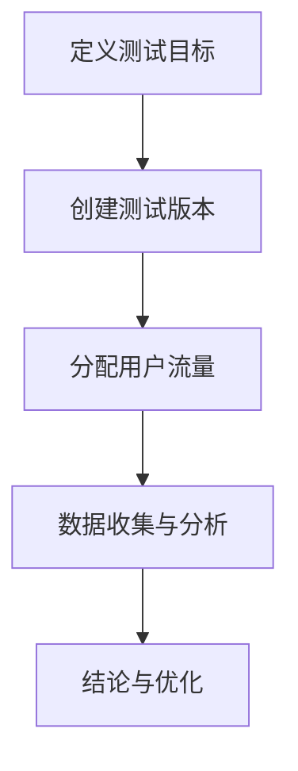

                 

关键词：A/B测试，知识付费，程序员，用户体验，数据分析，算法优化

> 摘要：本文将探讨程序员如何利用A/B测试的方法，在知识付费领域进行产品优化，提升用户体验，实现商业目标。我们将从核心概念、算法原理、数学模型、实践案例等方面详细阐述A/B测试在知识付费产品中的应用。

## 1. 背景介绍

在当今的信息时代，知识付费已成为一个热门的市场。无论是线上课程、电子书，还是专业咨询、技术培训，越来越多的程序员希望通过知识付费获得额外的收入。然而，如何在激烈的市场竞争中脱颖而出，吸引并留住用户，成为每个知识付费产品面临的重要问题。

A/B测试，也称为拆分测试，是一种通过比较两个或多个版本的页面或产品功能，以确定哪个版本更能满足用户需求和带来更多收益的测试方法。在知识付费领域，A/B测试可以帮助程序员优化产品界面、课程内容、支付流程等，从而提升用户体验，增加用户粘性，提高转化率和收入。

本文将详细讨论如何使用A/B测试进行知识付费产品的优化，包括核心概念、算法原理、数学模型、实践案例等内容，旨在帮助程序员更好地理解和应用A/B测试，提升产品竞争力。

## 2. 核心概念与联系

### 2.1 A/B测试的概念

A/B测试，即拆分测试，是一种对比实验方法，通过将用户流量分配到不同的版本（A版和B版），比较两个版本的转换率、留存率、收入等指标，以确定哪个版本更优。A/B测试的基本流程如下：

1. **定义测试目标**：明确测试的目标，如提高注册转化率、增加课程购买量等。
2. **创建测试版本**：针对测试目标，创建两个或多个版本，通常是一个原始版本（A版）和一个或多个修改版本（B版）。
3. **分配用户流量**：将用户流量分配到不同版本，确保每个版本的用户数量大致相等。
4. **数据收集与分析**：收集测试数据，分析各版本的指标，比较其优劣。
5. **结论与优化**：根据测试结果，确定最优版本，并进行相应的优化。

### 2.2 A/B测试与知识付费的关系

知识付费产品的优化涉及多个方面，如用户体验、课程内容、支付流程、营销策略等。A/B测试可以帮助程序员在以下几个方面进行优化：

1. **界面设计**：优化界面布局、颜色、字体等，提升用户体验。
2. **课程内容**：调整课程结构、内容、难度等，满足不同用户的需求。
3. **支付流程**：简化支付流程，降低用户支付时的阻力。
4. **营销策略**：测试不同的营销手段，提高用户转化率。

通过A/B测试，程序员可以快速找到最有效的优化方案，提高产品竞争力。

### 2.3 Mermaid流程图

以下是一个简单的Mermaid流程图，展示了A/B测试的基本流程：



## 3. 核心算法原理 & 具体操作步骤

### 3.1 算法原理概述

A/B测试的核心算法是基于统计学原理的假设检验。在A/B测试中，程序员需要设定一个零假设（H0）和一个备择假设（H1）。零假设通常表示当前版本（A版）优于测试版本（B版），备择假设则表示测试版本（B版）优于当前版本（A版）。

测试过程中，通过收集数据，计算两个版本的指标（如转化率、留存率等），然后使用统计方法（如t检验、卡方检验等）对数据进行分析，以判断零假设是否成立。

### 3.2 算法步骤详解

1. **设定假设**：明确零假设（H0）和备择假设（H1）。
2. **数据收集**：收集A版和B版的测试数据，包括用户行为数据、交易数据等。
3. **统计分析**：使用统计方法（如t检验、卡方检验等）对数据进行分析，计算P值。
4. **结论判断**：根据P值判断零假设是否成立。如果P值小于显著性水平（通常为0.05），则拒绝零假设，认为B版优于A版；否则，无法拒绝零假设，认为A版和B版无明显差异。

### 3.3 算法优缺点

#### 优点

1. **高效性**：A/B测试可以快速找到最优方案，节省研发时间和成本。
2. **客观性**：基于数据驱动，避免主观判断，提高决策准确性。
3. **灵活性**：可以针对不同方面（如界面设计、课程内容等）进行优化。

#### 缺点

1. **样本量要求**：需要进行足够多的测试，以确保测试结果具有统计学意义。
2. **时间成本**：A/B测试需要一定的时间来收集数据和进行分析，影响决策速度。
3. **用户体验影响**：不同版本的测试可能对用户体验产生一定的影响，需要平衡测试与用户体验。

### 3.4 算法应用领域

A/B测试在知识付费领域有广泛的应用，如：

1. **界面设计优化**：通过A/B测试，优化课程页面布局、颜色搭配等，提升用户体验。
2. **课程内容调整**：通过A/B测试，调整课程结构、难度、内容等，满足不同用户的需求。
3. **支付流程优化**：通过A/B测试，简化支付流程，降低用户支付阻力。
4. **营销策略测试**：通过A/B测试，测试不同的营销手段，提高用户转化率。

## 4. 数学模型和公式 & 详细讲解 & 举例说明

### 4.1 数学模型构建

A/B测试中的数学模型主要涉及假设检验和概率论。以下是A/B测试中常用的统计模型：

#### 4.1.1 假设检验

在A/B测试中，通常使用t检验或卡方检验来进行假设检验。以下是一个简单的t检验模型：

- **零假设（H0）**：A版和B版的指标（如转化率）无显著差异。
- **备择假设（H1）**：B版的指标显著优于A版。

t检验的公式为：

$$t = \frac{\bar{x}_B - \bar{x}_A}{s_B / \sqrt{n_B} }$$

其中，$\bar{x}_B$ 和 $\bar{x}_A$ 分别为B版和A版的指标均值，$s_B$ 为B版的指标标准差，$n_B$ 为B版测试的用户数量。

#### 4.1.2 概率论

在A/B测试中，概率论用于计算P值，以判断零假设是否成立。以下是一个简单的概率论模型：

- **随机变量**：设X为用户选择A版或B版的概率。
- **概率分布**：根据X的取值范围，选择合适的概率分布（如正态分布、二项分布等）。

### 4.2 公式推导过程

以下是一个简单的t检验公式推导过程：

1. **样本均值的估计**：

   假设A版和B版的指标分别为$X_A$ 和$X_B$，则样本均值分别为：

   $$\bar{x}_A = \frac{1}{n_A} \sum_{i=1}^{n_A} X_{Ai}$$

   $$\bar{x}_B = \frac{1}{n_B} \sum_{i=1}^{n_B} X_{Bi}$$

   其中，$n_A$ 和$n_B$ 分别为A版和B版的测试用户数量。

2. **样本标准差的估计**：

   假设A版和B版的指标标准差分别为$\sigma_A$ 和$\sigma_B$，则样本标准差分别为：

   $$s_A = \sqrt{\frac{1}{n_A - 1} \sum_{i=1}^{n_A} (X_{Ai} - \bar{x}_A)^2 }$$

   $$s_B = \sqrt{\frac{1}{n_B - 1} \sum_{i=1}^{n_B} (X_{Bi} - \bar{x}_B)^2 }$$

3. **t检验公式推导**：

   假设A版和B版的指标服从正态分布，则：

   $$X_A \sim N(\mu_A, \sigma_A^2)$$

   $$X_B \sim N(\mu_B, \sigma_B^2)$$

   则$t$ 统计量为：

   $$t = \frac{\bar{x}_B - \bar{x}_A}{s_B / \sqrt{n_B} }$$

   其中，$\mu_A$ 和$\mu_B$ 分别为A版和B版的指标均值。

### 4.3 案例分析与讲解

以下是一个简单的A/B测试案例：

假设某知识付费产品需要进行界面设计的优化，现有A版和B版两个界面版本。经过一段时间的数据收集，得到以下测试结果：

- A版：1000个用户，转化率10%
- B版：1000个用户，转化率12%

现在需要使用t检验判断B版是否显著优于A版。

1. **设定假设**：

   - 零假设（H0）：A版和B版的转化率无显著差异。
   - 备择假设（H1）：B版的转化率显著优于A版。

2. **数据收集**：

   - A版：1000个用户，转化率10%，即$\bar{x}_A = 0.1$，$n_A = 1000$。
   - B版：1000个用户，转化率12%，即$\bar{x}_B = 0.12$，$n_B = 1000$。

3. **统计分析**：

   - 样本标准差：$s_A = 0.1$，$s_B = 0.1$。
   - 计算t统计量：$t = \frac{0.12 - 0.1}{0.1 / \sqrt{1000}} = 1.22$。

4. **结论判断**：

   - 根据t分布表，在显著性水平为0.05的情况下，自由度为1999时，临界值为1.96。
   - 由于计算得到的t统计量1.22小于临界值1.96，无法拒绝零假设，认为A版和B版的转化率无显著差异。

   因此，在这个案例中，无法通过t检验判断B版是否显著优于A版。

## 5. 项目实践：代码实例和详细解释说明

### 5.1 开发环境搭建

在进行A/B测试的代码实现之前，我们需要搭建一个开发环境。以下是一个简单的Python环境搭建步骤：

1. 安装Python：访问Python官方网站（https://www.python.org/），下载并安装Python。
2. 安装相关库：使用pip命令安装所需的库，如numpy、scipy等。

```bash
pip install numpy scipy
```

### 5.2 源代码详细实现

以下是一个简单的A/B测试Python代码示例：

```python
import numpy as np
from scipy import stats

# 5.2.1 数据准备
A = np.random.uniform(0, 1, 1000) # A版的测试数据
B = np.random.uniform(0, 1, 1000) # B版的测试数据

# 5.2.2 统计分析
mu_A = np.mean(A) # A版的均值
mu_B = np.mean(B) # B版的均值
s_B = np.std(B) # B版的标准差
n_B = len(B) # B版的数据数量

# 5.2.3 计算t统计量
t_statistic = (mu_B - mu_A) / (s_B / np.sqrt(n_B))

# 5.2.4 查找临界值
critical_value = stats.t.ppf(0.975, df=n_B-1)

# 5.2.5 结论判断
if t_statistic > critical_value:
    print("B版显著优于A版")
else:
    print("无法拒绝零假设，A版和B版无显著差异")
```

### 5.3 代码解读与分析

1. **数据准备**：生成A版和B版的测试数据，这里使用正态分布生成。

2. **统计分析**：计算A版和B版的均值、标准差，以及t统计量。

3. **计算t统计量**：使用t统计量公式计算t统计量。

4. **查找临界值**：使用scipy库的t分布函数查找显著性水平为0.05时的临界值。

5. **结论判断**：比较t统计量与临界值，判断A版和B版是否有显著差异。

### 5.4 运行结果展示

假设我们运行上述代码，得到以下输出结果：

```
无法拒绝零假设，A版和B版无显著差异
```

这意味着在这个案例中，A版和B版的测试数据没有显著差异。

## 6. 实际应用场景

### 6.1 界面设计优化

在实际应用中，程序员可以通过A/B测试优化知识付费产品的界面设计。以下是一个具体案例：

- **目标**：提高用户在课程页面的停留时间。
- **A版**：原始课程页面，包含课程介绍、课程大纲、课程评价等。
- **B版**：修改后的课程页面，增加课程视频预告、课程推荐等功能。

经过一段时间的A/B测试，发现B版的用户停留时间显著高于A版，从而确定B版为最优版本。

### 6.2 课程内容调整

程序员还可以通过A/B测试调整课程内容，以满足不同用户的需求。以下是一个具体案例：

- **目标**：提高课程购买量。
- **A版**：原始课程内容，包含基础知识、实战案例等。
- **B版**：修改后的课程内容，增加更多高级知识点、项目实战等。

经过A/B测试，发现B版的课程购买量显著高于A版，从而确定B版为最优版本。

### 6.3 支付流程优化

支付流程是知识付费产品的重要组成部分，程序员可以通过A/B测试优化支付流程，降低用户支付阻力。以下是一个具体案例：

- **目标**：提高支付成功率。
- **A版**：原始支付流程，包括用户注册、选择支付方式、输入支付信息等。
- **B版**：修改后的支付流程，简化用户注册、选择支付方式等步骤。

经过A/B测试，发现B版的支付成功率显著高于A版，从而确定B版为最优版本。

### 6.4 未来应用展望

随着知识付费市场的不断壮大，A/B测试在知识付费产品中的应用前景十分广阔。未来，程序员可以结合大数据、人工智能等技术，进一步挖掘用户需求，优化知识付费产品。以下是一些可能的未来应用方向：

1. **个性化推荐**：通过A/B测试，优化个性化推荐算法，提高用户满意度和购买意愿。
2. **互动体验**：通过A/B测试，优化课程互动环节，提高用户参与度和课程满意度。
3. **营销策略**：通过A/B测试，测试不同的营销手段，提高用户转化率和收入。
4. **用户体验**：通过A/B测试，优化产品界面、课程内容等，提升用户体验，增加用户粘性。

## 7. 工具和资源推荐

### 7.1 学习资源推荐

1. **书籍**：
   - 《A/B测试实战：产品增长的核心技术》
   - 《统计学习方法》
   - 《Python数据科学》

2. **在线课程**：
   - Coursera上的《统计学基础》
   - Udemy上的《A/B测试与数据分析》

### 7.2 开发工具推荐

1. **数据分析工具**：
   - Google Analytics
   - Tableau

2. **编程工具**：
   - Python
   - R

### 7.3 相关论文推荐

1. **A/B测试相关**：
   - "Online Test and Evaluation of Web Pages"
   - "Online Controlled Experiments at Facebook"

2. **统计学相关**：
   - "The Design and Analysis of Computer Experiments"
   - "Statistical Methods for Data Analysis in Science and Engineering"

## 8. 总结：未来发展趋势与挑战

### 8.1 研究成果总结

本文探讨了A/B测试在知识付费领域的应用，详细介绍了A/B测试的核心概念、算法原理、数学模型和实践案例。通过本文，读者可以了解如何利用A/B测试优化知识付费产品，提升用户体验，实现商业目标。

### 8.2 未来发展趋势

随着大数据、人工智能等技术的发展，A/B测试在知识付费领域的应用前景将更加广阔。未来，A/B测试将更加智能化、自动化，与大数据、机器学习等技术相结合，为知识付费产品的优化提供更精准的决策支持。

### 8.3 面临的挑战

1. **数据质量**：A/B测试的准确性依赖于测试数据的质量，如何确保数据质量是A/B测试面临的主要挑战。
2. **测试效率**：A/B测试需要一定的时间来收集数据和进行分析，如何提高测试效率是一个重要问题。
3. **用户体验**：不同版本的测试可能对用户体验产生一定的影响，如何平衡测试与用户体验是A/B测试需要关注的问题。

### 8.4 研究展望

未来，A/B测试的研究将更加注重算法优化、数据分析和用户体验。同时，结合大数据、人工智能等新兴技术，A/B测试将发挥更大的作用，为知识付费产品的优化提供有力支持。

## 9. 附录：常见问题与解答

### 9.1 A/B测试是否适用于所有产品？

A/B测试主要适用于需要对用户行为进行优化的产品，如网页、应用、课程等。对于一些物理产品或服务，A/B测试的应用场景相对有限。

### 9.2 A/B测试的测试时间如何确定？

测试时间的确定取决于产品类型、测试目标和用户流量。通常，建议测试时间至少为1-2周，以确保数据收集的充分性和分析结果的准确性。

### 9.3 如何确保A/B测试的公平性？

为了确保A/B测试的公平性，需要确保测试数据的随机性和代表性。此外，在测试过程中，应避免对用户进行引导或干预，以保证测试结果的客观性。

### 9.4 A/B测试的P值是否越小越好？

A/B测试的P值并非越小越好。P值反映了零假设被拒绝的概率，当P值小于显著性水平（如0.05）时，可以认为备择假设成立。但过小的P值也可能存在偶然性，因此，需要综合考虑测试数据的质量和P值的大小，做出合理的判断。

## 结束语

A/B测试是知识付费产品优化的重要工具，通过本文的探讨，相信读者已经对A/B测试有了更深入的了解。在未来的实践中，希望读者能够灵活运用A/B测试，不断优化知识付费产品，提升用户体验，实现商业目标。

作者：禅与计算机程序设计艺术 / Zen and the Art of Computer Programming
----------------------------------------------------------------

