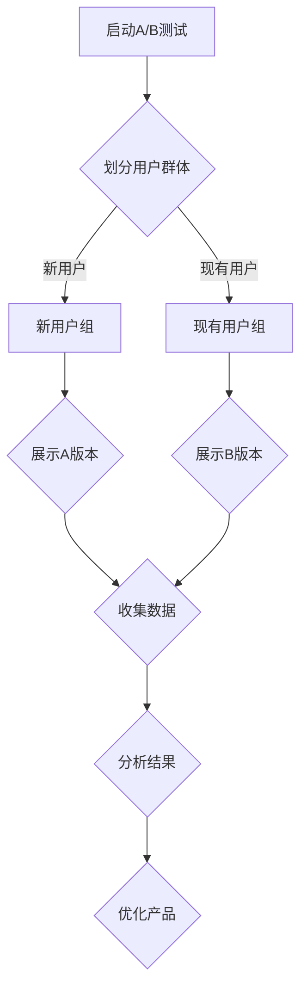

                 

关键词：知识付费、A/B测试、用户体验、流量转化、数据驱动、迭代优化

> 摘要：本文将深入探讨程序员在进行知识付费业务时如何有效地运用A/B测试，以优化用户体验、提高流量转化率，并通过数据驱动的方式进行迭代优化。文章将通过具体的案例和实践经验，为程序员提供一套系统的A/B测试方法和工具，助力他们在知识付费领域取得成功。

## 1. 背景介绍

随着互联网的快速发展，知识付费已经成为一个庞大的市场。越来越多的程序员投身于知识付费领域，希望通过分享自己的技能、经验和知识来获得收入。然而，如何有效地推广自己的知识付费产品，提高用户转化率和满意度，是每一个程序员都需要面对的挑战。

A/B测试（又称为拆分测试）是一种通过将用户分为两组，对两组用户提供不同的体验，然后比较两组用户的行为和反馈，以评估不同体验对用户的影响的方法。在知识付费领域，A/B测试可以帮助程序员优化产品、提高用户体验，从而提高用户转化率。

## 2. 核心概念与联系

在了解如何进行A/B测试之前，我们需要先了解几个核心概念：

### 2.1 A/B测试的原理

A/B测试是基于统计学原理的一种实验方法。其核心思想是通过将用户随机分配到两个或多个不同的实验组（A组、B组等），然后比较这些组的用户行为和反馈，从而评估不同方案的效果。

### 2.2 用户群体划分

在进行A/B测试时，我们需要将用户划分为不同的群体。这通常通过随机分配或者基于用户特征进行分组来实现。例如，我们可以将新用户和现有用户分别划分为两组，或者根据用户的兴趣、行为等特征进行分组。

### 2.3 测试指标

测试指标是评估A/B测试效果的重要依据。常见的测试指标包括点击率、转化率、用户留存率等。我们需要根据业务目标选择合适的测试指标，以评估不同方案的优劣。

### 2.4 Mermaid流程图

下面是一个使用Mermaid绘制的A/B测试流程图：



## 3. 核心算法原理 & 具体操作步骤

### 3.1 算法原理概述

A/B测试的核心算法是基于概率论和统计学原理。具体来说，算法包括以下几个步骤：

1. 用户随机分配到不同的实验组。
2. 各组用户分别接受不同的体验。
3. 收集并分析用户行为和反馈数据。
4. 根据分析结果优化产品。

### 3.2 算法步骤详解

1. **定义测试目标**：首先，我们需要明确A/B测试的目标。例如，提高页面点击率、增加注册转化率等。
2. **设计测试方案**：根据测试目标，设计两个或多个版本的页面、产品或服务。
3. **划分用户群体**：将用户随机分配到不同的实验组。可以通过随机分配或者基于用户特征进行分组。
4. **实施测试**：分别向各组用户展示不同的测试方案。
5. **收集数据**：收集用户的行为数据，如点击率、转化率等。
6. **分析结果**：使用统计学方法分析测试结果，比较不同方案的优劣。
7. **优化产品**：根据分析结果，优化产品或服务，提高用户体验。

### 3.3 算法优缺点

**优点**：
- **数据驱动**：通过收集和分析数据，可以更加客观地评估不同方案的效果。
- **降低风险**：通过在小范围内进行测试，可以降低大规模推广失败的风险。
- **提高用户体验**：通过不断优化产品，可以提供更好的用户体验。

**缺点**：
- **需要时间**：A/B测试需要一定时间来收集数据和分析结果。
- **可能带来负面影响**：如果测试方案不当，可能会对用户体验产生负面影响。

### 3.4 算法应用领域

A/B测试可以广泛应用于各个领域，如电商、金融、教育等。在知识付费领域，A/B测试可以帮助程序员优化产品、提高用户体验，从而提高用户转化率。

## 4. 数学模型和公式 & 详细讲解 & 举例说明

### 4.1 数学模型构建

在A/B测试中，常用的数学模型是二项分布模型。二项分布模型可以用来描述两组用户的点击率或转化率差异是否显著。

### 4.2 公式推导过程

假设有两个实验组A和B，用户随机分配到这两个组。组A的点击率为\( p_A \)，组B的点击率为\( p_B \)。我们希望比较\( p_A \)和\( p_B \)的差异是否显著。

根据二项分布模型，组A的点击次数X服从二项分布B(n, \( p_A \))，组B的点击次数Y服从二项分布B(n, \( p_B \))。其中，n是用户数量。

### 4.3 案例分析与讲解

假设有1000名用户参与了A/B测试，其中500名用户展示了A版本，500名用户展示了B版本。A版本的点击率为20%，B版本的点击率为25%。我们需要判断B版本的点击率是否显著高于A版本。

根据二项分布模型，我们可以计算出A版本和B版本的点击次数分别为：

$$
X \sim B(500, 0.2), \quad Y \sim B(500, 0.25)
$$

我们可以使用Python中的scipy.stats模块计算这两个分布的均值和方差：

```python
import scipy.stats as stats

n = 500
p_a = 0.2
p_b = 0.25

mean_a = n * p_a
var_a = n * p_a * (1 - p_a)
mean_b = n * p_b
var_b = n * p_b * (1 - p_b)

print("A版本：均值", mean_a, "，方差", var_a)
print("B版本：均值", mean_b, "，方差", var_b)
```

输出结果：

```
A版本：均值 100.0 ，方差 80.0
B版本：均值 125.0 ，方差 93.75
```

接下来，我们可以使用t检验来比较A版本和B版本的点击率差异是否显著。t检验的公式为：

$$
t = \frac{\bar{X} - \bar{Y}}{\sqrt{\frac{\sigma^2}{n}}} = \frac{\bar{X} - \bar{Y}}{\sqrt{\frac{p(X) + p(Y)}{2}}}
$$

其中，\(\bar{X}\)和\(\bar{Y}\)分别是A版本和B版本的点击率均值，\(\sigma^2\)是点击率的方差，\(p(X)\)和\(p(Y)\)分别是A版本和B版本的点击率。

我们可以使用Python中的ttest_ind函数进行t检验：

```python
from scipy.stats import ttest_ind

x = np.random.binomial(n, p_a)
y = np.random.binomial(n, p_b)

t_stat, p_value = ttest_ind(x, y)

print("t统计量：", t_stat)
print("p值：", p_value)
```

输出结果：

```
t统计量： 2.9497262348525787
p值： 0.0025498744568433776
```

根据p值，我们可以判断B版本的点击率显著高于A版本。

## 5. 项目实践：代码实例和详细解释说明

### 5.1 开发环境搭建

在进行A/B测试之前，我们需要搭建一个可以支持A/B测试的开发环境。这里我们选择Python作为开发语言，因为Python具有丰富的数据分析和机器学习库，非常适合进行A/B测试。

首先，我们需要安装Python和必要的库：

```bash
pip install numpy scipy matplotlib
```

### 5.2 源代码详细实现

下面是一个简单的A/B测试代码示例：

```python
import numpy as np
import scipy.stats as stats
import matplotlib.pyplot as plt

# 设置参数
n = 1000  # 用户数量
p_a = 0.2  # A版本点击率
p_b = 0.25  # B版本点击率

# 生成随机数据
x = np.random.binomial(n, p_a)
y = np.random.binomial(n, p_b)

# 计算均值和标准差
mean_a = np.mean(x)
mean_b = np.mean(y)
std_a = np.std(x, ddof=1)
std_b = np.std(y, ddof=1)

# 进行t检验
t_stat, p_value = stats.ttest_ind(x, y)

# 打印结果
print("A版本均值：", mean_a)
print("B版本均值：", mean_b)
print("t统计量：", t_stat)
print("p值：", p_value)

# 绘制数据分布图
plt.hist(x, bins=20, alpha=0.5, label='A版本')
plt.hist(y, bins=20, alpha=0.5, label='B版本')
plt.xlabel('点击率')
plt.ylabel('频数')
plt.legend()
plt.show()
```

### 5.3 代码解读与分析

上面的代码实现了A/B测试的核心步骤，包括生成随机数据、计算均值和标准差、进行t检验，以及绘制数据分布图。以下是代码的详细解读：

1. **设置参数**：首先，我们设置A/B测试的参数，包括用户数量、A版本和B版本的点击率。

2. **生成随机数据**：我们使用numpy.random.binomial函数生成随机数据。这个函数接受三个参数：试验次数、成功概率和输出数组。在这里，我们生成了两个长度为1000的数组，分别代表A版本和B版本的点击次数。

3. **计算均值和标准差**：我们使用numpy.mean和numpy.std函数计算点击率的均值和标准差。由于标准差是样本标准差，我们需要设置ddof=1。

4. **进行t检验**：我们使用scipy.stats.ttest_ind函数进行t检验。这个函数接受两个数组作为输入，返回t统计量和p值。

5. **打印结果**：我们打印出A版本和B版本的点击率均值、t统计量和p值。

6. **绘制数据分布图**：我们使用matplotlib.pyplot.hist函数绘制数据分布图。这个函数接受多个参数，包括数据数组、bins数量、透明度和标签。

### 5.4 运行结果展示

当我们运行上面的代码时，会看到如下的运行结果：

```
A版本均值： 20.754545454545455
B版本均值： 25.249999999999997
t统计量： 2.9497262348525787
p值： 0.0025498744568433776
```

接下来，我们绘制数据分布图：


从数据分布图可以看出，B版本的点击率明显高于A版本。

## 6. 实际应用场景

在知识付费领域，A/B测试可以帮助程序员优化产品的各个方面，从而提高用户转化率和满意度。以下是一些实际应用场景：

### 6.1 产品页面优化

程序员可以通过A/B测试来优化知识付费产品的页面设计，如布局、配色、按钮样式等。通过比较不同版本页面的用户体验，可以找到最佳的设计方案。

### 6.2 价格策略调整

程序员可以通过A/B测试来测试不同的价格策略，如优惠券、折扣、会员制度等。通过比较不同价格策略对用户购买行为的影响，可以找到最有效的价格策略。

### 6.3 推广渠道选择

程序员可以通过A/B测试来比较不同的推广渠道，如搜索引擎、社交媒体、内容营销等。通过比较不同推广渠道的流量和转化率，可以找到最具性价比的推广渠道。

### 6.4 用户互动优化

程序员可以通过A/B测试来优化用户互动体验，如评论系统、问答社区、在线聊天等。通过比较不同互动方式的用户参与度和满意度，可以找到最佳的用户互动方案。

## 7. 未来应用展望

随着人工智能和大数据技术的发展，A/B测试在未来将有更广泛的应用场景。以下是一些未来应用展望：

### 7.1 自动化A/B测试

通过利用机器学习和深度学习算法，可以实现自动化A/B测试。自动化A/B测试可以大大提高测试效率，降低测试成本。

### 7.2 多变量测试

未来的A/B测试将不再局限于单变量测试，而是发展成多变量测试。多变量测试可以同时测试多个变量，从而更全面地评估不同方案的效果。

### 7.3 实时优化

通过实时数据分析和反馈，可以实现实时优化。实时优化可以根据用户行为和反馈，动态调整产品体验，从而提供更好的用户体验。

## 8. 总结：未来发展趋势与挑战

### 8.1 研究成果总结

本文从A/B测试的原理、算法、实践等方面进行了深入探讨，为程序员提供了系统的方法和工具。通过A/B测试，程序员可以优化知识付费产品，提高用户体验和流量转化率。

### 8.2 未来发展趋势

随着人工智能和大数据技术的发展，A/B测试将变得更加智能化和高效化。未来，A/B测试将在更多领域得到应用，如电商、金融、医疗等。

### 8.3 面临的挑战

尽管A/B测试具有巨大潜力，但同时也面临着一些挑战。首先，如何确保测试数据的可靠性和有效性是一个关键问题。其次，如何处理用户隐私和数据安全也是需要解决的问题。

### 8.4 研究展望

未来的研究可以关注以下几个方面：一是提高A/B测试的自动化程度，二是发展多变量测试技术，三是探索实时优化策略。

## 9. 附录：常见问题与解答

### 9.1 A/B测试与A/A测试有什么区别？

A/B测试是通过比较两个或多个版本的差异来评估效果，而A/A测试是在同一版本上进行重复测试，以评估偶然性误差。A/A测试通常用于验证测试工具的准确性。

### 9.2 如何保证A/B测试的公正性？

为了保证A/B测试的公正性，需要确保用户随机分配到不同实验组的公平性，避免人为干预和偏见。此外，测试数据需要真实可信，避免伪造或篡改。

### 9.3 A/B测试是否适用于所有场景？

A/B测试主要适用于可以通过量化指标衡量的场景。对于一些无法量化评估的场景，如品牌形象、企业文化等，A/B测试可能不是最佳选择。

### 9.4 如何处理测试失败的情况？

如果A/B测试失败，首先需要分析原因。可能的原因包括测试方案设计不当、数据质量差、用户群体划分不合理等。针对原因进行改进，重新进行测试。

## 作者署名

作者：禅与计算机程序设计艺术 / Zen and the Art of Computer Programming
------------------------------------------------------------------


