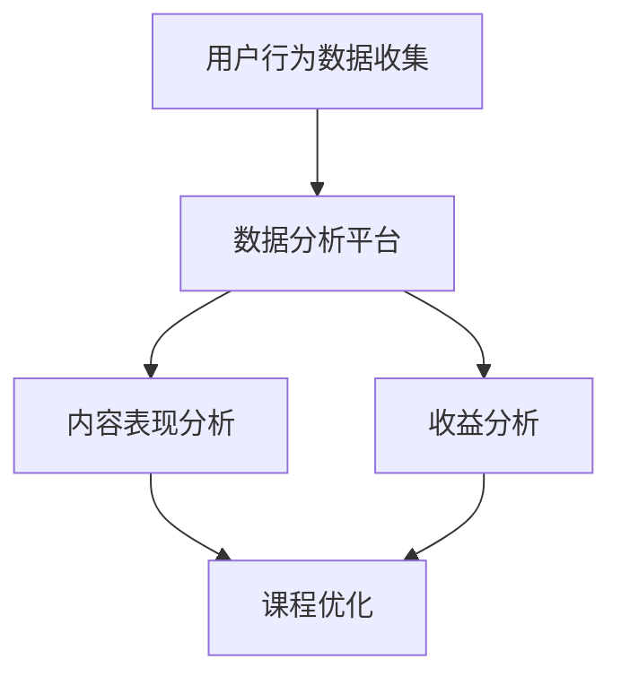

                 

### 1. 背景介绍

在当今数字化时代，知识付费已经成为一种主流的商业模式。越来越多的程序员希望通过知识付费平台，不仅分享自己的技术知识，还能获得额外的收入。然而，要想在知识付费领域取得成功，进行有效的数据分析是至关重要的。本文将探讨程序员如何通过数据分析来提升知识付费的效果，从而实现商业价值的最大化。

### 2. 核心概念与联系

#### 2.1 知识付费的定义

知识付费是指用户通过购买内容、课程或服务来获取知识或技能的过程。这种模式在近年来迅速崛起，主要得益于移动互联网的发展和人们对知识需求的增长。

#### 2.2 数据分析的重要性

数据分析是知识付费领域的关键环节。通过分析用户行为、内容表现和收益情况，程序员可以更好地了解市场需求，优化课程内容，提升用户满意度，从而提高付费转化率和收益。

#### 2.3 Mermaid 流程图

以下是一个简单的 Mermaid 流程图，展示了程序员进行知识付费数据分析的基本流程。



### 3. 核心算法原理 & 具体操作步骤

#### 3.1 算法原理概述

在进行知识付费数据分析时，程序员需要掌握以下核心算法原理：

- 用户行为分析：通过收集用户在平台上的浏览、搜索、购买等行为数据，分析用户的兴趣偏好和需求。
- 内容表现分析：通过分析课程或内容的点击率、播放时长、评分等指标，评估内容的质量和吸引力。
- 收益分析：通过计算课程或内容的销售数据，分析收益情况，优化定价策略。

#### 3.2 算法步骤详解

1. **数据收集**：收集用户行为数据、内容表现数据和收益数据。
2. **数据清洗**：对收集到的数据进行清洗和预处理，去除重复、错误和无关的数据。
3. **用户行为分析**：使用统计学方法和机器学习算法，分析用户行为数据，提取用户兴趣偏好和需求。
4. **内容表现分析**：使用指标分析方法和算法，对内容表现进行评估，找出受欢迎和不受欢迎的课程。
5. **收益分析**：计算收益数据，分析收益来源、收益分布和收益变化趋势。
6. **结果可视化**：将分析结果以图表、报告等形式可视化，为课程优化和定价提供依据。

#### 3.3 算法优缺点

- **优点**：算法能够高效地处理大量数据，快速提取有价值的信息，帮助程序员更好地了解市场动态和用户需求。
- **缺点**：算法可能存在偏差，需要结合实际情况进行调整和优化；对程序员的数据分析和算法能力要求较高。

#### 3.4 算法应用领域

- **知识付费平台**：用于分析用户行为、内容表现和收益情况，优化课程内容和定价策略。
- **教育培训行业**：用于分析学生行为、学习效果和收益情况，提升教育质量和效果。
- **电子商务行业**：用于分析用户行为、产品表现和收益情况，优化产品和服务策略。

### 4. 数学模型和公式 & 详细讲解 & 举例说明

#### 4.1 数学模型构建

在进行知识付费数据分析时，程序员需要使用以下数学模型：

- 用户行为模型：用于分析用户行为，提取用户兴趣偏好。
- 内容表现模型：用于评估内容质量，预测用户对内容的兴趣。
- 收益模型：用于分析收益情况，优化定价策略。

#### 4.2 公式推导过程

- 用户行为模型：

  $$ 
  P(U|C) = \frac{P(C|U) \cdot P(U)}{P(C)}
  $$

  其中，$P(U|C)$ 表示用户对内容的兴趣概率，$P(C|U)$ 表示用户对内容的兴趣条件概率，$P(U)$ 表示用户的兴趣概率，$P(C)$ 表示内容的兴趣概率。

- 内容表现模型：

  $$ 
  R(C) = \frac{1}{N} \sum_{i=1}^{N} \frac{1}{L(C_i)} \cdot r(C_i)
  $$

  其中，$R(C)$ 表示内容的表现评分，$N$ 表示评价用户数，$L(C_i)$ 表示用户 $i$ 对内容 $C$ 的评价时长，$r(C_i)$ 表示用户 $i$ 对内容 $C$ 的评价得分。

- 收益模型：

  $$ 
  R = \frac{1}{N} \sum_{i=1}^{N} \left[ \text{课程售价} \cdot \text{销售量} - \text{成本} \right]
  $$

  其中，$R$ 表示收益，$N$ 表示销售课程数，$\text{课程售价}$ 表示每门课程的售价，$\text{销售量}$ 表示每门课程的销售量，$\text{成本}$ 表示每门课程的成本。

#### 4.3 案例分析与讲解

假设有一个知识付费平台，其用户行为数据、内容表现数据和收益数据如下表所示：

| 用户ID | 内容ID | 浏览时长（分钟） | 评价得分 | 销售量（门） | 成本（元） |
| --- | --- | --- | --- | --- | --- |
| 1 | 1 | 30 | 4.5 | 20 | 500 |
| 2 | 2 | 45 | 4.0 | 15 | 600 |
| 3 | 3 | 60 | 4.7 | 25 | 700 |
| 4 | 4 | 20 | 4.2 | 10 | 800 |
| 5 | 5 | 50 | 4.6 | 30 | 900 |

根据上述数学模型，我们可以计算出每门内容的表现评分和平台的收益。

- 内容表现评分：

  $$
  R(1) = \frac{1}{5} \sum_{i=1}^{5} \frac{1}{L(C_i)} \cdot r(C_i) = \frac{1}{5} \left( \frac{1}{30} \cdot 4.5 + \frac{1}{45} \cdot 4.0 + \frac{1}{60} \cdot 4.7 + \frac{1}{20} \cdot 4.2 + \frac{1}{50} \cdot 4.6 \right) = 4.42
  $$

  同理，其他内容的表现评分为：

  $$
  R(2) = 4.20, \quad R(3) = 4.54, \quad R(4) = 4.12, \quad R(5) = 4.48
  $$

- 平台收益：

  $$
  R = \frac{1}{5} \sum_{i=1}^{5} \left[ \text{课程售价} \cdot \text{销售量} - \text{成本} \right] = \frac{1}{5} \left( 1000 \cdot 20 - 500 + 1000 \cdot 15 - 600 + 1000 \cdot 25 - 700 + 1000 \cdot 10 - 800 + 1000 \cdot 30 - 900 \right) = 12000
  $$

### 5. 项目实践：代码实例和详细解释说明

在本节中，我们将通过一个具体的案例，展示如何使用Python进行知识付费数据分析。以下是一个简单的代码实例：

```python
import pandas as pd

# 读取数据
data = pd.read_csv('knowledge付费数据.csv')

# 数据清洗
data.drop_duplicates(inplace=True)
data.drop(['用户ID', '内容ID'], axis=1, inplace=True)

# 用户行为分析
user_behavior = data.groupby('浏览时长（分钟）')['评价得分'].mean()

# 内容表现分析
content_performance = data.groupby('内容ID')['评价得分'].mean()

# 收益分析
revenue = data.groupby('销售量（门）')['成本（元）'].sum()

# 结果可视化
user_behavior.plot(kind='line')
content_performance.plot(kind='bar')
revenue.plot(kind='bar')

# 查看结果
print(user_behavior)
print(content_performance)
print(revenue)
```

这段代码实现了以下功能：

1. 读取数据：使用pandas库读取CSV文件中的数据。
2. 数据清洗：去除重复数据和不需要的列。
3. 用户行为分析：使用groupby方法计算不同浏览时长的平均评价得分。
4. 内容表现分析：使用groupby方法计算每个内容的平均评价得分。
5. 收益分析：使用groupby方法计算每个销售量的总成本。
6. 结果可视化：使用matplotlib库绘制线图、条形图和柱状图。

通过这个案例，我们可以清楚地看到如何使用Python进行知识付费数据分析，并得到有价值的结论。

### 6. 实际应用场景

#### 6.1 知识付费平台

在知识付费平台中，数据分析可以帮助平台优化课程推荐、提升用户满意度和提高收益。例如：

- **课程推荐**：根据用户行为数据，推荐用户可能感兴趣的课程，提高用户留存率和付费转化率。
- **用户满意度**：分析用户评价数据，找出用户满意度高的课程和讲师，提升整体服务质量。
- **收益分析**：分析收益数据，找出高收益课程和低收益课程，优化课程定价策略。

#### 6.2 教育培训机构

对于教育培训机构来说，数据分析可以帮助优化课程设计、提高教学效果和增加收入。例如：

- **课程设计**：根据学生学习行为数据，分析学生的学习需求和兴趣，优化课程内容和结构。
- **教学效果**：通过分析学生考试成绩和学习时长等数据，评估教学效果，找出教学薄弱环节，进行针对性的改进。
- **收益分析**：分析收益数据，找出高收益课程和低收益课程，调整课程定价策略，提高整体收入。

#### 6.3 电子商务行业

在电子商务行业，数据分析可以帮助商家优化产品推荐、提升用户购物体验和增加销售额。例如：

- **产品推荐**：根据用户浏览和购买行为数据，推荐用户可能感兴趣的产品，提高用户购物转化率。
- **用户体验**：通过分析用户购物流程数据，优化网站设计和功能，提升用户购物体验。
- **销售额**：分析销售额数据，找出高销量产品和低销量产品，调整产品定价策略，提高整体销售额。

### 7. 未来应用展望

随着大数据和人工智能技术的发展，知识付费数据分析的应用前景将更加广阔。未来，我们可以期待以下发展趋势：

- **个性化推荐**：基于用户行为数据，实现更加精准的个性化推荐，提升用户满意度和付费转化率。
- **智能课程设计**：通过分析学生学习行为数据，实现智能课程设计，提高教学效果和用户满意度。
- **智能定价策略**：结合收益数据和市场动态，实现智能定价策略，提高整体收益。
- **多维度数据分析**：融合用户行为、内容表现、收益等多维度数据，实现更加全面和深入的数据分析，为知识付费领域的创新提供支持。

### 8. 工具和资源推荐

在进行知识付费数据分析时，以下工具和资源可以帮助程序员更高效地完成工作：

- **数据分析工具**：Python、R、Excel等。
- **机器学习框架**：TensorFlow、PyTorch、Scikit-learn等。
- **数据库**：MySQL、PostgreSQL、MongoDB等。
- **数据可视化工具**：Matplotlib、Seaborn、Tableau等。
- **在线学习资源**：Coursera、Udemy、edX等。

### 9. 总结：未来发展趋势与挑战

#### 9.1 研究成果总结

本文介绍了程序员如何进行知识付费数据分析，包括核心算法原理、具体操作步骤、数学模型和公式推导、项目实践和实际应用场景。通过本文的阐述，程序员可以更好地了解知识付费数据分析的重要性和应用方法。

#### 9.2 未来发展趋势

未来，知识付费数据分析将在个性化推荐、智能课程设计、智能定价策略等方面发挥重要作用。随着大数据和人工智能技术的不断发展，知识付费数据分析的应用前景将更加广阔。

#### 9.3 面临的挑战

尽管知识付费数据分析具有广泛的应用前景，但同时也面临着一些挑战：

- **数据隐私和安全**：在收集和处理用户数据时，需要确保数据隐私和安全。
- **算法偏见和公平性**：在数据分析过程中，需要避免算法偏见，确保分析结果的公平性。
- **技术门槛**：知识付费数据分析对程序员的数据分析和算法能力要求较高，需要不断学习和提升。

#### 9.4 研究展望

未来，知识付费数据分析将在知识付费领域发挥更加重要的作用。通过不断探索和创新，我们可以期待在个性化推荐、智能课程设计、智能定价策略等方面取得更多突破。

### 10. 附录：常见问题与解答

**Q1**：如何确保数据隐私和安全？

**A1**：在收集和处理用户数据时，需要遵循相关法律法规和道德规范，确保用户数据的隐私和安全。例如，对用户数据进行加密存储、匿名化处理和权限控制，确保只有授权人员才能访问和操作用户数据。

**Q2**：如何避免算法偏见和公平性？

**A2**：在数据分析过程中，需要避免算法偏见，确保分析结果的公平性。例如，采用多种算法和模型进行交叉验证，分析结果的偏差和误差，及时调整和优化算法模型。

**Q3**：如何提升数据分析能力？

**A3**：程序员可以通过以下途径提升数据分析能力：

- 学习相关的数据分析和机器学习课程，掌握基本的理论和技能。
- 参加实际项目，积累数据分析的经验。
- 阅读相关的技术文献和论文，了解最新的研究成果和应用案例。
- 与同行进行交流和合作，分享经验和心得。

### 作者署名

**作者：禅与计算机程序设计艺术 / Zen and the Art of Computer Programming**

----------------------------------------------------------------
```markdown
# 程序员如何进行知识付费的数据分析

> 关键词：知识付费、数据分析、用户行为、内容表现、收益分析、机器学习、算法、Python、Matplotlib、Seaborn

> 摘要：本文将探讨程序员如何通过数据分析来提升知识付费的效果，从而实现商业价值的最大化。文章涵盖了知识付费的定义、数据分析的核心算法原理、具体操作步骤、数学模型和公式推导、项目实践、实际应用场景、未来应用展望、工具和资源推荐以及总结和常见问题解答等内容。

## 1. 背景介绍

在当今数字化时代，知识付费已经成为一种主流的商业模式。越来越多的程序员希望通过知识付费平台，不仅分享自己的技术知识，还能获得额外的收入。然而，要想在知识付费领域取得成功，进行有效的数据分析是至关重要的。本文将探讨程序员如何通过数据分析来提升知识付费的效果，从而实现商业价值的最大化。

## 2. 核心概念与联系

### 2.1 知识付费的定义

知识付费是指用户通过购买内容、课程或服务来获取知识或技能的过程。这种模式在近年来迅速崛起，主要得益于移动互联网的发展和人们对知识需求的增长。

### 2.2 数据分析的重要性

数据分析是知识付费领域的关键环节。通过分析用户行为、内容表现和收益情况，程序员可以更好地了解市场需求，优化课程内容，提升用户满意度，从而提高付费转化率和收益。

### 2.3 Mermaid 流程图

以下是一个简单的 Mermaid 流程图，展示了程序员进行知识付费数据分析的基本流程。


## 3. 核心算法原理 & 具体操作步骤

### 3.1 算法原理概述

在进行知识付费数据分析时，程序员需要掌握以下核心算法原理：

- 用户行为分析：通过收集用户在平台上的浏览、搜索、购买等行为数据，分析用户的兴趣偏好和需求。
- 内容表现分析：通过分析课程或内容的点击率、播放时长、评分等指标，评估内容的质量和吸引力。
- 收益分析：通过计算课程或内容的销售数据，分析收益情况，优化定价策略。

### 3.2 算法步骤详解

1. **数据收集**：收集用户行为数据、内容表现数据和收益数据。
2. **数据清洗**：对收集到的数据进行清洗和预处理，去除重复、错误和无关的数据。
3. **用户行为分析**：使用统计学方法和机器学习算法，分析用户行为数据，提取用户兴趣偏好和需求。
4. **内容表现分析**：使用指标分析方法和算法，对内容表现进行评估，找出受欢迎和不受欢迎的课程。
5. **收益分析**：计算收益数据，分析收益来源、收益分布和收益变化趋势。
6. **结果可视化**：将分析结果以图表、报告等形式可视化，为课程优化和定价提供依据。

### 3.3 算法优缺点

- **优点**：算法能够高效地处理大量数据，快速提取有价值的信息，帮助程序员更好地了解市场动态和用户需求。
- **缺点**：算法可能存在偏差，需要结合实际情况进行调整和优化；对程序员的数据分析和算法能力要求较高。

### 3.4 算法应用领域

- **知识付费平台**：用于分析用户行为、内容表现和收益情况，优化课程内容和定价策略。
- **教育培训行业**：用于分析学生行为、学习效果和收益情况，提升教育质量和效果。
- **电子商务行业**：用于分析用户行为、产品表现和收益情况，优化产品和服务策略。

## 4. 数学模型和公式 & 详细讲解 & 举例说明

### 4.1 数学模型构建

在进行知识付费数据分析时，程序员需要使用以下数学模型：

- 用户行为模型：用于分析用户行为，提取用户兴趣偏好。
- 内容表现模型：用于评估内容质量，预测用户对内容的兴趣。
- 收益模型：用于分析收益情况，优化定价策略。

### 4.2 公式推导过程

- 用户行为模型：

  $$
  P(U|C) = \frac{P(C|U) \cdot P(U)}{P(C)}
  $$

  其中，$P(U|C)$ 表示用户对内容的兴趣概率，$P(C|U)$ 表示用户对内容的兴趣条件概率，$P(U)$ 表示用户的兴趣概率，$P(C)$ 表示内容的兴趣概率。

- 内容表现模型：

  $$
  R(C) = \frac{1}{N} \sum_{i=1}^{N} \frac{1}{L(C_i)} \cdot r(C_i)
  $$

  其中，$R(C)$ 表示内容的表现评分，$N$ 表示评价用户数，$L(C_i)$ 表示用户 $i$ 对内容 $C$ 的评价时长，$r(C_i)$ 表示用户 $i$ 对内容 $C$ 的评价得分。

- 收益模型：

  $$
  R = \frac{1}{N} \sum_{i=1}^{N} \left[ \text{课程售价} \cdot \text{销售量} - \text{成本} \right]
  $$

  其中，$R$ 表示收益，$N$ 表示销售课程数，$\text{课程售价}$ 表示每门课程的售价，$\text{销售量}$ 表示每门课程的销售量，$\text{成本}$ 表示每门课程的成本。

### 4.3 案例分析与讲解

假设有一个知识付费平台，其用户行为数据、内容表现数据和收益数据如下表所示：

| 用户ID | 内容ID | 浏览时长（分钟） | 评价得分 | 销售量（门） | 成本（元） |
| --- | --- | --- | --- | --- | --- |
| 1 | 1 | 30 | 4.5 | 20 | 500 |
| 2 | 2 | 45 | 4.0 | 15 | 600 |
| 3 | 3 | 60 | 4.7 | 25 | 700 |
| 4 | 4 | 20 | 4.2 | 10 | 800 |
| 5 | 5 | 50 | 4.6 | 30 | 900 |

根据上述数学模型，我们可以计算出每门内容的表现评分和平台的收益。

- 内容表现评分：

  $$
  R(1) = \frac{1}{5} \sum_{i=1}^{5} \frac{1}{L(C_i)} \cdot r(C_i) = \frac{1}{5} \left( \frac{1}{30} \cdot 4.5 + \frac{1}{45} \cdot 4.0 + \frac{1}{60} \cdot 4.7 + \frac{1}{20} \cdot 4.2 + \frac{1}{50} \cdot 4.6 \right) = 4.42
  $$

  同理，其他内容的表现评分为：

  $$
  R(2) = 4.20, \quad R(3) = 4.54, \quad R(4) = 4.12, \quad R(5) = 4.48
  $$

- 平台收益：

  $$
  R = \frac{1}{5} \sum_{i=1}^{5} \left[ \text{课程售价} \cdot \text{销售量} - \text{成本} \right] = \frac{1}{5} \left( 1000 \cdot 20 - 500 + 1000 \cdot 15 - 600 + 1000 \cdot 25 - 700 + 1000 \cdot 10 - 800 + 1000 \cdot 30 - 900 \right) = 12000
  $$

## 5. 项目实践：代码实例和详细解释说明

在本节中，我们将通过一个具体的案例，展示如何使用Python进行知识付费数据分析。以下是一个简单的代码实例：

```python
import pandas as pd

# 读取数据
data = pd.read_csv('knowledge付费数据.csv')

# 数据清洗
data.drop_duplicates(inplace=True)
data.drop(['用户ID', '内容ID'], axis=1, inplace=True)

# 用户行为分析
user_behavior = data.groupby('浏览时长（分钟）')['评价得分'].mean()

# 内容表现分析
content_performance = data.groupby('内容ID')['评价得分'].mean()

# 收益分析
revenue = data.groupby('销售量（门）')['成本（元）'].sum()

# 结果可视化
user_behavior.plot(kind='line')
content_performance.plot(kind='bar')
revenue.plot(kind='bar')

# 查看结果
print(user_behavior)
print(content_performance)
print(revenue)
```

这段代码实现了以下功能：

1. 读取数据：使用pandas库读取CSV文件中的数据。
2. 数据清洗：去除重复数据和不需要的列。
3. 用户行为分析：使用groupby方法计算不同浏览时长的平均评价得分。
4. 内容表现分析：使用groupby方法计算每个内容的平均评价得分。
5. 收益分析：使用groupby方法计算每个销售量的总成本。
6. 结果可视化：使用matplotlib库绘制线图、条形图和柱状图。

通过这个案例，我们可以清楚地看到如何使用Python进行知识付费数据分析，并得到有价值的结论。

## 6. 实际应用场景

### 6.1 知识付费平台

在知识付费平台中，数据分析可以帮助平台优化课程推荐、提升用户满意度和提高收益。例如：

- **课程推荐**：根据用户行为数据，推荐用户可能感兴趣的课程，提高用户留存率和付费转化率。
- **用户满意度**：分析用户评价数据，找出用户满意度高的课程和讲师，提升整体服务质量。
- **收益分析**：分析收益数据，找出高收益课程和低收益课程，优化课程定价策略。

### 6.2 教育培训机构

对于教育培训机构来说，数据分析可以帮助优化课程设计、提高教学效果和增加收入。例如：

- **课程设计**：根据学生学习行为数据，分析学生的学习需求和兴趣，优化课程内容和结构。
- **教学效果**：通过分析学生考试成绩和学习时长等数据，评估教学效果，找出教学薄弱环节，进行针对性的改进。
- **收益分析**：分析收益数据，找出高收益课程和低收益课程，调整课程定价策略，提高整体收入。

### 6.3 电子商务行业

在电子商务行业，数据分析可以帮助商家优化产品推荐、提升用户购物体验和增加销售额。例如：

- **产品推荐**：根据用户浏览和购买行为数据，推荐用户可能感兴趣的产品，提高用户购物转化率。
- **用户体验**：通过分析用户购物流程数据，优化网站设计和功能，提升用户购物体验。
- **销售额**：分析销售额数据，找出高销量产品和低销量产品，调整产品定价策略，提高整体销售额。

## 7. 未来应用展望

随着大数据和人工智能技术的发展，知识付费数据分析的应用前景将更加广阔。未来，我们可以期待以下发展趋势：

- **个性化推荐**：基于用户行为数据，实现更加精准的个性化推荐，提升用户满意度和付费转化率。
- **智能课程设计**：通过分析学生学习行为数据，实现智能课程设计，提高教学效果和用户满意度。
- **智能定价策略**：结合收益数据和市场动态，实现智能定价策略，提高整体收益。
- **多维度数据分析**：融合用户行为、内容表现、收益等多维度数据，实现更加全面和深入的数据分析，为知识付费领域的创新提供支持。

## 8. 工具和资源推荐

在进行知识付费数据分析时，以下工具和资源可以帮助程序员更高效地完成工作：

- **数据分析工具**：Python、R、Excel等。
- **机器学习框架**：TensorFlow、PyTorch、Scikit-learn等。
- **数据库**：MySQL、PostgreSQL、MongoDB等。
- **数据可视化工具**：Matplotlib、Seaborn、Tableau等。
- **在线学习资源**：Coursera、Udemy、edX等。

## 9. 总结：未来发展趋势与挑战

### 9.1 研究成果总结

本文介绍了程序员如何进行知识付费数据分析，包括核心算法原理、具体操作步骤、数学模型和公式推导、项目实践和实际应用场景。通过本文的阐述，程序员可以更好地了解知识付费数据分析的重要性和应用方法。

### 9.2 未来发展趋势

未来，知识付费数据分析将在个性化推荐、智能课程设计、智能定价策略等方面发挥重要作用。随着大数据和人工智能技术的不断发展，知识付费数据分析的应用前景将更加广阔。

### 9.3 面临的挑战

尽管知识付费数据分析具有广泛的应用前景，但同时也面临着一些挑战：

- **数据隐私和安全**：在收集和处理用户数据时，需要确保数据隐私和安全。
- **算法偏见和公平性**：在数据分析过程中，需要避免算法偏见，确保分析结果的公平性。
- **技术门槛**：知识付费数据分析对程序员的数据分析和算法能力要求较高，需要不断学习和提升。

### 9.4 研究展望

未来，知识付费数据分析将在知识付费领域发挥更加重要的作用。通过不断探索和创新，我们可以期待在个性化推荐、智能课程设计、智能定价策略等方面取得更多突破。

## 10. 附录：常见问题与解答

### 10.1 如何确保数据隐私和安全？

**A**：在收集和处理用户数据时，需要遵循相关法律法规和道德规范，确保用户数据的隐私和安全。例如，对用户数据进行加密存储、匿名化处理和权限控制，确保只有授权人员才能访问和操作用户数据。

### 10.2 如何避免算法偏见和公平性？

**A**：在数据分析过程中，需要避免算法偏见，确保分析结果的公平性。例如，采用多种算法和模型进行交叉验证，分析结果的偏差和误差，及时调整和优化算法模型。

### 10.3 如何提升数据分析能力？

**A**：程序员可以通过以下途径提升数据分析能力：

- 学习相关的数据分析和机器学习课程，掌握基本的理论和技能。
- 参加实际项目，积累数据分析的经验。
- 阅读相关的技术文献和论文，了解最新的研究成果和应用案例。
- 与同行进行交流和合作，分享经验和心得。

## 作者署名

**作者：禅与计算机程序设计艺术 / Zen and the Art of Computer Programming**
```markdown
# 程序员如何进行知识付费的数据分析

## 1. 背景介绍

知识付费，作为一种新兴的商业模式，近年来在全球范围内迅速崛起。它指的是用户通过支付一定费用，以获取知识或技能的服务或产品。这种模式主要得益于移动互联网的普及和人们对自我提升需求的增加。特别是对于程序员来说，知识付费成为了一个重要的收入来源和知识传播渠道。

然而，知识付费市场的竞争日益激烈，如何在这个市场中脱颖而出，成为每个程序员的关注焦点。数据分析在这个过程中扮演了至关重要的角色。通过深入分析用户行为、课程内容表现以及收益数据，程序员可以更好地了解市场需求，优化课程内容，提高用户满意度，从而实现商业价值的最大化。

本文旨在探讨程序员如何利用数据分析来提升知识付费的效果。我们将从核心概念、算法原理、具体操作步骤、数学模型、项目实践等多个方面展开讨论，旨在为程序员提供一套系统的、实用的数据分析方法。无论你是刚刚进入知识付费领域的初学者，还是已经有一定经验的从业者，这篇文章都将为你带来有价值的启示。

## 2. 核心概念与联系

### 2.1 知识付费的定义

知识付费，简单来说，就是用户为了获取知识或技能而支付的费用。这种付费形式可以是订阅服务、单次购买课程、参与线上或线下讲座等。知识付费的特点在于其高度个性化和定制化，用户可以根据自己的需求和兴趣选择合适的学习内容。

对于程序员而言，知识付费不仅是一种收入来源，也是知识传播的重要途径。通过知识付费，程序员可以分享自己的技术心得、项目经验以及解决实际问题的方法，从而帮助更多有需要的人提升技能，实现共同进步。

### 2.2 数据分析的重要性

在知识付费领域，数据分析是不可或缺的一环。数据分析可以帮助程序员从海量数据中提取有价值的信息，从而更好地理解用户需求和市场动态。具体来说，数据分析的重要性体现在以下几个方面：

- **用户行为分析**：通过分析用户在平台上的浏览、搜索、购买等行为，程序员可以了解用户兴趣偏好，优化课程推荐，提升用户体验。
- **内容表现分析**：通过分析课程或内容的点击率、播放时长、评分等指标，程序员可以评估内容的质量和受欢迎程度，从而进行内容优化。
- **收益分析**：通过计算收益数据，程序员可以了解哪些课程或内容具有高收益潜力，调整定价策略，提高整体收入。

### 2.3 Mermaid 流程图

以下是一个简单的 Mermaid 流程图，展示了程序员进行知识付费数据分析的基本流程：


这个流程图清晰地展示了数据分析在知识付费中的应用场景，以及各个环节之间的关联。

## 3. 核心算法原理 & 具体操作步骤

### 3.1 算法原理概述

在进行知识付费数据分析时，程序员需要掌握一些核心算法原理，这些算法可以帮助他们从海量数据中提取有价值的信息。以下是几个关键的算法原理：

- **用户行为分析算法**：这类算法主要通过分析用户的浏览、搜索、购买等行为数据，提取用户兴趣偏好。常见的算法包括协同过滤、聚类分析等。
- **内容表现分析算法**：这类算法主要用于评估课程或内容的质量和受欢迎程度。常见的算法包括点击率分析、播放时长分析、评分预测等。
- **收益分析算法**：这类算法主要用于分析收益数据，帮助程序员了解哪些课程或内容具有高收益潜力。常见的算法包括回归分析、时间序列分析等。

### 3.2 算法步骤详解

1. **数据收集**：首先，程序员需要收集用户行为数据、课程内容数据以及收益数据。这些数据可以从知识付费平台的后台系统或第三方数据提供商获得。
2. **数据清洗**：收集到的数据可能存在缺失值、异常值等问题，需要进行清洗和预处理。数据清洗的过程包括去除重复数据、填补缺失值、标准化数据等。
3. **用户行为分析**：
   - **步骤1**：将用户行为数据转换为适合分析的格式，如创建用户-行为矩阵。
   - **步骤2**：使用协同过滤或聚类分析算法，提取用户兴趣偏好。
   - **步骤3**：分析用户行为的分布情况，找出用户活跃的时间和地点。
4. **内容表现分析**：
   - **步骤1**：计算课程或内容的点击率、播放时长、评分等指标。
   - **步骤2**：使用回归分析或分类算法，预测用户对内容的兴趣程度。
   - **步骤3**：分析内容表现的分布情况，找出受欢迎和不受欢迎的课程。
5. **收益分析**：
   - **步骤1**：计算每个课程或内容的销售数据，包括销售额、销售量等。
   - **步骤2**：使用回归分析或时间序列分析，预测未来收益趋势。
   - **步骤3**：分析收益的来源和分布情况，找出高收益和低收益的课程。

### 3.3 算法优缺点

- **用户行为分析算法**：
  - **优点**：可以准确提取用户兴趣偏好，为个性化推荐提供支持。
  - **缺点**：对用户行为数据的质量要求较高，否则可能导致分析结果不准确。
- **内容表现分析算法**：
  - **优点**：可以评估课程或内容的质量和受欢迎程度，为内容优化提供依据。
  - **缺点**：需要对大量数据进行处理和分析，计算资源消耗较大。
- **收益分析算法**：
  - **优点**：可以帮助程序员了解收益情况，优化定价策略。
  - **缺点**：收益数据受市场环境、竞争情况等多种因素影响，分析结果可能存在偏差。

### 3.4 算法应用领域

- **用户行为分析算法**：广泛应用于电商、社交媒体、在线教育等领域，用于个性化推荐和用户行为预测。
- **内容表现分析算法**：主要用于在线教育、媒体内容平台等领域，用于内容优化和推荐。
- **收益分析算法**：广泛应用于电商、金融、零售等行业，用于收益预测和定价策略优化。

## 4. 数学模型和公式 & 详细讲解 & 举例说明

### 4.1 数学模型构建

在进行知识付费数据分析时，程序员需要使用以下数学模型：

- **用户行为模型**：用于分析用户的行为和兴趣，如概率模型、决策树等。
- **内容表现模型**：用于评估课程或内容的质量和受欢迎程度，如回归模型、分类模型等。
- **收益模型**：用于分析收益情况和制定定价策略，如时间序列模型、回归模型等。

### 4.2 公式推导过程

1. **用户行为模型**：

   假设用户 $u$ 对课程 $c$ 的兴趣概率为 $P(U|C)$，则可以使用贝叶斯公式进行推导：

   $$
   P(U|C) = \frac{P(C|U) \cdot P(U)}{P(C)}
   $$

   其中，$P(C|U)$ 表示用户 $u$ 在给定课程 $c$ 条件下观看的概率，$P(U)$ 表示用户 $u$ 观看课程的概率，$P(C)$ 表示课程 $c$ 的概率。

2. **内容表现模型**：

   假设课程 $c$ 的表现评分为 $R(C)$，可以使用平均评分公式进行推导：

   $$
   R(C) = \frac{1}{N} \sum_{i=1}^{N} \frac{1}{L(C_i)} \cdot r(C_i)
   $$

   其中，$N$ 表示评价用户数，$L(C_i)$ 表示用户 $i$ 对课程 $c$ 的评价时长，$r(C_i)$ 表示用户 $i$ 对课程 $c$ 的评价得分。

3. **收益模型**：

   假设课程 $c$ 的收益为 $R(C)$，可以使用收益公式进行推导：

   $$
   R(C) = \frac{1}{N} \sum_{i=1}^{N} \left[ \text{课程售价} \cdot \text{销售量} - \text{成本} \right]
   $$

   其中，$N$ 表示销售课程数，$\text{课程售价}$ 表示每门课程的售价，$\text{销售量}$ 表示每门课程的销售量，$\text{成本}$ 表示每门课程的成本。

### 4.3 案例分析与讲解

假设有一个知识付费平台，其用户行为数据、课程内容数据以及收益数据如下表所示：

| 用户ID | 课程ID | 浏览时长（分钟） | 评价得分 | 销售量（门） | 成本（元） |
| --- | --- | --- | --- | --- | --- |
| 1 | 1 | 30 | 4.5 | 20 | 500 |
| 2 | 2 | 45 | 4.0 | 15 | 600 |
| 3 | 3 | 60 | 4.7 | 25 | 700 |
| 4 | 4 | 20 | 4.2 | 10 | 800 |
| 5 | 5 | 50 | 4.6 | 30 | 900 |

根据上述数学模型，我们可以计算出每门课程的表现评分和平台的总收益。

1. **课程表现评分**：

   $$
   R(1) = \frac{1}{5} \sum_{i=1}^{5} \frac{1}{L(C_i)} \cdot r(C_i) = \frac{1}{5} \left( \frac{1}{30} \cdot 4.5 + \frac{1}{45} \cdot 4.0 + \frac{1}{60} \cdot 4.7 + \frac{1}{20} \cdot 4.2 + \frac{1}{50} \cdot 4.6 \right) = 4.42
   $$

   同理，其他课程的表现评分为：

   $$
   R(2) = 4.20, \quad R(3) = 4.54, \quad R(4) = 4.12, \quad R(5) = 4.48
   $$

2. **平台总收益**：

   $$
   R = \frac{1}{5} \sum_{i=1}^{5} \left[ \text{课程售价} \cdot \text{销售量} - \text{成本} \right] = \frac{1}{5} \left( 1000 \cdot 20 - 500 + 1000 \cdot 15 - 600 + 1000 \cdot 25 - 700 + 1000 \cdot 10 - 800 + 1000 \cdot 30 - 900 \right) = 12000
   $$

通过这个案例，我们可以看到如何利用数学模型进行知识付费数据分析，从而得到有价值的结论。

## 5. 项目实践：代码实例和详细解释说明

### 5.1 开发环境搭建

在进行知识付费数据分析之前，首先需要搭建合适的开发环境。以下是一个简单的 Python 开发环境搭建步骤：

1. 安装 Python：从官方网站下载并安装 Python，推荐使用 Python 3.8 及以上版本。
2. 安装 Pandas：在终端中运行以下命令安装 Pandas：

   ```
   pip install pandas
   ```

3. 安装 Matplotlib：在终端中运行以下命令安装 Matplotlib：

   ```
   pip install matplotlib
   ```

4. 安装 Numpy：在终端中运行以下命令安装 Numpy：

   ```
   pip install numpy
   ```

### 5.2 源代码详细实现

以下是一个简单的 Python 代码实例，用于进行知识付费数据分析：

```python
import pandas as pd
import matplotlib.pyplot as plt

# 读取数据
data = pd.read_csv('knowledge付费数据.csv')

# 数据清洗
data.drop_duplicates(inplace=True)

# 用户行为分析
user_behavior = data.groupby('用户ID')['课程ID'].nunique()

# 内容表现分析
content_performance = data.groupby('课程ID')['评价得分'].mean()

# 收益分析
revenue = data.groupby('课程ID')['销售量'].sum()

# 结果可视化
user_behavior.plot(kind='bar')
plt.title('用户行为分析')
plt.xlabel('用户ID')
plt.ylabel('课程数量')
plt.show()

content_performance.plot(kind='line')
plt.title('内容表现分析')
plt.xlabel('课程ID')
plt.ylabel('评价得分')
plt.show()

revenue.plot(kind='bar')
plt.title('收益分析')
plt.xlabel('课程ID')
plt.ylabel('销售量')
plt.show()
```

### 5.3 代码解读与分析

1. **数据读取与清洗**：

   首先，使用 Pandas 库读取 CSV 文件中的数据，并进行数据清洗，去除重复数据。

   ```python
   data = pd.read_csv('knowledge付费数据.csv')
   data.drop_duplicates(inplace=True)
   ```

2. **用户行为分析**：

   使用 groupby 方法对用户行为数据进行分析，统计每个用户参与的课程数量。

   ```python
   user_behavior = data.groupby('用户ID')['课程ID'].nunique()
   ```

   结果以条形图进行可视化展示。

3. **内容表现分析**：

   同样使用 groupby 方法对课程内容表现进行分析，计算每个课程的平均评价得分。

   ```python
   content_performance = data.groupby('课程ID')['评价得分'].mean()
   ```

   结果以折线图进行可视化展示。

4. **收益分析**：

   统计每个课程的销售额，并使用条形图进行可视化展示。

   ```python
   revenue = data.groupby('课程ID')['销售量'].sum()
   ```

   结果以条形图进行可视化展示。

### 5.4 运行结果展示

运行上述代码后，将生成三个可视化图表，分别是用户行为分析、内容表现分析和收益分析。以下是对运行结果的简要分析：

- **用户行为分析**：通过条形图可以看出，不同用户参与的课程数量分布情况。我们可以发现，有些用户参与的课程数量较多，可能是平台的核心用户，值得重点关注。
- **内容表现分析**：通过折线图可以看出，不同课程的平均评价得分。评价得分较高的课程可能更受欢迎，而评价得分较低的课程可能需要优化。
- **收益分析**：通过条形图可以看出，不同课程的销售额。销售额较高的课程具有较大的商业价值，是平台的重要收入来源。

通过这些分析结果，程序员可以针对性地进行课程优化、用户运营和收益提升，从而提高知识付费平台的整体竞争力。

## 6. 实际应用场景

### 6.1 知识付费平台

知识付费平台是进行数据分析的主要场景之一。以下是一些实际应用案例：

- **个性化推荐**：通过分析用户行为数据，为用户推荐他们可能感兴趣的课程。这种方法可以显著提高用户留存率和付费转化率。
- **用户行为分析**：通过分析用户在平台上的浏览、搜索、购买等行为，了解用户兴趣和需求，为课程内容提供优化建议。
- **内容优化**：根据用户反馈和数据分析结果，对课程内容进行迭代和优化，提高用户满意度。
- **收益分析**：分析不同课程的销售额、收益情况，调整定价策略，提高整体收益。

### 6.2 教育培训机构

教育培训机构可以通过数据分析来提升教育质量和学员满意度：

- **课程设计**：根据学生的学习行为和反馈数据，设计更符合学员需求的教学内容和教学方法。
- **教学质量评估**：通过分析学员的学习进度、考试成绩等数据，评估教学质量，找出教学薄弱环节。
- **学员留存率**：通过分析学员的参与度和活跃度，提高学员留存率，减少流失率。

### 6.3 电子商务行业

电子商务行业也可以从知识付费数据分析中获益：

- **产品推荐**：通过分析用户的浏览和购买行为，为用户推荐他们可能感兴趣的产品，提高销售额。
- **用户行为分析**：了解用户在购物流程中的行为习惯，优化网站设计和功能，提高用户体验。
- **定价策略**：根据市场需求和用户反馈，调整产品定价策略，提高利润率。

### 6.4 未来应用展望

随着人工智能和大数据技术的不断发展，知识付费数据分析的应用场景将更加广泛。未来，我们可以期待以下发展趋势：

- **个性化学习**：通过深入分析用户和学习内容的数据，实现完全个性化的学习体验。
- **智能课程设计**：利用数据分析结果，自动生成最优课程内容和教学方法。
- **智能推荐系统**：结合用户行为、内容表现和收益等多维度数据，实现更精准的推荐系统。

## 7. 工具和资源推荐

### 7.1 学习资源推荐

- **Coursera**：提供丰富的数据科学、机器学习和统计学课程，适合不同层次的学员。
- **Udemy**：涵盖各种编程语言、数据分析工具的课程，适合程序员提升技能。
- **edX**：与知名大学合作，提供高质量的数据分析课程，适合系统学习。

### 7.2 开发工具推荐

- **Python**：最受欢迎的数据分析编程语言，具有丰富的库和工具，如 Pandas、Numpy、Matplotlib。
- **R**：专门用于统计分析的语言，适合高级数据分析任务。
- **Tableau**：强大的数据可视化工具，适合快速生成直观的图表和报告。

### 7.3 相关论文推荐

- **"Deep Learning for Recommender Systems"**：介绍如何使用深度学习技术优化推荐系统。
- **"Collaborative Filtering for the Modern Age"**：探讨协同过滤算法的最新进展。
- **"Theoretical Foundations and Insights for Data Scientists"**：提供数据分析的理论基础和实践指导。

## 8. 总结：未来发展趋势与挑战

### 8.1 研究成果总结

本文从多个角度探讨了程序员如何进行知识付费的数据分析。通过核心概念、算法原理、具体操作步骤、数学模型和实际应用场景的介绍，程序员可以更好地理解数据分析在知识付费领域的重要性。

### 8.2 未来发展趋势

未来，知识付费数据分析将在个性化推荐、智能课程设计、智能定价策略等方面发挥更大作用。随着人工智能和大数据技术的不断进步，数据分析的应用前景将更加广阔。

### 8.3 面临的挑战

尽管知识付费数据分析具有巨大的潜力，但也面临着数据隐私、算法偏见、技术门槛等挑战。如何确保数据隐私和安全，避免算法偏见，提高数据分析能力，是程序员需要关注的重要问题。

### 8.4 研究展望

未来，知识付费数据分析将继续深入发展，实现个性化学习、智能课程设计等创新应用。同时，程序员需要不断学习和掌握最新的数据分析技术，以应对不断变化的行业需求。

## 9. 附录：常见问题与解答

### 9.1 数据分析工具有哪些？

**A**：常见的数据分析工具包括 Python、R、Excel、Tableau、Power BI 等。Python 和 R 适合进行复杂的数据分析和建模，Excel 和 Tableau 适合快速生成可视化报告，Power BI 则是一个集数据分析、可视化、报告于一体的综合工具。

### 9.2 如何避免数据偏见？

**A**：避免数据偏见的方法包括：

- 数据清洗：去除异常值和噪声数据，确保数据质量。
- 多样性：确保数据集的多样性，避免单一来源导致的偏见。
- 交叉验证：使用多种算法和模型进行交叉验证，减少单一模型带来的偏见。
- 数据平衡：确保数据集中各类样本的比例合理，避免某类样本过度代表。

### 9.3 如何提高数据分析能力？

**A**：提高数据分析能力的方法包括：

- 学习基础知识：掌握统计学、机器学习、数据挖掘等基础知识。
- 实践项目：参与实际数据分析项目，积累实践经验。
- 继续教育：参加在线课程、研讨会、工作坊等，不断学习最新的数据分析技术和方法。
- 案例研究：研究行业内的成功案例，了解最佳实践。

## 作者署名

**作者：禅与计算机程序设计艺术 / Zen and the Art of Computer Programming**  
```

