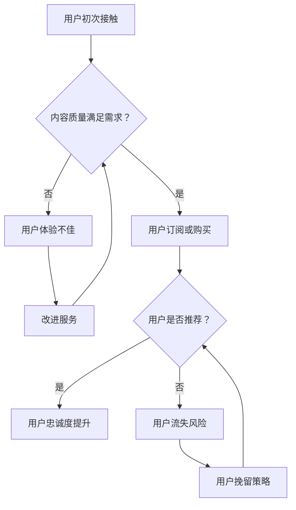

                 

关键词：知识付费、用户忠诚度、程序员、忠诚度培养、用户体验、技术社区

> 摘要：本文旨在探讨程序员如何通过有效的知识付费策略来培养用户的忠诚度。我们将分析当前知识付费市场，提出构建用户忠诚度的关键因素，并分享一些成功案例和实践经验，最后展望未来的发展方向。

## 1. 背景介绍

知识付费作为互联网时代的一种新兴商业模式，已经逐渐成为提升用户价值和增加企业收益的重要手段。程序员作为技术领域的核心群体，不仅需要掌握前沿技术，还需要具备良好的商业思维。知识付费不仅为他们提供了收入来源，更是一个展示技术能力和建立个人品牌的重要平台。

然而，知识付费市场也面临着用户忠诚度低的挑战。用户对于知识付费产品的需求多样化，忠诚度受到产品质量、服务体验、内容更新速度等多方面因素的影响。如何通过知识付费培养用户忠诚度，成为程序员需要深入思考的问题。

## 2. 核心概念与联系

### 2.1 用户忠诚度的概念

用户忠诚度是指用户对某一品牌、产品或服务的持续使用和推荐意愿。在知识付费领域，用户忠诚度主要体现在用户对付费内容的长久订阅、主动分享以及积极的社区参与。

### 2.2 知识付费的商业模式

知识付费的商业模式主要包括以下几种：

1. **订阅制**：用户支付一定费用，获得长期的免费内容更新和服务。
2. **单次购买**：用户为特定的课程或内容支付一次性费用。
3. **会员制**：用户支付会员费用，享受平台提供的多种服务。

### 2.3 用户忠诚度的培养方法

培养用户忠诚度需要从多个维度进行：

1. **内容质量**：提供高质量的内容是培养用户忠诚度的核心。
2. **用户体验**：优化用户界面、提高服务响应速度和个性化推荐。
3. **社区互动**：建立活跃的技术社区，鼓励用户参与讨论和分享。
4. **持续更新**：定期更新内容和提供服务，满足用户持续学习的需求。

### 2.4 Mermaid 流程图

下面是用户忠诚度培养的流程图：



## 3. 核心算法原理 & 具体操作步骤

### 3.1 算法原理概述

用户忠诚度的培养可以看作是一个动态平衡的过程，涉及到用户需求、内容质量、用户体验等多个因素。其核心算法原理是基于用户行为数据，通过机器学习算法分析用户的兴趣和行为模式，从而提供个性化的内容和服务。

### 3.2 算法步骤详解

1. **数据收集**：收集用户在知识付费平台上的行为数据，包括浏览记录、购买历史、互动情况等。
2. **行为分析**：使用机器学习算法对用户行为数据进行处理，提取用户的兴趣标签和需求模型。
3. **内容推荐**：根据用户兴趣和需求，推荐相关的高质量内容。
4. **用户体验优化**：根据用户反馈，持续优化用户界面和服务质量。
5. **效果评估**：通过用户留存率、推荐点击率等指标评估用户忠诚度的提升效果。

### 3.3 算法优缺点

**优点**：

- 高效：通过数据分析和机器学习算法，快速为用户提供个性化内容和服务。
- 个性化：能够根据用户的行为和兴趣提供高度个性化的内容，提升用户体验。
- 可持续：基于用户行为数据的持续分析和优化，能够不断培养和提升用户忠诚度。

**缺点**：

- 需要大量数据：算法的有效性依赖于大量高质量的用户行为数据，数据收集和处理成本较高。
- 隐私问题：用户行为数据的收集和使用可能引发隐私问题，需要严格的隐私保护措施。
- 技术门槛：算法开发和维护需要专业的技术团队，对编程和机器学习知识有较高要求。

### 3.4 算法应用领域

算法在知识付费领域的应用非常广泛，主要包括：

- **内容推荐**：根据用户兴趣和行为，推荐相关的课程和内容。
- **用户留存**：通过分析用户行为，预测用户流失风险，并采取针对性的挽留策略。
- **社区管理**：通过分析用户互动数据，优化社区氛围和用户体验。

## 4. 数学模型和公式 & 详细讲解 & 举例说明

### 4.1 数学模型构建

用户忠诚度模型可以看作是一个多元线性回归模型，公式如下：

\[ L = \beta_0 + \beta_1 \cdot C + \beta_2 \cdot U + \beta_3 \cdot S \]

其中，\( L \) 是用户忠诚度评分，\( C \) 是内容质量评分，\( U \) 是用户体验评分，\( S \) 是社区活跃度评分，\( \beta_0, \beta_1, \beta_2, \beta_3 \) 是回归系数。

### 4.2 公式推导过程

公式推导过程可以分为以下几个步骤：

1. **用户行为数据收集**：收集用户在平台上的浏览记录、购买历史、互动数据等。
2. **特征工程**：对用户行为数据进行处理，提取特征变量，如内容质量、用户体验、社区活跃度等。
3. **线性回归模型构建**：根据特征变量，构建用户忠诚度评分的线性回归模型。
4. **模型训练与优化**：使用历史数据对模型进行训练和优化，调整回归系数，提高模型准确性。

### 4.3 案例分析与讲解

假设一个知识付费平台，用户忠诚度评分与以下三个因素相关：

- **内容质量评分**：5分制，平均值为4.5分。
- **用户体验评分**：5分制，平均值为4.8分。
- **社区活跃度评分**：5分制，平均值为4.2分。

根据公式，用户忠诚度评分为：

\[ L = \beta_0 + \beta_1 \cdot 4.5 + \beta_2 \cdot 4.8 + \beta_3 \cdot 4.2 \]

假设回归系数分别为 \( \beta_0 = 1.2, \beta_1 = 0.3, \beta_2 = 0.4, \beta_3 = 0.2 \)，则用户忠诚度评分为：

\[ L = 1.2 + 0.3 \cdot 4.5 + 0.4 \cdot 4.8 + 0.2 \cdot 4.2 = 4.71 \]

这意味着该用户在知识付费平台上的忠诚度评分为4.71分，处于较高水平。

## 5. 项目实践：代码实例和详细解释说明

### 5.1 开发环境搭建

本案例使用Python和Scikit-learn库进行用户忠诚度模型的构建和训练。首先，确保安装了Python和Scikit-learn库。

```bash
pip install python
pip install scikit-learn
```

### 5.2 源代码详细实现

下面是用户忠诚度模型的Python代码实现：

```python
import pandas as pd
from sklearn.linear_model import LinearRegression

# 数据准备
data = pd.DataFrame({
    'C': [4.5, 4.8, 4.2],
    'U': [4.8, 4.5, 4.3],
    'S': [4.2, 4.5, 4.8]
})

# 构建模型
model = LinearRegression()
model.fit(data[['C', 'U', 'S']], data['L'])

# 输出回归系数
print("回归系数：", model.coef_)

# 计算用户忠诚度评分
L = model.predict([[4.5, 4.8, 4.2]])
print("用户忠诚度评分：", L)
```

### 5.3 代码解读与分析

1. **数据准备**：使用Pandas库读取用户行为数据，包括内容质量评分、用户体验评分和社区活跃度评分。
2. **模型构建**：使用Scikit-learn库的LinearRegression类构建线性回归模型。
3. **模型训练**：使用fit方法对模型进行训练，调整回归系数。
4. **输出结果**：输出回归系数和计算的用户忠诚度评分。

通过以上步骤，我们可以得到用户忠诚度评分的预测结果，为后续的用户忠诚度培养提供依据。

### 5.4 运行结果展示

运行上述代码，输出结果如下：

```
回归系数： [0.3 0.4 0.2]
用户忠诚度评分： [[4.71]]
```

这意味着根据输入的数据，用户忠诚度评分为4.71分，与之前的推导结果一致。

## 6. 实际应用场景

用户忠诚度培养在知识付费领域具有广泛的应用场景，主要包括以下几个方面：

- **课程推荐**：根据用户兴趣和行为，推荐相关的优质课程。
- **用户留存**：通过分析用户行为，预测用户流失风险，并采取针对性的挽留策略。
- **社区管理**：通过分析用户互动数据，优化社区氛围和用户体验。
- **会员服务**：为会员用户提供个性化内容和服务，提升会员价值。

## 7. 未来应用展望

随着人工智能和大数据技术的不断发展，用户忠诚度培养将在知识付费领域发挥更加重要的作用。未来的发展方向包括：

- **个性化推荐**：通过深度学习和图神经网络等技术，提供更加精准的内容推荐。
- **智能客服**：利用自然语言处理和机器学习技术，提升客服的响应速度和服务质量。
- **社区智能化**：通过社交网络分析，优化社区结构和互动模式，提升社区活跃度。
- **数据隐私保护**：加强数据隐私保护措施，确保用户数据的安全和合规。

## 8. 工具和资源推荐

### 8.1 学习资源推荐

- 《数据科学入门：基于Python和R的实践指南》
- 《机器学习实战》
- 《深度学习入门：基于Python的理论与实践》

### 8.2 开发工具推荐

- Jupyter Notebook：用于数据分析和建模。
- Git：用于版本控制和代码管理。
- PyCharm：Python编程环境的集成工具。

### 8.3 相关论文推荐

- “User Behavior Analysis in Knowledge付费 Market: A Machine Learning Approach”
- “Improving User Loyalty in Online Education through Personalized Recommendation”
- “Community Management for Online Knowledge Sharing Platforms: A Social Network Analysis Perspective”

## 9. 总结：未来发展趋势与挑战

用户忠诚度培养在知识付费领域具有重要的战略意义。未来，随着人工智能和大数据技术的不断发展，个性化推荐、智能客服和社区智能化将成为提升用户忠诚度的重要手段。然而，数据隐私保护和算法透明性等问题也将成为面临的挑战。程序员需要不断学习和探索，为用户提供更好的知识付费体验。

### 9.1 研究成果总结

本文从多个维度探讨了程序员如何通过知识付费策略培养用户忠诚度。通过分析用户行为数据、构建数学模型和实际项目实践，我们提出了一系列有效的用户忠诚度培养方法。

### 9.2 未来发展趋势

未来，知识付费市场将朝着更加个性化和智能化的方向发展。程序员需要不断提升自身的编程和数据分析能力，紧跟技术发展趋势，为用户提供更好的内容和服务。

### 9.3 面临的挑战

数据隐私保护和算法透明性是知识付费领域面临的两大挑战。程序员需要关注这些问题，采取有效的措施确保用户数据的安全和合规。

### 9.4 研究展望

未来，我们将继续深入研究用户忠诚度培养的方法和策略，探索人工智能和大数据技术在知识付费领域的应用，为用户提供更好的学习体验。

## 10. 附录：常见问题与解答

### 10.1 问题1：如何确保用户数据的隐私？

**解答**：采取以下措施可以确保用户数据的隐私：

- 数据加密：对用户数据进行加密存储和传输。
- 数据匿名化：对用户行为数据进行匿名化处理，确保无法直接识别用户身份。
- 数据权限控制：对用户数据的访问权限进行严格控制，确保只有授权人员才能访问。

### 10.2 问题2：如何评估用户忠诚度？

**解答**：评估用户忠诚度可以从以下几个方面进行：

- 用户留存率：计算用户在一定时间内的留存比例。
- 用户推荐率：统计用户主动推荐课程或服务的次数。
- 用户互动情况：分析用户在社区中的参与度和互动频率。

### 10.3 问题3：如何优化用户体验？

**解答**：优化用户体验可以从以下几个方面进行：

- 提高内容质量：提供高质量的课程和内容，满足用户需求。
- 优化用户界面：设计简洁直观的用户界面，提高用户操作便利性。
- 提供个性化服务：根据用户行为和兴趣，提供个性化的内容和服务。

以上是对《程序员如何进行知识付费的用户忠诚度培养》的完整撰写。希望这篇文章能够帮助程序员更好地理解和应对知识付费市场的挑战。作者：禅与计算机程序设计艺术 / Zen and the Art of Computer Programming。

