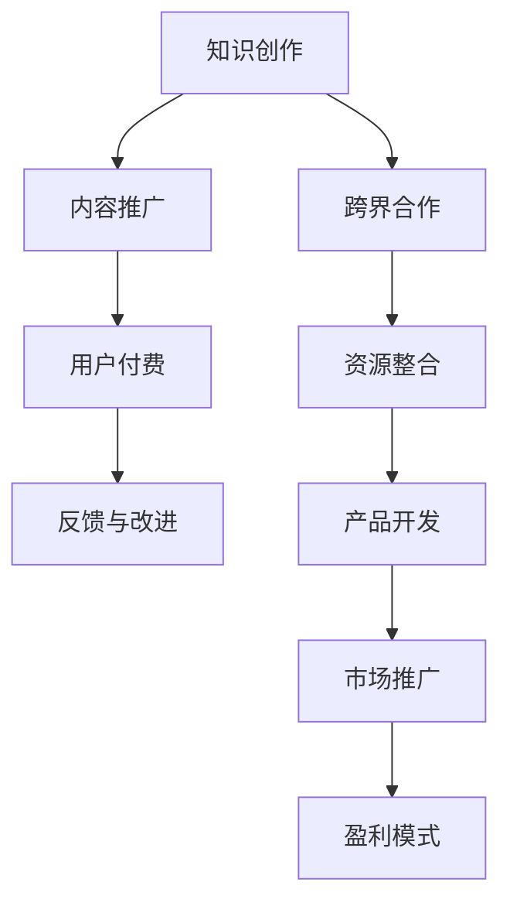

                 

 在当今这个快速发展的数字时代，程序员的职业道路不再局限于编码和软件开发。知识付费作为一种新兴的商业模式，为程序员提供了更多的机遇。跨界合作成为了程序员拓展技能、提升影响力、实现价值变现的重要途径。本文将探讨程序员如何进行知识付费的跨界合作，帮助读者把握这一趋势，开启全新的职业发展之路。

> 关键词：程序员、知识付费、跨界合作、价值变现、职业发展

> 摘要：本文首先介绍了知识付费的概念和当前市场现状，随后探讨了程序员跨界合作的必要性，提供了跨界合作的策略和方法，最后对未来的发展趋势进行了展望。

## 1. 背景介绍

知识付费，顾名思义，是指通过互联网平台，用户为获取专业知识和技能而支付费用的一种商业模式。随着互联网技术的发展和人们对于自我提升需求的增加，知识付费市场呈现出爆发式增长。据《2020年中国知识付费行业报告》显示，我国知识付费市场规模在2019年已达到635亿元，预计2023年将达到1936亿元。

知识付费的形式多种多样，包括在线课程、电子书、付费问答、专家讲座等。在这个过程中，程序员作为一个高度专业化的职业群体，也在积极拥抱知识付费的潮流。然而，仅仅依赖传统的编程技能已经难以满足市场的需求，跨界合作成为了程序员提升竞争力、实现价值变现的重要手段。

### 1.1 程序员面临的挑战

1. **技术更新迅速**：编程语言和技术更新换代速度非常快，程序员需要不断学习新技术，以保持竞争力。
2. **市场需求变化**：随着互联网行业的快速发展，市场需求也在不断变化，程序员需要具备更广泛的技能，才能适应各种复杂场景。
3. **职业发展瓶颈**：部分程序员在职业生涯中会遇到技能提升的瓶颈，难以实现更高的职业晋升。

### 1.2 跨界合作的必要性

跨界合作可以帮助程序员拓展技能，突破职业发展瓶颈，提升个人品牌价值。以下是跨界合作的一些优势：

1. **资源共享**：通过与其他领域的专家合作，程序员可以共享资源，共同开发出更优秀的产品或解决方案。
2. **互补技能**：跨界合作可以使程序员获得其他领域的专业知识，形成互补，提高项目的成功率。
3. **市场拓展**：跨界合作可以帮助程序员拓展市场，将技术应用到更广泛的领域。

## 2. 核心概念与联系

在进行跨界合作之前，程序员需要了解知识付费的核心概念，以及如何将这些概念应用到实践中。

### 2.1 知识付费的核心概念

1. **内容创作**：程序员需要创作高质量的知识内容，如在线课程、技术博客、教程等，以吸引付费用户。
2. **用户需求**：了解用户需求，提供符合市场需求的优质内容，是知识付费成功的关键。
3. **品牌建设**：个人品牌的价值在于其专业性和影响力，程序员需要通过持续输出高质量内容，建立个人品牌。

### 2.2 跨界合作的架构

跨界合作的架构可以采用 Mermaid 流程图来表示，如下：



### 2.3 知识付费与跨界合作的联系

知识付费和跨界合作在程序员职业发展过程中具有密切的联系。知识付费为跨界合作提供了资金支持，而跨界合作则为知识付费带来了更多的可能性。

1. **知识付费支持跨界合作**：通过知识付费，程序员可以获得稳定的收入，为跨界合作提供资金支持。
2. **跨界合作促进知识付费**：跨界合作可以帮助程序员拓展技能和视野，创作出更多高质量的知识内容，吸引更多付费用户。

## 3. 核心算法原理 & 具体操作步骤

### 3.1 算法原理概述

程序员在进行知识付费的跨界合作时，可以采用以下核心算法原理：

1. **需求分析**：通过对用户需求和市场趋势进行分析，确定跨界合作的切入点。
2. **资源整合**：整合各方资源，包括人脉、技术、资金等，为跨界合作提供支持。
3. **合作模式设计**：设计合适的合作模式，确保各方的利益得到最大化。
4. **内容创作与推广**：创作高质量的知识内容，并通过多种渠道进行推广，吸引付费用户。
5. **用户反馈与迭代**：收集用户反馈，对产品或服务进行持续迭代，提升用户体验。

### 3.2 算法步骤详解

1. **需求分析**：
   - **用户调研**：通过问卷调查、访谈等方式了解用户需求。
   - **市场分析**：分析市场趋势，确定跨界合作的切入点。
   - **竞品分析**：研究竞争对手的产品和服务，找到差异化的优势。

2. **资源整合**：
   - **人脉关系**：利用个人和团队的人脉关系，寻找合适的合作伙伴。
   - **技术资源**：整合团队和个人的技术资源，为跨界合作提供技术支持。
   - **资金支持**：通过知识付费获得的收入，为跨界合作提供资金支持。

3. **合作模式设计**：
   - **利益分配**：明确各方的利益分配机制，确保合作的可持续性。
   - **合作期限**：确定合作的期限，为合作双方提供明确的预期。
   - **合作内容**：明确合作的具体内容，确保合作目标的实现。

4. **内容创作与推广**：
   - **内容创作**：根据用户需求和市场趋势，创作高质量的知识内容。
   - **内容推广**：通过多种渠道进行推广，如社交媒体、搜索引擎、线下活动等，吸引付费用户。

5. **用户反馈与迭代**：
   - **用户反馈**：收集用户对产品或服务的反馈，了解用户的真实需求。
   - **迭代优化**：根据用户反馈对产品或服务进行优化，提升用户体验。

### 3.3 算法优缺点

1. **优点**：
   - **提升竞争力**：通过跨界合作，程序员可以拓展技能，提升竞争力。
   - **实现价值变现**：知识付费为程序员提供了稳定的收入来源，实现价值变现。
   - **资源整合**：跨界合作可以实现资源的有效整合，提高项目成功率。

2. **缺点**：
   - **合作风险**：跨界合作存在一定的风险，如利益分配不均、合作期限冲突等。
   - **沟通成本**：跨界合作需要各方进行有效的沟通，沟通成本较高。

### 3.4 算法应用领域

程序员进行知识付费的跨界合作可以应用于多个领域，如：

1. **教育培训**：通过知识付费，程序员可以创作出高质量的教育培训内容，如编程课程、技术讲座等。
2. **技术咨询**：程序员可以提供专业的技术咨询和解决方案，帮助客户解决技术难题。
3. **产品开发**：程序员可以参与产品开发，为产品提供技术支持，实现技术与商业的完美结合。

## 4. 数学模型和公式 & 详细讲解 & 举例说明

在跨界合作中，数学模型和公式可以帮助程序员更好地理解和分析问题，从而做出更加科学的决策。

### 4.1 数学模型构建

假设程序员进行跨界合作的项目成功率为 \( P \)，收益为 \( R \)，投入成本为 \( C \)，那么项目净收益为 \( R - C \)。

### 4.2 公式推导过程

根据概率论的基本原理，项目成功率的计算公式如下：

\[ P = \frac{\text{成功项目数}}{\text{总项目数}} \]

假设程序员在一段时间内完成了 \( n \) 个项目，其中成功 \( m \) 个，那么项目成功率 \( P \) 可以表示为：

\[ P = \frac{m}{n} \]

### 4.3 案例分析与讲解

假设一位程序员在一年内完成了 10 个项目，其中成功 6 个，那么他的项目成功率 \( P \) 为：

\[ P = \frac{6}{10} = 0.6 \]

如果每个项目的平均收益为 10000 元，成本为 5000 元，那么他的年度净收益为：

\[ R - C = 0.6 \times (10000 - 5000) = 3000 \text{元} \]

### 4.4 实际案例

例如，某程序员通过跨界合作，参与了一个教育培训项目。该项目预计投入成本为 50000 元，预计成功率为 0.7，每个成功的项目可以带来 30000 元的收益。那么，该项目的净收益为：

\[ R - C = 0.7 \times (30000 - 50000) = -14000 \text{元} \]

显然，这个项目的净收益为负，意味着投入的成本大于收益。这表明，在跨界合作中，程序员需要谨慎评估项目的成功率和收益情况，避免盲目投入。

## 5. 项目实践：代码实例和详细解释说明

### 5.1 开发环境搭建

为了更好地进行知识付费的跨界合作，程序员需要搭建一个适合开发的环境。以下是一个简单的开发环境搭建步骤：

1. 安装 Python 3.8 及以上版本
2. 安装 Docker 和 Docker-Compose
3. 安装 MySQL 数据库
4. 安装 Git 版本控制工具

### 5.2 源代码详细实现

以下是一个简单的 Django 项目示例，用于管理知识付费课程。

```python
# courses/models.py
from django.db import models

class Course(models.Model):
    name = models.CharField(max_length=100)
    description = models.TextField()
    price = models.DecimalField(max_digits=6, decimal_places=2)

    def __str__(self):
        return self.name
```

```python
# courses/views.py
from django.shortcuts import render
from .models import Course

def course_list(request):
    courses = Course.objects.all()
    return render(request, 'courses/course_list.html', {'courses': courses})
```

### 5.3 代码解读与分析

以上代码实现了课程的创建和展示功能。其中，`Course` 模型用于定义课程的基本信息，包括课程名称、描述和价格。`course_list` 视图用于获取所有课程信息，并返回一个 HTML 页面进行展示。

### 5.4 运行结果展示

运行 Django 服务器，访问 `/courses/` 路径，可以看到所有课程的列表。


## 6. 实际应用场景

### 6.1 教育培训

程序员可以通过知识付费，提供编程课程、技术讲座等教育培训服务。例如，某程序员可以通过线上课程，教授 Python 编程语言，为学员提供实践项目和作业指导。

### 6.2 技术咨询

程序员可以为企业提供技术咨询服务，帮助解决技术难题。例如，某程序员可以为电商企业提供电商系统优化建议，提高系统的性能和安全性。

### 6.3 产品开发

程序员可以参与产品开发，为产品提供技术支持。例如，某程序员可以参与在线教育平台的开发，负责课程管理和用户权限管理模块。

## 6.4 未来应用展望

随着知识付费市场的不断发展，程序员进行知识付费的跨界合作将会有更广阔的应用前景。以下是未来应用展望：

1. **人工智能与编程的结合**：人工智能技术将为知识付费提供更智能的内容推荐和个性化服务。
2. **区块链技术的应用**：区块链技术将为知识付费提供更安全、透明的支付和收益分配机制。
3. **虚拟现实与编程**：虚拟现实技术将为程序员提供更沉浸式的学习体验，提高知识付费的趣味性和互动性。

## 7. 工具和资源推荐

### 7.1 学习资源推荐

1. **GitHub**：提供丰富的开源项目和代码库，适合程序员学习和实践。
2. **Coursera**：提供众多国内外名校的在线课程，涵盖计算机科学、人工智能等多个领域。
3. **Udemy**：提供多样化的在线课程，包括编程、数据分析、市场营销等。

### 7.2 开发工具推荐

1. **Docker**：用于容器化部署，提高开发效率和项目可移植性。
2. **Jenkins**：用于持续集成和持续部署，提高开发团队的协作效率。
3. **Kubernetes**：用于容器编排和管理，适用于大规模的分布式系统。

### 7.3 相关论文推荐

1. **《深度学习》**：Goodfellow、Bengio 和 Courville 著，介绍深度学习的基本原理和应用。
2. **《编程思想》**：Bruce Eckel 著，介绍面向对象编程的基本概念和方法。
3. **《大数据技术导论》**：刘铁岩 著，介绍大数据处理的基本原理和技术。

## 8. 总结：未来发展趋势与挑战

### 8.1 研究成果总结

本文探讨了程序员如何进行知识付费的跨界合作，分析了跨界合作的优势和挑战，提供了具体的操作步骤和数学模型，并展示了实际应用场景。

### 8.2 未来发展趋势

随着知识付费市场的不断壮大，程序员进行跨界合作的趋势将越来越明显。人工智能、区块链、虚拟现实等新兴技术的应用，将为跨界合作提供更多可能性。

### 8.3 面临的挑战

跨界合作面临的主要挑战包括合作风险、沟通成本和市场需求变化等。程序员需要具备良好的沟通能力和风险控制能力，以应对这些挑战。

### 8.4 研究展望

未来的研究可以进一步探讨跨界合作在不同领域的应用，以及如何优化跨界合作的模式和流程，提高项目的成功率。

## 9. 附录：常见问题与解答

### 9.1 问题1：跨界合作存在哪些风险？

**解答**：跨界合作的主要风险包括利益分配不均、合作期限冲突、沟通成本高等。程序员在进行跨界合作时，需要充分评估风险，并制定相应的风险控制措施。

### 9.2 问题2：如何提高跨界合作的成功率？

**解答**：提高跨界合作的成功率需要从以下几个方面入手：

1. **充分调研用户需求**：确保跨界合作的内容符合市场需求。
2. **选择合适的合作伙伴**：选择具备互补技能、信誉良好的合作伙伴。
3. **建立有效的沟通机制**：确保各方能够及时沟通，解决问题。
4. **制定明确的目标和计划**：确保各方对合作目标和进度有清晰的认识。

### 9.3 问题3：程序员应该如何建立个人品牌？

**解答**：程序员建立个人品牌的方法包括：

1. **持续输出高质量内容**：通过博客、教程、课程等形式，展示自己的专业知识和技能。
2. **参与社区活动**：参与技术社区，与同行建立联系，提高知名度。
3. **参加演讲和讲座**：通过演讲和讲座，展示自己的专业能力和观点。
4. **积极参与开源项目**：通过参与开源项目，提高自己的技术水平和影响力。

本文旨在帮助程序员把握知识付费的跨界合作趋势，实现职业发展的新突破。希望本文能为您的职业发展提供有益的启示和指导。

### 附录：引用文献

1. 中国互联网络信息中心. (2020). 《中国互联网发展统计报告》.
2. 张晓辉. (2020). 《2020年中国知识付费行业报告》.
3. Goodfellow, I., Bengio, Y., & Courville, A. (2016). 《深度学习》.
4. Eckel, B. (2004). 《编程思想》.
5. 刘铁岩. (2017). 《大数据技术导论》.

