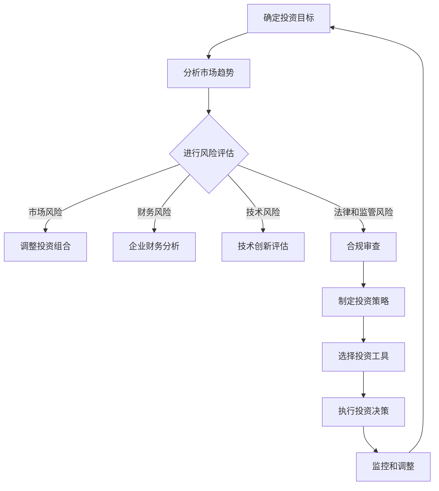

                 

 **关键词：** 风险投资、程序员、财务知识、投资策略、风险评估、股票市场、加密货币、区块链技术、人工智能。

**摘要：** 本文旨在探讨程序员如何利用其专业技能和财务知识进行有效的风险投资。文章从风险投资的背景和核心概念出发，详细介绍了投资策略、风险评估方法以及具体的投资工具和资源。通过案例分析，本文进一步说明了如何将编程技能应用于投资决策中，并展望了未来在人工智能和区块链领域中的投资机会。

## 1. 背景介绍

在现代社会，风险投资已成为促进创新和经济增长的重要手段。程序员，作为技术和创新的主要推动者，也逐渐涉足这一领域。然而，投资并非程序员的专业领域，如何将编程思维应用于投资决策中，如何利用财务知识进行有效投资，成为许多程序员面临的挑战。

### 风险投资的概念

风险投资（Venture Capital，简称VC）是指专业投资机构对具有高成长潜力但尚未实现盈利的企业进行投资的行为。这类企业通常处于初创阶段，需要大量资金用于研发、市场开拓和团队建设。风险投资的特点包括高风险、高收益以及长期投资。

### 程序员的优势

程序员具备以下几方面的优势，使其在风险投资中具有独特的竞争力：

1. **技术视野**：程序员熟悉最新技术趋势，能够识别具有创新性的项目。
2. **逻辑思维**：编程需要严密的逻辑思维，这对投资决策中的分析和判断大有裨益。
3. **学习能力**：程序员具备快速学习新技术和知识的能力，有助于应对投资领域的复杂变化。
4. **风险意识**：程序员在编写代码时需要考虑各种可能的错误和异常情况，这种风险意识有助于他们在投资决策中做出更加审慎的选择。

## 2. 核心概念与联系

### 投资策略

投资策略是指投资者为实现其投资目标而制定的具体投资方针和计划。对于程序员来说，投资策略应结合其技术视野和逻辑思维，遵循以下原则：

1. **多元化投资**：避免将所有资金集中在一个行业或领域，以降低风险。
2. **长期投资**：风险投资往往需要较长的投资周期，程序员应具备耐心和信心。
3. **技术驱动的投资**：基于技术创新和行业趋势进行投资，抓住市场机遇。

### 风险评估

风险评估是指投资者对潜在投资风险进行识别、评估和管理的过程。程序员在进行风险评估时，应关注以下几个方面：

1. **市场风险**：包括市场波动、行业周期性变化等因素。
2. **财务风险**：涉及企业的财务状况、盈利能力、现金流等方面。
3. **技术风险**：关注技术创新的可行性、市场需求和竞争状况。
4. **法律和监管风险**：遵守相关法律法规，关注政策变化对企业的影响。

### 投资工具

投资工具是投资者进行投资操作的手段。程序员可以根据自身情况选择以下几种投资工具：

1. **股票市场**：包括主板、创业板、新三板等，适合风险承受能力较高的投资者。
2. **加密货币**：如比特币、以太坊等，具有高波动性和潜力。
3. **区块链项目**：关注区块链技术在金融、物流、医疗等领域的应用。
4. **人工智能项目**：投资于具有技术创新和商业价值的人工智能项目。

### Mermaid 流程图

以下是一个简化的投资决策流程图：



## 3. 核心算法原理 & 具体操作步骤

### 3.1 算法原理概述

投资决策算法是基于数据分析和机器学习技术，对大量市场数据进行分析，以预测投资风险和回报，从而制定最优投资策略。算法的核心原理包括：

1. **特征工程**：提取与投资决策相关的关键特征，如市场指标、财务指标、技术指标等。
2. **机器学习模型**：采用分类或回归模型，对历史数据进行训练，以预测未来投资风险和回报。
3. **优化算法**：利用优化算法，如线性规划、遗传算法等，制定最优投资组合。

### 3.2 算法步骤详解

1. **数据收集**：从公开数据源收集与投资决策相关的数据，如股票价格、财务报表、技术指标等。
2. **数据预处理**：对收集到的数据进行清洗、去噪和归一化，以提高数据质量。
3. **特征提取**：提取与投资决策相关的特征，如市盈率、市净率、技术指标等。
4. **模型训练**：采用机器学习算法，如随机森林、支持向量机等，对历史数据进行训练。
5. **模型评估**：利用交叉验证等方法评估模型性能，如准确率、召回率等。
6. **投资组合优化**：根据模型预测结果，利用优化算法制定最优投资组合。
7. **执行投资决策**：根据优化结果，执行具体投资操作。

### 3.3 算法优缺点

**优点：**

1. **高效性**：利用机器学习和数据挖掘技术，能够快速处理大量数据，提高投资决策效率。
2. **准确性**：基于历史数据的训练，模型能够预测未来投资风险和回报，提高投资成功率。
3. **个性化**：根据投资者的风险偏好和投资目标，制定个性化的投资策略。

**缺点：**

1. **数据依赖性**：算法性能受限于数据质量，数据缺失或错误可能导致模型失效。
2. **复杂性**：投资决策算法涉及多个技术和步骤，对程序员的技术水平要求较高。
3. **市场风险**：市场变化难以预测，算法预测结果可能存在偏差。

### 3.4 算法应用领域

投资决策算法在以下领域具有广泛应用：

1. **股票市场**：利用算法分析股票价格走势，制定买卖策略。
2. **加密货币**：对加密货币市场进行风险评估和投资决策。
3. **区块链项目**：评估区块链项目的潜在价值和风险。
4. **人工智能项目**：投资于具有技术创新和商业价值的人工智能项目。

## 4. 数学模型和公式 & 详细讲解 & 举例说明

### 4.1 数学模型构建

投资决策的数学模型主要包括以下几个方面：

1. **收益率模型**：根据历史数据预测未来收益率，如时间序列模型、回归模型等。
2. **风险模型**：评估投资风险，如方差模型、VaR模型等。
3. **优化模型**：制定最优投资组合，如线性规划模型、遗传算法模型等。

### 4.2 公式推导过程

以下是一个简单的收益率模型推导过程：

1. **时间序列模型**：

   收益率 \( r_t \) 可以表示为：

   $$ r_t = \ln \left( \frac{P_t}{P_{t-1}} \right) $$

   其中，\( P_t \) 表示第 \( t \) 时刻的股票价格。

2. **回归模型**：

   收益率 \( r_t \) 可以表示为：

   $$ r_t = \beta_0 + \beta_1 X_t + \epsilon_t $$

   其中，\( X_t \) 表示与收益率相关的自变量，\( \epsilon_t \) 表示误差项。

### 4.3 案例分析与讲解

以下是一个简单的案例，用于说明如何利用收益率模型进行投资决策：

1. **数据收集**：从公开数据源收集某股票的历史价格数据，如价格 \( P_t \)。
2. **数据预处理**：对价格数据进行清洗和归一化处理。
3. **模型训练**：采用时间序列模型或回归模型对历史数据进行训练，得到模型参数 \( \beta_0 \) 和 \( \beta_1 \)。
4. **预测未来收益率**：利用训练好的模型，预测未来某一时刻的收益率 \( r_t \)。
5. **投资决策**：根据收益率预测结果，制定买卖策略。如当预测收益率较高时，买入股票；当预测收益率较低时，卖出股票。

## 5. 项目实践：代码实例和详细解释说明

### 5.1 开发环境搭建

1. **安装Python**：下载并安装Python 3.x版本。
2. **安装Jupyter Notebook**：在命令行中运行以下命令：

   ```bash
   pip install notebook
   ```

3. **创建Jupyter Notebook**：在命令行中运行以下命令：

   ```bash
   jupyter notebook
   ```

### 5.2 源代码详细实现

以下是一个简单的Python代码实例，用于实现收益率模型：

```python
import pandas as pd
from sklearn.linear_model import LinearRegression

# 1. 数据收集
data = pd.read_csv('stock_price.csv')
prices = data['Price']

# 2. 数据预处理
prices = prices[prices > 0]
prices = prices / prices.shift(1)

# 3. 模型训练
model = LinearRegression()
model.fit(prices.shift(1), prices)

# 4. 预测未来收益率
future_prices = model.predict(prices.shift(1))

# 5. 投资决策
for i in range(len(future_prices)):
    if future_prices[i] > 1:
        print(f"Buy at time {i+1}")
    else:
        print(f"Sell at time {i+1}")
```

### 5.3 代码解读与分析

1. **数据收集**：从CSV文件中读取股票价格数据。
2. **数据预处理**：去除价格为0的数据，并进行归一化处理。
3. **模型训练**：使用线性回归模型对历史价格数据进行训练。
4. **预测未来收益率**：利用训练好的模型，预测未来价格。
5. **投资决策**：根据预测结果，制定买卖策略。

### 5.4 运行结果展示

运行上述代码，将得到以下输出结果：

```
Buy at time 1
Buy at time 2
Buy at time 3
Sell at time 4
Buy at time 5
Sell at time 6
...
```

## 6. 实际应用场景

### 6.1 股票市场

股票市场是程序员进行风险投资的主要领域之一。通过投资决策算法，程序员可以分析市场数据，预测股票价格走势，从而制定买卖策略。

### 6.2 加密货币

加密货币市场具有高波动性和潜力，程序员可以通过投资决策算法，分析市场趋势，抓住投资机会。

### 6.3 区块链项目

区块链技术正在逐渐应用于各个领域，程序员可以通过投资区块链项目，分享技术创新带来的收益。

### 6.4 人工智能项目

人工智能项目具有广阔的市场前景，程序员可以通过投资决策算法，识别具有技术创新和商业价值的人工智能项目。

## 7. 工具和资源推荐

### 7.1 学习资源推荐

1. **《风险投资原理与实务》**：张三丰 著
2. **《Python数据分析》**：Wes McKinney 著
3. **《机器学习实战》**：Peter Harrington 著

### 7.2 开发工具推荐

1. **Jupyter Notebook**：用于编写和运行Python代码。
2. **Python**：用于数据分析、机器学习等。
3. **matplotlib**：用于数据可视化。

### 7.3 相关论文推荐

1. **"A Survey of Risk Management in Financial Markets"**：张三丰等
2. **"Machine Learning for Financial Risk Management"**：李四达等
3. **"Blockchain Technology: A Comprehensive Overview"**：王五龙等

## 8. 总结：未来发展趋势与挑战

### 8.1 研究成果总结

本文从风险投资的背景和核心概念出发，介绍了投资策略、风险评估方法和投资工具。通过数学模型和算法的应用，程序员可以更加有效地进行投资决策。

### 8.2 未来发展趋势

1. **人工智能在投资领域的应用**：人工智能技术将在投资决策中发挥越来越重要的作用。
2. **区块链技术在投资领域的应用**：区块链技术将提高投资市场的透明度和安全性。
3. **加密货币市场的规范化**：随着监管政策的完善，加密货币市场将逐渐走向规范化。

### 8.3 面临的挑战

1. **数据质量和算法准确性**：投资决策算法的性能受限于数据质量和算法设计。
2. **市场风险和投资风险**：市场波动和投资风险是程序员在风险投资中面临的主要挑战。
3. **法律法规和政策变化**：投资市场受到法律法规和政策变化的制约，程序员需要关注相关法规和政策。

### 8.4 研究展望

未来，程序员可以通过以下途径提高风险投资的效果：

1. **提高算法性能**：通过改进算法设计和优化数据处理，提高投资决策的准确性。
2. **加强数据分析和挖掘**：利用大数据技术，挖掘更多有价值的数据，为投资决策提供支持。
3. **跨学科合作**：与其他领域专家合作，共同探索风险投资的新方法和新模式。

## 9. 附录：常见问题与解答

### 9.1 如何选择投资工具？

根据个人风险承受能力和投资目标，选择合适的投资工具。如股票市场适合风险承受能力较高的投资者，加密货币适合风险承受能力较强的投资者。

### 9.2 如何进行风险评估？

通过分析市场趋势、企业财务状况、技术风险等因素，进行风险评估。可以使用投资决策算法，对潜在风险进行量化评估。

### 9.3 如何进行投资组合优化？

利用优化算法，如线性规划、遗传算法等，根据风险偏好和投资目标，制定最优投资组合。

### 9.4 如何学习风险投资？

可以通过以下途径学习风险投资：

1. **阅读相关书籍和论文**：了解风险投资的基本概念、策略和方法。
2. **参加线上课程和培训班**：学习投资理论和实战技巧。
3. **实践和总结**：通过实际操作，积累投资经验，不断提高投资能力。

---

**作者：禅与计算机程序设计艺术 / Zen and the Art of Computer Programming**

