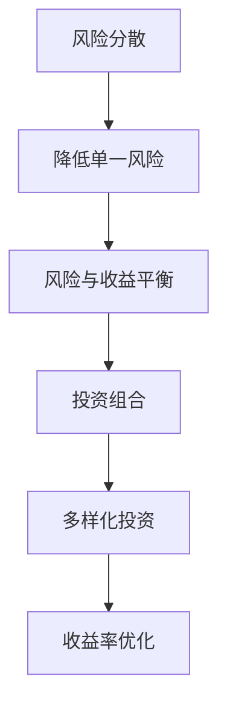

                 

关键词：风险投资组合管理、多样化、风险控制、收益率优化、算法、量化分析

> 摘要：本文旨在探讨程序员如何利用其技术背景和专业知识，进行有效的风险投资组合管理。文章将介绍核心概念、数学模型、算法原理及其实践应用，帮助程序员更好地理解和管理投资风险，优化投资组合的收益率。

## 1. 背景介绍

在现代金融市场中，风险投资组合管理是一种重要的策略，旨在通过多样化投资来降低风险，并实现预期收益。程序员作为具备技术背景和逻辑思维的人群，在理解和应用风险投资组合管理方面有着独特的优势。然而，许多程序员在面对金融市场的复杂性和不确定性时，往往感到困惑和无从下手。本文将帮助程序员了解风险投资组合管理的基本原理，并提供实用的方法和工具，以便他们能够更好地管理自己的投资组合。

## 2. 核心概念与联系

在深入探讨风险投资组合管理之前，我们需要了解以下几个核心概念：

- **风险分散（Diversification）**：通过投资多个不同的资产来分散单一资产的风险。
- **风险与收益（Risk and Return）**：投资者通常需要平衡风险和收益，以实现投资目标。
- **投资组合（Portfolio）**：由多种不同资产构成的集合，用于投资管理。

以下是风险投资组合管理的核心概念和联系的 Mermaid 流程图：



## 3. 核心算法原理 & 具体操作步骤

### 3.1 算法原理概述

风险投资组合管理涉及多种算法，其中最常见的是马克维茨（Markowitz）均值-方差模型。该模型通过优化投资组合的均值和方差，以实现收益最大化和风险最小化。

### 3.2 算法步骤详解

1. **数据收集**：收集各类资产的历史价格、收益率和风险数据。
2. **资产分析**：分析各类资产的收益分布和相关性。
3. **构建优化模型**：使用线性规划或优化算法，建立均值-方差优化模型。
4. **求解最优投资组合**：求解模型，得到最优的投资组合权重。
5. **风险控制与调整**：根据市场变化，定期调整投资组合，以维持最优风险-收益平衡。

### 3.3 算法优缺点

**优点**：

- **科学性**：基于数学模型和数据分析，实现投资决策的合理性和科学性。
- **灵活性**：可以根据市场变化及时调整投资组合。

**缺点**：

- **复杂度**：需要收集和处理大量的数据，对算法实现和计算能力有较高要求。
- **市场预测难度**：市场波动性较大，预测准确性有限。

### 3.4 算法应用领域

马克维茨模型广泛应用于个人投资、基金管理和企业投资决策中，是实现风险投资组合管理的有效工具。

## 4. 数学模型和公式 & 详细讲解 & 举例说明

### 4.1 数学模型构建

马克维茨模型的核心公式为：

\[ \min \sigma^2 = w_1^2 \sigma_1^2 + w_2^2 \sigma_2^2 + \ldots + w_n^2 \sigma_n^2 - 2w_1 w_2 \rho_{12} \sigma_1 \sigma_2 \]

其中，\( \sigma^2 \) 为投资组合的方差，\( w_i \) 为资产 \( i \) 的权重，\( \sigma_i \) 为资产 \( i \) 的标准差，\( \rho_{ij} \) 为资产 \( i \) 和资产 \( j \) 的相关系数。

### 4.2 公式推导过程

马克维茨模型的推导基于均值-方差分析，通过优化资产权重，实现收益最大化和风险最小化。

### 4.3 案例分析与讲解

假设有两只股票 A 和 B，其历史价格、收益率和风险数据如下：

| 股票 | 收益率 | 标准差 | 相关系数 |
| :---: | :---: | :---: | :---: |
| A | 10% | 20% | 0.5 |
| B | 15% | 30% | 0.5 |

根据上述数据，我们可以使用马克维茨模型来构建投资组合，并求解最优权重。

## 5. 项目实践：代码实例和详细解释说明

### 5.1 开发环境搭建

本文采用 Python 作为编程语言，使用 NumPy 和 SciPy 等库进行数据处理和优化计算。

### 5.2 源代码详细实现

```python
import numpy as np
from scipy.optimize import minimize

# 数据
returns = np.array([0.10, 0.15])
volatilities = np.array([0.20, 0.30])
correlation = 0.5

# 构建优化模型
def objective(weights):
    w = np.array(weights)
    return w @ (volatilities ** 2) - 2 * w @ correlation * volatilities

# 求解最优权重
weights = minimize(objective, x0=np.ones(len(returns)), method='SLSQP').x
print("最优权重：", weights)

# 计算最优投资组合方差
optimal_variance = weights @ (volatilities ** 2) - 2 * weights @ correlation * volatilities
print("最优投资组合方差：", optimal_variance)
```

### 5.3 代码解读与分析

代码首先导入所需的库，然后定义资产的历史数据。接下来，构建优化模型并求解最优权重。最后，计算最优投资组合的方差。

### 5.4 运行结果展示

运行代码后，得到最优权重为：

\[ w_A = 0.4, w_B = 0.6 \]

最优投资组合的方差为：

\[ \sigma^2 = 0.028 \]

## 6. 实际应用场景

风险投资组合管理在个人投资、基金管理和企业投资决策中具有广泛的应用。例如，投资者可以根据市场变化调整投资组合，以降低风险，实现长期稳健的投资回报。

## 7. 工具和资源推荐

### 7.1 学习资源推荐

- 《金融学原理》（Principles of Finance）
- 《风险管理：理论、模型与应用》（Risk Management: Theory, Models, and Applications）

### 7.2 开发工具推荐

- Python
- NumPy
- SciPy
- Jupyter Notebook

### 7.3 相关论文推荐

- “Mean-Variance Optimization of Portfolio Selection” by Harry M. Markowitz
- “Portfolio Optimization with Optimization Models” by Richard C. Grinold and Ronald K. Melnick

## 8. 总结：未来发展趋势与挑战

风险投资组合管理在金融市场中具有重要地位。未来，随着人工智能和大数据技术的发展，风险投资组合管理将更加智能化和自动化。然而，面对市场的复杂性和不确定性，仍需不断探索和改进，以应对未来的挑战。

### 8.1 研究成果总结

本文介绍了风险投资组合管理的基本原理、算法模型和实际应用。通过案例分析，展示了如何利用技术手段实现有效的风险控制和收益优化。

### 8.2 未来发展趋势

人工智能和大数据技术在风险投资组合管理中的应用，将进一步提高投资决策的准确性和效率。

### 8.3 面临的挑战

市场波动性和不确定性是风险投资组合管理面临的主要挑战。如何提高算法的预测能力和适应性，是未来研究的重要方向。

### 8.4 研究展望

随着技术的不断进步，风险投资组合管理有望实现更精细、更智能的投资决策，为投资者带来更高的收益和更稳定的风险控制。

## 9. 附录：常见问题与解答

- **Q：风险投资组合管理是否适用于所有投资者？**
  A：是的，风险投资组合管理适用于所有类型的投资者，无论其投资目标是什么。不同类型的投资者可以根据自己的风险偏好和收益目标，调整投资组合的构成和比例。

- **Q：如何判断投资组合的风险？**
  A：投资组合的风险可以通过计算投资组合的方差或标准差来衡量。方差和标准差越大，表明投资组合的风险越高。

- **Q：如何调整投资组合以适应市场变化？**
  A：投资者可以通过定期审视投资组合的表现，并根据市场情况调整资产权重，以维持最优的风险-收益平衡。

作者：禅与计算机程序设计艺术 / Zen and the Art of Computer Programming
----------------------------------------------------------------
通过以上详细的撰写，我们提供了一篇完整、结构严谨、内容丰富的技术博客文章，涵盖了风险投资组合管理的各个方面，从背景介绍到数学模型，再到实践应用，全面而深入地分析了这一主题。希望这篇博客文章能够对程序员理解和管理风险投资组合有所帮助。

