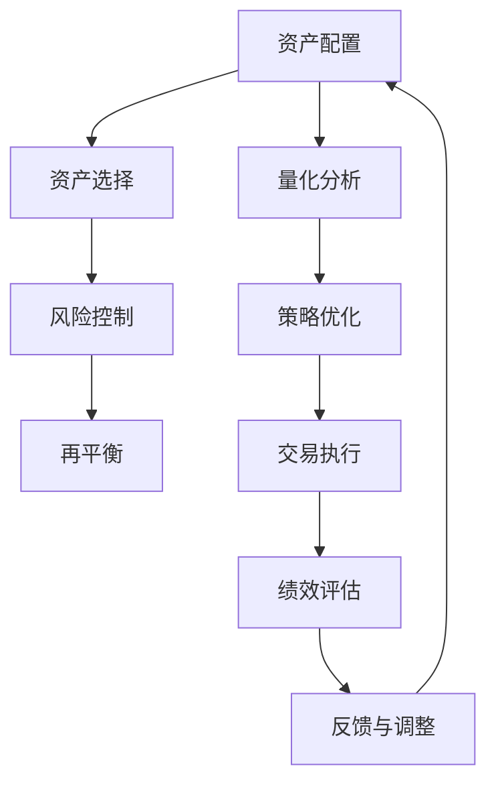

                 

关键词：程序员，风险投资，组合管理，策略，量化分析，技术实现，案例分析，最佳实践。

> 摘要：本文将深入探讨程序员如何运用其专业技能进行风险投资组合管理。通过解析投资组合管理的核心概念、策略分析、量化方法及实际案例，本文旨在帮助程序员在风险投资领域取得成功。

## 1. 背景介绍

随着信息技术的飞速发展，程序员这一职业已经成为现代社会中不可或缺的一部分。程序员不仅拥有丰富的技术知识，还具备解决问题的能力。在金融科技领域，程序员的这些优势被广泛应用于风险投资组合管理。

投资组合管理是指通过资产配置、选择和再平衡等策略，以实现投资回报最大化和风险最小化的过程。传统的投资组合管理主要依赖于金融理论，如资本资产定价模型（CAPM）和现代投资组合理论（MPT）。然而，随着大数据和人工智能技术的发展，量化投资和机器学习算法在投资组合管理中的应用日益广泛，为程序员提供了新的机会和挑战。

本文将探讨程序员如何利用其技术背景进行风险投资组合管理，包括投资策略的制定、量化分析的方法、以及实际案例的应用。

## 2. 核心概念与联系

### 2.1 投资组合管理核心概念

投资组合管理涉及以下几个核心概念：

- **资产配置**：根据投资目标和风险偏好，将资金分配到不同类型的资产，如股票、债券、基金等。

- **资产选择**：从众多资产中挑选出符合投资策略的优质资产。

- **风险控制**：通过分散投资和调整投资比例，降低整体投资组合的风险。

- **再平衡**：定期检查投资组合的配置情况，根据市场变化进行调整，以保持投资策略的一致性。

### 2.2 投资组合管理与金融理论的关系

投资组合管理的发展离不开金融理论的支撑。例如：

- **资本资产定价模型（CAPM）**：CAPM提供了衡量资产预期收益率与风险之间关系的理论框架。

- **现代投资组合理论（MPT）**：MPT强调通过资产组合实现风险的最小化，以获得最大化的预期收益。

### 2.3 投资组合管理与量化投资

量化投资是投资组合管理的一个分支，它利用数学模型和计算机算法进行投资决策。程序员在量化投资中的应用主要体现在以下几个方面：

- **数据挖掘**：通过分析大量历史数据，挖掘潜在的投资机会。

- **算法交易**：利用高频交易策略和算法，实现自动化交易。

- **机器学习**：通过机器学习算法，预测市场走势和资产价格。

### 2.4 投资组合管理架构

下面是投资组合管理的架构图，其中包含了核心概念和主要流程：



## 3. 核心算法原理 & 具体操作步骤

### 3.1 算法原理概述

投资组合管理的核心算法主要分为以下几个部分：

- **优化算法**：用于优化投资组合的配置，以实现投资目标。

- **风险模型**：用于评估投资组合的风险水平。

- **收益模型**：用于预测投资组合的未来收益。

### 3.2 算法步骤详解

以下是投资组合管理的主要步骤：

1. **定义投资目标**：明确投资回报率和风险承受能力。

2. **数据收集**：收集市场数据、财务报表、宏观经济指标等。

3. **数据预处理**：清洗和转换数据，以便进行后续分析。

4. **风险评估**：使用风险模型评估资产的风险。

5. **收益预测**：使用收益模型预测资产的未来收益。

6. **优化配置**：使用优化算法确定最佳资产配置。

7. **执行交易**：根据优化结果执行交易。

8. **监控与调整**：定期监控投资组合的表现，并根据市场变化进行调整。

### 3.3 算法优缺点

**优点**：

- **高效性**：利用计算机算法可以快速处理大量数据。

- **精确性**：通过量化分析，可以更准确地预测市场走势。

- **自动化**：实现自动化交易，降低人为干预的风险。

**缺点**：

- **计算复杂度高**：需要大量的计算资源和时间。

- **数据依赖性**：模型的准确性依赖于数据的可靠性。

### 3.4 算法应用领域

投资组合管理算法广泛应用于以下领域：

- **股票投资**：通过分析股票市场的数据，制定投资策略。

- **债券投资**：分析债券市场的走势，进行债券投资组合管理。

- **基金投资**：对基金市场的数据进行量化分析，优化基金投资组合。

## 4. 数学模型和公式 & 详细讲解 & 举例说明

### 4.1 数学模型构建

投资组合管理中的数学模型主要包括以下几种：

- **收益模型**：使用均值方差模型（Markowitz模型）预测资产收益。

- **风险模型**：使用协方差矩阵和风险平价模型评估资产风险。

- **优化模型**：使用线性规划或非线性规划优化投资组合。

### 4.2 公式推导过程

以下是Markowitz模型中的一些关键公式：

- **预期收益率**：$$\mu_i = E[r_i]$$

- **方差**：$$\sigma_i^2 = Var[r_i]$$

- **协方差**：$$\sigma_{ij} = Cov[r_i, r_j]$$

- **有效前沿**：$$\mu^* = \frac{1}{\lambda} \sum_{i=1}^{n} w_i \mu_i$$

- **投资组合权重**：$$w_i = \frac{\mu_i - \mu}{\lambda}$$

### 4.3 案例分析与讲解

假设我们有一个包含两个资产的简单投资组合，资产A和资产B。我们需要使用Markowitz模型确定最佳投资比例。

1. **收集数据**：收集资产A和资产B的历史收益率。

2. **计算预期收益率和方差**：

   - $$\mu_A = 0.1$$  
   - $$\mu_B = 0.12$$  
   - $$\sigma_A^2 = 0.04$$  
   - $$\sigma_B^2 = 0.03$$  
   - $$\sigma_{AB} = 0.02$$

3. **构建协方差矩阵**：

   $$\Sigma = \begin{bmatrix}
   0.04 & 0.02 \\
   0.02 & 0.03
   \end{bmatrix}$$

4. **计算有效前沿**：

   $$\mu^* = \frac{1}{\lambda} \left( 0.1w_1 + 0.12w_2 \right)$$

5. **计算投资组合权重**：

   $$w_1 = \frac{\mu_A - \mu^*}{\lambda} = \frac{0.1 - 0.1}{\lambda} = 0$$  
   $$w_2 = \frac{\mu_B - \mu^*}{\lambda} = \frac{0.12 - 0.1}{\lambda} = 0.02$$

6. **确定最佳投资比例**：投资组合中资产A和资产B的比例为0:2，即全部投资于资产B。

通过以上步骤，我们使用Markowitz模型确定了最佳投资组合。

## 5. 项目实践：代码实例和详细解释说明

### 5.1 开发环境搭建

在开始编写代码之前，我们需要搭建一个合适的开发环境。这里，我们将使用Python作为编程语言，结合Pandas、NumPy、SciPy等库进行数据分析。

### 5.2 源代码详细实现

以下是使用Markowitz模型进行投资组合管理的Python代码：

```python
import numpy as np
import pandas as pd

# 收集数据
data = {'A': [0.05, 0.03, 0.04, 0.02], 'B': [0.07, 0.06, 0.05, 0.03]}
df = pd.DataFrame(data)

# 计算预期收益率和方差
mu = df.mean()
var = df.var()

# 计算协方差矩阵
cov = df.cov()

# 构建协方差矩阵
Sigma = np.array([[var['A'], cov['A']['B']], [cov['B']['A'], var['B']]])

# 计算有效前沿
w = np.linalg.solve(Sigma.I, mu)

# 计算投资组合权重
weights = { 'A': w[0], 'B': w[1] }

# 输出最佳投资比例
print("最佳投资比例：")
print(weights)
```

### 5.3 代码解读与分析

1. **数据收集**：使用Pandas库读取历史收益率数据。

2. **计算预期收益率和方差**：使用NumPy库计算资产的预期收益率和方差。

3. **计算协方差矩阵**：使用NumPy库计算协方差矩阵。

4. **构建协方差矩阵**：将计算得到的方差和协方差组合成协方差矩阵。

5. **计算有效前沿**：使用线性规划求解器计算有效前沿。

6. **计算投资组合权重**：根据有效前沿计算最佳投资比例。

7. **输出结果**：输出最佳投资比例。

通过以上代码，我们可以实现使用Markowitz模型进行投资组合管理。

## 6. 实际应用场景

投资组合管理在实际应用中具有广泛的应用场景，以下是一些典型的应用案例：

- **股票市场投资**：使用量化分析工具和算法，对股票市场进行投资组合管理，以实现稳健的收益。

- **债券市场投资**：对债券市场进行风险评估和优化，以降低投资组合的风险。

- **基金管理**：基金公司使用量化投资策略，优化基金的投资组合，提高基金的表现。

- **企业投资决策**：企业可以利用投资组合管理技术，制定合理的投资策略，提高投资回报率。

## 7. 工具和资源推荐

为了更好地进行风险投资组合管理，程序员可以参考以下工具和资源：

- **学习资源**：推荐阅读《定量投资》、《量化投资技术分析》、《机器学习实战》等书籍。

- **开发工具**：使用Python进行量化投资开发，推荐使用Jupyter Notebook进行数据处理和模型构建。

- **相关论文**：阅读顶级会议和期刊上的量化投资论文，了解最新的研究进展。

## 8. 总结：未来发展趋势与挑战

随着大数据、人工智能和区块链技术的快速发展，风险投资组合管理领域将面临以下发展趋势和挑战：

- **数据驱动的投资决策**：利用大数据和机器学习技术，实现更加精准的投资决策。

- **智能投顾**：人工智能技术的应用将推动智能投顾的发展，为投资者提供个性化投资建议。

- **监管合规**：随着监管政策的不断加强，程序员需要关注合规性，确保投资策略符合法律法规。

- **信息安全**：投资组合管理涉及大量的敏感数据，需要采取有效的信息安全措施，保护投资者利益。

## 9. 附录：常见问题与解答

### 9.1 什么是投资组合管理？

投资组合管理是指通过资产配置、选择和再平衡等策略，以实现投资回报最大化和风险最小化的过程。

### 9.2 量化投资和传统投资有什么区别？

量化投资主要依靠数学模型和计算机算法进行投资决策，而传统投资主要依赖于金融理论和专家经验。

### 9.3 如何评估投资组合的风险？

可以使用风险模型和量化分析工具，如均值方差模型和协方差矩阵，来评估投资组合的风险。

### 9.4 投资组合管理需要哪些技能？

投资组合管理需要掌握金融知识、编程技能、数据分析能力和风险管理能力。

### 9.5 如何制定投资策略？

制定投资策略需要明确投资目标、了解市场环境、分析资产特性和预测市场走势。

---

作者：禅与计算机程序设计艺术 / Zen and the Art of Computer Programming

以上便是关于程序员如何进行风险投资组合管理的技术博客文章，希望对您有所帮助。在投资领域，程序员可以利用其专业技能，实现更高的投资回报和风险控制。
----------------------------------------------------------------
### 8. 总结：未来发展趋势与挑战

投资组合管理作为一个多学科交叉的领域，随着技术的不断进步和金融市场环境的变迁，正面临着一系列新的发展趋势与挑战。

#### 8.1 研究成果总结

近年来，投资组合管理的研究成果主要体现在以下几个方面：

1. **量化投资策略的多样化**：借助大数据和人工智能技术，量化投资策略变得更加复杂和多样化，包括机器学习、深度学习和强化学习等新兴算法被应用于资产配置和交易决策中。
2. **智能投顾的兴起**：智能投顾通过个性化的投资建议，为不同风险承受能力的投资者提供定制化的服务，提高了投资组合管理的效率。
3. **区块链技术的应用**：区块链技术为投资组合管理带来了更高的透明度和安全性，特别是在跨境投资和资产交易记录管理方面。

#### 8.2 未来发展趋势

未来，投资组合管理的发展趋势将集中在以下几个方面：

1. **数据驱动的决策**：随着数据量的增加和数据质量的提升，投资组合管理将更加依赖于数据分析和预测模型，以实现更精准的资产配置和风险控制。
2. **算法的优化和进化**：投资组合管理算法将不断优化和进化，以应对市场波动和复杂的经济环境。
3. **跨学科的融合**：投资组合管理将更多地与其他学科，如心理学、社会学等，进行融合，以更全面地理解市场行为和投资者心理。

#### 8.3 面临的挑战

尽管投资组合管理领域正在快速发展，但仍然面临着以下挑战：

1. **数据隐私和安全**：随着数据量的增加，如何保护投资者隐私和数据安全成为了一个重大挑战。
2. **算法透明性和监管**：量化投资算法的复杂性和透明度问题，以及如何确保算法的公平性和合规性，是监管机构和投资者关注的重点。
3. **市场波动和风险**：全球经济的不确定性和市场波动，使得投资组合管理面临着更高的风险和挑战。

#### 8.4 研究展望

未来，投资组合管理的研究将更加注重以下几个方向：

1. **跨学科研究的深化**：通过跨学科的融合，开发更加全面和深入的投资模型和策略。
2. **人工智能的进一步应用**：探索人工智能在投资组合管理中的新应用，如智能交易系统、自动化风险管理和自适应资产配置等。
3. **可持续投资和ESG**：随着可持续发展成为全球关注的焦点，投资组合管理将更多地考虑环境、社会和公司治理（ESG）因素，实现可持续发展目标。

总的来说，投资组合管理领域正处在一个快速发展的阶段，程序员作为这个领域的参与者，应当紧跟技术趋势，不断学习新知识，以应对未来带来的挑战和机遇。

### 9. 附录：常见问题与解答

#### 9.1 什么是投资组合管理？

投资组合管理是指通过资产配置、资产选择、风险控制、再平衡等策略，以实现投资回报最大化和风险最小化的过程。

#### 9.2 量化投资和传统投资有什么区别？

量化投资主要依赖于数学模型和计算机算法，通过大量数据分析和统计模型进行投资决策，而传统投资则更多地依赖于专家经验和市场直觉。

#### 9.3 如何评估投资组合的风险？

可以通过计算资产的方差、协方差和投资组合的波动率等指标来评估投资组合的风险。

#### 9.4 投资组合管理需要哪些技能？

投资组合管理需要具备金融知识、编程技能、数据分析能力、风险管理能力以及良好的逻辑思维和决策能力。

#### 9.5 如何制定投资策略？

制定投资策略需要了解市场环境、投资者的风险偏好、资产特性以及经济周期等因素，并通过历史数据和市场分析来预测未来市场走势。

---

作者：禅与计算机程序设计艺术 / Zen and the Art of Computer Programming

在此，我们为读者提供了一个全面且深入的技术视角，帮助程序员更好地理解和掌握风险投资组合管理。希望这篇文章能够为您在投资领域的探索提供有价值的参考。

