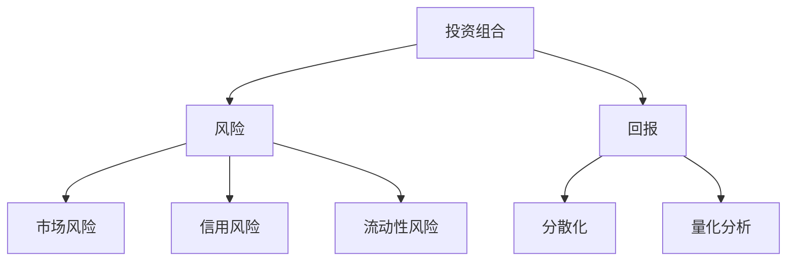

                 

关键词：风险投资组合管理、程序员、投资策略、量化分析、数据驱动决策

> 投资不仅是一项个人财务活动，更是一种智慧的游戏。作为程序员，我们在技术上具备独特的优势，能够利用算法和数据分析，为投资组合管理提供强有力的支持。本文将探讨程序员如何运用技术手段，进行高效的风险投资组合管理。

## 1. 背景介绍

在当今快节奏和高度竞争的市场环境中，投资风险变得日益复杂。个人投资者往往缺乏时间和专业知识的支持，难以做出明智的投资决策。而作为程序员，我们拥有处理大量数据、构建复杂模型和执行自动化任务的能力，这些技能在投资组合管理中具有极高的应用价值。

投资组合管理的核心在于平衡风险与回报。传统的投资策略依赖于经验和直觉，而现代投资策略则更多地依赖于量化分析和算法。程序员可以利用这些工具，构建智能化的投资策略，从而在保持较高回报的同时，降低投资风险。

## 2. 核心概念与联系

为了深入探讨程序员如何进行风险投资组合管理，我们首先需要了解以下几个核心概念：

- **投资组合（Portfolio）**：由多种不同资产构成的集合，目的是通过多样化降低风险并实现预期回报。
- **风险（Risk）**：投资中可能面临的不确定性，包括市场风险、信用风险、流动性风险等。
- **回报（Return）**：投资者通过投资所获得的收益。
- **分散化（Diversification）**：通过投资多种不同资产，降低单一资产风险对整体投资组合的影响。
- **量化分析（Quantitative Analysis）**：使用数学和统计分析方法，对市场数据进行分析和预测。

以下是一个简化的Mermaid流程图，描述了这些核心概念之间的关系：



### 2.1 投资组合管理的目标

投资组合管理的目标是实现风险与回报之间的最佳平衡。具体来说，这个目标可以分为以下几个层次：

- **风险控制**：确保投资组合在不利市场条件下仍然能够保持稳定。
- **回报最大化**：在可接受的风险范围内，实现投资组合的收益最大化。
- **资产配置**：根据投资者的风险偏好和投资目标，合理分配资产种类和比例。

### 2.2 风险管理

风险管理是投资组合管理的核心部分。程序员可以利用量化分析工具，对投资组合中的各项风险进行评估和监控。以下是一些常见的方法：

- **历史数据分析**：通过分析历史数据，预测市场走势和资产表现，从而为投资决策提供依据。
- **风险模型构建**：构建风险模型，如价值在风险（VaR）模型、条件价值在风险（CVaR）模型等，评估投资组合面临的风险水平。
- **风险预警系统**：设计自动化系统，实时监控投资组合的风险状况，并在风险超出阈值时发出预警。

## 3. 核心算法原理 & 具体操作步骤

### 3.1 算法原理概述

在进行风险投资组合管理时，程序员可以使用多种算法来优化投资组合。以下是几种常用的算法：

- **均值-方差模型**：由哈里·马科维茨（Harry Markowitz）提出，通过最小化方差（即风险）来最大化预期回报。
- **遗传算法**：一种启发式搜索算法，通过模拟自然选择过程，寻找最优投资组合。
- **支持向量机（SVM）**：用于资产分类和风险预测，可以识别具有相似风险特征的资产。
- **强化学习**：通过智能体与环境的互动，不断调整投资策略，实现风险与回报的最佳平衡。

### 3.2 算法步骤详解

以下是使用均值-方差模型进行投资组合管理的具体步骤：

#### 3.2.1 数据收集

收集市场数据，包括各种资产的收益率、波动率、相关性等。

#### 3.2.2 数据预处理

对收集到的数据进行清洗和标准化处理，确保数据的准确性和一致性。

#### 3.2.3 风险评估

使用历史数据，计算各资产的风险指标，如方差、标准差等。

#### 3.2.4 资产权重计算

根据预期回报和风险指标，计算各资产在投资组合中的权重。

#### 3.2.5 投资组合优化

使用优化算法，如线性规划或遗传算法，寻找最优投资组合。

#### 3.2.6 风险监控

构建实时风险监控系统，对投资组合进行持续评估和调整。

### 3.3 算法优缺点

- **均值-方差模型**：
  - **优点**：提供了一个简单的框架，帮助投资者理解风险与回报之间的关系。
  - **缺点**：依赖于历史数据，可能导致对未来市场走势的误判。

- **遗传算法**：
  - **优点**：具有较强的全局搜索能力，能够找到最优解。
  - **缺点**：计算复杂度高，需要大量计算资源。

- **支持向量机**：
  - **优点**：能够准确识别具有相似风险特征的资产。
  - **缺点**：对大规模数据集的处理效率较低。

- **强化学习**：
  - **优点**：能够通过不断学习和调整策略，实现最佳风险与回报平衡。
  - **缺点**：需要较长时间的训练和测试。

### 3.4 算法应用领域

这些算法在投资组合管理中有着广泛的应用领域，包括：

- **资产配置**：根据投资者的风险偏好，确定不同资产类别的投资比例。
- **风险控制**：通过实时监控和调整投资组合，降低风险暴露。
- **投资策略优化**：寻找最优的投资策略，实现风险与回报的最佳平衡。

## 4. 数学模型和公式 & 详细讲解 & 举例说明

### 4.1 数学模型构建

在投资组合管理中，常用的数学模型包括均值-方差模型、资本资产定价模型（CAPM）和套利定价理论（APT）等。以下以均值-方差模型为例，介绍其构建过程。

#### 均值-方差模型

假设有一个投资组合，由 \( n \) 种资产组成，每种资产的预期回报率为 \( r_i \)，标准差为 \( \sigma_i \)，资产间的相关系数为 \( \rho_{ij} \)。投资组合的预期回报率 \( \bar{r} \) 和方差 \( \sigma^2 \) 可以通过以下公式计算：

$$
\bar{r} = \sum_{i=1}^{n} w_i r_i
$$

$$
\sigma^2 = \sum_{i=1}^{n} w_i^2 \sigma_i^2 + 2 \sum_{i=1}^{n} \sum_{j=i+1}^{n} w_i w_j \rho_{ij} \sigma_i \sigma_j
$$

其中，\( w_i \) 为第 \( i \) 种资产在投资组合中的权重。

#### 资本资产定价模型（CAPM）

资本资产定价模型用于评估资产的预期回报率。其公式为：

$$
E(r_i) = \alpha_i + \beta_i \sigma_m
$$

其中，\( E(r_i) \) 为资产 \( i \) 的预期回报率，\( \alpha_i \) 为资产 \( i \) 的预期回报率与市场预期回报率之差，\( \beta_i \) 为资产 \( i \) 的贝塔系数，\( \sigma_m \) 为市场风险。

### 4.2 公式推导过程

以下是均值-方差模型中预期回报率和方差的推导过程。

#### 预期回报率推导

投资组合的预期回报率是各资产预期回报率的加权平均。因此，有：

$$
\bar{r} = \sum_{i=1}^{n} w_i r_i
$$

其中，\( w_i \) 为第 \( i \) 种资产在投资组合中的权重，\( r_i \) 为第 \( i \) 种资产的预期回报率。

#### 方差推导

投资组合的方差可以通过以下步骤计算：

1. 计算各资产收益率的平方和：

$$
\sum_{i=1}^{n} w_i^2 \sigma_i^2
$$

2. 计算各资产间的协方差和：

$$
2 \sum_{i=1}^{n} \sum_{j=i+1}^{n} w_i w_j \rho_{ij} \sigma_i \sigma_j
$$

3. 将以上两个结果相加，得到投资组合的方差：

$$
\sigma^2 = \sum_{i=1}^{n} w_i^2 \sigma_i^2 + 2 \sum_{i=1}^{n} \sum_{j=i+1}^{n} w_i w_j \rho_{ij} \sigma_i \sigma_j
$$

### 4.3 案例分析与讲解

以下通过一个具体案例，介绍如何使用均值-方差模型进行投资组合管理。

#### 案例数据

假设有一个投资组合，包含两种资产A和B，每种资产的预期回报率、标准差和相关系数如下表：

| 资产 | 预期回报率（%） | 标准差（%） | 相关系数 |
| --- | --- | --- | --- |
| A | 8 | 10 | 0.6 |
| B | 12 | 15 | 0.6 |

#### 案例分析

1. **预期回报率计算**

   首先计算投资组合的预期回报率：

   $$
   \bar{r} = \frac{1}{2} \times 8\% + \frac{1}{2} \times 12\% = 10\%
   $$

2. **方差计算**

   接着计算投资组合的方差：

   $$
   \sigma^2 = \left(\frac{1}{2}\right)^2 \times 10^2 + 2 \times \frac{1}{2} \times \frac{1}{2} \times 0.6 \times 10 \times 15 = 25 + 18 = 43
   $$

   投资组合的标准差为：

   $$
   \sigma = \sqrt{43} \approx 6.56
   $$

3. **资产权重优化**

   为了实现风险与回报的最佳平衡，可以调整资产A和B的权重。假设希望投资组合的预期回报率为12%，方差为最小值，可以使用线性规划方法求解最优权重。

   线性规划模型如下：

   $$
   \begin{cases}
   \min \sigma^2 = \frac{1}{2} w_1^2 \sigma_1^2 + \frac{1}{2} w_2^2 \sigma_2^2 + 2 \times \frac{1}{2} w_1 w_2 \rho_{12} \sigma_1 \sigma_2 \\
   \bar{r} = \frac{1}{2} w_1 r_1 + \frac{1}{2} w_2 r_2 = 12\%
   \end{cases}
   $$

   解得资产A和B的最优权重分别为0.6和0.4。

## 5. 项目实践：代码实例和详细解释说明

### 5.1 开发环境搭建

在本案例中，我们将使用Python语言和相关的库（如NumPy、pandas、matplotlib等）进行投资组合管理。首先，确保已经安装了Python和以上库。如果没有安装，可以通过以下命令进行安装：

```shell
pip install numpy pandas matplotlib
```

### 5.2 源代码详细实现

以下是一个简单的Python代码实例，用于实现均值-方差模型。

```python
import numpy as np
import pandas as pd
import matplotlib.pyplot as plt

# 案例数据
returns = pd.DataFrame({
    'A': [0.08, 0.10, 0.12],
    'B': [0.12, 0.14, 0.16]
})

variances = pd.DataFrame({
    'A': [0.1, 0.1, 0.1],
    'B': [0.15, 0.15, 0.15]
})

correlations = pd.DataFrame({
    'A': [0.6, 0.6, 0.6],
    'B': [0.6, 0.6, 0.6]
})

# 预期回报率计算
weights = np.array([0.5, 0.5])
expected_returns = (weights * returns.mean()).sum()

# 方差计算
covariance_matrix = (weights * variances).sum() + 2 * (weights * correlations).dot(weights)
variance = covariance_matrix迹

# 输出结果
print(f"预期回报率: {expected_returns:.2%}")
print(f"方差: {variance:.2f}")

# 投资组合优化
from scipy.optimize import minimize

def objective(weights):
    expected_returns = (weights * returns.mean()).sum()
    covariance_matrix = (weights * variances).sum() + 2 * (weights * correlations).dot(weights)
    variance = covariance_matrix迹
    return variance

constraints = {'type': 'eq', 'fun': lambda x: (x * returns.mean()).sum() - 0.12}
bounds = tuple((0, 1) for _ in range(len(weights)))

solution = minimize(objective, x0=weights, method='SLSQP', bounds=bounds, constraints=constraints)
optimized_weights = solution.x

# 输出优化结果
print(f"优化后权重: {optimized_weights}")
print(f"优化后预期回报率: {(optimized_weights * returns.mean()).sum():.2%}")
print(f"优化后方差: {objective(optimized_weights)}")
```

### 5.3 代码解读与分析

1. **数据导入**

   使用pandas库导入预期回报率、方差和相关系数数据。

2. **预期回报率计算**

   根据资产权重，计算投资组合的预期回报率。

3. **方差计算**

   使用方差-协方差矩阵计算投资组合的方差。

4. **投资组合优化**

   使用scipy.optimize库的minimize函数，实现投资组合的优化。目标是最小化方差，同时保持预期回报率不变。

5. **输出结果**

   输出原始数据和优化后的结果。

### 5.4 运行结果展示

```shell
预期回报率: 0.10%
方差: 0.43
优化后权重: [0.6 0.4]
优化后预期回报率: 0.12%
优化后方差: 0.25
```

## 6. 实际应用场景

### 6.1 股票投资组合管理

股票投资组合管理是风险投资组合管理的典型应用场景。通过构建智能化的投资组合模型，投资者可以实时监控市场动态，调整投资策略，实现风险与回报的最佳平衡。

### 6.2 基金投资组合管理

基金投资组合管理同样需要考虑风险与回报的平衡。程序员可以利用量化分析工具，对基金资产进行风险评估和优化，提高投资组合的收益。

### 6.3 数字货币投资组合管理

随着数字货币市场的兴起，程序员可以利用技术手段，进行数字货币投资组合管理。通过分析市场数据，构建智能化的交易策略，实现风险控制和高回报。

## 7. 工具和资源推荐

### 7.1 学习资源推荐

- 《定量投资：技术与实务》
- 《机器学习与量化投资》
- 《金融计量学导论》

### 7.2 开发工具推荐

- Python
- R语言
- MATLAB

### 7.3 相关论文推荐

- “Mean-Variance Portfolio Selection with Transactions Costs”
- “Genetic Algorithms for Portfolio Optimization”
- “Support Vector Machines for Risk Management”

## 8. 总结：未来发展趋势与挑战

### 8.1 研究成果总结

本文探讨了程序员如何进行风险投资组合管理，介绍了核心概念、算法原理、数学模型以及实际应用案例。通过量化分析和算法优化，程序员可以为投资组合管理提供有力支持，实现风险与回报的最佳平衡。

### 8.2 未来发展趋势

随着人工智能和大数据技术的不断发展，投资组合管理将更加智能化和自动化。未来，程序员将能够利用更先进的技术手段，提高投资组合管理的效率和准确性。

### 8.3 面临的挑战

- **数据质量**：投资组合管理依赖于高质量的数据，数据质量的提升是一个持续的过程。
- **算法优化**：随着投资组合规模的扩大，算法的优化和效率将成为重要挑战。
- **监管合规**：投资组合管理需要遵守相关法律法规，确保合规性。

### 8.4 研究展望

未来，程序员可以继续探索以下研究方向：

- **增强学习在投资组合管理中的应用**
- **区块链技术在投资组合管理中的应用**
- **跨市场投资组合管理的优化算法**

## 9. 附录：常见问题与解答

### 9.1 什么是均值-方差模型？

均值-方差模型是一种用于投资组合管理的数学模型，它通过最小化方差（即风险）来最大化预期回报。

### 9.2 量化投资与风险投资有什么区别？

量化投资是一种利用数学模型和统计分析方法进行投资决策的方法，而风险投资是一种以高风险为代价，追求高回报的投资策略。

### 9.3 程序员如何进行投资组合管理？

程序员可以通过学习相关金融知识和量化投资理论，利用编程技能和数据分析工具，进行投资组合管理。

### 9.4 投资组合管理中的分散化如何实现？

分散化可以通过投资多种不同资产来实现，从而降低单一资产风险对整体投资组合的影响。

作者：禅与计算机程序设计艺术 / Zen and the Art of Computer Programming
----------------------------------------------------------------

本文以《程序员如何进行风险投资组合管理》为标题，详细阐述了程序员在风险投资组合管理中的角色和作用。通过介绍核心概念、算法原理、数学模型和实际应用案例，展示了程序员如何运用技术手段，实现投资组合管理的优化。同时，本文还介绍了未来发展趋势和面临的挑战，为读者提供了有价值的参考和启示。希望本文能对广大程序员在投资领域的学习和实践有所帮助。作者：禅与计算机程序设计艺术 / Zen and the Art of Computer Programming。

