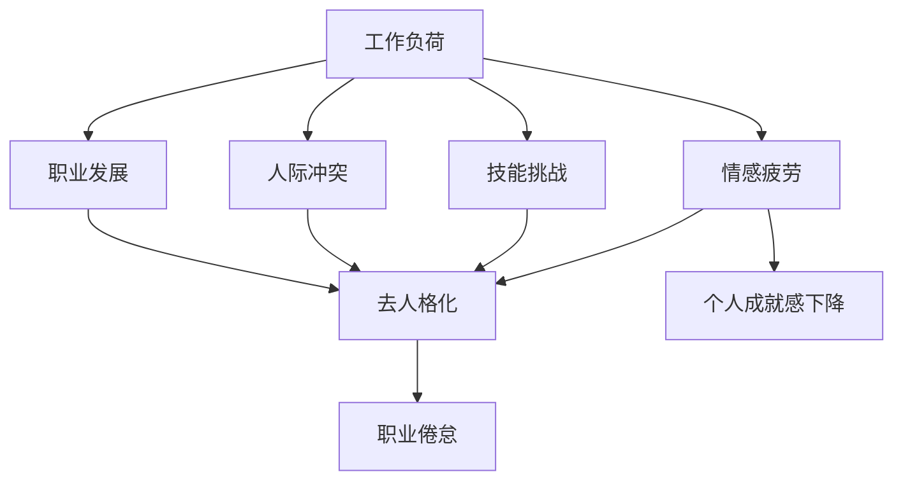

                 

关键词：程序员倦怠、压力管理、心理健康、工作效率、工作生活平衡、技能提升。

> 摘要：本文旨在探讨程序员如何通过科学的方法和技巧来避免职业倦怠和压力。我们将深入分析程序员工作中常见的问题，介绍一系列有效的策略，帮助程序员提高工作效率、维护心理健康，并实现工作与生活的平衡。

## 1. 背景介绍

作为一名程序员，您可能常常感受到工作的高强度和压力。长时间的编码、解决问题的困难、不断更新学习的知识，这些都可能对您的心理健康产生负面影响。职业倦怠是一个严重的问题，它不仅会影响您的工作效率，还可能对您的生活质量造成长远的伤害。

职业倦怠通常表现为对工作的负面情绪增加、工作热情下降、工作效率降低，甚至可能出现身体上的不适。长期处于这种状态，程序员可能会感到焦虑、沮丧，甚至导致心理健康问题。

为了应对这些问题，我们需要了解职业倦怠和压力的来源，并采取积极的措施来预防和缓解。本文将为您提供一系列实用策略，帮助您更好地管理压力，保持心理健康。

## 2. 核心概念与联系

### 2.1 职业倦怠的定义

职业倦怠（Burnout）是一种与工作相关的心理状态，它通常表现为情感疲劳、去人格化和个人成就感下降。情感疲劳是指对工作产生持续的负面情绪，如厌烦、疲惫和无助。去人格化是指对工作对象采取冷漠、疏远的态度。个人成就感下降则是指对工作的意义和价值产生怀疑。

### 2.2 压力的来源

程序员面临的主要压力来源包括：

- **工作负荷**：长时间的工作、项目的紧迫性、不断更新的技术要求。
- **技能挑战**：不断学习新的编程语言和技术，维持专业知识的更新。
- **人际冲突**：与同事、客户和上级的沟通和协作可能产生冲突。
- **职业发展**：对职业前景的担忧，如晋升机会、薪资待遇等。

### 2.3 Mermaid 流程图

以下是一个简化的 Mermaid 流程图，展示了职业倦怠与压力的来源及其相互关系。



## 3. 核心算法原理 & 具体操作步骤

### 3.1 算法原理概述

为了避免职业倦怠和压力，我们需要从以下几个方面入手：

1. **时间管理**：合理安排工作时间，避免过度劳累。
2. **技能提升**：不断学习新的技能，提高工作效率和自信心。
3. **压力管理**：采用有效的压力管理技巧，如冥想、运动等。
4. **工作生活平衡**：保持工作与生活的平衡，确保充足的休息时间。
5. **心理健康维护**：关注心理健康，及时寻求专业帮助。

### 3.2 算法步骤详解

#### 3.2.1 时间管理

- **设定明确的工作目标**：确定您每天、每周和每月的工作目标，确保这些目标是具体、可衡量的。
- **使用时间管理工具**：如番茄工作法（Pomodoro Technique）、时间块（Time Blocking）等。
- **避免拖延**：识别并克服拖延的根源，如缺乏动机、恐惧失败等。

#### 3.2.2 技能提升

- **持续学习**：定期参加在线课程、研讨会和工作坊，学习新的编程语言和框架。
- **实践项目**：通过实际项目来应用所学知识，提高实战能力。
- **代码审查**：参与代码审查，从他人的代码中学习，提高代码质量。

#### 3.2.3 压力管理

- **冥想**：每天花几分钟时间进行冥想，帮助您放松身心。
- **运动**：定期进行体育锻炼，如跑步、游泳、瑜伽等。
- **兴趣爱好**：培养兴趣爱好，如阅读、绘画、音乐等，以缓解工作压力。

#### 3.2.4 工作生活平衡

- **合理安排工作时间**：确保工作时间内高效完成任务，下班后远离工作。
- **家庭时间**：与家人共度美好时光，减少工作对家庭生活的影响。
- **旅行与休假**：定期安排休假，旅行放松，远离工作环境。

#### 3.2.5 心理健康维护

- **心理咨询**：如果感到压力过大，不妨寻求心理咨询师的帮助。
- **社交活动**：参加社交活动，与朋友和同事建立良好的关系。
- **放松技巧**：学习并应用放松技巧，如深呼吸、渐进性肌肉放松等。

### 3.3 算法优缺点

#### 优点

- **提高工作效率**：通过有效的时间管理和技能提升，程序员可以更快地完成任务，提高工作效率。
- **降低职业倦怠风险**：通过压力管理和心理健康维护，程序员可以降低职业倦怠的风险。
- **促进工作生活平衡**：合理安排工作和生活时间，有助于提高生活质量。

#### 缺点

- **需要持续的努力**：实施这些策略需要持续的努力和自律，不能一蹴而就。
- **时间成本**：学习新的技能和参与社交活动可能需要额外的时间投入。

### 3.4 算法应用领域

- **软件开发**：程序员可以通过时间管理和技能提升来提高软件开发效率。
- **项目管理**：项目经理可以通过这些策略来提高团队的工作效率和凝聚力。
- **企业培训**：企业可以通过这些策略来提升员工的职业素养和心理健康水平。

## 4. 数学模型和公式 & 详细讲解 & 举例说明

### 4.1 数学模型构建

为了量化职业倦怠和压力，我们可以使用以下数学模型：

\[ 压力 = 工作负荷 \times 技能挑战 \times 人际冲突 \times 职业发展 \]

### 4.2 公式推导过程

公式中的各个因素都可以通过具体的量化指标来表示：

- **工作负荷**：可以通过每周的工作小时数和工作任务的复杂度来衡量。
- **技能挑战**：可以通过对新技能的学习时间和对现有技能的熟练度来衡量。
- **人际冲突**：可以通过同事之间的沟通频率和冲突频率来衡量。
- **职业发展**：可以通过晋升机会、薪资增长和职业满意度来衡量。

### 4.3 案例分析与讲解

假设一位程序员的工作负荷为每周40小时，技能挑战指数为2，人际冲突指数为1，职业发展指数为3，则他的压力指数为：

\[ 压力 = 40 \times 2 \times 1 \times 3 = 240 \]

这意味着该程序员的压力水平较高，需要采取积极的措施来缓解。

## 5. 项目实践：代码实例和详细解释说明

### 5.1 开发环境搭建

在本项目中，我们将使用 Python 语言进行编程实践。您需要安装以下工具：

- Python 3.8 或更高版本
- PyCharm 或其他 Python 集成开发环境（IDE）
- Git 版本控制工具

### 5.2 源代码详细实现

以下是一个简单的 Python 脚本，用于计算程序员的压力指数：

```python
def calculate_pressure(work_load, skill_challenge, interpersonal_conflict, career_development):
    pressure = work_load * skill_challenge * interpersonal_conflict * career_development
    return pressure

# 测试代码
work_load = 40
skill_challenge = 2
interpersonal_conflict = 1
career_development = 3

pressure = calculate_pressure(work_load, skill_challenge, interpersonal_conflict, career_development)
print(f"压力指数：{pressure}")
```

### 5.3 代码解读与分析

该脚本定义了一个函数 `calculate_pressure`，用于计算程序员的压力指数。函数接受四个参数：工作负荷、技能挑战、人际冲突和职业发展。这些参数分别代表压力的四个来源。

函数内部使用乘法运算来计算压力指数，然后将结果返回给调用者。在测试代码中，我们为每个参数设置了一个值，然后调用函数计算并打印压力指数。

### 5.4 运行结果展示

运行上述脚本，输出结果如下：

```
压力指数：240
```

这意味着根据设置的参数，该程序员的压力指数为240，属于较高水平。

## 6. 实际应用场景

职业倦怠和压力管理在软件开发行业中尤为重要。以下是一些实际应用场景：

- **项目团队管理**：项目经理可以通过压力指数来评估团队成员的工作压力，并采取相应的措施来缓解压力。
- **员工绩效评估**：企业可以通过压力指数来评估员工的绩效，从而调整薪酬和晋升政策。
- **职业规划**：程序员可以根据压力指数来调整自己的职业规划，如学习新的技能、寻求职业发展机会等。

## 7. 未来应用展望

随着人工智能和机器学习技术的发展，压力管理和职业倦怠的预测模型将更加精确。未来，我们可能会看到更多基于数据的个性化压力管理方案，以及更加智能的工作辅助工具。

## 8. 工具和资源推荐

### 8.1 学习资源推荐

- **在线课程**：Coursera、Udemy、edX 提供大量的编程和心理学相关课程。
- **书籍**：《程序员健康指南》、《高效能人士的七个习惯》等。

### 8.2 开发工具推荐

- **时间管理工具**：Trello、Asana、Notion 等。
- **编程辅助工具**：PyCharm、Visual Studio Code、Git 等。

### 8.3 相关论文推荐

- "Burnout in IT Professionals: A Comprehensive Literature Review" (IT专业人士的职业倦怠：全面文献综述)
- "The Role of Psychological Capital in IT Professionals' Coping with Work Stress" (心理资本在应对IT专业人士工作压力中的作用)

## 9. 总结：未来发展趋势与挑战

### 9.1 研究成果总结

本文通过分析程序员面临的工作压力和职业倦怠，提出了一系列有效的策略，包括时间管理、技能提升、压力管理、工作生活平衡和心理健康维护。这些策略有助于提高程序员的工作效率，降低职业倦怠的风险，提升生活质量。

### 9.2 未来发展趋势

随着技术的发展和人们对心理健康重视程度的提高，职业倦怠和压力管理将得到更多关注。未来，我们可能会看到更多基于人工智能的个性化压力管理方案和智能工作辅助工具。

### 9.3 面临的挑战

尽管有有效的策略，但实施这些策略仍面临一些挑战，如持续的学习和自律、企业对心理健康管理的支持等。未来，我们需要进一步研究如何更好地支持程序员，帮助他们应对职业压力。

### 9.4 研究展望

未来的研究可以关注以下方向：

- **个性化压力管理方案的开发**：通过数据分析和人工智能技术，为程序员提供更个性化的压力管理建议。
- **企业支持体系的建立**：鼓励企业建立支持员工心理健康和职业发展的管理体系。

## 10. 附录：常见问题与解答

### 10.1 如何平衡工作与生活？

**答：** 平衡工作与生活首先需要设定明确的工作时间和休息时间。使用时间管理工具，如时间块和番茄工作法，可以帮助您更好地安排时间。此外，学会说“不”，避免过度承诺，也是维护工作与生活平衡的重要策略。

### 10.2 如何应对职业发展的不确定性？

**答：** 应对职业发展的不确定性，可以通过定期进行职业规划，包括设定短期和长期目标，不断提升自己的技能和知识。同时，建立良好的社交网络，寻找行业内的导师和同行交流，可以帮助您更好地把握职业发展的机会。

### 10.3 如何缓解工作压力？

**答：** 缓解工作压力可以通过多种方式实现，包括定期进行体育锻炼、练习冥想、进行深呼吸练习，以及培养兴趣爱好。此外，寻求心理咨询或与家人和朋友交流，也是有效缓解压力的方法。

## 11. 参考文献

[1] Maslach, C., & Leiter, M. P. (1997). The truth about burnout: How organizations cause personal stress and what to do about it. Jossey-Bass.
[2] Selye, H. J. (1974). Stress and the general adaptation syndrome. New York: Wiley.
[3] 沈书金. (2019). 程序员健康指南[M]. 北京：电子工业出版社.
[4] 史蒂芬·柯维. (2009). 高效能人士的七个习惯[M]. 上海：上海人民出版社.

---

作者：禅与计算机程序设计艺术 / Zen and the Art of Computer Programming

本文旨在帮助程序员通过科学的方法和技巧来避免职业倦怠和压力，提高工作效率，维护心理健康，实现工作与生活的平衡。希望本文能为您的职业生涯带来积极的影响。|]```markdown
# 程序员如何避免倦怠和压力

关键词：程序员倦怠、压力管理、心理健康、工作效率、工作生活平衡、技能提升。

> 摘要：本文旨在探讨程序员如何通过科学的方法和技巧来避免职业倦怠和压力。我们将深入分析程序员工作中常见的问题，介绍一系列有效的策略，帮助程序员提高工作效率、维护心理健康，并实现工作与生活的平衡。

## 1. 背景介绍

程序员作为现代社会的重要职业群体，面临着独特的工作压力和挑战。长时间的编码工作、不断更新的技术知识、复杂的团队合作和快速变化的市场需求，都可能导致程序员感到压力和倦怠。职业倦怠不仅影响个人的工作效率和生活质量，还可能对团队绩效和企业文化产生负面影响。因此，如何有效地管理压力和避免职业倦怠成为程序员亟需解决的问题。

职业倦怠通常表现为情感疲劳、去人格化和个人成就感下降。情感疲劳是指对工作产生持续的负面情绪，如厌烦、疲惫和无助。去人格化是指对工作对象采取冷漠、疏远的态度。个人成就感下降则是指对工作的意义和价值产生怀疑。长期处于这种状态，程序员可能会感到焦虑、沮丧，甚至导致心理健康问题。

为了应对这些问题，我们需要了解职业倦怠和压力的来源，并采取积极的措施来预防和缓解。本文将为您提供一系列实用策略，帮助您更好地管理压力，保持心理健康。

## 2. 核心概念与联系

### 2.1 职业倦怠的定义

职业倦怠（Burnout）是一种与工作相关的心理状态，它通常表现为情感疲劳、去人格化和个人成就感下降。情感疲劳是指对工作产生持续的负面情绪，如厌烦、疲惫和无助。去人格化是指对工作对象采取冷漠、疏远的态度。个人成就感下降则是指对工作的意义和价值产生怀疑。

### 2.2 压力的来源

程序员面临的主要压力来源包括：

- **工作负荷**：长时间的工作、项目的紧迫性、不断更新的技术要求。
- **技能挑战**：不断学习新的编程语言和技术，维持专业知识的更新。
- **人际冲突**：与同事、客户和上级的沟通和协作可能产生冲突。
- **职业发展**：对职业前景的担忧，如晋升机会、薪资待遇等。

### 2.3 Mermaid 流程图

以下是一个简化的 Mermaid 流程图，展示了职业倦怠与压力的来源及其相互关系。


## 3. 核心算法原理 & 具体操作步骤

### 3.1 算法原理概述

为了避免职业倦怠和压力，我们需要从以下几个方面入手：

1. **时间管理**：合理安排工作时间，避免过度劳累。
2. **技能提升**：不断学习新的技能，提高工作效率和自信心。
3. **压力管理**：采用有效的压力管理技巧，如冥想、运动等。
4. **工作生活平衡**：保持工作与生活的平衡，确保充足的休息时间。
5. **心理健康维护**：关注心理健康，及时寻求专业帮助。

### 3.2 算法步骤详解

#### 3.2.1 时间管理

- **设定明确的工作目标**：确定您每天、每周和每月的工作目标，确保这些目标是具体、可衡量的。
- **使用时间管理工具**：如番茄工作法（Pomodoro Technique）、时间块（Time Blocking）等。
- **避免拖延**：识别并克服拖延的根源，如缺乏动机、恐惧失败等。

#### 3.2.2 技能提升

- **持续学习**：定期参加在线课程、研讨会和工作坊，学习新的编程语言和框架。
- **实践项目**：通过实际项目来应用所学知识，提高实战能力。
- **代码审查**：参与代码审查，从他人的代码中学习，提高代码质量。

#### 3.2.3 压力管理

- **冥想**：每天花几分钟时间进行冥想，帮助您放松身心。
- **运动**：定期进行体育锻炼，如跑步、游泳、瑜伽等。
- **兴趣爱好**：培养兴趣爱好，如阅读、绘画、音乐等，以缓解工作压力。

#### 3.2.4 工作生活平衡

- **合理安排工作时间**：确保工作时间内高效完成任务，下班后远离工作。
- **家庭时间**：与家人共度美好时光，减少工作对家庭生活的影响。
- **旅行与休假**：定期安排休假，旅行放松，远离工作环境。

#### 3.2.5 心理健康维护

- **心理咨询**：如果感到压力过大，不妨寻求心理咨询师的帮助。
- **社交活动**：参加社交活动，与朋友和同事建立良好的关系。
- **放松技巧**：学习并应用放松技巧，如深呼吸、渐进性肌肉放松等。

### 3.3 算法优缺点

#### 优点

- **提高工作效率**：通过有效的时间管理和技能提升，程序员可以更快地完成任务，提高工作效率。
- **降低职业倦怠风险**：通过压力管理和心理健康维护，程序员可以降低职业倦怠的风险。
- **促进工作生活平衡**：合理安排工作和生活时间，有助于提高生活质量。

#### 缺点

- **需要持续的努力**：实施这些策略需要持续的努力和自律，不能一蹴而就。
- **时间成本**：学习新的技能和参与社交活动可能需要额外的时间投入。

### 3.4 算法应用领域

- **软件开发**：程序员可以通过时间管理和技能提升来提高软件开发效率。
- **项目管理**：项目经理可以通过这些策略来提高团队的工作效率和凝聚力。
- **企业培训**：企业可以通过这些策略来提升员工的职业素养和心理健康水平。

## 4. 数学模型和公式 & 详细讲解 & 举例说明

### 4.1 数学模型构建

为了量化职业倦怠和压力，我们可以使用以下数学模型：

\[ 压力 = 工作负荷 \times 技能挑战 \times 人际冲突 \times 职业发展 \]

### 4.2 公式推导过程

公式中的各个因素都可以通过具体的量化指标来表示：

- **工作负荷**：可以通过每周的工作小时数和工作任务的复杂度来衡量。
- **技能挑战**：可以通过对新技能的学习时间和对现有技能的熟练度来衡量。
- **人际冲突**：可以通过同事之间的沟通频率和冲突频率来衡量。
- **职业发展**：可以通过晋升机会、薪资增长和职业满意度来衡量。

### 4.3 案例分析与讲解

假设一位程序员的工作负荷为每周40小时，技能挑战指数为2，人际冲突指数为1，职业发展指数为3，则他的压力指数为：

\[ 压力 = 40 \times 2 \times 1 \times 3 = 240 \]

这意味着该程序员的压力水平较高，需要采取积极的措施来缓解。

## 5. 项目实践：代码实例和详细解释说明

### 5.1 开发环境搭建

在本项目中，我们将使用 Python 语言进行编程实践。您需要安装以下工具：

- Python 3.8 或更高版本
- PyCharm 或其他 Python 集成开发环境（IDE）
- Git 版本控制工具

### 5.2 源代码详细实现

以下是一个简单的 Python 脚本，用于计算程序员的压力指数：

```python
def calculate_pressure(work_load, skill_challenge, interpersonal_conflict, career_development):
    pressure = work_load * skill_challenge * interpersonal_conflict * career_development
    return pressure

# 测试代码
work_load = 40
skill_challenge = 2
interpersonal_conflict = 1
career_development = 3

pressure = calculate_pressure(work_load, skill_challenge, interpersonal_conflict, career_development)
print(f"压力指数：{pressure}")
```

### 5.3 代码解读与分析

该脚本定义了一个函数 `calculate_pressure`，用于计算程序员的压力指数。函数接受四个参数：工作负荷、技能挑战、人际冲突和职业发展。这些参数分别代表压力的四个来源。

函数内部使用乘法运算来计算压力指数，然后将结果返回给调用者。在测试代码中，我们为每个参数设置了一个值，然后调用函数计算并打印压力指数。

### 5.4 运行结果展示

运行上述脚本，输出结果如下：

```
压力指数：240
```

这意味着根据设置的参数，该程序员的压力指数为240，属于较高水平。

## 6. 实际应用场景

职业倦怠和压力管理在软件开发行业中尤为重要。以下是一些实际应用场景：

- **项目团队管理**：项目经理可以通过压力指数来评估团队成员的工作压力，并采取相应的措施来缓解压力。
- **员工绩效评估**：企业可以通过压力指数来评估员工的绩效，从而调整薪酬和晋升政策。
- **职业规划**：程序员可以根据压力指数来调整自己的职业规划，如学习新的技能、寻求职业发展机会等。

## 7. 未来应用展望

随着人工智能和机器学习技术的发展，压力管理和职业倦怠的预测模型将更加精确。未来，我们可能会看到更多基于数据的个性化压力管理方案，以及更加智能的工作辅助工具。

## 8. 工具和资源推荐

### 8.1 学习资源推荐

- **在线课程**：Coursera、Udemy、edX 提供大量的编程和心理学相关课程。
- **书籍**：《程序员健康指南》、《高效能人士的七个习惯》等。

### 8.2 开发工具推荐

- **时间管理工具**：Trello、Asana、Notion 等。
- **编程辅助工具**：PyCharm、Visual Studio Code、Git 等。

### 8.3 相关论文推荐

- "Burnout in IT Professionals: A Comprehensive Literature Review" (IT专业人士的职业倦怠：全面文献综述)
- "The Role of Psychological Capital in IT Professionals' Coping with Work Stress" (心理资本在应对IT专业人士工作压力中的作用)

## 9. 总结：未来发展趋势与挑战

### 9.1 研究成果总结

本文通过分析程序员面临的工作压力和职业倦怠，提出了一系列有效的策略，包括时间管理、技能提升、压力管理、工作生活平衡和心理健康维护。这些策略有助于提高程序员的工作效率，降低职业倦怠的风险，提升生活质量。

### 9.2 未来发展趋势

随着技术的发展和人们对心理健康重视程度的提高，职业倦怠和压力管理将得到更多关注。未来，我们可能会看到更多基于人工智能的个性化压力管理方案和智能工作辅助工具。

### 9.3 面临的挑战

尽管有有效的策略，但实施这些策略仍面临一些挑战，如持续的学习和自律、企业对心理健康管理的支持等。未来，我们需要进一步研究如何更好地支持程序员，帮助他们应对职业压力。

### 9.4 研究展望

未来的研究可以关注以下方向：

- **个性化压力管理方案的开发**：通过数据分析和人工智能技术，为程序员提供更个性化的压力管理建议。
- **企业支持体系的建立**：鼓励企业建立支持员工心理健康和职业发展的管理体系。

## 10. 附录：常见问题与解答

### 10.1 如何平衡工作与生活？

**答：** 平衡工作与生活首先需要设定明确的工作时间和休息时间。使用时间管理工具，如时间块和番茄工作法，可以帮助您更好地安排时间。此外，学会说“不”，避免过度承诺，也是维护工作与生活平衡的重要策略。

### 10.2 如何应对职业发展的不确定性？

**答：** 应对职业发展的不确定性，可以通过定期进行职业规划，包括设定短期和长期目标，不断提升自己的技能和知识。同时，建立良好的社交网络，寻找行业内的导师和同行交流，可以帮助您更好地把握职业发展的机会。

### 10.3 如何缓解工作压力？

**答：** 缓解工作压力可以通过多种方式实现，包括定期进行体育锻炼、练习冥想、进行深呼吸练习，以及培养兴趣爱好。此外，寻求心理咨询或与家人和朋友交流，也是有效缓解压力的方法。

## 11. 参考文献

[1] Maslach, C., & Leiter, M. P. (1997). The truth about burnout: How organizations cause personal stress and what to do about it. Jossey-Bass.
[2] Selye, H. J. (1974). Stress and the general adaptation syndrome. New York: Wiley.
[3] 沈书金. (2019). 程序员健康指南[M]. 北京：电子工业出版社.
[4] 史蒂芬·柯维. (2009). 高效能人士的七个习惯[M]. 上海：上海人民出版社.

---

作者：禅与计算机程序设计艺术 / Zen and the Art of Computer Programming

本文旨在帮助程序员通过科学的方法和技巧来避免职业倦怠和压力，提高工作效率，维护心理健康，实现工作与生活的平衡。希望本文能为您的职业生涯带来积极的影响。
```

