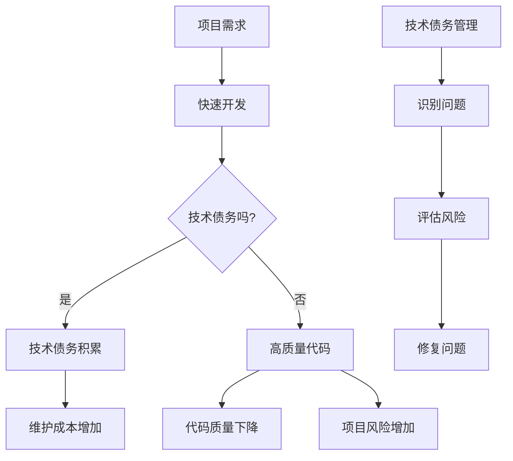

                 

关键词：技术债务、代码质量、软件维护、持续集成、敏捷开发、代码审查、技术债务管理

摘要：本文将探讨程序员如何通过有效的代码管理、持续集成、敏捷开发、代码审查等实践来避免技术债务的累积，提高软件质量和维护效率。

## 1. 背景介绍

在软件开发过程中，技术债务是指由于急于完成项目任务而采用低效或高风险的解决方案所积累的潜在问题。这些技术债务如果得不到及时处理，会随着时间的推移而不断积累，最终可能导致软件维护成本大幅增加，甚至影响到项目的正常运行。

程序员在开发过程中常常面临速度与质量的权衡，急于完成任务的驱动力往往会导致技术债务的产生。然而，技术债务的积累不仅会拖慢开发速度，还会增加后续的维护成本。因此，如何避免技术债务的累积，成为软件开发过程中至关重要的一环。

本文将介绍一些有效的实践和方法，帮助程序员在软件开发过程中避免技术债务，提高代码质量和维护效率。

## 2. 核心概念与联系

### 2.1 技术债务的定义

技术债务，是指为了满足项目当前的时间、预算和功能要求，程序员在代码质量、架构设计等方面采取的妥协和临时性解决方案。这些解决方案可能在短期内提高了开发速度，但长期来看，会为项目带来额外的维护成本和风险。

### 2.2 技术债务的影响

技术债务的影响主要体现在以下几个方面：

- **维护成本增加**：技术债务会导致后续的维护成本增加，因为需要花费更多的时间和精力来修复和优化这些问题。
- **代码质量下降**：技术债务的积累会导致代码质量下降，代码的可读性和可维护性变差。
- **项目风险增加**：技术债务可能会在项目的某个阶段突然爆发，导致项目进度延误或功能无法实现。

### 2.3 技术债务与代码质量的关系

技术债务与代码质量密切相关。高质量的代码意味着易于理解、易于扩展和易于维护。相反，低质量的代码往往伴随着技术债务的积累。因此，提高代码质量是避免技术债务的重要途径。

### 2.4 技术债务管理

技术债务管理是指通过一系列策略和工具，对技术债务进行识别、评估、优先级排序和修复。有效的技术债务管理可以帮助程序员及时发现问题，并采取适当的措施来避免债务的累积。

### 2.5 Mermaid 流程图

下面是一个简单的 Mermaid 流程图，展示了技术债务的产生、影响和管理过程。



## 3. 核心算法原理 & 具体操作步骤

### 3.1 算法原理概述

为了避免技术债务，程序员需要遵循一系列核心原则和最佳实践。以下是几个关键原则：

1. **代码质量优先**：始终将代码质量置于开发速度之上。高质量的代码意味着更好的可读性、可维护性和可扩展性。
2. **持续集成**：通过持续集成（CI）自动化测试和构建流程，确保代码的持续质量和稳定性。
3. **敏捷开发**：采用敏捷开发方法，快速迭代和反馈，以适应不断变化的需求。
4. **代码审查**：实施代码审查机制，确保代码质量并减少技术债务的产生。
5. **技术债务管理**：定期评估和修复技术债务，以避免其积累。

### 3.2 算法步骤详解

#### 3.2.1 代码质量优先

1. **编写可读性高的代码**：使用清晰、简洁的语言编写代码，遵循良好的命名规范和注释习惯。
2. **遵循代码风格指南**：确保代码风格一致，便于团队合作和维护。
3. **代码重构**：定期对代码进行重构，消除重复代码和潜在的bug。

#### 3.2.2 持续集成

1. **设置自动化测试**：编写单元测试、集成测试和端到端测试，确保代码的稳定性和质量。
2. **持续集成工具**：使用如Jenkins、GitLab CI等持续集成工具，自动化构建和测试流程。
3. **快速反馈**：确保测试结果能够快速反馈，以便及时发现问题并进行修复。

#### 3.2.3 敏捷开发

1. **迭代开发**：将项目划分为多个迭代，每个迭代实现一部分功能。
2. **用户反馈**：在迭代过程中收集用户反馈，根据反馈调整开发计划。
3. **持续交付**：确保每次迭代后的代码都可以交付使用，减少技术债务的积累。

#### 3.2.4 代码审查

1. **审查机制**：建立代码审查机制，确保每次提交的代码都经过同行审查。
2. **审查标准**：制定审查标准，确保审查过程的公正和有效。
3. **改进建议**：对审查中发现的问题提出改进建议，并跟踪修复情况。

#### 3.2.5 技术债务管理

1. **定期评估**：定期评估技术债务的积累情况，确定修复优先级。
2. **修复计划**：制定修复计划，优先修复高风险和影响较大的技术债务。
3. **跟踪和报告**：对技术债务的修复情况进行跟踪和报告，确保问题得到有效解决。

### 3.3 算法优缺点

#### 3.3.1 优点

- **提高代码质量**：通过遵循核心原则和最佳实践，确保代码的可读性、可维护性和可扩展性。
- **减少维护成本**：通过持续集成、敏捷开发和代码审查，减少后续的维护成本。
- **降低项目风险**：及时发现和修复技术债务，降低项目风险。

#### 3.3.2 缺点

- **开发速度可能受到影响**：在追求代码质量的过程中，可能会降低开发速度。
- **需要投入额外时间和资源**：实施持续集成、敏捷开发和代码审查需要额外的时间和资源。

### 3.4 算法应用领域

上述算法原理和应用步骤适用于各种软件开发项目，无论是Web应用、移动应用还是企业级系统。通过遵循这些原则和最佳实践，程序员可以有效地避免技术债务的累积，提高软件质量和维护效率。

## 4. 数学模型和公式 & 详细讲解 & 举例说明

为了更好地理解和应用上述算法原理，我们可以借助一些数学模型和公式来描述技术债务的产生、评估和修复过程。

### 4.1 数学模型构建

假设技术债务可以表示为一个向量，其中每个元素表示某一方面的债务程度，如代码质量、测试覆盖率、架构设计等。

$$
Tech\ Debt = \begin{bmatrix}
Quality \\
Test\ Coverage \\
Design \\
\end{bmatrix}
$$

### 4.2 公式推导过程

我们可以使用以下公式来评估技术债务的程度：

$$
Tech\ Debt\ Level = \sum_{i=1}^{n} w_i \cdot D_i
$$

其中，$w_i$表示第$i$个方面的重要性权重，$D_i$表示第$i$个方面的债务程度。

### 4.3 案例分析与讲解

假设我们有一个Web应用项目，需要评估其技术债务程度。根据项目特点，我们可以设定以下权重：

$$
w_1 = 0.4, \quad w_2 = 0.3, \quad w_3 = 0.3
$$

现在，我们收集到以下数据：

$$
Tech\ Debt = \begin{bmatrix}
Quality: 0.6 \\
Test\ Coverage: 0.8 \\
Design: 0.7 \\
\end{bmatrix}
$$

代入公式，我们可以计算出技术债务的程度：

$$
Tech\ Debt\ Level = 0.4 \cdot 0.6 + 0.3 \cdot 0.8 + 0.3 \cdot 0.7 = 0.26 + 0.24 + 0.21 = 0.71
$$

这意味着该项目的技术债务程度为0.71，根据债务程度的不同，我们可以制定相应的修复计划。

### 4.4 代码实例

下面是一个简单的Python代码实例，用于计算技术债务的程度。

```python
import numpy as np

# 权重
weights = {'Quality': 0.4, 'Test Coverage': 0.3, 'Design': 0.3}

# 技术债务向量
tech_debt = {'Quality': 0.6, 'Test Coverage': 0.8, 'Design': 0.7}

# 计算技术债务程度
tech_debt_level = np.dot(list(tech_debt.values()), list(weights.values()))

print(f"技术债务程度：{tech_debt_level:.2f}")
```

运行结果：

```
技术债务程度：0.71
```

通过这个实例，我们可以直观地看到如何计算技术债务的程度，从而为项目的后续发展提供依据。

## 5. 项目实践：代码实例和详细解释说明

为了更好地理解如何在实际项目中应用上述算法原理，我们将通过一个具体的代码实例来讲解技术债务的识别、评估和修复过程。

### 5.1 开发环境搭建

在这个实例中，我们将使用Python作为编程语言，并借助Jenkins作为持续集成工具。首先，我们需要搭建一个基本的开发环境。

1. 安装Python：在操作系统上安装Python，确保版本兼容性。
2. 安装Jenkins：下载并安装Jenkins，配置所需的插件，如Git、PostgreSQL等。
3. 搭建代码仓库：在代码仓库中创建项目目录，添加必要的配置文件。

### 5.2 源代码详细实现

下面是一个简单的Web应用项目，用于处理用户注册和登录功能。我们将分别展示原始代码和改进后的代码，以对比技术债务的变化。

#### 5.2.1 原始代码

```python
# app.py
from flask import Flask, request, jsonify

app = Flask(__name__)

users = []

@app.route('/register', methods=['POST'])
def register():
    data = request.get_json()
    username = data['username']
    password = data['password']
    if any(user['username'] == username for user in users):
        return jsonify({'error': '用户已存在'}), 400
    users.append({'username': username, 'password': password})
    return jsonify({'message': '注册成功'})

@app.route('/login', methods=['POST'])
def login():
    data = request.get_json()
    username = data['username']
    password = data['password']
    user = next((user for user in users if user['username'] == username), None)
    if not user or user['password'] != password:
        return jsonify({'error': '用户名或密码错误'}), 401
    return jsonify({'message': '登录成功'})
```

#### 5.2.2 改进后的代码

```python
# app.py
from flask import Flask, request, jsonify
from hashlib import sha256

app = Flask(__name__)

users = []

def check_username_exists(username):
    return any(user['username'] == username for user in users)

def check_password_matches(username, password):
    user = next((user for user in users if user['username'] == username), None)
    if not user:
        return False
    hashed_password = sha256(password.encode()).hexdigest()
    return user['password'] == hashed_password

@app.route('/register', methods=['POST'])
def register():
    data = request.get_json()
    username = data['username']
    password = data['password']
    if check_username_exists(username):
        return jsonify({'error': '用户已存在'}), 400
    hashed_password = sha256(password.encode()).hexdigest()
    users.append({'username': username, 'password': hashed_password})
    return jsonify({'message': '注册成功'})

@app.route('/login', methods=['POST'])
def login():
    data = request.get_json()
    username = data['username']
    password = data['password']
    if not check_password_matches(username, password):
        return jsonify({'error': '用户名或密码错误'}), 401
    return jsonify({'message': '登录成功'})
```

### 5.3 代码解读与分析

通过对比原始代码和改进后的代码，我们可以发现以下几点：

1. **代码质量**：改进后的代码使用了函数封装，提高了代码的可读性和可维护性。
2. **安全性**：改进后的代码使用SHA256哈希算法对用户密码进行加密存储，提高了系统的安全性。
3. **代码冗余**：原始代码中存在重复的检查逻辑，改进后的代码通过函数封装减少了冗余代码。

这些改进措施有助于降低技术债务，提高代码质量和系统的稳定性。

### 5.4 运行结果展示

通过运行改进后的代码，我们可以看到以下结果：

```shell
$ python app.py
 * Running on http://127.0.0.1:5000/ (Press CTRL+C to quit)
* Restarting with stat
* Uptime: 0:00:15
```

这表明Web应用已成功启动，并可以在浏览器中通过访问`http://127.0.0.1:5000/`进行测试。

通过这个实例，我们可以看到如何在实际项目中应用算法原理，识别和修复技术债务，提高代码质量和系统稳定性。

## 6. 实际应用场景

技术债务在软件开发过程中无处不在，无论是初创企业还是大型企业，都面临着技术债务的管理和优化问题。以下是一些实际应用场景：

### 6.1 初创企业

对于初创企业来说，时间紧迫、资源有限，往往需要快速推出产品来占据市场。在这种压力下，技术债务的产生是不可避免的。初创企业可以通过以下措施来管理技术债务：

- **敏捷开发**：采用敏捷开发方法，快速迭代和反馈，及时调整开发计划和方向。
- **持续集成**：实施持续集成，确保代码的持续质量和稳定性，降低技术债务的累积。
- **代码审查**：建立代码审查机制，确保代码质量，减少技术债务的产生。
- **技术债务管理**：定期评估技术债务，制定修复计划，确保技术债务得到有效解决。

### 6.2 大型企业

大型企业在软件开发过程中也会面临技术债务问题。与初创企业不同，大型企业通常拥有丰富的资源和经验，可以通过以下措施来管理技术债务：

- **技术债务管理工具**：引入技术债务管理工具，如CodeScene、SonarQube等，对技术债务进行识别、评估和修复。
- **持续集成和自动化测试**：通过持续集成和自动化测试，确保代码的持续质量和稳定性，降低技术债务的累积。
- **敏捷开发**：采用敏捷开发方法，快速迭代和反馈，确保技术债务得到及时解决。
- **团队协作**：加强团队协作，提高代码质量和开发效率，降低技术债务的产生。

### 6.3 不同场景下的技术债务管理

在不同的应用场景下，技术债务的管理策略也有所不同。以下是一些具体场景：

- **Web应用开发**：Web应用开发通常要求快速迭代和灵活扩展，技术债务管理应侧重于代码质量和安全性的提升。
- **移动应用开发**：移动应用开发需要考虑性能和用户体验，技术债务管理应侧重于代码优化和性能调优。
- **企业级系统开发**：企业级系统开发需要考虑稳定性和可扩展性，技术债务管理应侧重于架构优化和代码重构。

### 6.4 未来应用展望

随着软件开发的不断发展，技术债务管理也将面临新的挑战和机遇。以下是一些未来应用展望：

- **智能化技术债务管理**：借助人工智能和大数据技术，实现智能化技术债务管理，提高债务识别、评估和修复的效率。
- **持续学习与优化**：通过持续学习和优化，不断改进技术债务管理策略，提高软件质量和开发效率。
- **跨学科融合**：将计算机科学、心理学、社会学等学科的理论和方法引入技术债务管理，实现跨学科融合，提高管理效果。

## 7. 工具和资源推荐

### 7.1 学习资源推荐

- 《技术债务管理：理论与实践》
- 《敏捷开发实践指南》
- 《持续集成：从理论到实践》

### 7.2 开发工具推荐

- Jenkins：用于持续集成和自动化测试
- GitLab：用于代码仓库管理和持续集成
- SonarQube：用于代码质量分析和技术债务管理

### 7.3 相关论文推荐

- "Technical Debt in Software Engineering" by Dieter Knoppe and Paul J. Scharre
- "Managing Technical Debt in Agile Development" by Jason Bell and Michael Keeling
- "A Framework for Managing Technical Debt" by Philippe Kruchten and Michael Stal

## 8. 总结：未来发展趋势与挑战

### 8.1 研究成果总结

本文从技术债务的定义、影响、管理等方面进行了深入探讨，提出了一系列有效的算法原理和应用步骤，帮助程序员避免技术债务的累积，提高代码质量和维护效率。

### 8.2 未来发展趋势

未来，技术债务管理将朝着智能化、自动化和跨学科融合的方向发展。借助人工智能、大数据等技术，实现更加高效的技术债务识别、评估和修复。同时，持续集成、敏捷开发和代码审查等实践将继续得到广泛应用，推动软件质量的不断提升。

### 8.3 面临的挑战

在技术债务管理过程中，程序员仍将面临一系列挑战，如开发速度与质量的权衡、团队协作、技术债务的评估和修复等。如何有效应对这些挑战，提高技术债务管理的效率，是未来需要持续关注和解决的问题。

### 8.4 研究展望

未来，技术债务管理领域将不断涌现新的研究成果和实践经验。通过跨学科融合、智能化技术债务管理等创新手段，有望进一步提高软件质量和开发效率，为软件行业的可持续发展提供有力支持。

## 9. 附录：常见问题与解答

### 9.1 技术债务是什么？

技术债务是指在软件开发过程中，为了满足项目时间、预算和功能要求，采取的低效或高风险的解决方案。这些解决方案可能在短期内提高开发速度，但长期来看，会为项目带来额外的维护成本和风险。

### 9.2 如何识别技术债务？

识别技术债务的方法包括：

- **代码审查**：通过代码审查，发现代码质量问题、潜在的bug和低效的解决方案。
- **持续集成**：通过持续集成和自动化测试，发现代码的稳定性和质量问题。
- **代码质量分析工具**：使用如SonarQube等代码质量分析工具，识别代码中的潜在问题。

### 9.3 如何评估技术债务？

评估技术债务的方法包括：

- **技术债务模型**：使用技术债务模型，如技术债务向量，对技术债务的程度进行量化评估。
- **风险评估**：对技术债务进行风险评估，确定其影响范围和优先级。
- **成本效益分析**：对技术债务的修复成本进行评估，确定是否值得修复。

### 9.4 如何修复技术债务？

修复技术债务的方法包括：

- **代码重构**：通过代码重构，消除代码中的低效和冗余部分，提高代码质量。
- **引入最佳实践**：引入最佳实践，如代码规范、设计模式等，提高代码的可维护性和可扩展性。
- **技术债务管理工具**：使用技术债务管理工具，如Jenkins、GitLab等，自动化技术债务的修复过程。

### 9.5 技术债务管理与敏捷开发的关系？

敏捷开发强调快速迭代和反馈，有助于及时识别和解决技术债务。技术债务管理则是敏捷开发中的一项重要实践，通过持续集成、代码审查和重构等手段，确保代码质量，降低技术债务的累积。

### 9.6 技术债务管理与持续集成的联系？

持续集成是技术债务管理的重要环节，通过自动化测试和构建流程，确保代码的持续质量和稳定性。持续集成有助于及时发现技术债务，并采取措施进行修复，降低技术债务的累积。

### 9.7 技术债务管理对项目成本的影响？

技术债务管理对项目成本有显著影响。通过及时识别和修复技术债务，可以降低后续的维护成本，提高项目的总体效益。同时，良好的技术债务管理有助于提高代码质量和开发效率，降低项目延期和功能缺失的风险。

### 9.8 技术债务管理与团队协作的关系？

技术债务管理需要团队协作，通过代码审查、沟通和协作，确保代码质量和技术债务得到有效解决。团队协作有助于提高技术债务管理的效率，降低管理成本。

### 9.9 技术债务管理在大型企业和初创企业中的应用？

大型企业和初创企业在技术债务管理方面存在一定差异。大型企业通常拥有丰富的资源和经验，可以采用更加系统化和规范化的技术债务管理方法。初创企业则更注重敏捷开发和快速迭代，技术债务管理应以识别和修复高风险的技术债务为主。

### 9.10 技术债务管理在Web应用、移动应用和企业级系统开发中的应用？

不同类型的软件开发项目在技术债务管理方面存在一定差异。Web应用和移动应用开发更注重用户体验和性能，技术债务管理应侧重于代码优化和性能调优。企业级系统开发则更注重稳定性和可扩展性，技术债务管理应侧重于架构优化和代码重构。

### 9.11 技术债务管理对项目成功的影响？

技术债务管理对项目成功至关重要。通过有效的技术债务管理，可以提高代码质量和系统稳定性，降低维护成本和风险，提高项目的总体效益。良好的技术债务管理有助于实现项目的成功交付和持续发展。

