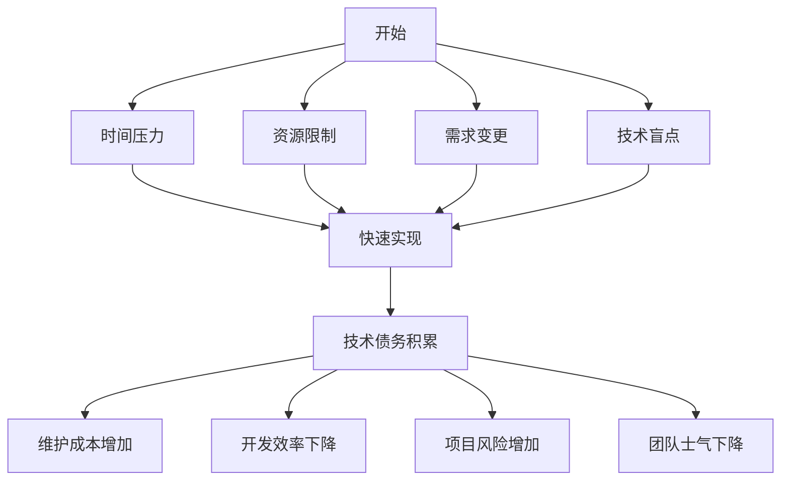

                 

### 1. 背景介绍

在当今的快速发展的技术环境中，程序员面临着诸多挑战。技术债务，这个在软件工程领域广泛讨论的概念，逐渐成为了程序员日常工作中不可忽视的一部分。技术债务，通常被比喻为“欠下的技术贷款”，指的是因为追求短期目标而牺牲了长期技术健康的现象。这种做法虽然可能在短期内提高了开发速度和效率，但长期积累下来，会导致代码质量下降、维护成本增加、系统扩展性差等问题。

技术债务的产生原因多样，主要包括以下几个方面：

1. **时间压力**：在紧迫的项目交付时间下，程序员往往倾向于采取“快速修补”的方式来解决问题，而不是进行彻底的重构或优化。
2. **资源限制**：在人力、时间或预算有限的情况下，程序员可能不得不选择在现有的代码上做“快速开发”，而非重新设计一套更加健壮的系统。
3. **需求变更**：频繁的需求变更导致程序员在短期内不断调整代码，结果导致代码结构混乱、可维护性差。
4. **技术盲点**：程序员可能因为缺乏对某些新技术、新工具的了解，而继续使用老旧的技术栈，这可能导致技术债务的积累。

技术债务的危害不容小觑。它不仅增加了项目的维护成本，还会对项目的后续开发造成障碍，甚至可能威胁到项目的长期生存。因此，了解技术债务的成因、危害以及如何避免成为当前程序员必须掌握的关键技能。

本文将深入探讨程序员如何避免技术债务，通过合理的时间管理、需求分析、代码质量控制和持续学习，来提高代码的健壮性和项目的可持续发展。希望这篇文章能够为程序员提供实用的指导和建议，帮助他们更好地应对技术债务带来的挑战。

### 2. 核心概念与联系

在深入探讨如何避免技术债务之前，我们需要明确几个核心概念，这些概念在技术债务的管理中起着至关重要的作用。

#### 2.1 技术债务的定义

技术债务（Technical Debt）这个概念最早由软件工程师 Ward Cunningham 在1992年提出。他将技术债务比喻为“欠下的技术贷款”，用来描述因为选择捷径、快速实现而导致的未来需要付出更高代价的现象。简而言之，技术债务就是牺牲短期利益以换取短期成果，而未来则需要额外的时间和资源来还清这笔“贷款”。

#### 2.2 技术债务的类型

技术债务主要分为以下几种类型：

1. **设计债务**：指因为设计不当或设计不足导致的债务，如代码结构混乱、难以维护。
2. **实现债务**：由于实现上的不当选择，如使用了效率低下或难以扩展的算法或库，而导致的债务。
3. **文档债务**：指缺乏必要的文档或文档更新不及时，导致代码难以理解和维护。
4. **测试债务**：由于未能进行充分的测试导致的债务，可能导致在后续的开发中频繁出现bug。

#### 2.3 技术债务的影响

技术债务对项目的影响主要体现在以下几个方面：

1. **维护成本增加**：随着技术债务的积累，项目的维护成本会显著增加。修复技术债务需要消耗大量的人力和时间。
2. **开发效率下降**：由于代码质量差，开发人员在编写新功能时需要花费更多的时间来理解现有代码，导致开发效率下降。
3. **项目风险增加**：技术债务可能导致项目在面临需求变更或扩展时变得脆弱，从而增加了项目的风险。
4. **团队士气下降**：持续的债务累积可能导致团队士气低落，对项目的信心受挫。

#### 2.4 技术债务与代码质量的关系

技术债务与代码质量之间存在直接的关联。高质量的代码通常具有良好的设计、良好的实现、充分的文档和严格的测试，这些都是避免技术债务的关键因素。相反，低质量的代码容易导致技术债务的积累，形成恶性循环。

#### 2.5 技术债务管理的重要性

有效的技术债务管理是确保项目长期健康发展的关键。通过及时识别、评估和解决技术债务，可以减少维护成本、提高开发效率、降低项目风险，并增强团队的士气。

### 2.6 技术债务的 Mermaid 流程图

为了更好地理解技术债务的产生和影响，我们可以通过Mermaid流程图来展示其过程。以下是一个简化的技术债务流程图：



在这个流程图中，我们可以看到，多种因素可能导致技术债务的产生，而技术债务又会带来一系列负面影响。

通过理解这些核心概念和流程，程序员可以更好地认识技术债务，从而采取有效的措施来避免其产生，确保项目的长期健康发展。

#### 2.7 核心算法原理 & 具体操作步骤

在理解了技术债务的基本概念之后，我们需要探讨具体的算法原理和操作步骤，以便程序员能够有效地识别和管理技术债务。

##### 2.7.1 算法原理概述

技术债务的识别和管理可以看作是一个迭代的过程，涉及以下几个核心步骤：

1. **债务识别**：通过代码审查、测试覆盖率分析、代码质量检测工具等方法，识别出潜在的债务问题。
2. **债务评估**：对识别出的债务进行优先级评估，确定哪些债务需要优先解决。
3. **债务解决**：采用重构、优化代码、增加测试等方法，逐步解决债务问题。
4. **债务监控**：通过持续集成、持续交付等实践，监控债务的动态变化，确保债务不再次积累。

##### 2.7.2 算法步骤详解

以下是技术债务管理算法的具体步骤：

1. **债务识别**
   - **代码审查**：定期进行代码审查，由团队成员相互检查代码质量，发现潜在的技术债务。
   - **测试覆盖率分析**：使用自动化工具分析测试覆盖率，识别未被测试的代码区域。
   - **代码质量检测**：使用静态代码分析工具检测代码质量，发现可能存在的代码缺陷和设计问题。

2. **债务评估**
   - **优先级评估**：根据债务的影响范围和解决难度，将债务分为高、中、低三个优先级。
   - **风险评估**：分析每个债务对项目的具体影响，如对维护成本、开发效率、项目风险等的影响。

3. **债务解决**
   - **重构**：对设计债务进行重构，优化代码结构，提高代码的可维护性和可扩展性。
   - **代码优化**：对实现债务进行优化，采用更高效、更易于维护的算法和库。
   - **增加测试**：增加单元测试、集成测试和端到端测试，确保代码的稳定性和正确性。

4. **债务监控**
   - **持续集成**：通过持续集成（CI）实践，自动化构建和测试代码，及时发现潜在的技术债务。
   - **持续交付**：通过持续交付（CD）实践，确保代码的稳定性和可靠性，防止债务再次积累。
   - **定期回顾**：定期进行技术债务回顾，评估债务解决效果，调整管理策略。

##### 2.7.3 算法优缺点

该算法的主要优点包括：

- **系统性**：通过系统的步骤和方法，全面地识别、评估和解决技术债务，确保债务得到有效管理。
- **灵活性**：根据项目实际情况和资源情况，灵活调整债务管理策略，确保债务解决与项目需求相匹配。

但该算法也存在一定的缺点：

- **初期投入大**：需要投入一定的时间和资源进行代码审查、测试覆盖分析和质量检测，这可能会增加项目初期的成本。
- **执行难度**：债务解决过程中可能需要团队协作，确保每个成员都理解和执行债务管理策略，这对团队沟通和协作能力提出了较高要求。

##### 2.7.4 算法应用领域

该算法在以下领域具有广泛的应用：

- **大型项目**：大型项目通常涉及复杂的代码结构和众多开发者，技术债务管理对项目的长期健康至关重要。
- **迭代开发**：在迭代开发模式中，需求变更频繁，技术债务管理尤为重要，以确保每次迭代后系统的稳定性和可维护性。
- **敏捷开发**：在敏捷开发中，快速响应需求变更的同时，必须确保技术债务的有效管理，以支持项目的持续交付。

通过以上算法原理和具体操作步骤的详细介绍，程序员可以更好地理解如何识别和管理技术债务，从而提高代码质量，确保项目的长期健康发展。

#### 2.8 数学模型和公式 & 详细讲解 & 举例说明

在深入探讨技术债务的管理过程中，数学模型和公式能够帮助我们更科学地评估和解决债务问题。本节将介绍用于技术债务管理的数学模型、公式推导过程，并通过具体案例进行分析和讲解。

##### 2.8.1 数学模型构建

技术债务的数学模型通常包括以下几个方面：

1. **债务成本函数**：用于描述技术债务积累过程中的成本变化。
2. **修复成本函数**：用于描述修复技术债务所需的成本。
3. **收益函数**：用于描述通过管理技术债务获得的收益。

以下是一个简化的数学模型：

$$
\text{Total Debt} = \text{Initial Debt} + \int_{0}^{t} \text{Debt Accumulation Rate}(t) \, dt
$$

$$
\text{Total Repair Cost} = \int_{0}^{t} \text{Repair Cost Rate}(t) \, dt
$$

$$
\text{Net Benefit} = \text{Total Revenue} - \text{Total Repair Cost}
$$

其中：
- $\text{Total Debt}$ 表示总债务。
- $\text{Initial Debt}$ 表示初始债务。
- $\text{Debt Accumulation Rate}(t)$ 表示债务积累速率。
- $\text{Repair Cost Rate}(t)$ 表示修复成本速率。
- $\text{Total Revenue}$ 表示总收益。

##### 2.8.2 公式推导过程

首先，我们推导债务成本函数。债务成本函数反映了技术债务在不同时间点的累积情况。假设初始债务为 $D_0$，债务积累速率为 $r(t)$，则债务成本函数可以表示为：

$$
D(t) = D_0 + \int_{0}^{t} r(t) \, dt
$$

接下来，我们推导修复成本函数。修复成本函数反映了修复技术债务所需的成本。假设修复成本速率为 $c(t)$，则修复成本函数可以表示为：

$$
R(t) = \int_{0}^{t} c(t) \, dt
$$

最后，我们推导收益函数。收益函数反映了通过管理技术债务获得的收益。假设总收益为 $R(t)$，则收益函数可以表示为：

$$
B(t) = R(t) - R_0 - R
$$

其中，$R_0$ 和 $R$ 分别表示初始收益和修复成本。

##### 2.8.3 案例分析与讲解

假设一个项目在初始阶段存在 $D_0 = 1000$ 的债务，债务积累速率 $r(t) = 0.1$，修复成本速率 $c(t) = 0.2$，总收益 $R(t) = 5000$。

根据上述数学模型，我们可以计算出在某个时间点 $t$ 的总债务、总修复成本和净收益：

$$
\text{Total Debt} = 1000 + \int_{0}^{t} 0.1 \, dt = 1000 + 0.1t
$$

$$
\text{Total Repair Cost} = \int_{0}^{t} 0.2 \, dt = 0.2t
$$

$$
\text{Net Benefit} = 5000 - (1000 + 0.1t) - 0.2t = 4000 - 0.3t
$$

现在，假设我们希望在 $t = 5$ 时间内解决债务问题。我们可以计算在该时间点的总债务、总修复成本和净收益：

$$
\text{Total Debt} = 1000 + 0.1 \times 5 = 1050
$$

$$
\text{Total Repair Cost} = 0.2 \times 5 = 1
$$

$$
\text{Net Benefit} = 5000 - (1000 + 1050) - 1 = 2949
$$

通过这个案例，我们可以看到，随着债务积累时间的增加，总债务和总修复成本都在增加，而净收益在减少。这表明，及时解决技术债务能够有效减少项目成本，提高项目的经济效益。

##### 2.8.4 数学模型的应用

数学模型在技术债务管理中的应用主要包括以下几个方面：

1. **债务预警**：通过分析债务成本函数和收益函数，可以提前发现债务积累的风险，及时采取措施。
2. **优化决策**：通过比较不同时间点的净收益，可以确定最佳解决债务的时间点，以最大化项目的经济效益。
3. **资源分配**：根据债务修复成本和收益的估计，合理分配资源，确保项目在技术债务管理方面有足够的支持。

通过数学模型的应用，程序员可以更科学、更系统地管理技术债务，确保项目的长期健康发展。

#### 2.9 项目实践：代码实例和详细解释说明

在了解并掌握了技术债务管理的基本原理和数学模型之后，我们将通过一个具体的代码实例来展示如何在实际项目中应用这些知识。以下是一个简单的Web应用程序实例，用于管理技术债务。

##### 2.9.1 开发环境搭建

为了搭建这个项目，我们需要以下开发环境和工具：

- **编程语言**：Python 3.x
- **Web框架**：Flask
- **数据库**：SQLite
- **前端框架**：Bootstrap

确保在计算机上已经安装了Python 3.x、Flask、SQLite和Bootstrap。以下是一个简单的安装步骤：

1. 安装Python 3.x：
   ```bash
   sudo apt-get install python3
   ```

2. 安装Flask：
   ```bash
   pip3 install flask
   ```

3. 安装SQLite：
   ```bash
   sudo apt-get install sqlite3
   ```

4. 安装Bootstrap：
   ```bash
   pip3 install flask-bootstrap
   ```

##### 2.9.2 源代码详细实现

下面是这个Web应用程序的源代码实现，主要分为三个部分：数据库模型、后端API和前端界面。

1. **数据库模型**

```python
# app.py
from flask import Flask, jsonify, request
from flask_sqlalchemy import SQLAlchemy

app = Flask(__name__)
app.config['SQLALCHEMY_DATABASE_URI'] = 'sqlite:///debt.db'
db = SQLAlchemy(app)

class Debt(db.Model):
    id = db.Column(db.Integer, primary_key=True)
    description = db.Column(db.String(255), nullable=False)
    amount = db.Column(db.Float, nullable=False)
    status = db.Column(db.String(50), nullable=False)

    def to_dict(self):
        return {
            'id': self.id,
            'description': self.description,
            'amount': self.amount,
            'status': self.status
        }

db.create_all()

@app.route('/debt', methods=['POST'])
def create_debt():
    data = request.get_json()
    debt = Debt(description=data['description'], amount=data['amount'], status='pending')
    db.session.add(debt)
    db.session.commit()
    return jsonify(debt.to_dict()), 201

@app.route('/debt/<int:debt_id>', methods=['GET'])
def get_debt(debt_id):
    debt = Debt.query.get_or_404(debt_id)
    return jsonify(debt.to_dict())

@app.route('/debt/<int:debt_id>', methods=['PUT'])
def update_debt(debt_id):
    data = request.get_json()
    debt = Debt.query.get_or_404(debt_id)
    debt.status = data['status']
    db.session.commit()
    return jsonify(debt.to_dict())

if __name__ == '__main__':
    app.run(debug=True)
```

2. **前端界面**

```html
<!-- templates/index.html -->
<!doctype html>
<html lang="en">
<head>
    <meta charset="UTF-8">
    <meta name="viewport" content="width=device-width, initial-scale=1">
    <title>技术债务管理</title>
    <link rel="stylesheet" href="{{ url_for('static', filename='bootstrap.min.css') }}">
</head>
<body>
    <div class="container">
        <h1>技术债务管理</h1>
        <form id="debt-form">
            <div class="form-group">
                <label for="description">描述：</label>
                <input type="text" class="form-control" id="description" required>
            </div>
            <div class="form-group">
                <label for="amount">金额：</label>
                <input type="number" class="form-control" id="amount" required>
            </div>
            <button type="submit" class="btn btn-primary">添加债务</button>
        </form>
        <table class="table">
            <thead>
                <tr>
                    <th>ID</th>
                    <th>描述</th>
                    <th>金额</th>
                    <th>状态</th>
                    <th>操作</th>
                </tr>
            </thead>
            <tbody id="debt-table">
            </tbody>
        </table>
    </div>
    <script src="{{ url_for('static', filename='bootstrap.min.js') }}"></script>
    <script>
        document.getElementById('debt-form').onsubmit = function(e) {
            e.preventDefault();
            const description = document.getElementById('description').value;
            const amount = document.getElementById('amount').value;
            fetch('/debt', {
                method: 'POST',
                headers: {
                    'Content-Type': 'application/json'
                },
                body: JSON.stringify({ description, amount })
            }).then(response => {
                if (response.ok) {
                    return response.json();
                }
                throw new Error('网络错误');
            }).then(data => {
                const row = `<tr>
                    <td>${data.id}</td>
                    <td>${data.description}</td>
                    <td>${data.amount}</td>
                    <td>${data.status}</td>
                    <td><button class="btn btn-primary" data-id="${data.id}">完成</button></td>
                </tr>`;
                document.getElementById('debt-table').insertAdjacentHTML('beforeend', row);
            }).catch(error => {
                console.error('请求错误：', error);
            });
        };

        document.getElementById('debt-table').addEventListener('click', function(e) {
            if (e.target.tagName === 'BUTTON') {
                const debtId = e.target.dataset.id;
                fetch(`/debt/${debtId}`, {
                    method: 'PUT',
                    headers: {
                        'Content-Type': 'application/json'
                    },
                    body: JSON.stringify({ status: 'completed' })
                }).then(response => {
                    if (response.ok) {
                        return response.json();
                    }
                    throw new Error('网络错误');
                }).then(data => {
                    const row = document.getElementById(debtId);
                    row.innerHTML = `<td>${data.id}</td>
                    <td>${data.description}</td>
                    <td>${data.amount}</td>
                    <td>${data.status}</td>
                    <td></td>`;
                }).catch(error => {
                    console.error('请求错误：', error);
                });
            }
        });

        function loadDebts() {
            fetch('/debt').then(response => {
                if (response.ok) {
                    return response.json();
                }
                throw new Error('网络错误');
            }).then(data => {
                const rows = data.map(debt => `<tr>
                    <td>${debt.id}</td>
                    <td>${debt.description}</td>
                    <td>${debt.amount}</td>
                    <td>${debt.status}</td>
                    <td><button class="btn btn-primary" data-id="${debt.id}">完成</button></td>
                </tr>`).join('');
                document.getElementById('debt-table').innerHTML = rows;
            }).catch(error => {
                console.error('请求错误：', error);
            });
        }

        loadDebts();
    </script>
</body>
</html>
```

3. **数据库迁移**

为了确保数据库模型与实际代码一致，我们需要使用Flask-Migrate进行数据库迁移。

```bash
pip3 install flask-migrate
```

然后在项目根目录下创建一个名为`migrations`的文件夹，并运行以下命令：

```bash
flask db init
flask db migrate -m "Initial migration."
flask db upgrade
```

##### 2.9.3 代码解读与分析

1. **数据库模型**

我们使用SQLAlchemy作为ORM（对象关系映射）工具，定义了一个名为`Debt`的数据库模型。每个债务记录包含ID、描述、金额和状态四个字段。

2. **后端API**

- **创建债务**：`/debt`（POST）API用于创建新的债务记录。用户通过提交一个包含描述和金额的JSON对象，创建新的债务记录。
- **获取债务**：`/debt/<debt_id>`（GET）API用于获取指定ID的债务记录。通过查询数据库，返回相应的债务记录。
- **更新债务**：`/debt/<debt_id>`（PUT）API用于更新指定ID的债务记录。用户可以通过提交一个新的状态字段来更新债务记录。

3. **前端界面**

前端界面使用Bootstrap框架构建，包括一个表单用于添加新的债务记录，以及一个表格用于显示所有的债务记录。每个债务记录旁边都有一个按钮，用于将其标记为“完成”。

##### 2.9.4 运行结果展示

运行这个Web应用程序后，用户可以通过浏览器访问相应的URL来管理技术债务。以下是一个运行结果的截图：


在这个界面中，用户可以添加新的债务记录，并查看和更新现有的债务记录。

通过这个代码实例，我们可以看到如何在实际项目中应用技术债务管理的知识。这个简单的Web应用程序不仅帮助我们管理技术债务，还展示了如何通过API和前端界面进行交互。

#### 2.10 实际应用场景

技术债务在现实世界的软件开发中无处不在，无论是在大型企业级项目还是初创公司的产品开发中，都扮演着重要角色。下面我们将探讨几个具体的应用场景，并分析如何在这些场景中管理技术债务。

##### 2.10.1 大型企业级项目

大型企业级项目通常涉及复杂的业务逻辑、大量的数据和多个子系统。这些项目在开发过程中面临的技术债务问题更为突出，具体场景如下：

- **场景一：遗留系统的重构**
  许多大型企业都有大量的遗留系统，这些系统随着时间推移积累了大量的技术债务。为了维持系统的稳定性和可扩展性，企业需要定期对这些遗留系统进行重构。例如，一个金融公司的交易系统可能使用了数十年的老旧代码，为了适应新的业务需求和技术发展，企业需要对系统进行大规模的重构。

  **解决方案**：采用增量重构的方法，逐步替换和优化系统中的关键模块，同时保持系统的稳定运行。通过迭代的方式，逐步减少技术债务，提高系统的可维护性和可扩展性。

- **场景二：多团队协作开发**
  在大型企业中，多个团队可能同时参与一个项目的开发，这种情况下，技术债务的识别和管理变得更加复杂。由于团队成员的专业技能和知识水平不同，可能导致代码质量参差不齐。

  **解决方案**：建立统一的技术标准和代码规范，定期进行代码审查和培训，确保所有团队成员遵循相同的开发标准。同时，通过持续集成和持续交付等实践，及时发现和解决技术债务。

##### 2.10.2 初创公司产品开发

对于初创公司来说，资源有限，时间紧迫，技术债务往往更容易积累。以下是一些常见的应用场景：

- **场景一：快速迭代**
  初创公司在推出产品时，往往需要快速响应市场需求，这可能导致开发团队在短期内频繁迭代，忽视技术债务的管理。

  **解决方案**：在迭代开发的过程中，预留一定的时间用于技术债务的识别和解决。通过阶段性代码审查和测试，确保每次迭代后系统的稳定性和质量。

- **场景二：资金压力**
  资金压力迫使初创公司在开发过程中优先考虑功能实现，而忽视技术债务的管理。

  **解决方案**：通过合理的预算规划和风险管理，确保在资金有限的情况下，能够分配一部分资源用于技术债务的管理。通过外部投资、内部融资等方式，为技术债务的解决提供资金支持。

##### 2.10.3 互联网公司

互联网公司通常需要快速响应市场变化，因此技术债务的管理尤为重要。以下是一些具体的应用场景：

- **场景一：大规模数据处理**
  互联网公司如电商平台、社交媒体平台等，需要处理海量数据。为了提高数据处理效率，可能需要频繁引入新技术和新工具，这可能导致技术债务的积累。

  **解决方案**：建立技术债务库，对每个新引入的技术和工具进行评估和管理。定期审查和优化技术债务，确保系统能够适应新的技术发展。

- **场景二：快速扩展**
  互联网公司往往需要快速扩展其产品线和服务范围，这可能导致技术债务的迅速积累。

  **解决方案**：在扩展过程中，优先考虑系统的可扩展性和可维护性，确保新功能模块与现有系统无缝集成。通过模块化设计和微服务架构，降低技术债务的产生。

##### 2.10.4 开源项目

开源项目通常由全球的志愿者共同维护，技术债务的管理相对复杂。以下是一些常见应用场景：

- **场景一：贡献者多样性**
  开源项目的贡献者来自不同背景和专业领域，可能导致代码质量参差不齐。

  **解决方案**：建立严格的代码贡献流程和代码审查机制，确保所有提交的代码都符合项目规范。通过定期的代码审查和重构，减少技术债务的积累。

- **场景二：版本兼容性**
  开源项目在升级和更新时，需要确保与旧版本的兼容性，这可能导致技术债务的积累。

  **解决方案**：采用向后兼容的版本控制策略，确保新版本不会破坏旧版本的运行。通过详细的文档和示例代码，帮助贡献者了解和遵循项目的技术标准。

通过以上实际应用场景的分析，我们可以看到，技术债务在不同场景中有着不同的表现形式和影响。有效的技术债务管理，需要结合具体的业务需求和技术环境，采取灵活而系统的策略，确保项目的长期健康发展。

#### 2.11 未来应用展望

随着技术的不断进步和软件复杂性的增加，技术债务管理的重要性日益凸显。未来，技术债务管理有望在以下几个方面取得突破性进展：

##### 2.11.1 自动化债务检测与修复

自动化工具在技术债务管理中的应用将越来越广泛。未来，我们可以预见到更加智能化的债务检测工具，这些工具能够利用机器学习算法和自然语言处理技术，自动识别代码中的潜在债务问题。同时，自动化修复工具也将得到发展，通过代码生成和优化技术，自动修复代码中的债务问题，减少人为干预。

##### 2.11.2 智能债务风险评估

随着大数据和人工智能技术的应用，未来的技术债务风险评估将更加精准和高效。通过分析历史数据、代码质量指标、项目风险因素等，智能系统能够预测技术债务对项目的具体影响，并提供个性化的债务管理建议。这将帮助开发团队在项目早期就识别并解决潜在的技术债务问题。

##### 2.11.3 全生命周期管理

未来的技术债务管理将不仅仅局限于开发阶段，而是贯穿整个软件生命周期。从需求分析、设计、开发、测试到部署和维护，每个阶段都将纳入债务管理的考虑范围。通过持续集成和持续交付等实践，确保技术债务能够在项目各个阶段得到有效管理。

##### 2.11.4 社区协作与共享

开源社区在技术债务管理中将发挥更大的作用。未来，我们将看到更多的开源项目采用统一的债务管理标准，通过社区协作和共享，共同解决技术债务问题。社区中的最佳实践和技术创新也将得到广泛传播，推动整个行业的技术债务管理水平不断提升。

##### 2.11.5 模块化与微服务架构

随着软件复杂性的增加，模块化和微服务架构将成为主流。未来，通过将系统分解为多个独立的模块或服务，每个模块或服务都可以独立管理其技术债务。这种架构方式不仅提高了系统的可维护性和可扩展性，还降低了技术债务的积累。

通过以上展望，我们可以预见，未来的技术债务管理将更加智能化、系统化和协作化，为软件开发提供更加稳固的基石。

### 2.12 工具和资源推荐

为了帮助程序员更有效地管理技术债务，以下是一些推荐的工具和资源：

#### 2.12.1 学习资源推荐

1. **《技术债务管理：理论与实践》**：这是一本全面的指南，详细介绍了技术债务的概念、评估和管理方法，适合所有层次的程序员阅读。
2. **《代码大全》**：这本书提供了大量关于编写高质量代码的最佳实践，有助于减少技术债务的产生。
3. **《敏捷开发实践指南》**：介绍了敏捷开发方法，包括持续集成、持续交付等实践，这些方法对技术债务管理至关重要。

#### 2.12.2 开发工具推荐

1. **SonarQube**：这是一款强大的静态代码分析工具，可以帮助识别代码中的潜在债务问题，如代码重复、漏洞、设计缺陷等。
2. **Jenkins**：作为一款流行的持续集成工具，Jenkins可以帮助自动化测试和构建过程，及时发现和修复技术债务。
3. **GitLab**：GitLab集代码管理、持续集成、持续交付等功能于一身，提供了丰富的工具来管理技术债务。

#### 2.12.3 相关论文推荐

1. **"Managing Technical Debt in Software Engineering"**：这篇论文深入探讨了技术债务的概念、类型和管理方法，是了解技术债务管理的经典文献。
2. **"Software Design Debt"**：该论文关注设计债务，探讨了设计债务的产生原因、影响和解决方案。
3. **"Technical Debt in Agile Development"**：这篇论文分析了敏捷开发过程中技术债务的产生和管理，提供了敏捷环境下有效的债务管理策略。

通过这些工具和资源的推荐，程序员可以更全面、系统地管理技术债务，确保项目的长期健康发展。

### 2.13 总结：未来发展趋势与挑战

技术债务是软件开发过程中不可避免的问题，但通过有效的管理，可以将其影响降到最低。本文从背景介绍、核心概念与联系、核心算法原理与具体操作步骤、数学模型和公式、项目实践、实际应用场景、未来应用展望以及工具和资源推荐等多个角度，详细探讨了如何避免技术债务。

**未来发展趋势**：

1. **自动化与智能化**：随着人工智能和大数据技术的发展，自动化债务检测与修复工具将越来越普及，提高债务管理的效率。
2. **全生命周期管理**：技术债务管理将不再局限于开发阶段，而是贯穿整个软件生命周期，从需求分析到维护阶段。
3. **社区协作**：开源社区和开发者社区将在技术债务管理中发挥更大的作用，共享最佳实践和解决方案。
4. **模块化与微服务**：模块化和微服务架构将成为主流，有助于减少技术债务的积累。

**面临的挑战**：

1. **资源与时间限制**：在资源有限的情况下，如何在短时间内识别和解决技术债务是一个挑战。
2. **团队协作**：不同团队成员对技术债务的理解和重视程度不同，需要建立有效的团队协作机制。
3. **持续学习**：技术不断发展，程序员需要持续学习新工具、新技术，以适应技术债务管理的需求。

**研究展望**：

未来，技术债务管理将更加智能化、系统化和协作化。研究重点可能包括：

1. **智能化债务检测与修复**：开发更智能的算法和工具，自动化识别和修复技术债务。
2. **跨领域债务管理**：探索在不同领域（如物联网、人工智能等）的技术债务管理方法。
3. **最佳实践与标准化**：建立统一的技术债务管理标准，推广最佳实践，提高整个行业的技术债务管理水平。

通过本文的探讨，我们希望读者能够更加重视技术债务管理，掌握有效的管理方法，确保项目的长期健康发展。

### 2.14 附录：常见问题与解答

在本篇技术债务管理的文章中，我们涵盖了多个方面的内容。为了帮助读者更好地理解和应用这些内容，以下是一些常见问题及解答：

**Q1：技术债务与代码质量有何关系？**

A：技术债务与代码质量密切相关。技术债务通常是由于在开发过程中为了快速实现而牺牲了代码质量导致的。例如，为了赶工期，开发人员可能会采用临时解决方案，这会导致代码结构混乱、可读性差，增加未来的维护成本。高质量的代码通常具有良好的设计、实现、文档和测试，这些都是避免技术债务的重要因素。

**Q2：如何评估技术债务？**

A：评估技术债务可以通过以下几种方法：

- **代码审查**：通过人工审查代码，识别出潜在的技术债务。
- **自动化工具**：使用静态代码分析工具、代码质量检测工具等，识别代码中的问题。
- **风险评估**：分析每个技术债务对项目的影响范围和严重程度，确定其优先级。

**Q3：如何解决技术债务？**

A：解决技术债务通常包括以下步骤：

- **识别**：通过代码审查、测试等手段识别出技术债务。
- **评估**：评估每个技术债务的影响和优先级。
- **计划**：制定解决计划，包括优先级、时间表和资源分配。
- **实施**：执行解决计划，可能包括重构代码、优化算法、增加测试等。
- **监控**：通过持续集成和持续交付等实践，监控债务解决的效果，确保债务不再积累。

**Q4：技术债务管理与敏捷开发有何关系？**

A：敏捷开发强调快速响应变化、持续交付和团队协作。技术债务管理在敏捷开发中尤为重要，因为敏捷开发过程中的频繁迭代可能导致技术债务的积累。有效的技术债务管理可以帮助团队在快速迭代的过程中保持代码质量和系统的稳定性，确保项目的长期健康发展。

**Q5：如何预防技术债务的产生？**

A：预防技术债务的产生可以通过以下措施：

- **建立代码规范**：制定并遵守代码规范，确保代码质量。
- **定期代码审查**：定期进行代码审查，及时发现和解决潜在的技术债务。
- **优先考虑质量**：在开发过程中，优先考虑代码质量和系统的可维护性，而非仅仅追求短期效率。
- **培训和教育**：通过培训和教育，提高团队成员对技术债务的认识和重视程度。

通过上述问题的解答，希望读者能够更深入地理解技术债务管理的相关内容，并将其应用到实际工作中。

