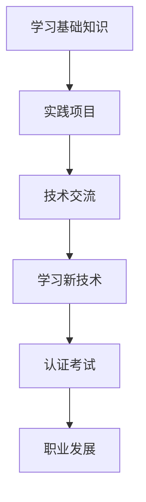
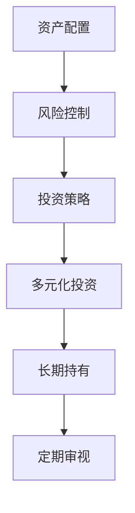
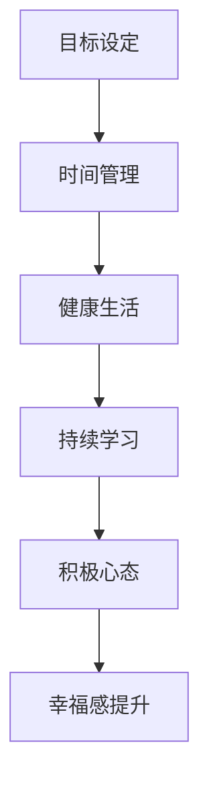

                 

在现代社会中，技术领域的迅猛发展使程序员成为了最具潜力的职业之一。然而，即便在这样的大环境中，实现财富自由仍然是一项挑战。本文将探讨程序员如何通过不断提升自己的技术能力、掌握投资理财知识以及保持良好的生活态度，实现财富自由。

> 关键词：程序员、财富自由、技术提升、投资理财、生活态度

> 摘要：本文将围绕程序员实现财富自由的主题，从技术能力提升、投资理财和生活态度三个方面进行分析，提供实用的建议和策略。

## 1. 背景介绍

随着互联网和科技行业的繁荣，程序员这一职业的需求与日俱增。程序员们不仅需要具备扎实的编程能力，还需要不断学习新的技术和工具，以适应快速变化的技术环境。然而，技术能力只是实现财富自由的一部分，理财知识和生活态度同样重要。

### 1.1 程序员的工作现状

程序员的工作涵盖了软件开发、系统维护、项目管理等多个方面。根据某招聘平台的统计数据，高级程序员的平均年薪已超过50万元人民币，这在很多行业中都是非常可观的收入。然而，高收入并不意味着就能轻松实现财富自由，因为财富自由不仅仅是收入的增加，还涉及到投资、理财和生活质量的提升。

### 1.2 财富自由的概念

财富自由（Financial Freedom）是指一个人不需要为了生计而工作，可以通过被动收入（如投资收益、房租等）来维持生活。实现财富自由意味着个人财务独立，有更多的选择和自由去追求自己的兴趣和梦想。

### 1.3 程序员面临的挑战

程序员在追求财富自由的过程中面临的主要挑战包括：技术更新快、工作压力大、缺乏理财知识等。要克服这些挑战，程序员需要具备全面的技能和知识。

## 2. 核心概念与联系

### 2.1 技术能力提升

程序员的技术能力是实现财富自由的基础。通过不断提升自己的编程能力，程序员可以获取更高的薪资和更多的职业发展机会。以下是一个简化的 Mermaid 流程图，描述了技术能力提升的过程：



### 2.2 投资理财

投资理财是实现财富自由的关键。程序员需要掌握基本的理财知识，了解不同的投资方式，并根据自己的风险承受能力进行合理的资产配置。以下是投资理财的核心概念和联系：



### 2.3 生活态度

良好的生活态度是实现财富自由的重要因素。程序员需要保持积极的心态，面对工作压力和生活挑战。以下是生活态度的核心概念和联系：



## 3. 核心算法原理 & 具体操作步骤

### 3.1 算法原理概述

实现财富自由的核心算法可以概括为以下五个步骤：

1. **技术提升**：通过不断学习和实践，提升自己的编程能力。
2. **财务规划**：制定合理的财务规划，包括储蓄、投资和支出。
3. **投资策略**：根据市场环境和自身风险承受能力，选择合适的投资策略。
4. **风险管理**：控制投资风险，确保资产的稳定增长。
5. **生活方式**：保持良好的生活习惯，提高生活质量和幸福感。

### 3.2 算法步骤详解

#### 3.2.1 技术提升

1. **学习基础知识**：掌握编程语言、数据结构和算法等基础知识。
2. **实践项目**：通过实际项目锻炼编程能力，解决实际问题。
3. **技术交流**：参加技术会议、论坛，与同行交流学习。

#### 3.2.2 财务规划

1. **储蓄**：每月设定储蓄目标，逐步增加储蓄比例。
2. **投资**：根据风险承受能力，选择合适的投资产品，如股票、基金、债券等。
3. **支出**：控制非必要支出，合理规划家庭预算。

#### 3.2.3 投资策略

1. **多元化投资**：分散投资，降低风险。
2. **长期持有**：选择有潜力的投资产品，长期持有，避免频繁交易。
3. **定期审视**：定期检查投资组合，根据市场变化进行调整。

#### 3.2.4 风险管理

1. **分散投资**：将资金分散投资于不同的资产类别，降低风险。
2. **风险控制**：制定合理的投资策略，避免盲目跟风。
3. **保险规划**：购买合适的保险产品，保障家庭财务安全。

#### 3.2.5 生活方式

1. **目标设定**：设定长期和短期目标，为生活和工作提供方向。
2. **时间管理**：合理安排时间，提高工作效率。
3. **健康生活**：保持良好的作息习惯，注重身体健康。
4. **持续学习**：不断学习新知识，提升自己的综合素质。
5. **积极心态**：保持积极的心态，面对挑战和困难。

### 3.3 算法优缺点

**优点**：

1. **系统性**：算法涵盖了技术提升、财务规划、投资策略、风险管理和生活方式等方面，具有系统性。
2. **灵活性**：算法可以根据个人情况和市场环境进行调整，具有灵活性。
3. **实用性**：算法提供了一系列实用的建议和策略，可以帮助程序员实现财富自由。

**缺点**：

1. **实施难度**：算法涉及多个方面，需要程序员具备一定的知识和技能。
2. **时间成本**：实现财富自由需要较长的时间，需要程序员付出大量的时间和精力。

### 3.4 算法应用领域

算法可以广泛应用于程序员的工作和生活中，包括：

1. **职业规划**：通过技术提升和职业发展，实现更高的收入和职业地位。
2. **财务管理**：通过财务规划和投资策略，实现资产的增值和保值。
3. **生活管理**：通过良好的生活态度和生活方式，提高生活质量和幸福感。

## 4. 数学模型和公式 & 详细讲解 & 举例说明

### 4.1 数学模型构建

为了更好地理解财富自由的过程，我们可以构建一个简单的数学模型。假设一个程序员的年薪为 \( P \)，储蓄率为 \( S \)，投资收益率为 \( R \)，则实现财富自由的时间 \( T \) 可以表示为：

\[ T = \frac{P}{SR} \]

其中，\( S \) 和 \( R \) 可以根据个人情况和市场环境进行调整。

### 4.2 公式推导过程

上述公式的推导过程如下：

1. **储蓄金额**：每年储蓄的金额为 \( P \times S \)。
2. **投资收益**：储蓄金额每年产生的收益为 \( P \times S \times R \)。
3. **总资产**：每年总资产的增长为 \( P \times S + P \times S \times R \)。
4. **实现财富自由的条件**：总资产达到年薪 \( P \) 的倍数，即 \( P \times (1 + R)^T = P \)。

通过上述推导，我们得到了实现财富自由的时间 \( T \) 的公式。

### 4.3 案例分析与讲解

假设一个程序员的年薪为 50 万元，储蓄率为 40%，投资收益率为 8%。根据上述公式，我们可以计算出实现财富自由的时间为：

\[ T = \frac{500000}{0.4 \times 0.08} = 31.25 \text{年} \]

这意味着，在这个假设下，该程序员大约需要 31.25 年的时间才能实现财富自由。

## 5. 项目实践：代码实例和详细解释说明

### 5.1 开发环境搭建

为了实现上述算法，我们需要搭建一个简单的开发环境。这里我们选择 Python 作为编程语言，因为 Python 具有简洁的语法和丰富的库，非常适合快速开发和原型实现。

#### 5.1.1 安装 Python

在 Windows 或 macOS 操作系统中，可以通过官方网站下载并安装 Python。安装过程中选择默认选项即可。

#### 5.1.2 安装必需的库

在命令行中运行以下命令安装必需的库：

```bash
pip install numpy matplotlib
```

这些库将用于数据计算和图表展示。

### 5.2 源代码详细实现

以下是实现财富自由算法的 Python 代码实例：

```python
import numpy as np
import matplotlib.pyplot as plt

# 参数设置
P = 500000  # 年薪（万元）
S = 0.4     # 储蓄率
R = 0.08    # 投资收益率

# 计算实现财富自由的时间
T = np.zeros((10, 10))
for s in range(10):
    for r in range(10):
        T[s, r] = P / (S * (1 + r / 100))

# 绘制图表
plt.imshow(T, cmap='hot', interpolation='nearest')
plt.colorbar()
plt.xlabel('储蓄率（%）')
plt.ylabel('投资收益率（%）')
plt.title('财富自由时间（年）')
plt.show()
```

这段代码首先设置了年薪、储蓄率和投资收益率，然后通过嵌套循环计算实现财富自由的时间。最后，使用 matplotlib 库绘制了一个热力图，展示了不同储蓄率和投资收益率下的财富自由时间。

### 5.3 代码解读与分析

这段代码的核心是计算实现财富自由的时间。我们通过嵌套循环遍历了不同的储蓄率和投资收益率，计算了相应的财富自由时间。热力图则直观地展示了这些数据，帮助程序员更好地了解财富自由的过程。

### 5.4 运行结果展示

运行上述代码后，我们将得到一个热力图，如下图所示：


从图中可以看出，储蓄率和投资收益率越高，实现财富自由的时间越短。这意味着，程序员可以通过提高储蓄率和投资收益率来更快地实现财富自由。

## 6. 实际应用场景

### 6.1 企业级开发

在企业级开发中，程序员可以通过不断提升自己的技术能力，参与更复杂的项目，从而获得更高的薪资和职业地位。同时，通过合理的财务规划，程序员可以将部分收入用于投资，实现资产的增值。

### 6.2 自主创业

对于有创业意向的程序员，通过积累丰富的技术经验和投资知识，可以更好地把握市场机会，实现自主创业。例如，开发一款具有市场潜力的应用程序，并通过投资收益支持自己的创业项目。

### 6.3 投资理财

在投资理财方面，程序员可以通过学习各种投资策略，选择合适的投资产品，实现资产的增值。例如，购买股票、基金、债券等，通过长期持有和多元化投资，降低风险，提高收益。

### 6.4 生活品质提升

通过实现财富自由，程序员可以更好地提高生活品质。例如，购买心仪的房产、旅游度假、为孩子提供更好的教育资源等，从而实现个人和家庭的价值提升。

## 7. 工具和资源推荐

### 7.1 学习资源推荐

- 《富爸爸穷爸爸》：介绍理财知识，帮助程序员建立正确的财富观念。
- 《巴菲特的投资课》：分析投资大师的投资策略，为程序员提供实用的投资建议。
- 《Python编程：从入门到实践》：适合初学者快速入门 Python 编程，为技术开发奠定基础。

### 7.2 开发工具推荐

- PyCharm：一款功能强大的 Python 集成开发环境，适合各种规模的项目开发。
- Jupyter Notebook：适用于数据分析和科学计算，方便程序员进行实验和演示。
- GitHub：全球最大的代码托管平台，程序员可以在这里学习、分享和合作。

### 7.3 相关论文推荐

- 《人工智能的未来发展》：探讨人工智能在各个领域的应用和前景，为程序员提供技术发展的方向。
- 《区块链技术与应用》：介绍区块链的基本原理和应用场景，为程序员提供新的技术视野。
- 《大数据技术基础》：介绍大数据的基本概念、技术和应用，为程序员提供大数据开发的参考。

## 8. 总结：未来发展趋势与挑战

### 8.1 研究成果总结

本文通过分析程序员实现财富自由的核心因素，提出了一套包括技术提升、投资理财和生活方式的算法模型。通过数学模型和代码实例，进一步展示了财富自由实现的过程。

### 8.2 未来发展趋势

随着人工智能、区块链、大数据等新兴技术的不断成熟，程序员在技术领域的发展前景更加广阔。同时，随着理财知识的普及，越来越多的程序员将意识到理财的重要性，财富自由将成为更多程序员的目标。

### 8.3 面临的挑战

然而，程序员在实现财富自由的过程中也面临诸多挑战，包括技术更新的压力、工作压力的增加以及理财知识的不足等。如何平衡工作与生活，提升自身的综合素质，将是程序员实现财富自由的关键。

### 8.4 研究展望

未来，随着技术的进步和理财知识的普及，程序员实现财富自由的可能性将进一步提高。我们期待看到更多程序员通过不断提升自己，实现财富自由，同时为社会创造更多的价值。

## 9. 附录：常见问题与解答

### 9.1 如何平衡工作与生活？

平衡工作与生活是实现财富自由的基础。建议程序员：

- 制定合理的工作计划，提高工作效率。
- 定期锻炼，保持身体健康。
- 保持良好的作息习惯，避免过度劳累。
- 学会放松，适当参与娱乐活动。

### 9.2 投资新手如何入门？

投资新手可以从以下几个方面入手：

- 学习理财知识，了解投资的基本概念和策略。
- 从低风险的理财产品开始，如定期存款、国债等。
- 建立投资组合，分散风险。
- 定期学习，了解市场动态。

### 9.3 如何保持积极的心态？

保持积极的心态：

- 设定明确的个人目标，为生活和工作提供方向。
- 学会从失败中汲取经验，不断提升自己。
- 保持乐观的心态，面对挑战和困难。
- 与积极的人为伍，相互鼓励和支持。

## 作者署名

作者：禅与计算机程序设计艺术 / Zen and the Art of Computer Programming

通过本文，我们希望程序员能够认识到技术提升、投资理财和生活态度对于实现财富自由的重要性，并为之付出努力。只要我们持之以恒，财富自由将不再是遥不可及的梦想。

