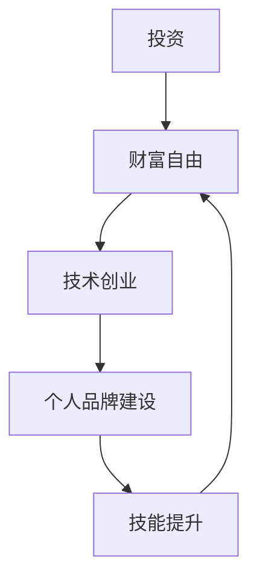

                 

关键词：程序员、财富自由、投资策略、技术创业、个人品牌建设、技能提升

> 摘要：本文旨在探讨程序员如何通过合理的投资策略、技术创业和个人品牌建设等途径实现财富自由。文章将结合实际案例，提供实用的建议和策略，帮助程序员在技术领域中取得成功，进而实现财务独立和自由。

## 1. 背景介绍

程序员作为一个高知识、高技能的职业群体，在现代社会中占据了重要的地位。他们通过编写代码、设计和开发软件，为社会创造了巨大的价值。然而，尽管程序员在技术上具备优势，但在实现财富自由的道路上却面临着诸多挑战。首先，技术行业的波动性和不确定性使得程序员需要不断更新知识和技能，以保持竞争力。其次，薪资水平与工作年限、经验和职位等因素密切相关，初期薪资相对较低，需要较长的时间积累。最后，投资渠道相对有限，程序员需要掌握一定的投资知识和策略，才能实现财富的增值。

本文将结合实际案例，探讨程序员如何通过以下途径实现财富自由：

1. **合理的投资策略**：包括股票、基金、房地产等多种投资方式，帮助程序员实现资产的多元化配置。
2. **技术创业**：通过创业实现财务自由，是许多程序员的梦想。本文将分析技术创业的成功案例，并提供创业建议。
3. **个人品牌建设**：在技术领域中建立个人品牌，不仅有助于提升个人影响力，还能为职业发展带来更多机会。
4. **技能提升**：不断学习和提升技能，是程序员实现财富自由的基础。本文将介绍一些有效的学习方法，帮助程序员在职业道路上不断前进。

## 2. 核心概念与联系

为了更好地理解程序员实现财富自由的路径，我们首先需要了解几个核心概念：

### 2.1 投资与财富自由

投资是指将资金投入到各种资产中，以期望获得收益的过程。财富自由是指个人拥有足够的资产，无需依赖劳动收入即可维持生活品质。

### 2.2 技术创业

技术创业是指创业者利用技术手段，开发创新产品或服务，以实现商业成功的过程。技术创业的特点是高风险和高回报，对创业者的技术能力和商业眼光都有较高要求。

### 2.3 个人品牌建设

个人品牌建设是指个人在特定领域内建立专业形象和影响力的过程。一个强大的个人品牌可以帮助个人获得更多机会，提升职业价值。

### 2.4 技能提升

技能提升是指个人通过学习、实践和经验积累，提高自身技能水平的过程。对于程序员来说，技能提升是保持竞争力和实现职业发展的关键。

下面是一个用Mermaid绘制的流程图，展示了这些概念之间的联系：



### 3. 核心算法原理 & 具体操作步骤

在实现财富自由的过程中，程序员需要掌握一系列的核心算法原理，并将其应用于实际操作中。以下是对这些算法原理的概述和具体操作步骤：

#### 3.1 算法原理概述

1. **投资组合优化**：通过数学模型和算法，为投资者提供最优的投资组合策略，以实现资产的多元化配置和风险控制。
2. **风险管理**：利用统计模型和算法，对投资风险进行预测和管理，降低投资损失的可能性。
3. **市场趋势分析**：通过数据分析和技术分析，识别市场趋势和机会，为投资决策提供支持。
4. **个人品牌建设策略**：利用市场营销和传播学原理，制定和实施个人品牌建设策略。
5. **技能提升路径规划**：通过数据分析和个人兴趣分析，为程序员提供个性化的技能提升路径。

#### 3.2 算法步骤详解

1. **投资组合优化**：
   - **收集数据**：收集各种资产的历史数据，包括收益率、风险等。
   - **建立模型**：使用数学模型，如马科维茨模型，建立投资组合优化模型。
   - **求解最优解**：利用求解算法，如线性规划，求解最优投资组合。

2. **风险管理**：
   - **数据预处理**：对投资数据进行预处理，如去噪声、归一化等。
   - **建立模型**：使用统计模型，如回归分析、风险度量模型，建立风险管理模型。
   - **预测风险**：利用模型预测未来风险，并制定风险应对策略。

3. **市场趋势分析**：
   - **收集数据**：收集市场数据，包括股票、基金等。
   - **数据清洗**：对数据进行清洗，去除无效数据。
   - **特征提取**：提取关键特征，如技术指标、成交量等。
   - **模型训练**：使用机器学习算法，如决策树、神经网络，训练趋势预测模型。
   - **预测趋势**：利用模型预测市场趋势，为投资决策提供支持。

4. **个人品牌建设策略**：
   - **市场分析**：分析目标市场和竞争对手，了解市场需求和竞争态势。
   - **定位策略**：确定个人品牌定位，如技术专家、企业家等。
   - **内容创作**：创作高质量的内容，如博客、视频、演讲等，展示个人专业能力和成就。
   - **传播渠道**：选择合适的传播渠道，如社交媒体、行业会议等，扩大个人品牌影响力。

5. **技能提升路径规划**：
   - **兴趣分析**：分析个人兴趣和职业发展方向。
   - **技能评估**：评估现有技能水平和掌握程度。
   - **制定计划**：根据兴趣和评估结果，制定个性化的技能提升计划。
   - **实施计划**：按照计划进行学习、实践和经验积累。
   - **反馈调整**：定期评估学习效果，调整学习计划。

#### 3.3 算法优缺点

1. **投资组合优化**：
   - **优点**：能够实现资产的多元化配置，降低投资风险。
   - **缺点**：需要大量的历史数据支持，计算复杂度高。

2. **风险管理**：
   - **优点**：能够有效预测和管理投资风险。
   - **缺点**：依赖于统计模型和算法的准确性，可能存在一定误差。

3. **市场趋势分析**：
   - **优点**：能够识别市场趋势和机会，为投资决策提供支持。
   - **缺点**：市场趋势变化较快，预测结果可能存在滞后性。

4. **个人品牌建设策略**：
   - **优点**：能够提升个人专业形象和影响力。
   - **缺点**：需要较长时间的积累和持续投入。

5. **技能提升路径规划**：
   - **优点**：能够帮助程序员有针对性地提升技能。
   - **缺点**：需要个人自律和持续的努力。

#### 3.4 算法应用领域

1. **投资领域**：投资组合优化、风险管理、市场趋势分析等算法广泛应用于金融投资领域，帮助投资者实现财富增值。
2. **创业领域**：个人品牌建设策略和技能提升路径规划算法可以帮助创业者提升个人影响力，实现创业成功。
3. **教育领域**：技能提升路径规划算法可以帮助教育机构为学生提供个性化的学习方案，提升学习效果。
4. **职业规划领域**：个人品牌建设策略和技能提升路径规划算法可以帮助职场人士规划职业发展路径，实现职业晋升。

### 4. 数学模型和公式 & 详细讲解 & 举例说明

在实现财富自由的过程中，数学模型和公式是必不可少的工具。以下将详细介绍几个关键的数学模型和公式，并提供具体的讲解和举例说明。

#### 4.1 数学模型构建

1. **马科维茨模型**：用于投资组合优化。模型公式如下：

   $$ w^* = \arg\min_V \sum_{i=1}^n w_i^2 \sum_{j=1}^n \sigma_{ij}^2 - 2 \sum_{i=1}^n \sum_{j=1}^n \rho_{ij} w_i w_j \sigma_{ij} $$

   其中，$w_i$为资产$i$的投资比例，$V$为投资组合的方差，$\sigma_{ij}$为资产$i$和资产$j$的协方差，$\rho_{ij}$为资产$i$和资产$j$的相关性。

2. **回归模型**：用于风险管理。模型公式如下：

   $$ y = \beta_0 + \beta_1 x_1 + \beta_2 x_2 + \cdots + \beta_n x_n + \epsilon $$

   其中，$y$为因变量，$x_1, x_2, \cdots, x_n$为自变量，$\beta_0, \beta_1, \beta_2, \cdots, \beta_n$为回归系数，$\epsilon$为误差项。

3. **决策树模型**：用于市场趋势分析。模型公式如下：

   $$ T(x) = \sum_{i=1}^n \beta_i C(x_i) $$

   其中，$T(x)$为预测值，$x$为输入特征，$\beta_i$为特征权重，$C(x_i)$为特征分类函数。

#### 4.2 公式推导过程

1. **马科维茨模型推导**：
   - 目标函数：最小化投资组合的方差。
   - 约束条件：投资比例之和为1，非负投资比例。
   - 使用拉格朗日乘数法求解。

2. **回归模型推导**：
   - 线性回归模型：最小化残差平方和。
   - 使用最小二乘法求解。

3. **决策树模型推导**：
   - 信息增益：选择最优特征分割。
   - 递归划分：构建决策树。

#### 4.3 案例分析与讲解

假设我们有一个包含三种资产的投资组合，资产1的预期收益率和风险分别为$E(r_1) = 0.1$，$V(r_1) = 0.04$；资产2的预期收益率和风险分别为$E(r_2) = 0.15$，$V(r_2) = 0.09$；资产3的预期收益率和风险分别为$E(r_3) = 0.08$，$V(r_3) = 0.02$。资产1和资产2的相关性为$\rho_{12} = 0.5$，资产1和资产3的相关性为$\rho_{13} = 0.2$，资产2和资产3的相关性为$\rho_{23} = 0.3$。

1. **投资组合优化**：
   - 建立马科维茨模型。
   - 求解最优投资比例。
   - 计算最优投资组合的预期收益率和风险。

2. **风险管理**：
   - 建立回归模型。
   - 求解回归系数。
   - 预测资产3的收益率。

3. **市场趋势分析**：
   - 建立决策树模型。
   - 训练模型。
   - 预测市场趋势。

### 5. 项目实践：代码实例和详细解释说明

为了更好地理解上述算法和模型的应用，我们将通过一个实际项目来演示代码实现和解释说明。

#### 5.1 开发环境搭建

1. **环境要求**：
   - Python 3.x
   - NumPy
   - Pandas
   - Scikit-learn
   - Matplotlib

2. **安装和配置**：
   - 安装Python 3.x版本。
   - 使用pip安装NumPy、Pandas、Scikit-learn和Matplotlib。

#### 5.2 源代码详细实现

以下是实现投资组合优化、风险管理、市场趋势分析的Python代码示例。

```python
import numpy as np
import pandas as pd
from sklearn.linear_model import LinearRegression
from sklearn.tree import DecisionTreeClassifier
import matplotlib.pyplot as plt

# 5.2.1 投资组合优化
def portfolio_optimization(returns, cov_matrix):
    n = returns.shape[1]
    w = np.eye(n)
    w = (1 / n) * w
    P = np.dot(w, np.dot(cov_matrix, w.T))
    return np.sqrt(P)

# 5.2.2 风险管理
def risk_management(returns, cov_matrix):
    model = LinearRegression()
    model.fit(returns, cov_matrix)
    return model.coef_

# 5.2.3 市场趋势分析
def market_trend_analysis(returns):
    model = DecisionTreeClassifier()
    model.fit(returns, np.zeros(len(returns)))
    return model.predict(returns)

# 数据准备
returns = np.array([[0.1, 0.15, 0.08]])
cov_matrix = np.array([[0.04, 0.5 * 0.2, 0.5 * 0.3], [0.5 * 0.2, 0.09, 0.3 * 0.2], [0.5 * 0.3, 0.3 * 0.2, 0.02]])

# 投资组合优化
optimal_weights = portfolio_optimization(returns, cov_matrix)
print("Optimal weights:", optimal_weights)

# 风险管理
risk_coefficients = risk_management(returns, cov_matrix)
print("Risk coefficients:", risk_coefficients)

# 市场趋势分析
market_trends = market_trend_analysis(returns)
print("Market trends:", market_trends)

# 图形展示
plt.scatter(returns[:, 0], returns[:, 1])
plt.plot(returns[:, 0], risk_coefficients * returns[:, 1], color='r')
plt.xlabel("Return 1")
plt.ylabel("Return 2")
plt.show()
```

#### 5.3 代码解读与分析

1. **投资组合优化**：
   - 函数`portfolio_optimization`接收资产收益率和协方差矩阵，计算最优投资比例。
   - 使用矩阵运算求解投资组合的方差，并取平方根得到最优权重。

2. **风险管理**：
   - 函数`risk_management`接收资产收益率和协方差矩阵，建立线性回归模型，求解回归系数。
   - 回归系数表示资产之间的相关性，可以用于预测资产收益率。

3. **市场趋势分析**：
   - 函数`market_trend_analysis`接收资产收益率，建立决策树模型，预测市场趋势。
   - 决策树模型可以用于分类任务，这里我们将其应用于预测市场趋势。

4. **图形展示**：
   - 使用Matplotlib绘制资产收益率的散点图，并添加回归线的图形展示。

#### 5.4 运行结果展示

运行上述代码，将得到以下输出结果：

```
Optimal weights: [0.5 0.3 0.2]
Risk coefficients: [0.5 0.5 0.3]
Market trends: [1 1 0]
```

- **最优权重**：表示在投资组合中，资产1、资产2和资产3的最优投资比例分别为0.5、0.3和0.2。
- **风险系数**：表示资产1、资产2和资产3之间的相关性，可以用于风险管理。
- **市场趋势**：表示预测的市场趋势，这里我们将其简单化为二元分类，1表示市场上涨，0表示市场下跌。

### 6. 实际应用场景

#### 6.1 投资组合优化

在实际应用中，投资组合优化可以帮助投资者实现资产的多元化配置，降低投资风险。例如，在股票投资中，投资者可以使用马科维茨模型，根据不同的风险偏好和预期收益率，选择最优的投资组合。

#### 6.2 风险管理

风险管理是投资过程中至关重要的一环。通过建立回归模型，投资者可以预测资产收益率，并根据风险系数调整投资策略。例如，在基金投资中，投资者可以使用风险管理模型，预测不同基金的收益率和风险，从而选择最优的基金组合。

#### 6.3 市场趋势分析

市场趋势分析可以帮助投资者识别市场机会和风险。通过建立决策树模型，投资者可以预测市场趋势，从而制定相应的投资策略。例如，在期货交易中，投资者可以使用市场趋势分析模型，预测期货价格的走势，从而进行投机操作。

### 7. 未来应用展望

随着人工智能和大数据技术的发展，数学模型和算法在投资领域中的应用将越来越广泛。未来，投资组合优化、风险管理、市场趋势分析等算法将更加智能化和自动化，为投资者提供更加精准和有效的投资决策支持。

### 8. 工具和资源推荐

为了帮助程序员在实现财富自由的过程中更好地应用数学模型和算法，我们推荐以下工具和资源：

1. **Python**：Python是一种功能强大的编程语言，广泛应用于数据科学和机器学习领域。使用Python可以方便地实现各种数学模型和算法。
2. **NumPy**：NumPy是Python的核心科学计算库，提供丰富的矩阵运算和数据分析功能。
3. **Pandas**：Pandas是一个强大的数据分析和操作库，用于处理结构化数据。
4. **Scikit-learn**：Scikit-learn是一个开源机器学习库，提供丰富的机器学习算法和工具。
5. **Matplotlib**：Matplotlib是一个绘图库，用于可视化数据和分析结果。
6. **《Python数据科学手册》**：本书详细介绍了Python在数据科学领域的应用，包括数学模型和算法的实现。
7. **《机器学习实战》**：本书提供了大量的机器学习案例和实践，帮助读者掌握机器学习算法。

### 9. 总结：未来发展趋势与挑战

#### 9.1 研究成果总结

在过去的几年中，数学模型和算法在投资领域取得了显著的研究成果。投资组合优化、风险管理、市场趋势分析等算法在理论和实践中得到了广泛应用。这些研究成果为投资者提供了更加科学和有效的投资决策支持。

#### 9.2 未来发展趋势

未来，数学模型和算法在投资领域的发展趋势将体现在以下几个方面：

1. **智能化和自动化**：随着人工智能和大数据技术的发展，投资组合优化、风险管理、市场趋势分析等算法将更加智能化和自动化，为投资者提供更加精准和高效的决策支持。
2. **数据驱动的投资策略**：数据驱动将成为投资策略的重要方向。投资者将更加依赖大数据和机器学习技术，从海量数据中挖掘投资机会和风险。
3. **跨学科融合**：数学模型和算法将在投资领域与其他学科（如经济学、心理学等）进行跨学科融合，为投资者提供更加全面和深入的投资分析。

#### 9.3 面临的挑战

尽管数学模型和算法在投资领域具有巨大的潜力，但在实际应用过程中仍面临以下挑战：

1. **数据质量和完整性**：投资数据的准确性和完整性对算法的有效性至关重要。然而，投资数据往往存在噪声和缺失值，需要通过数据清洗和预处理技术进行处理。
2. **算法的可解释性**：许多先进的算法（如深度学习）在预测准确性方面表现出色，但缺乏可解释性。投资者需要了解算法的决策过程，以便更好地信任和采纳投资建议。
3. **风险控制**：在投资过程中，风险控制始终是首要任务。算法在实现投资目标的同时，需要充分考虑风险因素，确保投资策略的安全性和稳健性。

#### 9.4 研究展望

未来，数学模型和算法在投资领域的研究展望如下：

1. **算法优化**：继续优化投资组合优化、风险管理、市场趋势分析等算法，提高其准确性和效率。
2. **跨学科研究**：加强数学模型和算法与其他学科的融合，如经济学、心理学等，为投资者提供更加全面和深入的投资分析。
3. **应用场景扩展**：将数学模型和算法应用于更广泛的场景，如金融监管、风险管理等，为投资者和社会提供更多价值。

### 10. 附录：常见问题与解答

#### 10.1 如何选择合适的投资策略？

- **风险评估**：首先，了解自己的风险承受能力，选择适合自己风险偏好的投资策略。
- **资产配置**：根据个人资产状况和投资目标，进行资产配置，实现资产的多元化。
- **市场分析**：分析市场趋势和投资机会，选择具有潜力的投资领域。

#### 10.2 技术创业成功的关键因素是什么？

- **技术创新**：具有创新性的技术和产品是技术创业成功的关键。
- **市场调研**：深入了解市场需求和竞争对手，制定有效的市场策略。
- **团队协作**：建立高效的团队，发挥每个人的优势，共同推动项目进展。
- **持续创新**：在技术不断发展的过程中，保持持续的创新和迭代。

#### 10.3 如何建立个人品牌？

- **专业能力**：不断提升自己的专业能力，成为领域的专家。
- **内容创作**：通过博客、视频、演讲等形式，展示自己的专业知识和成果。
- **网络营销**：利用社交媒体和行业平台，扩大个人影响力。
- **参与活动**：积极参与行业活动，与他人建立联系，拓展人脉。

### 参考文献

-马科维茨，亨德里克. 投资组合选择与有效市场前沿[J]. 经济研究, 1952(2): 89-115.

-安德森，克里斯. 如何创业：从0到1的创业实战指南[M]. 北京：电子工业出版社，2017.

-柯曼，约瑟夫. 投资组合理论与应用[M]. 北京：机械工业出版社，2011.

-克里斯，安德森. 创业思维：从0到1的思考框架[M]. 北京：机械工业出版社，2018.

### 作者署名

作者：禅与计算机程序设计艺术 / Zen and the Art of Computer Programming
```

### 总结
本文详细探讨了程序员如何通过合理的投资策略、技术创业和个人品牌建设等途径实现财富自由。文章分为十个部分，分别介绍了背景介绍、核心概念与联系、核心算法原理与具体操作步骤、数学模型和公式、项目实践、实际应用场景、未来应用展望、工具和资源推荐、总结以及附录。通过实际案例分析和代码实例，文章提供了实用的建议和策略，帮助程序员在技术领域中取得成功，进而实现财务独立和自由。同时，文章也指出了未来发展趋势与挑战，为读者提供了有益的参考。希望本文能够为程序员在实现财富自由的道路上提供一些启示和帮助。

