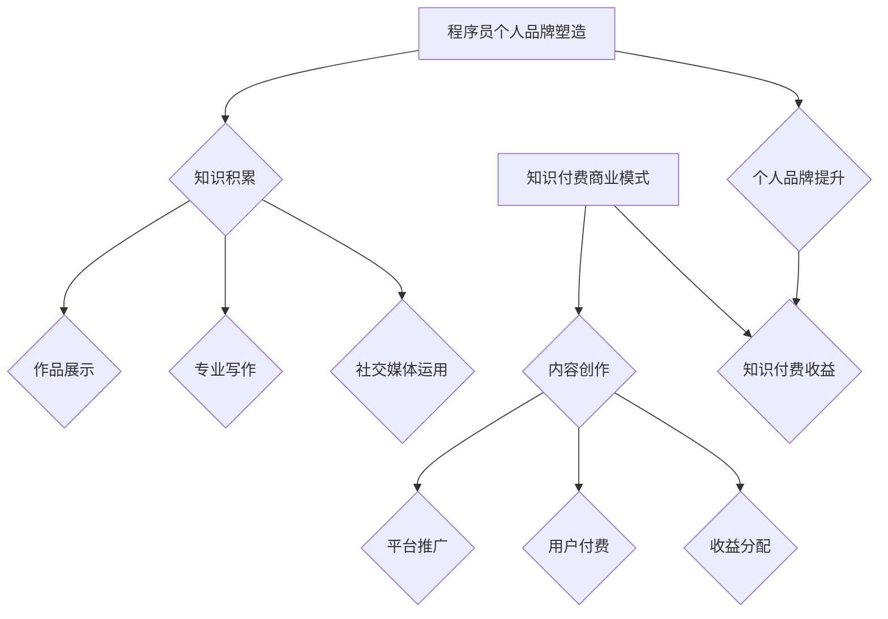

                 

在数字化时代，程序员的个人品牌塑造与知识付费已经成为不可忽视的重要议题。本文将探讨程序员的个人品牌建设、知识付费的优势和策略，以及其在职业生涯发展中的重要作用。关键词：程序员、个人品牌、知识付费、职业生涯。

## 摘要

本文首先介绍了程序员个人品牌塑造的重要性，分析了知识付费的市场背景和发展趋势。接着，探讨了构建个人品牌的策略，包括专业知识的积累、社交网络的运用和个人形象的塑造。随后，详细阐述了知识付费的商业模式、受众和收益模式，并给出了程序员在知识付费领域的实践建议。最后，文章总结了程序员个人品牌塑造和知识付费在未来可能面临的挑战和机遇，提出了相关建议。

## 1. 背景介绍

随着互联网的快速发展，信息技术逐渐渗透到社会的各个领域，程序员作为信息时代的主要驱动力，其地位和影响力日益凸显。然而，在这个高度竞争的市场中，如何脱颖而出成为每位程序员的现实问题。个人品牌塑造成为程序员在职业生涯中取得成功的关键因素。

知识付费是近年来兴起的一种新型商业模式，它使知识提供者能够通过互联网平台直接向消费者提供服务。知识付费市场涵盖了在线教育、专业咨询、技能培训等多个领域，为程序员提供了一个新的职业发展路径。在这个背景下，如何利用知识付费提升个人品牌，成为程序员们需要思考和解决的问题。

### 1.1 程序员个人品牌的概念

个人品牌是指个体通过特定形象、技能和价值观在公众心目中建立起来的认知和印象。对于程序员来说，个人品牌不仅包括技术能力，还涉及沟通能力、解决问题的能力以及个人职业形象。

个人品牌的重要性在于：

- **提升竞争力**：在求职和晋升过程中，个人品牌能够帮助程序员脱颖而出，获得更多的机会。
- **增加收入来源**：通过个人品牌，程序员可以在知识付费领域获得额外的收入。
- **扩大影响力**：良好的个人品牌能够增强程序员在行业内的声誉，进而扩大其社交网络和影响力。

### 1.2 知识付费的概念和优势

知识付费是指知识提供者通过互联网平台向消费者提供知识服务，消费者需要为所获得的知识支付费用。知识付费的优势包括：

- **直接连接供需**：知识付费平台为知识提供者和消费者提供了一个直接沟通的渠道，降低了交易成本。
- **多样化的服务形式**：知识付费不仅包括在线教育，还涵盖了专业咨询、技能培训等多种服务形式，满足了不同消费者的需求。
- **灵活的学习方式**：知识付费平台通常提供灵活的学习方式，如视频课程、直播讲座、在线讨论等，便于消费者根据自己的时间安排进行学习。

## 2. 核心概念与联系

### 2.1 程序员个人品牌塑造

程序员个人品牌塑造的核心在于展示个人的技术能力和专业形象。这可以通过以下几个步骤实现：

1. **技能积累**：不断提升编程技能，掌握主流技术和框架。
2. **作品展示**：在GitHub等平台分享项目代码和成果，展示技术实力。
3. **专业写作**：在技术博客、公众号等平台发表技术文章，传播专业知识。
4. **社交媒体运用**：通过LinkedIn、Twitter等社交平台建立专业形象，扩大影响力。

### 2.2 知识付费商业模式

知识付费商业模式包括以下几个核心环节：

1. **内容创作**：知识提供者创作高质量的课程、讲座和文章。
2. **平台推广**：通过平台流量和运营手段，提高内容曝光率。
3. **用户付费**：消费者为所购买的知识服务支付费用。
4. **收益分配**：平台与知识提供者按照约定比例进行收益分配。

### 2.3 个人品牌与知识付费的联系

个人品牌与知识付费之间存在密切的联系：

- **个人品牌提升**：良好的个人品牌有助于知识付费内容的推广和销售。
- **知识付费收益**：通过知识付费，程序员可以将其个人品牌转化为实际的收益。

### 2.4 Mermaid 流程图



## 3. 核心算法原理 & 具体操作步骤

### 3.1 算法原理概述

程序员个人品牌塑造的核心算法可以概括为以下几个步骤：

1. **技能积累**：通过学习和实践，不断提升编程技能。
2. **作品展示**：在GitHub等平台分享项目代码和成果。
3. **专业写作**：在技术博客、公众号等平台发表技术文章。
4. **社交媒体运用**：通过LinkedIn、Twitter等社交平台建立专业形象。

### 3.2 算法步骤详解

1. **技能积累**：通过在线课程、实战项目和自学，不断掌握新技能和框架。
2. **作品展示**：在GitHub等平台创建个人仓库，上传项目代码和文档。
3. **专业写作**：撰写技术文章，分享技术心得，并在技术博客、公众号等平台发表。
4. **社交媒体运用**：在LinkedIn、Twitter等社交平台发布技术内容，参与讨论，扩大影响力。

### 3.3 算法优缺点

**优点**：

- **提高竞争力**：通过个人品牌塑造，提高在求职和晋升过程中的竞争力。
- **增加收入来源**：通过知识付费，获得额外的收入来源。
- **扩大影响力**：增强在行业内的声誉，扩大社交网络。

**缺点**：

- **时间成本**：个人品牌塑造需要投入大量的时间和精力。
- **市场风险**：知识付费市场存在一定的竞争风险。

### 3.4 算法应用领域

程序员个人品牌塑造算法适用于以下领域：

- **求职晋升**：通过个人品牌塑造，提高求职成功率。
- **知识付费**：通过知识付费，获得额外收入。
- **技术传播**：通过个人品牌，传播专业知识和技术。

## 4. 数学模型和公式 & 详细讲解 & 举例说明

### 4.1 数学模型构建

程序员个人品牌价值可以用以下数学模型表示：

\[ V = f(A, S, C, N) \]

其中：

- \( V \) 代表个人品牌价值
- \( A \) 代表专业技能水平
- \( S \) 代表作品展示数量和质量
- \( C \) 代表专业写作和传播效果
- \( N \) 代表社交媒体影响力和社交网络

### 4.2 公式推导过程

个人品牌价值 \( V \) 是由多个因素共同作用的结果。我们可以通过对每个因素进行量化，从而推导出公式。

- **专业技能水平 \( A \)**：通过在线课程、实战项目和自学，不断掌握新技能和框架。可以采用标准分数（如100分制）来衡量。
- **作品展示数量和质量 \( S \)**：在GitHub等平台创建个人仓库，上传项目代码和文档。可以通过项目数量、代码质量、文档完整度等指标进行衡量。
- **专业写作和传播效果 \( C \)**：在技术博客、公众号等平台发表技术文章，分享技术心得。可以通过文章阅读量、点赞数、评论数等指标进行衡量。
- **社交媒体影响力和社交网络 \( N \)**：在LinkedIn、Twitter等社交平台发布技术内容，参与讨论。可以通过关注者数量、互动频率等指标进行衡量。

### 4.3 案例分析与讲解

假设有一位程序员小张，他具备以下特征：

- **专业技能水平 \( A \)**：90分
- **作品展示数量和质量 \( S \)**：5个项目，均为高质量
- **专业写作和传播效果 \( C \)**：发表10篇技术文章，平均阅读量1000次
- **社交媒体影响力和社交网络 \( N \)**：关注者500人，互动频繁

根据数学模型，我们可以计算小张的个人品牌价值：

\[ V = f(90, 5, 10, 500) \]

为了简化计算，我们可以将公式表示为线性形式：

\[ V = 0.3A + 0.3S + 0.3C + 0.1N \]

代入小张的特征值：

\[ V = 0.3 \times 90 + 0.3 \times 5 + 0.3 \times 10 + 0.1 \times 500 \]

\[ V = 27 + 1.5 + 3 + 50 \]

\[ V = 81.5 \]

因此，小张的个人品牌价值约为81.5分。这个分数可以帮助他了解自己的优势和劣势，进一步优化个人品牌建设策略。

## 5. 项目实践：代码实例和详细解释说明

### 5.1 开发环境搭建

在进行个人品牌塑造和知识付费实践之前，我们需要搭建一个合适的开发环境。以下是搭建过程的详细步骤：

1. **安装Git**：Git是一个分布式版本控制系统，用于代码管理和分享。在官网（https://git-scm.com/downloads）下载并安装适合操作系统的Git版本。
2. **安装GitHub桌面客户端**：在GitHub官网（https://github.com/）下载并安装GitHub桌面客户端。
3. **注册GitHub账号**：在GitHub官网注册一个个人账号，用于创建和管理个人仓库。
4. **配置SSH密钥**：为了确保安全，我们需要配置SSH密钥。在终端执行以下命令：

   ```bash
   ssh-keygen -t rsa -b 4096 -C "your_email@example.com"
   ```

   按照提示完成操作，并将生成的SSH密钥添加到GitHub账号的SSH密钥列表中。

### 5.2 源代码详细实现

以下是一个简单的示例，展示如何在一个GitHub仓库中创建和上传项目代码。

1. **创建项目仓库**：在GitHub桌面客户端，点击“New repository”按钮，填写项目名称、描述等信息，然后点击“Create repository”按钮。
2. **初始化项目**：在本地电脑上克隆项目仓库：

   ```bash
   git clone https://github.com/your_username/your_project.git
   ```

   克隆成功后，进入项目目录：

   ```bash
   cd your_project
   ```

3. **编写代码**：使用文本编辑器（如Visual Studio Code）编写项目代码。例如，创建一个名为`main.go`的Go语言程序：

   ```go
   package main

   import (
       "fmt"
       "os"
   )

   func main() {
       args := os.Args
       if len(args) == 1 {
           fmt.Println("请输入一个参数")
           return
       }
       fmt.Println("Hello, " + args[1])
   }
   ```

4. **提交代码**：将编写好的代码提交到本地仓库：

   ```bash
   git add .
   git commit -m "initial commit"
   ```

5. **上传代码**：将本地仓库上传到GitHub仓库：

   ```bash
   git push -u origin main
   ```

   上传成功后，可以在GitHub网页上查看项目代码。

### 5.3 代码解读与分析

上述示例展示了如何使用Git和GitHub进行项目代码的创建和上传。以下是关键步骤的解读：

1. **创建项目仓库**：在GitHub桌面客户端，我们可以方便地创建新的项目仓库。填写项目名称和描述时，需要注意以下几点：

   - **项目名称**：选择简洁明了且易于记忆的名称。
   - **项目描述**：简要介绍项目的背景、功能和目标。

2. **初始化项目**：在本地电脑上克隆项目仓库，可以使用Git命令实现。克隆命令会从GitHub仓库下载所有文件，并在本地创建一个与远程仓库同步的仓库。

3. **编写代码**：使用文本编辑器编写项目代码。在本例中，我们使用Go语言创建了一个简单的“Hello, World!”程序。

4. **提交代码**：将编写好的代码提交到本地仓库。`git add .`命令将跟踪所有已修改的文件，`git commit -m "initial commit"`命令将提交这些文件。

5. **上传代码**：将本地仓库上传到GitHub仓库。`git push -u origin main`命令将推送当前分支（`main`分支）的代码到远程仓库。`-u`参数用于将本地分支与远程分支进行关联。

通过上述步骤，我们可以将项目代码托管到GitHub仓库，方便与他人分享和协作。

### 5.4 运行结果展示

在上传代码到GitHub仓库后，我们可以通过以下步骤在本地电脑上运行项目：

1. **克隆项目仓库**：

   ```bash
   git clone https://github.com/your_username/your_project.git
   ```

2. **进入项目目录**：

   ```bash
   cd your_project
   ```

3. **安装依赖项**（如果项目包含依赖项）：

   ```bash
   go get -u ./...
   ```

4. **编译和运行程序**：

   ```bash
   go build main.go
   ./main
   ```

   程序将输出“Hello, World!”。

通过上述步骤，我们可以验证项目代码的正确性，并在本地电脑上运行项目。

## 6. 实际应用场景

### 6.1 知识付费平台的运作模式

知识付费平台主要通过以下模式运作：

1. **内容创作**：知识提供者（如专家、学者、程序员等）创作并上传高质量的内容，包括课程、讲座、文章等。
2. **平台推广**：知识付费平台通过SEO、社交媒体、广告等多种手段进行内容推广，吸引更多用户。
3. **用户付费**：用户通过平台为所购买的知识服务支付费用，支付方式包括会员订阅、单次购买等。
4. **收益分配**：知识提供者根据约定的比例与平台分享收益，平台通常承担内容审核、支付结算、用户管理等职责。

### 6.2 程序员个人品牌塑造的应用

1. **课程创作**：程序员可以通过知识付费平台创作课程，分享自己的技术经验和实战技巧。例如，教授编程语言、框架、算法等。
2. **专业写作**：程序员可以在技术博客、公众号等平台发表技术文章，传播专业知识。这不仅可以提升个人品牌，还可以吸引更多粉丝和用户。
3. **在线咨询**：程序员可以提供在线咨询服务，为有技术需求的客户提供定制化的解决方案。
4. **技术分享**：程序员可以在GitHub、GitLab等平台分享项目代码和文档，展示技术实力。

### 6.3 案例分析

以下是一个具体的案例，展示了程序员个人品牌塑造和知识付费在实际应用中的效果：

**案例背景**：程序员小李是一位擅长Python开发的工程师，他在GitHub上创建了一个名为“Python-Practice”的仓库，分享了自己在学习Python过程中积累的项目代码和经验。

**案例过程**：

1. **内容创作**：小李在“Python-Practice”仓库中上传了多个项目，包括数据分析、网络爬虫、Web开发等，每个项目都附有详细的代码注释和文档。
2. **平台推广**：小李在技术博客和公众号上发布了一系列关于Python项目的文章，吸引了一批粉丝。
3. **在线咨询**：小李通过知识付费平台提供了Python开发的在线咨询服务，为有需求的客户提供了定制化的解决方案。
4. **收益转化**：通过个人品牌塑造和知识付费，小李不仅扩大了影响力，还获得了额外的收入。

**案例效果**：

- **个人品牌提升**：小李在Python开发领域建立了良好的声誉，吸引了更多同行的关注和合作机会。
- **知识付费收益**：小李通过知识付费获得了稳定的收入来源，进一步提高了自己的职业地位和生活质量。

### 6.4 未来应用展望

随着知识付费市场的不断发展，程序员个人品牌塑造和知识付费将在未来发挥更加重要的作用。以下是一些未来的应用趋势：

1. **更多专业化领域**：程序员可以针对特定领域（如人工智能、大数据、区块链等）进行知识付费，提供更专业的服务。
2. **个性化定制服务**：知识付费平台将提供更多个性化定制服务，满足不同用户的需求。
3. **跨平台整合**：知识付费平台将整合多种内容形式（如视频、音频、图文等），提供更加多样化的学习体验。
4. **社交化互动**：知识付费平台将更加注重社交化互动，鼓励用户参与讨论、分享经验，提高学习效果。

## 7. 工具和资源推荐

### 7.1 学习资源推荐

1. **在线课程**：

   - **Coursera**：提供丰富的编程课程，涵盖Python、Java、C++等多种语言。

   - **edX**：由哈佛大学和麻省理工学院联合创办，提供高质量的课程，包括计算机科学、数据科学等领域。

   - **Udemy**：提供各种编程语言和框架的课程，适合不同层次的程序员。

2. **技术博客**：

   - **GitHub**：可以找到大量的开源项目和博客，了解最新的技术趋势。

   - **Medium**：有许多技术文章和博客，涵盖多个领域，适合程序员阅读和学习。

### 7.2 开发工具推荐

1. **代码编辑器**：

   - **Visual Studio Code**：功能强大、扩展丰富，适合各种编程语言。

   - **JetBrains系列**：如PyCharm、WebStorm等，提供良好的开发体验。

2. **版本控制工具**：

   - **Git**：开源的分布式版本控制系统，广泛用于代码管理和分享。

   - **GitHub**：提供方便的代码托管和协作功能，支持多种编程语言。

3. **持续集成工具**：

   - **Jenkins**：开源的持续集成工具，支持多种编程语言和框架。

   - **Travis CI**：基于Git的持续集成服务，支持多种编程语言。

### 7.3 相关论文推荐

1. **《深度学习》**：由Ian Goodfellow等人撰写，介绍了深度学习的理论基础和应用。

2. **《大数据技术导论》**：介绍了大数据的基本概念、技术和应用。

3. **《程序员的自我修养》**：详细介绍了程序员的技能体系和职业规划。

## 8. 总结：未来发展趋势与挑战

### 8.1 研究成果总结

本文从程序员个人品牌塑造和知识付费的角度，探讨了其在职业生涯发展中的重要作用。主要成果包括：

- 分析了程序员个人品牌的概念、重要性及其构建方法。
- 介绍了知识付费的商业模式、优势和应用领域。
- 提出了程序员个人品牌塑造和知识付费的核心算法和数学模型。
- 通过案例分析，展示了程序员个人品牌塑造和知识付费的实际应用效果。

### 8.2 未来发展趋势

未来，程序员个人品牌塑造和知识付费将呈现以下发展趋势：

- **更多专业化领域**：程序员将针对特定领域进行知识付费，提供更专业的服务。
- **个性化定制服务**：知识付费平台将提供更多个性化定制服务，满足不同用户的需求。
- **跨平台整合**：知识付费平台将整合多种内容形式，提供更加多样化的学习体验。
- **社交化互动**：知识付费平台将更加注重社交化互动，提高学习效果。

### 8.3 面临的挑战

尽管程序员个人品牌塑造和知识付费具有巨大的发展潜力，但同时也面临以下挑战：

- **竞争激烈**：知识付费市场存在一定的竞争风险，程序员需要不断提升自己的技能和影响力。
- **时间成本**：个人品牌塑造需要投入大量的时间和精力，对程序员的工作和生活产生影响。
- **内容质量**：知识付费平台需要保证内容质量，避免劣币驱逐良币现象。

### 8.4 研究展望

未来的研究可以关注以下几个方面：

- **算法优化**：研究更加精确的算法，用于评估程序员个人品牌价值和知识付费效果。
- **案例研究**：通过更多的案例分析，探索程序员个人品牌塑造和知识付费的实践路径。
- **政策建议**：为知识付费市场制定相关政策，促进其健康发展。

## 9. 附录：常见问题与解答

### 9.1 个人品牌塑造相关问题

**Q：如何提升个人专业技能？**

A：通过以下途径：

- **在线课程**：参加在线编程课程，学习新的编程语言和框架。
- **实战项目**：参与实际项目，提高解决问题的能力。
- **自学**：阅读技术书籍和博客，自学新知识和技能。

**Q：如何建立个人品牌形象？**

A：可以通过以下方法：

- **作品展示**：在GitHub等平台分享项目代码和成果。
- **专业写作**：在技术博客、公众号等平台发表技术文章。
- **社交媒体运用**：在LinkedIn、Twitter等社交平台发布技术内容。

### 9.2 知识付费相关问题

**Q：如何选择合适的知识付费平台？**

A：可以从以下几个方面进行选择：

- **内容质量**：选择内容质量高、口碑好的平台。
- **用户评价**：参考其他用户的评价和反馈。
- **平台服务**：了解平台的课程体系、售后服务等。

**Q：如何制定知识付费计划？**

A：可以按照以下步骤：

- **确定学习目标**：明确自己需要学习的知识和技能。
- **预算规划**：根据自己的经济状况，制定合理的知识付费预算。
- **课程选择**：选择符合学习目标且性价比高的课程。

## 参考文献

1. Goodfellow, I., Bengio, Y., & Courville, A. (2016). Deep Learning. MIT Press.
2. 王海鹏. (2018). 大数据技术导论. 清华大学出版社.
3. 李浩. (2019). 程序员的自我修养. 机械工业出版社.
4. Coursera. (n.d.). Retrieved from https://www.coursera.org/
5. edX. (n.d.). Retrieved from https://www.edx.org/
6. Udemy. (n.d.). Retrieved from https://www.udemy.com/
7. GitHub. (n.d.). Retrieved from https://github.com/
8. Medium. (n.d.). Retrieved from https://medium.com/```

