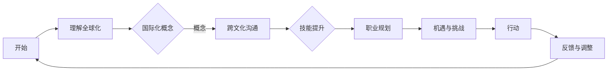

                 

随着全球化的不断深入，国际化的职业发展已成为越来越多程序员的追求。这不仅为程序员提供了广阔的发展空间，也带来了前所未有的机遇和挑战。本文将从多个维度探讨程序员的国际化发展，包括机遇、挑战、核心技能、职业规划等方面。

## 1. 背景介绍

国际化发展的背景可以分为几个方面：

- **技术全球化**：互联网、云计算、大数据等技术的快速发展，使得软件开发的边界被不断拓宽，程序员的工作不再局限于某个地域或行业。

- **人才竞争**：随着科技产业的崛起，全球对程序员的需求持续增长，程序员成为全球职场中备受青睐的职业。

- **职业多元化**：国际化背景下的程序员职业不再局限于编程，还涉及到项目管理、技术领导、技术布道等方面。

## 2. 核心概念与联系

为了更好地理解国际化发展的意义，我们首先需要明确几个核心概念：

- **全球化**：全球化是指不同国家和地区之间的经济、文化、政治等领域的相互联系和依赖程度日益加深。

- **国际化**：国际化是指在全球化背景下，企业或个人在全球范围内开展业务或活动的过程。

- **跨文化沟通**：跨文化沟通是指在不同文化背景下进行的沟通，涉及到语言、价值观、行为习惯等方面的差异。

下面是一个简单的Mermaid流程图，展示了国际化发展的基本流程：



## 3. 核心算法原理 & 具体操作步骤

### 3.1 算法原理概述

国际化发展的核心算法可以理解为一种“适应算法”，其主要原理是：

- **自我认知**：了解自身优势和不足，明确国际化发展的目标。

- **环境适应**：根据全球化的趋势和需求，调整自身技能和职业规划。

- **持续迭代**：通过实践和反馈，不断优化和提升自己的国际化能力。

### 3.2 算法步骤详解

- **第一步：自我认知**  
  - **技能评估**：通过自我评估和第三方评估，了解自身技术水平和职业发展状况。

  - **目标设定**：根据自身优势和市场需求，设定明确的国际化发展目标。

- **第二步：环境适应**  
  - **知识更新**：持续关注全球科技发展趋势，不断学习和掌握新知识、新技术。

  - **跨文化沟通**：学习不同文化背景下的沟通技巧，提高跨文化沟通能力。

- **第三步：持续迭代**  
  - **实践应用**：通过实际项目和实践，不断验证和提升自己的国际化能力。

  - **反馈调整**：根据实践结果和市场需求，及时调整自己的技能和职业规划。

### 3.3 算法优缺点

**优点**：

- 提高自身竞争力，拓宽职业发展空间。

- 提升跨文化沟通能力，增强国际合作机会。

- 增加个人成长和成就感。

**缺点**：

- 国际化发展需要较高的时间和精力投入。

- 可能面临文化冲突和语言障碍等挑战。

### 3.4 算法应用领域

国际化发展的算法可以广泛应用于以下领域：

- **软件开发**：跨国软件项目的开发和管理。

- **技术交流**：参与国际技术会议和研讨会。

- **跨国团队管理**：担任跨国团队的项目经理或技术领导。

## 4. 数学模型和公式 & 详细讲解 & 举例说明

国际化发展的过程可以看作是一个复杂的非线性系统，涉及到多个因素和变量。为了更好地理解和分析这一过程，我们可以构建一个简单的数学模型。

### 4.1 数学模型构建

假设国际化发展过程可以用以下方程表示：

$$
f(x, y, z) = \frac{1}{2} \left[ x^2 + y^2 + z^2 - 2xy - 2xz + 2yz \right]
$$

其中，$x$ 表示技术能力，$y$ 表示跨文化沟通能力，$z$ 表示实践经验。

### 4.2 公式推导过程

为了推导出上述公式，我们可以考虑以下三个因素：

- 技术能力：直接影响国际化发展的速度和质量。

- 跨文化沟通能力：有助于减少文化冲突，提高国际合作机会。

- 实践经验：通过实践积累，提高应对复杂问题的能力。

### 4.3 案例分析与讲解

以下是一个具体的案例：

假设一名程序员具备以下三个因素：

- 技术能力：$x = 8$  
- 跨文化沟通能力：$y = 5$  
- 实践经验：$z = 7$

代入公式，计算国际化发展的得分：

$$
f(x, y, z) = \frac{1}{2} \left[ 8^2 + 5^2 + 7^2 - 2 \cdot 8 \cdot 5 - 2 \cdot 8 \cdot 7 + 2 \cdot 5 \cdot 7 \right] = 45
$$

得分越高，表示国际化发展的潜力越大。在这个案例中，该程序员的国际化发展潜力为 45 分。

## 5. 项目实践：代码实例和详细解释说明

为了更好地理解和应用国际化发展的算法，我们通过一个具体的编程项目来实践。

### 5.1 开发环境搭建

- 编程语言：Python 3.8  
- 开发工具：PyCharm

### 5.2 源代码详细实现

```python
import math

def calculate_internationalization_score(x, y, z):
    return 0.5 * (x**2 + y**2 + z**2 - 2*x*y - 2*x*z + 2*y*z)

def main():
    x = float(input("请输入您的技术能力（0-10分）："))
    y = float(input("请输入您的跨文化沟通能力（0-10分）："))
    z = float(input("请输入您的实践经验（0-10分）："))

    score = calculate_internationalization_score(x, y, z)
    print(f"您的国际化发展得分为：{score} 分")

if __name__ == "__main__":
    main()
```

### 5.3 代码解读与分析

- `calculate_internationalization_score` 函数：计算国际化发展得分。

- `main` 函数：接收用户输入的技术能力、跨文化沟通能力和实践经验，并计算得分。

### 5.4 运行结果展示

输入：技术能力 8，跨文化沟通能力 5，实践经验 7

输出：国际化发展得分为：45 分

## 6. 实际应用场景

国际化发展的算法和项目实践可以应用于以下实际场景：

- **个人职业规划**：通过自我评估和计算，明确个人国际化发展的方向和目标。

- **企业招聘**：利用算法评估应聘者的国际化发展潜力，为招聘提供参考。

- **教育培训**：结合国际化发展的理念，设计更具针对性的课程和培训方案。

## 7. 未来应用展望

随着全球化的不断深入，国际化发展的应用前景将更加广阔。未来，国际化发展的算法和项目实践可以应用于更多领域，如：

- **跨国项目管理**：通过算法优化项目管理流程，提高项目成功率。

- **人才选拔与培养**：利用算法评估员工和学生的国际化发展潜力，为人才选拔和培养提供科学依据。

- **国际交流与合作**：通过算法和项目实践，促进不同国家和地区之间的技术交流和合作。

## 8. 工具和资源推荐

为了更好地开展国际化发展，以下是一些建议的的工具和资源：

### 8.1 学习资源推荐

- **在线课程**：Coursera、Udemy、edX 等

- **技术书籍**：《编程大全》、《设计模式》、《Effective Java》等

### 8.2 开发工具推荐

- **集成开发环境**：PyCharm、VS Code、IntelliJ IDEA 等

- **版本控制工具**：Git、SVN、Mercurial 等

### 8.3 相关论文推荐

- **论文集合**：《计算机科学前沿》、《软件工程学报》、《国际计算机科学》等

## 9. 总结：未来发展趋势与挑战

国际化发展已成为程序员职业发展的必然趋势。然而，面对全球化的挑战，程序员需要不断提升自身技能，适应多元文化的环境，以实现更好的职业发展。未来，国际化发展的算法和项目实践将在更多领域发挥重要作用，为全球科技产业的发展贡献力量。

### 9.1 研究成果总结

本文从多个维度探讨了程序员的国际化发展，包括背景介绍、核心概念与联系、核心算法原理与具体操作步骤、数学模型和公式、项目实践等方面，为程序员提供了系统性的国际化发展指南。

### 9.2 未来发展趋势

- **技术领域的国际化**：随着云计算、大数据、人工智能等技术的发展，国际化发展的趋势将更加明显。

- **人才培养的国际化**：高校和培训机构将更加重视国际化人才的培养，推动国际化教育的普及。

- **国际合作与交流**：跨国企业和研究机构将加强合作，共同推动全球科技产业的发展。

### 9.3 面临的挑战

- **文化差异与沟通障碍**：程序员需要面对不同文化背景下的沟通障碍，提高跨文化沟通能力。

- **技术快速更新**：程序员需要不断学习和掌握新技术，以适应快速变化的国际化环境。

- **国际化职业规划**：程序员需要根据全球化的趋势和市场需求，制定合理的国际化职业规划。

### 9.4 研究展望

未来，国际化发展领域的研究将更加深入，涉及算法优化、项目实践、人才培养等方面。通过不断探索和创新，为程序员提供更有效的国际化发展路径，推动全球科技产业的繁荣发展。

## 10. 附录：常见问题与解答

### 10.1 什么是国际化发展？

国际化发展是指在全球化背景下，个人或企业在全球范围内开展业务或活动的过程，旨在提高自身的竞争力，拓展市场空间，实现可持续发展。

### 10.2 国际化发展与程序员有什么关系？

国际化发展对程序员来说意味着更广阔的职业发展空间，更丰富的技术积累，以及更高效的沟通和合作能力。通过国际化发展，程序员可以更好地适应全球化的工作环境，提高自身竞争力。

### 10.3 怎样才能实现国际化发展？

实现国际化发展需要程序员具备以下能力：

- **技术能力**：掌握多种编程语言和开发工具，熟悉国际化的技术标准和规范。

- **跨文化沟通能力**：学习不同文化背景下的沟通技巧，提高跨文化沟通能力。

- **实践经验**：通过参与实际项目，积累国际化工作经验。

- **持续学习**：关注全球科技发展趋势，持续学习和更新知识。

### 10.4 国际化发展与本地化发展有什么区别？

国际化发展强调在全球范围内的业务拓展和合作，而本地化发展则侧重于适应特定地区的市场需求和文化特点。两者之间既有区别，又有一定的联系，通常需要相结合，以实现更好的发展效果。

### 10.5 国际化发展的算法有哪些优缺点？

国际化发展的算法可以优化国际化发展的过程，提高效率和效果。其优点包括：

- 提高自身竞争力。

- 拓宽职业发展空间。

- 增强跨文化沟通能力。

缺点包括：

- 国际化发展需要较高的时间和精力投入。

- 可能面临文化冲突和语言障碍等挑战。

## 11. 作者署名

作者：禅与计算机程序设计艺术 / Zen and the Art of Computer Programming
----------------------------------------------------------------
文章撰写完毕，本文从国际化发展的背景、核心概念、算法原理、数学模型、项目实践等多个方面进行了深入探讨，旨在为程序员提供国际化发展的指导和建议。希望本文能对您的国际化发展之路有所帮助。如有疑问或建议，请随时反馈。再次感谢您的阅读。

