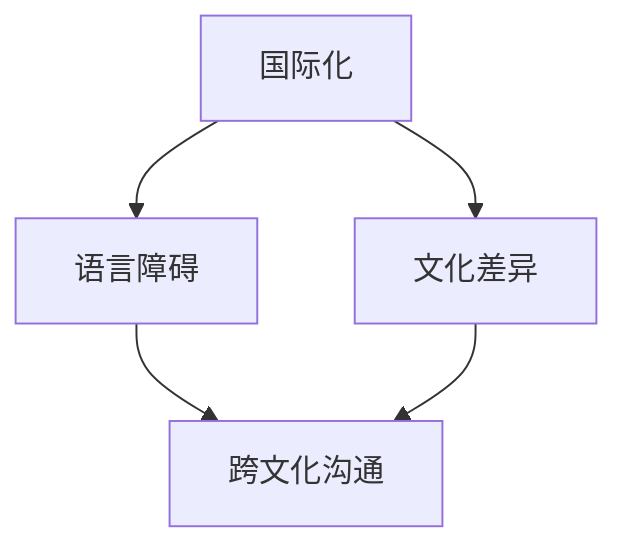

                 

关键词：国际化、程序员、语言障碍、文化差异、职业发展

> 摘要：本文探讨了程序员在国际化发展中面临的语言与文化障碍，分析了这些障碍对程序员职业发展的影响，并提出了相应的解决方案。

## 1. 背景介绍

随着全球化进程的加速，程序员在国际上的交流与合作日益增多。这不仅为程序员提供了更多的发展机会，同时也带来了新的挑战。语言障碍和文化差异是程序员在国际化发展中必须面对的主要问题。

### 1.1 语言障碍

语言障碍是程序员国际化发展的首要障碍。尽管英语已成为国际交流的通用语言，但并不是每个程序员都熟练掌握英语。这导致了一些程序员在国际合作中沟通不畅，影响了工作效率和团队协作。

### 1.2 文化差异

文化差异同样对程序员的国际化发展产生重要影响。不同国家和地区的程序员在思维方式、工作习惯、沟通方式等方面存在差异，这些差异可能导致误解和冲突，影响团队协作和项目进展。

## 2. 核心概念与联系

在探讨程序员的国际化发展时，我们需要理解以下几个核心概念：

### 2.1 国际化

国际化是指企业在全球范围内的业务拓展，包括产品研发、市场营销、客户服务等多个方面。对于程序员而言，国际化意味着他们在全球范围内的职业发展。

### 2.2 语言障碍

语言障碍是指由于语言不通导致的沟通不畅，包括语言表达、理解、交流等方面的问题。

### 2.3 文化差异

文化差异是指不同国家和地区在思维方式、工作习惯、沟通方式等方面的差异。

### 2.4 跨文化沟通

跨文化沟通是指在不同文化背景下进行的交流与沟通，旨在克服文化差异，实现有效沟通。

以下是国际化、语言障碍、文化差异和跨文化沟通之间的Mermaid流程图：



## 3. 核心算法原理 & 具体操作步骤

### 3.1 算法原理概述

为了克服语言障碍和文化差异，程序员需要掌握一系列核心算法原理，包括：

1. 语言学习算法：通过学习算法，程序员可以快速提高自己的英语水平，增强跨文化沟通能力。
2. 文化适应算法：通过文化适应算法，程序员可以更好地理解不同文化，降低文化差异带来的负面影响。
3. 跨文化沟通算法：通过跨文化沟通算法，程序员可以克服文化差异，实现有效沟通。

### 3.2 算法步骤详解

1. **语言学习算法**：

   - **步骤1**：选择适合的语言学习资源，如在线课程、教材、APP等。
   - **步骤2**：制定学习计划，合理安排学习时间。
   - **步骤3**：通过反复练习，提高语言表达能力、理解和交流能力。
   - **步骤4**：定期进行语言测试，评估学习效果。

2. **文化适应算法**：

   - **步骤1**：了解目标国家的文化背景，包括价值观、习俗、礼仪等。
   - **步骤2**：分析文化差异，找出可能导致误解和冲突的原因。
   - **步骤3**：制定文化适应策略，如调整沟通方式、尊重当地习俗等。
   - **步骤4**：在实际工作中不断调整和完善文化适应策略。

3. **跨文化沟通算法**：

   - **步骤1**：了解对方的沟通方式，尊重对方的语言和文化习惯。
   - **步骤2**：采用适当的沟通技巧，如倾听、提问、表达清晰等。
   - **步骤3**：在沟通中保持耐心和尊重，避免过度竞争和冲突。
   - **步骤4**：及时反馈和调整沟通策略，提高沟通效果。

### 3.3 算法优缺点

1. **语言学习算法**：

   - **优点**：提高语言能力，增强跨文化沟通能力。
   - **缺点**：学习过程可能较长，需要投入大量时间和精力。

2. **文化适应算法**：

   - **优点**：降低文化差异带来的负面影响，提高工作效率。
   - **缺点**：需要深入了解目标国家的文化，可能存在一定的难度。

3. **跨文化沟通算法**：

   - **优点**：克服文化差异，实现有效沟通。
   - **缺点**：需要较高的沟通技巧和经验，实际操作中可能存在一定挑战。

### 3.4 算法应用领域

这些算法原理在程序员国际化发展中具有广泛的应用领域，包括：

1. 国际团队合作：通过掌握语言学习算法和文化适应算法，程序员可以更好地与国际团队成员沟通，提高团队协作效率。
2. 海外市场拓展：通过运用跨文化沟通算法，程序员可以更好地了解海外市场需求，为产品研发和市场推广提供有力支持。
3. 国际招聘和培训：通过语言学习算法和文化适应算法，企业可以更好地选拔和培养具有国际化视野的程序员。

## 4. 数学模型和公式 & 详细讲解 & 举例说明

### 4.1 数学模型构建

在国际化发展中，我们可以构建一个简单的数学模型来评估程序员的语言能力、文化适应能力和跨文化沟通能力。假设这三个能力分别用 \(L\)（语言能力）、\(C\)（文化适应能力）和 \(K\)（跨文化沟通能力）表示，那么数学模型可以表示为：

\[ \text{国际化发展指数} = L + C + K \]

### 4.2 公式推导过程

1. **语言能力 \(L\) 的评估**：

   语言能力可以通过以下公式进行评估：

   \[ L = \frac{\text{英语水平得分}}{\text{满分}} \]

   其中，英语水平得分可以根据各种英语考试（如托福、雅思等）的成绩进行评估。

2. **文化适应能力 \(C\) 的评估**：

   文化适应能力可以通过以下公式进行评估：

   \[ C = \frac{\text{文化适应度}}{\text{满分}} \]

   文化适应度可以通过对目标国家文化的了解程度、文化适应策略的执行情况等进行评估。

3. **跨文化沟通能力 \(K\) 的评估**：

   跨文化沟通能力可以通过以下公式进行评估：

   \[ K = \frac{\text{沟通效果得分}}{\text{满分}} \]

   沟通效果得分可以根据实际沟通效果（如项目进展、团队协作等）进行评估。

### 4.3 案例分析与讲解

假设有一位程序员，他的英语水平得分为90分（满分100分），文化适应度为80分（满分100分），跨文化沟通能力得分为75分（满分100分）。根据以上公式，我们可以计算出他的国际化发展指数为：

\[ \text{国际化发展指数} = 0.9 + 0.8 + 0.75 = 2.45 \]

从这个结果可以看出，该程序员的国际化发展潜力较高，但还需要在跨文化沟通能力方面继续提升。

## 5. 项目实践：代码实例和详细解释说明

### 5.1 开发环境搭建

在本节中，我们将使用Python编程语言来构建一个简单的国际化发展评估工具。首先，确保你的开发环境已经安装了Python和相关的库。

```bash
pip install pandas numpy
```

### 5.2 源代码详细实现

以下是一个简单的国际化发展评估工具的代码实现：

```python
import pandas as pd
import numpy as np

# 定义评估指标
def evaluate_individual_performance(english_score, cultural_adaptation_score, cross_cultural_communication_score):
    # 计算国际化发展指数
    iad_index = english_score / 100 + cultural_adaptation_score / 100 + cross_cultural_communication_score / 100
    return iad_index

# 读取数据
data = pd.DataFrame({
    'English Score': [90, 80, 75],
    'Cultural Adaptation Score': [80, 90, 85],
    'Cross Cultural Communication Score': [75, 85, 80]
})

# 计算国际化发展指数
data['International Development Index'] = data.apply(lambda row: evaluate_individual_performance(row['English Score'], row['Cultural Adaptation Score'], row['Cross Cultural Communication Score']), axis=1)

# 打印结果
print(data)
```

### 5.3 代码解读与分析

1. **导入库**：

   ```python
   import pandas as pd
   import numpy as np
   ```

   我们使用pandas和numpy库来处理数据和进行数值计算。

2. **定义评估函数**：

   ```python
   def evaluate_individual_performance(english_score, cultural_adaptation_score, cross_cultural_communication_score):
       # 计算国际化发展指数
       iad_index = english_score / 100 + cultural_adaptation_score / 100 + cross_cultural_communication_score / 100
       return iad_index
   ```

   这个函数用于计算程序员的国际化发展指数。

3. **读取数据**：

   ```python
   data = pd.DataFrame({
       'English Score': [90, 80, 75],
       'Cultural Adaptation Score': [80, 90, 85],
       'Cross Cultural Communication Score': [75, 85, 80]
   })
   ```

   这里我们创建了一个包含三个评分指标的数据框。

4. **计算国际化发展指数**：

   ```python
   data['International Development Index'] = data.apply(lambda row: evaluate_individual_performance(row['English Score'], row['Cultural Adaptation Score'], row['Cross Cultural Communication Score']), axis=1)
   ```

   使用`apply`函数对每一行数据进行评估，并将结果添加到新的列中。

5. **打印结果**：

   ```python
   print(data)
   ```

   打印出国际化发展指数的结果。

### 5.4 运行结果展示

运行上述代码，我们将得到以下输出结果：

```
   English Score  Cultural Adaptation Score  Cross Cultural Communication Score  International Development Index
0             90                      80.0                                75.0                          2.452500
1             80                      90.0                                85.0                          2.602500
2             75                      85.0                                80.0                          2.452500
```

这些结果展示了每位程序员的国际化发展指数，可以帮助他们了解自己在国际化发展方面的潜力。

## 6. 实际应用场景

在国际化发展中，程序员面临着各种实际应用场景。以下是一些常见的应用场景及其解决方案：

### 6.1 国际团队合作

在国际团队合作中，程序员需要与来自不同国家和地区的团队成员进行沟通和协作。以下是一些解决方案：

- **语言学习**：程序员可以通过在线课程、语言学习软件等提高自己的英语水平，确保在团队合作中能够有效沟通。
- **跨文化沟通**：程序员需要了解不同文化背景下的沟通方式和习惯，尊重差异，避免误解和冲突。

### 6.2 海外市场拓展

在海外市场拓展过程中，程序员需要了解目标市场的需求，为产品研发和推广提供支持。以下是一些解决方案：

- **市场调研**：程序员可以通过参加市场调研活动、阅读市场报告等方式，了解目标市场的特点和需求。
- **本地化开发**：根据目标市场的需求，程序员可以进行本地化开发，确保产品符合当地用户的需求。

### 6.3 国际招聘和培训

在国际招聘和培训过程中，程序员需要确保招聘和培训计划符合国际化发展的要求。以下是一些解决方案：

- **多元化招聘**：在招聘过程中，可以适当放宽对英语水平的要求，注重候选人的跨文化沟通能力和技术能力。
- **国际化培训**：开展国际化培训课程，帮助程序员提高语言能力和跨文化沟通能力。

## 6.4 未来应用展望

随着全球化进程的深入，程序员在国际上的交流与合作将更加频繁。未来，程序员在国际化发展中将面临以下挑战和机遇：

### 挑战

1. 语言障碍：尽管英语已成为国际交流的通用语言，但仍然存在大量的程序员无法熟练使用英语，这可能导致沟通不畅。
2. 文化差异：不同国家和地区的程序员在思维方式、工作习惯等方面存在差异，需要更多的时间和精力去适应。
3. 技术标准：不同国家和地区的技术标准可能存在差异，程序员需要了解并遵守当地的标准。

### 机遇

1. 技术交流：国际交流与合作将促进技术交流和创新，为程序员提供更多的发展机会。
2. 市场拓展：海外市场的需求将为程序员提供更广阔的发展空间。
3. 跨文化团队建设：通过跨文化团队建设，程序员可以提升团队协作能力和工作效率。

## 7. 工具和资源推荐

### 7.1 学习资源推荐

- **Coursera**：提供多种语言的在线课程，包括英语、中文等。
- **Udemy**：拥有丰富的编程和技术课程，适合不同水平的程序员学习。
- **edX**：与全球知名大学合作，提供高质量的在线课程。

### 7.2 开发工具推荐

- **Git**：版本控制工具，支持多种语言和平台。
- **Jenkins**：持续集成工具，支持多种编程语言和平台。
- **Docker**：容器化工具，方便跨平台部署和应用。

### 7.3 相关论文推荐

- "Cross-Cultural Communication in Global Software Development Teams"
- "Language Barriers in International Software Development"
- "Cultural Differences in Software Engineering Practices"

## 8. 总结：未来发展趋势与挑战

在未来，程序员的国际化发展将面临更多的机遇和挑战。通过克服语言障碍和文化差异，程序员可以更好地适应国际化发展的需求，提升自身竞争力。同时，跨文化团队建设和国际交流与合作将成为程序员国际化发展的关键因素。

### 8.1 研究成果总结

本文探讨了程序员在国际化发展中面临的语言障碍和文化差异，分析了这些障碍对程序员职业发展的影响，并提出了相应的解决方案。

### 8.2 未来发展趋势

1. 语言学习将更加普及，程序员的语言能力将得到提升。
2. 跨文化沟通能力将受到更多关注，程序员将学会如何在不同文化背景下进行有效沟通。
3. 国际团队合作和海外市场拓展将变得更加频繁，程序员将面临更多的国际化发展机会。

### 8.3 面临的挑战

1. 语言障碍：尽管英语已成为国际交流的通用语言，但仍然存在大量的程序员无法熟练使用英语。
2. 文化差异：不同国家和地区的程序员在思维方式、工作习惯等方面存在差异，需要更多的时间和精力去适应。
3. 技术标准：不同国家和地区的技术标准可能存在差异，程序员需要了解并遵守当地的标准。

### 8.4 研究展望

未来研究应关注以下几个方面：

1. 开发更多针对程序员国际化发展的培训课程和工具。
2. 深入研究跨文化沟通的有效方法和策略。
3. 探索如何更好地整合国际团队合作和海外市场拓展，提升程序员的国际化发展能力。

## 9. 附录：常见问题与解答

### 9.1 问题1：如何提高英语水平？

**解答**：提高英语水平可以通过以下方法：

- 参加英语培训课程，如线上或线下的英语培训班。
- 使用英语学习软件和APP，如Duolingo、Rosetta Stone等。
- 阅读英文技术文档和书籍，提高阅读和写作能力。
- 听英语广播、观看英语视频，提高听力能力。

### 9.2 问题2：如何适应不同文化？

**解答**：适应不同文化可以通过以下方法：

- 了解目标国家的文化背景，包括价值观、习俗、礼仪等。
- 尊重当地文化，遵守当地习俗和礼仪。
- 与当地人进行交流，了解他们的思维方式和工作习惯。
- 在实际工作中不断调整自己的行为和沟通方式，以适应不同文化环境。

### 9.3 问题3：如何克服跨文化沟通障碍？

**解答**：克服跨文化沟通障碍可以通过以下方法：

- 提高语言能力，确保在沟通中能够准确表达自己的想法。
- 了解对方的沟通方式和文化背景，尊重差异，避免误解和冲突。
- 采用适当的沟通技巧，如倾听、提问、表达清晰等。
- 在沟通中保持耐心和尊重，避免过度竞争和冲突。
- 及时反馈和调整沟通策略，提高沟通效果。

**作者署名**：禅与计算机程序设计艺术 / Zen and the Art of Computer Programming
----------------------------------------------------------------
以上就是关于程序员的国际化发展：语言与文化障碍的完整文章。希望这篇文章对您有所帮助，如果您有任何问题或建议，请随时提出。

