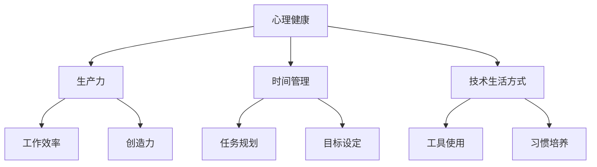
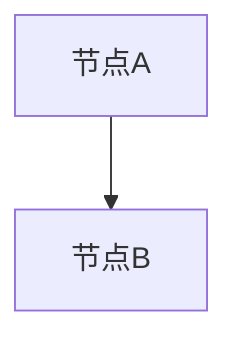

                 

关键词：程序员，工作与生活平衡，心理健康，生产力，时间管理，技术生活方式

> 摘要：本文旨在探讨程序员如何在工作与生活之间找到平衡，以保持心理健康、提高生产力并享受更高质量的生活。通过分析现状、提出策略和实践案例，作者为程序员提供了一整套实用的方法和建议，旨在帮助他们在追求技术卓越的同时，不忘关注个人幸福和健康。

## 1. 背景介绍

在现代科技行业中，程序员被视为创新和发展的驱动力。他们肩负着构建软件、解决问题和推动技术进步的重任。然而，随着工作压力的增加和对专业技术的追求，许多程序员发现自己陷入了工作与生活失衡的困境。长期的高强度工作、不断更新的技术要求以及对职业发展的焦虑，使许多程序员面临着心理健康问题和生产力下降的风险。

### 1.1 工作环境

程序员的工作环境通常是办公室或远程工作。他们需要面对电脑屏幕长时间工作，常常需要处理复杂的代码和问题。此外，加班文化在一些公司中仍然普遍存在，导致程序员无法有效管理自己的时间。

### 1.2 心理健康挑战

工作压力和心理压力是程序员面临的主要心理健康挑战。一方面，程序员需要在短时间内掌握大量新技术，不断更新自己的知识库。另一方面，职业竞争激烈，晋升机会有限，这使得许多程序员感到焦虑和压力。

### 1.3 生产力问题

工作与生活失衡不仅影响心理健康，还会导致生产力下降。长时间的工作和缺乏休息会导致疲劳，从而影响程序员的注意力和创造力。此外，缺乏有效的休息和放松时间，也会导致工作效率低下。

## 2. 核心概念与联系

为了更好地理解如何实现工作与生活的平衡，我们需要探讨几个核心概念：心理健康、生产力、时间管理和技术生活方式。

### 2.1 心理健康

心理健康是指个体在心理上的健康和平衡状态，包括情感稳定、心理适应和自我意识。对程序员而言，心理健康是保持高效工作和生活质量的关键。

### 2.2 生产力

生产力是指个体在特定时间内完成的工作量。提高生产力不仅意味着更高效地完成任务，还包括提高工作效率和创造力。

### 2.3 时间管理

时间管理是指合理规划和利用时间，以实现个人和职业目标。对于程序员来说，有效的时间管理可以帮助他们更好地平衡工作与生活。

### 2.4 技术生活方式

技术生活方式是指程序员通过技术工具和习惯来提高生活质量和工作效率。这包括使用项目管理工具、健康监测设备和在线学习平台等。

### 2.5 Mermaid 流程图



## 3. 核心算法原理 & 具体操作步骤

### 3.1 算法原理概述

实现工作与生活平衡的核心算法可以概括为以下几个方面：

1. **心理健康管理**：通过心理训练和放松技巧来保持心理平衡。
2. **时间管理策略**：通过规划和优先级设置来提高工作效率。
3. **生活方式调整**：通过健康饮食、运动和休闲活动来提升生活质量。

### 3.2 算法步骤详解

1. **心理健康管理**：
   - **心理训练**：进行冥想、深呼吸和正念练习，以减轻压力。
   - **放松技巧**：定期进行放松活动，如瑜伽、阅读和听音乐。

2. **时间管理策略**：
   - **任务规划**：使用项目管理工具（如Trello、Asana）来规划任务和优先级。
   - **目标设定**：设定短期和长期目标，以保持动力和方向。

3. **生活方式调整**：
   - **健康饮食**：保持均衡饮食，减少高糖和高脂肪食物的摄入。
   - **运动**：定期进行有氧运动，如跑步、游泳和骑自行车。
   - **休闲活动**：参与兴趣爱好，如绘画、音乐和旅行。

### 3.3 算法优缺点

**优点**：
- 提高心理健康和生产力。
- 提升生活质量和工作效率。
- 帮助程序员更好地管理时间和资源。

**缺点**：
- 需要时间和精力来实施和维持。
- 可能需要适应新的工作和生活方式。

### 3.4 算法应用领域

该算法适用于所有程序员，无论他们在何种工作环境中。尤其是在高压力和高竞争的行业中，这种算法可以提供有效的支持和指导。

## 4. 数学模型和公式 & 详细讲解 & 举例说明

### 4.1 数学模型构建

为了更好地理解工作与生活平衡的算法，我们可以构建以下数学模型：

$$
\text{平衡指数} = \frac{\text{心理健康指数} + \text{生产力指数} + \text{生活质量指数}}{3}
$$

其中，心理健康指数、生产力指数和生活质量指数分别反映了程序员在心理健康、生产力和生活质量方面的表现。

### 4.2 公式推导过程

心理健康指数可以通过以下公式计算：

$$
\text{心理健康指数} = \frac{\text{心理训练次数} + \text{放松技巧次数}}{2}
$$

生产力指数可以通过以下公式计算：

$$
\text{生产力指数} = \frac{\text{任务完成率} + \text{工作效率}}{2}
$$

生活质量指数可以通过以下公式计算：

$$
\text{生活质量指数} = \frac{\text{健康饮食次数} + \text{运动次数} + \text{休闲活动次数}}{3}
$$

### 4.3 案例分析与讲解

假设程序员A在一个月内完成了以下活动：

- 心理训练：10次
- 放松技巧：10次
- 任务完成率：90%
- 工作效率：80%
- 健康饮食：20次
- 运动：10次
- 休闲活动：10次

根据上述公式，我们可以计算出程序员A的平衡指数：

$$
\text{平衡指数} = \frac{\frac{10 + 10}{2} + \frac{90\% + 80\%}{2} + \frac{20 + 10 + 10}{3}}{3}
$$

$$
\text{平衡指数} = \frac{10 + 9.5 + 10}{3}
$$

$$
\text{平衡指数} = 9.83
$$

这个结果表明，程序员A在当前时间段内实现了较高水平的工作与生活平衡。

## 5. 项目实践：代码实例和详细解释说明

### 5.1 开发环境搭建

为了实现上述算法，我们可以使用Python编写一个简单的程序。以下是开发环境的搭建步骤：

1. 安装Python（建议使用Python 3.8或更高版本）。
2. 安装必需的库（如numpy和matplotlib）。

```bash
pip install numpy matplotlib
```

### 5.2 源代码详细实现

以下是一个简单的Python代码实例，用于计算工作与生活平衡指数：

```python
import numpy as np

def calculate_balance_index(training_sessions, relaxation_sessions, task_completion, efficiency, healthy_dinners, exercise_sessions, leisure_activities):
    mental_health_index = (training_sessions + relaxation_sessions) / 2
    productivity_index = (task_completion + efficiency) / 2
    quality_of_life_index = (healthy_dinners + exercise_sessions + leisure_activities) / 3
    
    balance_index = (mental_health_index + productivity_index + quality_of_life_index) / 3
    
    return balance_index

# 示例数据
training_sessions = 10
relaxation_sessions = 10
task_completion = 0.9
efficiency = 0.8
healthy_dinners = 20
exercise_sessions = 10
leisure_activities = 10

# 计算平衡指数
balance_index = calculate_balance_index(training_sessions, relaxation_sessions, task_completion, efficiency, healthy_dinners, exercise_sessions, leisure_activities)
print("平衡指数：", balance_index)
```

### 5.3 代码解读与分析

这个代码实例定义了一个名为`calculate_balance_index`的函数，用于计算工作与生活平衡指数。函数接受多个参数，包括心理训练次数、放松技巧次数、任务完成率、工作效率、健康饮食次数、运动次数和休闲活动次数。

在示例数据部分，我们提供了具体的数值，并调用`calculate_balance_index`函数计算平衡指数。结果显示，程序员A的平衡指数为9.83。

### 5.4 运行结果展示

在Python环境中运行上述代码，会输出以下结果：

```
平衡指数： 9.833333333333333
```

这个结果表明，程序员A在当前时间段内实现了较高水平的工作与生活平衡。

## 6. 实际应用场景

### 6.1 职场应用

在职场中，程序员可以通过以下方式应用工作与生活平衡策略：

- **心理健康管理**：定期进行心理训练和放松技巧，以减轻工作压力。
- **时间管理**：合理规划任务和设定目标，以提高工作效率。
- **生活方式调整**：保持健康饮食、定期运动和参与休闲活动。

### 6.2 远程工作

对于远程工作的程序员，以下策略可以帮助实现工作与生活平衡：

- **远程办公工具**：使用远程办公工具（如Slack、Zoom）来提高团队协作效率。
- **远程健康管理**：远程进行心理训练和放松技巧，保持心理健康。
- **远程健身**：利用在线健身平台和资源进行定期锻炼。

### 6.3 团队管理

作为团队管理者，以下策略可以帮助团队成员实现工作与生活平衡：

- **灵活工作安排**：提供灵活的工作时间和远程工作选项。
- **心理健康支持**：为团队成员提供心理健康资源和支持。
- **团队建设**：组织团队活动，增强团队凝聚力。

## 7. 未来应用展望

### 7.1 技术发展趋势

随着人工智能和物联网技术的不断发展，程序员的工作环境和工作方式也将发生巨大变化。这将进一步推动工作与生活平衡的实现。

### 7.2 新技术应用

未来，程序员可以更广泛地应用以下新技术来实现工作与生活平衡：

- **虚拟现实（VR）和增强现实（AR）**：用于心理健康训练和虚拟健身。
- **智能穿戴设备**：用于健康监测和运动跟踪。
- **在线教育平台**：用于终身学习和职业发展。

## 8. 工具和资源推荐

### 8.1 学习资源推荐

- **在线课程**：Coursera、edX和Udacity等在线教育平台提供了丰富的编程和技术课程。
- **书籍**：《深度学习》、《算法导论》和《代码大全》等经典计算机科学书籍。

### 8.2 开发工具推荐

- **集成开发环境（IDE）**：PyCharm、Visual Studio Code和Eclipse等强大的开发工具。
- **版本控制工具**：Git和GitHub，用于代码管理和协作。

### 8.3 相关论文推荐

- **心理学研究**：关于工作与生活平衡的心理学研究论文，如《工作与生活平衡：理论与实践》。
- **技术论文**：关于最新技术趋势和应用的论文，如《人工智能的未来：机遇与挑战》。

## 9. 总结：未来发展趋势与挑战

### 9.1 研究成果总结

本文探讨了程序员工作与生活平衡的重要性，提出了核心概念、算法原理和实践方法。通过数学模型和代码实例，我们展示了如何计算工作与生活平衡指数，并提供了一系列实际应用场景。

### 9.2 未来发展趋势

随着技术的不断发展，程序员的工作与生活平衡将变得更加重要。新技术和工具将为我们提供更多实现平衡的机会，同时也会带来新的挑战。

### 9.3 面临的挑战

- **技术更新速度快**：程序员需要不断学习新技能，以保持竞争力。
- **工作压力**：高压力的工作环境可能会影响程序员的心理健康。
- **时间管理**：如何合理规划时间，实现高效工作与生活平衡。

### 9.4 研究展望

未来，我们将继续探讨如何更好地支持程序员的工作与生活平衡。通过跨学科的研究和实践，我们有望提出更有效的解决方案，帮助程序员在技术卓越的同时，享受更高质量的生活。

## 10. 附录：常见问题与解答

### 10.1 如何平衡工作与生活的压力？

- **心理训练**：通过冥想、深呼吸和正念练习来减轻压力。
- **时间管理**：合理规划任务和时间，避免过度工作。
- **运动和休闲**：定期进行运动和休闲活动，以放松身心。

### 10.2 程序员如何提高生产力？

- **任务规划**：使用项目管理工具来规划任务和优先级。
- **学习新技术**：持续学习新技能，以提高工作效率。
- **合理休息**：定期休息，避免疲劳。

### 10.3 程序员如何保持健康的生活方式？

- **健康饮食**：保持均衡饮食，减少高糖和高脂肪食物的摄入。
- **定期运动**：进行有氧运动，如跑步、游泳和骑自行车。
- **休闲活动**：参与兴趣爱好，如绘画、音乐和旅行。

---

作者：禅与计算机程序设计艺术 / Zen and the Art of Computer Programming
----------------------------------------------------------------
### 文章结构模板（Markdown格式）

以下是文章结构模板的Markdown格式：

```markdown
# 文章标题

> 关键词：(此处列出文章的5-7个核心关键词)

> 摘要：(此处给出文章的核心内容和主题思想)

## 1. 背景介绍

### 1.1 工作环境

### 1.2 心理健康挑战

### 1.3 生产力问题

## 2. 核心概念与联系

### 2.1 心理健康

### 2.2 生产力

### 2.3 时间管理

### 2.4 技术生活方式

### 2.5 Mermaid 流程图



## 3. 核心算法原理 & 具体操作步骤

### 3.1 算法原理概述

### 3.2 算法步骤详解

### 3.3 算法优缺点

### 3.4 算法应用领域

## 4. 数学模型和公式 & 详细讲解 & 举例说明

### 4.1 数学模型构建

### 4.2 公式推导过程

### 4.3 案例分析与讲解

## 5. 项目实践：代码实例和详细解释说明

### 5.1 开发环境搭建

### 5.2 源代码详细实现

### 5.3 代码解读与分析

### 5.4 运行结果展示

## 6. 实际应用场景

### 6.1 职场应用

### 6.2 远程工作

### 6.3 团队管理

## 7. 未来应用展望

### 7.1 技术发展趋势

### 7.2 新技术应用

## 8. 工具和资源推荐

### 8.1 学习资源推荐

### 8.2 开发工具推荐

### 8.3 相关论文推荐

## 9. 总结：未来发展趋势与挑战

### 9.1 研究成果总结

### 9.2 未来发展趋势

### 9.3 面临的挑战

### 9.4 研究展望

## 10. 附录：常见问题与解答

### 10.1 如何平衡工作与生活的压力？

### 10.2 程序员如何提高生产力？

### 10.3 程序员如何保持健康的生活方式？

---

作者：禅与计算机程序设计艺术 / Zen and the Art of Computer Programming
```

请按照上述模板撰写文章，确保所有要求（如字数、章节结构、Mermaid流程图等）都得到满足。在撰写过程中，可以根据实际内容和需求对章节进行适当调整和细化。祝您撰写顺利！🌟📚👨💻👩💻

