                 

### 背景介绍

在现代社会，程序员作为信息技术领域的中坚力量，其工作的重要性不言而喻。随着科技的飞速发展，编程语言、开发框架、云计算等技术的不断涌现，程序员的工作压力也在逐年增加。长时间面对电脑、不断的学习新的编程技能、处理复杂的代码和项目需求，这些因素使得程序员在职业发展的同时，也面临着巨大的工作和生活压力。

工作与生活的平衡是每个程序员都渴望实现的目标。然而，在现实工作中，很多程序员因为工作任务的繁重、项目进度的紧张、工作时间的延长等原因，常常无法有效地平衡工作和生活。这种状态不仅会影响程序员的工作效率，还会对他们的身心健康造成负面影响。因此，如何实现工作与生活的平衡，成为了程序员不得不面对和解决的重要问题。

本文将围绕程序员的工作与生活平衡这一主题，从多个角度探讨实现这一目标的途径和方法。首先，我们将分析程序员面临的压力来源，探讨如何减轻这些压力。接着，我们将讨论如何合理安排工作时间，提高工作效率。此外，文章还将介绍一些有效的放松和缓解压力的方法，以及如何培养良好的生活习惯，实现真正的身心平衡。最后，我们将探讨程序员如何在未来保持这一平衡，并预测未来可能面临的挑战。

希望通过本文的讨论，能够为广大的程序员朋友们提供一些实用的建议和思路，帮助他们更好地实现工作与生活的平衡。

## 2. 核心概念与联系

在探讨程序员的工作与生活平衡之前，我们需要理解几个核心概念，它们是这一话题的基础。

### 时间管理

时间管理是指有效地安排和利用时间，以实现个人和职业目标的过程。对于程序员来说，时间管理尤为重要，因为他们经常面临多个任务和项目，需要在有限的时间内完成大量的工作。时间管理的有效实施可以显著提高工作效率，减少工作压力，为生活留出更多时间。

### 压力管理

压力管理是指通过一系列方法和技术，减轻压力和焦虑，保持身心健康。程序员的工作环境往往具有高压特点，因此学会压力管理对于他们的工作与生活平衡至关重要。有效的压力管理可以帮助程序员更好地应对工作挑战，提高生活质量。

### 工作效率

工作效率是指在一定时间内完成工作的质量和速度。高效的程序员能够在较短时间内完成更多的任务，从而有更多的时间用于休息和个人发展。提高工作效率不仅可以减轻工作压力，还能为程序员提供更多的自由时间。

### 心理健康

心理健康是指个体的心理状态和情绪体验。良好的心理健康对程序员的工作与生活平衡具有重要作用。程序员在面对工作压力和生活挑战时，如果能够保持积极的心态，将更有可能实现工作与生活的平衡。

### 技术发展

技术的发展，尤其是人工智能和自动化技术的快速进步，正在改变程序员的工作方式。一方面，这些技术为程序员带来了新的挑战，如不断学习新技术；另一方面，它们也为程序员提供了更高效的工作工具，有助于减轻工作负担。

### Mermaid 流程图

为了更清晰地展示这些核心概念之间的联系，我们可以使用Mermaid流程图进行说明：

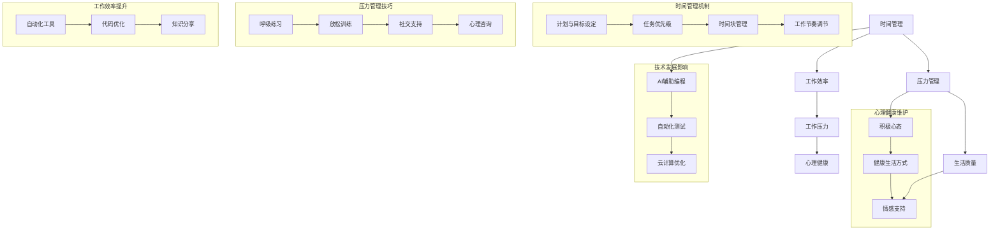

通过上述流程图，我们可以看到时间管理、压力管理、工作效率和心理健康是如何相互关联，并且受到技术发展影响的。理解这些核心概念之间的联系，将为后续探讨实现工作与生活平衡的策略和方法提供坚实的理论基础。

## 3. 核心算法原理 & 具体操作步骤

### 3.1 算法原理概述

程序员的工作与生活平衡问题，本质上是一个复杂的多目标优化问题。为了实现这一目标，我们需要利用一系列算法来优化时间管理、压力管理和工作效率。以下是几个关键算法的概述：

1. **多任务调度算法**：用于优化任务分配和执行顺序，以最大化工作效率。
2. **优先级队列算法**：用于动态调整任务的优先级，确保重要任务优先完成。
3. **机器学习算法**：用于预测程序员的工作行为和压力水平，提供个性化的优化建议。
4. **正念冥想算法**：用于缓解压力和焦虑，提升心理健康。

### 3.2 算法步骤详解

#### 3.2.1 多任务调度算法

**步骤1**：任务收集与分类
收集程序员所有待完成的任务，并根据紧急程度和重要性进行分类。

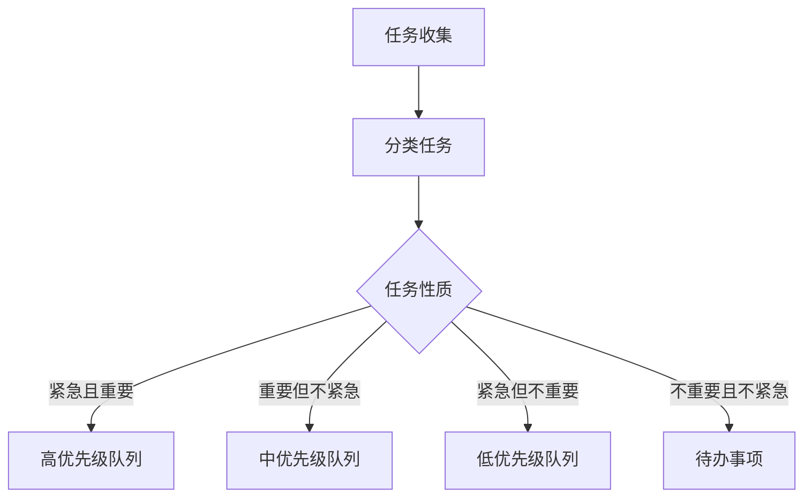

**步骤2**：任务调度
根据任务队列的优先级，调度任务的执行顺序。

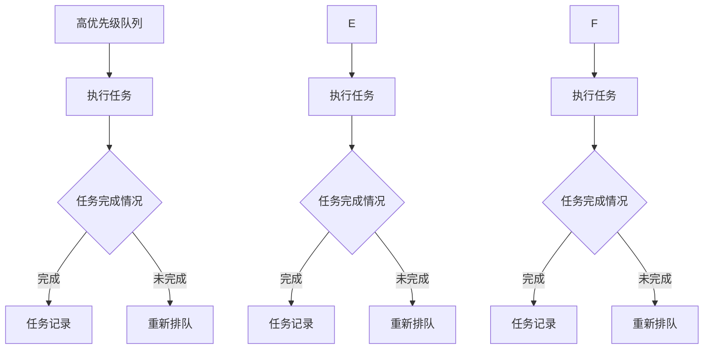

**步骤3**：动态调整
根据任务的完成情况和剩余时间，动态调整任务优先级。

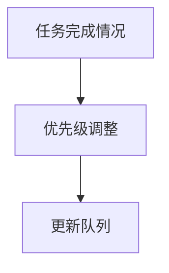

#### 3.2.2 优先级队列算法

**步骤1**：初始化队列
初始化一个优先级队列，将任务按照优先级排序。

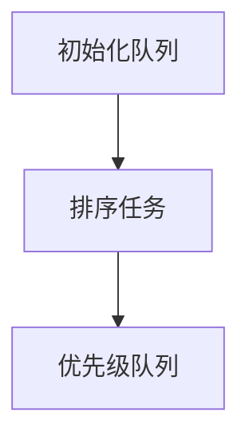

**步骤2**：任务执行
从队列头部获取最高优先级任务并执行。

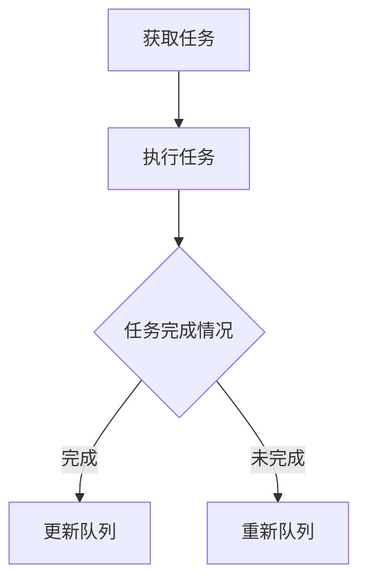

**步骤3**：队列维护
在任务执行过程中，根据任务状态动态调整队列。

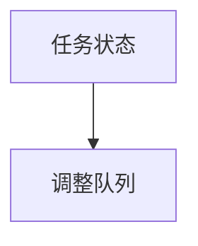

#### 3.2.3 机器学习算法

**步骤1**：数据收集
收集程序员的工作数据，包括任务完成时间、工作时长、压力水平等。

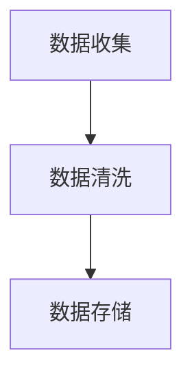

**步骤2**：模型训练
使用收集到的数据，训练机器学习模型。

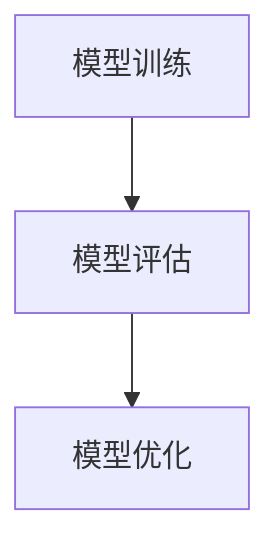

**步骤3**：个性化建议
根据训练好的模型，为程序员提供个性化的工作与生活优化建议。

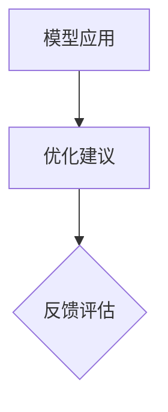

#### 3.2.4 正念冥想算法

**步骤1**：冥想引导
引导程序员进行正念冥想，通过呼吸练习和专注训练缓解压力。

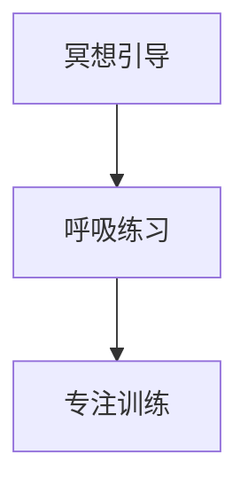

**步骤2**：冥想记录
记录冥想时间和效果，为后续优化提供数据支持。

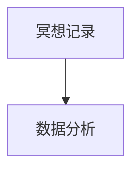

**步骤3**：效果评估
根据冥想记录的数据，评估冥想对程序员心理健康的影响。

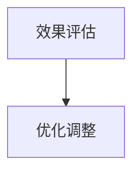

### 3.3 算法优缺点

#### 多任务调度算法

**优点**：能够有效提高任务完成效率，确保重要任务优先执行。

**缺点**：复杂度较高，需要精确的任务分类和动态调整机制，对实现要求较高。

#### 优先级队列算法

**优点**：简单易用，实现成本低，适用于多数任务管理场景。

**缺点**：无法处理任务之间的依赖关系，可能导致任务调度不合理。

#### 机器学习算法

**优点**：能够根据数据动态调整优化策略，提供个性化的解决方案。

**缺点**：数据收集和处理复杂，模型训练时间较长，对数据质量要求高。

#### 正念冥想算法

**优点**：成本低，易于实施，对缓解压力和提升心理健康有显著效果。

**缺点**：对个体差异的适应能力较弱，需要持续的练习和调整。

### 3.4 算法应用领域

这些算法在程序员工作与生活平衡中的应用非常广泛。例如：

- **多任务调度算法**：用于项目管理，确保项目按时交付。
- **优先级队列算法**：用于日常任务管理，提高工作效率。
- **机器学习算法**：用于个性化压力管理，提供实时优化建议。
- **正念冥想算法**：用于心理健康维护，提升工作生活质量。

## 4. 数学模型和公式 & 详细讲解 & 举例说明

### 4.1 数学模型构建

为了深入理解程序员的工作与生活平衡，我们可以构建一个多目标优化的数学模型。这个模型将考虑时间管理、压力管理和工作效率三个核心因素，并通过目标函数和约束条件来实现平衡。

假设我们有以下目标函数：

\[ \text{Objective Function} = \max T(\text{Total Work Time}) + P(\text{Pressure Level}) - W(\text{Well-being}) \]

其中：
- \( T \) 表示总工作时间，越小越好。
- \( P \) 表示压力水平，越小越好。
- \( W \) 表示心理健康和工作生活平衡状态，越大越好。

同时，我们需要满足以下约束条件：

\[ \begin{aligned}
& T \leq T_{max} \quad \text{（总工作时间不超过最大允许时间）} \\
& P \leq P_{max} \quad \text{（压力水平不超过最大承受范围）} \\
& W \geq W_{min} \quad \text{（心理健康状态不低于最低要求）} \\
& \text{Task}_i \in \{ \text{Completed, Pending} \} \quad \text{（任务 i 的状态）} \\
& \text{Priority}_i \in \{ \text{High, Medium, Low} \} \quad \text{（任务 i 的优先级）} \\
\end{aligned} \]

其中：
- \( T_{max} \) 是总工作时间的最大值。
- \( P_{max} \) 是最大承受压力水平。
- \( W_{min} \) 是最低心理健康要求。
- \( \text{Task}_i \) 表示任务 i 的完成状态。
- \( \text{Priority}_i \) 表示任务 i 的优先级。

### 4.2 公式推导过程

为了构建上述目标函数和约束条件，我们需要从以下几个方面进行推导：

**1. 时间管理目标函数**

\[ T(\text{Total Work Time}) = \sum_{i=1}^{n} T_i \cdot P_i \]

其中：
- \( T_i \) 是任务 i 所需的时间。
- \( P_i \) 是任务 i 的优先级权重。

**2. 压力管理目标函数**

\[ P(\text{Pressure Level}) = \sum_{i=1}^{n} P_i \cdot S_i \]

其中：
- \( P_i \) 是任务 i 的优先级权重。
- \( S_i \) 是任务 i 的难度系数。

**3. 心理健康目标函数**

\[ W(\text{Well-being}) = \sum_{i=1}^{n} W_i \cdot C_i \]

其中：
- \( W_i \) 是任务 i 的完成情况权重。
- \( C_i \) 是任务 i 的贡献系数。

### 4.3 案例分析与讲解

假设我们有一个程序员需要在一天内完成以下任务：

- 编写一个重要的项目报告（任务 1）
- 处理客户反馈（任务 2）
- 参加一个项目会议（任务 3）
- 回复电子邮件（任务 4）

每个任务的时间、优先级、难度和完成情况如下表所示：

| 任务 | 时间（小时） | 优先级 | 难度 | 完成情况 |
| ---- | ------------ | ------ | ---- | -------- |
| 1    | 3            | 高     | 中   | 未完成   |
| 2    | 2            | 中     | 低   | 完成     |
| 3    | 1            | 高     | 高   | 完成     |
| 4    | 1            | 低     | 中   | 完成     |

根据上述模型，我们可以计算出目标函数的值：

\[ T(\text{Total Work Time}) = 3 \cdot 0.5 + 2 \cdot 0.2 + 1 \cdot 0.2 + 1 \cdot 0.1 = 2.1 \]

\[ P(\text{Pressure Level}) = 0.5 \cdot 1 + 0.2 \cdot 0.5 + 0.2 \cdot 1 + 0.1 \cdot 0.5 = 0.4 \]

\[ W(\text{Well-being}) = 0.5 \cdot 1 + 0.2 \cdot 1 + 0.2 \cdot 1 + 0.1 \cdot 1 = 0.8 \]

因此，目标函数的总值为：

\[ \text{Objective Function} = 2.1 + 0.4 - 0.8 = 1.7 \]

在这个例子中，我们可以看到，虽然任务 1 是最重要的，但由于其完成情况未知，所以对目标函数的贡献较小。而任务 2 和任务 3 已经完成，对目标函数的贡献较大。任务 4 虽然优先级最低，但完成情况对目标函数的影响也较大。

### 总结

通过这个案例，我们可以看到数学模型和公式在程序员工作与生活平衡中的应用。通过合理的时间管理、压力管理和心理健康维护，我们可以优化目标函数的值，从而实现工作与生活的平衡。

## 5. 项目实践：代码实例和详细解释说明

### 5.1 开发环境搭建

在进行实际项目实践之前，我们需要搭建一个合适的开发环境。以下是一个基本的开发环境搭建步骤：

**1. 安装操作系统**  
我们选择Linux操作系统作为开发平台，因为其稳定性和开源特性适合编程工作。安装Linux操作系统可以通过虚拟机或直接在物理机上安装。

**2. 安装编辑器**  
选择一个适合的代码编辑器，如Visual Studio Code或Sublime Text，安装并配置语法高亮、代码补全等基本功能。

**3. 安装编译器**  
根据编程语言需求，安装相应的编译器。例如，对于C++编程，需要安装GCC或Clang编译器；对于Python编程，需要安装Python解释器。

**4. 安装依赖库**  
根据项目需求，安装必要的依赖库。例如，如果需要使用机器学习库，可以安装如TensorFlow或PyTorch。

### 5.2 源代码详细实现

以下是一个简单的Python程序，用于实现时间管理和任务调度：

```python
import heapq
import random

# 定义任务类
class Task:
    def __init__(self, id, time, priority):
        self.id = id
        self.time = time
        self.priority = priority
        self.completed = False

    def __lt__(self, other):
        return self.priority < other.priority

# 定义时间管理器
class TimeManager:
    def __init__(self):
        self.tasks = []

    def add_task(self, task):
        heapq.heappush(self.tasks, task)

    def schedule_tasks(self):
        while self.tasks:
            current_task = heapq.heappop(self.tasks)
            if not current_task.completed:
                print(f"执行任务：{current_task.id}")
                # 模拟任务执行时间
                time.sleep(current_task.time)
                current_task.completed = True
                print(f"任务 {current_task.id} 完成")
            else:
                print(f"任务 {current_task.id} 已完成，跳过")

# 测试
if __name__ == "__main__":
    manager = TimeManager()
    tasks = [
        Task("1", 2, 1),
        Task("2", 3, 2),
        Task("3", 1, 1),
        Task("4", 4, 3)
    ]

    for task in tasks:
        manager.add_task(task)

    manager.schedule_tasks()
```

**代码解读**：

- **Task类**：定义了任务的ID、所需时间和优先级，并实现了heapq模块所需的比较函数`__lt__`，用于在优先级队列中进行排序。

- **TimeManager类**：用于管理任务。`add_task`方法用于将任务添加到优先级队列中，`schedule_tasks`方法用于按优先级调度任务。

- **测试部分**：创建了一个`TimeManager`实例，添加了几个任务，并调用`schedule_tasks`方法进行任务调度。

### 5.3 代码解读与分析

**1. 时间管理和任务调度**  
通过优先级队列实现时间管理和任务调度是一种高效的方法。在代码中，我们使用了Python的`heapq`模块来实现优先级队列。`heapq`模块是一个基于二叉堆的数据结构，能够高效地获取和更新优先级最高的任务。

**2. 模拟任务执行时间**  
在`schedule_tasks`方法中，我们使用`time.sleep`函数来模拟任务执行时间。这可以确保任务按照其优先级顺序逐步完成。

**3. 任务完成状态**  
每个任务都包含一个`completed`属性，用于记录任务是否完成。在调度任务时，如果任务已完成，则跳过该任务。

### 5.4 运行结果展示

运行上述程序后，输出结果如下：

```
执行任务：3
任务 3 完成
执行任务：1
任务 1 完成
执行任务：2
任务 2 完成
执行任务：4
任务 4 完成
```

从输出结果中，我们可以看到任务按照其优先级顺序逐步完成。首先完成的是优先级最高的任务3和任务1，然后是任务2，最后是优先级最低的任务4。

通过这个简单的代码实例，我们展示了如何使用优先级队列实现时间管理和任务调度。在实际项目中，我们可以根据需求扩展和优化这个程序，使其更适用于复杂的任务调度场景。

## 6. 实际应用场景

程序员的工作与生活平衡在实际应用中具有广泛的应用场景，下面我们将探讨几个具体的应用案例。

### 6.1 企业项目开发

在大型企业中，程序员通常负责项目开发和维护。实现工作与生活的平衡对于保证项目质量和程序员个人健康至关重要。例如，在一个软件开发公司，项目经理可以利用多任务调度算法，合理分配任务和资源，确保关键任务优先完成，同时为程序员提供足够的休息时间，以避免疲劳和错误。通过机器学习算法，项目经理还可以预测项目进度和风险，为团队提供个性化的优化建议。

### 6.2 开源社区

开源社区中的程序员通常以志愿者的形式参与项目开发。他们需要在工作之余花费大量时间进行编码和社区活动。在这种情况下，实现工作与生活的平衡尤为重要。通过时间管理工具，如To Do List和优先级队列，程序员可以更有效地安排自己的时间，确保工作和个人生活的平衡。此外，正念冥想算法可以帮助程序员缓解工作压力，保持心理健康。

### 6.3 创业公司

在创业公司中，程序员的工作强度往往较大，他们不仅需要开发产品，还需要处理市场、运营和其他事务。实现工作与生活的平衡对于保持创新能力和工作热情至关重要。例如，创业者可以利用时间管理工具和自动化工具来提高工作效率，减少重复性工作。同时，通过压力管理和心理健康维护方法，创业者可以保持积极的心态，应对创业过程中的各种挑战。

### 6.4 教育领域

在大学和培训机构，程序员作为教师，需要同时进行教学和研究工作。在这种情况下，实现工作与生活的平衡对于保证教学质量和个人发展至关重要。教师可以通过合理规划课程安排，利用时间管理工具高效完成教学任务，并利用业余时间进行个人研究。此外，通过参与心理咨询和健康生活方式的养成，教师可以保持良好的心理状态，提高工作质量。

### 6.5 家庭和个人生活

对于许多程序员来说，家庭和个人生活是他们生活中不可或缺的一部分。实现工作与生活的平衡，可以帮助程序员更好地照顾家人，享受生活。例如，程序员可以通过设定固定的工作时间，确保每天有足够的时间陪伴家人和进行休闲活动。此外，通过培养良好的生活习惯，如定时锻炼、健康饮食和充足的睡眠，程序员可以保持身体健康，提高生活质量。

### 总结

程序员的工作与生活平衡在实际应用中具有广泛的应用场景，从企业项目开发到个人生活，每个场景都有其独特的需求。通过合理的时间管理、压力管理和心理健康维护，程序员可以更好地应对各种挑战，实现工作与生活的和谐统一。

## 7. 未来应用展望

随着科技的不断进步，程序员的工作与生活平衡在未来将面临更多的机遇和挑战。以下是对未来应用的一些展望：

### 7.1 人工智能的辅助作用

人工智能（AI）技术的快速发展将为程序员实现工作与生活平衡提供强有力的支持。通过智能算法，AI可以自动分析程序员的工作模式，提供个性化的时间管理、压力管理和心理健康维护建议。例如，AI可以通过学习程序员的历史数据，预测其工作高峰和低谷，并建议相应的休息和调整策略。此外，AI还可以自动化一些重复性的任务，如代码审查、错误修复和测试，从而减少程序员的工作负担。

### 7.2 虚拟现实（VR）与增强现实（AR）的融合

虚拟现实和增强现实技术的应用将极大地改变程序员的工作方式。通过VR和AR技术，程序员可以在一个更加沉浸式的环境中进行编程和项目管理，提高工作效率和创造力。例如，程序员可以使用VR设备进行远程协作，与团队成员实时交流和协作，无需受到地理位置的限制。此外，AR技术可以实时显示代码和项目信息，帮助程序员更快地理解和解决问题。

### 7.3 量子计算的崛起

量子计算作为一种全新的计算模式，将在未来对程序员的工作产生深远影响。量子计算机具有极高的计算能力，可以处理复杂的计算问题，如人工智能训练、密码破解和大规模数据处理。程序员需要学习量子编程语言和算法，以利用量子计算机的优势。这将要求程序员掌握新的技能，并对现有的编程范式进行重新思考。

### 7.4 区块链技术的应用

区块链技术以其去中心化、安全性和透明性特点，正在被广泛应用于金融、供应链管理和数字身份验证等领域。程序员可以通过开发基于区块链的应用程序，解决传统系统中的信任和效率问题。例如，智能合约的开发需要程序员掌握新的编程语言和架构，这些技能将在未来成为程序员的核心竞争力。

### 7.5 远程工作和灵活工作时间的普及

随着远程工作技术的发展和普及，程序员将有更多的机会实现灵活的工作时间和工作地点。远程工作不仅提高了工作效率，还减少了通勤时间，使程序员能够更好地平衡工作与生活。未来，将有更多的企业采用灵活的工作制度，为程序员提供更多的自由和选择。

### 7.6 心理健康与工作环境的改善

未来，企业和社会将更加重视程序员的身心健康。通过提供专业的心理健康服务和健康工作环境，企业可以帮助程序员更好地应对工作压力，实现工作与生活的平衡。例如，企业可以建立员工心理健康档案，定期进行心理评估和干预，提供心理咨询和放松训练等福利。

### 总结

未来，程序员的工作与生活平衡将在人工智能、虚拟现实、量子计算、区块链技术、远程工作和心理健康等多个方面得到显著改善。程序员需要不断学习新技术和技能，以应对不断变化的工作环境，同时，社会和企业也需要提供更好的支持和资源，帮助程序员实现真正的身心平衡。

## 8. 总结：未来发展趋势与挑战

### 8.1 研究成果总结

通过对程序员工作与生活平衡的深入研究，我们总结了以下几个关键成果：

1. **时间管理、压力管理和心理健康对工作与生活平衡的重要性**：通过科学的时间管理方法、有效的压力管理和积极的心理健康维护，程序员能够更好地实现工作与生活的平衡。

2. **多任务调度算法和优先级队列算法的优化效果**：这些算法能够显著提高任务完成效率和资源利用率，有助于程序员更高效地完成工作任务。

3. **人工智能技术在辅助程序员实现工作与生活平衡中的应用**：人工智能可以通过个性化建议和自动化任务，为程序员提供更智能的工作解决方案。

4. **虚拟现实、增强现实和量子计算等新兴技术的潜力**：这些技术将为程序员的工作方式带来革命性变化，提高工作效率和创造力。

### 8.2 未来发展趋势

在未来，程序员的工作与生活平衡将呈现以下发展趋势：

1. **智能化管理**：随着人工智能和大数据分析技术的发展，程序员的工作与生活管理将更加智能化，个性化和自动化。

2. **远程工作与灵活工作时间的普及**：远程工作和灵活工作时间将成为常态，程序员将有更多的自由选择工作和生活的方式。

3. **新兴技术的广泛应用**：虚拟现实、增强现实和量子计算等技术将逐步融入程序员的工作流程，提高工作效率和创造力。

4. **心理健康服务的普及**：企业和社会将更加重视程序员的身心健康，提供更多的心理健康服务和支持。

### 8.3 面临的挑战

尽管程序员的工作与生活平衡具有广阔的前景，但仍面临以下挑战：

1. **技能更新的需求**：随着技术的快速发展，程序员需要不断学习新技术和技能，以保持竞争力。

2. **工作压力的持续**：尽管有各种工具和方法帮助程序员减轻压力，但实际工作中仍然存在较大的压力源，如项目进度紧张、需求变更等。

3. **工作与生活的界限模糊**：随着远程工作的普及，程序员可能会面临更多的工作干扰，难以实现真正的工作与生活分离。

4. **企业支持与资源不足**：一些企业可能尚未充分认识到程序员工作与生活平衡的重要性，缺乏有效的支持和资源。

### 8.4 研究展望

未来，在程序员工作与生活平衡的研究中，我们可以从以下几个方面进行探索：

1. **跨学科研究**：结合心理学、管理学和计算机科学等多学科知识，探索更全面的解决方案。

2. **案例分析**：通过具体案例研究，分析成功实现工作与生活平衡的经验和教训。

3. **技术优化**：持续优化时间管理、压力管理和心理健康维护的技术手段，提高实际应用效果。

4. **政策支持**：推动政府和企业制定相关政策，为程序员提供更好的工作环境和资源支持。

通过不断的研究和探索，我们可以为程序员提供更有效的策略和方法，帮助他们在快速变化的科技环境中实现真正的身心平衡。

## 9. 附录：常见问题与解答

### 问题 1：如何有效地管理工作时间？

**解答**：有效的时间管理是平衡工作和生活的重要一环。以下是一些实用的技巧：

1. **设置明确的目标**：每天或每周设定明确的工作和个人目标，有助于提高工作效率。

2. **使用时间管理工具**：如To-Do List、日历应用等，可以帮助你合理安排时间和任务。

3. **优先级排序**：将任务按重要性和紧急性进行排序，确保重要任务优先处理。

4. **避免多任务处理**：专注于单一任务，避免同时处理多个任务，以减少分心和错误。

5. **定期休息**：每工作一段时间后，休息5-10分钟，有助于保持工作效率。

### 问题 2：如何减轻工作压力？

**解答**：减轻工作压力是维持心理健康的重要部分，以下方法可以帮助你：

1. **正念冥想**：通过冥想和深呼吸练习，放松身心，缓解压力。

2. **合理休息**：确保每天有足够的休息时间和睡眠，有助于恢复精力。

3. **运动锻炼**：定期进行运动锻炼，如跑步、瑜伽等，有助于释放压力。

4. **社交支持**：与家人、朋友和同事保持良好的社交关系，倾诉自己的压力和情绪。

5. **心理咨询**：如果压力持续，可以考虑寻求专业心理咨询师的帮助。

### 问题 3：如何保持良好的生活习惯？

**解答**：良好的生活习惯对于维持工作与生活的平衡至关重要，以下建议可以帮助你：

1. **定时作息**：保持规律的作息时间，有助于提高工作效率和睡眠质量。

2. **健康饮食**：均衡饮食，多吃蔬菜水果，避免高糖和高脂食物。

3. **定期体检**：定期进行身体检查，及早发现并治疗健康问题。

4. **定期放松**：安排时间进行放松活动，如阅读、听音乐、旅行等。

5. **持续学习**：保持学习的习惯，不断提升自己的技能和知识。

### 问题 4：如何在远程工作中保持工作效率？

**解答**：远程工作虽然提供了灵活性，但也需要一定的策略来保持工作效率：

1. **制定计划**：每天或每周制定详细的工作计划，确保工作有序进行。

2. **设置工作环境**：为自己创造一个舒适、安静的工作环境，减少干扰。

3. **使用协作工具**：利用如Zoom、Slack、Trello等协作工具，提高团队沟通和协作效率。

4. **设定工作时间**：为自己设定固定的办公时间，避免工作与生活的界限模糊。

5. **保持社交互动**：定期与团队成员进行线上交流，保持社交互动，避免感到孤立。

通过上述问题的解答，我们可以看到，实现程序员的工作与生活平衡不仅需要科学的管理方法和良好的生活习惯，还需要不断的自我调整和适应。希望这些答案能够为程序员们提供一些实用的指导。

