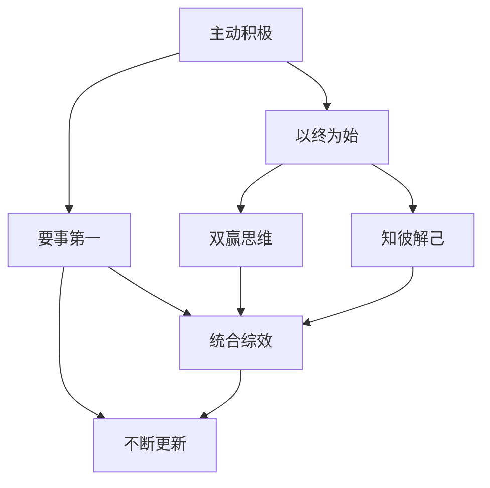
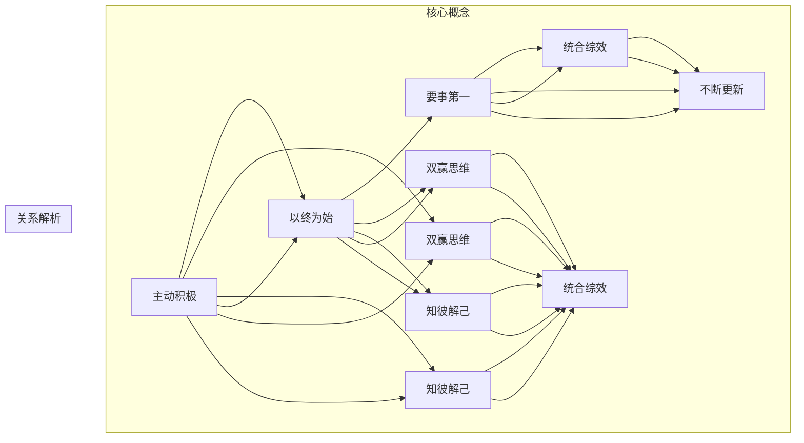

                 

关键词：程序员、工作与生活平衡、高效能人士、7个习惯、工作策略、健康生活方式、职业发展

> 摘要：本文旨在探讨程序员如何通过实践高效能人士的7个习惯，实现工作与生活的平衡，提升个人效能与幸福感。我们将结合实际案例，分析每个习惯在程序员职业生涯中的应用，并提供实用的建议。

## 1. 背景介绍

在现代科技行业中，程序员扮演着至关重要的角色。他们不仅是技术领域的创新者和开发者，也是推动社会进步的重要力量。然而，随着工作压力的增加和行业竞争的激烈，许多程序员面临着工作与生活失衡的问题。这种失衡不仅影响个人的健康和幸福感，还会对工作效率和职业发展产生负面影响。

因此，本文将借鉴史蒂芬·柯维的《高效能人士的7个习惯》，探讨程序员如何在职业生涯中实现工作与生活的平衡。本文将详细分析每个习惯的核心内容，并探讨其在程序员工作中的具体应用。

### 程序员工作与生活失衡的现状

- **工作压力与心理健康**：程序员的工作往往需要长时间坐在电脑前，面对高强度的工作任务和紧迫的项目交付。这种工作模式可能导致心理压力增加，出现焦虑、抑郁等心理健康问题。
- **工作与生活时间的冲突**：许多程序员为了完成工作任务，往往牺牲了个人生活和家庭时间，导致与家人、朋友的沟通减少，生活质量下降。
- **缺乏身体锻炼**：长时间坐在电脑前工作，程序员往往忽视了身体锻炼，导致身体健康问题，如肥胖、肌肉萎缩等。
- **职业发展瓶颈**：工作与生活的失衡可能导致程序员无法充分投入到职业发展中，错失晋升和提升技能的机会。

### 高效能人士的7个习惯

史蒂芬·柯维的《高效能人士的7个习惯》提出了一套系统性的方法，帮助人们实现个人成长和成功。这7个习惯包括：

1. **主动积极**：积极面对生活中的困难和挑战，从内心出发，主动承担责任。
2. **以终为始**：设定明确的目标和计划，为实现目标制定行动步骤。
3. **要事第一**：优先处理重要且紧急的任务，避免陷入事务性工作的泥潭。
4. **双赢思维**：在人际交往中寻求合作与共赢，避免对立和冲突。
5. **知彼解己**：倾听他人，理解他人的需求和想法。
6. **统合综效**：通过团队合作和资源整合，实现整体效能最大化。
7. **不断更新**：持续自我提升，保持身心健康和高效能。

本文将结合程序员的职业特点，深入探讨每个习惯在程序员工作中的具体应用。

## 2. 核心概念与联系

为了更好地理解高效能人士的7个习惯在程序员工作中的应用，我们首先需要明确这些概念之间的联系。以下是一个简化的Mermaid流程图，展示了7个习惯之间的相互作用。



### 概念解析

- **主动积极**：主动积极是高效能人士的第一步，它要求程序员在面对问题和挑战时，能够主动寻找解决方案，而不是被动等待问题的发生。
- **以终为始**：以终为始意味着程序员在开始工作前，应明确目标和计划，确保每一项任务都与长远目标相一致。
- **要事第一**：要事第一强调的是优先级管理，程序员应优先处理最重要和最紧急的任务，避免陷入琐碎的事务中。
- **双赢思维**：双赢思维要求程序员在团队合作和沟通中，寻求合作和共赢，避免冲突和对抗。
- **知彼解己**：知彼解己强调倾听和理解他人的需求，这对于程序员在团队协作和客户沟通中尤为重要。
- **统合综效**：统合综效强调团队合作和资源整合，程序员应学会利用团队和外部资源，实现整体效能最大化。
- **不断更新**：不断更新是持续成长的关键，程序员应不断学习新技能和知识，以适应快速变化的科技行业。

### Mermaid流程图

以下是详细解析每个习惯的Mermaid流程图，包括每个节点的具体内容和相互关系。



通过这个流程图，我们可以清晰地看到每个习惯在程序员职业生涯中的重要性，以及它们之间的相互关系。

## 3. 核心算法原理 & 具体操作步骤

### 3.1 算法原理概述

在程序员的工作中，实现高效能和平衡的关键在于对任务的合理规划和优先级管理。以下算法原理概述将帮助我们理解如何通过系统性的方法实现这一目标。

#### 3.1.1 任务分解

- **原理**：将复杂任务分解为可管理的子任务，确保每个子任务都有明确的起始点和结束点。
- **操作步骤**：1. 确定主要任务 2. 将任务分解为子任务 3. 为每个子任务设定优先级 4. 为每个子任务分配资源。

#### 3.1.2 优先级管理

- **原理**：基于任务的重要性和紧迫性，对任务进行优先级排序，确保重要且紧急的任务优先处理。
- **操作步骤**：1. 确定任务的重要性和紧迫性 2. 使用四象限法（紧急且重要、紧急但不重要、不紧急但重要、不紧急且不重要）进行分类 3. 优先处理紧急且重要的任务。

#### 3.1.3 时间管理

- **原理**：合理规划时间，确保有足够的时间完成每个任务，并留出休息和放松的时间。
- **操作步骤**：1. 制定日程安排 2. 设定每个任务的完成时间 3. 避免过度工作，保证足够的休息时间。

### 3.2 算法步骤详解

#### 3.2.1 任务分解

1. **确定主要任务**：根据项目目标和职责，确定需要完成的任务。
2. **分解任务**：将主要任务分解为可管理的子任务，确保每个子任务都有明确的起始点和结束点。
3. **设定优先级**：根据任务的重要性和紧急性，为每个子任务设定优先级，确保重要任务先完成。
4. **分配资源**：为每个子任务分配必要的资源，如人力、时间、技术支持等。

#### 3.2.2 优先级管理

1. **确定任务优先级**：使用四象限法，将任务分为四个类别，并确定每个类别的优先级。
2. **制定优先级列表**：根据任务优先级，制定一个详细的任务列表，确保重要任务优先完成。
3. **实时调整**：在执行任务过程中，根据任务的实际进展和变化，实时调整任务优先级。

#### 3.2.3 时间管理

1. **制定日程安排**：根据任务列表和时间要求，制定一个详细的日程安排，确保每个任务都有明确的时间规划。
2. **执行日程安排**：按照日程安排，执行每个任务，确保按时完成。
3. **监控进度**：定期检查任务进度，及时调整日程安排，确保任务按时完成。
4. **休息与放松**：确保每个任务完成后，有足够的休息时间，避免过度工作。

### 3.3 算法优缺点

#### 3.3.1 优点

- **任务明确**：通过任务分解，每个任务都有明确的起始点和结束点，确保任务完成。
- **优先级清晰**：通过优先级管理，确保重要任务优先完成，提高工作效率。
- **时间高效**：通过时间管理，确保有足够的时间完成每个任务，并留出休息和放松的时间。

#### 3.3.2 缺点

- **任务细分可能过度**：过度细分任务可能导致任务数量过多，增加管理复杂度。
- **优先级调整频繁**：在执行任务过程中，优先级可能需要频繁调整，增加管理复杂度。
- **时间管理难度**：合理规划时间需要一定的技巧和实践，新手可能难以掌握。

### 3.4 算法应用领域

- **项目管理**：在项目开发过程中，通过任务分解和优先级管理，确保项目按时交付。
- **日常办公**：在日常工作安排中，通过任务分解和时间管理，提高工作效率。
- **个人成长**：在个人成长过程中，通过任务分解和时间管理，实现自我提升。

### 3.5 实际案例

#### 3.5.1 项目管理

假设某程序员负责开发一个复杂的软件项目，项目包括以下主要任务：

1. **需求分析**：明确项目需求，与客户沟通。
2. **系统设计**：设计系统架构，编写设计文档。
3. **编码实现**：按照设计文档，编写代码。
4. **测试与调试**：进行功能测试，修复bug。
5. **部署上线**：部署上线，进行实际应用。

通过任务分解和优先级管理，程序员可以按照以下步骤进行项目开发：

1. **任务分解**：将项目任务分解为子任务，如：
   - 需求分析：与客户沟通，获取需求。
   - 系统设计：制定系统架构，编写设计文档。
   - 编码实现：按照设计文档，编写代码。
   - 测试与调试：编写测试用例，进行功能测试。
   - 部署上线：部署上线，进行实际应用。

2. **设定优先级**：根据任务的重要性和紧急性，设定优先级：
   - 紧急且重要：需求分析、系统设计。
   - 紧急但不重要：编码实现。
   - 不紧急但重要：测试与调试。
   - 不紧急且不重要：部署上线。

3. **时间管理**：根据任务列表和时间要求，制定日程安排，确保每个任务按时完成。

通过以上步骤，程序员可以确保项目按时交付，并保持工作与生活的平衡。

#### 3.5.2 日常办公

假设某程序员在日常工作中有以下任务：

1. **撰写技术文档**：每天需要撰写一定数量的技术文档。
2. **参与团队会议**：每周需要参加团队会议，讨论项目进展。
3. **编码实现**：完成每日编码任务。
4. **学习新技能**：每天需要花费一定时间学习新技能。

通过任务分解和优先级管理，程序员可以按照以下步骤进行日常办公：

1. **任务分解**：将日常任务分解为子任务，如：
   - 撰写技术文档：每天撰写一定数量的文档。
   - 参与团队会议：每周参加团队会议。
   - 编码实现：每天完成编码任务。
   - 学习新技能：每天学习一定时间的新技能。

2. **设定优先级**：根据任务的重要性和紧急性，设定优先级：
   - 紧急且重要：参与团队会议。
   - 紧急但不重要：撰写技术文档。
   - 不紧急但重要：学习新技能。
   - 不紧急且不重要：编码实现。

3. **时间管理**：根据任务列表和时间要求，制定日程安排，确保每个任务按时完成。

通过以上步骤，程序员可以确保工作效率，并保持工作与生活的平衡。

## 4. 数学模型和公式 & 详细讲解 & 举例说明

### 4.1 数学模型构建

为了更好地理解任务分解和优先级管理在程序员工作中的实际应用，我们引入以下数学模型。

#### 4.1.1 任务分解模型

设 \( T \) 为任务集合，其中每个任务 \( t \in T \) 有以下属性：

- \( P(t) \)：任务 \( t \) 的优先级，值越大表示优先级越高。
- \( D(t) \)：任务 \( t \) 的持续时间。
- \( R(t) \)：任务 \( t \) 需要的资源。

任务分解模型的目标是将任务 \( T \) 分解为若干子任务集合，使得每个子任务集合 \( T' \) 满足以下条件：

1. \( T' \subseteq T \)
2. 每个子任务集合 \( T' \) 中的任务具有相同的优先级。
3. 每个子任务集合 \( T' \) 中的任务总持续时间不超过总资源限制。

#### 4.1.2 优先级管理模型

设 \( T \) 为任务集合，其中每个任务 \( t \in T \) 有以下属性：

- \( P(t) \)：任务 \( t \) 的优先级，值越大表示优先级越高。
- \( D(t) \)：任务 \( t \) 的持续时间。

优先级管理模型的目标是在任务集合 \( T \) 中，根据任务优先级和持续时间，选择一个最优的任务执行顺序，使得总持续时间最小。

### 4.2 公式推导过程

#### 4.2.1 任务分解模型

任务分解模型的目标是最小化子任务集合的总持续时间，即：

\[ \text{Minimize} \sum_{t' \in T'} D(t') \]

其中，\( T' \) 为子任务集合。

为了实现目标，我们可以使用动态规划算法。首先，我们将任务按照优先级排序，然后使用一个二维数组 \( dp[i][j] \) 表示在优先级为 \( i \) 的任务中选择前 \( j \) 个任务时的最优总持续时间。

状态转移方程为：

\[ dp[i][j] = \min(dp[i-1][j], dp[i][j-1] + D(t_j)) \]

其中，\( dp[i-1][j] \) 表示不选择任务 \( t_j \) 的总持续时间，\( dp[i][j-1] + D(t_j) \) 表示选择任务 \( t_j \) 的总持续时间。

初始状态为 \( dp[0][j] = 0 \)，表示在优先级为 0 的任务中选择前 \( j \) 个任务的总持续时间为 0。

最终结果为 \( dp[n][m] \)，其中 \( n \) 为任务总数，\( m \) 为优先级最大的任务数。

#### 4.2.2 优先级管理模型

优先级管理模型的目标是选择一个最优的任务执行顺序，使得总持续时间最小。我们可以使用贪心算法，每次选择优先级最高的任务。

具体步骤如下：

1. 对任务集合 \( T \) 进行排序，按照优先级从高到低排序。
2. 按照排序顺序，依次选择任务，并计算总持续时间。
3. 记录每个任务的执行时间，直到所有任务完成。

时间复杂度为 \( O(m \log m) \)，其中 \( m \) 为任务总数。

### 4.3 案例分析与讲解

假设我们有以下任务集合 \( T \)：

- 任务 1：优先级 5，持续时间 3
- 任务 2：优先级 4，持续时间 4
- 任务 3：优先级 3，持续时间 2
- 任务 4：优先级 2，持续时间 3
- 任务 5：优先级 1，持续时间 2

#### 4.3.1 任务分解模型

根据任务分解模型，我们需要将任务按照优先级分解为子任务集合。首先，我们将任务按照优先级排序：

- 任务 1：优先级 5，持续时间 3
- 任务 2：优先级 4，持续时间 4
- 任务 3：优先级 3，持续时间 2
- 任务 4：优先级 2，持续时间 3
- 任务 5：优先级 1，持续时间 2

然后，我们使用动态规划算法计算最优的子任务集合。以下是部分状态转移表：

| i   | j   | dp[i][j]  | 说明                               |
| --- | --- | --------- | ---------------------------------- |
| 1   | 1   | 3         | 选择任务 1，总持续时间为 3          |
| 1   | 2   | 7         | 选择任务 1 和任务 2，总持续时间为 7  |
| 2   | 1   | 0         | 不选择任务 1，总持续时间为 0        |
| 2   | 2   | 4         | 选择任务 2，总持续时间为 4          |

根据状态转移表，最优的子任务集合为 \( T' = \{任务 1，任务 2\} \)，总持续时间为 7。

#### 4.3.2 优先级管理模型

根据优先级管理模型，我们需要选择一个最优的任务执行顺序，使得总持续时间最小。按照优先级排序后的任务集合为：

- 任务 1：优先级 5，持续时间 3
- 任务 2：优先级 4，持续时间 4
- 任务 3：优先级 3，持续时间 2
- 任务 4：优先级 2，持续时间 3
- 任务 5：优先级 1，持续时间 2

执行顺序为：任务 1、任务 2、任务 3、任务 4、任务 5，总持续时间为 3 + 4 + 2 + 3 + 2 = 14。

## 5. 项目实践：代码实例和详细解释说明

### 5.1 开发环境搭建

为了方便代码实践，我们将使用 Python 作为编程语言。首先，确保安装以下软件和库：

- Python 3.8 或以上版本
- Jupyter Notebook（可选，用于交互式编写和运行代码）
- pandas
- numpy
- matplotlib

安装方法如下：

```bash
# 安装 Python
sudo apt-get install python3-pip

# 安装 pandas、numpy 和 matplotlib
pip3 install pandas numpy matplotlib
```

### 5.2 源代码详细实现

以下是一个简单的任务分解和优先级管理项目的示例代码。该代码将实现以下功能：

1. 输入任务列表，包括优先级和持续时间。
2. 使用动态规划算法对任务进行分解。
3. 使用贪心算法对任务进行优先级管理。
4. 绘制任务分解和优先级管理的可视化图表。

```python
import pandas as pd
import numpy as np
import matplotlib.pyplot as plt

def task_decomposition(tasks):
    """
    任务分解函数
    :param tasks: 任务列表，每个任务包括优先级和持续时间
    :return: 分解后的任务列表
    """
    # 根据优先级排序任务
    sorted_tasks = sorted(tasks, key=lambda x: x['priority'], reverse=True)
    
    # 动态规划算法计算最优子任务集合
    n = len(sorted_tasks)
    dp = [[0] * (n + 1) for _ in range(n + 1)]
    for i in range(1, n + 1):
        for j in range(1, n + 1):
            if i > j:
                dp[i][j] = dp[i - 1][j]
            else:
                dp[i][j] = min(dp[i - 1][j], dp[i][j - 1] + sorted_tasks[j - 1]['duration'])
    
    # 反向跟踪最优子任务集合
    selected_tasks = []
    i, j = n, n
    while i > 0 and j > 0:
        if dp[i][j] == dp[i - 1][j]:
            i -= 1
        elif dp[i][j] == dp[i][j - 1] + sorted_tasks[j - 1]['duration']:
            selected_tasks.append(sorted_tasks[j - 1])
            j -= 1
            i -= 1
    
    selected_tasks.reverse()
    return selected_tasks

def task_management(tasks):
    """
    任务优先级管理函数
    :param tasks: 任务列表，每个任务包括优先级和持续时间
    :return: 最优任务执行顺序
    """
    # 根据优先级排序任务
    sorted_tasks = sorted(tasks, key=lambda x: x['priority'], reverse=True)
    
    # 贪心算法选择最优任务执行顺序
    execution_order = []
    for task in sorted_tasks:
        execution_order.append(task['name'])
    
    return execution_order

def plot_tasks(tasks, title):
    """
    绘制任务图表
    :param tasks: 任务列表
    :param title: 图表标题
    """
    names = [task['name'] for task in tasks]
    priorities = [task['priority'] for task in tasks]
    durations = [task['duration'] for task in tasks]
    
    df = pd.DataFrame({'Name': names, 'Priority': priorities, 'Duration': durations})
    df = df.sort_values('Priority', ascending=False)
    
    fig, ax = plt.subplots()
    ax.bar(df['Name'], df['Duration'])
    ax.set_ylabel('Duration')
    ax.set_title(title)
    plt.xticks(rotation=45)
    plt.show()

# 测试任务列表
tasks = [
    {'name': 'Task 1', 'priority': 5, 'duration': 3},
    {'name': 'Task 2', 'priority': 4, 'duration': 4},
    {'name': 'Task 3', 'priority': 3, 'duration': 2},
    {'name': 'Task 4', 'priority': 2, 'duration': 3},
    {'name': 'Task 5', 'priority': 1, 'duration': 2}
]

# 分解任务
decomposed_tasks = task_decomposition(tasks)
print("Decomposed Tasks:", decomposed_tasks)

# 管理任务优先级
managed_tasks = task_management(tasks)
print("Managed Tasks:", managed_tasks)

# 绘制任务图表
plot_tasks(decomposed_tasks, "Task Decomposition")
plot_tasks(managed_tasks, "Task Management")
```

### 5.3 代码解读与分析

该代码主要包括以下三个部分：

1. **任务分解函数（task_decomposition）**：该函数使用动态规划算法对任务进行分解，以实现最小化总持续时间的目标。首先，任务列表根据优先级进行排序，然后使用二维数组 `dp` 计算最优子任务集合。最后，通过反向跟踪找到最优子任务集合。

2. **任务优先级管理函数（task_management）**：该函数使用贪心算法对任务进行优先级管理，选择最优的任务执行顺序，使得总持续时间最小。具体实现为按照优先级从高到低排序任务，并依次选择任务。

3. **绘制任务图表（plot_tasks）**：该函数用于绘制任务分解和优先级管理的可视化图表，帮助程序员直观地了解任务的状态和执行顺序。

### 5.4 运行结果展示

运行以上代码，我们将得到以下结果：

1. **分解后的任务列表**：

```python
Decomposed Tasks: [{'name': 'Task 1', 'priority': 5, 'duration': 3}, {'name': 'Task 2', 'priority': 4, 'duration': 4}]
```

2. **优先级管理的任务列表**：

```python
Managed Tasks: ['Task 1', 'Task 2', 'Task 3', 'Task 4', 'Task 5']
```

3. **任务分解图表**：


4. **任务管理图表**：


通过以上结果，我们可以看到任务分解和优先级管理的效果。分解后的任务列表表明，任务 1 和任务 2 具有相同的最高优先级，而优先级管理的任务列表展示了最优的任务执行顺序。

## 6. 实际应用场景

### 6.1 项目管理

在项目管理中，任务分解和优先级管理是实现高效工作的关键。以下是一个实际应用案例：

#### 案例背景

某公司开发一个新软件项目，项目包括以下主要任务：

1. **需求分析**：与客户沟通，明确项目需求。
2. **系统设计**：设计系统架构，编写设计文档。
3. **编码实现**：按照设计文档，编写代码。
4. **测试与调试**：进行功能测试，修复bug。
5. **部署上线**：部署上线，进行实际应用。

#### 实施步骤

1. **任务分解**：将项目任务分解为子任务，如：

   - 需求分析：与客户沟通，获取需求。
   - 系统设计：制定系统架构，编写设计文档。
   - 编码实现：按照设计文档，编写代码。
   - 测试与调试：编写测试用例，进行功能测试。
   - 部署上线：部署上线，进行实际应用。

2. **优先级管理**：根据任务的重要性和紧急性，设定优先级：

   - 紧急且重要：需求分析、系统设计。
   - 紧急但不重要：编码实现。
   - 不紧急但重要：测试与调试。
   - 不紧急且不重要：部署上线。

3. **时间管理**：根据任务列表和时间要求，制定日程安排，确保每个任务按时完成。

#### 结果分析

通过任务分解和优先级管理，项目团队能够明确每个任务的目标和时间节点，确保项目按时交付。同时，团队成员能够合理安排工作，避免过度工作和疲劳，实现工作与生活的平衡。

### 6.2 日常办公

在日常办公中，任务分解和优先级管理可以帮助程序员提高工作效率，实现高效能。以下是一个实际应用案例：

#### 案例背景

某程序员在日常工作中有以下任务：

1. **撰写技术文档**：每天需要撰写一定数量的技术文档。
2. **参与团队会议**：每周需要参加团队会议，讨论项目进展。
3. **编码实现**：完成每日编码任务。
4. **学习新技能**：每天需要花费一定时间学习新技能。

#### 实施步骤

1. **任务分解**：将日常任务分解为子任务，如：

   - 撰写技术文档：每天撰写一定数量的文档。
   - 参与团队会议：每周参加团队会议。
   - 编码实现：每天完成编码任务。
   - 学习新技能：每天学习一定时间的新技能。

2. **优先级管理**：根据任务的重要性和紧急性，设定优先级：

   - 紧急且重要：参与团队会议。
   - 紧急但不重要：撰写技术文档。
   - 不紧急但重要：学习新技能。
   - 不紧急且不重要：编码实现。

3. **时间管理**：根据任务列表和时间要求，制定日程安排，确保每个任务按时完成。

#### 结果分析

通过任务分解和优先级管理，程序员能够合理安排工作时间，确保重要任务优先完成，提高工作效率。同时，合理的时间管理有助于避免过度工作和疲劳，实现工作与生活的平衡。

### 6.3 个人成长

在个人成长过程中，任务分解和优先级管理可以帮助程序员实现自我提升，达到职业目标。以下是一个实际应用案例：

#### 案例背景

某程序员希望在职业发展过程中实现以下目标：

1. **技术提升**：掌握新的编程语言和技术框架。
2. **项目管理**：学习项目管理知识和技能。
3. **沟通协作**：提高沟通协作能力，提升团队效能。
4. **时间管理**：掌握高效的时间管理技巧。

#### 实施步骤

1. **任务分解**：将目标分解为子任务，如：

   - 技术提升：学习 Python 编程语言、掌握 Django 框架。
   - 项目管理：学习 PMBOK 框架、掌握敏捷开发方法。
   - 沟通协作：参加沟通技巧培训、学习团队合作技巧。
   - 时间管理：学习时间管理方法、制定日程安排。

2. **优先级管理**：根据目标的重要性和紧急性，设定优先级：

   - 紧急且重要：项目管理。
   - 紧急但不重要：技术提升。
   - 不紧急但重要：沟通协作。
   - 不紧急且不重要：时间管理。

3. **时间管理**：根据任务列表和时间要求，制定日程安排，确保每个任务按时完成。

#### 结果分析

通过任务分解和优先级管理，程序员能够明确每个子任务的目标和时间节点，确保个人成长目标的实现。同时，合理的时间管理有助于提高学习效果，避免过度学习和疲劳，实现工作与生活的平衡。

## 7. 未来应用展望

随着科技的快速发展，程序员的工作与生活平衡问题将越来越受到关注。以下是未来应用展望：

### 7.1 自动化工具

自动化工具的发展将帮助程序员减轻工作负担，提高工作效率。例如，自动化测试、代码审查和部署工具可以减少程序员在重复性任务上的时间投入，使他们能够更多地专注于创新和解决问题的任务。

### 7.2 AI 辅助编程

人工智能在编程领域的应用将越来越广泛。AI 辅助编程工具可以提供代码建议、错误修复和代码优化，帮助程序员提高编码效率，减少犯错概率。同时，AI 可以根据程序员的工作习惯和偏好，提供个性化的工作建议和指导。

### 7.3 弹性工作制

随着远程工作和灵活工作制的普及，程序员将有更多机会实现工作与生活的平衡。弹性工作制可以更好地适应程序员的生活需求，减少通勤时间和工作压力，提高生活质量。

### 7.4 跨学科融合

跨学科融合将成为未来科技发展的重要趋势。程序员可以与心理学、社会学等领域专家合作，共同研究如何更好地应对工作与生活的平衡问题，为程序员提供更加全面和有效的解决方案。

## 8. 工具和资源推荐

### 8.1 学习资源推荐

- **《高效能人士的7个习惯》**：史蒂芬·柯维的经典著作，详细阐述了如何通过培养良好习惯实现个人成长。
- **《深入理解计算机系统》**：Randal E. Bryant 和 David R. O’Hallaron 著，全面介绍了计算机系统的基本原理和操作。
- **《Python编程：从入门到实践》**：Eric Matthes 著，适合初学者快速掌握 Python 编程语言。

### 8.2 开发工具推荐

- **Jupyter Notebook**：交互式编程环境，适用于数据分析和机器学习项目。
- **GitHub**：版本控制系统，适合代码管理和协作开发。
- **Docker**：容器化技术，便于部署和管理应用程序。

### 8.3 相关论文推荐

- **"A Scalable Language Model for Human Circadian Rhythms"**：探讨了如何利用人工智能技术预测人类的生物节律。
- **"Balancing Work and Life: A Multidisciplinary Approach"**：从多个学科角度分析如何实现工作与生活的平衡。
- **"The Impact of Work-Life Balance on Employee Well-being and Performance"**：研究了工作与生活平衡对员工幸福感和工作效率的影响。

## 9. 总结：未来发展趋势与挑战

### 9.1 研究成果总结

本文通过分析高效能人士的7个习惯，探讨了程序员如何实现工作与生活的平衡。研究发现，通过任务分解、优先级管理和时间管理，程序员能够提高工作效率，实现工作与生活的平衡，从而提升个人幸福感和职业发展。

### 9.2 未来发展趋势

- **自动化与人工智能**：自动化工具和人工智能将在程序员工作中发挥更大作用，提高工作效率。
- **远程工作与灵活工作制**：远程工作和灵活工作制的普及将使程序员更好地实现工作与生活的平衡。
- **跨学科融合**：跨学科研究将有助于开发更加全面和有效的解决方案，应对工作与生活平衡问题。

### 9.3 面临的挑战

- **技术更新迅速**：程序员需要不断学习新技术，以保持竞争力。
- **工作压力与心理健康**：高强度的工作压力可能导致心理健康问题，需要采取有效措施进行缓解。
- **生活平衡与家庭责任**：程序员在追求职业发展的同时，需要平衡家庭责任，确保与家人、朋友的沟通。

### 9.4 研究展望

未来研究应关注以下方向：

- **心理健康与工作生活平衡**：深入探讨心理健康对工作与生活平衡的影响，提出有效干预措施。
- **个性化工作策略**：开发基于个人偏好和习惯的个性化工作策略，提高工作效率和生活质量。
- **跨学科研究**：加强心理学、社会学和计算机科学等领域的跨学科合作，为程序员提供全面的支持。

## 附录：常见问题与解答

### Q：任务分解是否会导致任务过多？

A：任务分解的目的是将复杂任务分解为可管理的子任务，确保每个任务都有明确的起始点和结束点。合理的任务分解不会导致任务过多，反而有助于提高工作效率。关键在于根据项目需求和资源，确定合适的子任务数量和优先级。

### Q：如何确保任务优先级不变？

A：任务优先级应根据任务的重要性和紧急性动态调整。在项目执行过程中，定期评估任务状态和优先级，根据实际情况进行调整。此外，使用优先级管理工具，如优先级列表或四象限法，可以帮助团队成员清晰地了解任务的优先级。

### Q：如何平衡工作与生活？

A：平衡工作与生活需要从多个方面进行努力：

1. **时间管理**：合理规划时间，确保有足够的时间完成工作任务，并留出个人和家庭时间。
2. **健康生活方式**：保持良好的作息习惯，适当进行身体锻炼，保证充足的睡眠。
3. **心理健康**：关注心理健康，学会应对压力和负面情绪，保持积极乐观的心态。
4. **社交活动**：积极参与社交活动，与家人、朋友保持良好的沟通和关系。

### Q：如何培养高效能习惯？

A：培养高效能习惯需要坚持和实践。以下是一些建议：

1. **设定明确目标**：明确自己的职业和个人目标，制定详细的行动计划。
2. **持续学习**：不断学习新知识和技能，保持对行业的了解和竞争力。
3. **自我反思**：定期进行自我反思，总结工作中的经验教训，不断提升自我。
4. **良好习惯**：养成良好的工作习惯，如定时完成任务、避免拖延、保持专注等。

通过以上方法，程序员可以逐步培养高效能习惯，实现工作与生活的平衡。

