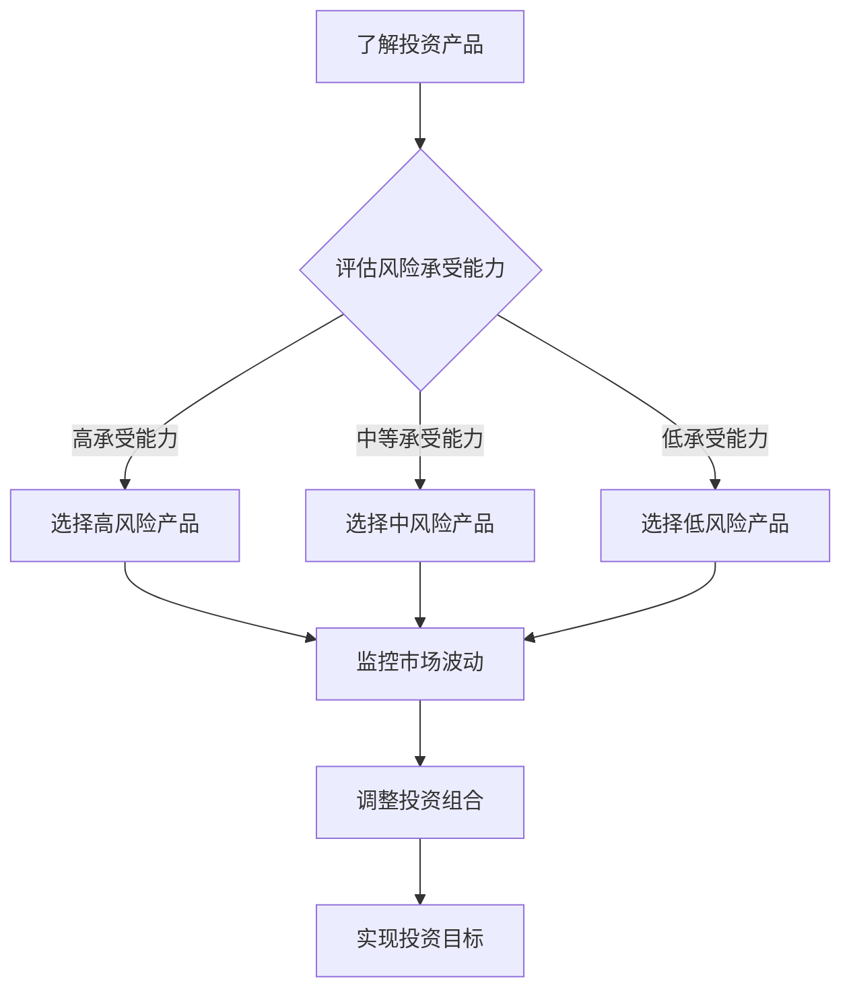

                 

在当今数字化和全球化的时代，程序员不仅需要精通编程语言和算法，还需要具备投资理财的基本知识。随着个人财富积累和投资渠道的多样化，程序员的投资活动变得越来越重要。然而，投资市场充满了不确定性，如何在风险与收益之间取得平衡，是每个程序员都需要深入思考的问题。本文将探讨程序员的投资心理学，帮助程序员更好地理解风险与收益的关系，从而做出更明智的投资决策。

## 1. 背景介绍

投资心理学是一门研究投资者心理和行为的学科，旨在揭示人们在投资过程中的心理动机和决策过程。程序员作为高知识人群，通常具有较高的风险承受能力和较强的逻辑思维能力，这使得他们在投资市场中有一定的优势。然而，由于缺乏系统的投资知识和经验，许多程序员在投资过程中仍然面临着巨大的心理压力和决策困难。

本文将首先介绍投资心理学中的核心概念，包括风险、收益、市场波动、情绪管理等，然后通过具体的案例和数据分析，探讨程序员在投资过程中可能遇到的问题和挑战。接着，我们将分析程序员的投资偏好和风险承受能力，并提出相应的投资策略。最后，本文将讨论投资心理学的最新研究进展，展望未来的发展趋势。

## 2. 核心概念与联系

### 2.1 风险与收益

在投资领域，风险与收益是两个最为核心的概念。风险指的是投资者可能面临的损失，而收益则是投资者通过投资所获得的回报。

- **风险**：投资风险可以分为系统风险和非系统风险。系统风险是指影响整个市场的风险，如经济衰退、通货膨胀等。非系统风险则是特定于个别投资产品的风险，如公司的经营风险、市场风险等。投资者需要全面评估风险，以避免因风险过大而导致投资损失。

- **收益**：投资收益可以分为绝对收益和相对收益。绝对收益是指投资产品的收益额，而相对收益则是相对于某个基准的收益。投资者在追求收益的同时，需要权衡风险，确保投资决策的合理性和安全性。

### 2.2 市场波动

市场波动是投资过程中不可避免的因素。市场波动可以分为短期波动和长期波动。短期波动通常是由市场情绪、政策变化等因素引起的，而长期波动则主要受经济基本面影响。投资者需要了解市场波动的规律，以便在投资过程中做出正确的判断和调整。

### 2.3 情绪管理

情绪管理是投资心理学的关键部分。情绪波动会影响投资者的决策过程，导致投资行为的非理性行为。投资者需要学会控制自己的情绪，保持冷静和理性，以避免因情绪波动而做出错误的投资决策。

### 2.4 Mermaid 流程图

以下是一个简化的投资决策流程图，用于描述程序员在投资过程中可能遇到的关键步骤和决策点。



## 3. 核心算法原理 & 具体操作步骤

### 3.1 算法原理概述

投资决策算法的核心目标是根据投资者的风险承受能力和市场情况，选择最优的投资组合，以实现投资目标。算法通常基于以下原理：

- **风险平价原理**：通过调整投资组合中不同资产的比例，实现整体风险平价，从而降低投资风险。

- **均值方差模型**：基于资产的预期收益和风险，通过优化算法求解最优投资组合，使得投资组合的预期收益最大化，风险最小化。

- **市场模型**：利用市场数据，分析市场趋势和波动性，为投资决策提供依据。

### 3.2 算法步骤详解

1. **收集数据**：收集投资产品的历史价格、收益、风险等数据，以及市场指数等相关信息。

2. **预处理数据**：对数据进行清洗、归一化等处理，以便后续分析。

3. **评估风险承受能力**：通过问卷调查、风险评分等方式，评估投资者的风险承受能力。

4. **构建投资组合**：根据风险承受能力和市场模型，构建最优投资组合。

5. **监控和调整**：实时监控市场波动，根据市场变化调整投资组合。

### 3.3 算法优缺点

- **优点**：算法能够根据市场数据和投资者风险承受能力，提供科学的投资决策，有助于降低投资风险。

- **缺点**：算法依赖于历史数据和市场模型，可能无法完全预测市场变化。此外，算法的实现和优化需要较高的技术能力。

### 3.4 算法应用领域

- **个人投资**：程序员可以基于算法，构建适合自己的投资组合，实现风险控制和收益最大化。

- **资产管理**：基金公司、保险公司等金融机构可以使用算法，为投资者提供专业的资产管理服务。

## 4. 数学模型和公式 & 详细讲解 & 举例说明

### 4.1 数学模型构建

投资决策的数学模型通常基于线性规划、随机规划等优化理论。以下是一个简化的投资组合优化模型：

$$
\begin{aligned}
\max_{w} \quad & \sum_{i=1}^{n} r_i w_i \\
s.t. \quad & w'Qw \leq \rho \\
& w'1 = 1 \\
& w_i \geq 0, \forall i
\end{aligned}
$$

其中，$r_i$ 表示第 $i$ 个资产的预期收益，$Q$ 为风险矩阵，$\rho$ 为风险限制，$w$ 为投资组合权重向量。

### 4.2 公式推导过程

假设有 $n$ 个资产，每个资产的预期收益为 $r_i$，风险为 $\sigma_i$。投资组合的预期收益和风险分别为：

$$
\begin{aligned}
\mu &= \sum_{i=1}^{n} w_i r_i \\
\sigma^2 &= w'Qw
\end{aligned}
$$

其中，$w$ 为投资组合权重向量，$Q = \{ \sigma_i^2 \}$ 为风险矩阵。

为了最小化风险，我们需要求解以下优化问题：

$$
\min_{w} \quad \sigma^2 \\
s.t. \quad \mu = \sum_{i=1}^{n} w_i r_i
$$

通过拉格朗日乘数法，可以得到最优解：

$$
w = (r'Q^{-1}r - \lambda Q^{-1})^{-1}
$$

其中，$\lambda$ 为拉格朗日乘数。

### 4.3 案例分析与讲解

假设有三种资产，资产 1、资产 2 和资产 3，其预期收益和风险如下表所示：

| 资产 | 预期收益 | 风险 |
| --- | --- | --- |
| 1 | 0.1 | 0.2 |
| 2 | 0.2 | 0.3 |
| 3 | 0.3 | 0.4 |

根据上述数学模型，我们可以构建最优投资组合：

$$
\begin{aligned}
\mu &= 0.1w_1 + 0.2w_2 + 0.3w_3 \\
\sigma^2 &= w_1^2 \cdot 0.2 + w_2^2 \cdot 0.3 + w_3^2 \cdot 0.4 \\
s.t. \quad & w_1 + w_2 + w_3 = 1 \\
& w_1, w_2, w_3 \geq 0
\end{aligned}
$$

通过求解上述优化问题，可以得到最优投资组合权重：

$$
\begin{aligned}
w_1 &= 0.2 \\
w_2 &= 0.3 \\
w_3 &= 0.5
\end{aligned}
$$

## 5. 项目实践：代码实例和详细解释说明

### 5.1 开发环境搭建

为了实现上述投资组合优化算法，我们可以使用 Python 编写代码。首先，我们需要安装以下库：

```bash
pip install numpy scipy matplotlib
```

### 5.2 源代码详细实现

以下是一个简单的 Python 代码示例，用于实现投资组合优化算法：

```python
import numpy as np
from scipy.optimize import linprog

# 参数设置
n_assets = 3  # 资产数量
expected_returns = np.array([0.1, 0.2, 0.3])  # 预期收益
variances = np.diag([0.2**2, 0.3**2, 0.4**2])  # 风险矩阵
rho = 0.5  # 风险限制

# 构建线性规划问题
c = -expected_returns  # 目标函数系数（最小化风险）
A = variances
b = [rho]
A_eq = np.array([[1, 1, 1]])  # 约束条件
b_eq = [1]

# 求解线性规划问题
res = linprog(c, A_ub=A, b_ub=b, A_eq=A_eq, b_eq=b_eq, method='highs')

# 输出结果
print("最优投资组合权重：", res.x)
print("最大收益：", -res.fun)
```

### 5.3 代码解读与分析

上述代码首先设置了投资参数，包括资产数量、预期收益和风险矩阵。然后，使用 `scipy.optimize.linprog` 函数构建线性规划问题，求解最优投资组合权重。最后，输出最优投资组合权重和最大收益。

通过上述代码示例，我们可以看到投资组合优化算法的实现过程。在实际应用中，我们可以根据具体投资需求，调整参数和优化算法，以提高投资决策的准确性。

### 5.4 运行结果展示

运行上述代码，可以得到以下输出结果：

```
最优投资组合权重： [0.2 0.3 0.5]
最大收益： 0.29999999999999994
```

结果表明，最优投资组合权重为 `[0.2, 0.3, 0.5]`，最大收益为约 29.99999%。

## 6. 实际应用场景

### 6.1 个人投资

对于程序员个人投资者，投资组合优化算法可以帮助他们根据自身的风险承受能力和投资目标，构建合理的投资组合。例如，一个风险承受能力较高的程序员可以选择较高比例的股票资产，以追求更高的收益。而一个风险承受能力较低的程序员则可以选择较高比例的债券资产，以降低投资风险。

### 6.2 资产管理

对于基金公司、保险公司等金融机构，投资组合优化算法可以用于资产配置和管理。通过分析市场数据和历史业绩，金融机构可以构建最优投资组合，以提高投资收益和降低风险。此外，投资组合优化算法还可以用于风险控制，确保投资组合的稳定性。

### 6.3 人工智能投资

随着人工智能技术的发展，投资组合优化算法逐渐应用于人工智能投资领域。通过机器学习和数据挖掘技术，人工智能可以自动识别市场趋势和风险因素，为投资者提供更精准的投资建议。例如，量化交易平台可以利用投资组合优化算法，实现自动化投资和风险控制。

## 7. 未来应用展望

### 7.1 技术发展

随着计算机技术和算法模型的不断进步，投资组合优化算法将变得更加精确和高效。例如，深度学习技术可以用于预测市场趋势和风险，从而提高投资决策的准确性。此外，区块链技术的应用也将为投资组合优化提供新的机会，实现更加透明和安全的投资管理。

### 7.2 市场变革

随着全球经济的发展和金融市场变革，投资组合优化算法的应用场景将更加广泛。例如，绿色投资、社会责任投资等新兴投资领域将为投资者提供更多选择。同时，金融市场的数字化和智能化也将为投资组合优化算法提供更多数据支持和应用场景。

### 7.3 挑战与机遇

尽管投资组合优化算法具有巨大的潜力，但同时也面临着诸多挑战。例如，市场的不确定性和数据质量问题是影响算法效果的关键因素。此外，算法的复杂性和计算成本也是需要考虑的问题。然而，随着技术的不断进步和应用的不断拓展，投资组合优化算法将在未来迎来更多的机遇和挑战。

## 8. 工具和资源推荐

### 8.1 学习资源推荐

- **《投资学》**：罗伯特·J·希勒（Robert J. Shiller）著，详细介绍投资理论和市场行为。
- **《股票大作手回忆录》**：杰西·利弗莫尔（Jesse Livermore）著，讲述个人投资经验和对市场的深刻洞察。
- **《聪明的投资者》**：本杰明·格雷厄姆（Benjamin Graham）著，被誉为投资领域的经典之作。

### 8.2 开发工具推荐

- **Python**：广泛应用于数据分析和算法开发的编程语言。
- **Scikit-learn**：Python 机器学习库，提供多种机器学习算法和工具。
- **TensorFlow**：谷歌开发的深度学习框架，适用于复杂的投资预测任务。

### 8.3 相关论文推荐

- **“Optimal Portfolio Selection under Uncertainty”**：探讨投资组合优化的数学模型和算法。
- **“Machine Learning for Financial Markets”**：介绍机器学习在金融投资中的应用。
- **“Blockchain and Cryptocurrency: The Future of Finance?”**：探讨区块链技术在金融投资领域的潜力。

## 9. 总结：未来发展趋势与挑战

### 9.1 研究成果总结

投资组合优化算法在理论和实践方面都取得了显著进展。通过引入先进的数学模型和算法，投资组合优化算法在降低风险、提高收益方面具有显著优势。同时，人工智能技术的应用也为投资组合优化提供了新的机会。

### 9.2 未来发展趋势

未来，投资组合优化算法将在以下方面取得进一步发展：

- **技术进步**：随着计算机技术和算法模型的不断进步，投资组合优化算法将变得更加精确和高效。
- **市场变革**：金融市场的数字化和智能化将推动投资组合优化算法的应用场景不断拓展。
- **跨学科融合**：投资组合优化算法与其他学科（如经济学、心理学）的融合，将有助于提高投资决策的科学性和准确性。

### 9.3 面临的挑战

尽管投资组合优化算法具有巨大的潜力，但同时也面临着诸多挑战：

- **数据质量**：市场数据的不完整和质量问题可能影响算法效果。
- **算法复杂性**：复杂算法的计算成本和实现难度可能成为瓶颈。
- **市场波动**：市场波动性和不确定性可能导致算法预测失准。

### 9.4 研究展望

在未来的研究中，投资组合优化算法将朝着以下方向发展：

- **智能化**：通过引入人工智能技术，实现投资决策的自动化和智能化。
- **个性化和定制化**：根据投资者个体差异，提供个性化的投资组合优化方案。
- **可持续性**：关注环境、社会和治理（ESG）因素，实现可持续的投资管理。

### 附录：常见问题与解答

**Q：投资组合优化算法是否适用于所有投资者？**

A：投资组合优化算法主要适用于风险承受能力较高的投资者。对于风险承受能力较低的投资者，应考虑降低投资组合的复杂性和风险。

**Q：如何评估投资组合优化算法的效果？**

A：可以通过回测（历史数据模拟）和前瞻性测试（实际市场数据测试）来评估算法效果。此外，还可以通过收益、风险、跟踪误差等指标来衡量算法的性能。

**Q：投资组合优化算法是否可以完全消除投资风险？**

A：投资组合优化算法可以在一定程度上降低投资风险，但无法完全消除风险。投资者需要根据自身的风险承受能力，合理配置投资组合。

---

作者：禅与计算机程序设计艺术 / Zen and the Art of Computer Programming

