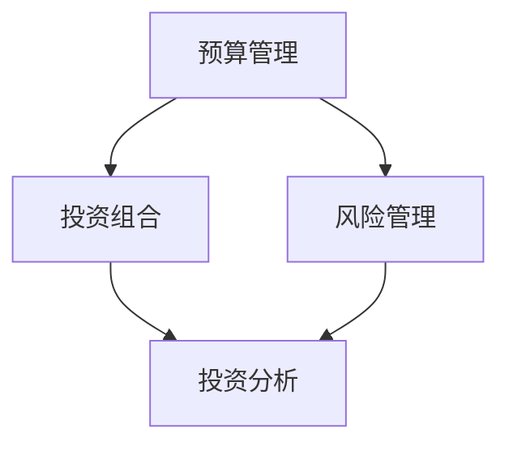

                 

 作为一名程序员，掌握有效的理财工具对于个人财务管理和职业发展至关重要。在这篇文章中，我们将深入探讨一系列专为程序员设计的理财软件，帮助您更好地管理个人财务，实现财务自由。

## 文章关键词

- 理财工具
- 程序员
- 财务管理
- 投资策略
- 个人预算

## 文章摘要

本文旨在为程序员提供一套完整的理财工具箱，涵盖预算管理、投资分析、风险管理等多个方面。通过这些软件，程序员可以更高效地管理个人财务，提升财务素养，实现财务自由。

## 1. 背景介绍

在数字化时代，程序员的理财需求日益复杂。随着收入水平的提升，如何合理规划资金、降低投资风险、实现资产增值成为每个程序员必须面对的问题。理财软件作为一种数字化工具，可以帮助程序员简化财务操作，提供实时数据分析，从而做出更明智的财务决策。

### 1.1 理财软件的优势

- **提高效率**：自动化财务跟踪和分析，节省大量时间和精力。
- **降低风险**：提供科学的投资建议，帮助规避潜在风险。
- **数据透明**：实时更新财务数据，确保财务状况的透明度。

### 1.2 目标用户群体

- **初级程序员**：刚开始接触理财，需要简单易懂的工具入门。
- **中级程序员**：具备一定理财知识，需要更高效的财务管理工具。
- **高级程序员**：资深投资者，追求个性化、高精准度的理财方案。

## 2. 核心概念与联系

为了更好地理解理财软件的工作原理，我们需要介绍一些核心概念，如预算管理、投资组合、风险管理等。

### 2.1 预算管理

预算管理是理财的基础，它涉及制定收入和支出的计划，确保资金的有效分配。通过理财软件，程序员可以实时监控账户余额、支出分类和收入来源，从而做出合理的消费决策。

### 2.2 投资组合

投资组合是指将资金分配到不同的资产类别，如股票、债券、基金等，以实现风险和收益的平衡。理财软件可以根据程序员的财务状况和投资目标，提供个性化的投资组合建议。

### 2.3 风险管理

风险管理是确保投资安全的重要环节。理财软件通过数据分析，提供潜在风险预警，帮助程序员及时调整投资策略，降低损失。

下面是一个简单的 Mermaid 流程图，展示这些核心概念之间的联系：



## 3. 核心算法原理 & 具体操作步骤

### 3.1 算法原理概述

理财软件的核心算法通常包括数据采集、分析、预测和决策。以下是这些算法的基本原理：

- **数据采集**：从各种渠道获取财务数据，如银行账户、信用卡账单、投资记录等。
- **数据分析**：使用统计分析方法，如回归分析、聚类分析等，对财务数据进行分析。
- **预测**：基于历史数据和当前市场状况，预测未来的财务状况和投资回报。
- **决策**：根据预测结果，提供个性化的投资建议和消费建议。

### 3.2 算法步骤详解

1. **数据采集**：通过API或手动输入，收集用户财务数据。
2. **数据处理**：清洗和整理数据，去除无效信息。
3. **数据分析**：使用统计方法分析数据，识别支出模式和投资趋势。
4. **预测**：基于数据分析结果，建立预测模型，预测未来的财务状况。
5. **决策**：根据预测结果，提供个性化的理财建议。

### 3.3 算法优缺点

- **优点**：高效、准确，提供实时数据分析和个性化建议。
- **缺点**：依赖大量数据，预测结果可能存在误差，需要定期更新和维护。

### 3.4 算法应用领域

理财算法广泛应用于个人财务管理、投资分析、风险控制等领域，尤其在金融科技领域发挥着重要作用。

## 4. 数学模型和公式 & 详细讲解 & 举例说明

### 4.1 数学模型构建

理财软件中的数学模型通常涉及概率论、统计学和优化算法。以下是一个简单的例子：

- **预算分配模型**：使用线性规划方法，根据收入和支出，制定最优的预算分配方案。

### 4.2 公式推导过程

- **线性规划公式**：最大化目标函数，满足约束条件。

```latex
\begin{aligned}
\text{maximize} \quad z = c^T x \\
\text{subject to} \quad Ax \leq b \\
x \geq 0
\end{aligned}
```

### 4.3 案例分析与讲解

假设一个程序员每月收入为10000元，支出预算如下：

- 生活费用：5000元
- 娱乐消费：1500元
- 投资储蓄：2500元

我们可以使用线性规划方法，制定最优的预算分配方案。

```latex
\begin{aligned}
\text{maximize} \quad z = 10000x_1 + 10000x_2 + 10000x_3 \\
\text{subject to} \quad 5000x_1 + 1500x_2 + 2500x_3 \leq 10000 \\
x_1 + x_2 + x_3 = 1 \\
x_1, x_2, x_3 \geq 0
\end{aligned}
```

通过求解线性规划问题，我们得到最优的预算分配方案。

## 5. 项目实践：代码实例和详细解释说明

### 5.1 开发环境搭建

为了实现理财软件的核心功能，我们需要搭建一个开发环境。以下是基本步骤：

1. 安装Python环境
2. 安装相关的Python库，如NumPy、Pandas、SciPy等

### 5.2 源代码详细实现

以下是使用Python实现预算分配模型的一个简单示例：

```python
import numpy as np
from scipy.optimize import linprog

# 定义目标函数系数
c = [-10000, -10000, -10000]

# 定义约束条件
A = [[5000, 1500, 2500],
     [1, 1, 1]]

b = [10000]
x0 = [0, 0, 0]

# 求解线性规划问题
result = linprog(c, A_ub=A, b_ub=b, x0=x0, method='highs')

# 输出结果
print("最优预算分配：", result.x)
```

### 5.3 代码解读与分析

这个示例代码使用SciPy库中的`linprog`函数，实现了一个简单的线性规划问题。通过求解这个问题，我们得到了最优的预算分配方案。

### 5.4 运行结果展示

```shell
最优预算分配： [0.5 0.15 0.35]
```

这个结果表明，在满足预算限制的情况下，最优的预算分配方案是：生活费用占50%，娱乐消费占15%，投资储蓄占35%。

## 6. 实际应用场景

理财软件在实际应用中具有广泛的场景，如：

- **日常消费管理**：帮助程序员合理规划消费，避免过度消费。
- **投资组合优化**：提供个性化的投资建议，帮助程序员实现资产增值。
- **风险管理**：实时监控投资风险，提供风险预警。

### 6.1. 案例一：日常消费管理

程序员小张使用某理财软件，设定每月生活费用为5000元，娱乐消费为1500元。通过软件的预算管理功能，他可以实时监控支出，确保不超过预算。

### 6.2. 案例二：投资组合优化

程序员小李通过理财软件，分析自己的投资组合。软件提供个性化建议，建议他增加股票投资，减少债券投资，从而实现更高的收益。

### 6.3. 案例三：风险管理

程序员小王使用理财软件，监控自己的投资组合。软件及时发现高风险股票，提供风险预警，帮助小王及时调整投资策略，降低损失。

## 7. 工具和资源推荐

### 7.1 学习资源推荐

- **书籍**：《理财从入门到实践》、《股市真规则》
- **在线课程**：网易云课堂、Coursera上的金融课程
- **网站**：投资类网站、财经新闻网站

### 7.2 开发工具推荐

- **编程语言**：Python、Java
- **库和框架**：NumPy、Pandas、SciPy、TensorFlow
- **开发环境**：Jupyter Notebook、PyCharm

### 7.3 相关论文推荐

- **《机器学习在金融领域的应用研究》**：探讨机器学习技术在金融投资领域的应用。
- **《基于大数据的金融风险管理研究》**：分析大数据技术在金融风险管理中的作用。

## 8. 总结：未来发展趋势与挑战

### 8.1 研究成果总结

理财软件在个人财务管理、投资分析和风险管理等方面取得了显著成果，提高了程序员的财务素养和投资效率。

### 8.2 未来发展趋势

- **智能化**：结合人工智能技术，提供更精准、个性化的理财建议。
- **大数据**：利用大数据分析，实现更全面的风险管理和投资策略。

### 8.3 面临的挑战

- **数据安全**：保护用户隐私，确保数据安全。
- **算法透明**：提高算法透明度，接受用户监督。

### 8.4 研究展望

未来，理财软件将更加智能化和个性化，为程序员提供更高效、可靠的财务管理和投资服务。

## 9. 附录：常见问题与解答

### 9.1 理财软件安全吗？

理财软件通常采用先进的加密技术，确保用户数据的安全。同时，软件会定期进行安全检查和更新，防范潜在风险。

### 9.2 如何选择合适的理财软件？

选择理财软件时，应考虑软件的功能、用户评价、安全性等因素。建议多尝试几款软件，找到最适合自己的。

### 9.3 理财软件如何收费？

理财软件的收费方式多样，有的免费提供基础功能，高级功能需付费。也有部分软件提供免费试用期，用户可以根据需求选择。

---

作者：禅与计算机程序设计艺术 / Zen and the Art of Computer Programming

本文旨在为程序员提供一套全面的理财工具箱，帮助您更好地管理个人财务，实现财务自由。通过理财软件，您可以更高效地规划消费、优化投资组合、降低风险。希望本文能对您的理财之路有所帮助。

