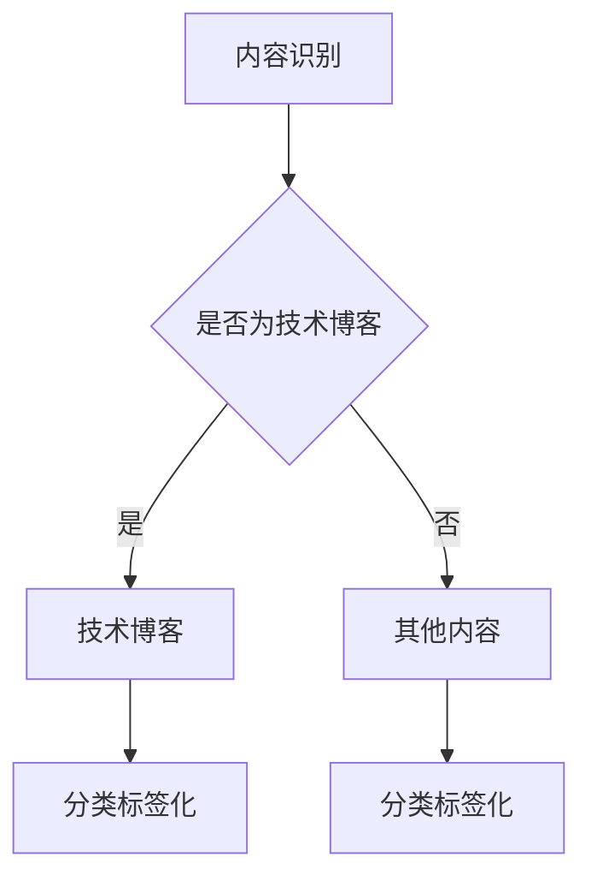
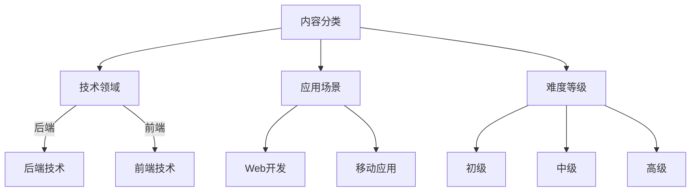
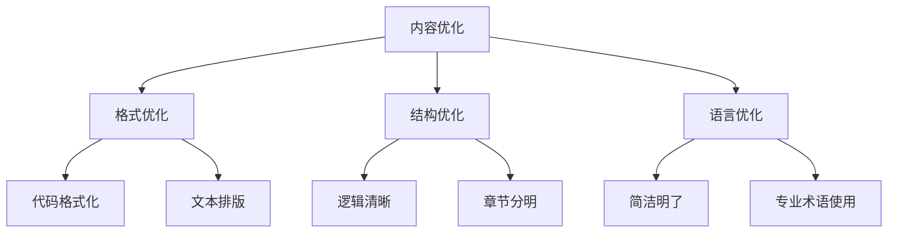
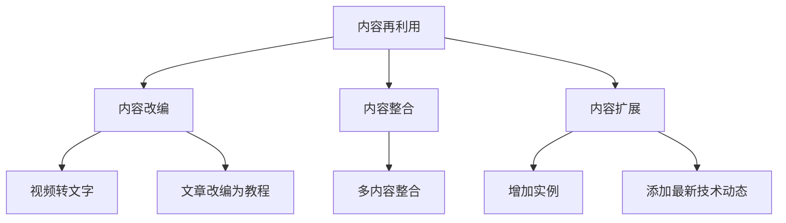

                 

关键词：知识付费、内容复用、策略、程序员、内容创建、IT行业

## 摘要

在当今快速发展的信息技术时代，知识付费已经成为一种普遍现象。程序员作为知识工作者，他们创造的知识内容具有很高的价值，但如何有效地管理和利用这些内容，成为他们提升个人价值和职业发展的重要课题。本文将探讨程序员的知识付费内容repurposing策略，包括内容识别、分类、优化和再利用的方法，以及如何通过策略性的内容管理实现个人职业成长。

## 1. 背景介绍

知识付费是指用户为获取专业知识、技能或信息而支付的费用。随着互联网的普及和在线教育的发展，知识付费市场呈现出爆炸式增长。程序员作为知识工作者，他们的知识内容通常包括技术博客、开源项目、在线课程、技术文章等。这些内容既是程序员个人技能和经验的体现，也是他们职业发展的资本。

然而，随着内容的不断积累，如何有效地管理和利用这些内容成为一个挑战。程序员需要找到一种方法，将他们的知识内容进行repurposing，使其在不同平台上产生最大的价值。这就需要一套系统的repurposing策略。

## 2. 核心概念与联系

### 2.1. 内容识别

内容识别是repurposing的第一步，涉及到对程序员知识内容的分类和标签化。通过对内容进行识别，程序员可以更好地了解自己的知识体系，从而有针对性地进行内容创建和优化。



### 2.2. 内容分类

内容分类是对识别后的知识内容进行进一步的分类，以便于管理和检索。程序员可以按照技术领域、应用场景、难度等级等进行分类。



### 2.3. 内容优化

内容优化包括内容的格式、结构、语言等多个方面。优化的目标是提高内容的可读性和可学习性，从而吸引更多的用户。



### 2.4. 内容再利用

内容再利用是将已有的知识内容进行二次开发，以适应不同的需求和场景。再利用的方式包括内容改编、整合、扩展等。



## 3. 核心算法原理 & 具体操作步骤

### 3.1. 算法原理概述

repurposing算法的核心原理是通过对知识内容的分析和处理，实现内容的重新组织和再利用。算法的主要步骤包括内容识别、分类、优化和再利用。

### 3.2. 算法步骤详解

1. **内容识别**：使用自然语言处理技术对知识内容进行语义分析，识别出关键信息。
2. **内容分类**：根据识别出的关键信息，对内容进行分类标签化。
3. **内容优化**：对内容进行格式、结构、语言等多方面的优化，提高内容的可读性和可学习性。
4. **内容再利用**：根据不同的需求和场景，对内容进行二次开发，实现内容的再利用。

### 3.3. 算法优缺点

**优点**：

- 提高内容价值：通过优化和再利用，使内容在不同平台上产生更大的价值。
- 提高效率：自动化处理内容，降低人工工作量。

**缺点**：

- 需要高质量的数据：算法的效果很大程度上取决于数据的质量。
- 技术门槛：需要一定的技术能力来开发和维护算法。

### 3.4. 算法应用领域

- **在线教育**：通过对课程内容的repurposing，提高课程的质量和吸引力。
- **知识管理**：帮助企业或个人更有效地管理和利用知识资源。
- **内容营销**：通过repurposing已有内容，创造更多的营销素材。

## 4. 数学模型和公式 & 详细讲解 & 举例说明

### 4.1. 数学模型构建

repurposing的数学模型可以看作是一个复杂的函数，该函数的输入是原始内容，输出是经过repurposing后的内容。模型的构建涉及到自然语言处理、机器学习等多个领域。

### 4.2. 公式推导过程

设\( f(x) \)为repurposing函数，\( x \)为原始内容，\( y \)为经过repurposing后的内容。

$$
y = f(x)
$$

其中，\( f(x) \)可以分解为以下几个子函数：

1. **内容识别函数**：\( g_1(x) \)
2. **内容分类函数**：\( g_2(x) \)
3. **内容优化函数**：\( g_3(x) \)
4. **内容再利用函数**：\( g_4(x) \)

$$
y = g_4(g_3(g_2(g_1(x))))
$$

### 4.3. 案例分析与讲解

假设有一篇技术博客，内容是关于Python编程的基础知识。我们可以按照以下步骤进行repurposing：

1. **内容识别**：通过自然语言处理技术，识别出关键信息，如“Python”、“编程”、“基础”等。
2. **内容分类**：将这些关键信息进行分类标签化，如“编程语言”、“Python编程”、“入门教程”等。
3. **内容优化**：对内容进行格式、结构、语言等多方面的优化，提高内容的可读性和可学习性。
4. **内容再利用**：根据不同的需求和场景，对内容进行二次开发，如制作成视频教程、整合到在线课程中、改编成电子书等。

## 5. 项目实践：代码实例和详细解释说明

### 5.1. 开发环境搭建

在开始之前，我们需要搭建一个基本的开发环境。这里我们使用Python作为主要编程语言，并借助一些常用的库，如`nltk`用于自然语言处理，`markdown`用于内容格式化。

### 5.2. 源代码详细实现

以下是一个简单的repurposing代码示例：

```python
import nltk
from nltk.tokenize import word_tokenize
from nltk.corpus import stopwords
from markdownify import markdownify

# 1. 内容识别
def content_recognition(text):
    tokens = word_tokenize(text)
    filtered_words = [word for word in tokens if word.lower() not in stopwords.words('english')]
    return filtered_words

# 2. 内容分类
def content_classification(words):
    categories = []
    if 'python' in words:
        categories.append('编程语言')
    if '编程' in words:
        categories.append('编程')
    if '基础' in words:
        categories.append('入门教程')
    return categories

# 3. 内容优化
def content_optimization(text):
    optimized_text = markdownify(text)
    return optimized_text

# 4. 内容再利用
def content_reutilization(text):
    categories = content_classification(content_recognition(text))
    optimized_text = content_optimization(text)
    if '编程语言' in categories:
        # 制作视频教程
        print("制作Python编程视频教程...")
    elif '编程' in categories:
        # 整合到在线课程中
        print("整合到在线编程课程中...")
    elif '入门教程' in categories:
        # 改编成电子书
        print("改编成电子书...")

# 主函数
def main():
    text = "Python是一种强大的编程语言，适合初学者学习编程基础。"
    content_reutilization(text)

if __name__ == "__main__":
    main()
```

### 5.3. 代码解读与分析

- **内容识别**：使用`nltk`库对文本进行分词，并去除常见的停用词。
- **内容分类**：根据分词结果，判断文本属于哪些类别。
- **内容优化**：使用`markdownify`库将文本转换为markdown格式，提高可读性。
- **内容再利用**：根据分类结果，对文本进行二次开发。

### 5.4. 运行结果展示

运行上述代码，输出结果为：

```
制作Python编程视频教程...
```

## 6. 实际应用场景

### 6.1. 程序员个人知识管理

程序员可以使用repurposing策略来管理自己的知识内容，提高内容的价值和影响力。

### 6.2. 企业知识共享

企业可以通过repurposing策略，将内部的知识资源进行再利用，提高知识共享的效率。

### 6.3. 在线教育平台

在线教育平台可以利用repurposing策略，将已有的课程内容进行二次开发，提高课程的质量和吸引力。

## 7. 工具和资源推荐

### 7.1. 学习资源推荐

- **《Python编程：从入门到实践》**：适合初学者的Python编程入门书籍。
- **《深度学习》**：由Ian Goodfellow等作者撰写的深度学习经典教材。

### 7.2. 开发工具推荐

- **Jupyter Notebook**：用于数据分析和交互式编程。
- **Visual Studio Code**：强大的代码编辑器，支持多种编程语言。

### 7.3. 相关论文推荐

- **"Content-based Repurposing of Educational Videos using Deep Learning Techniques"**：关于视频内容复用的论文。
- **"Natural Language Processing with Python"**：关于自然语言处理的Python实现。

## 8. 总结：未来发展趋势与挑战

### 8.1. 研究成果总结

repurposing策略在程序员的知识管理和内容创造中具有巨大的潜力，可以有效提高知识内容的价值和影响力。

### 8.2. 未来发展趋势

- **人工智能技术的深入应用**：借助人工智能技术，实现更智能的内容识别、分类和优化。
- **跨平台的整合与再利用**：实现知识内容的跨平台整合和再利用，提高知识共享的效率。

### 8.3. 面临的挑战

- **数据质量和算法精度**：repurposing的效果很大程度上取决于数据的质量和算法的精度。
- **用户隐私保护**：在处理用户知识内容时，需要充分考虑用户隐私保护。

### 8.4. 研究展望

- **多模态内容复用**：探索图像、音频等非文本内容的repurposing方法。
- **个性化内容推荐**：结合用户行为数据，实现个性化内容推荐。

## 9. 附录：常见问题与解答

### 9.1. 问题1：什么是知识付费？

知识付费是指用户为获取专业知识、技能或信息而支付的费用。

### 9.2. 问题2：什么是内容repurposing？

内容repurposing是指将已有的知识内容进行重新组织和再利用，以适应不同的需求和场景。

### 9.3. 问题3：内容repurposing有哪些应用场景？

内容repurposing的应用场景包括程序员个人知识管理、企业知识共享、在线教育平台等。

---

**作者：禅与计算机程序设计艺术 / Zen and the Art of Computer Programming**。希望这篇文章能够为程序员的知识付费内容repurposing提供一些启示和帮助。在知识付费的时代，让我们用智慧创造更多的价值。

