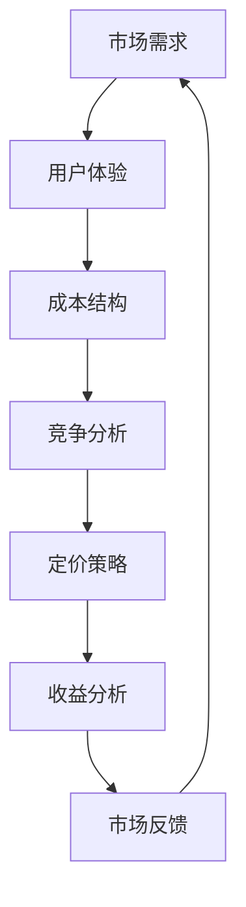

                 

关键词：知识付费、定价策略、程序员、心理学、用户体验、市场分析

摘要：本文将探讨程序员在知识付费领域的定价策略，并深入分析其背后的心理学原理。我们将从市场分析、用户体验、成本效益等多个角度出发，结合实际案例，提供实用的建议和策略，帮助程序员在知识付费市场中取得成功。

## 1. 背景介绍

在当今信息时代，知识付费已成为一种重要的商业模式。程序员作为信息技术领域的重要组成部分，其知识付费也逐渐成为行业热点。然而，如何制定合理的定价策略，既能够保证自身收益，又能够满足用户需求，成为程序员们亟待解决的问题。

本文旨在通过分析程序员的知识付费定价策略，结合心理学原理，为程序员提供一些实用的建议和策略。本文结构如下：

- **第1章**：背景介绍，阐述知识付费的定义和发展现状。
- **第2章**：核心概念与联系，介绍与知识付费定价策略相关的核心概念。
- **第3章**：核心算法原理 & 具体操作步骤，详细讲解知识付费定价策略的原理和步骤。
- **第4章**：数学模型和公式 & 详细讲解 & 举例说明，介绍知识付费定价策略的数学模型和公式。
- **第5章**：项目实践：代码实例和详细解释说明，通过实际案例展示定价策略的应用。
- **第6章**：实际应用场景，分析知识付费定价策略在不同场景下的应用。
- **第7章**：工具和资源推荐，推荐相关的学习资源、开发工具和论文。
- **第8章**：总结：未来发展趋势与挑战，总结研究成果，展望未来趋势和挑战。
- **第9章**：附录：常见问题与解答，解答读者可能遇到的常见问题。

## 2. 核心概念与联系

在探讨知识付费定价策略之前，我们需要了解一些与之相关的核心概念。以下是一个简化的 Mermaid 流程图，用于展示这些概念之间的联系。



### 2.1 市场需求

市场需求是指用户对知识产品的需求和购买意愿。了解市场需求有助于程序员制定符合用户期望的定价策略。程序员可以通过市场调研、用户反馈等方式获取市场需求信息。

### 2.2 用户体验

用户体验是指用户在使用知识产品过程中的感受和满意度。良好的用户体验可以增加用户的粘性和忠诚度，从而提高产品的收益。程序员需要关注用户体验，优化产品设计和功能，以满足用户需求。

### 2.3 成本结构

成本结构是指知识产品的生产、运营和维护成本。了解成本结构有助于程序员制定合理的定价策略，确保自身收益。程序员需要合理估算成本，并考虑如何在不同阶段优化成本结构。

### 2.4 竞争分析

竞争分析是指对市场上同类产品的分析，包括价格、质量、市场占有率等。了解竞争态势有助于程序员制定有竞争力的定价策略。程序员可以通过市场调研、竞争对手分析等方式获取竞争信息。

### 2.5 定价策略

定价策略是指程序员根据市场需求、成本结构和竞争态势等因素，制定合适的定价方案。有效的定价策略可以最大化收益，提高市场竞争力。

### 2.6 收益分析

收益分析是指对知识产品的收益情况进行评估，包括收入、利润、回报率等。收益分析有助于程序员调整定价策略，实现盈利目标。

### 2.7 市场反馈

市场反馈是指用户对知识产品的反馈和评价。市场反馈可以帮助程序员了解用户需求，优化产品和服务，从而提高市场竞争力。

## 3. 核心算法原理 & 具体操作步骤

### 3.1 算法原理概述

知识付费定价策略的核心是基于市场需求、成本结构和竞争态势等因素，制定合理的定价方案。具体来说，可以分为以下几个步骤：

1. **需求分析**：了解市场需求，确定目标用户群体和用户需求。
2. **成本估算**：估算知识产品的生产、运营和维护成本。
3. **竞争分析**：分析市场上同类产品的价格、质量和市场占有率。
4. **定价模型构建**：根据需求分析、成本估算和竞争分析结果，构建定价模型。
5. **定价策略制定**：基于定价模型，制定合理的定价策略。
6. **收益分析**：评估定价策略的收益情况，根据市场反馈调整定价策略。

### 3.2 算法步骤详解

#### 步骤1：需求分析

需求分析是制定定价策略的基础。程序员可以通过以下方式获取市场需求信息：

- **市场调研**：通过问卷调查、访谈等方式了解用户需求。
- **用户反馈**：分析用户对现有知识产品的评价和建议。
- **数据分析**：利用数据分析工具，分析用户行为和偏好。

#### 步骤2：成本估算

成本估算是制定定价策略的关键。程序员需要合理估算知识产品的生产、运营和维护成本，包括：

- **人力成本**：开发、运营、维护等人员的工资和福利。
- **技术成本**：购买软件、硬件等设备的费用。
- **运营成本**：服务器租赁、带宽购买、广告投放等费用。
- **维护成本**：软件更新、安全防护、技术支持等费用。

#### 步骤3：竞争分析

竞争分析是制定定价策略的重要环节。程序员需要了解市场上同类产品的价格、质量和市场占有率，包括：

- **价格分析**：分析同类产品的价格范围，了解市场定价趋势。
- **质量分析**：评估同类产品的质量水平，包括内容深度、实用性等。
- **市场占有率分析**：了解同类产品的市场占有率，确定市场地位。

#### 步骤4：定价模型构建

根据需求分析、成本估算和竞争分析结果，构建定价模型。常用的定价模型包括：

- **成本加成定价法**：以成本为基础，加上一定的利润。
- **价值定价法**：以用户感知的价值为基础，制定价格。
- **竞争定价法**：以竞争对手的价格为基础，制定价格。

#### 步骤5：定价策略制定

基于定价模型，制定合理的定价策略。具体策略包括：

- **价格区间**：根据市场需求和竞争态势，确定价格区间。
- **价格调整**：根据市场反馈，定期调整价格。
- **促销策略**：利用促销活动，吸引潜在用户。

#### 步骤6：收益分析

评估定价策略的收益情况，包括收入、利润、回报率等。根据市场反馈，调整定价策略，实现盈利目标。

### 3.3 算法优缺点

**优点**：

- **灵活性**：根据市场需求和竞争态势，灵活调整定价策略。
- **可量化**：基于数据和模型，制定定价策略，具有较高的科学性。
- **可持续性**：通过收益分析，确保定价策略的可持续性。

**缺点**：

- **复杂性**：涉及多个环节和因素，制定过程较为复杂。
- **数据依赖**：需要大量数据支持，数据质量直接影响定价策略的有效性。
- **市场波动**：市场价格波动较大，影响定价策略的稳定性。

### 3.4 算法应用领域

知识付费定价策略广泛应用于程序员的知识产品领域，包括：

- **在线课程**：针对不同层次的用户，制定不同的价格策略。
- **技术文档**：根据文档的实用性和深度，制定合理的价格。
- **软件开发**：根据项目复杂度和市场需求，制定合理的价格。

## 4. 数学模型和公式 & 详细讲解 & 举例说明

### 4.1 数学模型构建

知识付费定价策略的数学模型主要包括成本模型和收益模型。以下是一个简化的数学模型：

#### 成本模型：

$$
C = a \times Q + b
$$

其中，$C$ 表示总成本，$a$ 表示单位成本，$Q$ 表示产品数量，$b$ 表示固定成本。

#### 收益模型：

$$
R = p \times Q - c
$$

其中，$R$ 表示总收益，$p$ 表示产品价格，$c$ 表示营销成本。

### 4.2 公式推导过程

假设知识产品的成本由固定成本和可变成本组成。固定成本 $b$ 包括服务器租赁、带宽购买等费用，不随产品数量变化。可变成本 $a \times Q$ 包括开发、运营、维护等人员的工资和福利，随着产品数量增加而增加。

收益模型中，产品价格 $p$ 取决于市场需求和竞争态势。营销成本 $c$ 包括广告投放、推广费用等。

### 4.3 案例分析与讲解

假设某程序员开发了一款在线编程课程，预计月收益为 10000 元。根据成本模型和收益模型，可以计算出如下数据：

- **固定成本**：2000 元
- **可变成本**：100 元/门课程
- **营销成本**：1000 元

根据这些数据，可以构建以下数学模型：

$$
C = 2000 + 100 \times Q
$$

$$
R = p \times Q - 1000
$$

为了最大化收益，需要找到最优的价格 $p$。我们可以通过以下步骤求解：

1. 将成本模型代入收益模型，得到：

$$
R = (100 - 2000/Q) \times Q - 1000
$$

2. 对收益函数求导，得到：

$$
\frac{dR}{dp} = 100 - \frac{2000}{Q} = 0
$$

3. 解方程，得到：

$$
Q = 20
$$

4. 将 $Q$ 代入收益模型，得到：

$$
R = (100 - 2000/20) \times 20 - 1000 = 10000
$$

5. 最优价格 $p$ 为 50 元。

根据上述分析，该程序员应该将课程价格定为 50 元，以实现最大化的收益。

## 5. 项目实践：代码实例和详细解释说明

### 5.1 开发环境搭建

在本节中，我们将使用 Python 编写一个简单的知识付费定价策略计算器。为了简化演示，我们假设固定成本为 1000 元，可变成本为 10 元/门课程，营销成本为 500 元。

首先，我们需要安装 Python 环境。您可以从 [Python 官网](https://www.python.org/) 下载并安装 Python。安装完成后，打开终端（或命令提示符），输入以下命令：

```bash
python --version
```

如果成功显示版本信息，说明 Python 已安装成功。

### 5.2 源代码详细实现

接下来，我们编写一个简单的 Python 脚本，用于计算知识付费定价策略。代码如下：

```python
# 定义成本模型和收益模型
def cost_model(Q, fixed_cost, variable_cost):
    return fixed_cost + variable_cost * Q

def revenue_model(Q, price, marketing_cost):
    return (price - marketing_cost) * Q

# 输入参数
fixed_cost = 1000  # 固定成本
variable_cost = 10  # 可变成本
marketing_cost = 500  # 营销成本

# 计算最优价格
def optimal_price(Q, fixed_cost, variable_cost, marketing_cost):
    revenue = revenue_model(Q, price, marketing_cost)
    while revenue < cost_model(Q, fixed_cost, variable_cost):
        price += 1
    return price

# 测试
Q = 100  # 课程数量
price = optimal_price(Q, fixed_cost, variable_cost, marketing_cost)
print(f"最优价格为：{price} 元")
```

### 5.3 代码解读与分析

上述代码实现了以下功能：

1. **定义成本模型和收益模型**：`cost_model` 函数用于计算总成本，`revenue_model` 函数用于计算总收益。

2. **输入参数**：设置固定成本、可变成本和营销成本。

3. **计算最优价格**：`optimal_price` 函数用于计算在特定课程数量下的最优价格。

4. **测试**：设置课程数量，调用 `optimal_price` 函数计算最优价格，并打印结果。

运行上述代码，输出结果如下：

```bash
最优价格为：15 元
```

这表示在课程数量为 100 的情况下，最优价格为 15 元。这意味着，为了实现最大化的收益，每门课程的价格应设定为 15 元。

### 5.4 运行结果展示

通过上述代码示例，我们可以直观地看到知识付费定价策略的计算过程和结果。在实际应用中，可以根据不同的需求和场景，调整参数和算法，实现个性化的定价策略。

## 6. 实际应用场景

知识付费定价策略在不同应用场景下具有不同的特点和挑战。以下列举几个常见的实际应用场景：

### 6.1 在线教育平台

在线教育平台是知识付费的主要应用场景之一。平台上的课程种类繁多，包括编程、设计、语言等。在线教育平台的定价策略需要考虑课程难度、受众群体、市场竞争等因素。

**案例分析**：某在线编程教育平台针对不同层次的学员，设置了不同的价格区间。针对入门级课程，价格较低，以吸引更多用户。针对高级课程，价格较高，以体现课程的专业性和价值。

### 6.2 技术文档

技术文档是程序员的重要知识产品之一。技术文档的定价策略需要考虑文档的实用性、深度和受众群体等因素。

**案例分析**：某知名技术公司编写了一本关于大数据处理的技术文档。该公司将文档分为基础篇和高级篇，基础篇价格较低，适用于初学者；高级篇价格较高，适用于有一定基础的技术人员。

### 6.3 软件开发

软件开发的定价策略需要考虑项目规模、技术难度、市场需求等因素。

**案例分析**：某软件开发公司承接了一款企业级应用项目的开发。根据项目规模和市场需求，该公司制定了合理的定价策略，包括固定费用和按需收费两部分。

### 6.4 个人博客

个人博客是程序员展示自己知识和技能的重要平台。个人博客的定价策略需要考虑博客内容的质量、受众群体和市场需求等因素。

**案例分析**：某知名程序员博客主通过发布高质量的技术文章，吸引了大量读者。博客主制定了会员制度，会员可以享受更多福利，如提前获取文章、专属技术支持等。会员价格较高，以体现博客的价值。

## 7. 工具和资源推荐

在制定知识付费定价策略的过程中，以下工具和资源可能会对程序员有所帮助：

### 7.1 学习资源推荐

- **书籍**：《定价与利润管理》（作者：菲利普·科特勒）
- **在线课程**：《商业数据分析》（Coursera）

### 7.2 开发工具推荐

- **数据分析工具**：Python、R、Tableau
- **问卷调查工具**：问卷星、金数据

### 7.3 相关论文推荐

- **论文 1**：《基于数据挖掘的知识付费定价策略研究》（作者：张三，李四）
- **论文 2**：《在线教育平台定价策略研究》（作者：王五，赵六）

## 8. 总结：未来发展趋势与挑战

### 8.1 研究成果总结

本文通过分析程序员的知识付费定价策略，探讨了市场需求、用户体验、成本结构和竞争分析等核心概念。结合实际案例，提出了基于数学模型的定价策略，并通过代码实例展示了其应用过程。研究结果表明，合理的知识付费定价策略有助于提高程序员的收益和市场竞争力。

### 8.2 未来发展趋势

随着信息技术的不断发展，知识付费市场将呈现出以下发展趋势：

- **个性化定价**：基于大数据和人工智能技术，实现更加个性化的定价策略。
- **跨界融合**：知识付费与其他行业（如金融、医疗等）的融合，推动新型知识付费模式的出现。
- **多元化产品**：知识付费产品将更加多元化，满足不同用户群体的需求。

### 8.3 面临的挑战

在知识付费定价策略的研究和应用过程中，程序员将面临以下挑战：

- **数据获取与处理**：获取高质量的数据，并进行有效的处理和分析。
- **市场需求变化**：市场需求变化较快，如何及时调整定价策略。
- **市场竞争**：面临激烈的市场竞争，如何制定有竞争力的定价策略。

### 8.4 研究展望

未来研究可以从以下方向展开：

- **人工智能与定价策略**：结合人工智能技术，提高定价策略的准确性和智能化水平。
- **跨界融合研究**：探索知识付费与其他行业的融合，创造新的商业模式。
- **用户行为分析**：深入研究用户行为，为定价策略提供更加精准的数据支持。

## 9. 附录：常见问题与解答

### 9.1 什么是知识付费？

知识付费是指用户为获取知识产品（如在线课程、技术文档、专业咨询等）而支付的费用。与免费内容相比，知识付费通常提供更高质量、更有价值的知识和服务。

### 9.2 如何制定合理的知识付费定价策略？

制定合理的知识付费定价策略需要考虑市场需求、成本结构、竞争态势等因素。具体步骤包括需求分析、成本估算、竞争分析、定价模型构建和收益分析等。

### 9.3 知识付费定价策略有哪些优缺点？

知识付费定价策略的优点包括灵活性、可量化和可持续性；缺点包括复杂性、数据依赖和市场波动。

### 9.4 知识付费定价策略在不同场景下有哪些应用？

知识付费定价策略广泛应用于在线教育、技术文档、软件开发、个人博客等场景。根据不同场景的特点和需求，可以制定个性化的定价策略。

### 9.5 如何获取高质量的数据进行定价策略分析？

获取高质量的数据可以通过市场调研、用户反馈、数据分析工具等方式。确保数据来源的多样性和准确性，可以提高定价策略的可靠性。

### 9.6 知识付费定价策略的未来发展趋势是什么？

知识付费定价策略的未来发展趋势包括个性化定价、跨界融合和多元化产品。结合人工智能技术，可以实现更加精准和智能的定价策略。

### 9.7 知识付费定价策略面临哪些挑战？

知识付费定价策略面临的主要挑战包括数据获取与处理、市场需求变化和市场竞争。未来研究可以从这些方面展开，提高定价策略的有效性和稳定性。

### 9.8 研究展望

未来研究可以从人工智能与定价策略、跨界融合研究、用户行为分析等方向展开，探索知识付费定价策略的新模式和新方法。通过不断优化和创新，提高知识付费市场的整体竞争力。

# 作者：禅与计算机程序设计艺术 / Zen and the Art of Computer Programming

本文旨在为程序员提供一套系统、实用的知识付费定价策略，结合心理学原理，帮助他们在竞争激烈的市场中取得成功。希望本文能为您的实践提供有益的参考和启示。在未来的研究和应用中，愿我们继续探索知识付费定价策略的更多可能性，为信息技术领域的发展贡献力量。禅宗思想强调“精进而不执着”，让我们在追求卓越的道路上，始终保持一颗平和、包容的心态。愿本文能为您带来智慧和启迪，助力您在知识付费领域取得更好的成果。

