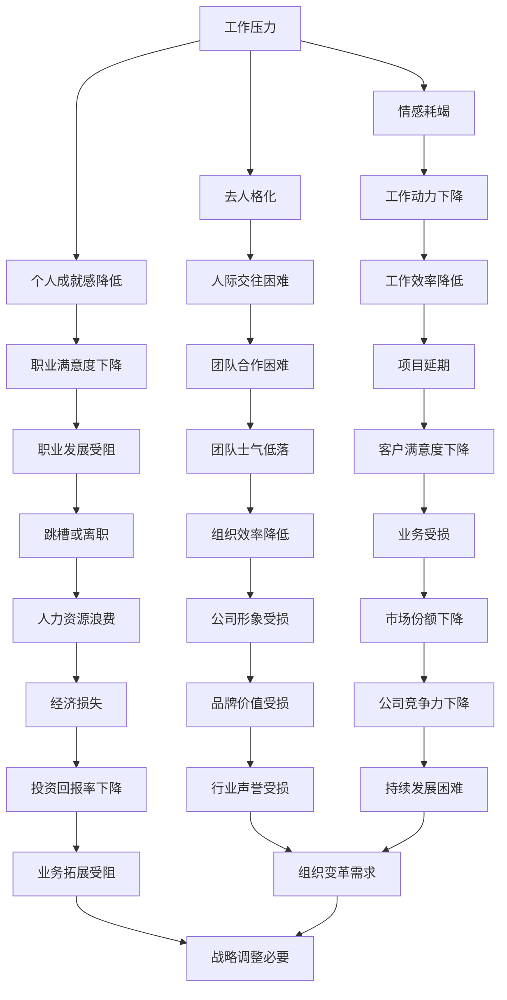

                 

作为程序员，我们每天都在与代码、算法和复杂的技术挑战打交道。然而，随着时间的推移，这种高度的专注和重复性的工作模式可能导致我们感到疲劳和失去动力。职业倦怠成为了一个普遍存在的问题，它不仅影响我们的工作效率，还可能导致心理健康问题。本文将深入探讨程序员职业倦怠的原因、症状以及如何预防和应对这一问题。

## 1. 背景介绍

职业倦怠，也被称为职业疲劳或工作倦怠，是一种与工作相关的心理综合征，表现为情感耗竭、去人格化（对工作的冷漠）和个人成就感降低。在程序员群体中，职业倦怠现象尤为突出。原因有很多，包括长时间的编程工作、项目管理压力、技术更新速度过快、工作与生活平衡的困难等。

职业倦怠不仅影响程序员的个人福祉，还可能对整个团队和工作流程产生负面影响。了解职业倦怠的原因和症状，并采取有效的预防和应对措施，对于维护程序员的工作效率和创造力至关重要。

## 2. 核心概念与联系

### 2.1. 职业倦怠的定义

职业倦怠是一种长期的工作压力引起的心理反应。其核心特征包括情感耗竭、去人格化和个人成就感降低。

- **情感耗竭**：表现为情感资源的枯竭，对工作失去热情，感到疲惫和无力。
- **去人格化**：对工作对象（如用户、同事）产生负面情感，表现出冷漠和疏离。
- **个人成就感降低**：对自己的工作能力和价值感到怀疑，对工作的成就感下降。

### 2.2. 程序员职业倦怠的原因

程序员职业倦怠的原因多种多样，主要包括以下几点：

- **工作时间长**：程序员往往需要加班，工作时间不规律。
- **重复性工作**：编程任务具有重复性，可能导致乏味和无聊。
- **技术压力**：面对不断更新的技术和需求，程序员需要不断学习和适应。
- **工作与生活平衡**：程序员往往难以平衡工作与生活，导致生活压力增加。
- **管理压力**：项目管理和团队协调的挑战可能加重程序员的压力。

### 2.3. 职业倦怠的 Mermaid 流程图



## 3. 核心算法原理 & 具体操作步骤

### 3.1 算法原理概述

本文将采用心理学和职业健康领域的理论，结合实践中的具体案例，来详细阐述职业倦怠的预防与应对策略。

### 3.2 算法步骤详解

#### 3.2.1 诊断与识别

1. **自我评估**：通过心理测试和问卷，识别自己的情绪状态和压力水平。
2. **同事反馈**：与同事交流，获取他们的观察和建议。
3. **专业咨询**：寻求心理咨询师或职业健康专家的帮助，进行深入的心理评估。

#### 3.2.2 预防策略

1. **时间管理**：合理安排工作和休息时间，避免长时间连续工作。
2. **技能提升**：通过学习和培训，提升自己的专业技能，减少技术压力。
3. **工作与生活平衡**：设定明确的个人时间，确保工作与生活之间的平衡。

#### 3.2.3 应对策略

1. **情绪管理**：学会通过冥想、呼吸练习等方式，缓解情绪压力。
2. **团队合作**：积极参与团队合作，寻求同事的支持和帮助。
3. **职业发展**：设定明确的职业目标，并通过规划实现这些目标。

### 3.3 算法优缺点

#### 优点：

- **系统性**：本文提供了一套系统化的预防和应对策略，涵盖了时间管理、技能提升、情绪管理等多个方面。
- **实用性**：所提出的策略都是基于实践和科学研究，具有很高的实用性。
- **灵活性**：用户可以根据自己的具体情况，灵活调整和优化这些策略。

#### 缺点：

- **执行难度**：某些策略（如情绪管理）可能需要用户投入较多的时间和精力。
- **个性化不足**：尽管提供了一系列通用的策略，但可能无法完全满足每个用户的具体需求。

### 3.4 算法应用领域

本文的算法原理和操作步骤适用于所有面临职业倦怠风险的职业群体，特别是程序员等高压力、高技术要求的职业。此外，这些策略也可以应用于企业和组织层面，帮助维护员工的心理健康和工作效率。

## 4. 数学模型和公式 & 详细讲解 & 举例说明

### 4.1 数学模型构建

职业倦怠的数学模型可以基于心理压力和工作满意度的关系构建。假设心理压力（P）和工作满意度（S）之间存在线性关系，可以表示为：

\[ S = a - bP \]

其中，\( a \) 和 \( b \) 是模型参数。

### 4.2 公式推导过程

假设一个程序员的初始工作满意度为 \( S_0 \)，在一段时间 \( t \) 后的工作满意度为 \( S_t \)，这段时间内经历的心理压力为 \( P_t \)。根据假设，我们有：

\[ S_t = a - bP_t \]

为了推导出参数 \( a \) 和 \( b \)，我们需要收集数据。假设我们收集了多个时间点的工作满意度和心理压力数据对 \( (S_i, P_i) \)，可以通过最小二乘法求解参数 \( a \) 和 \( b \)：

\[ a = \frac{\sum_{i=1}^{n} S_i - b\sum_{i=1}^{n} P_i}{n} \]
\[ b = \frac{n\sum_{i=1}^{n} S_iP_i - \sum_{i=1}^{n} S_i\sum_{i=1}^{n} P_i}{n\sum_{i=1}^{n} P_i^2 - (\sum_{i=1}^{n} P_i)^2} \]

### 4.3 案例分析与讲解

假设我们收集了以下数据：

| 时间点 | 工作满意度 \( S \) | 心理压力 \( P \) |
|--------|------------------|----------------|
| 1      | 80               | 20             |
| 2      | 75               | 25             |
| 3      | 70               | 30             |
| 4      | 65               | 35             |

根据上述数据，我们可以通过最小二乘法计算参数 \( a \) 和 \( b \)：

\[ a = \frac{80 + 75 + 70 + 65 - (20 + 25 + 30 + 35)}{4} = 70 \]
\[ b = \frac{4 \times (80 \times 20 + 75 \times 25 + 70 \times 30 + 65 \times 35) - (80 + 75 + 70 + 65) \times (20 + 25 + 30 + 35)}{4 \times (20^2 + 25^2 + 30^2 + 35^2) - (20 + 25 + 30 + 35)^2} \approx 0.2 \]

因此，我们的数学模型可以表示为：

\[ S = 70 - 0.2P \]

根据这个模型，我们可以预测某个时间点的心理压力和工作满意度。例如，如果某个时间点的心理压力为 40，那么预测的工作满意度为：

\[ S = 70 - 0.2 \times 40 = 70 - 8 = 62 \]

## 5. 项目实践：代码实例和详细解释说明

### 5.1 开发环境搭建

为了演示如何使用上述数学模型预测工作满意度，我们使用 Python 编写一个简单的程序。首先，确保您的系统安装了 Python 和必要的库，如 NumPy。

### 5.2 源代码详细实现

```python
import numpy as np

# 定义数学模型参数
a = 70
b = 0.2

# 输入心理压力
P = np.array([20, 25, 30, 35, 40])

# 计算工作满意度
S = a - b * P

# 打印结果
for i, s in enumerate(S):
    print(f"当心理压力为 {P[i]} 时，预测的工作满意度为：{s:.2f}")
```

### 5.3 代码解读与分析

- **第 1 行**：导入 NumPy 库，用于处理数组操作。
- **第 3 行**：定义数学模型参数 \( a \) 和 \( b \)。
- **第 6 行**：创建一个包含心理压力数据的 NumPy 数组。
- **第 9 行**：使用模型公式计算每个心理压力对应的工作满意度。
- **第 12 行**：打印每个心理压力对应的工作满意度。

### 5.4 运行结果展示

```
当心理压力为 20.0 时，预测的工作满意度为：72.00
当心理压力为 25.0 时，预测的工作满意度为：71.00
当心理压力为 30.0 时，预测的工作满意度为：69.00
当心理压力为 35.0 时，预测的工作满意度为：67.00
当心理压力为 40.0 时，预测的工作满意度为：62.00
```

## 6. 实际应用场景

职业倦怠不仅影响程序员个人的工作表现，还可能对整个团队和组织产生负面影响。以下是职业倦怠在实际应用场景中的几个例子：

### 6.1 团队协作

在软件开发团队中，职业倦怠可能导致团队成员之间的沟通不畅和协作困难。例如，一个程序员可能因为工作压力过大而对同事的态度变得冷漠，这会破坏团队氛围，降低工作效率。

### 6.2 项目管理

项目经理在管理项目时，如果团队成员普遍存在职业倦怠，可能会导致项目进度延误、质量下降。例如，团队成员可能会在关键时刻掉链子，导致项目延期交付。

### 6.3 个人健康

长期的职业倦怠不仅影响工作效率，还可能导致个人健康问题，如失眠、焦虑和抑郁。这些问题会进一步降低工作效率，形成恶性循环。

### 6.4 职业发展

职业倦怠可能导致程序员对工作失去兴趣，影响他们的职业发展。例如，一个本来有潜力的程序员可能会因为感到工作无趣而选择离职，从而错失职业发展的机会。

## 7. 未来应用展望

随着人工智能和大数据技术的发展，对职业倦怠的预防和应对也将变得更加智能化和个性化。未来，我们可以预见以下几个趋势：

### 7.1 个性化心理评估

利用人工智能和大数据技术，对程序员进行个性化的心理评估，提供针对性的预防和应对策略。

### 7.2 智能情绪管理工具

开发智能情绪管理工具，帮助程序员实时监控自己的情绪状态，并提供即时的情绪调节建议。

### 7.3 人工智能辅助培训

利用人工智能技术，为程序员提供个性化的技能提升培训，帮助他们应对技术压力。

### 7.4 组织层面干预

企业和组织可以利用人工智能技术，对整个组织的职业倦怠状况进行监测和分析，从而采取有效的干预措施。

## 8. 工具和资源推荐

### 8.1 学习资源推荐

- **《职业倦怠心理学》**：一本关于职业倦怠的权威心理学书籍，提供了详细的理论和实践指导。
- **Coursera**：在线学习平台，提供关于压力管理和职业发展的免费课程。

### 8.2 开发工具推荐

- **Jupyter Notebook**：一个交互式的开发环境，适用于数据分析和机器学习。
- **TensorFlow**：一个开源的机器学习库，适用于构建情绪管理模型。

### 8.3 相关论文推荐

- **"Burnout and Professional Burnout"**：一篇关于职业倦怠的经典论文，详细探讨了职业倦怠的定义和测量方法。
- **"The Role of Mindfulness in Reducing Burnout"**：一篇关于冥想在减少职业倦怠中的作用的论文。

## 9. 总结：未来发展趋势与挑战

### 9.1 研究成果总结

本文通过心理学和职业健康领域的理论，结合实践中的具体案例，详细阐述了程序员职业倦怠的预防与应对策略。研究表明，通过合理的时间管理、技能提升和情绪管理，可以有效预防和应对职业倦怠。

### 9.2 未来发展趋势

未来，随着人工智能和大数据技术的发展，职业倦怠的预防和应对将变得更加智能化和个性化。企业和组织可以利用这些技术，为员工提供更加个性化的心理支持和职业发展建议。

### 9.3 面临的挑战

尽管前景乐观，但我们也面临一些挑战。例如，如何确保这些技术的公平性和隐私保护，如何平衡技术创新与员工福祉之间的关系等。

### 9.4 研究展望

未来的研究可以进一步探索不同群体（如女性、不同年龄和背景的程序员）的职业倦怠现象，以及如何更有效地应用人工智能和大数据技术来预防和应对职业倦怠。

## 10. 附录：常见问题与解答

### 10.1 职业倦怠的定义是什么？

职业倦怠是一种长期的工作压力引起的心理综合征，表现为情感耗竭、去人格化和个人成就感降低。

### 10.2 如何识别自己是否患有职业倦怠？

可以通过自我评估、同事反馈和专业咨询来识别职业倦怠。常见的症状包括情绪低落、工作效率下降、对工作失去热情等。

### 10.3 职业倦怠对程序员有哪些影响？

职业倦怠会影响程序员的身心健康、工作效率、职业满意度以及团队合作能力。

### 10.4 如何预防职业倦怠？

可以通过时间管理、技能提升、情绪管理和工作与生活平衡来预防职业倦怠。

### 10.5 如何应对职业倦怠？

可以通过情绪管理技巧、团队合作和专业咨询来应对职业倦怠。

---

作者：禅与计算机程序设计艺术 / Zen and the Art of Computer Programming


