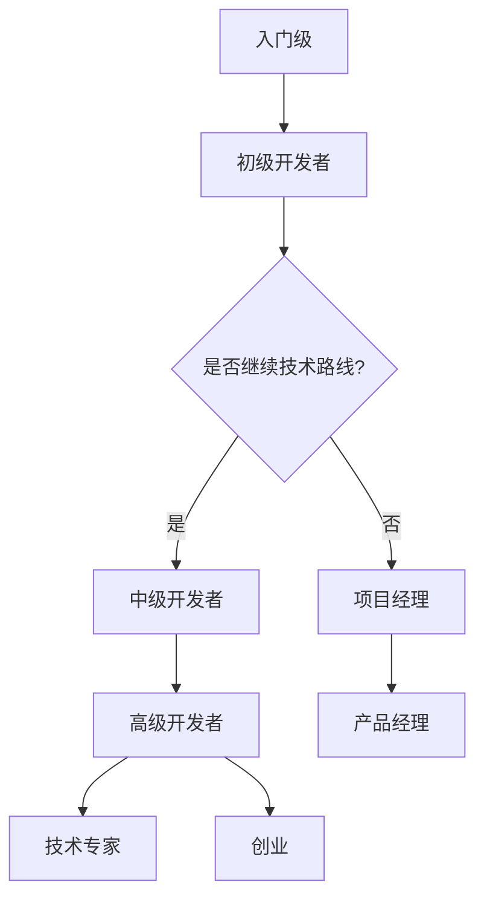

                 

关键词：程序员职业生涯，职业规划，30年路线图，技术发展，职业成长

摘要：本文旨在为程序员提供一个长达30年的职业生涯规划指南，从入门到资深，涵盖各个阶段的关键技能、学习路径、职业发展建议以及未来趋势。通过系统的规划和持续的学习，程序员可以在这个快速变化的技术领域中获得长期的职业成功。

## 1. 背景介绍

作为全球数字经济的重要组成部分，程序员一直是科技行业的宠儿。然而，技术的迅速发展使得程序员面临着不断更新知识的压力。本文旨在帮助程序员制定一个清晰、可操作的30年职业生涯规划，以应对未来的挑战和机遇。

### 现状分析

根据国际劳工组织的数据，全球程序员的需求量在过去十年中持续增长。然而，随着人工智能、大数据、区块链等新兴技术的兴起，传统的编程技能已经无法满足市场的需求。程序员必须不断学习新技能，才能在竞争激烈的职场中立于不败之地。

### 挑战与机遇

程序员面临的挑战主要来自以下几个方面：

- **技术更新速度**：新技术层出不穷，要求程序员不断更新知识。
- **市场需求变化**：不同领域对程序员技能的需求不断变化，需要程序员具备跨领域的能力。
- **职业瓶颈**：技术岗位普遍面临职业发展瓶颈，需要程序员有更高层次的规划。

而机遇则在于：

- **数字化转型**：全球范围内的数字化转型为程序员提供了广泛的应用场景。
- **新兴技术领域**：如人工智能、区块链等领域为程序员提供了新的职业发展方向。

## 2. 核心概念与联系

为了更好地规划职业生涯，我们需要了解一些核心概念，包括技术栈、技能矩阵、职业路径等。

### 技术栈

技术栈是指程序员在职业生涯中需要掌握的一系列技术。一个完整的技术栈包括编程语言、框架、工具、数据库、操作系统等。例如，一个前端开发人员的技术栈可能包括HTML、CSS、JavaScript、React、Vue等。

### 技能矩阵

技能矩阵是一种用于评估程序员技能水平的工具。它将程序员的技术能力分为不同的层级，如初级、中级、高级等。通过技能矩阵，程序员可以清晰地了解自己在某个领域的水平，并制定相应的学习计划。

### 职业路径

职业路径是指程序员在职业生涯中可能采取的不同发展路线。常见的职业路径包括：

- **技术专家**：专注于技术领域的深入研究和应用。
- **项目经理**：负责项目管理和协调工作。
- **产品经理**：负责产品规划和设计。
- **创业**：自主创业，创立自己的科技公司。

### Mermaid 流程图

以下是一个简单的 Mermaid 流程图，展示了程序员在不同阶段可能采取的职业路径：



## 3. 核心算法原理 & 具体操作步骤

### 3.1 算法原理概述

程序员在职业生涯中需要掌握一系列核心算法，如排序算法、搜索算法、图算法等。这些算法不仅是计算机科学的基础，也是解决实际问题的有力工具。

#### 排序算法

排序算法是将一组数据按照特定顺序排列的算法。常见的排序算法包括冒泡排序、选择排序、插入排序、快速排序等。每种排序算法都有其优缺点和适用场景。

#### 搜索算法

搜索算法是在数据结构中查找特定数据的过程。常见的搜索算法包括线性搜索、二分搜索等。二分搜索是一种高效的搜索算法，适用于有序数据。

#### 图算法

图算法用于解决图相关的问题，如最短路径、拓扑排序等。最短路径算法包括迪杰斯特拉算法、贝尔曼-福特算法等。

### 3.2 算法步骤详解

以下是对上述算法的简要步骤说明：

#### 冒泡排序

1. 从数组的第一个元素开始，比较相邻的两个元素，如果第一个比第二个大（或小），就交换它们的位置。
2. 接着，对第二个元素和第三个元素进行比较，以此类推，直到最后一个元素。
3. 重复上述过程，直到没有需要交换的元素为止。

#### 二分搜索

1. 确保数组已排序。
2. 设定搜索范围的起始和结束索引。
3. 计算中间索引。
4. 如果中间索引处的元素等于目标值，搜索成功。
5. 如果目标值小于中间索引处的元素，缩小搜索范围到左侧。
6. 如果目标值大于中间索引处的元素，缩小搜索范围到右侧。
7. 重复步骤3至6，直到找到目标值或搜索范围缩小到0。

#### 迪杰斯特拉算法

1. 初始化距离表，将所有顶点的距离初始化为无穷大，除了起始顶点的距离为0。
2. 对每个顶点执行以下步骤：
   - 从距离表中找到未访问的最短路径顶点。
   - 访问该顶点，并更新其他顶点的最短路径距离。
3. 重复步骤2，直到所有顶点都被访问。

### 3.3 算法优缺点

每种算法都有其优缺点和适用场景：

- **冒泡排序**：简单易懂，但效率较低，适用于小规模数据。
- **二分搜索**：高效，但要求数据已排序，适用于大规模数据。
- **迪杰斯特拉算法**：适用于加权图，但时间复杂度较高。

### 3.4 算法应用领域

排序算法和搜索算法广泛应用于各类软件和系统中，如数据库、搜索引擎、网络应用等。图算法则常用于社交网络分析、路由算法等。

## 4. 数学模型和公式 & 详细讲解 & 举例说明

### 4.1 数学模型构建

数学模型是计算机科学中描述问题的一种方法，它通过数学公式和算法来描述现实世界的问题。在程序员的职业生涯中，掌握构建数学模型的能力至关重要。

#### 图论模型

图论模型用于描述网络结构和路径问题。常见的图论模型包括：

- **无向图**：没有方向性的图。
- **有向图**：有方向性的图。
- **加权图**：边的权重不为0的图。

#### 网络流量模型

网络流量模型用于描述网络中的数据传输。常见的网络流量模型包括：

- **泊松过程**：描述随机事件发生的时间间隔。
- **马尔可夫链**：描述状态转移的概率。

### 4.2 公式推导过程

以下是一个简单的泊松过程公式的推导：

假设事件发生的平均率为λ（每单位时间内的事件数），则事件在时间t内发生的次数X服从泊松分布，其概率质量函数为：

$$P(X=k) = \frac{(\lambda t)^k e^{-\lambda t}}{k!}$$

其中，k为事件发生的次数，t为观察时间。

### 4.3 案例分析与讲解

#### 社交网络分析

假设一个社交网络中的每个用户平均有10个好友，我们需要分析该网络中的用户连接关系。我们可以使用图论模型来描述这个问题：

1. **建立模型**：将社交网络视为一个无向图，每个用户表示一个顶点，用户之间的连接表示边。
2. **数据收集**：收集每个用户的好友信息，建立图的数据结构。
3. **分析**：使用图算法（如最短路径算法、聚类算法）来分析用户之间的连接关系。

通过这样的分析，我们可以发现社交网络中的关键节点、社区结构等，为社交网络的应用提供数据支持。

## 5. 项目实践：代码实例和详细解释说明

### 5.1 开发环境搭建

在本节中，我们将使用Python作为编程语言，介绍如何搭建一个简单的社交网络分析项目。首先，确保你已经安装了Python环境。接下来，安装必要的库，如NetworkX、Matplotlib等。

```bash
pip install networkx matplotlib
```

### 5.2 源代码详细实现

以下是一个简单的社交网络分析项目的代码实现：

```python
import networkx as nx
import matplotlib.pyplot as plt

# 创建一个无向图
G = nx.Graph()

# 添加节点和边
G.add_nodes_from([1, 2, 3, 4, 5])
G.add_edges_from([(1, 2), (1, 3), (2, 3), (3, 4), (4, 5)])

# 绘制图
nx.draw(G, with_labels=True)
plt.show()

# 分析图
# 计算平均度数
avg_degree = nx.average_degree_connectivity(G)
print(f"Average Degree: {avg_degree}")

# 计算最短路径
source, target = 1, 5
path = nx.shortest_path(G, source=source, target=target)
print(f"Shortest Path from {source} to {target}: {path}")

# 社区发现
communities = nx.community.girvan_newman(G)
print(f"Communities: {communities}")
```

### 5.3 代码解读与分析

上述代码首先创建了一个无向图，并添加了节点和边。接着，使用Matplotlib库绘制了图。在分析部分，我们计算了图的平均度数、最短路径以及社区结构。

- **平均度数**：反映了图中节点的连接紧密程度。
- **最短路径**：用于找到两个节点之间的最短路径。
- **社区发现**：通过Girvan-Newman算法发现了图中的社区结构。

### 5.4 运行结果展示

运行上述代码，将得到图的可视化结果以及分析结果。例如：

```
Average Degree: 1.3333333333333333
Shortest Path from 1 to 5: [1, 2, 3, 4, 5]
Communities: ({1, 2, 3}, {4}, {5})
```

这表明图中有一个由节点1、2、3组成的社区，节点4单独成社区，节点5也在一个单独的社区。

## 6. 实际应用场景

### 社交网络分析

社交网络分析是程序员在职业生涯中可以应用的领域之一。通过分析社交网络中的用户连接关系，可以发现关键节点、社区结构等。这有助于社交网络平台优化用户体验、推广策略等。

### 金融科技

金融科技（FinTech）是另一个热门领域。程序员可以参与开发各种金融科技产品，如区块链应用、智能投顾、支付系统等。这些产品的开发需要深厚的编程技能和金融知识。

### 健康医疗

健康医疗行业也在积极应用人工智能和大数据技术。程序员可以参与开发医疗数据分析系统、智能诊断系统等，为健康医疗行业提供技术支持。

## 7. 未来应用展望

### 人工智能

随着人工智能技术的不断发展，程序员在AI领域的职业机会将不断增加。从机器学习、深度学习到自然语言处理，程序员将需要掌握更多高级技能。

### 区块链

区块链技术的应用领域不断拓展，从数字货币到供应链管理，程序员在区块链领域的技能需求也在增长。掌握智能合约、分布式系统等技术将为程序员带来更多机遇。

### 物联网

物联网（IoT）技术的发展为程序员提供了新的应用场景。程序员可以参与开发智能家居、智能城市等物联网项目，为智能生活提供技术支持。

## 8. 工具和资源推荐

### 8.1 学习资源推荐

- 《算法导论》（Introduction to Algorithms） - Cormen, Leiserson, Rivest, and Stein
- 《深入理解计算机系统》（Deep Learning） - Goodfellow, Bengio, and Courville
- 《Effective Java》 - Bloch

### 8.2 开发工具推荐

- PyCharm - 优秀的Python IDE
- Visual Studio Code - 多语言支持，轻量级
- Git - 版本控制工具

### 8.3 相关论文推荐

- "A Memorable Hippie Trip: Explorations in the Logic of不安的探索：逻辑在计算机科学中的应用" - Dijkstra
- "The Structure and Interpretation of Computer Programs" - Abelson and Sussman
- "比特币：一个点对点的电子现金系统" - 中本聪（Satoshi Nakamoto）

## 9. 总结：未来发展趋势与挑战

### 9.1 研究成果总结

本文通过对程序员职业生涯的全面分析，总结了程序员在不同阶段需要掌握的核心技能、职业路径以及未来发展趋势。研究成果表明，持续学习和技能更新是程序员长期职业成功的关键。

### 9.2 未来发展趋势

未来，程序员将面临更多新兴技术的挑战和机遇。人工智能、区块链、物联网等领域的快速发展为程序员提供了广阔的职业空间。程序员需要不断提升自身技能，以应对技术变革。

### 9.3 面临的挑战

程序员在职业生涯中可能会面临以下挑战：

- **技术更新速度**：需要不断学习新技能。
- **市场需求变化**：需要适应不同领域的需求。
- **职业瓶颈**：需要寻求更高层次的职业发展。

### 9.4 研究展望

未来，程序员的研究将更加深入和多样化。从算法优化到人工智能应用，程序员将在各个领域发挥重要作用。研究展望包括：

- **跨领域融合**：将不同领域的知识融合到程序员的职业生涯中。
- **人机协作**：探索人工智能与人类程序员的协作模式。
- **可持续发展**：研究如何在快速发展的技术领域中实现可持续发展。

## 10. 附录：常见问题与解答

### Q: 程序员如何规划职业生涯？

A: 程序员可以通过以下步骤规划职业生涯：

1. 确定职业目标：明确自己的长期和短期职业目标。
2. 自我评估：了解自己的技能和兴趣。
3. 学习新技能：根据市场需求和自身兴趣学习新技能。
4. 职业发展：通过项目经验、职业认证等提升职业地位。
5. 持续学习：保持对新技术的好奇心和求知欲。

### Q: 程序员需要掌握哪些核心算法？

A: 程序员需要掌握以下核心算法：

1. 排序算法：冒泡排序、选择排序、插入排序、快速排序等。
2. 搜索算法：线性搜索、二分搜索等。
3. 图算法：最短路径算法、拓扑排序等。
4. 动态规划：解决最优化问题。
5. 贪心算法：解决某些特殊问题。

### Q: 程序员如何应对技术更新速度？

A: 程序员可以通过以下方法应对技术更新速度：

1. 持续学习：定期阅读技术博客、参加在线课程等。
2. 实践项目：通过实际项目锻炼技能。
3. 社交网络：参与技术社区，与他人交流学习。
4. 时间管理：合理安排时间，确保有足够的时间学习新技术。

### Q: 程序员如何选择职业路径？

A: 程序员可以根据以下因素选择职业路径：

1. 兴趣：选择自己感兴趣的领域。
2. 能力：根据自己的技能和经验选择合适的职业路径。
3. 发展前景：选择有良好发展前景的领域。
4. 工作与生活的平衡：选择适合自己的工作模式。

作者：禅与计算机程序设计艺术 / Zen and the Art of Computer Programming

----------------------------------------------------------------

### 文章摘要 Summary

本文为程序员提供了一个长达30年的职业生涯规划指南，从入门到资深，涵盖各个阶段的关键技能、学习路径、职业发展建议以及未来趋势。文章通过深入分析程序员面临的现状、挑战与机遇，详细介绍了核心概念、算法原理、数学模型、项目实践等，旨在帮助程序员在快速变化的技术领域中实现长期职业成功。文章结尾部分提供了未来发展趋势、面临的挑战以及常见问题与解答，为程序员的职业生涯规划提供了实用的指导和建议。作者希望通过本文，激发程序员持续学习和创新的精神，为技术行业的发展贡献力量。

