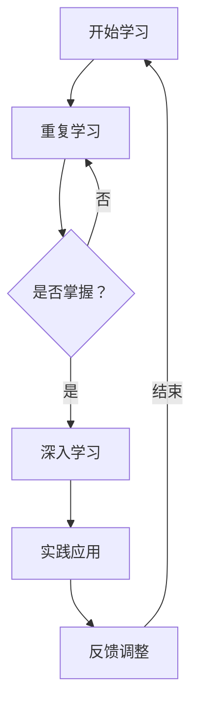
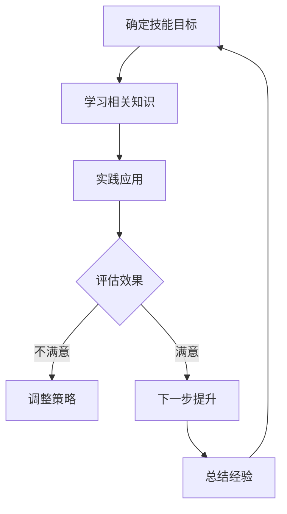

                 

关键词：程序员、职业生涯规划、持续学习、技术成长、技能提升

> 摘要：本文旨在为程序员提供一条清晰的职业生涯规划之路，通过比喻长跑运动中的训练和策略，探讨如何在信息技术领域实现持续学习和职业发展。

## 1. 背景介绍

作为一名程序员，职业生涯的成功不仅仅取决于技术水平的高低，更重要的是能否持续学习、适应变化，以及如何有效地规划职业发展路径。在信息技术飞速发展的今天，新技术层出不穷，编程语言和框架不断更迭，这使得程序员必须具备持续学习和适应能力。本文通过将程序员的职业生涯比喻为一场长跑比赛，探讨如何在长跑过程中保持稳定进步，最终实现职业上的长跑与长跑。

### 1.1 程序员面临的挑战

1. 技术更新迭代快
2. 学习压力大
3. 职业发展路径不明确
4. 竞争激烈

### 1.2 职业生涯规划的重要性

- 明确目标，减少迷茫
- 提高学习效率
- 增强职业竞争力
- 实现职业晋升

## 2. 核心概念与联系

### 2.1 持续学习

持续学习是程序员职业生涯中的核心概念。它不仅包括对新技术的掌握，还包括对现有技术的深化理解。在此，我们将使用Mermaid流程图来展示持续学习的过程：

### 2.2 技能提升

技能提升是实现职业生涯规划的关键。技能的提升不仅仅是编程技术的提升，还包括团队协作、项目管理、沟通能力等多个方面。以下是技能提升的Mermaid流程图：

## 3. 核心算法原理 & 具体操作步骤

### 3.1 算法原理概述

在程序员的职业生涯中，算法是解决问题的核心。以下是一个简单的算法原理概述，用于解决常见的问题：

- 算法思路：通过分而治之、递归调用、动态规划等方法解决问题。
- 具体步骤：首先分析问题，然后设计算法，最后实现代码并测试。

### 3.2 算法步骤详解

1. **问题分析**：理解问题的需求和约束。
2. **设计算法**：选择合适的算法，如排序、搜索、图算法等。
3. **实现代码**：将算法思路转化为代码。
4. **测试与优化**：通过测试数据验证代码的正确性和效率，进行必要的优化。

### 3.3 算法优缺点

- **优点**：提高解决问题的效率。
- **缺点**：可能增加代码复杂度，对编程能力要求较高。

### 3.4 算法应用领域

算法广泛应用于各类软件开发，如搜索算法用于搜索引擎、排序算法用于数据库排序等。

## 4. 数学模型和公式 & 详细讲解 & 举例说明

### 4.1 数学模型构建

在软件开发中，数学模型是解决问题的基础。例如，线性规划用于优化资源分配，机器学习中的数学模型用于预测和分类。

### 4.2 公式推导过程

以线性规划为例，目标函数为最大化或最小化目标变量，约束条件为线性不等式或等式。

### 4.3 案例分析与讲解

通过具体案例展示数学模型的应用，如物流优化、股票交易策略等。

## 5. 项目实践：代码实例和详细解释说明

### 5.1 开发环境搭建

首先需要搭建一个适合开发的环境，包括编程语言、开发工具和版本控制系统等。

### 5.2 源代码详细实现

以实现一个简单的排序算法为例，展示源代码的实现过程。

### 5.3 代码解读与分析

对代码进行分析，解释关键部分的实现逻辑。

### 5.4 运行结果展示

展示代码运行的结果，验证算法的正确性和效率。

## 6. 实际应用场景

### 6.1 数据分析领域

算法在数据分析中广泛应用，如数据挖掘、机器学习等。

### 6.2 人工智能领域

深度学习算法在图像识别、自然语言处理等领域具有重要作用。

### 6.3 未来应用展望

随着技术的进步，算法将在更多领域得到应用，如量子计算、区块链等。

## 7. 工具和资源推荐

### 7.1 学习资源推荐

推荐一些优秀的在线课程、书籍和社区。

### 7.2 开发工具推荐

推荐一些实用的开发工具和平台。

### 7.3 相关论文推荐

推荐一些有影响力的学术论文，供进一步研究。

## 8. 总结：未来发展趋势与挑战

### 8.1 研究成果总结

回顾过去的研究成果，总结当前的发展趋势。

### 8.2 未来发展趋势

预测未来技术的发展方向和趋势。

### 8.3 面临的挑战

分析程序员在未来可能面临的挑战。

### 8.4 研究展望

展望未来的研究方向和可能的突破。

## 9. 附录：常见问题与解答

### 9.1 如何提高学习效率？

- 制定合理的学习计划
- 定期进行自我评估
- 积极参与社区讨论

### 9.2 如何选择合适的开发工具？

- 根据项目需求选择
- 考虑个人熟练程度
- 关注社区活跃度和更新频率

### 9.3 如何处理职业生涯中的挫折？

- 保持积极的心态
- 学习解决问题的方法
- 寻求帮助和指导

---

作者：禅与计算机程序设计艺术 / Zen and the Art of Computer Programming

