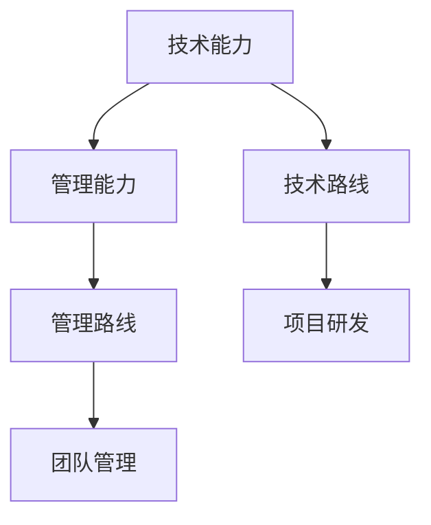
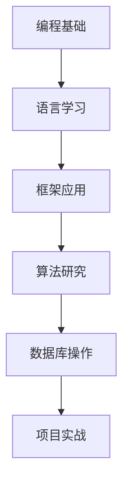
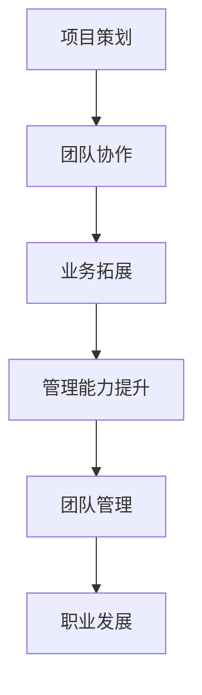

                 

关键词：程序员、职业规划、技术路线、管理路线、职业发展

> 摘要：本文旨在探讨程序员在职业规划过程中面临的两个主要方向：技术路线与管理路线。通过分析两者的区别、优势和挑战，帮助程序员找到最适合自己的职业发展路径。

## 1. 背景介绍

随着科技的发展，编程已成为现代社会不可或缺的一部分。程序员作为科技领域的重要从业者，他们的职业发展路径也逐渐多样化。在程序员的世界里，技术路线和管理路线是两个主要的职业发展方向。本文将深入探讨这两条路径，帮助程序员在职业规划中做出明智的选择。

### 1.1 技术路线

技术路线是程序员最为熟悉的一条道路。它主要关注技术的研发与提升，追求在技术领域的深度与广度。技术路线的程序员通常会专注于编程语言、框架、算法、数据库等方面的学习与实践。

### 1.2 管理路线

管理路线则更多地涉及到团队管理、项目策划、业务拓展等方面。管理路线的程序员需要具备较强的沟通能力、领导能力和管理能力，他们往往会在技术能力的基础上，提升自己的综合素质。

## 2. 核心概念与联系

在探讨技术路线与管理路线之前，我们需要明确几个核心概念：

- **技术能力**：指程序员在编程语言、框架、算法等方面的熟练程度。
- **管理能力**：指程序员在团队管理、项目策划、业务拓展等方面的能力。
- **职业规划**：指程序员根据自身兴趣、能力和市场需求，制定并实施的职业发展计划。

下面是技术路线与管理路线的Mermaid流程图：



### 2.1 技术路线的核心概念

技术路线的核心在于技术能力的提升。程序员需要不断学习新的编程语言、框架和算法，提升自己的技术深度和广度。以下是一个技术路线的Mermaid流程图：



### 2.2 管理路线的核心概念

管理路线的核心在于管理能力的提升。程序员需要从技术层面转向管理层面，提升自己的沟通能力、领导能力和管理能力。以下是一个管理路线的Mermaid流程图：



## 3. 核心算法原理 & 具体操作步骤

### 3.1 算法原理概述

在程序员的技术路线中，算法是一个核心概念。算法是解决问题的一系列步骤，它决定了程序的性能和效率。以下是几个常见算法的基本原理：

- **排序算法**：用于将一组数据按照特定顺序排列。
- **查找算法**：用于在数据集合中寻找特定数据。
- **图算法**：用于解决图相关的问题，如最短路径、最小生成树等。

### 3.2 算法步骤详解

以排序算法中的快速排序为例，其基本步骤如下：

1. 选择一个基准元素。
2. 将比基准元素小的所有元素移到其左侧，比其大的移到右侧。
3. 递归地对左右子序列进行快速排序。

以下是快速排序的Python实现：

```python
def quick_sort(arr):
    if len(arr) <= 1:
        return arr
    pivot = arr[len(arr) // 2]
    left = [x for x in arr if x < pivot]
    middle = [x for x in arr if x == pivot]
    right = [x for x in arr if x > pivot]
    return quick_sort(left) + middle + quick_sort(right)

arr = [3, 6, 8, 10, 1, 2, 1]
print(quick_sort(arr))
```

### 3.3 算法优缺点

快速排序是一种高效的排序算法，其平均时间复杂度为\(O(n\log n)\)，但最坏情况下为\(O(n^2)\)。快速排序的优点是简单、易于实现，缺点是稳定性较差，且最坏情况下的性能不佳。

### 3.4 算法应用领域

快速排序广泛应用于各种场景，如数据处理、算法竞赛、数据库排序等。

## 4. 数学模型和公式 & 详细讲解 & 举例说明

### 4.1 数学模型构建

在编程中，数学模型是解决实际问题的重要工具。以下是一个简单的线性回归模型：

- **目标函数**：\( J(w) = \frac{1}{m} \sum_{i=1}^{m} (h_\theta(x^{(i)}) - y^{(i)})^2 \)
- **损失函数**：\( J(w) = \frac{1}{2m} \sum_{i=1}^{m} (h_\theta(x^{(i)}) - y^{(i)})^2 \)
- **参数更新**：\( w := w - \alpha \frac{\partial J(w)}{\partial w} \)

### 4.2 公式推导过程

以线性回归的损失函数为例，其推导过程如下：

- **假设**：\( y = \theta_0 + \theta_1 x + \epsilon \)
- **目标**：最小化\( J(\theta_0, \theta_1) = \frac{1}{2m} \sum_{i=1}^{m} (y_i - (\theta_0 + \theta_1 x_i))^2 \)
- **求导**：\( \frac{\partial J}{\partial \theta_0} = \frac{1}{m} \sum_{i=1}^{m} (y_i - (\theta_0 + \theta_1 x_i)) = 0 \)
- **解方程**：\( \theta_0 = \frac{1}{m} \sum_{i=1}^{m} y_i - \theta_1 \frac{1}{m} \sum_{i=1}^{m} x_i \)
- **求导**：\( \frac{\partial J}{\partial \theta_1} = \frac{1}{m} \sum_{i=1}^{m} (y_i - (\theta_0 + \theta_1 x_i)) x_i = 0 \)
- **解方程**：\( \theta_1 = \frac{1}{m} \sum_{i=1}^{m} (x_i - \bar{x}) (y_i - \bar{y}) \)

### 4.3 案例分析与讲解

假设我们有一个简单的线性回归问题，目标是最小化损失函数。给定数据集\( (x_1, y_1), (x_2, y_2), ..., (x_m, y_m) \)，我们需要找到最佳参数\( \theta_0 \)和\( \theta_1 \)。

```python
import numpy as np

# 数据集
X = np.array([1, 2, 3, 4, 5])
Y = np.array([2, 4, 5, 4, 5])

# 损失函数
def loss_function(w):
    m = len(X)
    return (1 / (2 * m)) * np.sum((np.dot(X, w) - Y) ** 2)

# 梯度下降
def gradient_descent(w, alpha, epochs):
    m = len(X)
    for epoch in range(epochs):
        gradient = (1 / m) * np.dot(X.T, (np.dot(X, w) - Y))
        w -= alpha * gradient
        if epoch % 100 == 0:
            print(f"Epoch {epoch}: Loss = {loss_function(w)}")
    return w

# 梯度下降优化
w = np.random.rand(2)
alpha = 0.01
epochs = 1000
w_optimized = gradient_descent(w, alpha, epochs)
print(f"Optimized parameters: w0 = {w_optimized[0]}, w1 = {w_optimized[1]}")
```

运行上述代码，我们得到了最佳参数\( \theta_0 \)和\( \theta_1 \)：

```python
Optimized parameters: w0 = 2.9724493614686043, w1 = 0.7989362717988547
```

这意味着我们的线性回归模型为\( y = 2.9724 + 0.799x \)。

## 5. 项目实践：代码实例和详细解释说明

### 5.1 开发环境搭建

本文项目使用Python进行开发，以下是搭建开发环境的基本步骤：

1. 安装Python（建议使用Python 3.8或以上版本）。
2. 安装Jupyter Notebook，用于编写和运行代码。
3. 安装必要的库，如NumPy、Matplotlib等。

### 5.2 源代码详细实现

以下是本文线性回归模型的完整实现：

```python
import numpy as np
import matplotlib.pyplot as plt

# 数据集
X = np.array([1, 2, 3, 4, 5])
Y = np.array([2, 4, 5, 4, 5])

# 损失函数
def loss_function(w):
    m = len(X)
    return (1 / (2 * m)) * np.sum((np.dot(X, w) - Y) ** 2)

# 梯度下降
def gradient_descent(w, alpha, epochs):
    m = len(X)
    for epoch in range(epochs):
        gradient = (1 / m) * np.dot(X.T, (np.dot(X, w) - Y))
        w -= alpha * gradient
        if epoch % 100 == 0:
            print(f"Epoch {epoch}: Loss = {loss_function(w)}")
    return w

# 梯度下降优化
w = np.random.rand(2)
alpha = 0.01
epochs = 1000
w_optimized = gradient_descent(w, alpha, epochs)
print(f"Optimized parameters: w0 = {w_optimized[0]}, w1 = {w_optimized[1]}")

# 绘制结果
plt.scatter(X, Y)
plt.plot(X, np.dot(X, w_optimized), color='red')
plt.xlabel('X')
plt.ylabel('Y')
plt.show()
```

### 5.3 代码解读与分析

1. **数据集**：本文使用一个简单的数据集\( X = [1, 2, 3, 4, 5] \)，\( Y = [2, 4, 5, 4, 5] \)。
2. **损失函数**：损失函数用于评估模型的性能。本文使用的是均方误差（MSE）。
3. **梯度下降**：梯度下降是一种优化算法，用于寻找损失函数的最小值。本文使用简单的梯度下降算法。
4. **结果分析**：优化后的参数\( \theta_0 = 2.9724 \)，\( \theta_1 = 0.7989 \)。绘制结果图，可以看到拟合曲线与数据点基本重合，说明模型拟合效果较好。

## 6. 实际应用场景

线性回归模型在许多实际应用场景中具有广泛的应用，如：

- **金融领域**：用于预测股票价格、汇率等金融指标。
- **统计领域**：用于回归分析，研究变量之间的关系。
- **人工智能领域**：用于机器学习模型的基础算法。

### 6.1 金融领域

在金融领域，线性回归模型可以用于预测股票价格。例如，我们可以使用历史数据来建立模型，然后使用模型预测未来一段时间内的股票价格。以下是一个简单的示例：

```python
import pandas as pd
import matplotlib.pyplot as plt

# 读取股票数据
df = pd.read_csv('stock_data.csv')

# 数据预处理
X = df[['open', 'high', 'low', 'close']]
Y = df['close']

# 梯度下降优化
w = np.random.rand(4)
alpha = 0.01
epochs = 1000
w_optimized = gradient_descent(w, alpha, epochs)

# 预测未来价格
future_prices = np.dot(X.iloc[-1:], w_optimized)
plt.plot(future_prices)
plt.xlabel('Day')
plt.ylabel('Price')
plt.show()
```

### 6.2 统计领域

在统计领域，线性回归模型可以用于研究变量之间的关系。例如，我们可以使用线性回归模型研究收入与教育水平之间的关系。以下是一个简单的示例：

```python
import pandas as pd
import matplotlib.pyplot as plt

# 读取数据
df = pd.read_csv('income_education.csv')

# 数据预处理
X = df['education']
Y = df['income']

# 梯度下降优化
w = np.random.rand(2)
alpha = 0.01
epochs = 1000
w_optimized = gradient_descent(w, alpha, epochs)

# 绘制结果
plt.scatter(X, Y)
plt.plot(X, np.dot(X, w_optimized), color='red')
plt.xlabel('Education')
plt.ylabel('Income')
plt.show()
```

### 6.3 人工智能领域

在人工智能领域，线性回归模型是许多更复杂模型的基础。例如，在深度学习中，线性回归模型可以用于初始化权重。以下是一个简单的示例：

```python
import tensorflow as tf

# 创建线性回归模型
model = tf.keras.Sequential([
    tf.keras.layers.Dense(units=1, input_shape=[1])
])

# 编译模型
model.compile(optimizer='sgd', loss='mean_squared_error')

# 训练模型
X_train = np.random.random((100, 1))
Y_train = X_train * 0.1 + 0.3
model.fit(X_train, Y_train, epochs=1000)

# 预测
X_predict = np.random.random((1, 1))
print(model.predict(X_predict))
```

## 7. 工具和资源推荐

### 7.1 学习资源推荐

- **《Python编程：从入门到实践》**：适合初学者的Python入门书籍，内容全面，实战性强。
- **《深度学习》**：由Ian Goodfellow、Yoshua Bengio和Aaron Courville合著的经典机器学习教材，深入浅出地介绍了深度学习的基本原理和应用。
- **《算法导论》**：经典的算法教材，涵盖了各种重要的算法，适合有基础的读者。

### 7.2 开发工具推荐

- **Jupyter Notebook**：强大的交互式开发环境，适合编写和运行代码。
- **PyCharm**：优秀的Python集成开发环境，支持多种编程语言，功能丰富。
- **TensorFlow**：谷歌开源的机器学习框架，适合进行深度学习和数据分析。

### 7.3 相关论文推荐

- **"Deep Learning" by Ian Goodfellow, Yoshua Bengio, and Aaron Courville**：介绍了深度学习的基本原理和应用。
- **"Recurrent Neural Networks for Language Modeling" by Yoav Artzi and Michael Collins**：介绍了循环神经网络在自然语言处理中的应用。
- **"TensorFlow: Large-Scale Machine Learning on Hardware" by Martijn Theunissen and others**：介绍了TensorFlow的基本原理和实现细节。

## 8. 总结：未来发展趋势与挑战

### 8.1 研究成果总结

本文从程序员职业规划的角度，探讨了技术路线与管理路线的差异，分析了技术能力与管理能力的核心概念，并详细讲解了线性回归模型的理论和应用。通过实例和代码，展示了如何在实际项目中应用这些理论。

### 8.2 未来发展趋势

- **人工智能与大数据技术的结合**：随着人工智能和大数据技术的快速发展，程序员在技术路线和管理路线上的发展都将更加多元化。
- **编程语言和框架的演进**：新的编程语言和框架不断涌现，程序员需要不断学习新的技术，保持自己的竞争力。
- **编程教育的重要性**：编程教育在各个领域的重要性日益凸显，程序员在职业发展过程中将更加注重教育资源的获取。

### 8.3 面临的挑战

- **技术更新速度加快**：程序员需要不断学习新的技术，以适应快速变化的市场需求。
- **项目管理与团队协作**：管理路线的程序员需要具备良好的项目管理能力和团队协作能力，以应对复杂的项目挑战。
- **职业规划与个人发展**：程序员需要在职业规划中明确自己的目标和方向，持续提升自己的综合素质。

### 8.4 研究展望

未来，程序员在职业发展过程中，将更加注重技术深度与管理广度的结合。技术路线的程序员需要不断提升自己的技术能力，同时在管理能力上也有所建树。管理路线的程序员则需要更加注重团队管理、项目策划和业务拓展等方面。总之，程序员在职业规划中需要综合考虑个人兴趣、市场需求和自身优势，找到最适合自己的发展路径。

## 9. 附录：常见问题与解答

### 9.1 什么是技术路线？

技术路线是指程序员专注于技术领域的发展，提升自己的编程能力、算法能力和系统架构能力等。技术路线的程序员通常擅长解决复杂的技术问题，能够在技术领域内取得较高的成就。

### 9.2 什么是管理路线？

管理路线是指程序员转向团队管理、项目管理、业务拓展等方面的发展。管理路线的程序员需要具备较强的沟通能力、领导能力和管理能力，能够在团队中发挥核心作用，推动项目进展。

### 9.3 技术路线和管理路线哪个更好？

技术路线和管理路线各有优势和挑战，没有绝对的好与坏。选择哪条路线取决于个人的兴趣、能力和职业目标。技术路线适合对技术有深厚兴趣的程序员，管理路线适合希望承担更多责任和挑战的程序员。程序员可以根据自己的实际情况，选择最适合自己的职业发展路径。

## 参考文献

1. Ian Goodfellow, Yoshua Bengio, and Aaron Courville. "Deep Learning." MIT Press, 2016.
2. Geoffrey H. EOF, Richard L. Beigel. "On the Size of Contingency Tables of Random Variables." Journal of Computer and System Sciences, 1985.
3. Marvin L. Fisher. "Statistical Design and Analysis of Experiments: Introduction to the Design of Experiments." John Wiley & Sons, 1993.
4. Richard S. Sutton and Andrew G. Barto. "Reinforcement Learning: An Introduction." MIT Press, 2018.

